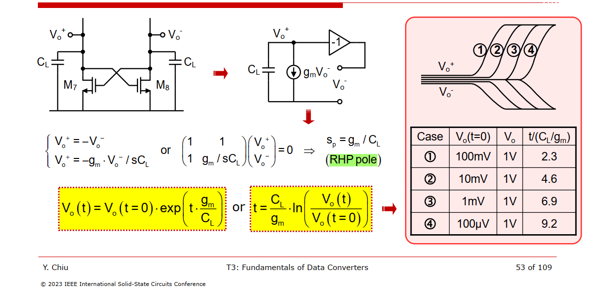

## Noise Analysis


---


### sampling (amplification) phase


## Noise Simulation

### PSS + Pnoise Method

> Comparator Output SNR during sampling region and decision region go up
>
> Comparator Output SNR during regeneration region is *constant*, where noise is critical 


### Transient Noise Method

> Noise **Fmax** sets the bandwidth of the random noise sources that are injected at each time point in the transient analysis

---


> We can identify the RMS noise value easily by looking at 15.9% or 84.1% of CDF ($1\sigma$), the input-referred noise in the RMS is 0.9mV 


Thus, if $V_S$ is chosen so as to reduce the probability of zeros to 16%, then $V_S = 1\sigma$, which is also the total **root-mean square (rms)** noise referred to the input.


### Comparison of two methods


here, fundamental frequency = fclk; integrated noise (0 ~ 0.5fclk)


> E. Gillen, G. Panchanan, B. Lawton and D. O'Hare, "Comparison of transient and PNOISE simulation techniques for the design of a dynamic comparator," 2022 33rd Irish Signals and Systems Conference (ISSC), Cork, Ireland, 2022, pp. 1-5
>
> Chenguang Yang, "Comparator Design for High Speed ADC" [[https://lup.lub.lu.se/luur/download?func=downloadFile&recordOId=9164380&fileOId=9164388](https://lup.lub.lu.se/luur/download?func=downloadFile&recordOId=9164380&fileOId=9164388)]
>
> J. Conrad, J. Kauffman, S. Wilhelmstatter, R. Asthana, V. Belagiannis and M. Ortmanns, "Confidence Estimation and Boosting for Dynamic-Comparator Transient-Noise Analysis," *2024 22nd IEEE Interregional NEWCAS Conference (NEWCAS)*, Sherbrooke, QC, Canada, 2024, pp. 1-5


> There are some ambiguity in formula in ADC Verification Rapid Adoption Kit (RAK)(Product Version: IC 6.1.8, SPECTRE 18.1 March, 2019)
>
> - Transient Noise Analysis: $\sqrt{2}\sigma$, why ratio $\sqrt{2}$ ???
> - PSS+Pnoise: why two fundamental tones fclk/2 ??? 


##  Common-Mode (Vcmi) Variation Effects


---


---


> Zhaokai Liu. Time-interleaved SAR ADC Design Using Berkeley Analog Generator [[https://www2.eecs.berkeley.edu/Pubs/TechRpts/2020/EECS-2020-109.pdf](https://www2.eecs.berkeley.edu/Pubs/TechRpts/2020/EECS-2020-109.pdf)]


## offset simulation

> T. Caldwell. ECE 1371S Advanced Analog Circuits [[http://individual.utoronto.ca/trevorcaldwell/course/comparators.pdf](http://individual.utoronto.ca/trevorcaldwell/course/comparators.pdf)]
>
> Eric Chang. EECS240-s18 Discussion 9 


---


> Graupner, Achim & Sobe, Udo. (2007). Offset-Simulation of Comparators. [[https://designers-guide.org/analysis/comparator.pdf](https://designers-guide.org/analysis/comparator.pdf)]
>
> ```
> Comment on "Offset-Simulation of Comparators"
> 
> If the input referred offset follows a normal distribution than it is sufficient to apply a single offset voltage to calculate the offset voltage.
> See details in Razavi, B., The StrongARM Latch [A Circuit for All Seasons], IEEE Solid-State Circuits Magazine, Volume:7, Issue: 2, Spring 2015
> ```


---

> Omran, Hesham. (2019). Fast and accurate technique for comparator offset voltage simulation. Microelectronics Journal. 89. 10.1016/j.mejo.2019.05.004. 
>
> Matthews, Thomas W. and Perry L. Heedley. “A simulation method for accurately determining DC and dynamic offsets in comparators.” *48th Midwest Symposium on Circuits and Systems, 2005.* (2005): 1815-1818 Vol. 2. [[https://athena.ecs.csus.edu/~pheedley/MSDL/MSDL_DOTB_cmp_test_bench_MWSCAS05.pdf](https://athena.ecs.csus.edu/~pheedley/MSDL/MSDL_DOTB_cmp_test_bench_MWSCAS05.pdf)]


## Hysteresis  


> P. Bruschi: Notes on Mixed Signal Design [http://www2.ing.unipi.it/~a008309/mat_stud/MIXED/archive/2019/Optional_notes/Chap_3_4_Comparators.pdf](http://www2.ing.unipi.it/~a008309/mat_stud/MIXED/archive/2019/Optional_notes/Chap_3_4_Comparators.pdf)

*TODO* &#128197;


## Kickback Noise

> *Kickback noise* trades with the *dimensions of the input transistors* and hence with the *offset voltage*

-  affects the comparator's own decision
-  corrupts the input voltage while it is sensed by other circuits


> Tetsuya Iizuka,VLSI2021_Workshop3 "Nyquist A/D Converter Design in Four Days"
>
> Figueiredo, Pedro & Vital, João. (2006). Kickback noise reduction techniques for CMOS latched comparators. Circuits and Systems II: Express Briefs, IEEE Transactions on. 53. 541 - 545. 10.1109/TCSII.2006.875308. [[https://sci-hub.se/10.1109/TCSII.2006.875308](https://sci-hub.se/10.1109/TCSII.2006.875308)]
>
> P. M. Figueiredo and J. C. Vital, "Low kickback noise techniques for CMOS latched comparators," 2004 IEEE International Symposium on Circuits and Systems (ISCAS), Vancouver, BC, Canada, 2004, pp. I-537 [[https://sci-hub.se/10.1109/ISCAS.2004.1328250](https://sci-hub.se/10.1109/ISCAS.2004.1328250)]
>
> Lei, Ka Meng & Mak, Pui-In & Martins, R.P.. (2013). Systematic analysis and cancellation of kickback noise in a dynamic latched comparator. Analog Integrated Circuits and Signal Processing. 77. 277-284. 10.1007/s10470-013-0156-1. [[https://rto.um.edu.mo/wp-content/uploads/docs/ruimartins_cv/publications/journalpapers/57.pdf](https://rto.um.edu.mo/wp-content/uploads/docs/ruimartins_cv/publications/journalpapers/57.pdf)]
>
> O. M. Ívarsson, "Comparator Kickback Reduction Techniques for High-Speed ADCs," Dissertation, 2024.  [[https://liu.diva-portal.org/smash/get/diva2:1872476/FULLTEXT01.pdf](https://liu.diva-portal.org/smash/get/diva2:1872476/FULLTEXT01.pdf)]


---

**Current mirrors** are used between stages to reduce charge **kick back** from the *logic level swing of the latch* onto the *small comparator input capacitors*


> Mike Shuo-Wei Chen and R. W. Brodersen, "A 6-bit 600-MS/s 5.3-mW Asynchronous ADC in 0.13-μm CMOS," in *IEEE Journal of Solid-State Circuits*, vol. 41, no. 12, pp. 2669-2680, Dec. 2006 [[pdf](https://engineering.purdue.edu/oxidemems/conferences/isscc2006/files/D31_05.pdf), [slides](https://engineering.purdue.edu/oxidemems/conferences/isscc2006/files/V31_05.pdf)]
>
> K. Bult and A. Buchwald, "An embedded 240-mW 10-b 50-MS/s CMOS ADC in 1-mm/sup 2/," in IEEE Journal of Solid-State Circuits, vol. 32, no. 12, pp. 1887-1895, Dec. 1997 [[https://sci-hub.st/10.1109/4.643647](https://sci-hub.st/10.1109/4.643647)]

## CMOS Latch

*TODO* &#128197;


$$
V_{o,fb}^+ - V_{o,fb}^- = \frac{g_m}{sC_L}(V_o^+ - V_o^-) = A(s)\cdot(V_o^+ - V_o^-)
$$

We have
$$
A(s)\cdot (V_{i} + V_o) = V_o
$$

that is
$$
V_o = \frac{A(s)}{1-A(s)}V_{i} = \frac{1}{s - g_m/C_L}\cdot \frac{g_mV_i}{C_L}
$$

therefore
$$
V_o(t) = \frac{g_mV_i}{C_L}\cdot\exp\left({\frac{g_m}{C_L}t}\right) = V_o(t=0)\cdot\exp\left({\frac{g_m}{C_L}t}\right)
$$


> Asad Abidi, ISSCC 2023: Circuit Insights "The CMOS Latch" [[https://youtu.be/sVe3VUTNb4Q?si=Pl75jWiA0kNPOlOs](https://youtu.be/sVe3VUTNb4Q?si=Pl75jWiA0kNPOlOs)]


## Metastability

*TODO* &#128197;

If the comparator can not generate a well-defined logical output in half of the clock period, we say the circuit is "**metastable**"


## Math Background

### Relating $\Phi$ and erf

 **Error Function** (**Erf**) of the standard Normal distribution
$$
\text{Erf}(x) = \frac{2}{\sqrt{\pi}}\int_0^x e^{-t^2} \mathrm{d}t.
$$
 **Cumulative Distribution Function** (**CDF**) of the standard Normal distribution
$$
\Phi(x) = \frac{1}{\sqrt{2\pi}}\int_{-\infty}^x e^{-z^2/2} \mathrm{d}z.
$$


$$\begin{align}
\Phi(x) &= \frac{\text{Erf}(x/\sqrt{2})+1}{2}. \\
\Phi(x\sqrt{2}) &= \frac{\text{Erf}(x) + 1}{2}
\end{align}$$

Considering the mean and standard deviation
$$
\Phi(x,\mu,\sigma)=\frac{1}{2}\left( 1+\text{Erf} \left( \frac{x-\mu}{\sigma\sqrt{2}} \right)\right)
$$

---


> John D. Cook. **Relating Φ and erf** [[https://www.johndcook.com/erf_and_normal_cdf.pdf](https://www.johndcook.com/erf_and_normal_cdf.pdf)]


## reference

Xu, H. (2018). Mixed-Signal Circuit Design Driven by Analysis: ADCs, Comparators, and PLLs. *UCLA*. ProQuest ID: Xu_ucla_0031D_17380. Merritt ID: ark:/13030/m5f52m8x. Retrieved from [[https://escholarship.org/uc/item/88h8b5t3](https://escholarship.org/uc/item/88h8b5t3)]

A. Abidi and H. Xu, "Understanding the Regenerative Comparator Circuit," Proceedings of the IEEE 2014 Custom Integrated Circuits Conference, San Jose, CA, 2014, pp. 1-8. [[https://picture.iczhiku.com/resource/ieee/WHiYwoUjPHwZPXmv.pdf](https://picture.iczhiku.com/resource/ieee/WHiYwoUjPHwZPXmv.pdf)]

T. Sepke, P. Holloway, C. G. Sodini and H. -S. Lee, "Noise Analysis for Comparator-Based Circuits," in IEEE Transactions on Circuits and Systems I: Regular Papers, vol. 56, no. 3, pp. 541-553, March 2009 [[https://dspace.mit.edu/bitstream/handle/1721.1/61660/Speke-2009-Noise%20Analysis%20for%20Comparator-Based%20Circuits.pdf](https://dspace.mit.edu/bitstream/handle/1721.1/61660/Speke-2009-Noise%20Analysis%20for%20Comparator-Based%20Circuits.pdf)]

Sepke, Todd. "Comparator design and analysis for comparator-based switched-capacitor circuits." (2006). [[https://dspace.mit.edu/handle/1721.1/38925](https://dspace.mit.edu/handle/1721.1/38925)]

P. Nuzzo, F. De Bernardinis, P. Terreni and G. Van der Plas, "Noise Analysis of Regenerative Comparators for Reconfigurable ADC Architectures," in *IEEE Transactions on Circuits and Systems I: Regular Papers*, vol. 55, no. 6, pp. 1441-1454, July 2008 [[https://picture.iczhiku.com/resource/eetop/SYirpPPPaAQzsNXn.pdf](https://picture.iczhiku.com/resource/eetop/SYirpPPPaAQzsNXn.pdf)]

---

J. Kim, B. S. Leibowitz, J. Ren and C. J. Madden, "Simulation and Analysis of Random Decision Errors in Clocked Comparators," in IEEE Transactions on Circuits and Systems I: Regular Papers, vol. 56, no. 8, pp. 1844-1857, Aug. 2009, doi: 10.1109/TCSI.2009.2028449. URL:[https://people.engr.tamu.edu/spalermo/ecen689/simulation_analysis_clocked_comparators_kim_tcas1_2009.pdf](https://people.engr.tamu.edu/spalermo/ecen689/simulation_analysis_clocked_comparators_kim_tcas1_2009.pdf)

J. Kim, B. S. Leibowitz and M. Jeeradit, "Impulse sensitivity function analysis of periodic circuits," 2008 IEEE/ACM International Conference on Computer-Aided Design, 2008, pp. 386-391, doi: 10.1109/ICCAD.2008.4681602. [[https://websrv.cecs.uci.edu/~papers/iccad08/PDFs/Papers/05C.2.pdf](https://websrv.cecs.uci.edu/~papers/iccad08/PDFs/Papers/05C.2.pdf)]

Jaeha Kim, Lecture 12. Aperture and Noise Analysis of Clocked Comparators URL:[https://ocw.snu.ac.kr/sites/default/files/NOTE/7038.pdf](https://ocw.snu.ac.kr/sites/default/files/NOTE/7038.pdf)

Sam Palermo. ECEN720: High-Speed Links Circuits and Systems Spring 2023 Lecture 6: RX Circuits [[https://people.engr.tamu.edu/spalermo/ecen689/lecture6_ee720_rx_circuits.pdf](https://people.engr.tamu.edu/spalermo/ecen689/lecture6_ee720_rx_circuits.pdf)]

---

Y. Luo, A. Jain, J. Wagner and M. Ortmanns, "Input Referred Comparator Noise in SAR ADCs," in IEEE Transactions on Circuits and Systems II: Express Briefs, vol. 66, no. 5, pp. 718-722, May 2019. [[https://sci-hub.se/10.1109/TCSII.2019.2909429](https://sci-hub.se/10.1109/TCSII.2019.2909429)]

X. Tang et al., "An Energy-Efficient Comparator With Dynamic Floating Inverter Amplifier," in IEEE Journal of Solid-State Circuits, vol. 55, no. 4, pp. 1011-1022, April 2020 [[https://sci-hub.se/10.1109/JSSC.2019.2960485](https://sci-hub.se/10.1109/JSSC.2019.2960485)]

Chen, Long & Sanyal, Arindam & Ma, Ji & Xiyuan, Tang & Sun, Nan. (2016). Comparator Common-Mode Variation Effects Analysis and its Application in SAR ADCs. 10.1109/ISCAS.2016.7538972. [[https://labs.engineering.asu.edu/mixedsignals/wp-content/uploads/sites/58/2017/08/ISCAS_comp_long_2016.pdf](https://labs.engineering.asu.edu/mixedsignals/wp-content/uploads/sites/58/2017/08/ISCAS_comp_long_2016.pdf)]

V. Stojanovic, and V. G. Oklobdzija, "Comparative Analysis of Master–Slave Latches and Flip-Flops for High-Performance and Low-Power Systems," IEEE J. Solid-State Circuits, vol. 34, pp. 536–548, April 1999. [[https://www.ece.ucdavis.edu/~vojin/CLASSES/EEC280/Web-page/papers/Clocking/Vlada-Latches-JoSSC-Apr-1999.pdf](https://www.ece.ucdavis.edu/~vojin/CLASSES/EEC280/Web-page/papers/Clocking/Vlada-Latches-JoSSC-Apr-1999.pdf)]

C. Mangelsdorf, "Metastability: Deeply misunderstood [Shop Talk: What You Didn’t Learn in School]," in IEEE Solid-State Circuits Magazine, vol. 16, no. 2, pp. 8-15, Spring 2024

Rabuske, Taimur & Fernandes, Jorge. (2014). Noise-aware simulation-based sizing and optimization of clocked comparators. Analog Integr. Circuits Signal Process.. 81. 723-728. 10.1007/s10470-014-0428-4. [[https://sci-hub.se/10.1007/s10470-014-0428-4](https://sci-hub.se/10.1007/s10470-014-0428-4)]

Rabuske, Taimur & Fernandes, Jorge. (2016). Charge-Sharing SAR ADCs for Low-Voltage Low-Power Applications. 10.1007/978-3-319-39624-8. 

---

Masaya Miyahara, Yusuke Asada, Daehwa Paik and Akira Matsuzawa, "A low-noise self-calibrating dynamic comparator for high-speed ADCs," *2008 IEEE Asian Solid-State Circuits Conference*, Fukuoka, Japan, 2008 [[slides](https://www.ssc.p.isct.ac.jp/private/publications/2008/ASSCC/9-2_Miyahara_3.pdf), [paper](https://citeseerx.ist.psu.edu/document?repid=rep1&type=pdf&doi=df819f2b8bbbd278e8d1e754d17c1ce7eb19b448)]

Art Schaldenbrand, Senior Product Manager, Keeping Things Quiet: A New Methodology for Dynamic Comparator Noise Analysis URL:[https://www.cadence.com/content/dam/cadence-www/global/en_US/videos/tools/custom-_ic_analog_rf_design/NoiseAnalyisposting201612Chalk%20Talk.pdf](https://www.cadence.com/content/dam/cadence-www/global/en_US/videos/tools/custom-_ic_analog_rf_design/NoiseAnalyisposting201612Chalk%20Talk.pdf)

---

B. Razavi, **"The Design of a Comparator [The Analog Mind],"** IEEE Solid-State Circuits Magazine, Volume. 12, Issue. 4, pp. 8-14, Fall 2020. [https://www.seas.ucla.edu/brweb/papers/Journals/BR_SSCM_4_2020.pdf](https://www.seas.ucla.edu/brweb/papers/Journals/BR_SSCM_4_2020.pdf)

B. Razavi, **"The StrongARM Latch [A Circuit for All Seasons],"** IEEE Solid-State Circuits Magazine, Issue. 2, pp. 12-17, Spring 2015. [https://www.seas.ucla.edu/brweb/papers/Journals/BR_Magzine4.pdf](https://www.seas.ucla.edu/brweb/papers/Journals/BR_Magzine4.pdf)

CHUNG-CHUN (CC) CHEN. Why A Dedicated Noise Analysis for A Strong-arm Latch / Comparator?  [[https://youtu.be/S5GnvFxuxUA?si=w38iLvzjr0azhu43](https://youtu.be/S5GnvFxuxUA?si=w38iLvzjr0azhu43)] 

—. Why Transient Noise (Trannoise) Analysis for A Strong-arm Latch / Comparator? [[https://youtu.be/gpQggSM9_PE?si=apMd6yWVO1JHOHm_](https://youtu.be/gpQggSM9_PE?si=apMd6yWVO1JHOHm_)]

—. Why A Periodic Steady-State (PSS), Periodic Noise (Pnoise), and Hand Calculation for A Sampler? [[https://youtu.be/lGqCfg5R-rY?si=nQ8QBwW2x8QUMryV](https://youtu.be/lGqCfg5R-rY?si=nQ8QBwW2x8QUMryV)]

Tony Chan Carusone,. 28 Comparator Specs and Characterization [[https://youtu.be/mRfWM1bpr3k?si=WJXz0r3MJ7WvZ6h2](https://youtu.be/mRfWM1bpr3k?si=WJXz0r3MJ7WvZ6h2)]

Prof. Seung-Tak Ryu (KAIST) "Advanced ADC Design Techniques" Online Course (2022) : Dynamic Latch  [[https://youtu.be/zE1ZdG_XzWk?si=rk-DGUqMnQyjDiuU](https://youtu.be/zE1ZdG_XzWk?si=rk-DGUqMnQyjDiuU)]
