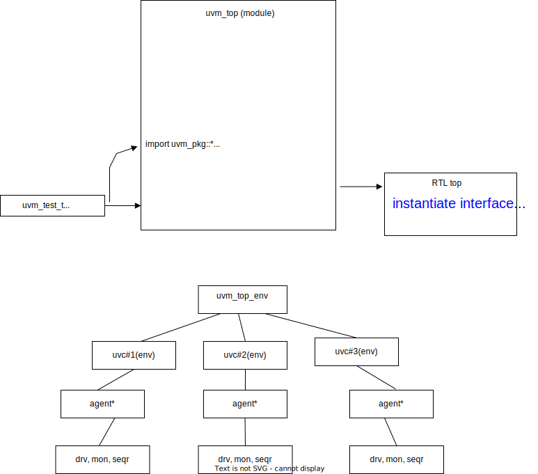

## compile

- `-incdir` for all UVC's  ``include`
- all pkg.sv
- all if.sv
- all RTL DUT
- uvm top module


## uvm top.sv

```verilog
module tb_top;
  
  // import the UVM library
  import uvm_pkg::*;

  // include the UVM macros
  `include "uvm_macros.svh"

  // import the yapp UVC
  import yapp_pkg::*;
  import hbus_pkg::*;
  import channel_pkg::*;
  import clock_and_reset_pkg::*;

  // include the test library file
  `include "router_tb.sv"
  `include "router_test_lib.sv"
    
  initial begin 
    yapp_vif_config::set(null, "uvm_test_top.tb.yapp.tx_agent.*", "vif", hw_top.in0);
    hbus_vif_config::set(null, "uvm_test_top.tb.hbus.*", "vif", hw_top.hif ); 
    channel_vif_config::set(null, "uvm_test_top.tb.chan0.*", "vif", hw_top.ch0);
    channel_vif_config::set(null, "uvm_test_top.tb.chan1.*", "vif", hw_top.ch1);
    channel_vif_config::set(null, "uvm_test_top.tb.chan2.*", "vif", hw_top.ch2);
    clock_and_reset_vif_config::set(null, "uvm_test_top.tb.clock_and_reset.*", "vif", hw_top.clk_rst_if);
    run_test();
  end


endmodule : tb_top
```


## RTL top

```verilog
module hw_top;

  // Clock and reset signals
  logic [31:0]  clock_period;
  logic         run_clock;
  logic         clock;
  logic         reset;

  // YAPP Interface to the DUT
  yapp_if in0(clock, reset);
  // reset will now be generated by the Clock and Reset UVC
  // input: clock; output: reset, run_clock, clock_period
  clock_and_reset_if clk_rst_if(.clock(clock), .reset(reset), .run_clock(run_clock), .clock_period(clock_period));
  hbus_if hif(.clock(clock), .reset(reset));

  channel_if ch0(.clock(clock), .reset(reset));
  channel_if ch1(.clock(clock), .reset(reset));
  channel_if ch2(.clock(clock), .reset(reset));

  // CLKGEN module generates clock
  clkgen clkgen (
    .clock(clock),
    .run_clock(run_clock),
    .clock_period(clock_period)
  );

  yapp_router dut(
      ...


endmodule
```


## pkg.sv

``include` all related uvm class in **pgk.sv**

```verilog
package yapp_pkg;
import uvm_pkg::*;
`include "uvm_macros.svh"

typedef uvm_config_db#(virtual yapp_if) yapp_vif_config;

`include "yapp_packet.sv"
`include "yapp_tx_monitor.sv"
`include "yapp_tx_sequencer.sv"
`include "yapp_tx_seqs.sv"
`include "yapp_tx_driver.sv"
`include "yapp_tx_agent.sv"
`include "yapp_env.sv"

endpackage
```


## if.sv

```verilog
interface yapp_if (input clock, input reset );
timeunit 1ns;
timeprecision 100ps;

import uvm_pkg::*;
`include "uvm_macros.svh"

import yapp_pkg::*;
    ...
    
endinterface : yapp_if
```
