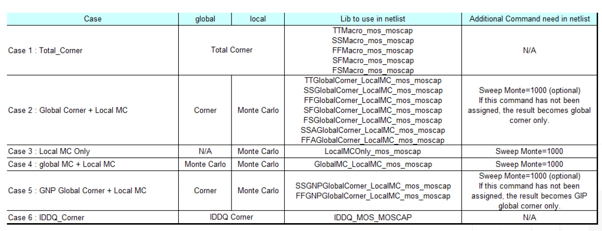

## Process Variation

### Global/Local Variation

### Timing and RC Modeling with Process Corners

### Global and Local variation by Gaussian

> Local Monte-Carlo (**SSG, FFG with Local Gaussian**) as Signoff golden

### Process Corner Model Limitations

Variation section

- Total corner (TT/SS/FF/SF/FS)
  - E.g. TTMacro_MOS_MOS_MOSCAP
- Global Corner (TTG/SSG/FFG/SFG/FSG) + Local MC
  - E.g. TTGlobalCorner_LocalMC_MOS_MOSCAP
- Local MC
  - E.g. LocalMCOnly_MOS_MOSCAP
- Global MC + Local MC (Total MC)
  - GlobalMC_LocalMC_MOS_MOSCAP

> **SSGNP, FFGNP**:
>
> When N/P global correlation is weak (R^2=0.15), the corner of N/PMOS balance circuit (e.g. inverter) can be tightened (**3sigma -> 2.5sgma**) due to the **cancellation** between NMOS and PMOS
>
> SSGNP, FFGNP usually used in Digital STA

> - **Global variation** validation with **global corner**
>   - **3-sigma of global MC** simulation is aligned with **global corner**
> - **Total variation** validation with **total corner**
>   - **3-sigma of global MC + local MC (total)** simulation is aligned with **total corner**

### Global Corner

> [https://community.cadence.com/cadence_technology_forums/f/custom-ic-design/20466/monte-carlo-simulation-global-local-vs-local-and-process-vs-mismatch/1365101#1365101](https://community.cadence.com/cadence_technology_forums/f/custom-ic-design/20466/monte-carlo-simulation-global-local-vs-local-and-process-vs-mismatch/1365101#1365101)
>
> The **"total corner"** is representative of the maximum device parameter variation including local device variation effects. However, it is not a statistical corner. 
>
> The **"global" corner** is defined as the **"total" corner minus the impact of "local variation"** 
>
> Hence, if you were to examine simulation results for a parameter using a "total" and "global" corner, you would find the range of variation will be less with the "global" corner than with the "total" corner.
>
> The "global" corner is provided for use in **statistical simulations**. Hence, when performing a Monte-Carlo simulation, the "global" corner is selected - NOT the "total" corner.

$$
\Delta V_{T,\sigma_{total}} = \sqrt{\Delta^2 _{T, \sigma_{global}}+\Delta^2 _{T, \sigma_{local}}}
$$

## RC corner

### Traditional RC Corners

Metal width variation ($\Delta W$), Metal thickness variation ($\Delta T$), IMD thickness variation ($\Delta H$)

*Capacitance* Dominant: C-best, C-worst

*Resistance* Dominant: RC-best, RC-worst

### DPT effect

When using two masks per layer (**Double Patterning Technology, DPT**) there is an issue of mask alignment where any mis-alignment will cause layer spacing values to change, therefore changing the parasitic coupling capacitance values.

> Misalignment scale and direction are not deterministic facts: coupling cap and total cap may be increased or decreased.

*Five new corners* are added in a *DPT* flow to account for RC variations accurately:

> sapced-dependent side-wall dielectric constant also affect coupling cap
>
> and *CC_worst* means to increase both K1 and K2
>
> *CC_best* means to decrease both K1 and K2

- Setup time sign-off would use:

  Cworst_CCworst / RCworst_CCworst

- Hold time sign-off would use:

  Cbest_CCbest / RCbest_CCbest / Cworst_CCworst / RCworst_CCworst

### Signoff corner

| **with misalignment effect**       | without misalignment effect |
| ---------------------------------- | --------------------------- |
| cworst_CCworst, cworst_CCworst_T   | cworst, cworst_T            |
| cbest_CCbest, cbest_CCbest_T       | cbest, cbest_T              |
| rcworst_CCworst, rcworst_CCworst_T | rcworst, rcworst_T          |
| rcbest_CCbest, rcbest_CCbest_T     | rcbest, rcbest_T            |

> BEOL Target: typical

The recommended RC corner:

​	*cworst_CCworst, cbest_CCbest, rcworst_CCworst, rcbest_CCbest and typical*

The others are for *pre-color* RC calculation purpose

**\_T** stands for **"Tighten DPT corner"**; these are less pessimistic **1.5 sigma** corners

> Below table is caputre of Aragio's TSMC16: LVDS datasheet
>
> 

### BEOL corner

> Spacing variation is implicitly defined by $\Delta W_m$.

We denote the conductor *width and thickness* of the layer m by $W_m$ and $T_m$, respectively. 

Similarly, we denote the *thickness* of the layer's interlayer dielectric (i.e., the distance between layer m and layer m +1) by $H_m$

- C-based means **worst and best caps**
- RC-based means **worst and best R** in *adjustment with C* (RC product)

Based on experience, it was found that **C-based extraction** provides worst and best case over RC for internal timing paths because *Capacitance* dominates **short wire**. 

However, for large design, inter-block timing paths were often worst with **RC worst** parasitic since *R* dominates for **long wires**.

### signoff corners for setup & hold

## reference

***Process Variation***

Eric J.-W. Fang, T5: Fundamentals of Process Monitors for Signoff-Oriented Circuit Design, 2022 IEEE International Solid-State Circuits Conference

Alvin Loke, Device and Physical Design Considerations for Circuits in FinFET Technology, ISSCC 2020 Short Course

簡報 Cln16ffcll Sr V1d0 2p1 Usage Guide URL: [https://usermanual.wiki/Document/cln16ffcllsrv1d02p1usageguide.1649731847/view](https://usermanual.wiki/Document/cln16ffcllsrv1d02p1usageguide.1649731847/view)

Radojcic, Riko, Dan Perry and Mark Nakamoto. “Design for manufacturability for fabless manufactuers.” *IEEE Solid-State Circuits Magazine* 1 (2009): n. pag.

How To Reduce Implementation Headaches In FinFET Processes URL: [https://semiengineering.com/how-to-reduce-implementation-headaches-in-finfet-processes/](https://semiengineering.com/how-to-reduce-implementation-headaches-in-finfet-processes/)

陌上风骑驴看IC, STA | SSGNP, FFGNP. [https://mp.weixin.qq.com/s/eJ8fYRJBR1E9XbfH95OUOg](https://mp.weixin.qq.com/s/eJ8fYRJBR1E9XbfH95OUOg)

陌上风骑驴看IC, STA | ssg 跟ss corner 的区别——谬误更正版 [https://mp.weixin.qq.com/s?__biz=MzUzODczODg2NQ==&mid=2247486225&idx=1&sn=e9c68f6108ae6c9958d47ca0b29373ca&chksm=fad262cfcda5ebd949cc91353c7cbfaf4ba61179306f7d8e98461a4f4ca9d8a9baef5e9f2cc1&scene=178&cur_album_id=1326356275000705025#rd](https://mp.weixin.qq.com/s?__biz=MzUzODczODg2NQ==&mid=2247486225&idx=1&sn=e9c68f6108ae6c9958d47ca0b29373ca&chksm=fad262cfcda5ebd949cc91353c7cbfaf4ba61179306f7d8e98461a4f4ca9d8a9baef5e9f2cc1&scene=178&cur_album_id=1326356275000705025#rd)

The Evolution, Pitfalls, and Cargo Cult Engineering of Advanced Digital Timing Sign-off [https://www.tauworkshop.com/2021/speaker_slides/christian_l.pdf](https://www.tauworkshop.com/2021/speaker_slides/christian_l.pdf)

Don O'Riordan Cadence Design Systems. Recommended Spectre Monte Carlo modeling methodology [[https://designers-guide.org/modeling/montecarlo.pdf](https://designers-guide.org/modeling/montecarlo.pdf)]

---

***RC corner***

Modeling Sub-90nm On-Chip Variation Using Monte Carlo Method for DFM [https://www.aspdac.com/aspdac2007/pdf/archive/2D-1.pdf](https://www.aspdac.com/aspdac2007/pdf/archive/2D-1.pdf)

Double Patterning for IC Design, Extraction and Signoff [https://semiwiki.com/eda/synopsys/1974-double-patterning-for-ic-design-extraction-and-signoff/](https://semiwiki.com/eda/synopsys/1974-double-patterning-for-ic-design-extraction-and-signoff/)

抽刀断水水更流，RC Corner不再愁：STA之RC Corner URL: [http://mp.weixin.qq.com/s?__biz=MzUzODczODg2NQ==&mid=2247484115&idx=1&sn=de99f27aadf58ea316c284dad9000b7c&chksm=fad26b0dcda5e21b8c9750f738b55053f695843a66c3c202ff0ba586c738f45aa270254c3722&scene=21#wechat_redirect](http://mp.weixin.qq.com/s?__biz=MzUzODczODg2NQ==&mid=2247484115&idx=1&sn=de99f27aadf58ea316c284dad9000b7c&chksm=fad26b0dcda5e21b8c9750f738b55053f695843a66c3c202ff0ba586c738f45aa270254c3722&scene=21#wechat_redirect)

一曲新词酒一杯，RC Corner继续飞: STA之RC Corner拾遗  URL:[https://mp.weixin.qq.com/s?__biz=MzUzODczODg2NQ==&mid=2247484135&idx=2&sn=bddc632850bd10c32b5688fd7af46218&chksm=fad26b39cda5e22f1c3970f8c8c2e1287c9492c526c4caf02b61f61faffdf829381c392d6ea1&scene=21#wechat_redirect](https://mp.weixin.qq.com/s?__biz=MzUzODczODg2NQ==&mid=2247484135&idx=2&sn=bddc632850bd10c32b5688fd7af46218&chksm=fad26b39cda5e22f1c3970f8c8c2e1287c9492c526c4caf02b61f61faffdf829381c392d6ea1&scene=21#wechat_redirect)

且将新火试新茶，深究趁年华：STA之RC Corner再论 URL:[https://mp.weixin.qq.com/s?__biz=MzUzODczODg2NQ==&mid=2247484144&idx=1&sn=059843381e77cd4008d25166db388d02&chksm=fad26b2ecda5e23816b33b3a949f34d4ca09118bad76f1089dfcb228b7da6491f423a5f4e703&cur_album_id=1326356275000705025&scene=189#wechat_redirect](https://mp.weixin.qq.com/s?__biz=MzUzODczODg2NQ==&mid=2247484144&idx=1&sn=059843381e77cd4008d25166db388d02&chksm=fad26b2ecda5e23816b33b3a949f34d4ca09118bad76f1089dfcb228b7da6491f423a5f4e703&cur_album_id=1326356275000705025&scene=189#wechat_redirect)

LDP_IN_800_25V_DN: 1.2GHz LVDS Receiver [http://aragiosolutions.com/pdf/rgo_tsmc16_18v25_lvds_product_brief_rev_1a.pdf](http://aragiosolutions.com/pdf/rgo_tsmc16_18v25_lvds_product_brief_rev_1a.pdf)

Parasitic extraction technologies Advanced node and 3D-IC design [https://static.sw.cdn.siemens.com/siemens-disw-assets/public/81845/en-US/Siemens-SW-Parasitic-extraction-technologies-for-advanced-WP-81845-C2.pdf](https://static.sw.cdn.siemens.com/siemens-disw-assets/public/81845/en-US/Siemens-SW-Parasitic-extraction-technologies-for-advanced-WP-81845-C2.pdf)

New Game, New Goal Posts: A Recent History of Timing Closure [https://pdfs.semanticscholar.org/9360/5ce48f9bd3b7527ae8979f41a9c7e310efa4.pdf](https://pdfs.semanticscholar.org/9360/5ce48f9bd3b7527ae8979f41a9c7e310efa4.pdf)

The Evolution, Pitfalls, and Cargo Cult Engineering of Advanced Digital Timing Sign-off [https://www.tauworkshop.com/2021/speaker_slides/christian_l.pdf](https://www.tauworkshop.com/2021/speaker_slides/christian_l.pdf)

T. -B. Chan, S. Dobre and A. B. Kahng, "Improved signoff methodology with tightened BEOL corners," 2014 IEEE 32nd International Conference on Computer Design (ICCD), Seoul, Korea (South), 2014, pp. 311-316, doi: 10.1109/ICCD.2014.6974699.

Chan, T. (2014). Mitigation of Variability and Reliability Margins in IC Implementation /. *UC San Diego*. ProQuest ID: Chan_ucsd_0033D_14269. Merritt ID: ark:/20775/bb52916761. Retrieved from [https://escholarship.org/uc/item/35r1m001](https://escholarship.org/uc/item/35r1m001)

Dr. Adam Temanm, Digital VLSI Design:Lecture 10: Routing [https://www.eng.biu.ac.il/temanad/files/2017/02/Lecture-10-Routing.pdf](https://www.eng.biu.ac.il/temanad/files/2017/02/Lecture-10-Routing.pdf)

Article (20487193) Title: Setting Pegasus - LVS to Quantus av_extracted view Flow with TSMC16 packages
URL: https://support.cadence.com/apex/ArticleAttachmentPortal?id=a1O0V000009MprZUAS
