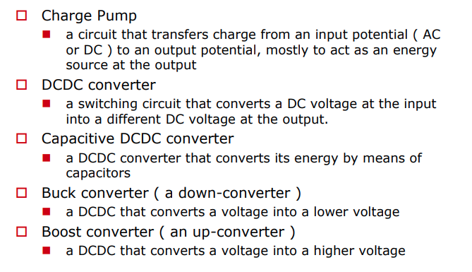
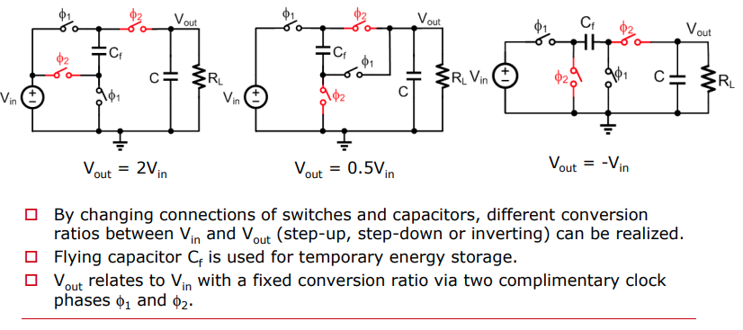
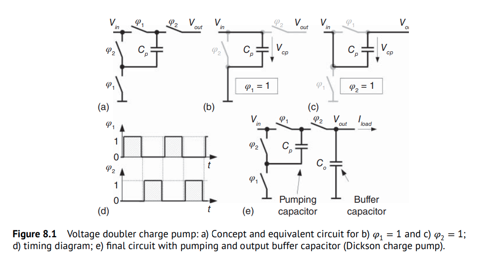
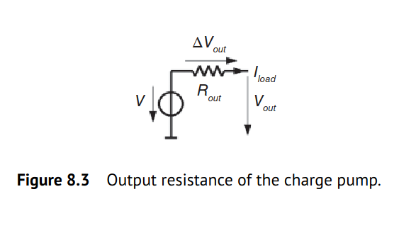

> ***charge pumps*** are ***capacitive DC-DC converters***. The two most common switched capacitor voltage converters are the **voltage inverter** and the **voltage doubler** circuit

---

---

## voltage doubler

### output buffer capacitor

To achieve a stable DC output voltage

### Step-Wise Ramp-Up

> **without** load

$$
V_{in} C_p + V_{out,n-1}C_o = (V_{out,n}-V_{in})C_p + V_{out,n}C_o
$$

We derive a recursive equation that describes the output voltage $V_{out,n}$ after the $n$th clock cycle
$$
V_{out,n} = \frac{2V_{in}C_p + V_{out,n-1}C_o}{C_p + C_o}
$$

### Voltage Ripple & Droop

$$\begin{align}
(V_t - V_h)(C_p + C_o) &= \frac{I_{load}}{2f_{sw}} \\
(V_h - V_b)C_o &= \frac{I_{load}}{2f_{sw}}
\end{align}$$

we obtain
$$
V_t - V_b = \frac{I_{load}}{f_{sw}C_o}\left(1 - \frac{C_p}{2(C_p + C_o)}\right)
$$
That is, **peak-to-peak ripple**
$$
\Delta V_{out,p2p} \approx \frac{I_{load}}{f_{sw}C_o} \space\space\space\space \text{if}\space\space C_o \gg C_p
$$

Then, with aforementioned Step-Wise Ramp-Up equation, $V_t = \frac{2V_{in}C_p + V_bC_o}{C_p + C_o}$
$$\begin{align}
V_b &= 2V_{in} - \frac{I_{load}}{f_{sw}C_p}\left(1 + \frac{C_p}{2C_o}\right) \\
V_t &= 2V_{in} - \frac{I_{load}}{f_{sw}C_p}\left(1 - \frac{C_p}{2(C_p+C_o)}\right)
\end{align}$$

Therefore, average output voltage $\overline{V}_{out}$ in steady-state is
$$
\overline{V}_{out} = \frac{V_t+V_b}{2}=2V_{in} - \frac{I_{load}}{f_{sw}C_p}\left(1 + \frac{C_p^2}{4C_o(C_p+C_o)}\right) \approx 2V_{in} - \frac{I_{load}}{f_{sw}C_p}
$$
which results in a simple expression for the **output voltage droop**

$$
\Delta V_{out} = \frac{I_{load}}{f_{sw}C_p}
$$

The charge pump can be modeled as a voltage source with a **source resistance** $R_\text{out}$. Therefore, $\Delta V_{out}$ can be seen as the voltage drop across $R_\text{out}$ due to the load current:

$$
R_{out} = \frac{\Delta V_{out}}{I_{load}} = \frac{1}{f_{sw}C_p}
$$

### multiphase CP

$$
(V_t - V_b) (C_p + C_o) = I_{load}\Delta t
$$

Therefore *peak-to-peak ripple*
$$
\Delta V_{out,p2p} = \frac{I_{load}\Delta t}{C_p+C_o} = \frac{I_{load}\Delta t}{C_{tot}}
$$

where $C_{tot} = C_p+C_o$

with
$$
\left\{ \begin{array}{cl}
V_b &= 2V_{in} - \frac{I_{load}\Delta t}{C_p} \\
V_t &= 2V_{in} - \frac{I_{load}\Delta t}{C_p} + \frac{I_{load}\Delta t}{C_p+C_o}
\end{array} \right.
$$

Then
$$
\overline{V}_{out} = \frac{V_t+V_b}{2}=2V_{in} - \frac{I_{load}\Delta t}{C_p}\cdot \frac{C_p+2C_o}{2C_p+2C_o} \approx 2V_{in} - \frac{I_{load}\Delta t}{C_p}
$$
That is *output voltage droop*
$$
\Delta V_{out} = \frac{I_{load}\Delta t}{C_p}
$$

## reference

Bernhard Wicht, "Design of Power Management Integrated Circuits". 2024 Wiley-IEEE Press

Breussegem, T. v., & Steyaert, M. (2013). CMOS integrated capacitive DC-DC converters. Springer

Zhang, Milin, Zhihua Wang, Jan van der Spiegel and Franco Maloberti. "Advanced Tutorial on Analog Circuit Design." (2023).

Anton Bakker, Tim Piessens., ISSCC2014 T9: Charge Pump and Capacitive DC-DC Converter Design

Wicht, B., ISSCC2020 T2: Analog Building Blocks of DC-DC Converters [[https://www.nishanchettri.com/isscc-slides/2020%20ISSCC/TUTORIALS/T2Visuals.pdf](https://www.nishanchettri.com/isscc-slides/2020%20ISSCC/TUTORIALS/T2Visuals.pdf)]

Hoi Lee, ISSCC2018 T8: Fundamentals of Switched-Mode Power Converter Design [[slides](https://www.nishanchettri.com/isscc-slides/2018%20ISSCC/TUTORIALS/T8/T8Visuals.pdf),[transcript](https://www.nishanchettri.com/isscc-slides/2018%20ISSCC/TUTORIALS/T8/T8Transcription.pdf)]
