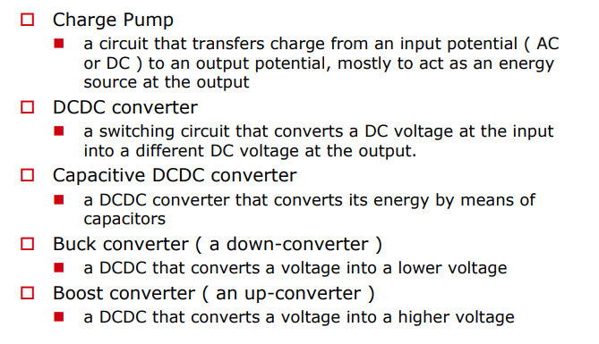
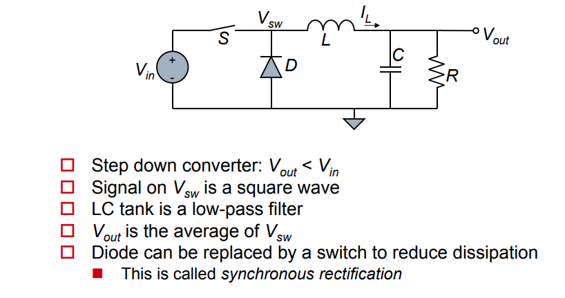

> ***charge pumps*** are ***capacitive DC-DC converters***. The two most common switched capacitor voltage converters are the **voltage inverter** and the **voltage doubler** circuit

---

## Buck Converter

> regulate the output voltage by the *duty cycle of the switch*

- reduce inductor size a little bit by increasing the switching frequency
- the efficiency goes down with switching frequency increasing

## SC Step-Down Converter

*TODO* &#128197;

## voltage doubler

*TODO* &#128197;

### output buffer capacitor

To achieve a stable DC output voltage

## reference

Wicht, B., "Design of Power Management Integrated Circuits". 2024 Wiley-IEEE Press

Wicht, B.,  ISSCC2020 T2: Analog Building Blocks of DC-DC Converters [[https://www.nishanchettri.com/isscc-slides/2020%20ISSCC/TUTORIALS/T2Visuals.pdf](https://www.nishanchettri.com/isscc-slides/2020%20ISSCC/TUTORIALS/T2Visuals.pdf)]

Hoi Lee, ISSCC2018 T8: Fundamentals of Switched-Mode Power Converter Design [[slides](https://www.nishanchettri.com/isscc-slides/2018%20ISSCC/TUTORIALS/T8/T8Visuals.pdf),[transcript](https://www.nishanchettri.com/isscc-slides/2018%20ISSCC/TUTORIALS/T8/T8Transcription.txt)]

Anton Bakker,Tim Piessens., ISSCC2014 T9: Charge Pump and Capacitive DC-DC Converter Design

