## PFD/CP Modelling

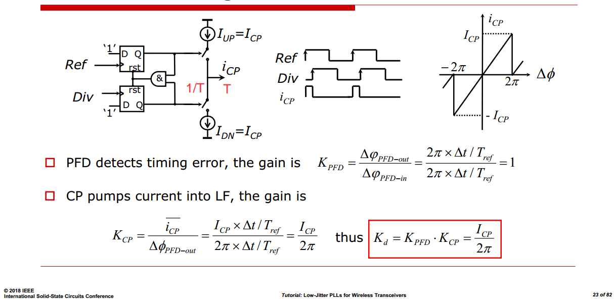

---

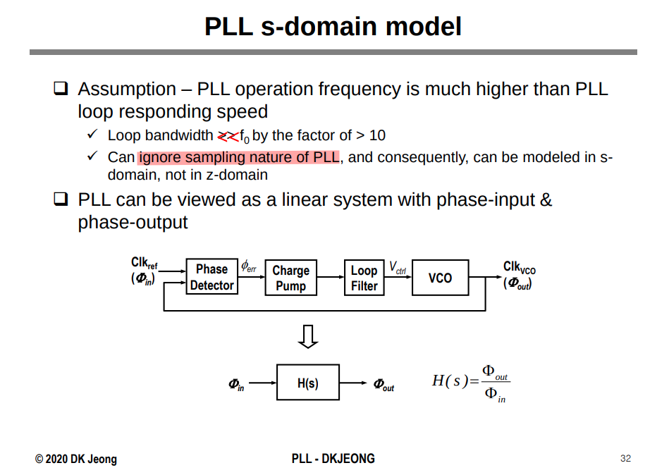

> Deog-Kyoon Jeong. Topics in IC Design 2.1 Introduction to Phase-Locked Loop [[pdf](https://ocw.snu.ac.kr/sites/default/files/NOTE/Lec%202%20-%20Charge-Pump%20PLL%2C%20Freuqency%20Synthesizers%2C%20and%20SSCG.pdf)]

## Divider noise

*TODO* &#128197;

> Enrico Rubiola. Phase Noise and Jitter in Digital Electronics [[https://rubiola.org/pdf-slides/2016T-EFTF--Noise-in-digital-electronics.pdf](https://rubiola.org/pdf-slides/2016T-EFTF--Noise-in-digital-electronics.pdf)]
>
> W. F. Egan, "Modeling phase noise in frequency dividers," in IEEE Transactions on Ultrasonics, Ferroelectrics, and Frequency Control, vol. 37, no. 4, pp. 307-315, July 1990 [[https://sci-hub.se/10.1109/58.56498](https://sci-hub.se/10.1109/58.56498)]
>
> S. Levantino, L. Romano, S. Pellerano, C. Samori and A. L. Lacaita, "Phase noise in digital frequency dividers," in *IEEE Journal of Solid-State Circuits*, vol. 39, no. 5, pp. 775-784, May 2004 [[https://sci-hub.se/10.1109/JSSC.2004.826338](https://sci-hub.se/10.1109/JSSC.2004.826338)]
>
> PLL + PSS + PNOISE convergence [[https://community.cadence.com/cadence_technology_forums/f/custom-ic-design/48474/pll-pss-pnoise-convergence/1376833](https://community.cadence.com/cadence_technology_forums/f/custom-ic-design/48474/pll-pss-pnoise-convergence/1376833)]

---

Signal Source Analyzer: measurement is based on time-average(or frequency-domain) method

real-time digital oscilloscope: measure sampled jitter directly

> [[https://community.cadence.com/cadence_technology_forums/f/custom-ic-design/41797/inconsistent-phase-noise-results-of-divide-by-2-phase-using-different-pnoise-method/1360890](https://community.cadence.com/cadence_technology_forums/f/custom-ic-design/41797/inconsistent-phase-noise-results-of-divide-by-2-phase-using-different-pnoise-method/1360890)]

## Charge Pump Noise

> A. L. Lacaita, S. Levantino, and C. Samori, *Integrated Frequency Synthesizers for Wireless Systems*. Cambridge: Cambridge University Press, 2007.
>
> [https://raytroop.github.io/2024/05/25/comm/#cyclostationary-noise-modulated-noise](https://raytroop.github.io/2024/05/25/comm/#cyclostationary-noise-modulated-noise)

---

Saurabh Saxena,Phase Locked Loops: Noise Simulations for CP-PLL Blocks [[https://youtu.be/Q1libz-XqRw](https://youtu.be/Q1libz-XqRw)]

---

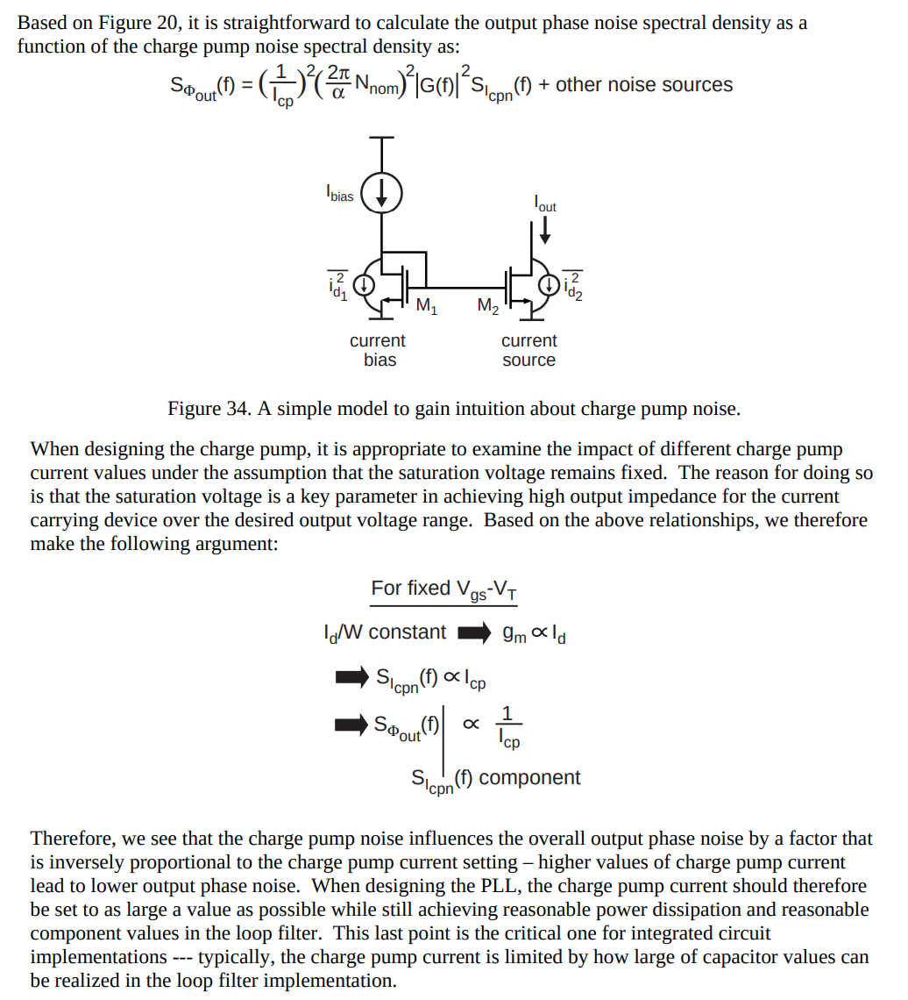

> Michael H. Perrott, PLL Design Using the PLL Design Assistant Program. [[https://designers-guide.org/forum/Attachments/pll_manual.pdf](https://designers-guide.org/forum/Attachments/pll_manual.pdf)]
>
> M.H. Perrott, M.D. Trott, C.G. Sodini, "A Modeling Approach for Sigma-Delta Fractional-N Frequency Synthesizers Allowing Straightforward Noise Analysis", JSSC, vol 38, no 8, pp 1028-1038, Aug 2002. [[https://www.cppsim.com/Publications/JNL/perrott_jssc02.pdf](https://www.cppsim.com/Publications/JNL/perrott_jssc02.pdf)]

## charge pump with amplifier

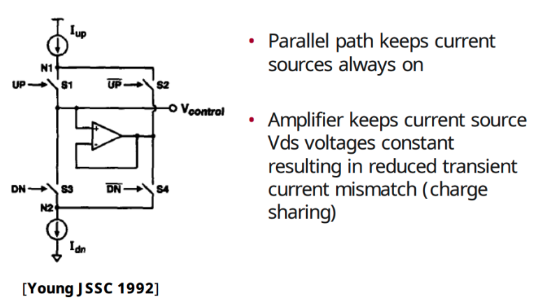

> Young, I.A., Greason, J.K., Wong, K.L.: A PLL Clock Generator with 5 to 110MHz of Lock Range for Microprocessors. IEEE Journal of Solid-State Circuits 27(11), 1599– 1607 (1992)  [[https://people.engr.tamu.edu/spalermo/ecen620/pll_intel_young_jssc_1992.pdf](https://people.engr.tamu.edu/spalermo/ecen620/pll_intel_young_jssc_1992.pdf)]
>
> Johnson, M., Hudson, E.: A variable delay line PLL for CPU-coprocessor synchronization. IEEE Journal of Solid-State Circuits 23(10), 1218–1223 (1988)  [[https://sci-hub.se/10.1109/4.5947](https://sci-hub.se/10.1109/4.5947)]
>
> Sam Palermo, Lecture 5: Charge Pump Circuits, ECEN620: Network Theory Broadband Circuit Design Fall 2024 [[https://people.engr.tamu.edu/spalermo/ecen620/lecture05_ee620_charge_pumps.pdf](https://people.engr.tamu.edu/spalermo/ecen620/lecture05_ee620_charge_pumps.pdf)]

## Non-ideal Effects in Charge Pump

The ***periodic*** signal on VCTRL modulates the VCO, giving rise to ***deterministic*** jitter

---

- Timing Offsets Between Up and Dn Pulses
- Mismatch Between Charge-Pump Current Sources
- Incomplete Settling of Charge-Pump Currents
- Finite Output Resistance of the Charge Pump

### Up/Dn Timing Offset

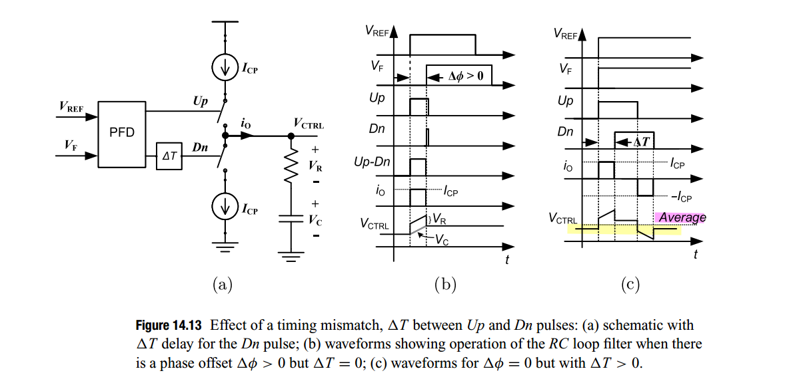

If Dn pulse arrives $\Delta T$ after the Up pulse, the steady-state VCTRL will be slightly **lower** than it would be without the $\Delta T$ mismatch so as to return the VCO's phase to match the reference clocks.

Vice versa, if If Up pulse arrives $\Delta T$ after the Dn pulse, the steady-state VCTRL will be slightly **higher** than without $\Delta T$ mismatch

### Current Sources Mismatch

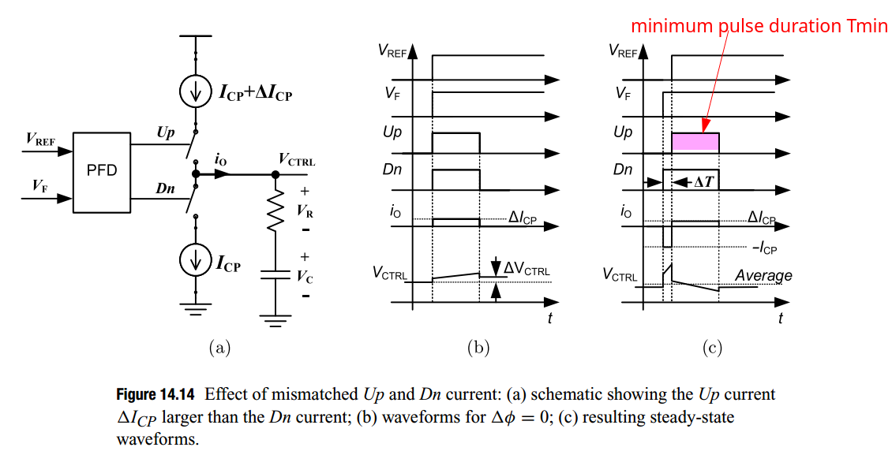

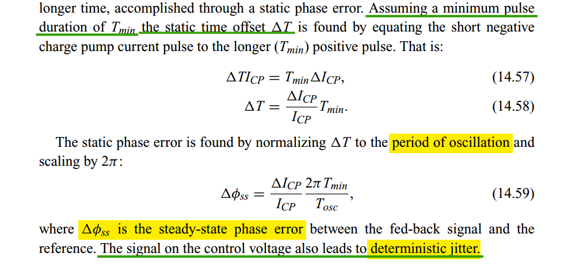

### Incomplete Settling

*TODO* &#128197;

> W. Rhee, "Design of high-performance CMOS charge pumps in phase-locked loops," *1999 IEEE International Symposium on Circuits and Systems (ISCAS)*, Orlando, FL, USA, 1999, pp. 545-548 vol.2 [[pdf](https://citeseerx.ist.psu.edu/document?repid=rep1&type=pdf&doi=3006edc15fdef2e71674d4170c10c62fd69f96a3)]
>
> Cowan G. *Mixed-Signal CMOS for Wireline Communication: Transistor-Level and System-Level Design Considerations*. Cambridge University Press; 2024

## 2nd loop filter

> PI (proportional - integral) Loop Filter

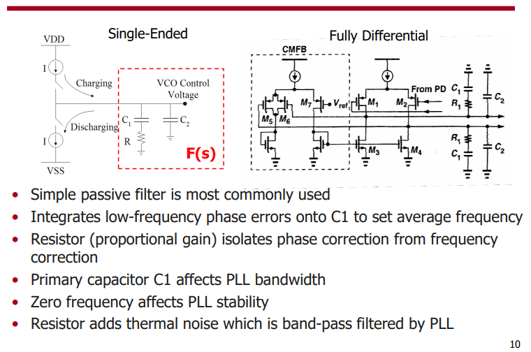

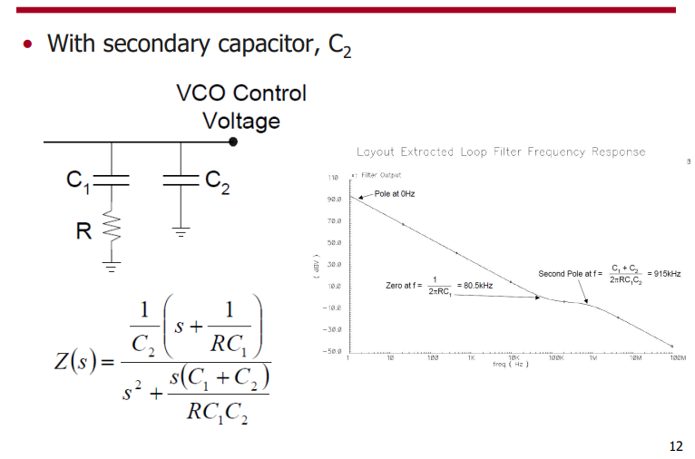

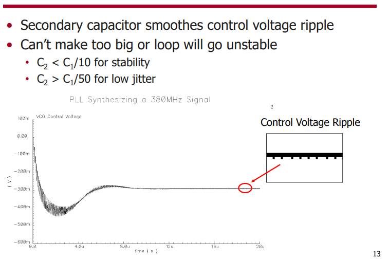

## PFD Deadzone

Dead zone induced by *incomplete settling* of charge-pump currents

> This situation can be avoided by adding *additional delay to the AND gate* in the PFD

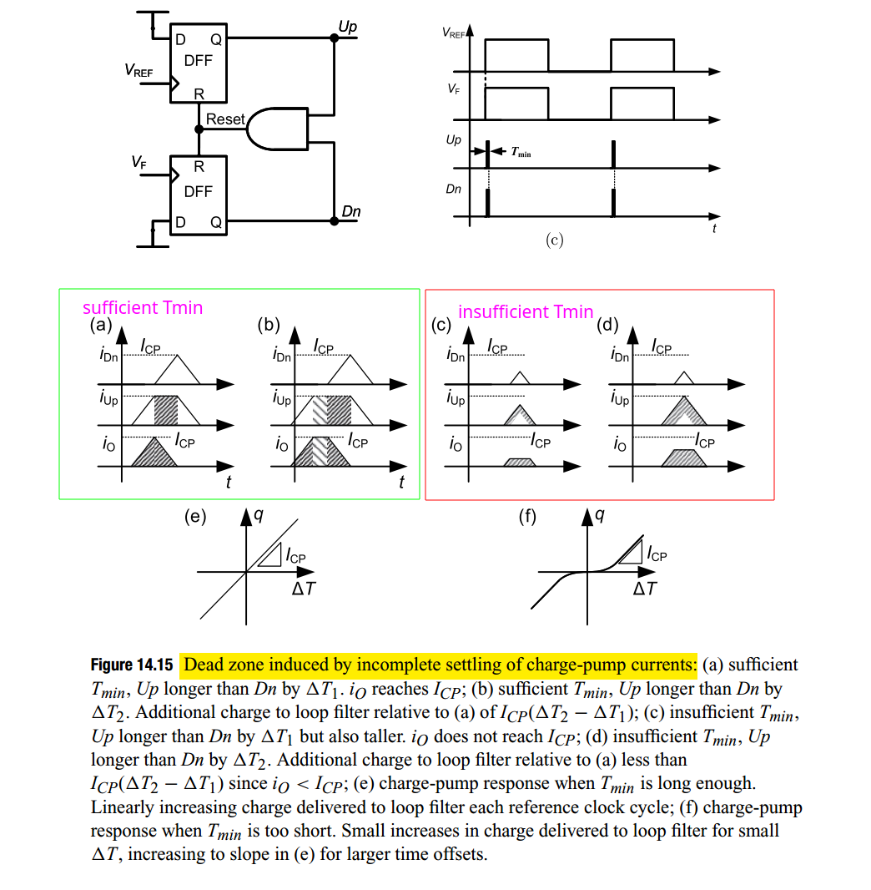

> Sam Palermo, "Lecture 4: Phase Detector Circuit" [[https://people.engr.tamu.edu/spalermo/ecen620/lecture04_ee620_phase_detectors.pdf](https://people.engr.tamu.edu/spalermo/ecen620/lecture04_ee620_phase_detectors.pdf)]

## LPF leakage

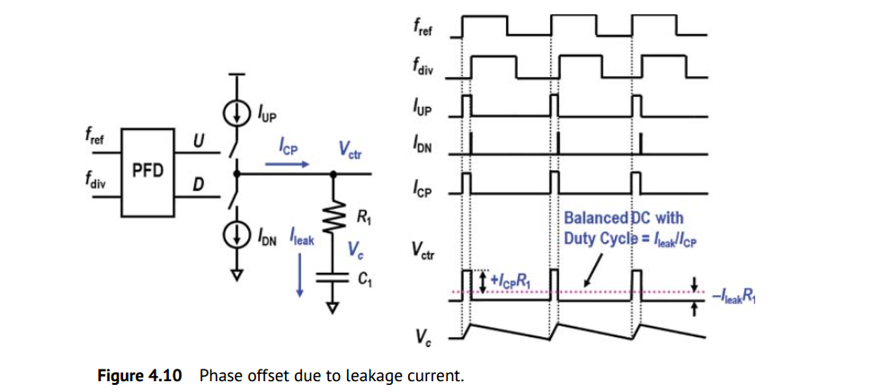

For the sake of simplicity, $V_{ctr}$ looks like a rectangular pulse with an amplitude of $I_{CP}R_1$ and a duty ratio of ($I_{leak}/I_{CP}$), whose first coefficient of Fourier series is

where $I_\text{leak} \ll I_{CP}$ is assumed

Then, the *peak* frequency deviation $\Delta f$
$$
\Delta f = a_1 \cdot K_v = 2I_\text{leak}R_1 K_v
$$
using narrowband FM approximation, we have 
$$
P_\text{spur} = 20\log\left(\frac{\Delta f}{2f_\text{ref}}\right) = 20\log\left(\frac{I_\text{leak}R_1 K_v}{f_\text{ref}}\right)
$$

> W. Rhee, "Design of high-performance CMOS charge pumps in phase-locked loops," *1999 IEEE International Symposium on Circuits and Systems (ISCAS)*, Orlando, FL, USA, 1999, pp. 545-548 vol.2 [[pdf](https://citeseerx.ist.psu.edu/document?repid=rep1&type=pdf&doi=3006edc15fdef2e71674d4170c10c62fd69f96a3)]
>
> —. Yu, Z., 2024. *Phase-Locked Loops: System Perspectives and Circuit Design Aspects*. John Wiley & Sons

---

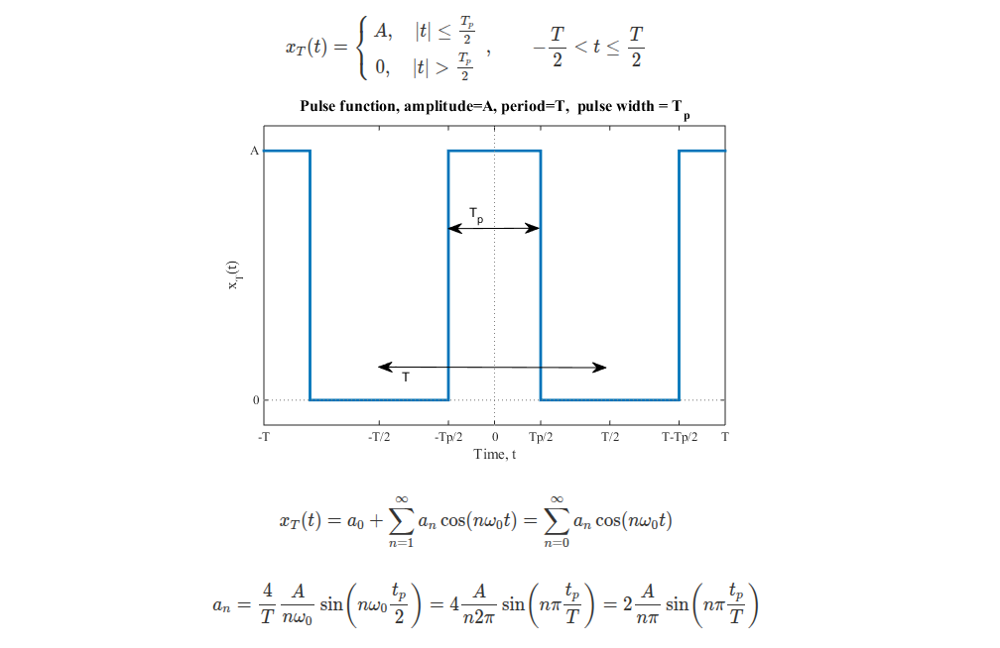

> [[https://lpsa.swarthmore.edu/Fourier/Series/ExFS.html](https://lpsa.swarthmore.edu/Fourier/Series/ExFS.html)]

## reference

Saurabh Saxena. Noise Simulations for CP-PLL Blocks [[https://youtu.be/Q1libz-XqRw](https://youtu.be/Q1libz-XqRw)]

—, IIT Madras. CICC2022 Clocking for Serial Links - Frequency and Jitter Requirements, Phase-Locked Loops, Clock and Data Recovery

Helene Thibieroz, Customer Support CIC. Using Spectre RF Noise-Aware PLL Methodology to Predict PLL Behavior Accurately  [[https://citeseerx.ist.psu.edu/document?repid=rep1&type=pdf&doi=3056e59ea76165373f90152f915a829d25dabebc](https://citeseerx.ist.psu.edu/document?repid=rep1&type=pdf&doi=3056e59ea76165373f90152f915a829d25dabebc)]

---

Chembiyan T. Chargepump PLL Basics- From A Control Theoretic Viewpoint [[linkedin](https://www.linkedin.com/posts/chembiyan-t-0b34b910_cppll-basics-activity-7047198719787626496--7GG?utm_source=share&utm_medium=member_desktop&rcm=ACoAAD-cuiIBDJ62eh9q3qTSSdslYXr-XMd8TGw)]

—. Challenges in Chargepump PLL Design- A Qualitative Approach [[linkedin](https://www.linkedin.com/posts/chembiyan-t-0b34b910_cppll-design-challenges-activity-7036787568344006657-7vM1?utm_source=share&utm_medium=member_desktop&rcm=ACoAAD-cuiIBDJ62eh9q3qTSSdslYXr-XMd8TGw)]

—. A Unified Approach to Low Noise Loop Design in Chargepump PLLs [[linkedin](https://www.linkedin.com/posts/chembiyan-t-0b34b910_pll-loop-design-shorter-version-activity-7116456644846252032-Klx0?utm_source=share&utm_medium=member_desktop&rcm=ACoAAD-cuiIBDJ62eh9q3qTSSdslYXr-XMd8TGw)]

---

Xiang Gao Credo Semiconductor. ISSCC2018 T1: Low-Jitter PLLs for Wireless Transceivers [[https://www.nishanchettri.com/isscc-slides/2018%20ISSCC/TUTORIALS/T1/T1Visuals.pdf](https://www.nishanchettri.com/isscc-slides/2018%20ISSCC/TUTORIALS/T1/T1Visuals.pdf)]
