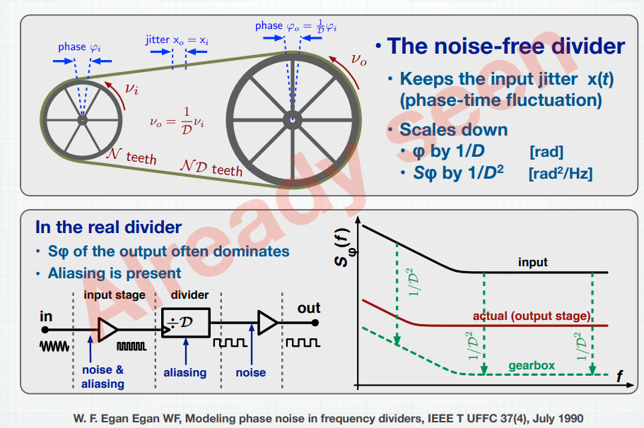
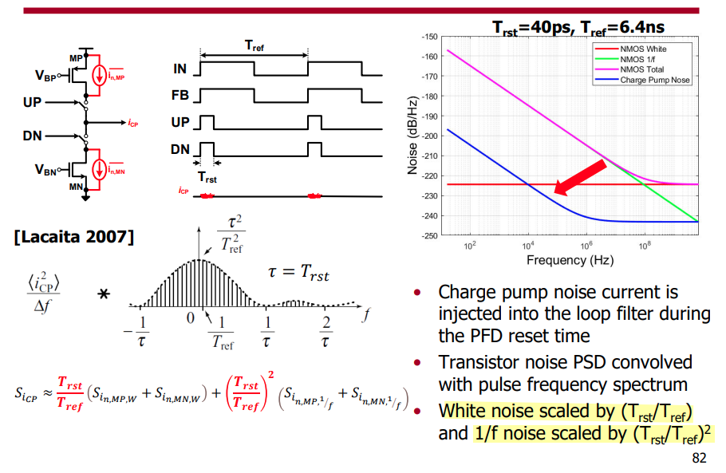
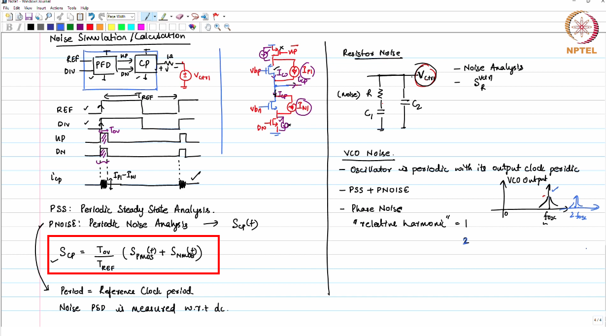

## Divider noise

*TODO* &#128197;

> Enrico Rubiola. Phase Noise and Jitter in Digital Electronics [[https://rubiola.org/pdf-slides/2016T-EFTF--Noise-in-digital-electronics.pdf](https://rubiola.org/pdf-slides/2016T-EFTF--Noise-in-digital-electronics.pdf)]
>
> W. F. Egan, "Modeling phase noise in frequency dividers," in IEEE Transactions on Ultrasonics, Ferroelectrics, and Frequency Control, vol. 37, no. 4, pp. 307-315, July 1990 [[https://sci-hub.se/10.1109/58.56498](https://sci-hub.se/10.1109/58.56498)]
>
> S. Levantino, L. Romano, S. Pellerano, C. Samori and A. L. Lacaita, "Phase noise in digital frequency dividers," in *IEEE Journal of Solid-State Circuits*, vol. 39, no. 5, pp. 775-784, May 2004 [[https://sci-hub.se/10.1109/JSSC.2004.826338](https://sci-hub.se/10.1109/JSSC.2004.826338)]
>
> PLL + PSS + PNOISE convergence [[https://community.cadence.com/cadence_technology_forums/f/custom-ic-design/48474/pll-pss-pnoise-convergence/1376833](https://community.cadence.com/cadence_technology_forums/f/custom-ic-design/48474/pll-pss-pnoise-convergence/1376833)]

---

Signal Source Analyzer: measurement is based on time-average(or frequency-domain) method

real-time digital oscilloscope: measure sampled jitter directly

> [[https://community.cadence.com/cadence_technology_forums/f/custom-ic-design/41797/inconsistent-phase-noise-results-of-divide-by-2-phase-using-different-pnoise-method/1360890](https://community.cadence.com/cadence_technology_forums/f/custom-ic-design/41797/inconsistent-phase-noise-results-of-divide-by-2-phase-using-different-pnoise-method/1360890)]

## Charge Pump Noise

> A. L. Lacaita, S. Levantino, and C. Samori, *Integrated Frequency Synthesizers for Wireless Systems*. Cambridge: Cambridge University Press, 2007.
>
> [https://raytroop.github.io/2024/05/25/comm/#cyclostationary-noise-modulated-noise](https://raytroop.github.io/2024/05/25/comm/#cyclostationary-noise-modulated-noise)

---

Saurabh Saxena,Phase Locked Loops: Noise Simulations for CP-PLL Blocks [[https://youtu.be/Q1libz-XqRw](https://youtu.be/Q1libz-XqRw)]

## reference

Saurabh Saxena. Noise Simulations for CP-PLL Blocks [[https://youtu.be/Q1libz-XqRw](https://youtu.be/Q1libz-XqRw)]

—, IIT Madras. CICC2022 Clocking for Serial Links - Frequency and Jitter Requirements, Phase-Locked Loops, Clock and Data Recovery

Helene Thibieroz, Customer Support CIC. Using Spectre RF Noise-Aware PLL Methodology to Predict PLL Behavior Accurately  [[https://citeseerx.ist.psu.edu/document?repid=rep1&type=pdf&doi=3056e59ea76165373f90152f915a829d25dabebc](https://citeseerx.ist.psu.edu/document?repid=rep1&type=pdf&doi=3056e59ea76165373f90152f915a829d25dabebc)]
