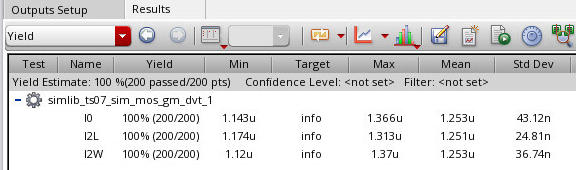

The current mismatch consists of two components. 

- The first depends on threshold voltage mismatch and increases as the overdrive $(V_{GS} − V_t)$ is reduced.
- The second is geometry dependent and contributes a fractional current mismatch that is independent of bias point. 

$$
\Delta I_D = g_m\cdot \Delta V_{TH}+I_D\cdot \frac{\Delta(W/L)}{W/L}
$$

where mismatches in $\mu_nC_{ox}$ are neglected

$$\begin{align}
\Delta V_{TH} &= \frac{A_{VTH}}{\sqrt{WL}} \\
\frac{\Delta(W/L)}{W/L} &= \frac{A_{WL}}{\sqrt{WL}}
\end{align}$$

### summary

| Size  | $g_m$        | $\Delta V_{TH}$ | $\frac{\Delta(W/L)}{W/L}$ | mismatch (%)                                     | simu (%) |
| ----- | ------------ | --------------- | ------------------------- | ------------------------------------------------ | -------- |
| W, L  | 1            | 1               | 1                         | $I_{\Delta_{V_{TH}}}+I_{\Delta_{WL}}$            | 3.44     |
| W, 2L | $1/\sqrt{2}$ | $1/\sqrt{2}$    | $1/\sqrt{2}$              | $I_{\Delta_{V_{TH}}}/2+I_{\Delta_{WL}}/\sqrt{2}$ | 1.98     |
| 2W, L | $\sqrt{2}$   | $1/\sqrt{2}$    | $1/\sqrt{2}$              | $I_{\Delta_{V_{TH}}}+I_{\Delta_{WL}}/\sqrt{2}$   | 2.93     |
We get $I_{\Delta_{V_{TH}}}\simeq 1.71\%$ and $I_{\Delta_{WL}} \simeq 1.73\%$ 

