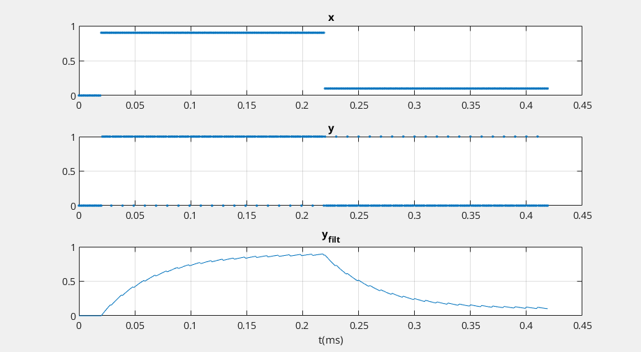

## Sigma-Delta DAC

Sigma-delta digital-to-analog converters (SD DAC’s) are often used for *discrete-time signals* with *sample rate much higher than their bandwidth*

- Because of the high sample rate relative to signal bandwidth, ***a very simple DAC reconstruction filter* (*Analog lowpass filter*)** suffices, often just a *one-pole RC lowpass*


```matlab
R= 4.7e3;                 % ohms resistor value
C= .01e-6;                % F capacitor value
fs= 1e6;                  % Hz DAC sample rate
% input signal
x= [zeros(1,20) .9*ones(1,200) .1*ones(1,200)];
% find output y of SD DAC and output y_filt of RC filter
[y,y_filt]= sd_dacRC(x,R,C,fs);

t = linspace(0,length(x)-1, length(x))*1/fs*1e3;
subplot(3,1,1)
plot(t, x, '.'); title('x'); grid on
subplot(3,1,2)
plot(t, y, '.'); title('y'); grid on
subplot(3,1,3)
plot(t, y_filt); title('y_{filt}'); xlabel('t(ms)'); grid on
```




## Appendix

```matlab
% https://www.dsprelated.com/showarticle/1642.php
% Neil Robertson, Model a Sigma-Delta DAC Plus RC Filter

% function [y,y_filt] = sd_dacRC(x,R,C,fs)  2/5/24 Neil Robertson
% 1-bit sigma-delta DAC with RC filter
% Model does not include a zero-order hold.
%
% x = input signal vector, 0 <= x < 1
% R = series resistor value, Ohms.  Normally R > 1000 for 3.3 V logic.
% C = shunt capacitor value, Farads
% fs = sample frequency, Hz
% y = DAC output signal vector, y(n) = 0 or 1
% y_filt = RC filter output signal vector
%
function [y,y_filt] = sd_dacRC(x,R,C,fs)
N= length(x);
x= fix(x*2^16)/2^16;        % quantize x to 16 bits
%I 1-bit Sigma-delta DAC
s= [x(1) zeros(1,N-1)];
for n= 2:N
    u= x(n) + s(n-1);
    s(n)= mod(u,1);        % sum
    y(n)= fix(u);          % carry
end
%II One-pole RC filter model
Ts= 1/fs;
Wc= 1/(R*C);               % rad -3 dB frequency
fc= Wc/(2*pi);             % Hz -3 dB frequency
a1= -exp(-Wc*Ts);
b0= 1 + a1;                % numerator coefficient
a= [1 a1];                 % denominator coeffs
y_filt= filter(b0,a,y);    % filter the DAC's output signal y

```


## reference

Dan Boschen. sigma delta modulator for DAC [[https://dsp.stackexchange.com/a/88357/59253](https://dsp.stackexchange.com/a/88357/59253)]

Neil Robertson, Model a Sigma-Delta DAC Plus RC Filter [[https://www.dsprelated.com/showarticle/1642.php](https://www.dsprelated.com/showarticle/1642.php)]

—, Modeling a Continuous-Time System with Matlab [[https://www.dsprelated.com/showarticle/1055.php](https://www.dsprelated.com/showarticle/1055.php)]

—, Modeling Anti-Alias Filters [[https://www.dsprelated.com/showarticle/1418.php](https://www.dsprelated.com/showarticle/1418.php)]

—, DAC Zero-Order Hold Models [[https://www.dsprelated.com/showarticle/1627.php](https://www.dsprelated.com/showarticle/1627.php)]

—, “A Simplified Matlab Function for Power Spectral Density”, DSPRelated.com, March, 2020, [[https://www.dsprelated.com/showarticle/1333.php](https://www.dsprelated.com/showarticle/1333.php)]

Jason Sachs. Return of the Delta-Sigma Modulators, Part 1: Modulation [[https://www.dsprelated.com/showarticle/1517/return-of-the-delta-sigma-modulators-part-1-modulation](https://www.dsprelated.com/showarticle/1517/return-of-the-delta-sigma-modulators-part-1-modulation)]

Woogeun Rhee. ISCAS 2019 Mini Tutorials: Single-Bit Delta-Sigma Modulation Techniques for Robust Wireless Systems [[https://youtu.be/OEyTM4-_OyA?si=vllJ5Pe8I3lqb_Vl](https://youtu.be/OEyTM4-_OyA?si=vllJ5Pe8I3lqb_Vl)]

---

