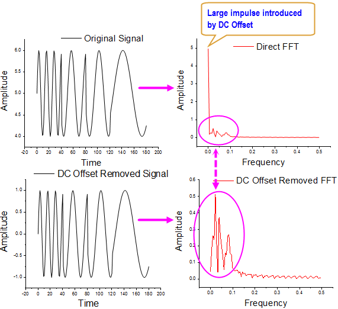

## DC offset

Performing FFT to a signal with a *large DC offset* would often result in a big impulse around frequency 0 Hz, thus masking out the signals of interests with relatively small amplitude.



One method to remove DC offset from the original signal before performing FFT

- Subtracting the Mean of Original Signal

 You can also not filter the input, but set zero to the zero frequency point for FFT result.

## Nyquist component

If we go back to the definition of the DFT
$$
X(N/2)=\sum_{n=0}^{N-1}x[n]e^{-j2\pi (N/2)n/2}=\sum_{n=0}^{N-1}x[n]e^{-j\pi n}=\sum_{n=0}^{N-1}x[n](-1)^n
$$
which is a real number.

The discrete function
$$
x[n]=\cos(\pi n)
$$
is always $(-1)^n$ for integer $n$

One general sinusoid at Nyquist and has phase shift $\theta$, this is $T=2$ and $T_s=1$

$$\begin{align}
x[n] &= A \cos(\pi n + \theta) \\
     &= A \big( \cos(\pi n) \cos(\theta) - \sin(\pi n) \sin(\theta) \big) \\
     &= \big(A\cos(\theta)\big) \cos(\pi n)  +  \big(-A\sin(\theta)\big) \sin(\pi n) \\
     &= \big(A\cos(\theta)\big) (-1)^n  +  \big(-A\sin(\theta)\big) \cdot 0 \\
     &= B \cdot (-1)^n \\
\end{align}$$

Where $A\cos(\theta)=B$.

Moreover $B \cdot (-1)^n = B\cdot \cos(\pi n)$, then
$$
B\cdot \cos(\pi n) =  A \cdot \cos(\pi n + \theta)
$$
We can **NOT** distinguish one from another.

In other words, you **CAN'T** infer the signal from $X(\frac{N}{2})$
$$\begin{align}
X(k)\frac{1}{N}e^{j 2 \pi \frac{nk}{N}}\bigg|_{k=\frac{N}{2}} &= \frac{X\left(\frac{N}{2} \right)}{N}(-1)^n  \\
&= \frac{X\left(\frac{N}{2} \right)}{N}\cos(\pi n)  \\
&= \frac{X\left(\frac{N}{2} \right)}{N}\left( \cos(\pi n) - \beta \sin(\pi n) \right) \\
&= \frac{X\left(\frac{N}{2} \right)}{N}\sqrt{1+\beta^2}\left(\frac{1}{\sqrt{1+\beta^2}} \cos(\pi n) - \frac{\beta}{\sqrt{1+\beta^2}} \sin(\pi n) \right) \\
&= \frac{X\left(\frac{N}{2} \right)}{N} \frac{1}{\cos(\theta)}\left(\cos(\theta) \cos(\pi n) - \sin(\theta) \sin(\pi n) \right) \\
&= \frac{X\left(\frac{N}{2} \right)}{N} \frac{1}{\cos(\theta)} \cos(\pi n+\theta)
\end{align}$$

where $\beta \in \mathbb{R}$ and you **wouldn't** know it because $\sin(\pi n)=0 \quad \forall n \in \mathbb{Z}$

For example, if $\theta=0$
$$
X(k)\frac{1}{N}e^{j 2 \pi \frac{nk}{N}}\bigg|_{k=\frac{N}{2}}= \frac{X\left(\frac{N}{2} \right)}{N} \cos(\pi n)
$$
However, if $\theta=\frac{\pi}{3}$
$$
X(k)\frac{1}{N}e^{j 2 \pi \frac{nk}{N}}\bigg|_{k=\frac{N}{2}}= \frac{X\left(\frac{N}{2} \right)}{N}\cdot 2 \cos(\pi n+\frac{\pi}{3})
$$

That sort of ambiguity is the reason for the **strict inequality** of the sampling theorem's condition.

### Duty Cycle Distortion

> [[https://www.youtube.com/watch?v=LMT-T41Y64U&lc=UgxiDRT5WB3Ej8IfaEF4AaABAg.9TpSIyAQQ9j9TvCho3IhbS](https://www.youtube.com/watch?v=LMT-T41Y64U&lc=UgxiDRT5WB3Ej8IfaEF4AaABAg.9TpSIyAQQ9j9TvCho3IhbS)]

**Both edges** is used for clock waveform to evaluate the duty cycle distortion,

Assuming TIE is `[0 0.2 0 0.2 0 0.2 ...]`, then subtract DC offset, we get `[-0.1 0.1 -0.1 0.1 ...]`, shown as below


The amplitude is manifested in FFT amplitude spectrum, i.e. Nyquist component, which is **0.1** in follow figure


```matlab
N = 32;
n = (1:N);
x = 0.1*(-1).^n;
figure(1)
stem(n-1, x);
X = fft(x)/N;
Xshift = fftshift(X);
fprintf("nyquist component: %.2f\n", Xshift(1));
magXshift = abs(Xshift);
ph = phase(Xshift)/pi*180;
figure(2)
subplot(3, 1, 1)
fx = (-N/2:N/2-1);
stem(fx, magXshift);
xlabel('Freq');
ylabel('|X(k)|');
title('mag of DFT');
grid on;

subplot(3, 1, 2)
stem(fx, ph);
xlabel('Freq');
ylabel('\angle X(k)(^oC)');
title('phase of DFT');
grid on;

%% inverse dft
ninv = (0:32-1);
xinv = Xshift(1)*cos(pi*ninv);
subplot(3, 1, 3);
hold on;
stem(ninv, x, "filled", 'r');
stem(ninv, xinv,'bd-.');
ninfer = (0:0.1:32+1);
xinfer1 = Xshift(1)*cos(pi*ninfer); % theta = 0
xinfer2 = Xshift(1)*2*cos(pi*ninfer+pi/3); % theta = pi/3
plot(ninfer, xinfer1, 'm--');
plot(ninfer, xinfer2, 'c--');
hold off;
legend('original', 'IDFT', '\theta=0', '\theta=\pi/3');
xlabel('time');
ylabel('V');
title('sample points');
grid on;
```


## Single-Sided Amplitude Spectrum

DC and Nyquist frequency of FFT left over

`P1(2:end-1) = 2*P1(2:end-1);`

```matlab
Fs = 1000;            % Sampling frequency
T = 1/Fs;             % Sampling period
L = 1500;             % Length of signal
t = (0:L-1)*T;        % Time vector
S = 0.7*sin(2*pi*50*t) + sin(2*pi*120*t);
X = S + 2*randn(size(t));
figure(1)
plot(1000*t(1:50),X(1:50))
title('Signal Corrupted with Zero-Mean Random Noise')
xlabel('t (milliseconds)')
ylabel('X(t)')

figure(2)
Y = fft(X);
P2 = abs(Y/L);      %!!! two-sided spectrum P2.
P1 = P2(1:L/2+1);   %!!! single-sided spectrum P1
P1(2:end-1) = 2*P1(2:end-1);	% exclude DC and Nyquist freqency
f = Fs*(0:(L/2))/L;
figure(2)
plot(f,P1)
title('Single-Sided Amplitude Spectrum of X(t)')
xlabel('f (Hz)')
ylabel('|P1(f)|')
```


## Alternative View

The direct current (DC) bin ($k=0$) and the bin at $k=N/2$, i.e., the bin that corresponds to the Nyquist frequency are **purely real and unique**.

sinusoidal waveform with $10Hz$, amplitude 1 is $cos(2\pi f_c t)$. The plot is shown as below with sampling frequency is $20Hz$


Amplitude and Phase spectrum, sampled with $f_s=20$ Hz


The FFT magnitude of $10Hz$ is **1** and its phase is **0** as shown as above, which proves the DFT and IDFT.

**Caution:** the power of FFT is related to samples (DFT Parseval's theorem), which may not be the power of continuous signal. The average power of samples is ([1 -1 1 -1 -1 1 ...]) is **1**, that of corresponding continuous signal is  $\frac{1}{2}$.

Power spectrum derived from FFT provide information of samples, i.e. **1**

Moreover, average power of sample [1 -1 1 -1 1 ...] is same with DC [1 1 1 1 ...].

### code

```matlab
fc = 10;
fs = 2*fc;
fov = 64*fc;

ts = (0:1/fs:26);
tov = (0:1/fov:26);

ys = cos(2*pi*fc*ts);
yov = cos(2*pi*fc*tov);
%% waveform
stem(ts, ys)
hold on;
plot(tov, yov);
legend('sample', 'waveform')
ylim([-1.5 1.5])
grid on;
xlabel('time(s)');
ylabel('mag(V)')

nfft = 256;
X = fftshift(fft(ys, nfft))/nfft;
f = (-nfft/2:nfft/2-1)*fs/nfft;
magX = abs(X);
phsX = atan2(imag(X),real(X));
%% fft spectrum
figure(2)
subplot(2, 1, 1);
stem(f, magX);
xlabel('Frequency(Hz)');
ylabel('mag')
xlim([min(f)-1 max(f)+1])
title('Amplitude spectrum')
subplot(2, 1, 2)
plot(f, phsX);
xlabel('Frequency(Hz)');
ylabel('phase (rad)')
xlim([min(f)-1 max(f)+1])
title('Phase spectrum')

%% power spectrum
yssq_sum_avg = sum(ys(1:nfft).^2)/nfft;
specsq_sum_avg = sum(abs(X).^2);
```


## reference

OriginLab, How to Remove DC Offset before Performing FFT URL: [http://blog.originlab.com/how-to-remove-dc-offset-before-performing-fft](http://blog.originlab.com/how-to-remove-dc-offset-before-performing-fft)

How to remove DC component in FFT? URL: [https://www.mathworks.com/matlabcentral/answers/712808-how-to-remove-dc-component-in-fft#answer_594373](https://www.mathworks.com/matlabcentral/answers/712808-how-to-remove-dc-component-in-fft#answer_594373)

Analyzing a signal that contains frequency content at Fs/2 doesn't seem to work unless there is a phase shift URL: [https://dsp.stackexchange.com/a/59807/59253](https://dsp.stackexchange.com/a/59807/59253)

Nyquist–Shannon sampling theorem, Critical frequency URL: [https://en.wikipedia.org/wiki/Nyquist%E2%80%93Shannon_sampling_theorem#Critical_frequency](https://en.wikipedia.org/wiki/Nyquist%E2%80%93Shannon_sampling_theorem#Critical_frequency)

Why remove energy at Nyquist before ifft? URL: [https://dsp.stackexchange.com/a/22851/59253](https://dsp.stackexchange.com/a/22851/59253)
