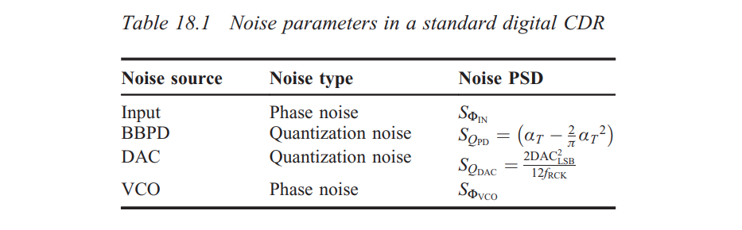
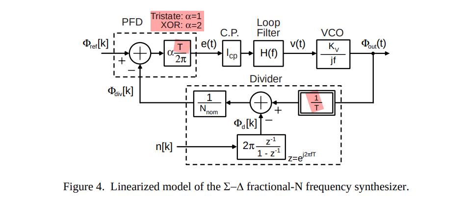
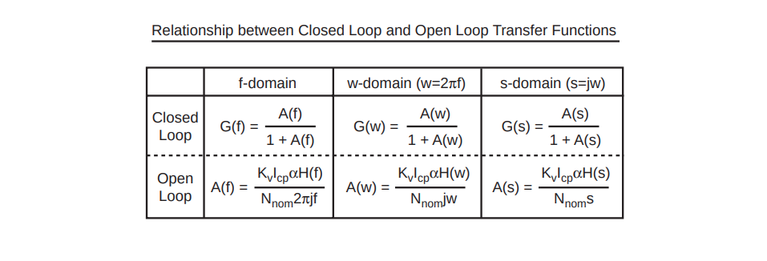
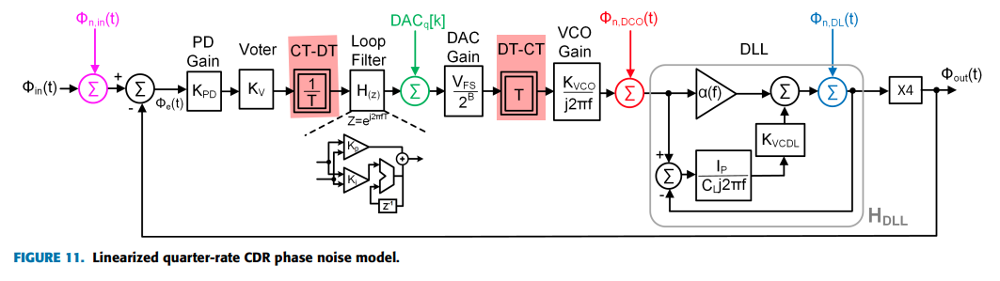

- inherently nonlinear
- quantization effects

## Quantization noise

Here, $\alpha_T$ is data transition density

BBPD quantization noise

DAC quantization noise

## Time to Digital Converter (TDC)

##  Digital to Phase Converter (DPC)

## Accumulate-and-dump (AAD) decimator

accumulating the input for $N$ cycles and then latching the result and resetting the integrator

> It adds up $N$ succeeding input samples at rate $1/T$ and delivers their sum in a *single* sample at the output. Therefore, the process comprises a **filter (in the accumulation)** and a **down-sampler (in the dump)**

## Moving Average and CIC Filters

> **cascade-integrator-comb (CIC)** decimator

*TODO* &#128197;

> An Intuitive Look at Moving Average and CIC Filters [[web](https://tomverbeure.github.io/2020/09/30/Moving-Average-and-CIC-Filters.html), [code](https://github.com/tomverbeure/pdm/tree/master/modeling/cic_filters)]
>
> A Beginner's Guide To Cascaded Integrator-Comb (CIC) Filters [[https://www.dsprelated.com/showarticle/1337.php](https://www.dsprelated.com/showarticle/1337.php)]

## Linearized Model

> *TODO* &#128197;
>
> Tristate: $\alpha=1$
>
> XOR: $\alpha=1$
>
> $\frac{1}{T}$ in Divider

> Michael H. Perrott, PLL Design Using the PLL Design Assistant Program. [[https://designers-guide.org/forum/Attachments/pll_manual.pdf](https://designers-guide.org/forum/Attachments/pll_manual.pdf)]

---

$\frac{1}{T}$ & $T$ come from *CT-DT* & *DT-CT*

> H. Kang *et al*., "A 42.7Gb/s Optical Receiver With Digital Clock and Data Recovery in 28nm CMOS," in *IEEE Access*, vol. 12, pp. 109900-109911, 2024  [[https://ieeexplore.ieee.org/stamp/stamp.jsp?tp=&arnumber=10630516](https://ieeexplore.ieee.org/stamp/stamp.jsp?tp=&arnumber=10630516)]

## Majority Voter (MV)

> Y. Xia *et al*., "A 10-GHz Low-Power Serial Digital Majority Voter Based on Moving Accumulative Sign Filter in a PS-/PI-Based CDR," in *IEEE Transactions on Microwave Theory and Techniques*, vol. 68, no. 12 [[https://sci-hub.se/10.1109/TMTT.2020.3029188](https://sci-hub.se/10.1109/TMTT.2020.3029188)]
>
> J. Liang, A. Sheikholeslami, "On-Chip Jitter Measurement and Mitigation Techniques for Clock and Data Recovery Circuits" [[https://tspace.library.utoronto.ca/bitstream/1807/91138/3/Liang_Joshua_201706_PhD_thesis.pdf](https://tspace.library.utoronto.ca/bitstream/1807/91138/3/Liang_Joshua_201706_PhD_thesis.pdf)]
>
> J. Liang, A. Sheikholeslami. ISSCC2017. "A 28Gbps Digital CDR with Adaptive Loop Gain for Optimum Jitter Tolerance" [[slides](https://picture.iczhiku.com/resource/eetop/whiGpozAyuTUAnmb.pdf),[paper](https://www.eecg.utoronto.ca/~ali/papers/isscc2017-josh.pdf)]
>
> J. Liang, A. Sheikholeslami,, "Loop Gain Adaptation for Optimum Jitter Tolerance in Digital CDRs," in *IEEE Journal of Solid-State Circuits* [[https://sci-hub.se/10.1109/JSSC.2018.2839038](https://sci-hub.se/10.1109/JSSC.2018.2839038)]
>
> M. M. Khanghah, K. D. Sadeghipour, D. Kelly, C. Antony, P. Ossieur and P. D. Townsend, "A 7-Bit 7-GHz Multiphase Interpolator-Based DPC for CDR Applications," in *IEEE Transactions on Circuits and Systems I: Regular Papers* [[https://cora.ucc.ie/bitstreams/7ae5bfaa-8dd9-45a7-8276-99676b7b6078/download](https://cora.ucc.ie/bitstreams/7ae5bfaa-8dd9-45a7-8276-99676b7b6078/download)]

## reference

J. L. Sonntag and J. Stonick, "A Digital Clock and Data Recovery Architecture for Multi-Gigabit/s Binary Links," in *IEEE Journal of Solid-State Circuits*, vol. 41, no. 8, pp. 1867-1875, Aug. 2006 

Sonntag, Jeff & Stonick, J.. (2005). A digital clock and data recovery architecture for multi-gigabit/s binary links. 2005. 537 - 544. 10.1109/CICC.2005.1568725. 

John T. Stonick, ISSCC 2011 tutorial. "DPLL Based Clock and Data Recovery" [[https://www.nishanchettri.com/isscc-slides/2011%20ISSCC/TUTORIALS/ISSCC2011Visuals-T5.pdf](https://www.nishanchettri.com/isscc-slides/2011%20ISSCC/TUTORIALS/ISSCC2011Visuals-T5.pdf)]

P. K. Hanumolu, M. G. Kim, G. -y. Wei and U. -k. Moon, "A 1.6Gbps Digital Clock and Data Recovery Circuit," *IEEE Custom Integrated Circuits Conference 2006*, San Jose, CA, USA, 2006, pp. 603-606

Pavan Hanumolu, ISSCC 2015 tutorial. "Clock and Data Recovery Architectures & Circuits"  [[https://www.nishanchettri.com/isscc-slides/2015%20ISSCC/TUTORIALS/ISSCC2015Visuals-T6.pdf](https://www.nishanchettri.com/isscc-slides/2015%20ISSCC/TUTORIALS/ISSCC2015Visuals-T6.pdf)]

Fulvio Spagna. INTEL, CICC2018, "Clock and Data Recovery Systems" [[https://picture.iczhiku.com/resource/eetop/WhiTfzdJZSZyDcBM.pdf](https://picture.iczhiku.com/resource/eetop/WhiTfzdJZSZyDcBM.pdf)]

Akihide Sai. ISSCC 2023, T5 "All Digital Plls From Fundamental Concepts To Future Trends" [[https://www.nishanchettri.com/isscc-slides/2023%20ISSCC/TUTORIALS/T5.pdf](https://www.nishanchettri.com/isscc-slides/2023%20ISSCC/TUTORIALS/T5.pdf)]

Liu, Tao, Tiejun Li, Fangxu Lv, Bin Liang, Xuqiang Zheng, Heming Wang, Miaomiao Wu, Dechao Lu, and Feng Zhao. 2021. "Analysis and Modeling of Mueller-Muller Clock and Data Recovery Circuits" *Electronics* 10, no. 16: 1888. https://doi.org/10.3390/electronics10161888

Gu, Youzhi & Feng, Xinjie & Chi, Runze & Chen, Yongzhen & Wu, Jiangfeng. (2022). Analysis of Mueller-Muller Clock and Data Recovery Circuits with a Linearized Model. 10.21203/rs.3.rs-1817774/v1. [[https://assets-eu.researchsquare.com/files/rs-1817774/v1_covered.pdf?c=1664188179](https://assets-eu.researchsquare.com/files/rs-1817774/v1_covered.pdf?c=1664188179)]

H. Kang et al., "A 42.7Gb/s Optical Receiver With Digital Clock and Data Recovery in 28nm CMOS," in IEEE Access, vol. 12, pp. 109900-109911, 2024 [[https://ieeexplore.ieee.org/stamp/stamp.jsp?arnumber=10630516](https://ieeexplore.ieee.org/stamp/stamp.jsp?arnumber=10630516)]

Marinaci, Stefano. "Study of a Phase Locked Loop based Clock and Data Recovery Circuit for 2.5 Gbps data-rate" [[https://cds.cern.ch/record/2870334/files/CERN-THESIS-2023-147.pdf](https://cds.cern.ch/record/2870334/files/CERN-THESIS-2023-147.pdf)]

P. Palestri *et al*., "Analytical Modeling of Jitter in Bang-Bang CDR Circuits Featuring Phase Interpolation," in *IEEE Transactions on Very Large Scale Integration (VLSI) Systems*, vol. 29, no. 7, pp. 1392-1401, July 2021 [[https://sci-hub.se/10.1109/TVLSI.2021.3068450](https://sci-hub.se/10.1109/TVLSI.2021.3068450)]

F. M. Gardner, "Phaselock Techniques", 3rd Edition, Wiley Interscience, Hoboken, NJ, 2005 [[https://picture.iczhiku.com/resource/eetop/WyIgwGtkDSWGSxnm.pdf](https://picture.iczhiku.com/resource/eetop/WyIgwGtkDSWGSxnm.pdf)]

Rhee, W. (2020). *Phase-locked frequency generation and clocking : architectures and circuits for modern wireless and wireline systems*. The Institution of Engineering and Technology

M.H. Perrott, Y. Huang, R.T. Baird, B.W. Garlepp, D. Pastorello, E.T. King, Q. Yu, D.B. Kasha, P. Steiner, L. Zhang, J. Hein, B. Del Signore, "A 2.5 Gb/s Multi-Rate 0.25μm CMOS Clock and Data Recovery Circuit Utilizing a Hybrid Analog/Digital Loop Filter and All-Digital Referenceless Frequency Acquisition," IEEE J. Solid-State Circuits, vol. 41, Dec. 2006, pp. 2930-2944 [[https://cppsim.com/Publications/JNL/perrott_jssc06.pdf](https://cppsim.com/Publications/JNL/perrott_jssc06.pdf)]
