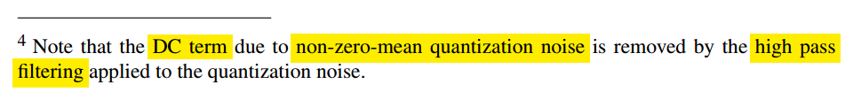

- The oversampled output has almost the same S/N ratio as the input but much fewer bits (e.g. 16 reduced to 1)
- Fewer bits means it’s easier to implement the digital to analog conversion further along the signal processing path
- 


## linearized model


$$\begin{align}
v[n] = \{0,1,2,...,M-1\} &\space\Rightarrow\space  y[n] = 0 \space\Rightarrow\space  e_q[n] = \{0, -\frac{1}{M},-\frac{2}{M},...,-\frac{M-1}{M}\} \\
v[n] = \{M,M+1,M2,...,2M-1\} &\space\Rightarrow\space  y[n] = 1 \space\Rightarrow\space  e_q[n] = \{0, -\frac{1}{M},-\frac{2}{M},...,-\frac{M-1}{M}\}
\end{align}$$

> 

For the three stages of the MASH 1-1-1 DDSM


---

***1st order DDSM (digital accumulator)***


***2nd order DDSM***


In $z$-domain
$$
\left\{(A + D - Y)\frac{z^{-1}}{1-z^{-1}} - 2Y \right\}\frac{z^{-1}}{1-z^{-1}} + Q = Y
$$
That is
$$
Y = A z^{-2} + Dz^{-2} + Q(1-z^{-1})^2
$$
In time domain
$$\begin{align}
y[n] &= \alpha[n-2] + d[n-2] +  q[n]-2q[n-1]+q[n-2] \\
&= \alpha + d[n-2] + q[n]-2q[n-1]+q[n-2]
\end{align}$$


## LSB Dither - wordlength & quantizer step size


---


??  ***integer valued impulse responses***

> S. Pamarti, J. Welz and I. Galton, "Statistics of the Quantization Noise in 1-Bit Dithered Single-Quantizer Digital Delta–Sigma Modulators," in *IEEE Transactions on Circuits and Systems I: Regular Papers*, vol. 54, no. 3, pp. 492-503, March 2007 [[pdf](https://ispg.ucsd.edu/wordpress/wp-content/uploads/2017/05/2007-TCASI-S.-Pamarti-Statistics-of-the-Quantization-Noise-in-1-Bit-Dithered-Single-Quantizer-Digital-Delta-Sigma-Modulators.pdf)]


## Fractional-N PLL


### Fractional-N Divider Model


$$
(N+\alpha)T_{PLL}  - \tau[n-1] +\tau[n] =  (N+y[n])T_{PLL}
$$

i.e.
$$
\tau[n] = \tau[n-1] + (y[n] - \alpha)T_{PLL}
$$

where $\tau[n] = t_{v_{DIV}} -  t_{v_{DIV}, desired}$ 


### $\Delta\Sigma$ noise in PLL


## Sigma-Delta DAC

Sigma-delta digital-to-analog converters (SD DAC’s) are often used for *discrete-time signals* with *sample rate much higher than their bandwidth*

- Because of the high sample rate relative to signal bandwidth, ***a very simple DAC reconstruction filter* (*Analog lowpass filter*)** suffices, often just a *one-pole RC lowpass*


```matlab
R= 4.7e3;                 % ohms resistor value
C= .01e-6;                % F capacitor value
fs= 1e6;                  % Hz DAC sample rate
% input signal
x= [zeros(1,20) .9*ones(1,200) .1*ones(1,200)];
% find output y of SD DAC and output y_filt of RC filter
[y,y_filt]= sd_dacRC(x,R,C,fs);

t = linspace(0,length(x)-1, length(x))*1/fs*1e3;
subplot(3,1,1)
plot(t, x, '.'); title('x'); grid on
subplot(3,1,2)
plot(t, y, '.'); title('y'); grid on
subplot(3,1,3)
plot(t, y_filt); title('y_{filt}'); xlabel('t(ms)'); grid on
```


---

```matlab
% https://www.dsprelated.com/showarticle/1642.php
% Neil Robertson, Model a Sigma-Delta DAC Plus RC Filter

% function [y,y_filt] = sd_dacRC(x,R,C,fs)  2/5/24 Neil Robertson
% 1-bit sigma-delta DAC with RC filter
% Model does not include a zero-order hold.
%
% x = input signal vector, 0 <= x < 1
% R = series resistor value, Ohms.  Normally R > 1000 for 3.3 V logic.
% C = shunt capacitor value, Farads
% fs = sample frequency, Hz
% y = DAC output signal vector, y(n) = 0 or 1
% y_filt = RC filter output signal vector
%
function [y,y_filt] = sd_dacRC(x,R,C,fs)
N= length(x);
x= fix(x*2^16)/2^16;        % quantize x to 16 bits
%I 1-bit Sigma-delta DAC
s= [x(1) zeros(1,N-1)];
for n= 2:N
    u= x(n) + s(n-1);
    s(n)= mod(u,1);        % sum
    y(n)= fix(u);          % carry
end

%II One-pole RC filter model
% Matched z-Transform https://ocw.mit.edu/courses/2-161-signal-processing-continuous-and-discrete-fall-2008/cc00ac6d468dc9dcf2238fc1d1a194d4_lecture_19.pdf
Ts= 1/fs;
Wc= 1/(R*C);               % rad -3 dB frequency
fc= Wc/(2*pi);             % Hz -3 dB frequency
a1= -exp(-Wc*Ts);
b0= 1 + a1;                % numerator coefficient
a= [1 a1];                 % denominator coeffs
y_filt= filter(b0,a,y);    % filter the DAC's output signal y

```


## DAC ZOH


> The last D2C is in human vision, which connect discrete time $y(m)$ with line, implicitly


## reference

Michael Peter Kennedy. scv-cas 2014: Digital Delta-Sigma Modulators [[pdf](http://site.ieee.org/scv-cas/files/2014/07/2014Kennedy.pdf),[recording](http://www.youtube.com/watch?v=BwoY_OzCMbo&feature=youtu.be)]

Jason Sachs. Return of the Delta-Sigma Modulators, Part 1: Modulation [[https://www.dsprelated.com/showarticle/1517/return-of-the-delta-sigma-modulators-part-1-modulation](https://www.dsprelated.com/showarticle/1517/return-of-the-delta-sigma-modulators-part-1-modulation)]

---

Neil Robertson, Model a Sigma-Delta DAC Plus RC Filter [[https://www.dsprelated.com/showarticle/1642.php](https://www.dsprelated.com/showarticle/1642.php)]

—, Modeling a Continuous-Time System with Matlab [[https://www.dsprelated.com/showarticle/1055.php](https://www.dsprelated.com/showarticle/1055.php)]

—, DAC Zero-Order Hold Models [[https://www.dsprelated.com/showarticle/1627.php](https://www.dsprelated.com/showarticle/1627.php)]

—, “A Simplified Matlab Function for Power Spectral Density”, DSPRelated.com, March, 2020, [[https://www.dsprelated.com/showarticle/1333.php](https://www.dsprelated.com/showarticle/1333.php)]

Dan Boschen. sigma delta modulator for DAC [[https://dsp.stackexchange.com/a/88357/59253](https://dsp.stackexchange.com/a/88357/59253)]

Woogeun Rhee. ISCAS 2019 Mini Tutorials: Single-Bit Delta-Sigma Modulation Techniques for Robust Wireless Systems [[https://youtu.be/OEyTM4-_OyA?si=vllJ5Pe8I3lqb_Vl](https://youtu.be/OEyTM4-_OyA?si=vllJ5Pe8I3lqb_Vl)]

---

Pavan, Shanthi, Richard Schreier, and Gabor Temes. (2016) 2016. Understanding Delta-Sigma Data Converters. 2nd ed. Wiley. 

Rhee, W. (2020). *Phase-locked frequency generation and clocking : architectures and circuits for modern wireless and wireline systems*. The Institution of Engineering and Technology
