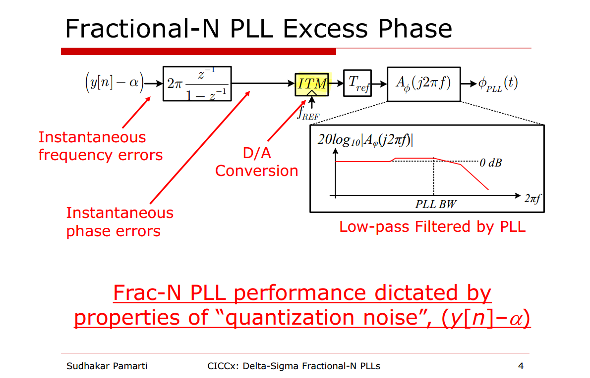
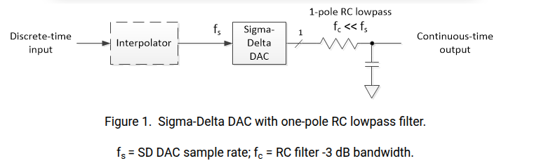

## linearized model


$$\begin{align}
v[n] = \{0,1,2,...,M-1\} &\space\Rightarrow\space  y[n] = 0 \space\Rightarrow\space  e_q[n] = \{0, -\frac{1}{M},-\frac{2}{M},...,-\frac{M-1}{M}\} \\
v[n] = \{M,M+1,M2,...,2M-1\} &\space\Rightarrow\space  y[n] = 1 \space\Rightarrow\space  e_q[n] = \{0, -\frac{1}{M},-\frac{2}{M},...,-\frac{M-1}{M}\}
\end{align}$$

> 

For the three stages of the MASH 1-1-1 DDSM


---

***1st order DDSM (digital accumulator)***


assuming $n_0=2$

| $x[n]+s[n]$ | $v$   | $e[n]$ | $c[n]$, y |
| ----------- | ----- | ------ | --------- |
| 0\|00       | 0     | 0      | 0         |
| 0\|01       | 1     | 1      | 0         |
| 0\|10       | 2     | 2      | 0         |
| 0\|11       | 3     | 3      | 0         |
| 1\|00       | **4** | 0      | 1         |
| 1\|01       | 5     | 1      | 1         |
| 1\|10       | 6     | 2      | 1         |
| 1\|11       | 7     | 3      | 1         |

yield $M=2^{n_0}=4$


***2nd order DDSM***


In $z$-domain
$$
\left\{(A + D - Y)\frac{z^{-1}}{1-z^{-1}} - 2Y \right\}\frac{z^{-1}}{1-z^{-1}} + Q = Y
$$
That is
$$
Y = A z^{-2} + Dz^{-2} + Q(1-z^{-1})^2
$$
In time domain
$$\begin{align}
y[n] &= \alpha[n-2] + d[n-2] +  q[n]-2q[n-1]+q[n-2] \\
&= \alpha + d[n-2] + q[n]-2q[n-1]+q[n-2]
\end{align}$$


## LSB Dither


---


??  ***integer valued impulse responses***

> S. Pamarti, J. Welz and I. Galton, "Statistics of the Quantization Noise in 1-Bit Dithered Single-Quantizer Digital Delta–Sigma Modulators," in *IEEE Transactions on Circuits and Systems I: Regular Papers*, vol. 54, no. 3, pp. 492-503, March 2007 [[pdf](https://ispg.ucsd.edu/wordpress/wp-content/uploads/2017/05/2007-TCASI-S.-Pamarti-Statistics-of-the-Quantization-Noise-in-1-Bit-Dithered-Single-Quantizer-Digital-Delta-Sigma-Modulators.pdf)]


##  stability of DSM 


### accumulator wordlength 

> Z. Ye and M. P. Kennedy, "Hardware Reduction in Digital Delta–Sigma Modulators Via Error Masking—Part II: SQ-DDSM," in *IEEE Transactions on Circuits and Systems II: Express Briefs*, vol. 56, no. 2, pp. 112-116, Feb. 2009 [[https://sci-hub.se/10.1109/TCSII.2008.2010188](https://sci-hub.se/10.1109/TCSII.2008.2010188)]
>
> —, "Hardware Reduction in Digital Delta-Sigma Modulators Via Error Masking - Part I: MASH DDSM," in *IEEE Transactions on Circuits and Systems I: Regular Papers*, vol. 56, no. 4, pp. 714-726, April 2009 [[https://sci-hub.se/10.1109/TCSI.2008.2003383](https://sci-hub.se/10.1109/TCSI.2008.2003383)]


### Truncation DAC

> ***accumulator is implicit quantizer***


with $\frac{y}{2^{m_2}} + q= v$,  where $v = \lfloor\frac{y}{2^{m_2}}\rfloor$

$$
\left\{ \begin{array}{cl}
Y + 2^{m_2} Q &= 2^{m_2}V   \\
U - z^{-1}2^{m_2}Q &= Y  
\end{array} \right.
$$

The STF & NTF is shown as below
$$
V = \frac{1}{2^{m_2}}U + (1-z^{-1})Q
$$

To avoid accumulator overflow, ***stable input range is only of a fraction of the full scale*** ( $2^{m_1+m_2}-1$)
$$
u \leq 2^{m_1+m_2} - 2^{m_2}
$$

```python
m1 = 2  # MSBs
m2 = 4  # LSBs

ymax = 2**(m1 + m2)
umax = 2**(m1 + m2) - 2**m2     # int(m1*'1'+m2*'0', 2)
# format(48, '06b')
# Out[4]: '110000'

u = 48
assert u <= umax

ylist = [0]; vlist = [0]
elist = []; outlist = []

Niter = 2**10
for _ in range(Niter):
    ecur = vlist[-1] - ylist[-1]
    elist.append(ecur)
    ycur = (u - ecur)
    assert ycur < ymax, print(ycur)
    ylist.append(ycur)
    ycur_bin = format(ycur, f'0{m1+m2}b')
    vcur = int(ycur_bin[:-m2]+'0'*m2, 2)
    vlist.append(vcur)
    outlist.append(int(ycur_bin[:-m2], 2))

print(vlist); print(ylist)
print(sum(vlist)/len(vlist)); print(sum(outlist)/len(outlist)*2**m2)
```

---


To avoid overflow

$$
\log_2(2^k + 2^{N-m}) \leq N
$$

Thus
$$
N \ge k - \log_2(1 - \frac{1}{2^m}) = k+m -\log_2(2^m-1)
$$

suppose $m\in [1,+\infty)$
$$
k < k - \log_2(1 - \frac{1}{2^m}) \leq k + 1
$$
$N = k +1$ is sufficient for any $k$

> In the above Temes's sides, $N = m_1+m_2$ and $m=m_1$, we have
> $$
> 2^k \leq 2^{m_1+m_2}\cdot (1-\frac{1}{2^{m_1}}) = 2^{m_1+m_2} - 2^{m_2}
> $$

Generally speaking, $N \propto k$ and $N \propto \frac{1}{m}$, especially $N_{min} = k+1$ if *single-bit quantizer* $m=1$


## Fractional-N PLL


### Divider Model


$$
(N+\alpha)T_{PLL}  - \tau[n-1] +\tau[n] =  (N+y[n])T_{PLL}
$$

i.e.
$$
\tau[n] = \tau[n-1] + (y[n] - \alpha)T_{PLL}
$$

where $\tau[n] = t_{v_{DIV}} -  t_{v_{DIV}, desired}$ 


### $\Delta\Sigma$ noise in PLL


## Impulse Train Modulator (ITM)

> M. H. Perrott, M. D. Trott and C. G. Sodini, "A modeling approach for /spl Sigma/-/spl Delta/ fractional-N frequency synthesizers allowing straightforward noise analysis," in *IEEE Journal of Solid-State Circuits*, vol. 37, no. 8, pp. 1028-1038, Aug. 2002 [[https://www.cppsim.com/Publications/JNL/perrott_jssc02.pdf](https://www.cppsim.com/Publications/JNL/perrott_jssc02.pdf)]


---




## $\Delta\Sigma$ DAC

### LPF (RC Filter)

> Neil Robertson, Model a Sigma-Delta DAC Plus RC Filter [[https://www.dsprelated.com/showarticle/1642.php](https://www.dsprelated.com/showarticle/1642.php)]


Sigma-delta digital-to-analog converters (SD DAC’s) are often used for *discrete-time signals* with *sample rate much higher than their bandwidth*

- Because of the high sample rate relative to signal bandwidth, ***a very simple DAC reconstruction filter* (*Analog lowpass filter*)** suffices, often just a *one-pole RC lowpass*




```matlab
R= 4.7e3;                 % ohms resistor value
C= .01e-6;                % F capacitor value
fs= 1e6;                  % Hz DAC sample rate
% input signal
x= [zeros(1,20) .9*ones(1,200) .1*ones(1,200)];
% find output y of SD DAC and output y_filt of RC filter
[y,y_filt]= sd_dacRC(x,R,C,fs);

t = linspace(0,length(x)-1, length(x))*1/fs*1e3;
subplot(3,1,1)
plot(t, x, '.'); title('x'); grid on
subplot(3,1,2)
plot(t, y, '.'); title('y'); grid on
subplot(3,1,3)
plot(t, y_filt); title('y_{filt}'); xlabel('t(ms)'); grid on
```


---

```matlab
% https://www.dsprelated.com/showarticle/1642.php
% Neil Robertson, Model a Sigma-Delta DAC Plus RC Filter

% function [y,y_filt] = sd_dacRC(x,R,C,fs)  2/5/24 Neil Robertson
% 1-bit sigma-delta DAC with RC filter
% Model does not include a zero-order hold.
%
% x = input signal vector, 0 <= x < 1
% R = series resistor value, Ohms.  Normally R > 1000 for 3.3 V logic.
% C = shunt capacitor value, Farads
% fs = sample frequency, Hz
% y = DAC output signal vector, y(n) = 0 or 1
% y_filt = RC filter output signal vector
%
function [y,y_filt] = sd_dacRC(x,R,C,fs)
N= length(x);
x= fix(x*2^16)/2^16;        % quantize x to 16 bits
%I 1-bit Sigma-delta DAC
s= [x(1) zeros(1,N-1)];
for n= 2:N
    u= x(n) + s(n-1);
    s(n)= mod(u,1);        % sum
    y(n)= fix(u);          % carry
end

%II One-pole RC filter model
% Matched z-Transform https://ocw.mit.edu/courses/2-161-signal-processing-continuous-and-discrete-fall-2008/cc00ac6d468dc9dcf2238fc1d1a194d4_lecture_19.pdf
Ts= 1/fs;
Wc= 1/(R*C);               % rad -3 dB frequency
fc= Wc/(2*pi);             % Hz -3 dB frequency
a1= -exp(-Wc*Ts);
b0= 1 + a1;                % numerator coefficient
a= [1 a1];                 % denominator coeffs
y_filt= filter(b0,a,y);    % filter the DAC's output signal y

```


### ZOH (Zero-Order Hold Models)

> Neil Robertson, DAC Zero-Order Hold Models [[https://www.dsprelated.com/showarticle/1627.php](https://www.dsprelated.com/showarticle/1627.php)]


> The last D2C is in human vision, which connect discrete time $y(m)$ with line, implicitly


### Sinc Corrector

> Neil Robertson, Design a DAC sinx/x Corrector [[https://www.dsprelated.com/showarticle/1191.php](https://www.dsprelated.com/showarticle/1191.php)]
>
> Dan Boschen. how to make CIC compensation filter [[https://dsp.stackexchange.com/a/31596/59253](https://dsp.stackexchange.com/a/31596/59253)]
>
> —. Core Building Blocks for Software Defined Radio (SDR): DDC, DUC, NCO) [[https://lnkd.in/p/e2MtC9QK](https://lnkd.in/p/e2MtC9QK)]
>
> Equalizing Techniques Flatten DAC Frequency Response [[https://www.analog.com/en/resources/technical-articles/equalizing-techniques-flatten-dac-frequency-response.html](https://www.analog.com/en/resources/technical-articles/equalizing-techniques-flatten-dac-frequency-response.html)]

aka. ***Inverse Sinc Compensation***

*TODO* &#128197;


### OSR & NS

***maximum output signal 22kHz***


$$SNR = 16\times 6.02 + 1.76 =  98.08$$


---


```matlab
OSR = 5.65e6/(2*22e3);
Nin = 16;
Nout = 1;

SNR_in = 6.02*Nin + 1.76;

SNR_ds = 6.02*Nout + 1.76 - 10*log10(pi^4/5) + 50*log10(OSR);

QN_in = 1/10^(SNR_in/10);
QN_ds = 1/10^(SNR_ds/10);

SNR_out = 10*log10(1/(QN_in + QN_ds));
```


## MASH implementaion

> J. W. M. Rogers, F. F. Dai, M. S. Cavin and D. G. Rahn, "A multiband /spl Delta//spl Sigma/ fractional-N frequency synthesizer for a MIMO WLAN transceiver RFIC," in *IEEE Journal of Solid-State Circuits*, vol. 40, no. 3, pp. 678-689, March 2005 [[https://sci-hub.se/10.1109/JSSC.2005.843604](https://sci-hub.se/10.1109/JSSC.2005.843604)]

*TODO* &#128197;


## reference

Michael Peter Kennedy. scv-cas 2014: Digital Delta-Sigma Modulators [[pdf](http://site.ieee.org/scv-cas/files/2014/07/2014Kennedy.pdf),[recording](http://www.youtube.com/watch?v=BwoY_OzCMbo&feature=youtu.be)]

—, Recent advances in the analysis, design and optimization of Digital Delta-Sigma Modulators [[pdf](https://www.jstage.jst.go.jp/article/nolta/3/3/3_258/_pdf/-char/en)]

Kaveh Hosseini and Peter Kennedy. 2006 Hardware Efficient Maximum Sequence Length Digital MASH Delta Sigma Modulator [[pdf](https://picture.iczhiku.com/resource/eetop/wYIFpwTduPQeJvmx.pdf)]

Jason Sachs. Return of the Delta-Sigma Modulators, Part 1: Modulation [[https://www.dsprelated.com/showarticle/1517/return-of-the-delta-sigma-modulators-part-1-modulation](https://www.dsprelated.com/showarticle/1517/return-of-the-delta-sigma-modulators-part-1-modulation)]

---

Neil Robertson, Modeling a Continuous-Time System with Matlab [[https://www.dsprelated.com/showarticle/1055.php](https://www.dsprelated.com/showarticle/1055.php)]

—, “A Simplified Matlab Function for Power Spectral Density”, DSPRelated.com, March, 2020, [[https://www.dsprelated.com/showarticle/1333.php](https://www.dsprelated.com/showarticle/1333.php)]

Rick Lyons. How Discrete Signal Interpolation Improves D/A Conversion [[https://www.dsprelated.com/showarticle/167.php](https://www.dsprelated.com/showarticle/167.php)]

Dan Boschen. sigma delta modulator for DAC [[https://dsp.stackexchange.com/a/88357/59253](https://dsp.stackexchange.com/a/88357/59253)]

Woogeun Rhee. ISCAS 2019 Mini Tutorials: Single-Bit Delta-Sigma Modulation Techniques for Robust Wireless Systems [[https://youtu.be/OEyTM4-_OyA?si=vllJ5Pe8I3lqb_Vl](https://youtu.be/OEyTM4-_OyA?si=vllJ5Pe8I3lqb_Vl)]

—, 2001 Phd Thesis: Multi-Bit Delta -Sigma Modulation Technique for Fractional-N Frequency Synthesizers [[https://www.ime.tsinghua.edu.cn/Thesis_rhee.pdf](https://www.ime.tsinghua.edu.cn/Thesis_rhee.pdf)]

---

S. Pamarti, J. Welz and I. Galton, "Statistics of the Quantization Noise in 1-Bit Dithered Single-Quantizer Digital Delta–Sigma Modulators," in *IEEE Transactions on Circuits and Systems I: Regular Papers*, vol. 54, no. 3, pp. 492-503, March 2007 [[https://ispg.ucsd.edu/wordpress/wp-content/uploads/2017/05/2007-TCASI-S.-Pamarti-Statistics-of-the-Quantization-Noise-in-1-Bit-Dithered-Single-Quantizer-Digital-Delta-Sigma-Modulators.pdf](https://ispg.ucsd.edu/wordpress/wp-content/uploads/2017/05/2007-TCASI-S.-Pamarti-Statistics-of-the-Quantization-Noise-in-1-Bit-Dithered-Single-Quantizer-Digital-Delta-Sigma-Modulators.pdf)]

—. "LSB Dithering in MASH Delta–Sigma D/A Converters," in *IEEE Transactions on Circuits and Systems I: Regular Papers*, vol. 54, no. 4, pp. 779-790, April 2007 [[https://sci-hub.se/10.1109/TCSI.2006.888780](https://sci-hub.se/10.1109/TCSI.2006.888780)]

—. CICC 2020 ES2-2: Basics of Closed- and Open-Loop Fractional Frequency Synthesis [[https://youtu.be/t1TY-D95CY8?si=tbav3J2yag38HyZx](https://youtu.be/t1TY-D95CY8?si=tbav3J2yag38HyZx)]

Ian Galton. Delta-Sigma Fractional-N Phase-Locked Loops [[https://ispg.ucsd.edu/wordpress/wp-content/uploads/2022/10/fnpll_ieee_tutorial_2003_corrected.pdf](https://ispg.ucsd.edu/wordpress/wp-content/uploads/2022/10/fnpll_ieee_tutorial_2003_corrected.pdf)]

—. ISSCC 2010 SC3: Fractional-N PLLs [[https://www.nishanchettri.com/isscc-slides/2010%20ISSCC/Short%20Course/SC3.pdf](https://www.nishanchettri.com/isscc-slides/2010%20ISSCC/Short%20Course/SC3.pdf)]

—. “Delta-Sigma Fractional-N Phase-Locked Loops.” (2003).

Mike Shuo-Wei Chen, ISSCC 2020 T6: Digital Fractional-N Phase Locked Loop Design [[https://www.nishanchettri.com/isscc-slides/2020%20ISSCC/TUTORIALS/T6Visuals.pdf](https://www.nishanchettri.com/isscc-slides/2020%20ISSCC/TUTORIALS/T6Visuals.pdf)]

---

Pavan, Shanthi, Richard Schreier, and Gabor Temes. (2016) 2016. Understanding Delta-Sigma Data Converters. 2nd ed. Wiley. 

---

John Rogers, Calvin Plett, and Foster Dai. 2006. Integrated Circuit Design for High-Speed Frequency Synthesis (Artech House Microwave Library). Artech House, Inc., USA. [[pdf](https://picture.iczhiku.com/resource/eetop/WYifyQGopsQZevmN.pdf)]

Rhee, W. (2020). *Phase-locked frequency generation and clocking : architectures and circuits for modern wireless and wireline systems*. The Institution of Engineering and Technology

K. Hosseini and M. P. Kennedy, Minimizing Spurious Tones in Digital Delta-Sigma Modulators (Analog Circuits and Signal Processing). New York, NY, USA: Springer, 2011.

Rhee, W. (2020). *Phase-locked frequency generation and clocking : architectures and circuits for modern wireless and wireline systems*. The Institution of Engineering and Technology

Lacaita, Andrea Leonardo, Salvatore Levantino, and Carlo Samori. *Integrated frequency synthesizers for wireless systems*. Cambridge University Press, 2007.

