## Classification

- Continuous-Time (CT) Analog Modulator
  - Sampled Quantizer: Synchronous Modulator
  - Unsampled Quantizer: Asynchronous Modulator
- Discrete-Time (DT) Analog Modulator
  - The main application is in $\Delta\Sigma$ ADCs

- Discrete-Time Digital Modulators (DDSM)
  - Single Quantizer DDSMs - output feedback
  - Error feedback modulators (EFM) - error feedback
  - **M**ulti st**A**ge noise **SH**aping (**MASH**)


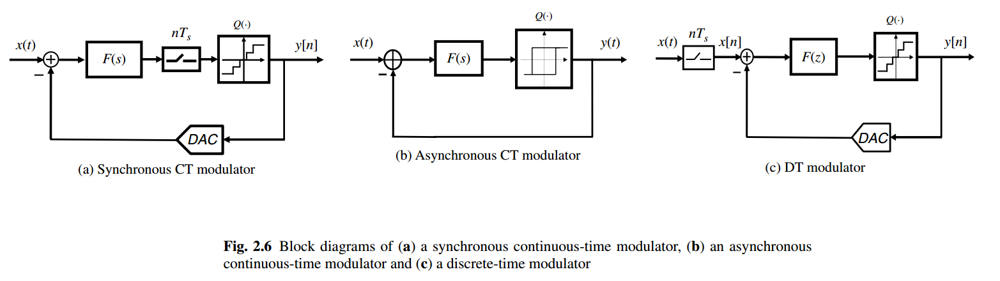

---


> *"**Quantizers**" and "**truncators**", and "**integrators**" and "**accumulators**" are used in **delta-sigma ADCs** and **DACs**, respectively*
>
> P. Kiss, J. Arias and Dandan Li, "Stable high-order delta-sigma DACS," *2003 IEEE International Symposium on Circuits and Systems (ISCAS)*, Bangkok, 2003 [[https://www.ele.uva.es/~jesus/analog/tcasi2003.pdf](https://www.ele.uva.es/~jesus/analog/tcasi2003.pdf)]


## Oversampling


> David Johns and Ken Martin. Oversampling Converters [[https://www.eecg.toronto.edu/~johns/ece1371/slides/14_oversampling.pdf](https://www.eecg.toronto.edu/~johns/ece1371/slides/14_oversampling.pdf)]

---

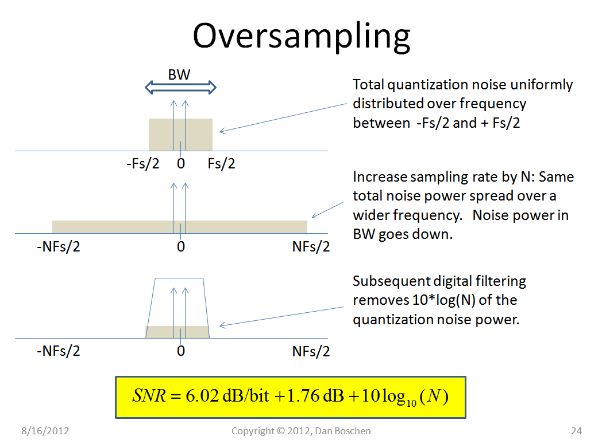

Nyquist sampling theorem @signal: no aliasing, signal remain the same

noise folding @noise: *same* total noise power spread over a wider frequency


> [[https://dsp.stackexchange.com/a/40261/59253](https://dsp.stackexchange.com/a/40261/59253)]


---

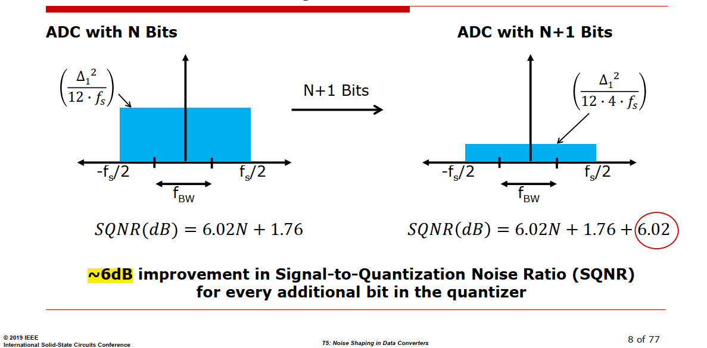

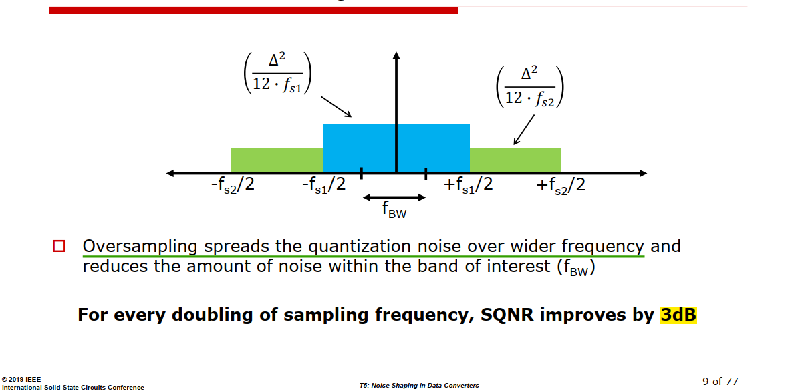


## Noise Shaping

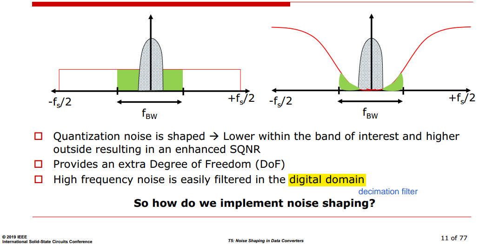


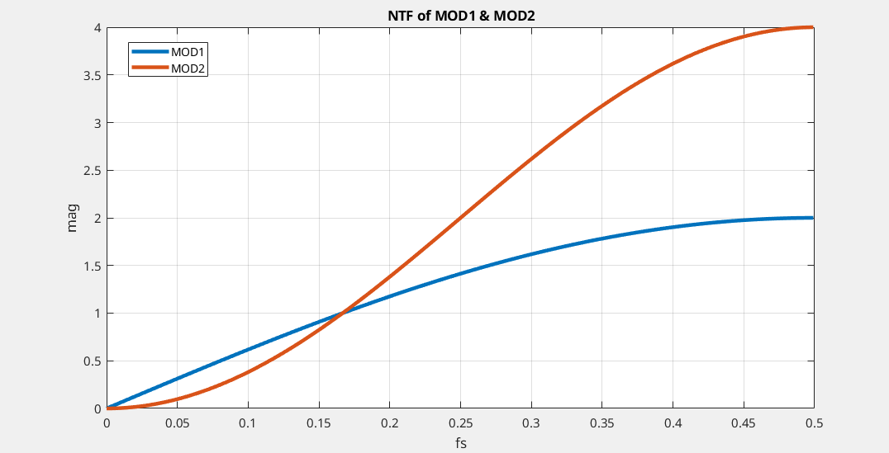

```matlab
[h1, w1] = freqz([1 -1], 1);
[h2, w2] = freqz([1 -2 1], 1);

plot(w1/2/pi, abs(h1), LineWidth=3)
hold on
plot(w2/2/pi, abs(h2), LineWidth=3)
grid on
legend('MOD1', 'MOD2')
xlabel('fs')
ylabel('mag')
title('NTF of MOD1 & MOD2')
```

---

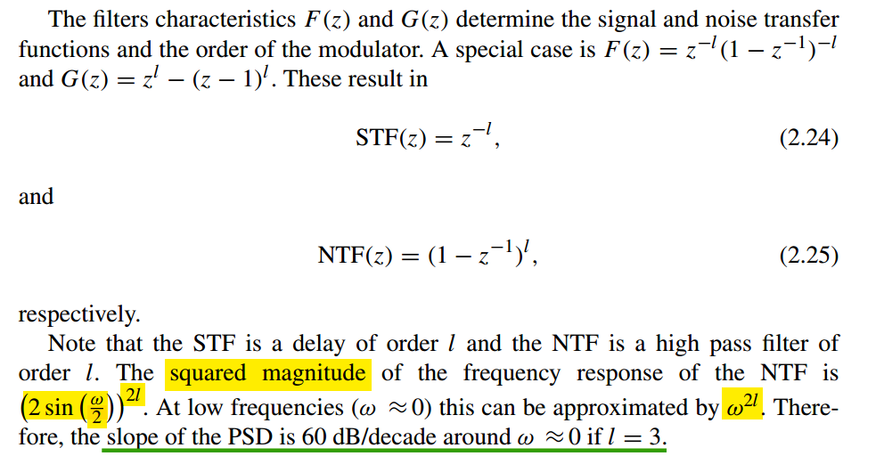


## SQNR improvement

> In general, for an $l$th order modulator with $\text{NTF}(z) = (1 − z^{−1})^l$, the **SQNR increases** by $(6l + 3)$ dB for ***every doubling of the OSR***, which provides $l+0.5$ **extra bits resolution**

***without the delta-sigma loop***

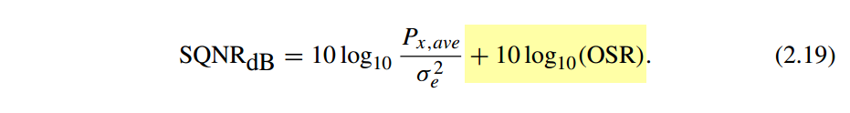

> $10\log (2) \approx 3$dB


***first order delta-sigma modulator***

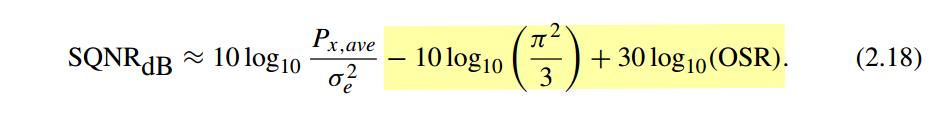

> $30\log (2) \approx 9$dB


***second order delta-sigma modulator***

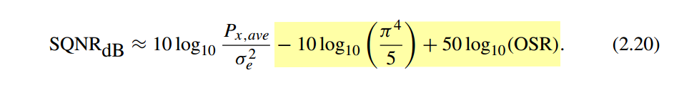

> $50\log (2) \approx 15$dB


---

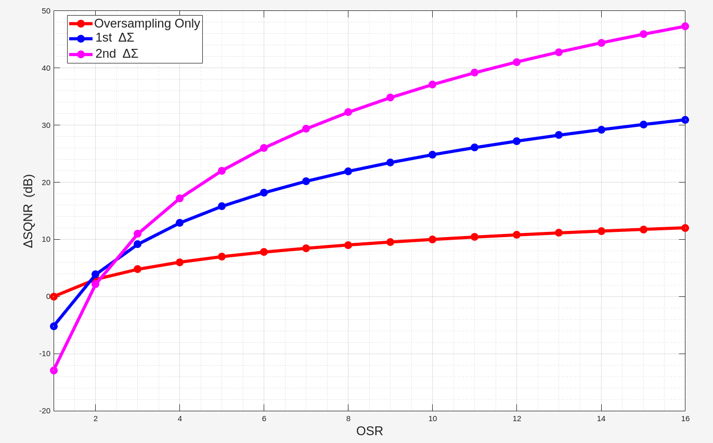

```matlab
OSR= linspace(1,16,16);

SQNR_ovonly_delta = 10*log10(OSR);
SQNR_1st_delta = -10*log10(pi^2/3) + 30*log10(OSR);
SQNR_2st_delta = -10*log10(pi^4/5) + 50*log10(OSR);

plot(OSR, SQNR_ovonly_delta,'ro-', LineWidth=4);
hold on
plot(OSR, SQNR_1st_delta,'bo-', LineWidth=4);
plot(OSR, SQNR_2st_delta,'mo-', LineWidth=4);
grid on; grid minor;
xlim([1 16]); ylim([-20 50]);
xlabel('OSR', FontSize=16); ylabel('\DeltaSQNR (dB)', FontSize=16);
legend('Oversampling Only', '1st \Delta\Sigma', '2nd \Delta\Sigma', fontsize=16)
```


---

> TI. ADC12EU050 Continuous-Time Sigma-Delta ADCs [[https://www.ti.com/lit/an/snaa098/snaa098.pdf](https://www.ti.com/lit/an/snaa098/snaa098.pdf)]

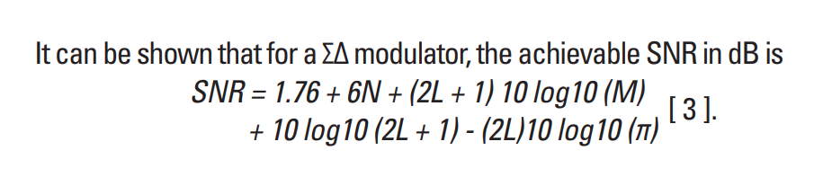

where $N$ is the number of bits in the output, $M$ is known as the over-sampling ratio, $L$ is loop orders


## quantizer levels

The *greater* the number of quantizer levels, the *smaller* quantization error

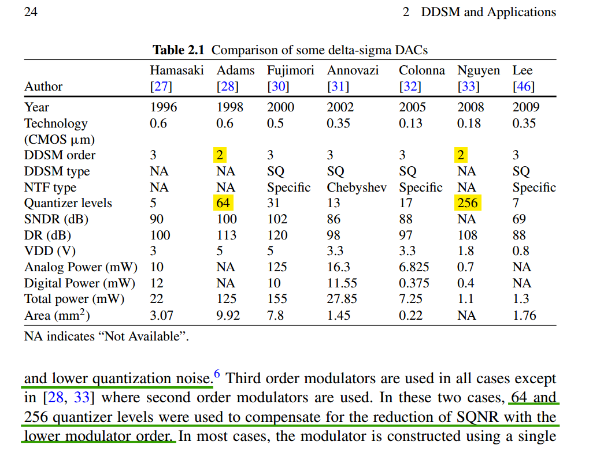


## quantizer overload

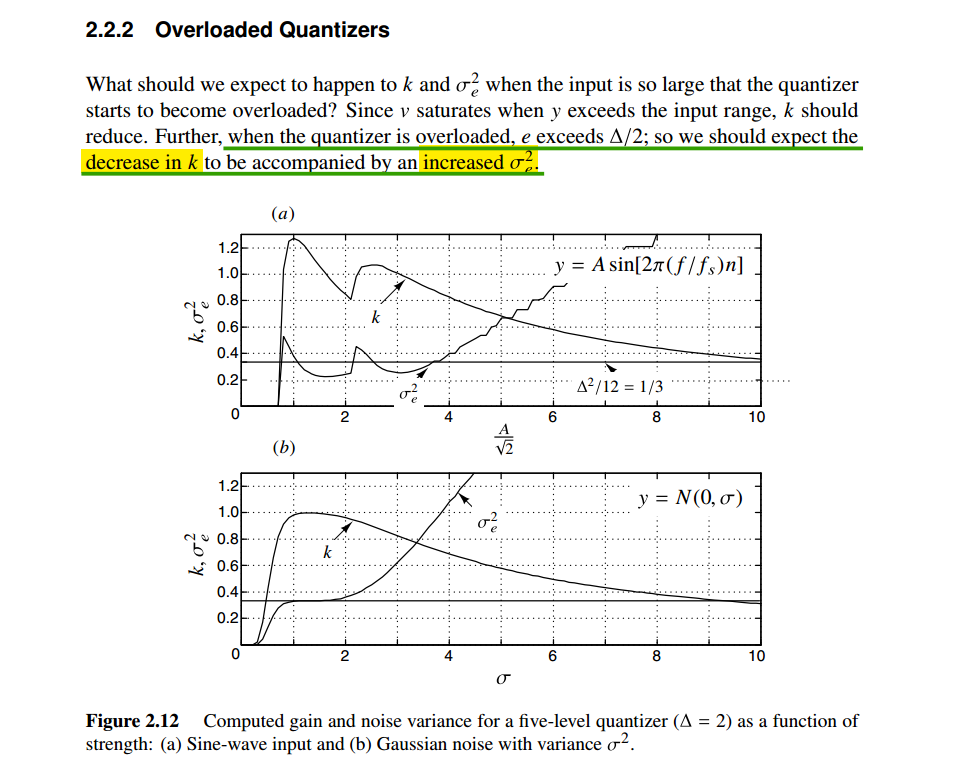


## $\Delta \Sigma$ vs. $\Delta$ modulation

- $\Delta \Sigma$ modulators, and other *noise-shaping* modulators, change the spectrum of the noise but leave the signal unchanged

- $\Delta$ modulators and other *signal-predicting* modulators shape the
spectrum of the modulated signal but leave the quantization noise unchanged at the receiver


## *output* vs. *error*-feedback

The ***error-feedback architecture*** is problematic for **analog** implementation, since it is sensitive to variations of its parameters (subtractor realization)

- The error-feedback structure is thus of limited utility in $\Delta \Sigma$ **ADCs**
- The error-feedback structure is very useful and applied in ***digital*** loops required in $\Delta \Sigma$ **DACs**


### ADC

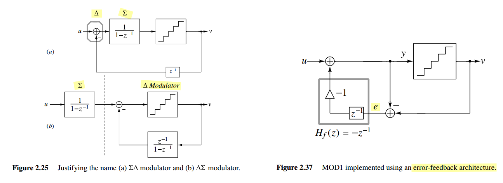

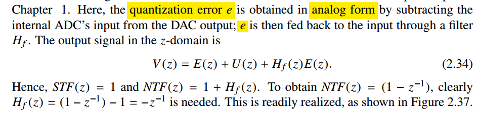

###  DAC


> P. Kiss, J. Arias and Dandan Li, "Stable high-order delta-sigma DACS," *2003 IEEE International Symposium on Circuits and Systems (ISCAS)*, Bangkok, 2003 [[https://www.ele.uva.es/~jesus/analog/tcasi2003.pdf](https://www.ele.uva.es/~jesus/analog/tcasi2003.pdf)]


---

*output-feedback*

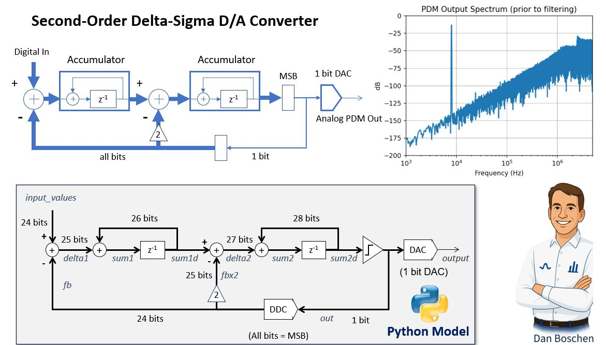

> [[https://www.linkedin.com/posts/danboschen_signalprocessing-dsp-pythonforengineers-activity-7345777588746788866-SprG?utm_source=share&utm_medium=member_desktop&rcm=ACoAAD-cuiIBDJ62eh9q3qTSSdslYXr-XMd8TGw](https://www.linkedin.com/posts/danboschen_signalprocessing-dsp-pythonforengineers-activity-7345777588746788866-SprG?utm_source=share&utm_medium=member_desktop&rcm=ACoAAD-cuiIBDJ62eh9q3qTSSdslYXr-XMd8TGw)]


```verilog
// https://github.com/hamsternz/second_order_sigma_delta_DAC

`timescale 1ns / 1ps
module second_order_dac(
  input wire i_clk,
  input wire i_res,
  input wire i_ce,
  input wire [15:0] i_func, 
  output wire o_DAC
);

  reg this_bit;
 
  reg [19:0] DAC_acc_1st;
  reg [19:0] DAC_acc_2nd;
  reg [19:0] i_func_extended;
   
  assign o_DAC = this_bit;

  always @(*)
     i_func_extended = {i_func[15],i_func[15],i_func[15],i_func[15],i_func};
    
  always @(posedge i_clk or negedge i_res)
    begin
      if (i_res==0)
        begin
          DAC_acc_1st<=16'd0;
          DAC_acc_2nd<=16'd0;
          this_bit = 1'b0;
        end
      else if(i_ce == 1'b1) 
        begin
          if(this_bit == 1'b1)
            begin
              DAC_acc_1st = DAC_acc_1st + i_func_extended - (2**15);
              DAC_acc_2nd = DAC_acc_2nd + DAC_acc_1st     - (2**15);
            end
          else
            begin
              DAC_acc_1st = DAC_acc_1st + i_func_extended + (2**15);
              DAC_acc_2nd = DAC_acc_2nd + DAC_acc_1st + (2**15);
            end
          // When the high bit is set (a negative value) we need to output a 0 and when it is clear we need to output a 1.
          this_bit = ~DAC_acc_2nd[19];
        end
    end
endmodule
```


## Time and Frequency Domain

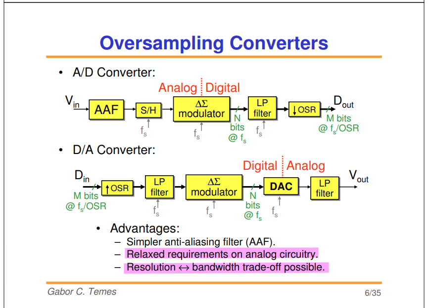

> $M \gt N$
>
> [[https://web.engr.oregonstate.edu/~temes/ece627/Lecture_Notes/Intro_to_Delta_Sigma_Data_Converters.pdf](https://web.engr.oregonstate.edu/~temes/ece627/Lecture_Notes/Intro_to_Delta_Sigma_Data_Converters.pdf)]

---

> Chun-Hsien Su ( 蘇純賢). Fundamentals of Sigma-Delta Data Converters,July, 2006 [[pdf](https://picture.iczhiku.com/resource/eetop/sHkHraReEayHQvCx.pdf)]

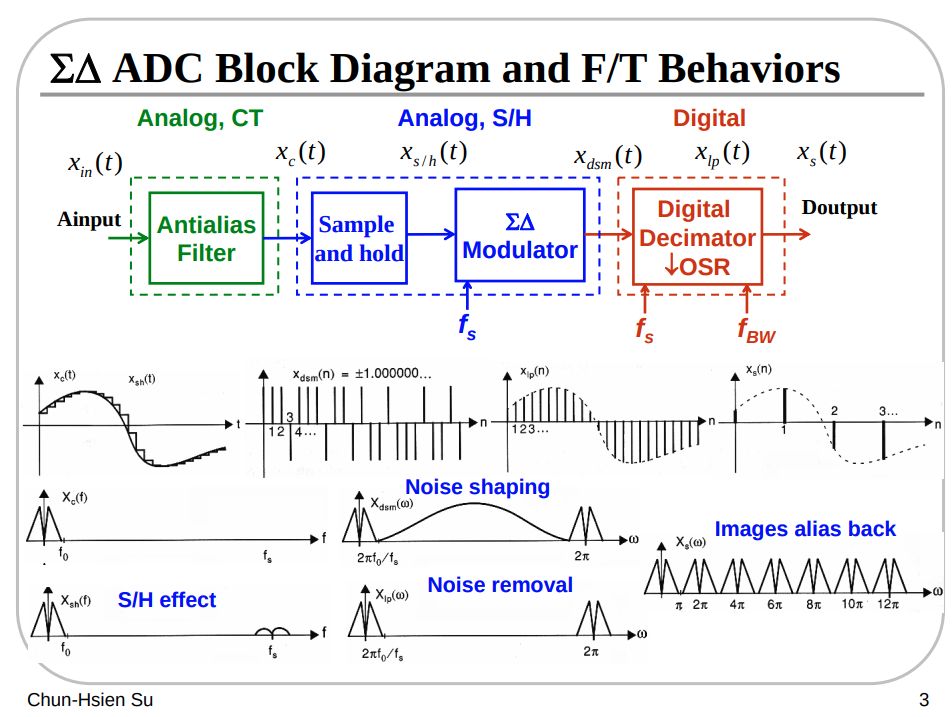

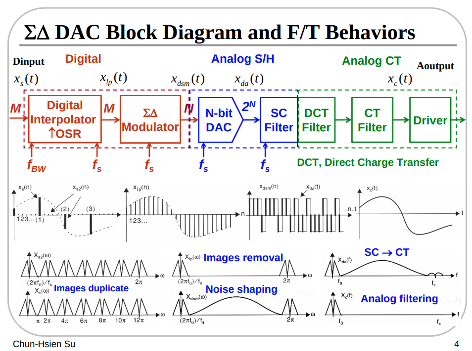

### ADC


> hackaday. Tearing Into Delta Sigma ADC’s [[https://hackaday.com/2016/07/07/tearing-into-delta-sigma-adcs-part-1/ ](https://hackaday.com/2016/07/07/tearing-into-delta-sigma-adcs-part-1/ )]


---


### DAC

 an ***interpolation filter*** effectively ***up-samples its low-rate input*** and ***lowpass-filters the resulting high-rate data*** to produce a high-rate output <u>*devoid of images*</u>


> P.E. Allen -CMOS Analog Circuit Design: Lecture 39 – Oversampling ADCs – Part I (6/26/14)  [[https://aicdesign.org/wp-content/uploads/2018/08/lecture39-140626.pdf](https://aicdesign.org/wp-content/uploads/2018/08/lecture39-140626.pdf)]
>
> P.E. Allen -CMOS Analog Circuit Design: Lecture 40 – Oversampling ADCs – Part II (7/17/15) [[https://aicdesign.org/wp-content/uploads/2018/08/lecture40-150717.pdf](https://aicdesign.org/wp-content/uploads/2018/08/lecture40-150717.pdf)]


---

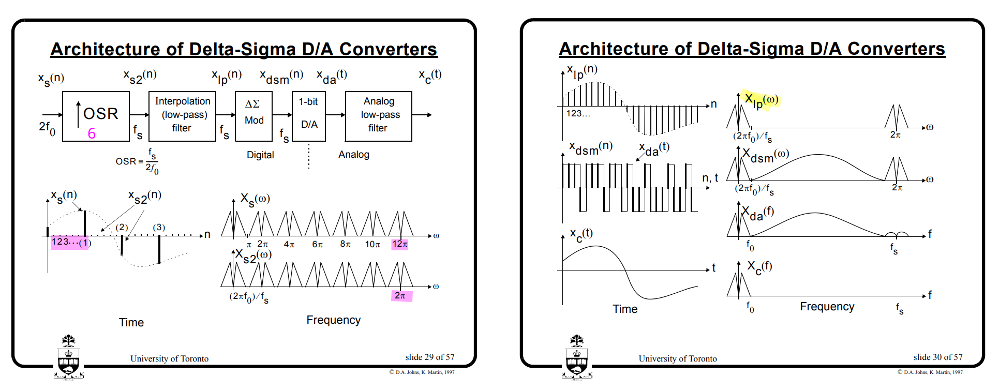

> David Johns and Ken Martin. Oversampling Converters [[https://www.eecg.toronto.edu/~johns/ece1371/slides/14_oversampling.pdf](https://www.eecg.toronto.edu/~johns/ece1371/slides/14_oversampling.pdf)]


---

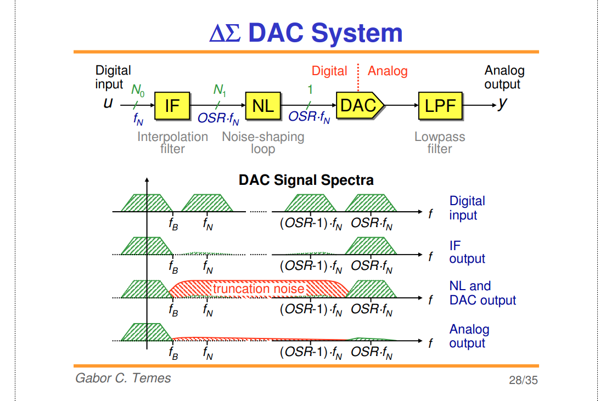

> [[https://web.engr.oregonstate.edu/~temes/ece627/Lecture_Notes/Intro_to_Delta_Sigma_Data_Converters.pdf](https://web.engr.oregonstate.edu/~temes/ece627/Lecture_Notes/Intro_to_Delta_Sigma_Data_Converters.pdf)]


## No delay-free loops

Any such **physically feasible device** will take **a finite time** to operate – in other words, the *quantized output* will only be available a *small time* after the quantizer has "looked" at the input - *insert a one-sample delay*


> there **cannot** be a *"delay free loop"* is a common idea in sequential digital state machine design


---


> Both integrator and quantizer are delay free  

NTF realizability criterion: No delay-free loops in the modulator


> 


## linear settling & GBW of amplifier

*TODO* &#128197;

Switched capacitor has been the common realization technique of *discrete-time (DT) modulators*, and in order to achieve a **linear settling**, the *sampling frequency* used in these converters needs to be *significantly lower than the gain bandwidth product (GBW) o*f the amplifiers. 


## MOD1 & MOD2

***MOD1***: *first*-order noise-shaped converter ($\Delta\Sigma$ modulator)

***MOD2***: *second*-order noise-shaped converter ($\Delta\Sigma$ modulator)


### MOD1


$$
V(z) = U(z) +(1-z^{-1})E(z)
$$


- A binary DAC (and hence a binary modulator) is inherently linear
- With a CT loop filter, MOD1 has inherent anti-alising


---


$$\begin{align}
v[1] &= u  - (0) + e[1] \\
v[2] &= 2u - (v[1]) + e[2] \\
v[3] &= 3u - (v[1]+v[2]) + e[3] \\
v[4] &= 4u - (v[1]+v[2]+v[3]) + e[4]
\end{align}$$

That is
$$
v[n] = nu - \sum_{k=1}^{n-1}v[k] + e[n]
$$
Therefore, we have $v[n-1] = (n-1)u - \sum_{k=1}^{n-2}v[k] + e[n-1]$, then
$$\begin{align}
v[n] &= nu - \sum_{k=1}^{n-1}v[k] + e[n] \\
&= u + \left((n-1)u - \sum_{k=1}^{n-2}v[k]\right) - v[n-1] + e[n] \\
&= u + v[n-1] - e[n-1]  -v[n-1] + e[n] \\
&= u + e[n] - e[n-1]
\end{align}$$


---


Dout, the low frequency component of ADC out is same with Vin


### MOD2

> [[https://web.engr.oregonstate.edu/~temes/ece627/Lecture_Notes/2nd_Higher_Order.pdf](https://web.engr.oregonstate.edu/~temes/ece627/Lecture_Notes/2nd_Higher_Order.pdf)]


### MOD1 with DC Excitation

*TODO* &#128197;


## Mismatch Shaping


### Data-Weighted Averaging (DWA)


$$\begin{align}
\sum_{i=0}^{n}v[i] + e_\text{DAC}[n] &= y[n] \\
\sum_{i=0}^{n-1}v[i] + e_\text{DAC}[n-1] &= y[n-1]
\end{align}$$

and we have $w[n] = y[n] - y[n-1]$, then
$$
w[n] = v[n] + e_\text{DAC}[n] - e_\text{DAC}[n-1]
$$
i.e.
$$
W = V + (1-z^{-1})e_\text{DAC}
$$


**Element Rotation:**


> [[http://individual.utoronto.ca/schreier/lectures/12-2.pdf](http://individual.utoronto.ca/schreier/lectures/12-2.pdf)], [[http://individual.utoronto.ca/trevorcaldwell/course/Mismatch.pdf](http://individual.utoronto.ca/trevorcaldwell/course/Mismatch.pdf)]


## integrator leakage

When the integrator includes leakage ($\alpha$)

$$
x[n-1] + \alpha y[n-1] = y[n]
$$

then,
$$
\frac{Y}{X} = \frac{z^{_1}}{1-\alpha z^{-1}}
$$


## reference

Pavan, Shanthi, Richard Schreier, and Gabor Temes. (2016). Understanding Delta-Sigma Data Converters. 2nd ed. Wiley. 

Norsworthy, Steven R., Richard Schreier, Gábor C. Temes and Ieee Circuits. “Delta-sigma data converters : theory, design, and simulation.” (1997).

Horowitz, P., & Hill, W. (2015). *The art of electronics* (3rd ed.). Cambridge University Press. [[pdf](https://kolegite.com/EE_library/books_and_lectures/%D0%95%D0%BB%D0%B5%D0%BA%D1%82%D1%80%D0%BE%D0%BD%D0%B8%D0%BA%D0%B0/_The%20Art%20of%20Electronics%203rd%20ed%20%5B2015%5D.pdf)]

---

R. Schreier, ISSCC2006 tutorial: Understanding Delta-Sigma Data Converters

Shanthi Pavan, ISSCC2013 T5: Simulation Techniques in Data Converter Design [[https://www.nishanchettri.com/isscc-slides/2013%20ISSCC/TUTORIALS/ISSCC2013Visuals-T5.pdf](https://www.nishanchettri.com/isscc-slides/2013%20ISSCC/TUTORIALS/ISSCC2013Visuals-T5.pdf)]

Bruce A. Wooley , 2012, "The Evolution of Oversampling Analog-to-Digital Converters" [[https://r6.ieee.org/scv-sscs/wp-content/uploads/sites/80/2012/06/Oversampling-Wooley_SCV-ver2.pdf](https://r6.ieee.org/scv-sscs/wp-content/uploads/sites/80/2012/06/Oversampling-Wooley_SCV-ver2.pdf)]

Venkatesh Srinivasan, ISSCC 2019 T5: Noise Shaping in Data Converters

B. Razavi, "The Delta-Sigma Modulator [A Circuit for All Seasons]," IEEE Solid-State Circuits Magazine, Volume. 8, Issue. 20, pp. 10-15, Spring 2016. [[http://www.seas.ucla.edu/brweb/papers/Journals/BRSpring16DeltaSigma.pdf](http://www.seas.ucla.edu/brweb/papers/Journals/BRSpring16DeltaSigma.pdf)]

P. M. Aziz, H. V. Sorensen and J. vn der Spiegel, "An overview of sigma-delta converters," in IEEE Signal Processing Magazine, vol. 13, no. 1, pp. 61-84, Jan. 1996 [[https://sci-hub.st/10.1109/79.482138](https://sci-hub.st/10.1109/79.482138)]

---

Richard E. Schreier, ECE 1371 Advanced Analog Circuits - 2015 [[http://individual.utoronto.ca/schreier/ece1371-2015.html](http://individual.utoronto.ca/schreier/ece1371-2015.html)]

Gabor C. Temes. ECE 627-Oversampled Delta-Sigma Data Converters [[https://classes.engr.oregonstate.edu/eecs/spring2017/ece627/lecturenotes.html](https://classes.engr.oregonstate.edu/eecs/spring2017/ece627/lecturenotes.html)]

Joshua Reiss. Understanding sigma delta modulation: the solved and unsolved issues

 [[https://www.eecs.qmul.ac.uk/~josh/documents/2008/Reiss-JAES-UnderstandingSigmaDeltaModulation-SolvedandUnsolvedIssues.pdf](https://www.eecs.qmul.ac.uk/~josh/documents/2008/Reiss-JAES-UnderstandingSigmaDeltaModulation-SolvedandUnsolvedIssues.pdf)]

V. Medina, P. Rombouts and L. Hernandez-Corporales, "A Different View of Sigma-Delta Modulators Under the Lens of Pulse Frequency Modulation [Feature]," in *IEEE Circuits and Systems Magazine*, vol. 24, no. 2, pp. 80-97, Secondquarter 2024


