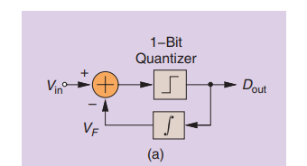

The average output of DSM tracks the input signal

$\Delta\Sigma$ modulators are **nonlinear systems** since a **quantizer** is implemented in the $\Delta\Sigma$-loop

---

## No delay-free loops

> Both integrator and quantizer are delay free  

NTF realizability criterion: No delay-free loops in the modulator

> 

## linear settling & GBW of amplifier

*TODO* &#128197;

Switched capacitor has been the common realization technique of *discrete-time (DT) modulators*, and in order to achieve a **linear settling**, the *sampling frequency* used in these converters needs to be *significantly lower than the gain bandwidth product (GBW) o*f the amplifiers. 

## Delta Modulator

$$\begin{align}
(V_{in} - V_F) &= D_{out} \\
D_{out} &= s V_F
\end{align}$$

Therefore $V_{in} - \frac{D_{out}}{s} = D_{out}$
$$
D_{out} = \frac{s}{s+1} V_{in}
$$

> attenuates the low-frequency content of the signal, and amplifies high-frequency noise.

## MOD1

$$
V(z) = U(z) +(1-z^{-1})E(z)
$$

- A binary DAC (and hence a binary modulator) is inherently linear
- With a CT loop filter, MOD1 has inherent anti-alising

---

$$\begin{align}
v[1] &= u  - (0) + e[1] \\
v[2] &= 2u - (v[1]) + e[2] \\
v[3] &= 3u - (v[1]+v[2]) + e[3] \\
v[4] &= 4u - (v[1]+v[2]+v[3]) + e[4]
\end{align}$$

That is
$$
v[n] = nu - \sum_{k=1}^{n-1}v[k] + e[n]
$$
Therefore, we have $v[n-1] = (n-1)u - \sum_{k=1}^{n-2}v[k] + e[n-1]$, then
$$\begin{align}
v[n] &= nu - \sum_{k=1}^{n-1}v[k] + e[n] \\
&= u + \left((n-1)u - \sum_{k=1}^{n-2}v[k]\right) - v[n-1] + e[n] \\
&= u + v[n-1] - e[n-1]  -v[n-1] + e[n] \\
&= u + e[n] - e[n-1]
\end{align}$$

---

Dout, the low frequency component of ADC out is same with Vin

## MOD2

## decimation filter

The combination of the the *digital post-filter* and *downsampler* is called the **decimation filter** or **decimator**

###  $\text{sinc}$ filter

> 

### $\text{sinc}^2$ filter

> [https://classes.engr.oregonstate.edu/eecs/spring2021/ece627/Lecture%20Notes/First-Order_D-S_ADC_Scan2.pdf](https://classes.engr.oregonstate.edu/eecs/spring2021/ece627/Lecture%20Notes/First-Order_D-S_ADC_Scan2.pdf)
>
> [https://classes.engr.oregonstate.edu/eecs/spring2017/ece627/Lecture%20Notes/First-Order%20D-S%20ADC.pdf](https://classes.engr.oregonstate.edu/eecs/spring2017/ece627/Lecture%20Notes/First-Order%20D-S%20ADC.pdf)

## Truncation DAC

---

An implementation of a **high-resolution integral path** using a *digital delta-sigma modulator*, *low-resolution Nyquist DAC*, and *a lowpass filter*

- $\Delta \Sigma$ truncates $n$-bit accumulator output to $m$-bits with $m\le n$
- A $m$-bit Nyquist DAC outputs current, which is fed into a low pass filter that suppresses $\Delta \Sigma$'s quantization noise

---

The remaining *11 bits are truncated to 3-levels* using a second-order delta-sigma modulator (DSM), thus, obviating the need for a high resolution DAC

> Hanumolu, Pavan Kumar. "Design techniques for clocking high performance signaling systems" [[https://ir.library.oregonstate.edu/concern/graduate_thesis_or_dissertations/1v53k219r](https://ir.library.oregonstate.edu/concern/graduate_thesis_or_dissertations/1v53k219r)]

## Mismatch Shaping

### Data-Weighted Averaging (DWA)

$$\begin{align}
\sum_{i=0}^{n}v[i] + e_\text{DAC}[n] &= y[n] \\
\sum_{i=0}^{n-1}v[i] + e_\text{DAC}[n-1] &= y[n-1]
\end{align}$$

and we have $w[n] = y[n] - y[n-1]$, then
$$
w[n] = v[n] + e_\text{DAC}[n] - e_\text{DAC}[n-1]
$$
i.e.
$$
W = V + (1-z^{-1})e_\text{DAC}
$$

**Element Rotation:**

> [[http://individual.utoronto.ca/schreier/lectures/12-2.pdf](http://individual.utoronto.ca/schreier/lectures/12-2.pdf)], [[http://individual.utoronto.ca/trevorcaldwell/course/Mismatch.pdf](http://individual.utoronto.ca/trevorcaldwell/course/Mismatch.pdf)]

## idle tone & dithering

**ditherin** break *periodicity* and convert them to noise while input is *constant*

## Fractional-N PLL

page13

$$
\tau[n-1] + (N+y[n])T_{PLL} - (N+\alpha)T_{PLL} = \tau[n]
$$

i.e.
$$
\tau[n] = \tau[n-1] + (y[n] - \alpha)T_{PLL}
$$

where $\tau[n] = t_{vdiv} -  t_{vdiv, desired}$ 

## reference

R. Schreier, ISSCC2006 tutorial: Understanding Delta-Sigma Data Converters

Shanthi Pavan, ISSCC2013 T5: Simulation Techniques in Data Converter Design [[https://www.nishanchettri.com/isscc-slides/2013%20ISSCC/TUTORIALS/ISSCC2013Visuals-T5.pdf](https://www.nishanchettri.com/isscc-slides/2013%20ISSCC/TUTORIALS/ISSCC2013Visuals-T5.pdf)]

Bruce A. Wooley , 2012, "The Evolution of Oversampling Analog-to-Digital Converters" [[https://r6.ieee.org/scv-sscs/wp-content/uploads/sites/80/2012/06/Oversampling-Wooley_SCV-ver2.pdf](https://r6.ieee.org/scv-sscs/wp-content/uploads/sites/80/2012/06/Oversampling-Wooley_SCV-ver2.pdf)]

B. Razavi, "The Delta-Sigma Modulator [A Circuit for All Seasons]," IEEE Solid-State Circuits Magazine, Volume. 8, Issue. 20, pp. 10-15, Spring 2016. [[http://www.seas.ucla.edu/brweb/papers/Journals/BRSpring16DeltaSigma.pdf](http://www.seas.ucla.edu/brweb/papers/Journals/BRSpring16DeltaSigma.pdf)]

Pavan, Shanthi, Richard Schreier, and Gabor Temes. (2016) 2016. Understanding Delta-Sigma Data Converters. 2nd ed. Wiley.

---

Richard E. Schreier, ECE 1371 Advanced Analog Circuits - 2015 [[http://individual.utoronto.ca/schreier/ece1371-2015.html](http://individual.utoronto.ca/schreier/ece1371-2015.html)]

Gabor C. Temes. ECE 627-Oversampled Delta-Sigma Data Converters [[https://classes.engr.oregonstate.edu/eecs/spring2017/ece627/lecturenotes.html](https://classes.engr.oregonstate.edu/eecs/spring2017/ece627/lecturenotes.html)]

Boris Murmann, ISSCC2022 SC1: Introduction to ADCs/DACs: Metrics, Topologies, Trade Space, and Applications [[link](【SC1.Introduction.to.ADCs.DACs.Metrics.Topologies.Trade.Space.and.Applications】 https://www.bilibili.com/video/BV1ENxxedEio/?share_source=copy_web&vd_source=5a095c2d604a5d4392ea78fa2bbc7249)]

Ian Galton. Delta-Sigma Fractional-N Phase-Locked Loops [[https://ispg.ucsd.edu/wordpress/wp-content/uploads/2022/10/fnpll_ieee_tutorial_2003_corrected.pdf](https://ispg.ucsd.edu/wordpress/wp-content/uploads/2022/10/fnpll_ieee_tutorial_2003_corrected.pdf)]

Sudhakar Pamarti. CICC 2020: Basics of Closed- and Open-Loop Fractional Frequency Synthesis [[https://youtu.be/t1TY-D95CY8?si=tbav3J2yag38HyZx](https://youtu.be/t1TY-D95CY8?si=tbav3J2yag38HyZx)]

