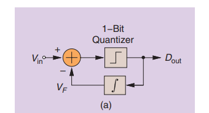
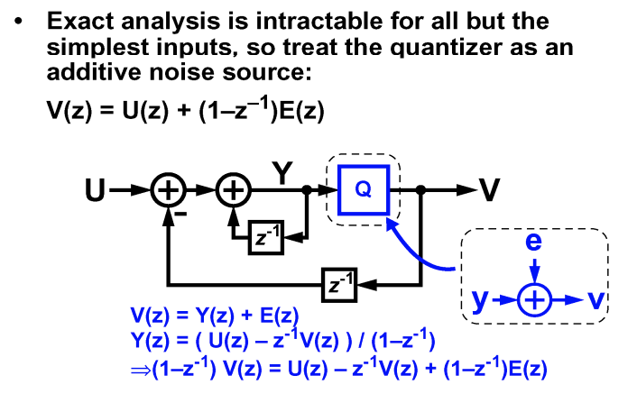
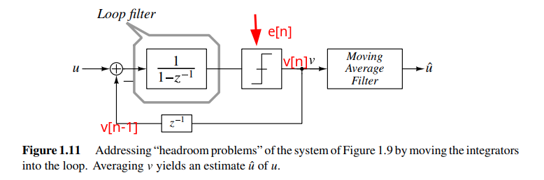
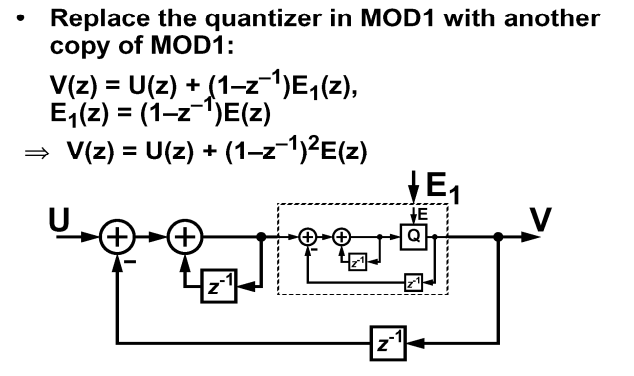
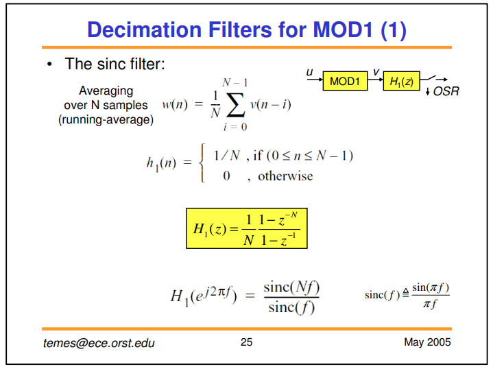
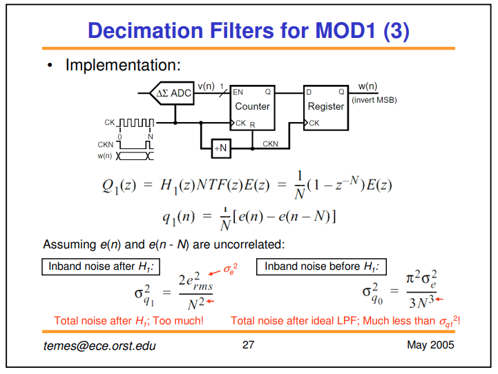

The average output of DSM tracks the input signal

---

## Delta Modulator

$$\begin{align}
(V_{in} - V_F) &= D_{out} \\
D_{out} &= s V_F
\end{align}$$

Therefore $V_{in} - \frac{D_{out}}{s} = D_{out}$
$$
D_{out} = \frac{s}{s+1} V_{in}
$$

> attenuates the low-frequency content of the signal, and amplifies high-frequency noise.

## MOD1

- A binary DAC (and hence a binary modulator) is inherently linear
- With a CT loop filter, MOD1 has inherent anti-alising

---

$$\begin{align}
v[1] &= u  - (0) + e[1] \\
v[2] &= 2u - (v[1]) + e[2] \\
v[3] &= 3u - (v[1]+v[2]) + e[3] \\
v[4] &= 4u - (v[1]+v[2]+v[3]) + e[4]
\end{align}$$

That is
$$
v[n] = nu - \sum_{k=1}^{n-1}v[k] + e[n]
$$
hence, with $v[n-1] = (n-1)u - \sum_{k=1}^{n-2}v[k] + e[n-1]$
$$\begin{align}
v[n] &= nu - \sum_{k=1}^{n-1}v[k] + e[n] \\
&= u + \left[(n-1)u - \sum_{k=1}^{n-2}v[k]\right] - v[n-1] + e[n] \\
&= u + v[n-1] - e[n-1]  -v[n-1] + e[n] \\
&= u + e[n] - e[n-1]
\end{align}$$

## MOD2

## Delta-Sigma Modulator

*TODO* &#128197;

## integrator

*TODO* &#128197;

### opamp bandwidth & slewing

*TODO* &#128197;

## decimation filter

The combination of the the *digital post-filter* and *downsampler* is called the **decimation filter** or **decimator**

> [https://classes.engr.oregonstate.edu/eecs/spring2017/ece627/Lecture%20Notes/First-Order%20D-S%20ADC.pdf](https://classes.engr.oregonstate.edu/eecs/spring2017/ece627/Lecture%20Notes/First-Order%20D-S%20ADC.pdf)

## reference

R. Schreier, ISSCC2006 tutorial: Understanding Delta-Sigma Data Converters

Bruce A. Wooley , 2012, "The Evolution of Oversampling Analog-to-Digital Converters" [[https://r6.ieee.org/scv-sscs/wp-content/uploads/sites/80/2012/06/Oversampling-Wooley_SCV-ver2.pdf](https://r6.ieee.org/scv-sscs/wp-content/uploads/sites/80/2012/06/Oversampling-Wooley_SCV-ver2.pdf)]

B. Razavi, "The Delta-Sigma Modulator [A Circuit for All Seasons]," IEEE Solid-State Circuits Magazine, Volume. 8, Issue. 20, pp. 10-15, Spring 2016. [[http://www.seas.ucla.edu/brweb/papers/Journals/BRSpring16DeltaSigma.pdf](http://www.seas.ucla.edu/brweb/papers/Journals/BRSpring16DeltaSigma.pdf)]

Pavan, Shanthi, Richard Schreier, and Gabor Temes. (2016) 2016. Understanding Delta-Sigma Data Converters. 2nd ed. Wiley.

---

Richard E. Schreier, ECE 1371 Advanced Analog Circuits - 2015 [[http://individual.utoronto.ca/schreier/ece1371-2015.html](http://individual.utoronto.ca/schreier/ece1371-2015.html)]

Gabor C. Temes. ECE 627-Oversampled Delta-Sigma Data Converters [[https://classes.engr.oregonstate.edu/eecs/spring2017/ece627/lecturenotes.html](https://classes.engr.oregonstate.edu/eecs/spring2017/ece627/lecturenotes.html)]

