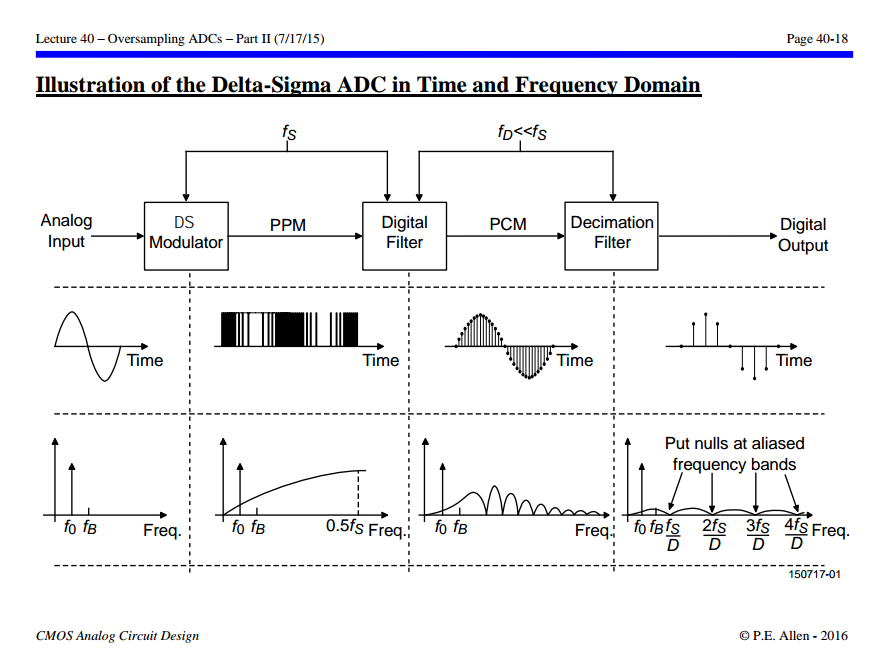
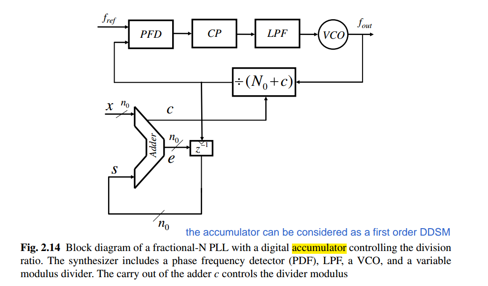

- a delta–sigma **ADC** consists of **an analog modulator** followed by **a digital filter**
- a delta–sigma **DAC** consists of **a digital modulator** followed by **an analog filter**

---


**Analog Delta Sigma Modulators (ADSM)**  are used in the context of *analog-to-digital conversion*

- In a CT delta-sigma ADC, there is no need for an anti-aliasing filter or a front-end sampler

**Digital Delta Sigma Modulators (DDSM)** are commonly used in *digital to-analog conversion* and *fractional-N frequency synthesis*

- In a DDSM, the *input is digital* and the *filters are implemented digitally* 
- the input to the DDSM is often a *constant digital word*, this covers delta-sigma fractional-N synthesizers in the frequency generation application


---


## $\Delta\Sigma$ Classification

- Continuous-Time (CT) Analog Modulator
  - Sampled Quantizer: Synchronous Modulator
  - Unsampled Quantizer: Asynchronous Modulator
- Discrete-Time (DT) Analog Modulator
-  Discrete-Time Digital Modulators (DDSM)
  - Single Quantizer DDSMs - output feedback
  - Error feedback modulators (EFM) - error feedback
  - **M**ulti st**A**ge noise **SH**aping (**MASH**)
  


> *"**Quantizers**" and "**truncators**", and "**integrators**" and "**accumulators**" are used in **delta-sigma ADCs** and **DACs**, respectively*
>
> P. Kiss, J. Arias and Dandan Li, "Stable high-order delta-sigma DACS," *2003 IEEE International Symposium on Circuits and Systems (ISCAS)*, Bangkok, 2003 [[https://www.ele.uva.es/~jesus/analog/tcasi2003.pdf](https://www.ele.uva.es/~jesus/analog/tcasi2003.pdf)]

---


$$\begin{align}
v[n] = \{0,1,2,...,M-1\} &\space\Rightarrow\space  y[n] = 0 \space\Rightarrow\space  e_q[n] = \{0, -\frac{1}{M},-\frac{2}{M},...,-\frac{M-1}{M}\} \\
v[n] = \{M,M+1,M2,...,2M-1\} &\space\Rightarrow\space  y[n] = 1 \space\Rightarrow\space  e_q[n] = \{0, -\frac{1}{M},-\frac{2}{M},...,-\frac{M-1}{M}\}
\end{align}$$

> 

For the three stages of the MASH 1-1-1 DDSM


## Oversampling


> David Johns and Ken Martin. Oversampling Converters [[https://www.eecg.toronto.edu/~johns/ece1371/slides/14_oversampling.pdf](https://www.eecg.toronto.edu/~johns/ece1371/slides/14_oversampling.pdf)]

---


Nyquist sampling theorem @signal: no aliasing, signal remain the same

noise folding @noise: *same* total noise power spread over a wider frequency


> [[https://dsp.stackexchange.com/a/40261/59253](https://dsp.stackexchange.com/a/40261/59253)]


---


## Noise Shaping


```matlab
[h1, w1] = freqz([1 -1], 1);
[h2, w2] = freqz([1 -2 1], 1);

plot(w1/2/pi, abs(h1), LineWidth=3)
hold on
plot(w2/2/pi, abs(h2), LineWidth=3)
grid on
legend('MOD1', 'MOD2')
xlabel('fs')
ylabel('mag')
title('NTF of MOD1 & MOD2')
```

---


## SQNR

> In general, for an $l$th order modulator with $\text{NTF}(z) = (1 − z^{−1})^l$, the SQNR increases by $(6l + 3)$ dB for every doubling of the OSR

***without the delta-sigma loop***


> $10\log (2) \approx 3$dB


***first order delta-sigma modulator***


> $30\log (2) \approx 9$dB


***second order delta-sigma modulator***


> $50\log (2) \approx 15$dB


---


```matlab
OSR= linspace(1,16,16);

SQNR_ovonly_delta = 10*log10(OSR);
SQNR_1st_delta = -10*log10(pi^2/3) + 30*log10(OSR);
SQNR_2st_delta = -10*log10(pi^4/5) + 50*log10(OSR);

plot(OSR, SQNR_ovonly_delta,'ro-', LineWidth=4);
hold on
plot(OSR, SQNR_1st_delta,'bo-', LineWidth=4);
plot(OSR, SQNR_2st_delta,'mo-', LineWidth=4);
grid on; grid minor;
xlim([1 16]); ylim([-20 50]);
xlabel('OSR', FontSize=16); ylabel('\DeltaSQNR (dB)', FontSize=16);
legend('Oversampling Only', '1st \Delta\Sigma', '2nd \Delta\Sigma', fontsize=16)
```


## quantizer levels

The *greater* the number of quantizer levels, the *smaller* quantization error


## $\Delta \Sigma$ vs. $\Delta$ modulation

- $\Delta \Sigma$ modulators, and other *noise-shaping* modulators, change the spectrum of the noise but leave the signal unchanged

- $\Delta$ modulators and other *signal-predicting* modulators shape the
spectrum of the modulated signal but leave the quantization noise unchanged at the receiver


## *output* vs. *error*-feedback

The ***error-feedback architecture*** is problematic for **analog** implementation, since it is sensitive to variations of its parameters (subtractor realization)

- The error-feedback structure is thus of limited utility in $\Delta \Sigma$ **ADCs**
- The error-feedback structure is very useful and applied in ***digital*** loops required in $\Delta \Sigma$ **DACs**


### ADC


###  DAC


> P. Kiss, J. Arias and Dandan Li, "Stable high-order delta-sigma DACS," *2003 IEEE International Symposium on Circuits and Systems (ISCAS)*, Bangkok, 2003 [[https://www.ele.uva.es/~jesus/analog/tcasi2003.pdf](https://www.ele.uva.es/~jesus/analog/tcasi2003.pdf)]


---

*output-feedback*


> [[https://www.linkedin.com/posts/danboschen_signalprocessing-dsp-pythonforengineers-activity-7345777588746788866-SprG?utm_source=share&utm_medium=member_desktop&rcm=ACoAAD-cuiIBDJ62eh9q3qTSSdslYXr-XMd8TGw](https://www.linkedin.com/posts/danboschen_signalprocessing-dsp-pythonforengineers-activity-7345777588746788866-SprG?utm_source=share&utm_medium=member_desktop&rcm=ACoAAD-cuiIBDJ62eh9q3qTSSdslYXr-XMd8TGw)]


```verilog
// https://github.com/hamsternz/second_order_sigma_delta_DAC

`timescale 1ns / 1ps
module second_order_dac(
  input wire i_clk,
  input wire i_res,
  input wire i_ce,
  input wire [15:0] i_func, 
  output wire o_DAC
);

  reg this_bit;
 
  reg [19:0] DAC_acc_1st;
  reg [19:0] DAC_acc_2nd;
  reg [19:0] i_func_extended;
   
  assign o_DAC = this_bit;

  always @(*)
     i_func_extended = {i_func[15],i_func[15],i_func[15],i_func[15],i_func};
    
  always @(posedge i_clk or negedge i_res)
    begin
      if (i_res==0)
        begin
          DAC_acc_1st<=16'd0;
          DAC_acc_2nd<=16'd0;
          this_bit = 1'b0;
        end
      else if(i_ce == 1'b1) 
        begin
          if(this_bit == 1'b1)
            begin
              DAC_acc_1st = DAC_acc_1st + i_func_extended - (2**15);
              DAC_acc_2nd = DAC_acc_2nd + DAC_acc_1st     - (2**15);
            end
          else
            begin
              DAC_acc_1st = DAC_acc_1st + i_func_extended + (2**15);
              DAC_acc_2nd = DAC_acc_2nd + DAC_acc_1st + (2**15);
            end
          // When the high bit is set (a negative value) we need to output a 0 and when it is clear we need to output a 1.
          this_bit = ~DAC_acc_2nd[19];
        end
    end
endmodule
```


## Time and Frequency Domain


> $M \gt N$
>
> [[https://web.engr.oregonstate.edu/~temes/ece627/Lecture_Notes/Intro_to_Delta_Sigma_Data_Converters.pdf](https://web.engr.oregonstate.edu/~temes/ece627/Lecture_Notes/Intro_to_Delta_Sigma_Data_Converters.pdf)]

---

> Chun-Hsien Su ( 蘇純賢). Fundamentals of Sigma-Delta Data Converters,July, 2006 [[pdf](https://picture.iczhiku.com/resource/eetop/sHkHraReEayHQvCx.pdf)]


### ADC




> hackaday. Tearing Into Delta Sigma ADC’s [[https://hackaday.com/2016/07/07/tearing-into-delta-sigma-adcs-part-1/ ](https://hackaday.com/2016/07/07/tearing-into-delta-sigma-adcs-part-1/ )]


---


### DAC

 an ***interpolation filter*** effectively ***up-samples its low-rate input*** and ***lowpass-filters the resulting high-rate data*** to produce a high-rate output <u>*devoid of images*</u>


> P.E. Allen -CMOS Analog Circuit Design: Lecture 39 – Oversampling ADCs – Part I (6/26/14)  [[https://aicdesign.org/wp-content/uploads/2018/08/lecture39-140626.pdf](https://aicdesign.org/wp-content/uploads/2018/08/lecture39-140626.pdf)]
>
> P.E. Allen -CMOS Analog Circuit Design: Lecture 40 – Oversampling ADCs – Part II (7/17/15) [[https://aicdesign.org/wp-content/uploads/2018/08/lecture40-150717.pdf](https://aicdesign.org/wp-content/uploads/2018/08/lecture40-150717.pdf)]


---


> David Johns and Ken Martin. Oversampling Converters [[https://www.eecg.toronto.edu/~johns/ece1371/slides/14_oversampling.pdf](https://www.eecg.toronto.edu/~johns/ece1371/slides/14_oversampling.pdf)]


---


> [[https://web.engr.oregonstate.edu/~temes/ece627/Lecture_Notes/Intro_to_Delta_Sigma_Data_Converters.pdf](https://web.engr.oregonstate.edu/~temes/ece627/Lecture_Notes/Intro_to_Delta_Sigma_Data_Converters.pdf)]


## interpolation filter

*Notice that the requirements of the **first** stage are very **demanding***


## No delay-free loops

Any such **physically feasible device** will take **a finite time** to operate – in other words, the *quantized output* will only be available a *small time* after the quantizer has "looked" at the input - *insert a one-sample delay*


> there **cannot** be a *"delay free loop"* is a common idea in sequential digital state machine design


---


> Both integrator and quantizer are delay free  

NTF realizability criterion: No delay-free loops in the modulator


> 


## linear settling & GBW of amplifier

*TODO* &#128197;

Switched capacitor has been the common realization technique of *discrete-time (DT) modulators*, and in order to achieve a **linear settling**, the *sampling frequency* used in these converters needs to be *significantly lower than the gain bandwidth product (GBW) o*f the amplifiers. 


## MOD1 & MOD2

***MOD1***: *first*-order noise-shaped converter ($\Delta\Sigma$ modulator)

***MOD2***: *second*-order noise-shaped converter ($\Delta\Sigma$ modulator)


### MOD1


$$
V(z) = U(z) +(1-z^{-1})E(z)
$$


- A binary DAC (and hence a binary modulator) is inherently linear
- With a CT loop filter, MOD1 has inherent anti-alising


---


$$\begin{align}
v[1] &= u  - (0) + e[1] \\
v[2] &= 2u - (v[1]) + e[2] \\
v[3] &= 3u - (v[1]+v[2]) + e[3] \\
v[4] &= 4u - (v[1]+v[2]+v[3]) + e[4]
\end{align}$$

That is
$$
v[n] = nu - \sum_{k=1}^{n-1}v[k] + e[n]
$$
Therefore, we have $v[n-1] = (n-1)u - \sum_{k=1}^{n-2}v[k] + e[n-1]$, then
$$\begin{align}
v[n] &= nu - \sum_{k=1}^{n-1}v[k] + e[n] \\
&= u + \left((n-1)u - \sum_{k=1}^{n-2}v[k]\right) - v[n-1] + e[n] \\
&= u + v[n-1] - e[n-1]  -v[n-1] + e[n] \\
&= u + e[n] - e[n-1]
\end{align}$$


---


Dout, the low frequency component of ADC out is same with Vin


### MOD2

> [[https://web.engr.oregonstate.edu/~temes/ece627/Lecture_Notes/2nd_Higher_Order.pdf](https://web.engr.oregonstate.edu/~temes/ece627/Lecture_Notes/2nd_Higher_Order.pdf)]


### MOD1 with DC Excitation

*TODO* &#128197;


## Dynamic Range ofthe Modulators & quantizer overloading

*TODO* &#128197;


## decimation filter

The combination of the the *digital post-filter* and *downsampler* is called the **decimation filter** or **decimator**


###  $\text{sinc}$ filter


Provided that $T=1$
$$
H_1(e^{j2\pi f}) = \frac{\text{sinc}(Nf)}{\text{sinc}(f)} = \frac{1}{N}\frac{\sin(\pi Nf)}{\sin(\pi f)}
$$
that is $\lim_{f\to 0^+}H_1(e^{j2\pi f}) = 1$  and $H_1 = 0$ when $f=\frac{n}{N}, n\in \mathbb{Z}$


> 


### $\text{sinc}^2$ filter


> [[https://web.engr.oregonstate.edu/~temes/ece627/Lecture_Notes/First_Order_DS_ADC_scan1.pdf](https://web.engr.oregonstate.edu/~temes/ece627/Lecture_Notes/First_Order_DS_ADC_scan1.pdf)]
>
> [[https://web.engr.oregonstate.edu/~temes/ece627/Lecture_Notes/First_Order_DS_ADC_scan2.pdf](https://web.engr.oregonstate.edu/~temes/ece627/Lecture_Notes/First_Order_DS_ADC_scan2.pdf)]


## Truncation DAC

The noise-shaping loop output must contain a faithful *reproduction* of the input signal $u_0[n]$ in the *baseband*,

but it will also include the *filtered truncation noise* caused by the *reduction of the word length* in the loop.

Idealy, the ***DA***C will reproduce its *input **d**igital signal* in an ***a**nalog form* without any distortion

---

> 


with $\frac{y}{2^{m_2}} + q= v$,  where $v = \lfloor\frac{y}{2^{m_2}}\rfloor$

$$
\left\{ \begin{array}{cl}
Y + 2^{m_2} Q &= 2^{m_2}V   \\
U - z^{-1}2^{m_2}Q &= Y  
\end{array} \right.
$$

The STF & NTF is shown as below
$$
V = \frac{1}{2^{m_2}}U + (1-z^{-1})Q
$$

```python
m1 = 4  # MSBs
m2 = 2  # LSBs
Vmax = 2**(m1 + m2) - 1

u = 1

ylist = [0]
vlist = [0]
elist = []

Niter = 2**10
for _ in range(Niter):
    ecur = vlist[-1] - ylist[-1]
    elist.append(ecur)
    ycur = (u - ecur) % Vmax	# overflow
    ylist.append(ycur)
    ycur_bin = format(ycur, '06b')
    vcur = int(ycur_bin[:-2]+'00', 2)
    vlist.append(vcur)

print(ylist)
print(vlist)
print(sum(vlist)/len(vlist))
```


| u    | v_avg                                                        |                 |
| ---- | ------------------------------------------------------------ | --------------- |
| 0    |  | 0000_00         |
| 1    |  | 0000_01         |
| *60* |  | **1111**_00     |
| 61   |  | **1111**_0**1** |
| 62   |  | **1111**_**1**0 |

!!! The $u$ is limited between *0* and *60* (MSBs_LSBs - LSBs)

---

> Tuan Minh Vo, S. Levantino and C. Samori, "Analysis of fractional-n bang-bang digital PLLs using phase switching technique," *2016 12th Conference on Ph.D. Research in Microelectronics and Electronics (PRIME)*, Lisbon, Portugal, [[https://sci-hub.se/10.1109/PRIME.2016.7519545](https://sci-hub.se/10.1109/PRIME.2016.7519545)]


---


An implementation of a **high-resolution integral path** using a *digital delta-sigma modulator*, *low-resolution Nyquist DAC*, and *a lowpass filter*

- $\Delta \Sigma$ truncates $n$-bit accumulator output to $m$-bits with $m\le n$
- A $m$-bit Nyquist DAC outputs current, which is fed into a low pass filter that suppresses $\Delta \Sigma$'s quantization noise


---


The remaining *11 bits are truncated to 3-levels* using a second-order delta-sigma modulator (DSM), thus, obviating the need for a high resolution DAC


> Hanumolu, Pavan Kumar. "Design techniques for clocking high performance signaling systems" [[https://ir.library.oregonstate.edu/concern/graduate_thesis_or_dissertations/1v53k219r](https://ir.library.oregonstate.edu/concern/graduate_thesis_or_dissertations/1v53k219r)]


## Mismatch Shaping


### Data-Weighted Averaging (DWA)


$$\begin{align}
\sum_{i=0}^{n}v[i] + e_\text{DAC}[n] &= y[n] \\
\sum_{i=0}^{n-1}v[i] + e_\text{DAC}[n-1] &= y[n-1]
\end{align}$$

and we have $w[n] = y[n] - y[n-1]$, then
$$
w[n] = v[n] + e_\text{DAC}[n] - e_\text{DAC}[n-1]
$$
i.e.
$$
W = V + (1-z^{-1})e_\text{DAC}
$$


**Element Rotation:**


> [[http://individual.utoronto.ca/schreier/lectures/12-2.pdf](http://individual.utoronto.ca/schreier/lectures/12-2.pdf)], [[http://individual.utoronto.ca/trevorcaldwell/course/Mismatch.pdf](http://individual.utoronto.ca/trevorcaldwell/course/Mismatch.pdf)]


## LSB Dither

**dithering** break *periodicity* and convert them to *noise* while input is *constant*


## digital accumulator

***1st order DDSM***


## Fractional-N PLL




---


$$
\tau[n-1] + (N+y[n])T_{PLL} - (N+\alpha)T_{PLL} = \tau[n]
$$

i.e.
$$
\tau[n] = \tau[n-1] + (y[n] - \alpha)T_{PLL}
$$

where $\tau[n] = t_{v_{DIV}} -  t_{v_{DIV}, desired}$ 


In $z$-domain
$$
\left\{(A + D - Y)\frac{z^{-1}}{1-z^{-1}} - 2Y \right\}\frac{z^{-1}}{1-z^{-1}} + Q = Y
$$
That is
$$
Y = A z^{-2} + Dz^{-2} + Q(1-z^{-1})^2
$$
In time domain
$$\begin{align}
y[n] &= \alpha[n-2] + d[n-2] +  q[n]-2q[n-1]+q[n-2] \\
&= \alpha + d[n-2] + q[n]-2q[n-1]+q[n-2]
\end{align}$$


---


## $\Delta\Sigma$ noise in PLL


## quantizer overload

*TODO* &#128197;


## leakage in the integrator

When the integrator includes leakage ($\alpha$)

$$
x[n-1] + \alpha y[n-1] = y[n]
$$

then,
$$
\frac{Y}{X} = \frac{z^{_1}}{1-\alpha z^{-1}}
$$


## reference

Pavan, Shanthi, Richard Schreier, and Gabor Temes. (2016) 2016. Understanding Delta-Sigma Data Converters. 2nd ed. Wiley. 

Norsworthy, Steven R., Richard Schreier, Gábor C. Temes and Ieee Circuits. “Delta-sigma data converters : theory, design, and simulation.” (1997).

Kaveh Hosseini, Michael Peter Kennedy. Springer 2011. Minimizing Spurious Tones in Digital Delta-Sigma Modulators

Horowitz, P., & Hill, W. (2015). *The art of electronics* (3rd ed.). Cambridge University Press. [[pdf](https://kolegite.com/EE_library/books_and_lectures/%D0%95%D0%BB%D0%B5%D0%BA%D1%82%D1%80%D0%BE%D0%BD%D0%B8%D0%BA%D0%B0/_The%20Art%20of%20Electronics%203rd%20ed%20%5B2015%5D.pdf)]

---

R. Schreier, ISSCC2006 tutorial: Understanding Delta-Sigma Data Converters

Shanthi Pavan, ISSCC2013 T5: Simulation Techniques in Data Converter Design [[https://www.nishanchettri.com/isscc-slides/2013%20ISSCC/TUTORIALS/ISSCC2013Visuals-T5.pdf](https://www.nishanchettri.com/isscc-slides/2013%20ISSCC/TUTORIALS/ISSCC2013Visuals-T5.pdf)]

Bruce A. Wooley , 2012, "The Evolution of Oversampling Analog-to-Digital Converters" [[https://r6.ieee.org/scv-sscs/wp-content/uploads/sites/80/2012/06/Oversampling-Wooley_SCV-ver2.pdf](https://r6.ieee.org/scv-sscs/wp-content/uploads/sites/80/2012/06/Oversampling-Wooley_SCV-ver2.pdf)]

Ian Galton, ISSCC 2010 SC3: Fractional-N PLLs [[https://www.nishanchettri.com/isscc-slides/2010%20ISSCC/Short%20Course/SC3.pdf](https://www.nishanchettri.com/isscc-slides/2010%20ISSCC/Short%20Course/SC3.pdf)]

—. “Delta-Sigma Fractional-N Phase-Locked Loops.” (2003).

Mike Shuo-Wei Chen, ISSCC 2020 T6: Digital Fractional-N Phase Locked Loop Design [[https://www.nishanchettri.com/isscc-slides/2020%20ISSCC/TUTORIALS/T6Visuals.pdf](https://www.nishanchettri.com/isscc-slides/2020%20ISSCC/TUTORIALS/T6Visuals.pdf)]

Sudhakar Pamarti. CICC 2020 ES2-2: Basics of Closed- and Open-Loop Fractional Frequency Synthesis [[https://youtu.be/t1TY-D95CY8?si=tbav3J2yag38HyZx](https://youtu.be/t1TY-D95CY8?si=tbav3J2yag38HyZx)]

Michael Peter Kennedy. An Introduction to Digital Delta-Sigma Modulators [[https://site.ieee.org/scv-cas/files/2014/07/2014Kennedy.pdf](https://site.ieee.org/scv-cas/files/2014/07/2014Kennedy.pdf)]

Venkatesh Srinivasan, ISSCC 2019 T5: Noise Shaping in Data Converters

B. Razavi, "The Delta-Sigma Modulator [A Circuit for All Seasons]," IEEE Solid-State Circuits Magazine, Volume. 8, Issue. 20, pp. 10-15, Spring 2016. [[http://www.seas.ucla.edu/brweb/papers/Journals/BRSpring16DeltaSigma.pdf](http://www.seas.ucla.edu/brweb/papers/Journals/BRSpring16DeltaSigma.pdf)]

P. M. Aziz, H. V. Sorensen and J. vn der Spiegel, "An overview of sigma-delta converters," in IEEE Signal Processing Magazine, vol. 13, no. 1, pp. 61-84, Jan. 1996 [[https://sci-hub.st/10.1109/79.482138](https://sci-hub.st/10.1109/79.482138)]

---

Richard E. Schreier, ECE 1371 Advanced Analog Circuits - 2015 [[http://individual.utoronto.ca/schreier/ece1371-2015.html](http://individual.utoronto.ca/schreier/ece1371-2015.html)]

Gabor C. Temes. ECE 627-Oversampled Delta-Sigma Data Converters [[https://classes.engr.oregonstate.edu/eecs/spring2017/ece627/lecturenotes.html](https://classes.engr.oregonstate.edu/eecs/spring2017/ece627/lecturenotes.html)]

Ian Galton. Delta-Sigma Fractional-N Phase-Locked Loops [[https://ispg.ucsd.edu/wordpress/wp-content/uploads/2022/10/fnpll_ieee_tutorial_2003_corrected.pdf](https://ispg.ucsd.edu/wordpress/wp-content/uploads/2022/10/fnpll_ieee_tutorial_2003_corrected.pdf)]

Joshua Reiss. Understanding sigma delta modulation: the solved and unsolved issues

 [[https://www.eecs.qmul.ac.uk/~josh/documents/2008/Reiss-JAES-UnderstandingSigmaDeltaModulation-SolvedandUnsolvedIssues.pdf](https://www.eecs.qmul.ac.uk/~josh/documents/2008/Reiss-JAES-UnderstandingSigmaDeltaModulation-SolvedandUnsolvedIssues.pdf)]

V. Medina, P. Rombouts and L. Hernandez-Corporales, "A Different View of Sigma-Delta Modulators Under the Lens of Pulse Frequency Modulation [Feature]," in *IEEE Circuits and Systems Magazine*, vol. 24, no. 2, pp. 80-97, Secondquarter 2024

S. Pamarti, J. Welz and I. Galton, "Statistics of the Quantization Noise in 1-Bit Dithered Single-Quantizer Digital Delta–Sigma Modulators," in *IEEE Transactions on Circuits and Systems I: Regular Papers*, vol. 54, no. 3, pp. 492-503, March 2007 [[https://ispg.ucsd.edu/wordpress/wp-content/uploads/2017/05/2007-TCASI-S.-Pamarti-Statistics-of-the-Quantization-Noise-in-1-Bit-Dithered-Single-Quantizer-Digital-Delta-Sigma-Modulators.pdf](https://ispg.ucsd.edu/wordpress/wp-content/uploads/2017/05/2007-TCASI-S.-Pamarti-Statistics-of-the-Quantization-Noise-in-1-Bit-Dithered-Single-Quantizer-Digital-Delta-Sigma-Modulators.pdf)]

S. Pamarti and I. Galton, "LSB Dithering in MASH Delta–Sigma D/A Converters," in *IEEE Transactions on Circuits and Systems I: Regular Papers*, vol. 54, no. 4, pp. 779-790, April 2007 [[https://sci-hub.se/10.1109/TCSI.2006.888780](https://sci-hub.se/10.1109/TCSI.2006.888780)]

---

Arash Loloee, Ph.D. Exploring Decimation Filters [[https://www.highfrequencyelectronics.com/Archives/Nov13/1311_HFE_decimationFilters.pdf](https://www.highfrequencyelectronics.com/Archives/Nov13/1311_HFE_decimationFilters.pdf)]

Rhee, Woogeun. 2001 Phd Thesis: Multi-Bit Delta -Sigma Modulation Technique for Fractional-N Frequency Synthesizers [[https://www.ime.tsinghua.edu.cn/Thesis_rhee.pdf](https://www.ime.tsinghua.edu.cn/Thesis_rhee.pdf)]
