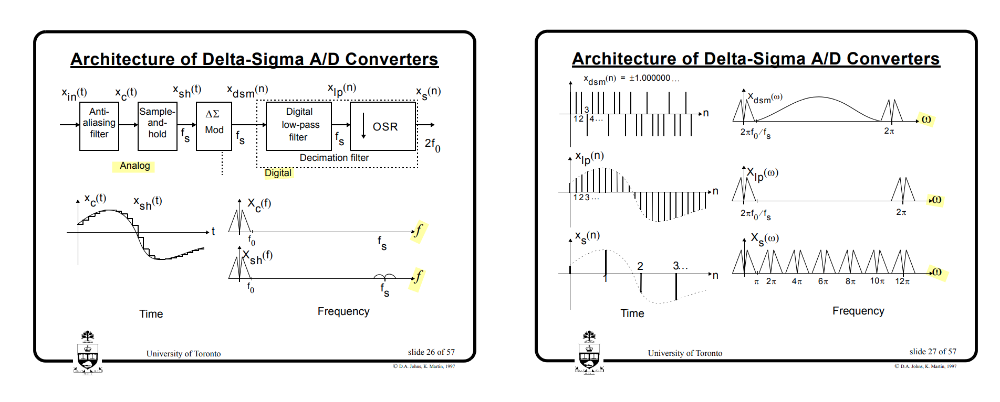

> *"**Quantizers**" and "**truncators**", and "**integrators**" and "**accumulators**" are used in **delta-sigma ADCs** and **DACs**, respectively*
>
> P. Kiss, J. Arias and Dandan Li, "Stable high-order delta-sigma DACS," *2003 IEEE International Symposium on Circuits and Systems (ISCAS)*, Bangkok, 2003 [[https://www.ele.uva.es/~jesus/analog/tcasi2003.pdf](https://www.ele.uva.es/~jesus/analog/tcasi2003.pdf)]


---


- a delta–sigma **ADC** consists of **an analog modulator** followed by **a digital filter**
- a delta–sigma **DAC** consists of **a digital modulator** followed by **an analog filter**

---


**Analog Delta Sigma Modulators (ADSM)**  are used in the context of *analog-to-digital conversion*

- In a CT delta-sigma ADC, there is no need for an anti-aliasing filter or a front-end sampler

**Digital Delta Sigma Modulators (DDSM)** are commonly used in *digital to-analog conversion* and *fractional-N frequency synthesis*

- In a DDSM, the *input is digital* and the *filters are implemented digitally* 
- the input to the DDSM is often a *constant digital word*, this covers delta-sigma fractional-N synthesizers in the frequency generation application


---


## Oversampling Advantage


> David Johns and Ken Martin. Oversampling Converters [[https://www.eecg.toronto.edu/~johns/ece1371/slides/14_oversampling.pdf](https://www.eecg.toronto.edu/~johns/ece1371/slides/14_oversampling.pdf)]


## *output* vs. *error*-feedback

The ***error-feedback architecture*** is problematic for **analog** implementation, since it is sensitive to variations of its parameters (subtractor realization)

- The error-feedback structure is thus of limited utility in $\Delta \Sigma$ **ADCs**
- The error-feedback structure is very useful and applied in ***digital*** loops required in $\Delta \Sigma$ **DACs**


### ADC


###  DAC


> P. Kiss, J. Arias and Dandan Li, "Stable high-order delta-sigma DACS," *2003 IEEE International Symposium on Circuits and Systems (ISCAS)*, Bangkok, 2003 [[https://www.ele.uva.es/~jesus/analog/tcasi2003.pdf](https://www.ele.uva.es/~jesus/analog/tcasi2003.pdf)]


## Time and Frequency Domain

### ADC


> hackaday. Tearing Into Delta Sigma ADC’s [[https://hackaday.com/2016/07/07/tearing-into-delta-sigma-adcs-part-1/ ](https://hackaday.com/2016/07/07/tearing-into-delta-sigma-adcs-part-1/ )]


---




### DAC

 an ***interpolation filter*** effectively ***up-samples its low-rate input*** and ***lowpass-filters the resulting high-rate data*** to produce a high-rate output <u>*devoid of images*</u>


> P.E. Allen -CMOS Analog Circuit Design: Lecture 39 – Oversampling ADCs – Part I (6/26/14)  [[https://aicdesign.org/wp-content/uploads/2018/08/lecture39-140626.pdf](https://aicdesign.org/wp-content/uploads/2018/08/lecture39-140626.pdf)]
>
> P.E. Allen -CMOS Analog Circuit Design: Lecture 40 – Oversampling ADCs – Part II (7/17/15) [[https://aicdesign.org/wp-content/uploads/2018/08/lecture40-150717.pdf](https://aicdesign.org/wp-content/uploads/2018/08/lecture40-150717.pdf)]


---


> David Johns and Ken Martin. Oversampling Converters [[https://www.eecg.toronto.edu/~johns/ece1371/slides/14_oversampling.pdf](https://www.eecg.toronto.edu/~johns/ece1371/slides/14_oversampling.pdf)]


## interpolation filter

*Notice that the requirements of the **first** stage are very **demanding***


## Sigma-Delta DAC

*TODO* &#128197;

Sigma-delta digital-to-analog converters (SD DAC’s) are often used for *discrete-time signals* with *sample rate much higher than their bandwidth*

- Because of the high sample rate relative to signal bandwidth, ***a very simple DAC reconstruction filter* (*Analog lowpass filter*)** suffices, often just a *one-pole RC lowpass*


> Dan Boschen. sigma delta modulator for DAC [[https://dsp.stackexchange.com/a/88357/59253](https://dsp.stackexchange.com/a/88357/59253)]
>
> Neil Robertson. Model a Sigma-Delta DAC Plus RC Filter [[https://www.dsprelated.com/showarticle/1642.php](https://www.dsprelated.com/showarticle/1642.php)]
>
> Jason Sachs. Return of the Delta-Sigma Modulators, Part 1: Modulation [[https://www.dsprelated.com/showarticle/1517/return-of-the-delta-sigma-modulators-part-1-modulation](https://www.dsprelated.com/showarticle/1517/return-of-the-delta-sigma-modulators-part-1-modulation)]
>
> Robertson, Neil, “A Simplified Matlab Function for Power Spectral Density”, DSPRelated.com, March, 2020, [[https://www.dsprelated.com/showarticle/1333.php](https://www.dsprelated.com/showarticle/1333.php)]


## No delay-free loops

Any such **physically feasible device** will take **a finite time** to operate – in other words, the *quantized output* will only be available a *small time* after the quantizer has "looked" at the input - *insert a one-sample delay*


> there **cannot** be a *"delay free loop"* is a common idea in sequential digital state machine design


---


> Both integrator and quantizer are delay free  

NTF realizability criterion: No delay-free loops in the modulator


> 


## linear settling & GBW of amplifier

*TODO* &#128197;

Switched capacitor has been the common realization technique of *discrete-time (DT) modulators*, and in order to achieve a **linear settling**, the *sampling frequency* used in these converters needs to be *significantly lower than the gain bandwidth product (GBW) o*f the amplifiers. 


## MOD1 & MOD2

***MOD1***: *first*-order noise-shaped converter ($\Delta\Sigma$ modulator)

***MOD2***: *second*-order noise-shaped converter ($\Delta\Sigma$ modulator)


### MOD1


$$
V(z) = U(z) +(1-z^{-1})E(z)
$$


- A binary DAC (and hence a binary modulator) is inherently linear
- With a CT loop filter, MOD1 has inherent anti-alising


---


$$\begin{align}
v[1] &= u  - (0) + e[1] \\
v[2] &= 2u - (v[1]) + e[2] \\
v[3] &= 3u - (v[1]+v[2]) + e[3] \\
v[4] &= 4u - (v[1]+v[2]+v[3]) + e[4]
\end{align}$$

That is
$$
v[n] = nu - \sum_{k=1}^{n-1}v[k] + e[n]
$$
Therefore, we have $v[n-1] = (n-1)u - \sum_{k=1}^{n-2}v[k] + e[n-1]$, then
$$\begin{align}
v[n] &= nu - \sum_{k=1}^{n-1}v[k] + e[n] \\
&= u + \left((n-1)u - \sum_{k=1}^{n-2}v[k]\right) - v[n-1] + e[n] \\
&= u + v[n-1] - e[n-1]  -v[n-1] + e[n] \\
&= u + e[n] - e[n-1]
\end{align}$$


---


Dout, the low frequency component of ADC out is same with Vin


### MOD2


### MOD1 with DC Excitation

*TODO* &#128197;


## decimation filter

The combination of the the *digital post-filter* and *downsampler* is called the **decimation filter** or **decimator**


###  $\text{sinc}$ filter


Provided that $T=1$
$$
H_1(e^{j2\pi f}) = \frac{\text{sinc}(Nf)}{\text{sinc}(f)} = \frac{1}{N}\frac{\sin(\pi Nf)}{\sin(\pi f)}
$$
that is $\lim_{f\to 0^+}H_1(e^{j2\pi f}) = 1$  and $H_1 = 0$ when $f=\frac{n}{N}, n\in \mathbb{Z}$


> 


### $\text{sinc}^2$ filter


> [https://classes.engr.oregonstate.edu/eecs/spring2021/ece627/Lecture%20Notes/First-Order_D-S_ADC_Scan2.pdf](https://classes.engr.oregonstate.edu/eecs/spring2021/ece627/Lecture%20Notes/First-Order_D-S_ADC_Scan2.pdf)
>
> [https://classes.engr.oregonstate.edu/eecs/spring2017/ece627/Lecture%20Notes/First-Order%20D-S%20ADC.pdf](https://classes.engr.oregonstate.edu/eecs/spring2017/ece627/Lecture%20Notes/First-Order%20D-S%20ADC.pdf)


## Truncation DAC

The noise-shaping loop output must contain a faithful *reproduction* of the input signal $u_0[n]$ in the *baseband*,

but it will also include the *filtered truncation noise* caused by the *reduction of the word length* in the loop.

Idealy, the ***DA***C will reproduce its *input **d**igital signal* in an ***a**nalog form* without any distortion

---

> 


with $\frac{y}{2^{m_2}} + q= v$,  where $v = \lfloor\frac{y}{2^{m_2}}\rfloor$

$$
\left\{ \begin{array}{cl}
Y + 2^{m_2} Q &= 2^{m_2}V   \\
U - z^{-1}2^{m_2}Q &= Y  
\end{array} \right.
$$

The STF & NTF is shown as below
$$
V = \frac{1}{2^{m_2}}U + (1-z^{-1})Q
$$

```python
m1 = 4  # MSBs
m2 = 2  # LSBs
Vmax = 2**(m1 + m2) - 1

u = 1

ylist = [0]
vlist = [0]
elist = []

Niter = 2**10
for _ in range(Niter):
    ecur = vlist[-1] - ylist[-1]
    elist.append(ecur)
    ycur = (u - ecur) % Vmax	# overflow
    ylist.append(ycur)
    ycur_bin = format(ycur, '06b')
    vcur = int(ycur_bin[:-2]+'00', 2)
    vlist.append(vcur)

print(ylist)
print(vlist)
print(sum(vlist)/len(vlist))
```


| u    | v_avg                                                        |                 |
| ---- | ------------------------------------------------------------ | --------------- |
| 0    |  | 0000_00         |
| 1    |  | 0000_01         |
| *60* |  | **1111**_00     |
| 61   |  | **1111**_0**1** |
| 62   |  | **1111**_**1**0 |

!!! The $u$ is limited between *0* and *60* (MSBs_LSBs - LSBs)

---

> Tuan Minh Vo, S. Levantino and C. Samori, "Analysis of fractional-n bang-bang digital PLLs using phase switching technique," *2016 12th Conference on Ph.D. Research in Microelectronics and Electronics (PRIME)*, Lisbon, Portugal, [[https://sci-hub.se/10.1109/PRIME.2016.7519545](https://sci-hub.se/10.1109/PRIME.2016.7519545)]


---


An implementation of a **high-resolution integral path** using a *digital delta-sigma modulator*, *low-resolution Nyquist DAC*, and *a lowpass filter*

- $\Delta \Sigma$ truncates $n$-bit accumulator output to $m$-bits with $m\le n$
- A $m$-bit Nyquist DAC outputs current, which is fed into a low pass filter that suppresses $\Delta \Sigma$'s quantization noise


---


The remaining *11 bits are truncated to 3-levels* using a second-order delta-sigma modulator (DSM), thus, obviating the need for a high resolution DAC


> Hanumolu, Pavan Kumar. "Design techniques for clocking high performance signaling systems" [[https://ir.library.oregonstate.edu/concern/graduate_thesis_or_dissertations/1v53k219r](https://ir.library.oregonstate.edu/concern/graduate_thesis_or_dissertations/1v53k219r)]


## 1st order DDSM


## Mismatch Shaping


### Data-Weighted Averaging (DWA)


$$\begin{align}
\sum_{i=0}^{n}v[i] + e_\text{DAC}[n] &= y[n] \\
\sum_{i=0}^{n-1}v[i] + e_\text{DAC}[n-1] &= y[n-1]
\end{align}$$

and we have $w[n] = y[n] - y[n-1]$, then
$$
w[n] = v[n] + e_\text{DAC}[n] - e_\text{DAC}[n-1]
$$
i.e.
$$
W = V + (1-z^{-1})e_\text{DAC}
$$


**Element Rotation:**


> [[http://individual.utoronto.ca/schreier/lectures/12-2.pdf](http://individual.utoronto.ca/schreier/lectures/12-2.pdf)], [[http://individual.utoronto.ca/trevorcaldwell/course/Mismatch.pdf](http://individual.utoronto.ca/trevorcaldwell/course/Mismatch.pdf)]


## LSB Dither

**dithering** break *periodicity* and convert them to *noise* while input is *constant*


## drawback of Integer-N PLL

**integer-N PLL frequency synthesizers**

- the *frequency resolution*, is equal to the *reference frequency*, meaning that *only integer multiples of the reference frequency can be synthesized*

- if *fine tuning* is required, only choice in an integer-N PLL is to *decrease the reference frequency*

- *Stability requirements* limit the loop bandwidth to about *one tenth of the reference frequency*; therefore, decreasing the reference frequency increases the settling time as the loop bandwidth also has to be decreased

- Another drawback of the integer-N PLL is the *trade-off between phase noise and settling time* when the *divider ratio becomes large* (The contributions to the output phase noise of almost all PLL building blocks, except the VCO, are **multiplied by the division ratio**)

  > [[https://people.engr.tamu.edu/spalermo/ecen620/lecture03_ee620_pll_system.pdf](https://people.engr.tamu.edu/spalermo/ecen620/lecture03_ee620_pll_system.pdf)]
  >
  > 

- if a small reference frequency is chosen, t*he reference spur in the output phase noise is located at a smaller offset frequency*


## Fractional-N PLL


$$
\tau[n-1] + (N+y[n])T_{PLL} - (N+\alpha)T_{PLL} = \tau[n]
$$

i.e.
$$
\tau[n] = \tau[n-1] + (y[n] - \alpha)T_{PLL}
$$

where $\tau[n] = t_{v_{DIV}} -  t_{v_{DIV}, desired}$ 


In $z$-domain
$$
\left\{(A + D - Y)\frac{z^{-1}}{1-z^{-1}} - 2Y \right\}\frac{z^{-1}}{1-z^{-1}} + Q = Y
$$
That is
$$
Y = A z^{-2} + Dz^{-2} + Q(1-z^{-1})^2
$$
In time domain
$$\begin{align}
y[n] &= \alpha[n-2] + d[n-2] +  q[n]-2q[n-1]+q[n-2] \\
&= \alpha + d[n-2] + q[n]-2q[n-1]+q[n-2]
\end{align}$$


## quantizer overload

*TODO* &#128197;


## reference

R. Schreier, ISSCC2006 tutorial: Understanding Delta-Sigma Data Converters

Shanthi Pavan, ISSCC2013 T5: Simulation Techniques in Data Converter Design [[https://www.nishanchettri.com/isscc-slides/2013%20ISSCC/TUTORIALS/ISSCC2013Visuals-T5.pdf](https://www.nishanchettri.com/isscc-slides/2013%20ISSCC/TUTORIALS/ISSCC2013Visuals-T5.pdf)]

Bruce A. Wooley , 2012, "The Evolution of Oversampling Analog-to-Digital Converters" [[https://r6.ieee.org/scv-sscs/wp-content/uploads/sites/80/2012/06/Oversampling-Wooley_SCV-ver2.pdf](https://r6.ieee.org/scv-sscs/wp-content/uploads/sites/80/2012/06/Oversampling-Wooley_SCV-ver2.pdf)]

B. Razavi, "The Delta-Sigma Modulator [A Circuit for All Seasons]," IEEE Solid-State Circuits Magazine, Volume. 8, Issue. 20, pp. 10-15, Spring 2016. [[http://www.seas.ucla.edu/brweb/papers/Journals/BRSpring16DeltaSigma.pdf](http://www.seas.ucla.edu/brweb/papers/Journals/BRSpring16DeltaSigma.pdf)]

Pavan, Shanthi, Richard Schreier, and Gabor Temes. (2016) 2016. Understanding Delta-Sigma Data Converters. 2nd ed. Wiley.

Horowitz, P., & Hill, W. (2015). *The art of electronics* (3rd ed.). Cambridge University Press. [[pdf](https://kolegite.com/EE_library/books_and_lectures/%D0%95%D0%BB%D0%B5%D0%BA%D1%82%D1%80%D0%BE%D0%BD%D0%B8%D0%BA%D0%B0/_The%20Art%20of%20Electronics%203rd%20ed%20%5B2015%5D.pdf)]

---

Richard E. Schreier, ECE 1371 Advanced Analog Circuits - 2015 [[http://individual.utoronto.ca/schreier/ece1371-2015.html](http://individual.utoronto.ca/schreier/ece1371-2015.html)]

Gabor C. Temes. ECE 627-Oversampled Delta-Sigma Data Converters [[https://classes.engr.oregonstate.edu/eecs/spring2017/ece627/lecturenotes.html](https://classes.engr.oregonstate.edu/eecs/spring2017/ece627/lecturenotes.html)]

Boris Murmann, ISSCC2022 SC1: Introduction to ADCs/DACs: Metrics, Topologies, Trade Space, and Applications [[link](【SC1.Introduction.to.ADCs.DACs.Metrics.Topologies.Trade.Space.and.Applications】 https://www.bilibili.com/video/BV1ENxxedEio/?share_source=copy_web&vd_source=5a095c2d604a5d4392ea78fa2bbc7249)]

Ian Galton. Delta-Sigma Fractional-N Phase-Locked Loops [[https://ispg.ucsd.edu/wordpress/wp-content/uploads/2022/10/fnpll_ieee_tutorial_2003_corrected.pdf](https://ispg.ucsd.edu/wordpress/wp-content/uploads/2022/10/fnpll_ieee_tutorial_2003_corrected.pdf)]

Joshua Reiss. Understanding sigma delta modulation: the solved and unsolved issues

 [[https://www.eecs.qmul.ac.uk/~josh/documents/2008/Reiss-JAES-UnderstandingSigmaDeltaModulation-SolvedandUnsolvedIssues.pdf](https://www.eecs.qmul.ac.uk/~josh/documents/2008/Reiss-JAES-UnderstandingSigmaDeltaModulation-SolvedandUnsolvedIssues.pdf)]

Ian Galton  ISSCC 2010 SC3: Fractional-N PLLs [[https://www.nishanchettri.com/isscc-slides/2010%20ISSCC/Short%20Course/SC3.pdf](https://www.nishanchettri.com/isscc-slides/2010%20ISSCC/Short%20Course/SC3.pdf)]

---

Sudhakar Pamarti. CICC 2020 ES2-2: Basics of Closed- and Open-Loop Fractional Frequency Synthesis [[https://youtu.be/t1TY-D95CY8?si=tbav3J2yag38HyZx](https://youtu.be/t1TY-D95CY8?si=tbav3J2yag38HyZx)]

S. Pamarti, J. Welz and I. Galton, "Statistics of the Quantization Noise in 1-Bit Dithered Single-Quantizer Digital Delta–Sigma Modulators," in *IEEE Transactions on Circuits and Systems I: Regular Papers*, vol. 54, no. 3, pp. 492-503, March 2007 [[https://ispg.ucsd.edu/wordpress/wp-content/uploads/2017/05/2007-TCASI-S.-Pamarti-Statistics-of-the-Quantization-Noise-in-1-Bit-Dithered-Single-Quantizer-Digital-Delta-Sigma-Modulators.pdf](https://ispg.ucsd.edu/wordpress/wp-content/uploads/2017/05/2007-TCASI-S.-Pamarti-Statistics-of-the-Quantization-Noise-in-1-Bit-Dithered-Single-Quantizer-Digital-Delta-Sigma-Modulators.pdf)]

S. Pamarti and I. Galton, "LSB Dithering in MASH Delta–Sigma D/A Converters," in *IEEE Transactions on Circuits and Systems I: Regular Papers*, vol. 54, no. 4, pp. 779-790, April 2007 [[https://sci-hub.se/10.1109/TCSI.2006.888780](https://sci-hub.se/10.1109/TCSI.2006.888780)]

Michael Peter Kennedy. An Introduction to Digital Delta-Sigma Modulators [[https://site.ieee.org/scv-cas/files/2014/07/2014Kennedy.pdf](https://site.ieee.org/scv-cas/files/2014/07/2014Kennedy.pdf)]

Kaveh Hosseini , Michael Peter Kennedy. Springer 2011. Minimizing Spurious Tones in Digital Delta-Sigma Modulators


