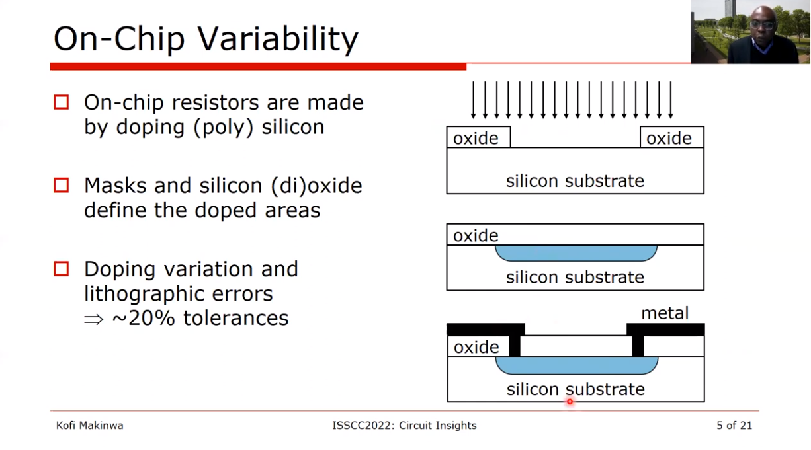

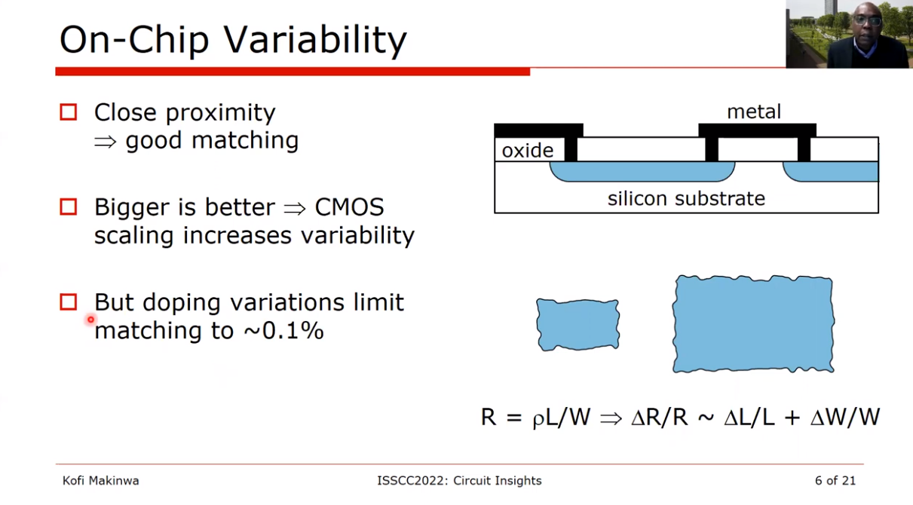

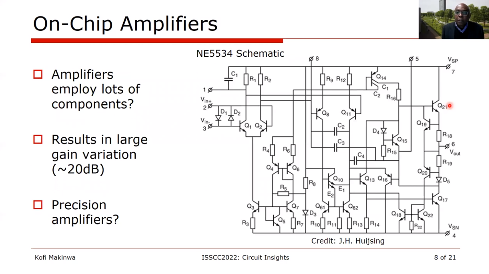

## Precision amplifier ?

### Solution 1: Feedback

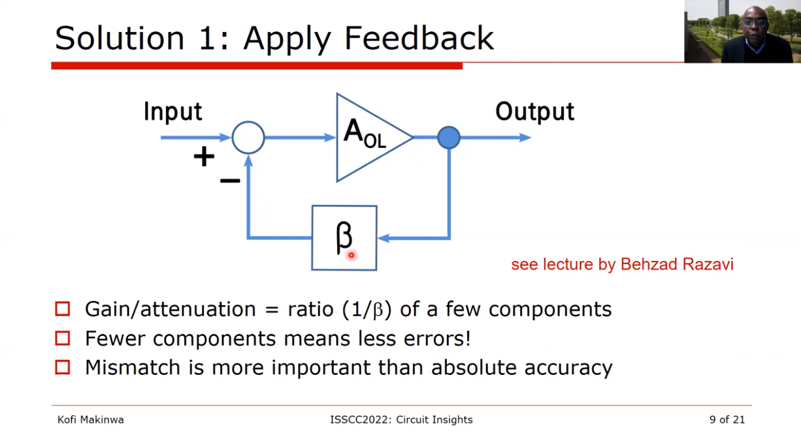

### Solution 2: Trim

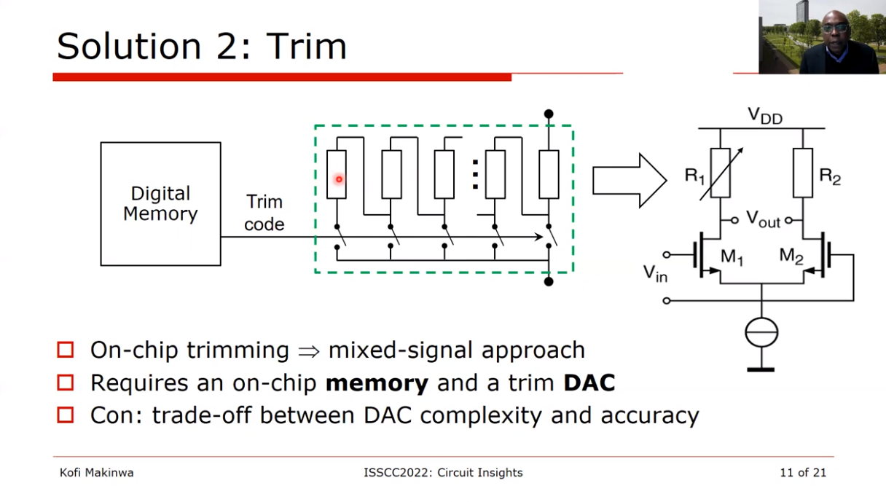

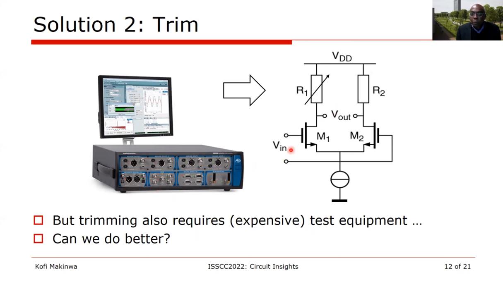

### Solution 3: Dynamic Error Correction

 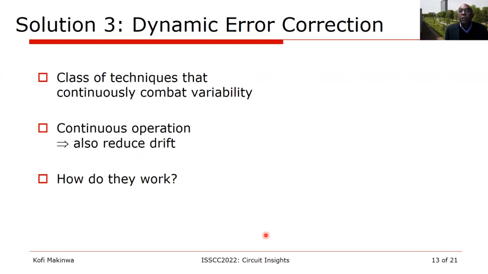

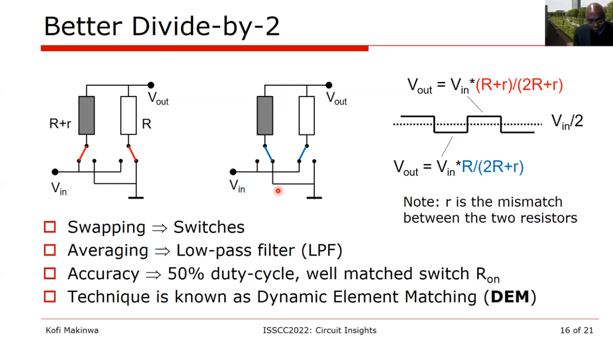

**DEM in the Frequency Domain**

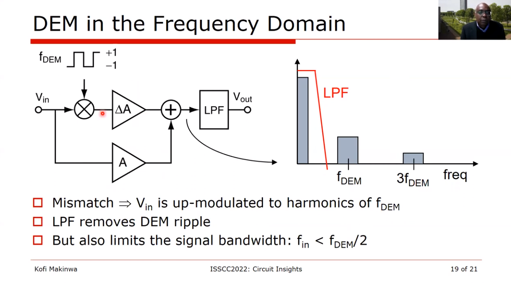

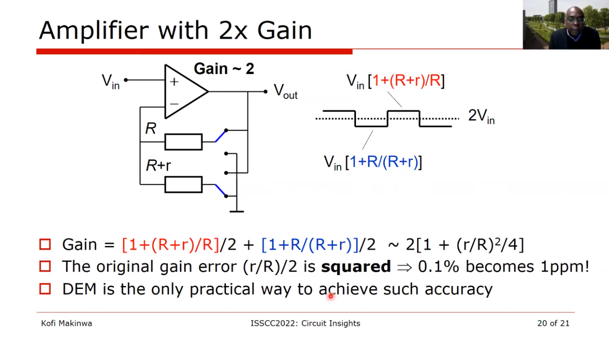

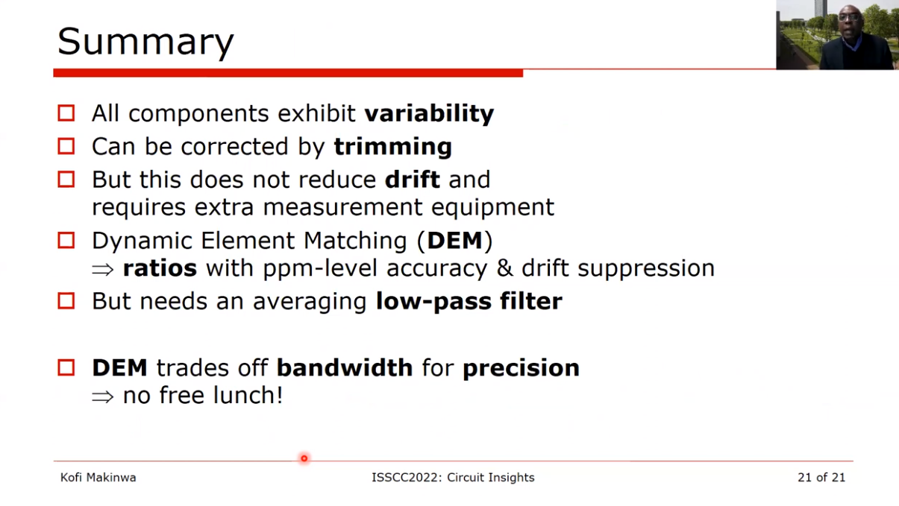

## reference

Kofi Makinwa, Coping with Variability URL: [https://youtu.be/nA_DZtRqrTQ](https://youtu.be/nA_DZtRqrTQ)
