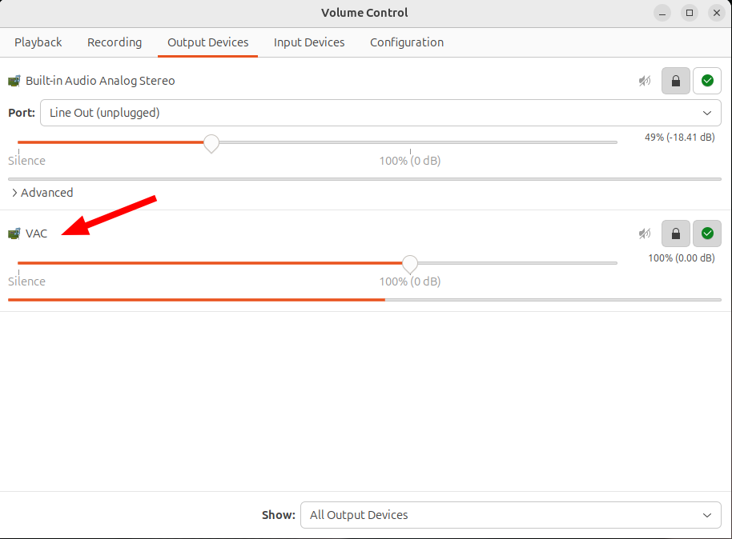
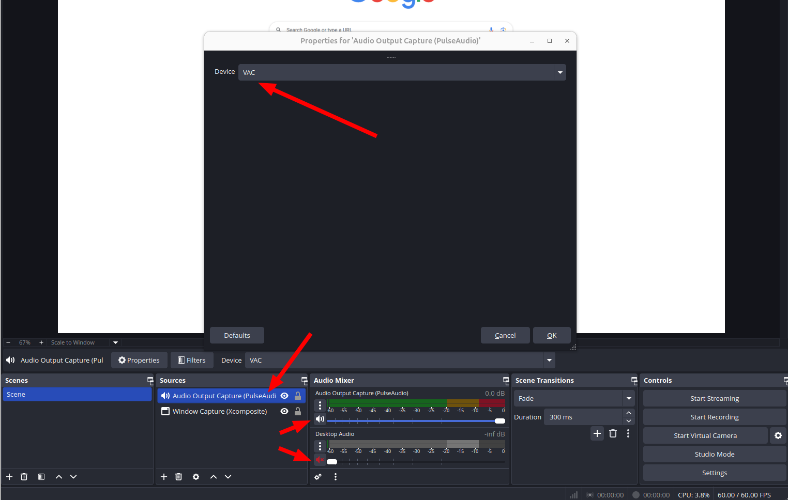
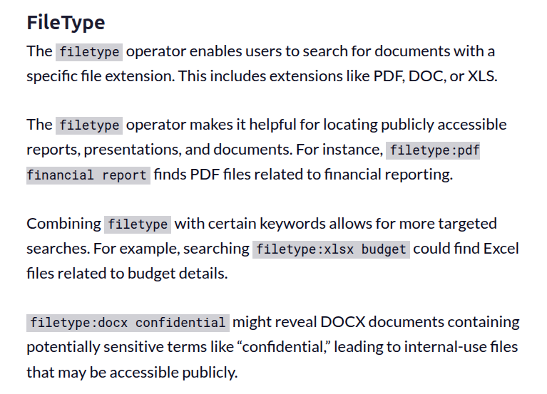
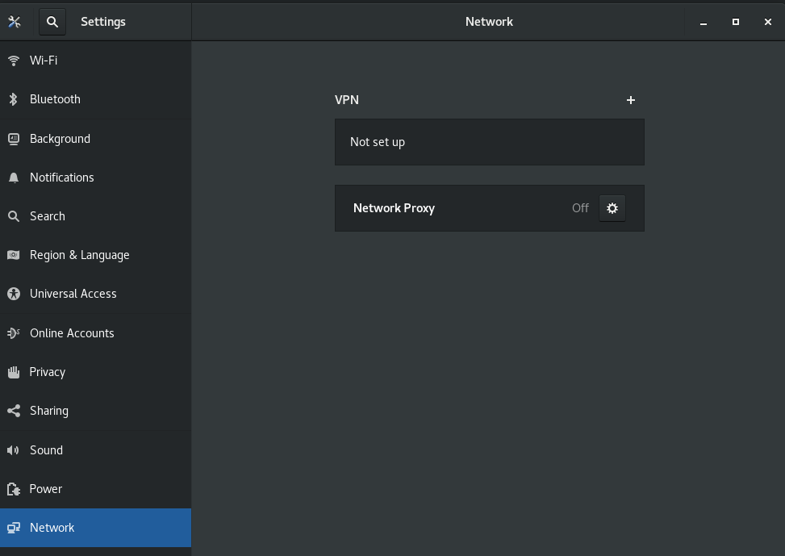
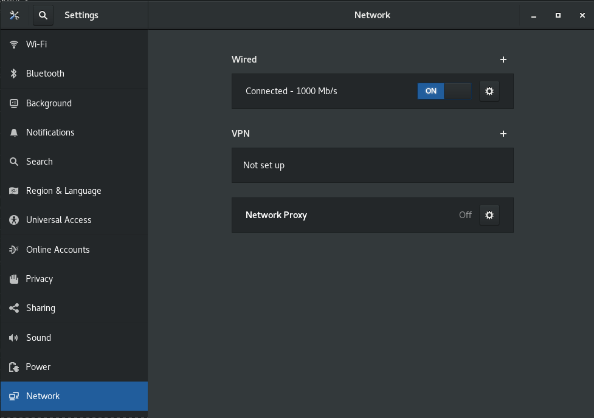
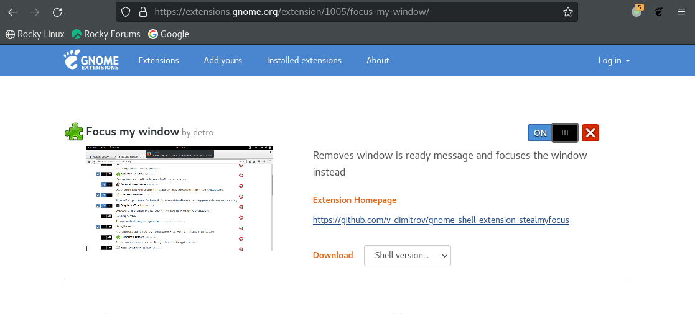

## LSF (Platform Load Sharing Facility)

`bjobs`: Displaying Job Status

`bkill`: cancels pending batch jobs and sends signals to running jobs

`bhosts`: displays hosts and their static and dynamic resources

`busers`: displays information about the user who runs the command


## Module System

`module avail`: Lists the modules currently available to load on the system

`module list`: Lists the modules currently loaded in the user environment.

`module load|add`: This **loads** the requested module into the active environment

`module purge`: To clear **all** modules

`module rm|unload`: To unload **a** module

`module switch|swap`: To change the version of a loaded software module


## unlock "secured" (read-protected) PDF

```python
# Source - https://stackoverflow.com/a/63422342
# Posted by Satish Dubey, modified by community. See post 'Timeline' for change history
# Retrieved 2026-01-05, License - CC BY-SA 4.0

import pikepdf

pdf = pikepdf.open('filepath', allow_overwriting_input=True)
pdf.save('filepath')
```


## MATLAB Win10 Unable to open the requested feature. Error code: -202

clear `AppData\Roaming\MathWorks\MATLAB`


## miniconda3/envs/myenv/bin/../lib/libstdc++.so.6: version `GLIBCXX_3.4.32' not found

> [[https://stackoverflow.com/a/73101774/8037585](https://stackoverflow.com/a/73101774/8037585)]

This is because you have some old versions not cleaned up while upgrading gcc.

First of all, make sure that you have the latest lib with `conda install -c conda-forge libstdcxx-ng`


## OBS 无声录制带有声音的视频

> 录制视频时，想要 obs 能录制声音，但是不想人耳听到。

`pactl load-module module-virtual-sink sink_name=VAC`

> unfortunately, Virtual audio sinks & settings gone after reboot






---

obs 无声录制带有声音的视频 [[https://www.cnblogs.com/wztshine/p/17764073.html](https://www.cnblogs.com/wztshine/p/17764073.html)]

Virtual Audio Cable For Ubuntu [[https://askubuntu.com/a/1268269/845522](https://askubuntu.com/a/1268269/845522)]

能不能设置个定时器，让录像自动停？ [[https://www.reddit.com/r/obs/comments/j5j1qa/comment/g7sk588/](https://www.reddit.com/r/obs/comments/j5j1qa/comment/g7sk588/)]


## wget fetch a directory

```bash
$ wget -r -np -R "index.html*" http://example.com/configs/.vim/
```


> Using wget to recursively fetch a directory with arbitrary files in it [[https://stackoverflow.com/a/273776/8037585](https://stackoverflow.com/a/273776/8037585)]


## mount/umount ISO

```bash
$ sudo mount -t auto -o loop /path/to/matlab.iso /mnt/matlab
$ umount /mnt/iso
```


## Google search tips

> [[https://static.googleusercontent.com/media/www.google.com/en//educators/downloads/Tips_Tricks_17x22.pdf](https://static.googleusercontent.com/media/www.google.com/en//educators/downloads/Tips_Tricks_17x22.pdf)]





## Restart Xfce panel

```bash
xfce4-panel -r
```

> [[https://askubuntu.com/a/891209](https://askubuntu.com/a/891209)]

## Rocky Linux 8 rpm for cadence binary and cdnshelp

**qt5 and openssl**

```bash
sudo yum install openssl compat-openssl10 qca-qt5-ossl.x86_64 openssl-devel
```

**library preparation for EDA installation**

```
libc6, gdb
dc
libncurses5-dev
libncurses5-dev:i386
g++
pstack
libelf1:i386
libgcc-4.8-dev:i386
libstdc++6:i386
gcc-multilib
g++-multilib
libc6-dbg
libc6-dbg:i386
libexpat-dev
libexpat-dev:i386libxss-dev
libxpm4
libxpm4:i386
libmng2
libxss-dev:i386
libxft2
libxft2:i386
libxmu6
libxmu6:i386
libjpeg62-dev
libjpeg62-dev:i386
gnome-core
gnome-core:i386
xfce4
libxml2:i386
libxml2, libXft-dev
libXft-dev:i386
libSM
libSM:i386
libpng3
libpng3:i386
libxi6
libxi6:i386
glibc.i686
libX11.i686
libX11-devel.i686
libX11-devel.x86_64
gcc-c++
compat-readline5
libXext.i686
libXtst.i686
redhat-lsb.i686
libXrender.i686
glibc-devel.i686
zlib.i686
ncompress.x86_64
ksh
openmotif22.i686
openmotif22.x86_64
xterm
```


##  Rocky Linux 8 extend LVM in VMware

```
1) gparted extend
2)
  lvextend -l +100%FREE /dev/rl/root
3)
  xfs_growfs /dev/mapper/rl-root

usefull command:
  df -h
  lvdisplay
  fdisk -l

-----------------------------------------------------------
https://pocketadmin.tech/en/centos-8-extend-lvm/

$ sudo lvdisplay
  --- Logical volume ---
  LV Path                /dev/rl/swap
  LV Name                swap
  VG Name                rl
  LV UUID                toZKEu-P5oV-6WOV-026Z-eFnI-xaSP-FgEbz5
  LV Write Access        read/write
  LV Creation host, time myserver, 2021-12-03 21:28:03 +0800
  LV Status              available
  # open                 2
  LV Size                5.00 GiB
  Current LE             1280
  Segments               1
  Allocation             inherit
  Read ahead sectors     auto
  - currently set to     8192
  Block device           253:1

  --- Logical volume ---
  LV Path                /dev/rl/root
  LV Name                root
  VG Name                rl
  LV UUID                S2soRE-umc7-Z6b3-i44x-TiBO-ulnk-ETgEoj
  LV Write Access        read/write
  LV Creation host, time myserver, 2021-12-03 21:28:03 +0800
  LV Status              available
  # open                 1
  LV Size                <194.00 GiB
  Current LE             49663
  Segments               1
  Allocation             inherit
  Read ahead sectors     auto
  - currently set to     8192
  Block device           253:0
```


## compile vim from source with GUI support

```bash
# gtk3 in Rocky Linux 8.5
./configure --with-features=huge --enable-gui=gtk3 --enable-python3interp --prefix=/usr
make -j`nproc`
sudo make install
```

**binkey**

Inserting a new line below: `o`

above: `O`

To insert before the cursor: `i`

After: `a`

Before the line (home): `I`

Append at the end of line: `A`


## network connection using nmcli

**Problem**

There is no network connection and device is not managed


```
$ nmcli device status
DEVICE  TYPE      STATE      CONNECTION
eth0    ethernet  unmanaged  --
lo      loopback  unmanaged  --
```



**solution**

```bash
sudo nmcli networking on
```

Then, **eth0** is connected

```
$ nmcli device status
DEVICE  TYPE      STATE      CONNECTION
eth0    ethernet  connected  Ethernet connection 1
lo      loopback  unmanaged  --
```




##  What is the proper method to remove old kernels from a Red Hat Enterprise Linux system?

**Red Hat Enterprise Linux 8**

The YUM version 4 (based on the upstream `DNF` project) method for removing kernels and keeping only the latest version and running kernel:

```bash
$ yum remove --oldinstallonly
```

From the `yum` man page:

```bash
dnf [options] remove --oldinstallonly
    Removes old installonly packages, keeping only latest versions and  version  of  running
    kernel.
```


## New windows and forms appear behind the Library Manager in background when using GNOME 3

Using **Red Hat Enterprise Linux 8**, **Rocky Linux 8** and the **GNOME 3** window manager, the new Virtuoso Schematic/Layout/ADE windows and forms sometimes pop up under or below the **Library Manager** or on the desktop in the background instead of the foreground and cannot be seen. Sometimes, they are iconized; they do not come on the top in front, though it is the most recent window opened.

**solution**

>  Install **Focus my window** GNOME Shell extension



**reference**

Article (11612426) Title: New windows and forms appear behind the Library Manager in background or iconized instead of foreground on RHEL and SuSE Linux in GNOME, KDE Desktop, Metacity window manager


## VMware Disk Shrink

In Guest OS and run

```bash
sudo vmware-toolbox-cmd disk shrink /
```


[https://superuser.com/q/211798](https://superuser.com/q/211798)


## GitHub Pages Build and deployment

The repository visibility shall be `public`


## squash all git commits into one?

[https://stackoverflow.com/a/9254257/8037585](https://stackoverflow.com/a/9254257/8037585)

As of [git 1.6.2](https://github.com/git/git/blob/master/Documentation/RelNotes/1.6.2.txt#L118), you can use `git rebase --root -i`

For each commit except the first, change `pick` to `squash`.


this works find, but I had to do a forced push. be careful! `git push -f`


## Build VMware host modules

```
git clone git@github.com:mkubecek/vmware-host-modules.git
cd vmware-host-modules/
git checkout origin/workstation-17.0.2
make -j`nproc`
sudo make install
sudo modprobe -v vmmon
sudo modprobe -v vmnet
sudo vmware-networks --start
```


## AWT-EventQueue-0 Matlab

```
Renaming libstdc++.so.6 to libstdc++.so.6old solved it for me in MATLAB 2021B UBUNTU 20.04. Thanks!
```

[[https://www.mathworks.com/matlabcentral/answers/329796-issue-with-libstdc-so-6#comment_2316900](https://www.mathworks.com/matlabcentral/answers/329796-issue-with-libstdc-so-6#comment_2316900)]
