## Decimation Filter

> [[https://web.engr.oregonstate.edu/~temes/ece627/Lecture_Notes/First_Order_DS_ADC_scan1.pdf](https://web.engr.oregonstate.edu/~temes/ece627/Lecture_Notes/First_Order_DS_ADC_scan1.pdf)]
>
> [[https://web.engr.oregonstate.edu/~temes/ece627/Lecture_Notes/First_Order_DS_ADC_scan2.pdf](https://web.engr.oregonstate.edu/~temes/ece627/Lecture_Notes/First_Order_DS_ADC_scan2.pdf)]

The combination of the the *digital post-filter* and *downsampler* is called the **decimation filter** or **decimator**

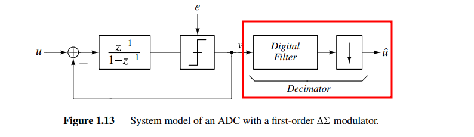

###  $\text{sinc}$ filter

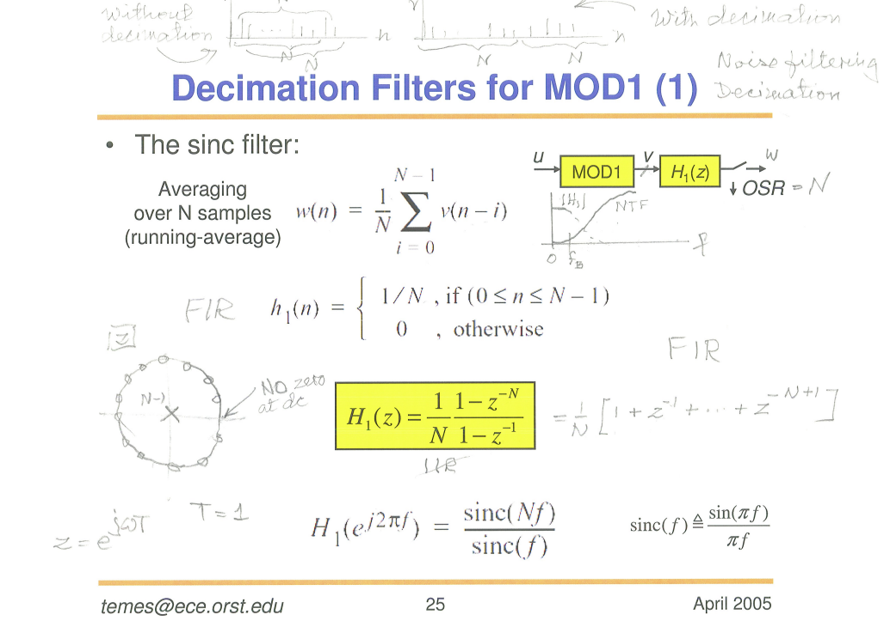

Suppose $T=1$
$$
H_1(e^{j2\pi f}) = \frac{\text{sinc}(Nf)}{\text{sinc}(f)} = \frac{1}{N}\frac{\sin(\pi Nf)}{\sin(\pi f)}
$$
that is $\lim_{f\to 0^+}H_1(e^{j2\pi f}) = 1$  and $H_1 = 0$ when $f=\frac{n}{N}, n\in \mathbb{Z}$

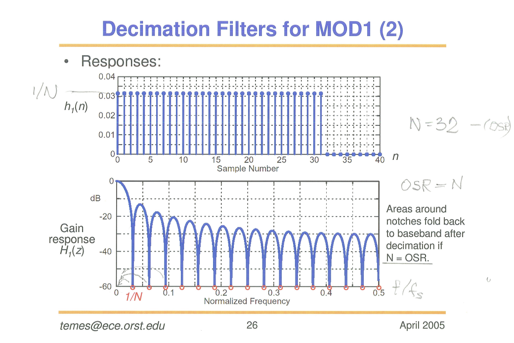

> A Beginner's Guide To Cascaded Integrator-Comb (CIC) Filters [[https://www.dsprelated.com/showarticle/1337.php](https://www.dsprelated.com/showarticle/1337.php)]
>
> 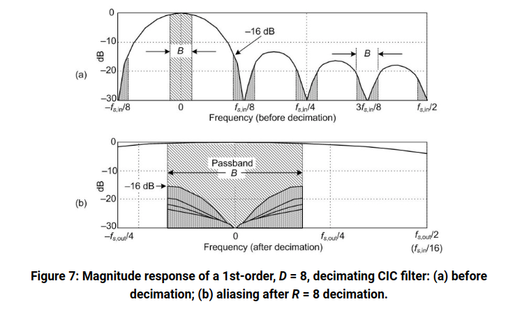

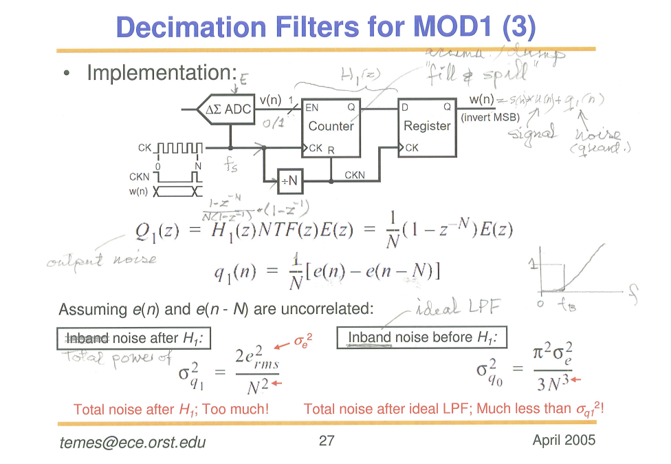

$$
|H_1(\omega)|^2 = \left|\frac{1}{N}(1-e^{-j\omega N}) \right| = \frac{2}{N^2}(1-\cos (\omega N))
$$
Total noise after $H_1$
$$
\sigma_{q_1}^2 = 2\int_0^\pi \frac{e^2_{rms}}{2\pi}\cdot |H_1(\omega)|^2d\omega = \frac{2e^2_{rms}}{N^2}
$$
inband noise before $H_1$, i.e. ***ideal LPF*** with cutoff frequency $\frac{\pi}{N}$
$$
\sigma_{q_0}^2 = 2\int_0^{\pi/N}\frac{e_{rms}^2}{2\pi}|1-e^{-j\omega}|^2d\omega = \frac{2e_{rms}^2}{\pi}\left(\frac{\pi}{N}-\sin\frac{\pi}{N}\right)
$$
with Taylor series $\sin\frac{\pi}{N}\approx \frac{\pi}{N}-\frac{1}{6}\frac{\pi^3}{N^3}$
$$
\sigma_{q_0}^2 \approx \frac{\pi^2}{3N^3}e_{rms}^2
$$

> Taylor’s Series of $\sin x$ [[pdf](https://ocw.mit.edu/courses/18-01sc-single-variable-calculus-fall-2010/242ad6a22b86b20799afc7f207cd4271_MIT18_01SCF10_Ses99c.pdf)]
>
> 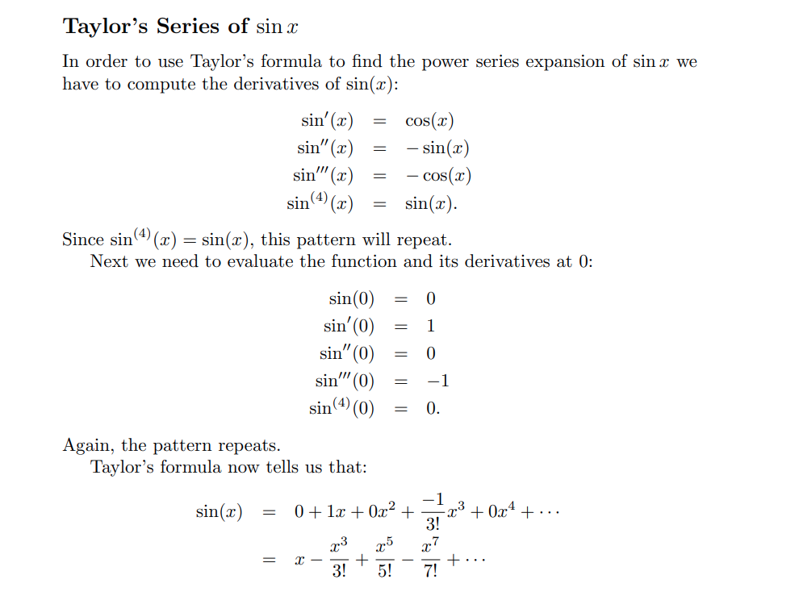

---

> [[https://analogicus.com/aic2025/2025/02/20/Lecture-6-Oversampling-and-Sigma-Delta-ADCs.html#python-oversample](https://analogicus.com/aic2025/2025/02/20/Lecture-6-Oversampling-and-Sigma-Delta-ADCs.html#python-oversample)]

### $\text{sinc}^2$ filter

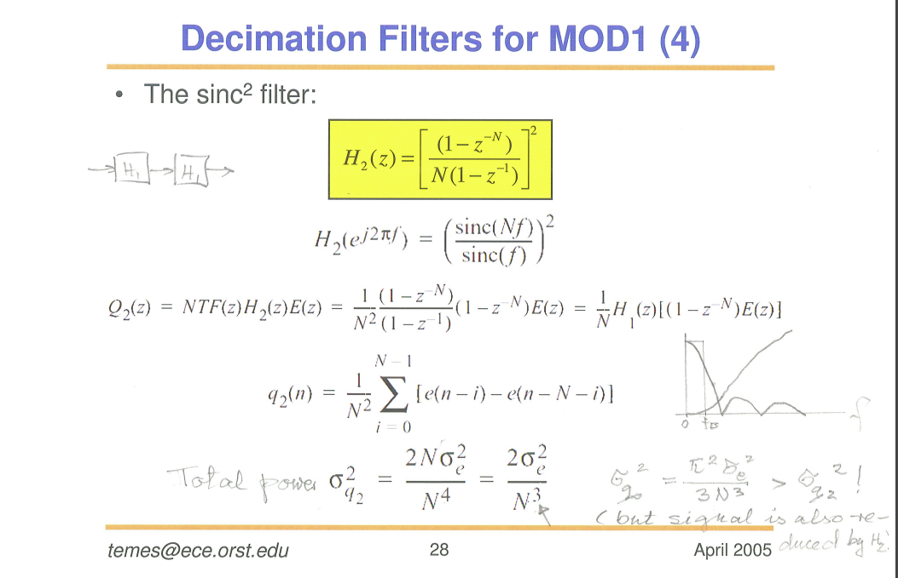

## Interpolation Filter

*Notice that the requirements of the **first** stage are very **demanding***

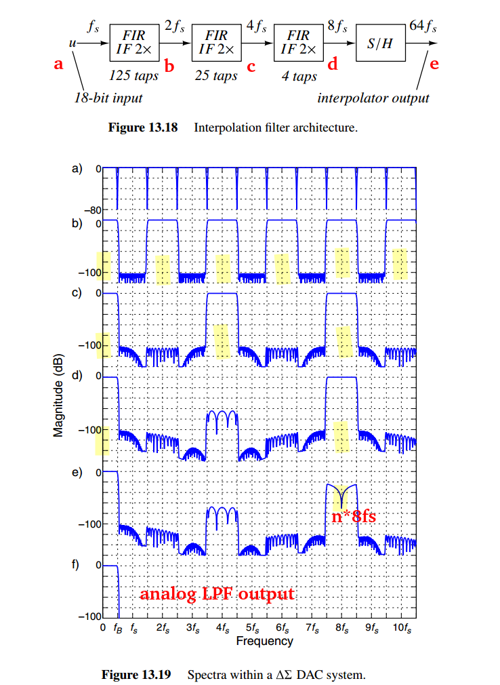

### replicas suppression

The spectrum of the high resolution digital signal $u_1$ contains the ***original baseband portion*** and its replicas located at integer multiples of $f_{s1}$, plus ***a small amount of quantization noise*** shown as a solid line 

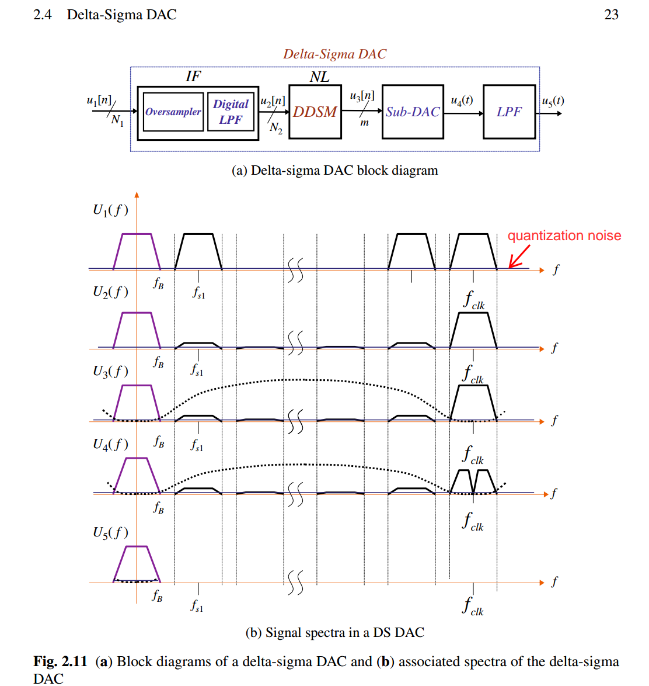

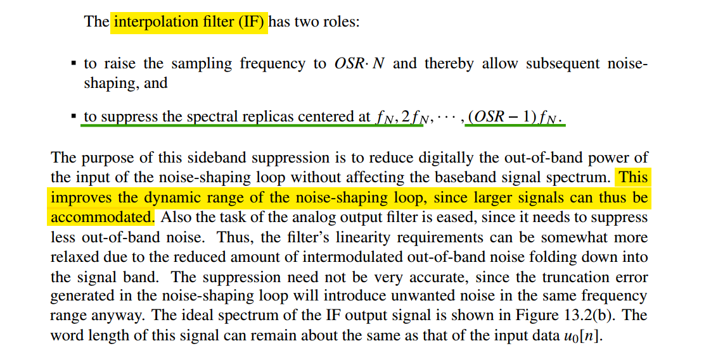

---

> Nigel Redmon [[https://dsp.stackexchange.com/a/63438/59253](https://dsp.stackexchange.com/a/63438/59253)]

***Inserting zeros changes nothing except what we consider the sample rate***

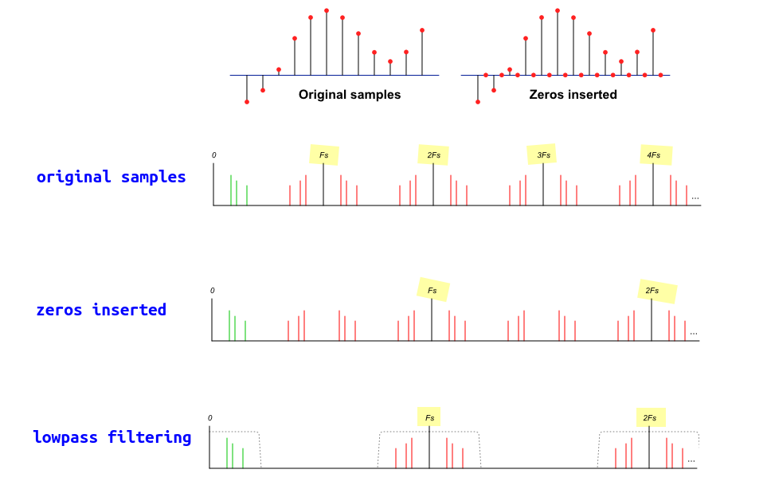

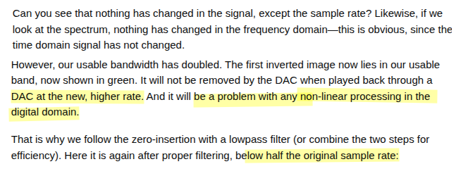

---

> Dan Boschen [[https://dsp.stackexchange.com/a/32130/59253](https://dsp.stackexchange.com/a/32130/59253)]

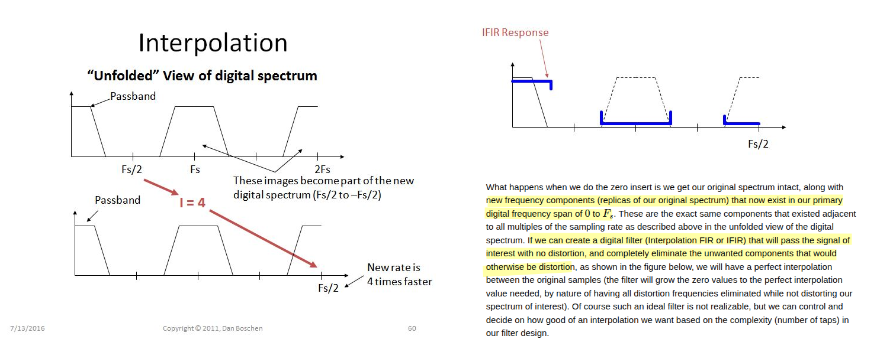

---

> Bourdopoulos, G. I. (2003). *Delta-Sigma modulators : modeling, design and applications*. Imperial College Press. [[pdf](https://picture.iczhiku.com/resource/eetop/shkgQaSQSIzkhbmc.pdf)]

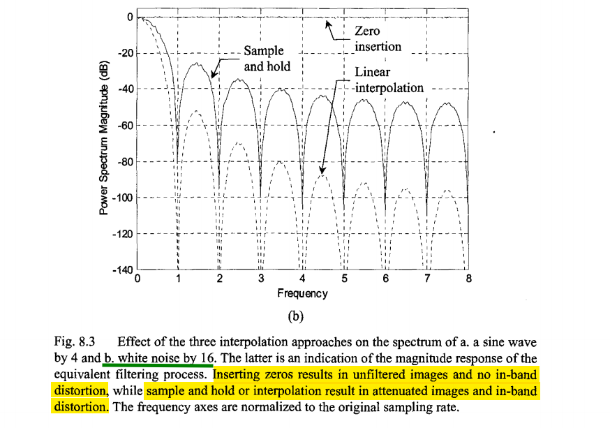

## DC Gain in IF

DC gain is used to compensate the ratio of sampling rate before and after upsample

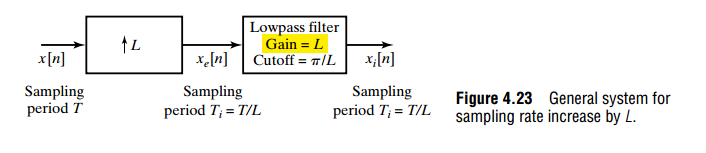

Given
$$
X_e = X =  \propto \frac{1}{T} = \frac{1}{L\cdot T_i}
$$
Then, the lowpass filter (ZOH, FOH .etc) gain shall be $L$

---

Employ definition of DTFT,  $X(e^{j\hat{\omega}})
=\sum_{n=-\infty}^{+\infty}x[n]e^{-j\hat{\omega} n}$, and set $\hat{\omega} = 0$
$$
X(e^{j0}) = \sum_{n=-\infty}^{+\infty}x[n]
$$
That is, $\sum_{n=-\infty}^{+\infty}x[n] = \sum_{n=-\infty}^{+\infty}x_e[n]$, so
$$
\overline{x_e[n]} = \frac{1}{L} \overline{x[n]}
$$
It also indicate that dc gain of upsampling is $1/L$

### Zero-Order Hold (ZOH)

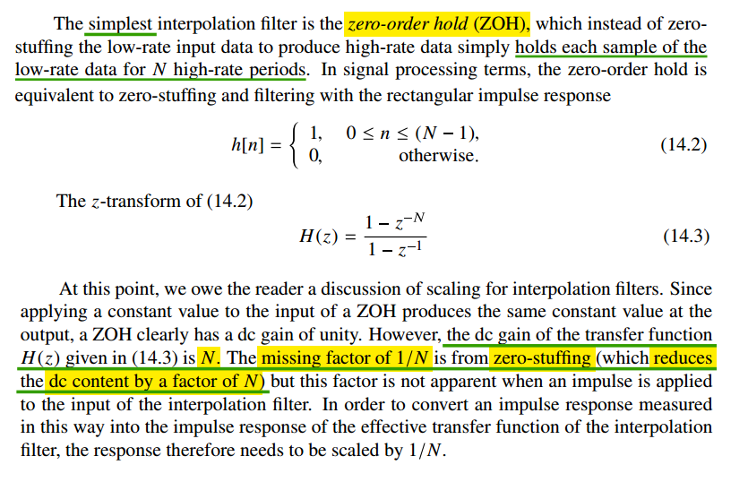

> dc gain = $N$

### First-Order Hold (FOH)

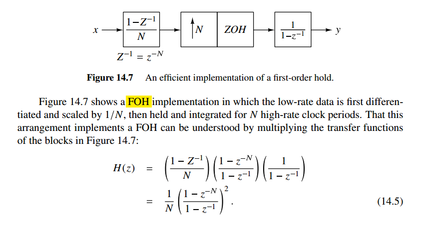

> dc gain = $N$

## Accumulate-and-dump (AAD) decimator

accumulating the input for $N$ cycles and then latching the result and resetting the integrator

> It adds up $N$ succeeding input samples at rate $1/T$ and delivers their sum in a *single* sample at the output. Therefore, the process comprises a **filter (in the accumulation)** and a **down-sampler (in the dump)**

## Cascaded Integrator-Comb (CIC) filter

> Qasim Chaudhari, Cascaded Integrator Comb (CIC) Filters – A Staircase of DSP [[https://wirelesspi.com/cascaded-integrator-comb-cic-filters-a-staircase-of-dsp/](https://wirelesspi.com/cascaded-integrator-comb-cic-filters-a-staircase-of-dsp/)]
>
> Tom Verbeure. An Intuitive Look at Moving Average and CIC Filters [[https://tomverbeure.github.io/2020/09/30/Moving-Average-and-CIC-Filters.html](https://tomverbeure.github.io/2020/09/30/Moving-Average-and-CIC-Filters.html)]
>
> —. Half-Band Filters, a Workhorse of Decimation Filters [[https://tomverbeure.github.io/2020/12/15/Half-Band-Filters-A-Workhorse-of-Decimation-Filters.html](https://tomverbeure.github.io/2020/12/15/Half-Band-Filters-A-Workhorse-of-Decimation-Filters.html)]
>
> —. Design of a Multi-Stage PDM to PCM Decimation Pipeline [[https://tomverbeure.github.io/2020/12/20/Design-of-a-Multi-Stage-PDM-to-PCM-Decimation-Pipeline.html](https://tomverbeure.github.io/2020/12/20/Design-of-a-Multi-Stage-PDM-to-PCM-Decimation-Pipeline.html)]
>
> Arash Loloee, Ph.D. Exploring Decimation Filters [[https://www.highfrequencyelectronics.com/Archives/Nov13/1311_HFE_decimationFilters.pdf](https://www.highfrequencyelectronics.com/Archives/Nov13/1311_HFE_decimationFilters.pdf)]
>

Let's focus on decimation: if we decimate by a factor 4, we simply retain one output sample out of every 4 input samples.

In the example below, the downsampler at the right drops those 3 samples out of 4, and the output rate, $y^\prime(n)$, is one fourth of the input rate $x(n)$:

$$\begin{align}
Y(z) &= X(z)\frac{1-z^{-4}}{1-z^{-1}} \\
Y^\prime(\xi) &= \frac{1}{4}Y(\xi^{1/4}) = \frac{1}{4}X(\xi^{1/4})\frac{1-\xi^{-1}}{1-\xi^{-1/4}}
\end{align}$$

with $z=e^{j\Omega/f_s}$ and $\xi =z^4$, we have
$$
Y^\prime(z) = \frac{1}{4}X(z)\frac{1-z^{-4}}{1-z^{-1}}
$$

But if we're going to be throwing away 75% of the calculated values, can't we just move the downsampler from the end of the pipeline to somewhere in the middle? Right between the integrator stage and the comb stage? That answer is yes, but to keep the math working, ***we also need to divide the number of delay elements in the comb stage by the decimation rate***:

$$\begin{align}
A(z) &= X(z)\frac{1}{1-z^{-1}} \\
A^\prime(\xi) &= \frac{1}{4}A(\xi^{1/4}) = \frac{1}{4}X(\xi^{1/4})\frac{1}{1-\xi^{-1/4}} \\
Y^\prime(\xi) &= A^\prime(\xi) (1-\xi^{-1}) =  \frac{1}{4}X(\xi^{1/4})\frac{1-\xi^{-1}}{1-\xi^{-1/4}}
\end{align}$$

with $z=e^{j\Omega/f_s}$ and $\xi =z^4$, we have
$$
Y^\prime(z) = \frac{1}{4}X(z)\frac{1-z^{-4}}{1-z^{-1}}
$$

---

And we can do this just the same with cascaded sections (*without downsampler or updampler*) where *integrators and combs have been grouped*

- for **decimation**, the *integrators come first* and the *combs second* with the downsampler in between
- For **interpolation**, the reverse is true
  - the incoming sample rate is fraction of the outgoing sample rate, the combs must come first and the interpolators second

## reference

Pavan, Shanthi, Richard Schreier, and Gabor Temes. (2016) 2016. Understanding Delta-Sigma Data Converters. 2nd ed. Wiley. 

K. Hosseini and M. P. Kennedy, Minimizing Spurious Tones in Digital Delta-Sigma Modulators (Analog Circuits and Signal Processing). New York, NY, USA: Springer, 2011.

---

Neil Robertson, Model a Sigma-Delta DAC Plus RC Filter [[https://www.dsprelated.com/showarticle/1642.php](https://www.dsprelated.com/showarticle/1642.php)]

—, Modeling a Continuous-Time System with Matlab [[https://www.dsprelated.com/showarticle/1055.php](https://www.dsprelated.com/showarticle/1055.php)]

—, Modeling Anti-Alias Filters [[https://www.dsprelated.com/showarticle/1418.php](https://www.dsprelated.com/showarticle/1418.php)]

—, DAC Zero-Order Hold Models [[https://www.dsprelated.com/showarticle/1627.php](https://www.dsprelated.com/showarticle/1627.php)]

—, “A Simplified Matlab Function for Power Spectral Density”, DSPRelated.com, March, 2020, [[https://www.dsprelated.com/showarticle/1333.php](https://www.dsprelated.com/showarticle/1333.php)]

Ahmed Shahein (2026). MSD Toolbox (https://github.com/ahmedshahein/MSDTOOLBOX), GitHub. Retrieved April 25, 2026.

—, Multi-Decimation Stage Filtering for Sigma Delta ADCs: Design and Optimization [[https://www.dsprelated.com/showarticle/1037.php](https://www.dsprelated.com/showarticle/1037.php)]

Rick Lyons. A Beginner's Guide To Cascaded Integrator-Comb (CIC) Filters [[https://www.dsprelated.com/showarticle/1337.php](https://www.dsprelated.com/showarticle/1337.php)]

—, Optimizing the Half-band Filters in Multistage Decimation and Interpolation [[https://www.dsprelated.com/showarticle/903.php](https://www.dsprelated.com/showarticle/903.php)]

---

Venkatesh Srinivasan, ISSCC 2019 T5: Noise Shaping in Data Converters

Nan Sun,IEEE CAS 2020: Break the kT/C Noise Limit [[https://www.facebook.com/ieeecas/videos/break-the-ktc-noise-limit/322899188976197/](https://www.facebook.com/ieeecas/videos/break-the-ktc-noise-limit/322899188976197/)]

Yun-Shiang Shu, ISSCC 2022 T3: Noise-Shaping SAR ADCs

Xiyuan Tang, CICC 2025 ES2-1: Noise-Shaping SAR ADCs - From Fundamentals to Recent Advances

