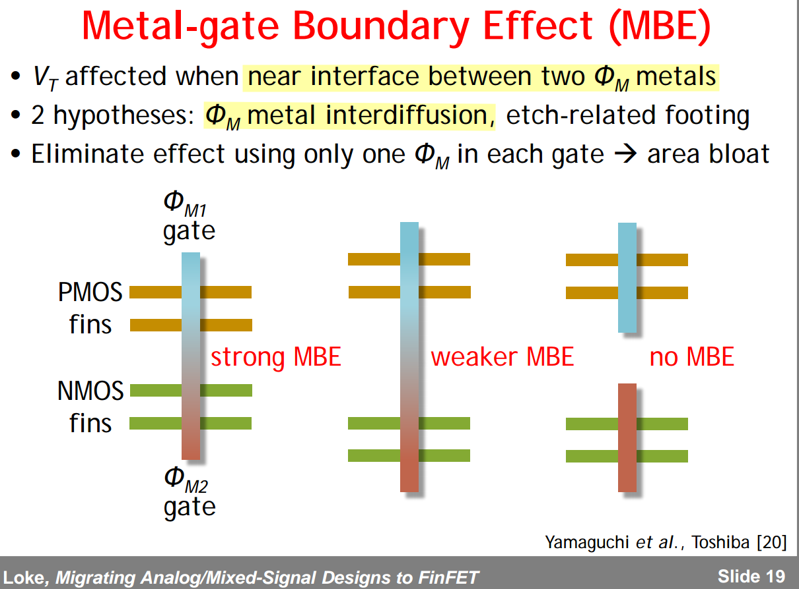
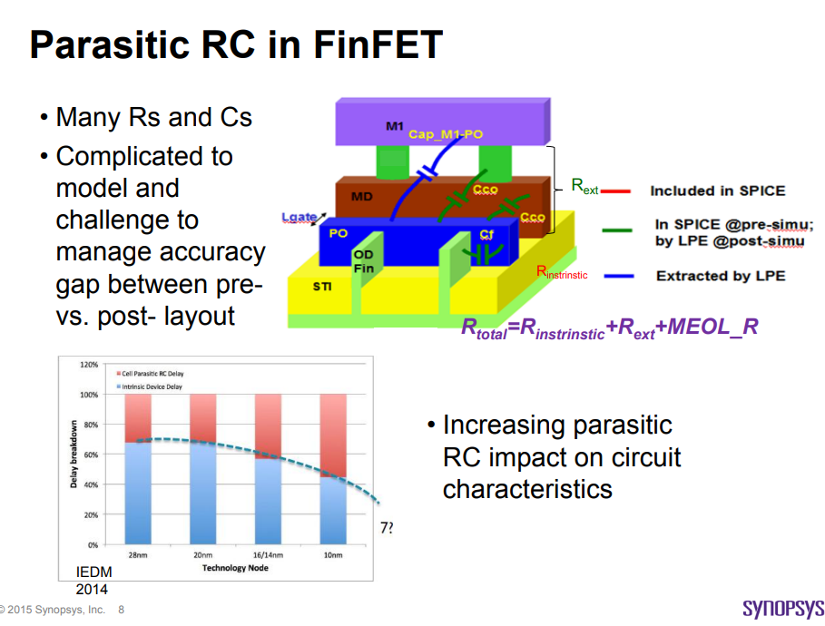
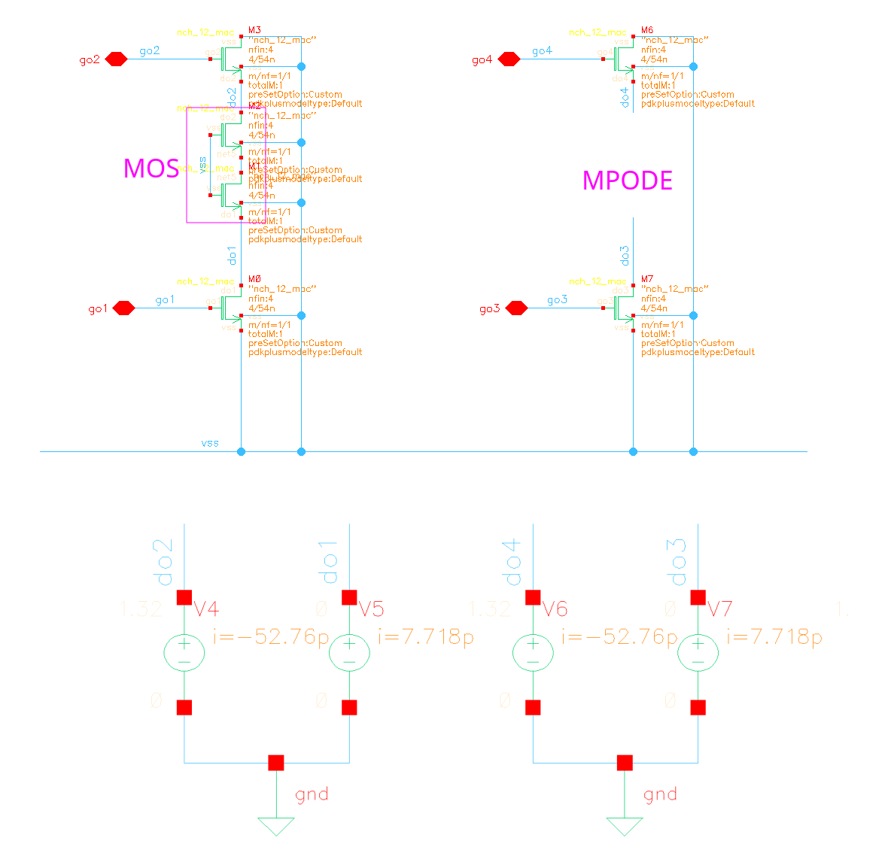
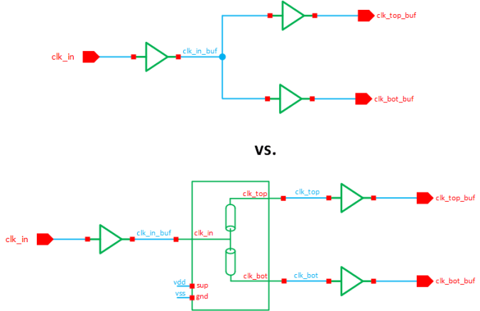

## Wafer Acceptance Test (WAT)

> 温德通. 集成电路制造工艺与工程应用. 机械工业出版社 2018

**Wafer acceptance testing (WAT)** also known as **Process Control Monitoring (PCM)**

---

## Short Lg Stackgate

> TSMC. VLSI2025 JFS2-1: Analog Cells DTCO (**D**esign and **T**echnology **C**o-**O**ptimization) and Their Impact on Advanced Node CMOS Analog/MixedSignal Circuits

> smaller **W\*L\*M,** **X\*Y** for same mismatch with short Lg stackgate

---

>  N7/N5 ***4-fin Grid Rule***
>
>  *Same **Fin1/Fin3** or **Fin2/Fin4** Fin Position*

---

note W/L is different $12/(135*2) \lt 6/(8*8)$

## Current Density (EM)

## Interconnect Resistance Evolution

> White Paper: Microelectronics/Semiconductor Research Community Virtual Workshop  2022 [[https://nnci.net/sites/default/files/inline-files/Microelectronics%202022%20Workshop%20Report%20with%20Slides.pdf](https://nnci.net/sites/default/files/inline-files/Microelectronics%202022%20Workshop%20Report%20with%20Slides.pdf)]

## Copper Pillar Bump vs Solder bump

Cu-pillar bumping is a next-generation flip chip interconnection between chip & packages, especially for fine pitch applications

- On the wafer end, comparing to solder bump, cu-pillar bump provides the advantage of fine pitch; the die size can be reduced about 5~10%. 

- On the package end, the substrate layer can be reduced from 6 layers to 4 layers by fine pitch and bump on trace process and using simplified substrate process. 

## Why Your Symmetric Layouts Are Showing Mismatches in SPICE Simulations

> [[https://www.ansys.com/blog/symmetric-layouts-showing-mismatches-spice-simulations](https://www.ansys.com/blog/symmetric-layouts-showing-mismatches-spice-simulations)]

The root cause of the delay mismatch is related to *how parasitic extraction tools distribute coupling capacitances over the nodes of the resistive networks*

> The most likely reason for such asymmetry is the anisotropy of computational geometry algorithms used by extraction tools.

## STRAP

A "strap" refers to a low-impedance connection

NWDMY = NWDMY1, NWDMY2

STRAP = NWSTRAP or PWSTRAP

NWSTRAP = {NP & OD} & {NW not {NW INTERACT NWDMY}}

PWSTRAP = {PP & OD} not NW

| cell \ pin  | PLUS    | MINUS   |
| ----------- | ------- | ------- |
| **N diode** | PWSTRAP | \       |
| **P diode** | \       | NWSTRAP |

### Calibre Rule::NOT

### Calibre Rule::INTERACT

## Antenna Effect

The **antenna effect** is a common name for the effects of *charge accumulation* in *isolated nodes* of an integrated circuit ***during its processing***

> This effect is also sometimes called "*Plasma Induced Damage"*, *"Process Induced Damage" (PID)* or *"charging effect"*

> This **accumulation of charge** is usually, and *misleadingly*, called the **antenna effect**.

### antenna ratio

During manufacture, if part of the metal wiring is *connected to the gate*, but *not a diffusion contact*, this **"floating" metal** collects charge from the plasma.

Manufacturing rules for the antenna effect are usually expressed as the ***ratio of the area of floating metal (i.e. charge collection area) to the area of the gate***.

To prevent the antenna effect from destroying your circuit you need to reduce the floating metal/gate area ratio or give the charge a safe way to dissipate to the ground before it can build up and cause damage

### metal jumping (bridging, metal hopping)

Long metal can be taken to ***higher metal*** routing layer, which is known as **metal jumping**. 

This metal jumping is usually done **near the gate**, which will mean that there is a full connection to the diffusion contact before the area of floating metal becomes too large

> The jumper is constructed so that the long track is only connected to the gate once it has also been connected to a diffusion contact, which then allows the charge to dissipate through diffusion to the substrate

### Diode Insertion

Diode helps dissipate charges accumulated on metal. Diode should be placed as near as possible to the gate of device on low level of metal.

> In the reverse bias region, the reverse saturation current of Si and Ge diodes doubles for every $10 ^oC$ rise in temperature

---

> pulsic.com, Analog layout – Stop the antenna effect from destroying your circuit [[link](https://pulsic.com/analog-layout-stop-the-antenna-effect-from-destroying-your-circuit/)]
>
> Prof. Adam Teman, Digital VLSI Design. Lecture-10-The-Manufacturing-Process [[pdf](https://www.eng.biu.ac.il/temanad/files/2017/02/Lecture-10-The-Manufacturing-Process.pdf)]
>
> Zongjian Chen, Processing and Reliability Issues That Impact Design Practice. [[https://web.stanford.edu/class/archive/ee/ee371/ee371.1066/lectures/Old/lect_15_2up.pdf](https://web.stanford.edu/class/archive/ee/ee371/ee371.1066/lectures/Old/lect_15_2up.pdf)]

## Shallow Trench Isolation (STI)

## Voltage-Dependent DRC

In T* DRC deck, it is based on the voltage recognition CAD layer and net connection to calculate the voltage difference between two neighboring nets by the following formula:

$$
\Delta V = \max(V_H(\text{net1})-V_L(\text{net2}), V_H(\text{net2})-V_L(\text{net1}))
$$

where
$$
V_H(\text{netx}) = \max(V(\text{netx}))
$$
and 
$$
V_L(\text{netx}) = \min(V(\text{netx}))
$$

> - The $\Delta V$ will be **0** if two nets are connected as same potential
> - If $V_L \gt V_H$ **on a net**, DRC will report warning on this net

### Voltage recognition CAD Layer

> [Automate those voltage-dependent DRC checks! - siemens](https://blogs.sw.siemens.com/calibre/2015/08/18/automate-those-voltage-dependent-drc-checks/)

Two method

1. voltage text layer

   You place specific voltage text on specific drawing layer

2. voltage marker layer

   Each voltage marker layer represent different voltage for specific drawing layer

> *voltage text layer* has higher priority than *voltage marker layer* and is recommended

#### voltage text layer

For example **M3**

| Process Layer | CAD Layer# | Voltage High | Voltage High Top (highest priority) | Voltage Low | Voltage Low Top (highest priority) |
| ------------- | ---------- | ------------ | ---------------------------------------- | ----------- | --------------------------------------- |
| M3            | 63         | 110          | 112                                      | 111         | 113                                     |

> where **63** is **layer number**, **110 ~ 113** is **datatype**

#### voltage marker layer

Different data type represent different voltage, like

| DataType | 100  | 101  | 102  | ...  | 109  |
| -------- | ---- | ---- | ---- | ---- | ---- |
| Voltage  | 0.0  | 0.1  | 0.2  | 0.3  | 0.9  |

### Example

## drain & source sharing

### Planar process vs. FinFet process

### Standard Cell  Tapcell

### Guard Ring in Custom block

Place well tie and substrate tie where they are needed. Redundant guard ring consume area and increase the routing of critical signal net.

### Continuous OD

#### Performance & Matching

#### current mirror

split diffusion with dummy transistors

#### cascode structure

off transistor split diffusion

#### sharing source & drain

### Stacked MOSFETs

## LDE (Layout Dependent Effects)

> Vladimír Stejskal, Jiří Slezák March, 2016. LOD Effect: Modeling and Implementation [[https://www.mos-ak.org/dresden_2016/presentations/T5_Stejskal_MOS-AK_Dresden_2016.pdf](https://www.mos-ak.org/dresden_2016/presentations/T5_Stejskal_MOS-AK_Dresden_2016.pdf)]
>
> John Faricelli – April 16, 2009. Layout-Dependent Proximity Effects in Deep Nanoscale CMOS [[https://ewh.ieee.org/r5/denver/sscs/Presentations/2009_04_Faricelli.pdf](https://ewh.ieee.org/r5/denver/sscs/Presentations/2009_04_Faricelli.pdf)]
>
> 吉富貞幸. 2021年7月29日. 高周波RFCMOS回路を実現する半導体素子のコンパクトモデリング技術 [[https://kobaweb.ei.st.gunma-u.ac.jp/lecture/20210729_analog_KIOXIA_Yoshitomi.pdf](https://kobaweb.ei.st.gunma-u.ac.jp/lecture/20210729_analog_KIOXIA_Yoshitomi.pdf)]
>
> Kanamoto, Toshiki, Yasuhiro Ogasahara, Keiko Natsume, Kenji Yamaguchi, Hiroyuki Amishiro, Tetsuya Watanabe and Masanori Hashimoto. “Impact of well edge proximity effect on timing.” *ESSDERC 2007 - 37th European Solid State Device Research Conference* (2007)
>
> J. V. Faricelli, "Layout-dependent proximity effects in deep nanoscale CMOS," *IEEE Custom Integrated Circuits Conference 2010*, San Jose, CA, USA, 2010 [[https://sci-hub.se/10.1109/CICC.2010.5617407](https://sci-hub.se/10.1109/CICC.2010.5617407)]
>
> Aleksandr Sidun, Layout-dependent effects (LOD, WPE, Latch-up, Electromigration, Antenna) [[https://analoghub.ie/category/Layout/article/layoutDependentEffects](https://analoghub.ie/category/Layout/article/layoutDependentEffects)]

### Length of Diffusion (LOD)

> ***Shallow Trench Isolation Stress***

**LOD key points:**

- LOD is the result of the STI formation (Shallow trench isolation);
- STI becomes compressive as the wafer cools down;
- The width of STI (active to active spacing) has a strong impact on determining stress;
- LOD improves holes mobility and decreases electron mobility.

Stress has been more effective for PMOS

- *This has caused beta (N/P) ratio to fall to about unity at 7nm*

> 

LOD effect can be prevented by distancing devices away from the WELL edge (guard ring). This is usually done by placing dummy devices around the circuit devices, in which case your circuit devices will also benefit from the equal edge effects (each device will have the same neighbours).

### Well Proximity Effect (WPE)

Since the well implant dopant (acceptor or donor) is the same type as the channel implant dopant, the ***additional doping increases the absolute value of the threshold voltage (VT) of both NMOS and PMOS devices***

### Gate Cut Stress LDE

### Metal Boundary Effect (MBE)

> M. Hamaguchi et al., "New layout dependency in high-k/Metal Gate MOSFETs," 2011 International Electron Devices Meeting, Washington, DC, USA, 2011 [[https://sci-hub.st/10.1109/IEDM.2011.6131614](https://sci-hub.st/10.1109/IEDM.2011.6131614)]
>
> Alvin Loke. 2016 VLSI Circuits Short Courses – 2.2 Migrating Analog/Mixed-Signal Designs to FinFET Alvin Loke / Qualcomm [[pdf](https://picture.iczhiku.com/resource/eetop/sYIFPzErssDRkbnN.pdf)]

Gate = (ALD MG stack to set $\Phi_M$)+(metal fill to reduce RG)

> 
>
> 

## Matching

> Aleksandr Sidun. Matching patterns in layout [[https://analoghub.ie/category/Layout/article/layoutMatchingPatterns](https://analoghub.ie/category/Layout/article/layoutMatchingPatterns)]
>
> —. Matching in layout [[https://analoghub.ie/category/Layout/article/layoutMatching](https://analoghub.ie/category/Layout/article/layoutMatching)]

### Interdigitation

***Interdigitation*** provides good matching properties against ***1D-gradients*** and is suitable for the simple circuits

> **The main concept** is that you should create an imaginary center line and place your devices symmetrically, relative to this line. The simplest example of that is so called **"ABBA"** pattern
>
> 

---

*Interdigitation* reduces the device mismatch as it suffers equally from process variations in *X dimension*. This technique was used to layout current mirrors and resistors in PTAT and BGR circuits.

   

### Common Centroid

***Common Centroid*** provides better matching for ***2D gradients***, which is critical for the large arrays and advanced (below 28nm) nodes

> The main idea behind common centroid is that we make our array symmetrical of the common centre. In other words, the array should be symmetrical in both **X-** and **Y-** axes

---

The *common centroid* technique describes that if there are n blocks which are to be matched then the blocks are arranged symmetrically around the common centre at equal distances from the centre. This technique offers best matching for devices as it helps in avoiding cross-chip gradients

   

## Design with FinFETs

> Mark Williams. Stacked MOSFETs in Analog Layout [[https://community.cadence.com/cadence_blogs_8/b/cic/posts/stacked-mosfets-in-analog-layout](https://community.cadence.com/cadence_blogs_8/b/cic/posts/stacked-mosfets-in-analog-layout)]

### Modeling Consideration

$$\begin{align}
R_{d1} &\propto \frac{1}{N_{fins}} \\
R_{s1} &\propto \frac{1}{N_{fins}} \\
R_{g1} &\propto N_{fins} \\
C_{gd} &\propto N_{fins} \cdot N_{fingers} \cdot N_{multipler} \\
C_{gs} &= Cgd \\
C_{g1d} &\propto N_{fins} \\
C_{g1s} &= C_{g1d} \\
C_{g1d1} &\propto N_{fins} \\
C_{g1s1} &= C_{g1d1}  \\
C_{g1d1} &\simeq 2\times C_{g1d}
\end{align}$$

### PODE & CPODE

> The PODE devices is extracted as parasitic devices in post-layout netlist

**DDB** is the **PODE** (Poly on OD/Diffusion Edge) in TSMC 16FFC process.

**SDB** is the **CPODE** (Common Poly on Diffusion Edge) in TSMC 16FFC process.

> PO on OD edge (PODE) is a must and to define GATE that abuts OD vertical edge
>
> CPODE is used to connect two PODE cells together. It will isolate OD to save 1 poly pitch, via STI; Additional mask (12N) is required for manufacture

|                 | PODE                                                         | CPODE                                                        |
| --------------- | ------------------------------------------------------------ | ------------------------------------------------------------ |
| **Pro's**       | simple                                                       | density                                                      |
| **Con's**       | density                                                      | LDE (LOD/OSE)                                                |
| **edge device** | 3T PODE(with single side OD): NO ERC 4T M-PODE (with S/D): ERC (gate tied to power/ground) | won't form device;  NO ERC;  OD under CPODE is cut off |

---

> Leading Edge Logic Comparison March 9, 2018 [[https://semiwiki.com/wp-content/uploads/2018/03/Leading-Edge-Logic.pdf](https://semiwiki.com/wp-content/uploads/2018/03/Leading-Edge-Logic.pdf)]
>
> What is CPODE, and why do we use it in VLSI layout? [[https://semiconwiki.com/what-is-cpode-and-why-do-we-use-it-in-vlsi-layout/](https://semiconwiki.com/what-is-cpode-and-why-do-we-use-it-in-vlsi-layout/)]

---

**3T PODE device**

> US9053283B2: Methods for layout verification for polysilicon cell edge structures in finFET standard cells using filters [[https://patentimages.storage.googleapis.com/36/2c/ff/ad3d4c232ecc8d/US9053283.pdf](https://patentimages.storage.googleapis.com/36/2c/ff/ad3d4c232ecc8d/US9053283.pdf)]
>
> US8943455B2: Methods for layout verification for polysilicon cell edge structures in FinFET standard cells [[https://patentimages.storage.googleapis.com/19/12/64/f2badfdc09a4a4/US8943455.pdf](https://patentimages.storage.googleapis.com/19/12/64/f2badfdc09a4a4/US8943455.pdf)]

### CNOD

continuous oxide diffusion (**CNOD**) design

In CNOD, the diffusion is not broken at all. The fabrication process continues normally, but when standard cells need to be separated, 
the gate between them is designated as a dummy gate. This dummy gate is then connected to a *Gate Tie-Down Via to the power rail*

This dummy gate tie-down method of CNOD achieves the same horizontal width savings as *SDB*, 
and has *the advantage of keeping the transistor diffusion unbroken and thus can achieve more uniform strain and performance characteristics*

> The TRUTH of TSMC 5nm [[https://www.angstronomics.com/p/the-truth-of-tsmc-5nm](https://www.angstronomics.com/p/the-truth-of-tsmc-5nm)]
>
> S. Badel et al., "Chip Variability Mitigation through Continuous Diffusion Enabled by EUV and Self-Aligned Gate Contact," 2018 14th IEEE International Conference on Solid-State and Integrated Circuit Technology (ICSICT), Qingdao, China, 2018 [[https://sci-hub.st/10.1109/ICSICT.2018.8565694](https://sci-hub.st/10.1109/ICSICT.2018.8565694)]

---

---

**4T MPODE (with source/drain)** may be formed in **CNOD design layout**

potential leakage: **channel leakage (S to D)**; **junction leakage (S/D to bulk)**

---

**CNOD** (**MPODE**) is same with primitive MOS model; **PODE** is the primitive MOS, just S/D shorted together

### Contacted-Poly-Pitch (CPP)

> Wider Contacted-Poly-Pitch allows wider MD and VD size, which help reduce MEOL IRdrop

*Naoto Horiguchi. Entering the Nanosheet Transistor Era  [[link](https://www.imec-int.com/en/articles/entering-nanosheet-transistor-era-0)]*

### SAC & SAGC

#### self-aligned diffusion contacts (SACs)

As shown in Fig. 35 in older planar technology nodes, gate pitch is so relaxed such that S/D contacts and gate contacts can easily be placed next to each other without causing any shorting risk (see Fig. 35(a)).

**As the gate pitch scales, there’s no room to put gate contacts next to S/D contacts, and gatecontacts have been pushed away from the active region and are only placed on the STI region.**

In addition, at tight gate pitch, even forming *S/D contact* without shorting to *gate metal* becomes very challenging.

The idea of **self-aligned contacts (SAC)** has been introduced to mitigate the issue of S/D contact to gate shorts.

As shown in Fig. 35(b), *the gate metal is fully encapsulated by a dielectric spacer and gate cap*, which protects the gate from shorting to the S/D contact.

>  A dielectric cap is added on top of the gate so that if the contact overlaps the gate, no short occurs.
>
>  **MD** layer represent SACs in PDK

#### self-aligned gate contacts (SAGCs)

**Self-aligned gate contacts (SAGCs)** have also been implemented and Denser standard cells can be achieved by eliminating the need to land contacts on the gate outside the active area.

SAGCs require the source/drain contacts to be capped with an insulator that is different from both contact and gate cap dielectrics to protect the source/drain contacts against a misaligned gate contact etch.

> According to the DRC of T foundary, poly extension > 0 um and space between MP and OD > 0 um., which demonstrate self-aligned gate contact is **not** introduced.

### Gate Resistance

## Native NMOS Blocked Implant (NT_N)

> Principles of VLSI Design CMOS Processing CMPE 413 [[https://redirect.cs.umbc.edu/~cpatel2/links/315/lectures/chap3_lect09_processing2.pdf](https://redirect.cs.umbc.edu/~cpatel2/links/315/lectures/chap3_lect09_processing2.pdf)]
>
> CMOS processing [[http://users.ece.utexas.edu/~athomsen/cmos_processing.pdf](http://users.ece.utexas.edu/~athomsen/cmos_processing.pdf)]
>
> The Fabrication Process of CMOS Transistor [[https://www.elprocus.com/the-fabrication-process-of-cmos-transistor/#:~:text=latch%2Dup%20susceptibility.-,N%2D%20well%2F%20P%2D%20well%20Technology,well%20it%20is%20vice%2D%20verse.](https://www.elprocus.com/the-fabrication-process-of-cmos-transistor/#:~:text=latch%2Dup%20susceptibility.-,N%2D%20well%2F%20P%2D%20well%20Technology,well%20it%20is%20vice%2D%20verse.)]
>
> CMOS Processing Technology [[link1](http://ece-research.unm.edu/jimp/vlsi/slides/chap3_1.html), [link2](http://ece-research.unm.edu/jimp/vlsi/slides/chap3_2.html)]

A **native layer (NT_N)** is usually added under inductors or transformers in the nanoscale CMOS to define the non-doped high-resistance region of substrate, which decreases eddy currents in the substrate thus maintaining high Q of the coils.

> For T* PDK offered inductor, a native substrate region is created under the inductor coil to minimize *eddy currents* 

> OD inside NT_N only can be used for NT_N potential pickup purpose, such as the guarding-ring of MOM and inductor

### Derived Geometries

| Term   | Definition           |
| ------ | -------------------- |
| PW     | {NOT NW}             |
| N+OD   | {NP AND OD}          |
| P+OD   | {PP AND OD}          |
| GATE   | {PO AND OD}          |
| TrGATE | {GATE NOT PODE_GATE} |

NP: N+ Source/Drain Ion Implantation

PP: P+ Source/Drain Ion Implantation

OD: Gate Oxide and Diffustion

NW: N-WELL

PW: P-WELL

### CMOS Processing Technology

*Four main CMOS technologies:*

- *n-well process*
- *p-well process*
- *twin-tub process*
- *silicon on insulator*

Triple well, Deep N-Well (optional):

- NWell:  NMOS svt, lvt, ulvt ...
- PWell: PMOS svt, lvt, ulvt ...
- DNW:  For isolating P-Well from the substrate

> The NT_N drawn layer adds **no** process cost and **no** extra mask
>
> The N-well / P-well technology, where n-type diffusion is done over a p-type substrate or p-type diffusion is done over n-type substrate respectively.
>
> The **Twin well technology**, where **NMOS and PMOS transistor** are developed over the wafer by simultaneous diffusion over an epitaxial growth base, rather than a substrate.

## Deep N-well

> Chew, K.W., Zhang, J., Shao, K., Loh, W., & Chu, S.F. (2002). Impact of Deep N-well Implantation on Substrate Noise Coupling and RF Transistor Performance for Systems-on-a-Chip Integration. 32nd European Solid-State Device Research Conference, 251-254. URL:[[slides](http://www.essderc2002.deis.unibo.it/ESSDERC_web/Session_D11/D11_1.pdf), [paper](http://www.essderc2002.deis.unibo.it/data/pdf/Chew.pdf)]
>
> Mark Waller, [Analog layout: Why wells, taps, and guard rings are crucial](https://www.planetanalog.com/analog-layout-why-wells-taps-and-guard-rings-are-crucial/)
>
> KEITH SABINE [Using Deep N Wells in Analog Design](https://www.planetanalog.com/using-deep-n-wells-in-analog-design/)
>
> Faricelli, J. (2010). Layout-dependent proximity effects in deep nanoscale CMOS. IEEE Custom Integrated Circuits Conference 2010, 1-8.
>
> cmos_processing, URL:[http://users.ece.utexas.edu/~athomsen/cmos_processing.pdf](http://users.ece.utexas.edu/~athomsen/cmos_processing.pdf)
>
> Kuo-Tsai LiPaul ChangAndy Chang, TSMC, US20120053923A1, "Methods of designing integrated circuits and systems thereof"

### Substrate noise

A variety of techniques can be used to minimize this noise, for example by keeping analog devices surrounded by guard rings, or using a separate supply for the substrate/well taps. 

However *guard rings alone cannot prevent noise coupling deep in the substrate, only surface currents*.

> PMOS are less noisy than NMOS since PMOS has its nwell which isolates the substrate noise, but such is not valid for NMOS .

### DNW

The N-channel devices built directly into the P-type substrate are not as effectively isolated as P-channel devices in their N-wells. This is because despite creating a P+ guard ring around the devices, there remains an electrical path below the guard ring for charge to flow. 

To overcome this issue, a *deep N-well* can be used to more effectively isolate these N-channel devices.

> pwdnw: PW/DNW diode
>
> dnwpsub: DNW/PSUB diode
>
> [Together At Last – Combining Netlist and Layout Data for Power-Aware Verification](https://blogs.sw.siemens.com/calibre/2015/11/03/together-at-last-combining-netlist-and-layout-data-for-power-aware-verification/)

- the P-well is separated, allowing the voltage to be controlled
- because the circuit within the deep N-well is separated from the p-substrate in this structure,
  there is the benefit that this circuitry is less susceptible to noise that propagates through the p-substrate.

## Decap

---

> Kevin Zheng. The Unsung Heroes – Dummies, Decaps, and More [[https://circuit-artists.com/the-unsung-heroes-dummies-decaps-and-more/](https://circuit-artists.com/the-unsung-heroes-dummies-decaps-and-more/)]
>
> The Difference Between MOM, MIM, and MOS Capacitors [[https://www.ansys.com/blog/difference-between-mom-mim-mos-capacitor](https://www.ansys.com/blog/difference-between-mom-mim-mos-capacitor)]
>
> MIM/MOM capacitor extraction boosts analog and RF designs [[https://www.eeworldonline.com/mim-mom-capacitor-extraction-boosts-analog-and-rf-designs/](https://www.eeworldonline.com/mim-mom-capacitor-extraction-boosts-analog-and-rf-designs/)]

## Metal Resistors In Wire Management

> Kevin Zheng. Metal Resistors – Your Unexpected Friend In Wire Management [[https://circuit-artists.com/metal-resistors-your-unexpected-friend-in-wire-management/](https://circuit-artists.com/metal-resistors-your-unexpected-friend-in-wire-management/)]

## reference

Mikael Sahrling, Layout Techniques for Integrated Circuit Designers 1st Edition , Artech House 2022

LAYOUT, [EE6350 VLSI Design Lab](http://www.ee.columbia.edu/~kinget/EE6350_S16/)  SMART TEMPERATURE SENSOR  URL: [https://www.ee.columbia.edu/~kinget/EE6350_S16/06_TEMPSENS_Sukanya_Vani/layout.html](https://www.ee.columbia.edu/~kinget/EE6350_S16/06_TEMPSENS_Sukanya_Vani/layout.html)

Stacked MOSFETs in analog layout [https://pulsic.com/stacked-mosfets-in-analog-layout/](https://pulsic.com/stacked-mosfets-in-analog-layout/)

JED Hurwitz, ISSCC2011 "T4: Layout: The other half of Nanometer CMOS Analog Design" [[slides](https://www.nishanchettri.com/isscc-slides/2011%20ISSCC/TUTORIALS/ISSCC2011Visuals-T4.pdf), [transcript](https://www.nishanchettri.com/isscc-slides/2011%20ISSCC/TUTORIALS/Transcription_T4.pdf)]

Tom Quan, TSMC, Bob Lefferts, Fred Sendig, Synopsys, Custom Design with FinFETs - Best practices designing mixed-signal IP

Jacob, Ajey & Xie, Ruilong & Sung, Min & Liebmann, Lars & Lee, Rinus & Taylor, Bill. (2017). Scaling Challenges for Advanced CMOS Devices. International Journal of High Speed Electronics and Systems. 26. 1740001. 10.1142/S0129156417400018.

Joddy Wang, Synopsys ["FinFET SPICE Modeling"](https://www.mos-ak.org/washington_dc_2015/presentations/T03_Joddy_Wang_MOS-AK_Washington_DC_2015.pdf)  Modeling of Systems and Parameter Extraction Working Group 8th International MOS-AK Workshop (co-located with the IEDM Conference and CMC Meeting) Washington DC, December 9 2015

A. L. S. Loke et al., "Analog/mixed-signal design challenges in 7-nm CMOS and beyond," 2018 IEEE Custom Integrated Circuits Conference (CICC), San Diego, CA, USA, 2018, pp. 1-8, doi: 10.1109/CICC.2018.8357060.[[slides](https://ewh.ieee.org/r6/san_diego/sscs/events/slides/2018_05_23_AMSDesignChallengesIn7nmCMOS_AlvinLoke.pdf)]

Prof. Adam Teman, Advanced Process Technologies, [[pdf](https://www.eng.biu.ac.il/temanad/files/2022/03/Lecture-2-Advanced-Process-Technologies.pdf)]

Luke Collins. FinFET variability issues challenge advantages of new process [[link](https://www.techdesignforums.com/blog/2014/04/16/finfet-variability-challenges-advantages/)]

Loke, Alvin. (2020). FinFET technology considerations for circuit design (invited short course). BCICTS 2020 Monterey, CA

Alvin Leng Sun Loke, TSMC. Device and Physical Design Considerations for Circuits in FinFET Technology", ISSCC 2020

A. L. S. Loke, C. K. Lee and B. M. Leary, "Nanoscale CMOS Implications on Analog/Mixed-Signal Design," 2019 IEEE Custom Integrated Circuits Conference (CICC), Austin, TX, USA, 2019, pp. 1-57, doi: 10.1109/CICC.2019.8780267.

A. L. S. Loke, Migrating Analog/Mixed-Signal Designs to FinFET Alvin Loke / Qualcomm. 2016 Symposia on VLSI Technology and Circuits

Lattice Semiconductor, 16FFC Process Technology Introduction December 9th, 2021[[pdf](https://cdn.latticesemi-insights.com/wp-content/uploads/2024/01/29174339/HR1000000009.pdf)]
