> Applying the Hanning window (or any window) to a **periodic signal** creates leakage.

**leakage**: 

​	The component at one frequency leaks into the vicinity of another compnent owing to the spectral smearing introdued by *window*.

> Notice side lobes *adding out of phase* can *reduce* the heights of the peaks


## Windowed Signal

Short transient signals in the time domain produce high, broadband frequency content.

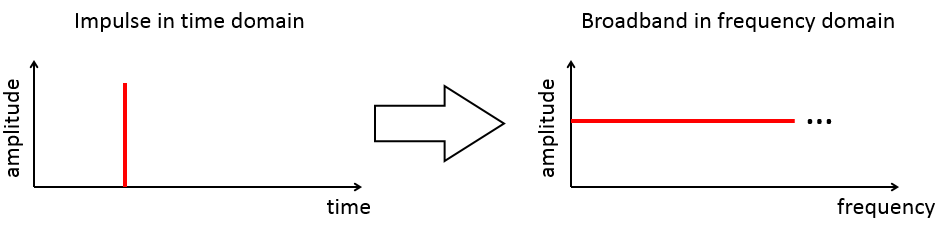

To reduce leakage, a mathematical function called a **window** is applied to the data.
Windows are designed to *reduce the sharp transient* in the re-created signal as much as possible.

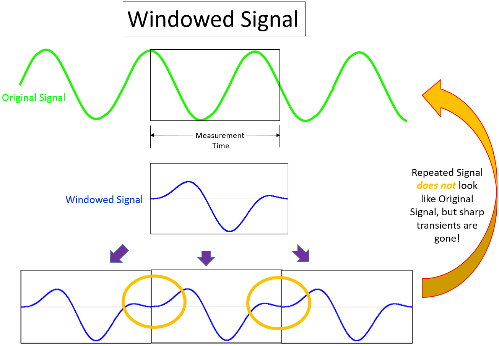

Because the sharp transients are reduced and smoothed, the broadband frequency of the spectral leakage is also reduced.


## Periodic versus Non-Periodic Background

When performing a Fourier Transform on measurement data, a window affects periodic and non-periodic data differently:

- **Periodic (No Window needed)**: A signal captured in a periodic manner does not require a window, and a resulting Fourier Transform has no leakage. Applying a window alters the resulting Fourier transform, and even creates spectral leakage where there would have been no leakage otherwise.

- **Non-periodic (Window needed)**: Windows are used on signals that are captured in a non-periodic manner to reduce spectral leakage and get closer to the periodic results. A window can minimize the leakage present in a non-periodic signal, but cannot eliminate it. 

> The signal is repeated and appended mathematically because the measured data is assumed to be representative of the entire original signal


### Periodic 

When a measurement signal is captured in a periodic manner, the Fourier Transform of the captured signal will have **no leakage** in the frequency domain. 

A window is not recommended for a periodic signal as it will distort the signal in an unnecessary manner, and actually creates spectral leakage.

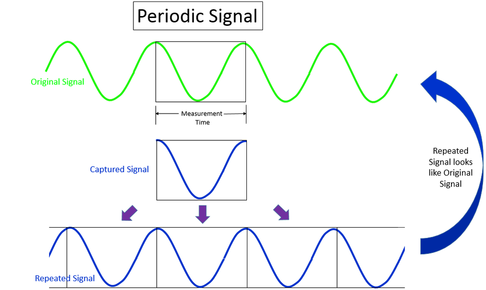


### Non-periodic

The same sine wave, with a different measurement time, results in a non-periodic captured signal. Here, when the captured signal is repeated, the original sine wave signal is not re-created.

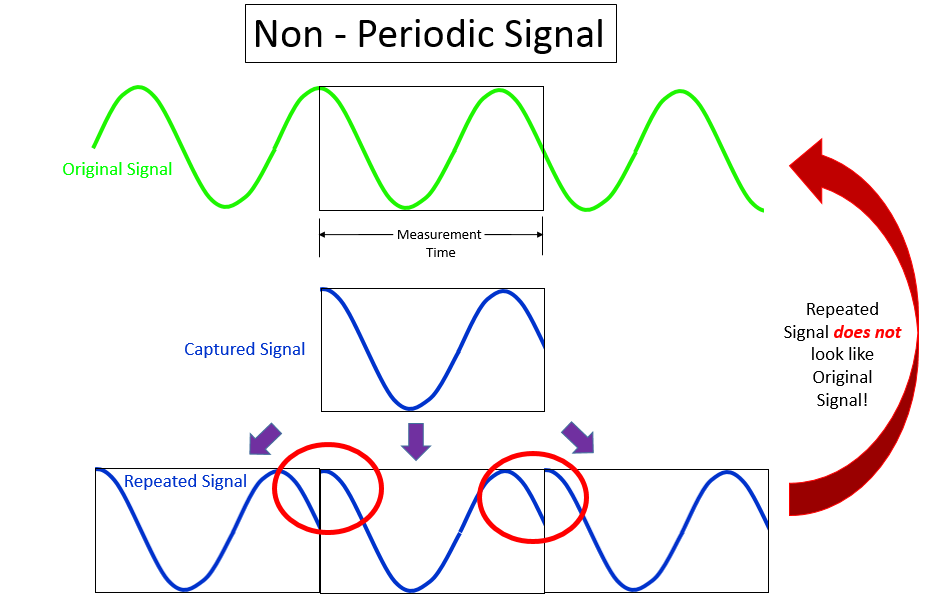

In fact, several broadband transient events (circled in red) are introduced. These transients create a broadband response, or **leakage**.

**Windows** are used to minimize this leakage effect in the frequency domain.

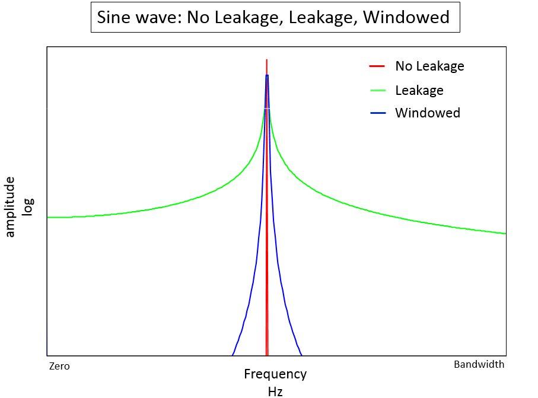


## Hanning

When doing operational noise and vibration measurements, the Hanning window is commonly used.

Random data has spectral leakage due to the *abrupt cutoff* at the beginning and end of the time block. It is *non-periodic*. 

There is **no** way to ensure that the captured random signal is periodic by varying the measurement time. 

**Hanning windows** are often used with random data because they have moderate impact on the frequency resolution and amplitude accuracy of the resulting frequency spectrum.

- The maximum *amplitude error* of a Hanning window is *15%*

  > In the cited article, all spectral data *had an amplitude correction factor applied*.

- while the frequency leakage is typically confined to *1.5 spectral lines* to each side of the original sine wave signal

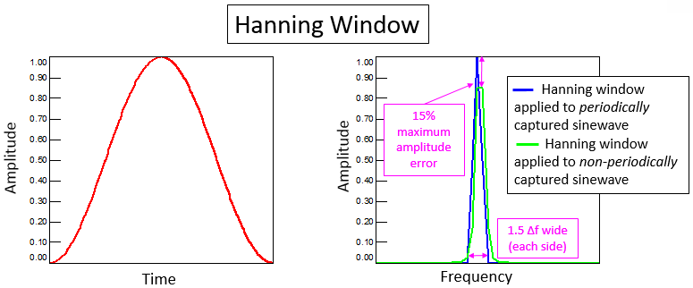


### periodic signal 

Applying the Hanning window (or any window) to a periodic signal creates **leakage**. 

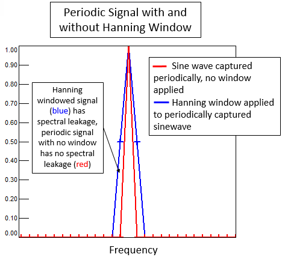

> The *periodically captured* sine wave with the Hanning window (blue) is *wider* in frequency than the original signal (red)

In the figure, the sine wave with the Hanning window (blue) is *wider* in frequency than the original signal (red).


### non-periodic signal

When a Hanning window is applied to a non-periodic signal, the leakage is greatly reduced and the amplitude is higher.

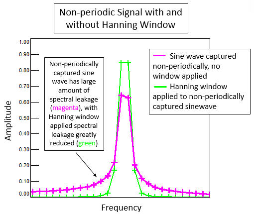

> A *non-periodically captured* sine wave (magenta) has a spectral leakage over the entire bandwidth, applying a Hanning window minimized the leakage (green)


### RMS calculation

A *RMS calculation* **sums up the energy within a frequency range**. 

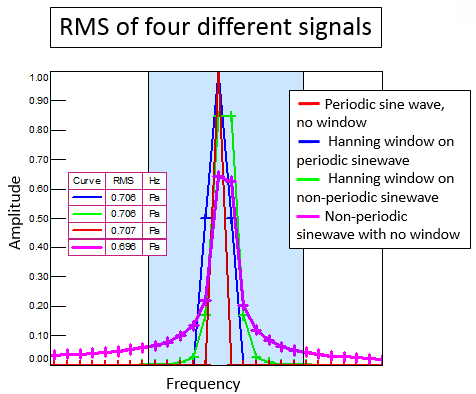

- both the RMS of the periodic and non-periodic signals with a Hanning window are equal to the RMS of the leakage-free sine wave. 

- Only the RMS of the non-periodic sine wave without a window applied is not equal to the others

> With the leakage spread over a smaller frequency range, doing analysis calculations like *RMS* yields more accurate results.


## Flattop

- The Flattop window has a *better amplitude accuracy* in frequency domain compared to the Hanning window,  

  > The maximum amplitude error of a Flattop window is *less than 0.01%*. By contrast, the Hanning window maximum amplitude error is 15%.

- A Flattop window confines leakage to *3.43 spectral lines* to each side of the original signal.


### amplitude errors

These maximum amplitude errors assume that *amplitude correction factors are applied to the frequency spectrums*. These amplitude correction factors compensate for any reduction caused by applying a window.

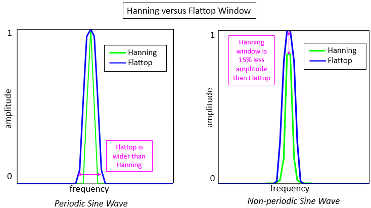


### leakage

The frequency accuracy of the Flattop window is more coarse compared to a Hanning window. As a result, the Flattop window is typically employed on data where frequency peaks are distinct and well separated from each other. 

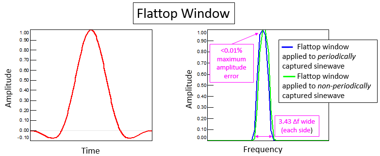


When the frequency peaks are not guaranteed to be well separated, the Hanning window is preferred because it is less likely to cause individual peaks to be lost in the spectrum 

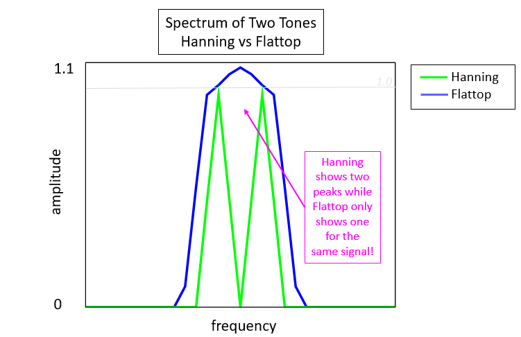

Spectrum of two periodically captured tones that are $4Hz$ apart with a $1Hz$ frequency resolution. The spectrum with a Hanning window (green) shows two peaks while the spectrum with a Flattop window (blue) shows one peak.

> Note that at the original frequencies of the tones the amplitude is correct and equal to one for both windows.


> One common application for a flattop window is performing *calibration*. For example, a sound pistonphone only produces *one single* and *distinct frequency* during microphone calibration.


## Uniform

A Uniform window has a value of *1.0* across the entire measurement time. In reality, a **Uniform window** could be called **no window**. 

> Depending on the data acquisition system used, sometimes the term **Rectangular** window is also used.


- A Uniform window creates no frequency or amplitude distortion when the measured signal is periodic.

- When a measured signal is not periodic, the amplitude is reduced by a maximum of *36%* and the frequency content is spread over the *entire bandwidth of the measurement*.

  > This is due to *sharp transients* that are created by repeating and appending the measured signal.

> Whenever a measurement signal is periodic, a Uniform window is preferred.
>
> Applying a Hanning or Flattop window to a periodic signal will actually create amplitude and frequency distortion.

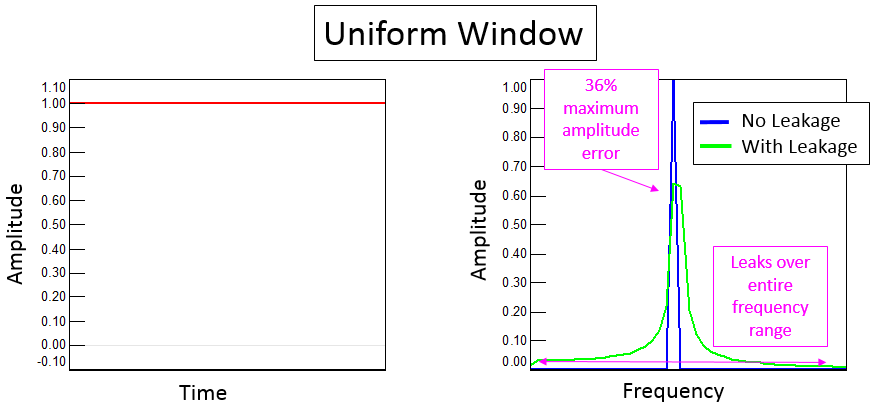


## Benefit of Reducing Leakage

The benefit is **not** that the captured signal is perfectly replicated.

**The main benefit is that the leakage is now confined over a smaller frequency range**, instead of affecting the entire frequency bandwidth of the measurement.

> With the leakage spread over a smaller frequency range, doing analysis calculations like RMS yields more accurate results.

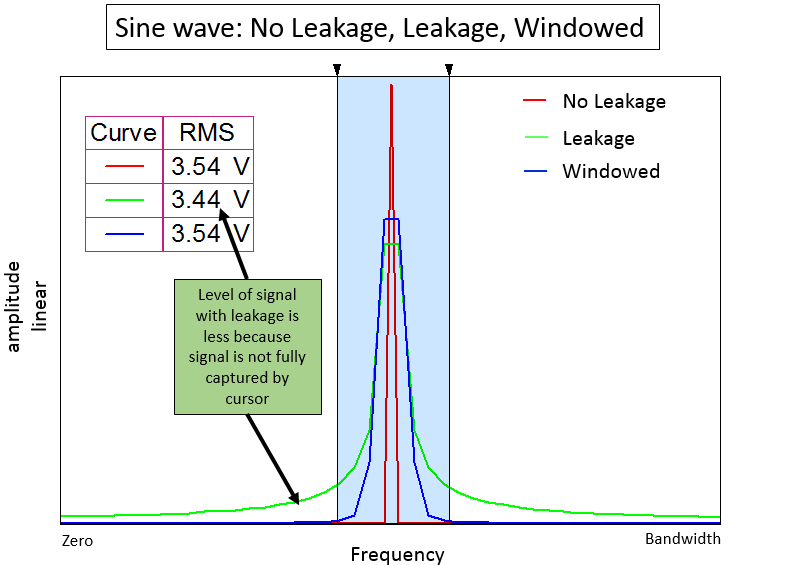

It is impossible to calculate the proper RMS amplitude estimate over a limited frequency range of the *un-windowed sine wave*, since the leakage is *over the full frequency range*. Therefore the RMS amplitude is not correct.


### Two tones

In the case of two closely spaced sine tones, without a window being applied, two tones frequencies would leak into each other, which make determining the true amplitude of individual peaks very difficult.

The window makes it easier to separate and distinguish each tone so a proper analysis could be performed.

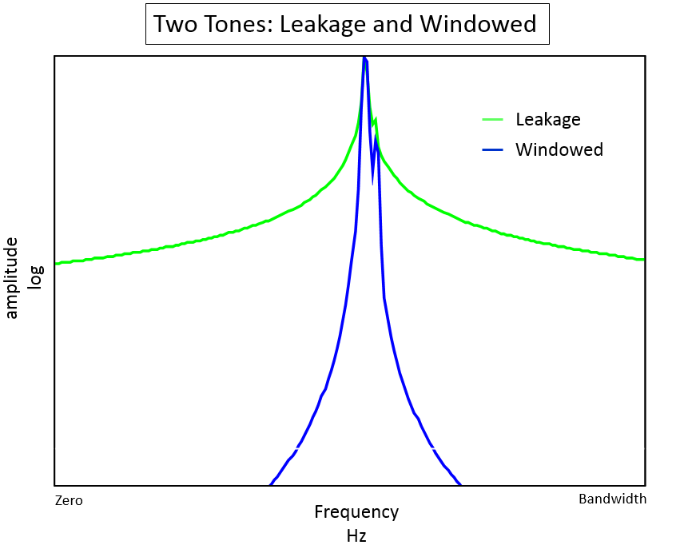


## window function in frequency domain

The transfer function $a(f)$ of a window $w_j, j \in [0, N-1]$ expresses the response of the window to a sinusoidal signal at an offset of $f$ frequency bins, i.e. DFT .

**real part:**
$$
a_r(f)=\sum_{j=0}^{N-1}w_j\cos (2\pi f j/N)
$$

**imaginary part:**
$$
a_i(f)=\sum_{j=0}^{N-1}w_j\sin (2\pi f j/N)
$$

frequency response can be obtained as
$$
a(f) = \frac{\sqrt{a_r^2+a_i^2}}{S_1}
$$
where $S_1 = \sum _{k=0}^{N-1}w_k$

### rectangle window example

> aka. Uniform window, "Rectangular" window, "no window"
>
> Whenever a measurement signal is periodic, a Uniform window is preferred. Applying a Hanning or Flattop window to a periodic signal will actually create amplitude and frequency distortion.

1. When $f=0$

$$
a_r(f) + ja_i(f) = \sum_{k=0}^{N-1}w_k = N
$$

3. When $f \neq 0$

$$\begin{align}
a_r(f) + ja_i(f) &= \sum_{k=0}^{N-1} e^{\frac{j2\pi k f}{N}} \\
&= \sum_{k=0}^{N/2} e^{\frac{j2\pi k f}{N}} + e^{\frac{j2\pi (k+N/2) f}{N}} \\
&= \sum_{k=0}^{N/2} e^{\frac{j2\pi k f}{N}} + e^{j\pi} e^{\frac{j2\pi k f}{N}} \\
&= \sum_{k=0}^{N/2} e^{\frac{j2\pi k f}{N}} - e^{\frac{j2\pi k f}{N}} \\
&= 0
\end{align}$$

> A Uniform window creates no frequency or amplitude distortion when the **measured signal** is **periodic**.
>
> However, if the signal cannot be guaranteed to be periodic, a Uniform window should be avoided.

## Window Properties

There is **no** possibility of trade-off between *main-lobe width* and *sied-lobe amplitude*, since the *window length* is the only variable parameter.

> The rectangular window has the narrowest main lobe for a given length, i.e. $\Delta _{ml}=4\pi/L$
>
> Other windows include the Bartlett, Hann, and Hamming windows. The DTFTs of all these windows have main-lobe width $\Delta _{ml}=8\pi/(L-1)$, which is approximately twice that of the rectangular window, but they have significantly smaller side-lobe amplitudes.


## Demo

```matlab
clc;
clear all;

N = 512;
fs = 40*1e3; % 40kHz
fres = fs/N; % 78.125
tt = (0:N-1)*1/fs;
ff = (0:N/2)*fres;
fin = 390.625;

whan = hanning(N); % hanning window
wrect = rectwin(N); % rect window


% fin/fs = 5/N, periodically captured sine wave
wv = cos(2*pi*fin*tt);
power = periodogram(wv, whan, N, fs, 'power');
X = (power).^0.5*2^0.5;
psd = periodogram(wv, whan, N, fs, 'psd');
rms = sum(psd*fres)^0.5;
fprintf('RMS@periodic & hanning: %.5f\n', rms);

power_rect = periodogram(wv, wrect, N, fs, 'power');
X_rect = (power_rect).^0.5*2^0.5;
psd_rect = periodogram(wv, wrect, N, fs, 'psd');
rms_rect = sum(psd_rect*fres)^0.5;
fprintf('RMS@periodic & rect: %.5f\n', rms_rect);


figure(1)
plot(ff, X, 'r-o', ff, X_rect, 'b-s');
xlabel('Frequency(Hz)');
ylabel('|X|')
title('Amplitude spectrum of periodically captured sine wave');
legend('w/ hanning', 'w/ rect');
grid on
grid minor
% rectangular window provide higher frequency resolution
% hanning window induce leakage for the periodically captured sine wave


% fin - 0.5fres
fin_lkg0d5 = fin - 0.5*fres;
wv_lkg0d5 = cos(2*pi*fin_lkg0d5*tt);
power_lkg0d5 = periodogram(wv_lkg0d5, whan, N, fs, 'power');
X_lkg0d5 = (power_lkg0d5).^0.5*2^0.5;
psd_lkg0d5 = periodogram(wv_lkg0d5, whan, N, fs, 'psd');
rms_lkg0d5 = sum(psd_lkg0d5*fres)^0.5;
fprintf('RMS@-0.5fres & hanning: %.5f\n', rms_lkg0d5);

power_lkg0d5_rect = periodogram(wv_lkg0d5, wrect, N, fs, 'power');
X_lkg0d5_rect = (power_lkg0d5_rect).^0.5*2^0.5;
psd_lkg0d5_rect = periodogram(wv_lkg0d5, wrect, N, fs, 'psd');
rms_lkg0d5_rect = sum(psd_lkg0d5_rect*fres)^0.5;
fprintf('RMS@-0.5fres & rect: %.5f\n', rms_lkg0d5_rect);

figure(2)
plot(ff, X_lkg0d5, 'r-o', ff, X_lkg0d5_rect, 'b-s');
xlabel('Frequency(Hz)');
ylabel('|X|')
title('Amplitude spectrum of -0.5fres');
legend('w/ hanning', 'w/ rect');
grid on
grid minor
% hanning reduce leakage and max amplitude error 15%


% fin - 0.25fres
fin_lkg0d25 = fin - 0.25*fres;
wv_lkg0d25 = cos(2*pi*fin_lkg0d25*tt);
power_lkg0d25 = periodogram(wv_lkg0d25, whan, N, fs, 'power');
X_lkg0d25 = (power_lkg0d25).^0.5*2^0.5;
psd_lkg0d25 = periodogram(wv_lkg0d25, whan, N, fs, 'psd');
rms_lkg0d25 = sum(psd_lkg0d25*fres)^0.5;
fprintf('RMS@-0.25fres & hanning: %.5f\n', rms_lkg0d25);

power_lkg0d25_rect = periodogram(wv_lkg0d25, wrect, N, fs, 'power');
X_lkg0d25_rect = (power_lkg0d25_rect).^0.5*2^0.5;
psd_lkg0d25_rect = periodogram(wv_lkg0d25, wrect, N, fs, 'psd');
rms_lkg0d25_rect = sum(psd_lkg0d25_rect*fres)^0.5;
fprintf('RMS@-0.25fres & rect: %.5f\n', rms_lkg0d25_rect);

figure(3)
plot(ff, X_lkg0d25, 'r-o', ff, X_lkg0d25_rect, 'b-s');
xlabel('Frequency(Hz)');
ylabel('|X|')
title('Amplitude spectrum of -0.25fres');
legend('w/ hanning', 'w/ rect');
grid on
grid minor
% hanning reduce leakage
```

output

```
RMS@periodic & hanning: 0.70711
RMS@periodic & rect: 0.70711
RMS@-0.5fres & hanning: 0.70711
RMS@-0.5fres & rect: 0.70711
RMS@-0.25fres & hanning: 0.70711
RMS@-0.25fres & rect: 0.70780
```


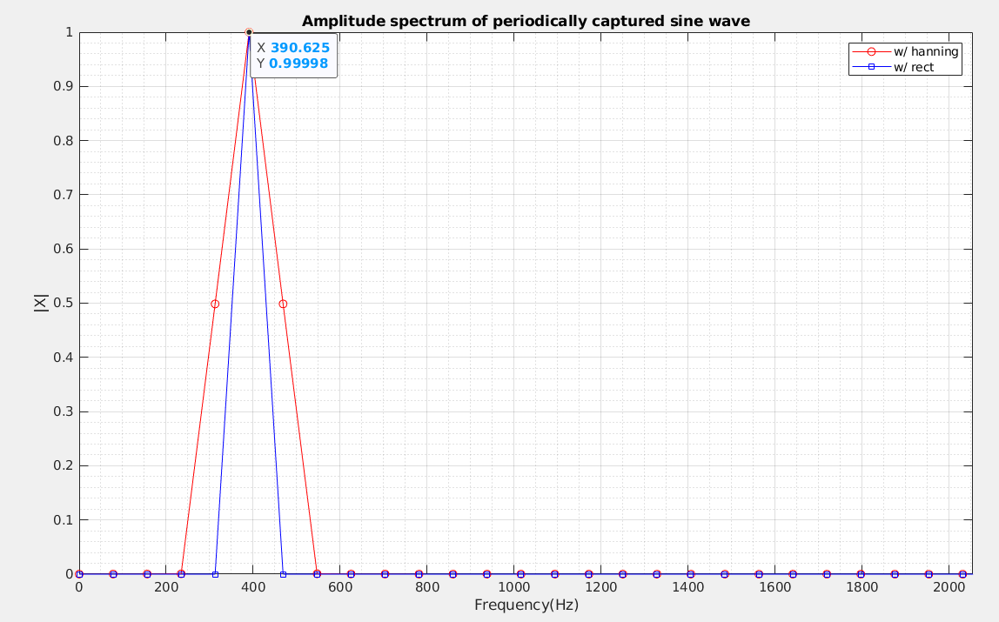

> rectangular window provide higher frequency resolution


> hanning reduce leakage and max amplitude error 15%


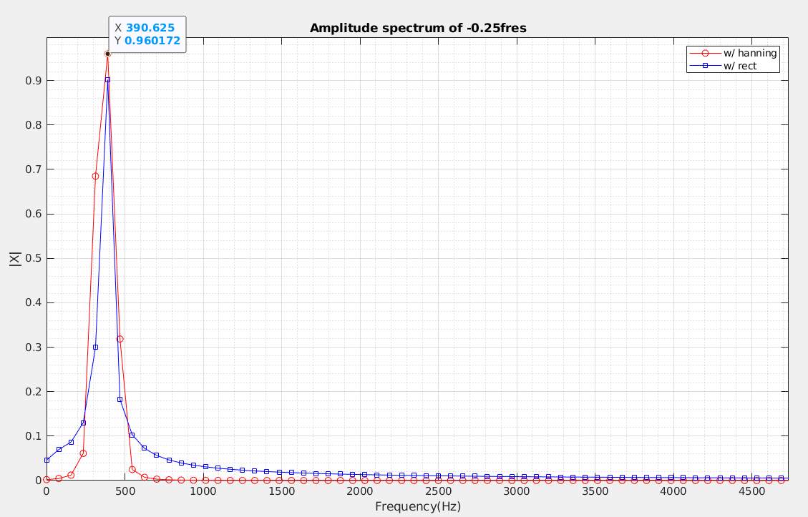

> hanning reduce leakage and reduce amplitude error


## reference

Windows and Spectral Leakage. URL:[https://community.sw.siemens.com/s/article/windows-and-spectral-leakage](https://community.sw.siemens.com/s/article/windows-and-spectral-leakage)

Article (20416822) Title: How to Utilize a Windowing Technique for Accurate DFT
URL: [https://support.cadence.com/apex/ArticleAttachmentPortal?id=a1Od000000050UrEAI](https://support.cadence.com/apex/ArticleAttachmentPortal?id=a1Od000000050UrEAI)

B.P. Lathi, Roger Green. Linear Systems and Signals (The Oxford Series in Electrical and Computer Engineering) 3rd Edition

Window Types: Hanning, Flattop, Uniform, Tukey, and Exponential URL:[https://community.sw.siemens.com/s/article/window-types-hanning-flattop-uniform-tukey-and-exponential](https://community.sw.siemens.com/s/article/window-types-hanning-flattop-uniform-tukey-and-exponential)

Window Correction Factors URL:[https://community.sw.siemens.com/s/article/window-correction-factors](https://community.sw.siemens.com/s/article/window-correction-factors)

Root Mean Square (RMS) and Overall Level. URL:[https://community.sw.siemens.com/s/article/root-mean-square-rms-and-overall-level](https://community.sw.siemens.com/s/article/root-mean-square-rms-and-overall-level)

Alan V Oppenheim, Ronald W. Schafer. Discrete-Time Signal Processing, 3rd edition

Stefan Scholl, "Exact Signal Measurements using FFT Analysis",Microelectronic Systems Design Research Group, TU Kaiserslautern, Germany. [ [pdf](https://kluedo.ub.rptu.de/frontdoor/deliver/index/docId/4293/file/exact_fft_measurements.pdf) ]

Harris, F. (1978). On the use of windows for harmonic analysis with the discrete Fourier transform. Proceedings of the IEEE, 66, 51-83. [[pdf](https://www.fceia.unr.edu.ar/prodivoz/Harris_1978.pdf)]

Equivalent noise bandwidth (ENBW) of window functions URL:[https://www.gaussianwaves.com/2020/09/equivalent-noise-bandwidth-enbw-of-window-functions/](https://www.gaussianwaves.com/2020/09/equivalent-noise-bandwidth-enbw-of-window-functions/)

Why should I zero-pad a signal before taking the Fourier transform? URL:[https://dsp.stackexchange.com/q/741](https://dsp.stackexchange.com/q/741)

enbw function in MATLAB URL:[https://www.mathworks.com/help/signal/ref/enbw.html](https://www.mathworks.com/help/signal/ref/enbw.html)

Window function – figure of merits URL:[https://www.gaussianwaves.com/2020/09/window-function-figure-of-merits/](https://www.gaussianwaves.com/2020/09/window-function-figure-of-merits/)

Memos on FFT With Windowing URL:[https://everynanocounts.com/2018/02/01/memos-on-fft-with-windowing/](https://everynanocounts.com/2018/02/01/memos-on-fft-with-windowing/)

Jens Ahrens, "Some Notes on Windows in Spectral Analysis," Tech. Report, Chalmers Univeristy of Technology, 2020. URL:[https://appliedacousticschalmers.github.io/scaling-of-the-dft/notes_on_windows/](https://appliedacousticschalmers.github.io/scaling-of-the-dft/notes_on_windows/)
