## Bandpass Modulation

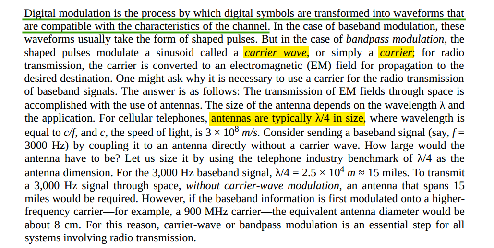


## Pulse Amplitude Modulation (PAM)

> David A. Johns, ECE1392H - Integrated Circuits for Digital Communications - Fall 2001 [[System Overview](https://www.eecg.utoronto.ca/~johns/ece1392/slides/system.pdf)]


> $S_m$ Google AI mode [[https://share.google/aimode/BzYr2logpVTVs83LQ](https://share.google/aimode/BzYr2logpVTVs83LQ)]

```matlab
snr_mpam = @(m,simga) 10*log10((4^m-1)/simga^2/3);

sigma = 0.1547;

SNR_m2 = snr_mpam(2, sigma);  % 23.1999
SNR_m3 = snr_mpam(3, sigma);  % 29.4324
```

---

> Lecture 3, Tuesday January 13th 2026 - Modulation Types (PAM/QAM) [[https://cioffi-group.stanford.edu/ee379a/Lectures/L3.pdf](https://cioffi-group.stanford.edu/ee379a/Lectures/L3.pdf)]


---


## Carrier & Symbol Synchronization

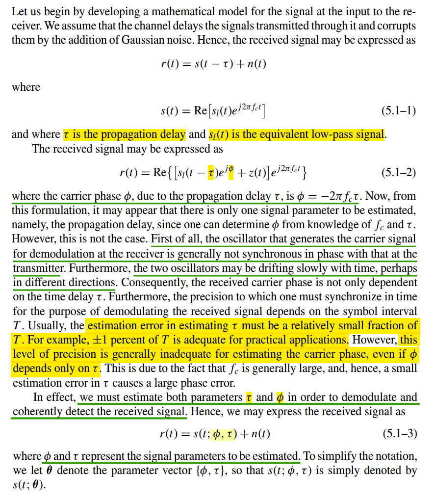

$\Delta\tau \lt \pm \frac{1}{100} T$ don't ensure $\Delta \phi \ll 2\pi$ due to $T \gg \frac{1}{f_c}$

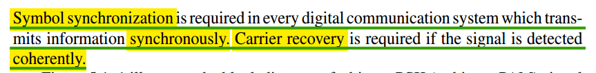

### Carrier Synchronization


---

> [[https://ndl.ethernet.edu.et/bitstream/123456789/87843/14/LECT_13%2614.Synchronization.pdf](https://ndl.ethernet.edu.et/bitstream/123456789/87843/14/LECT_13%2614.Synchronization.pdf)]


### Symbol Synchronization

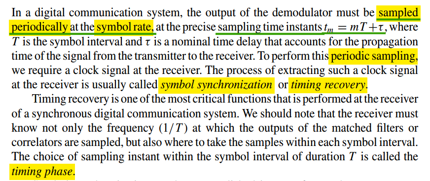

> [[https://www.ieee802.org/3/dm/public/1125/cordaro_3dm_01_1125.pdf](https://www.ieee802.org/3/dm/public/1125/cordaro_3dm_01_1125.pdf)]

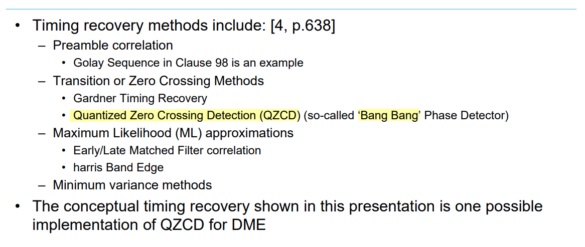

---

> Mathuranathan, Symbol Timing Recovery for QPSK (digital modulations) [[https://www.gaussianwaves.com/2013/11/symbol-timing-recovery-for-qpsk-digital-modulations/](https://www.gaussianwaves.com/2013/11/symbol-timing-recovery-for-qpsk-digital-modulations/)]
>
> Qasim Chaudhari. Early-Late Bit Synchronizer in Digital Communication [[https://wirelesspi.com/early-late-bit-synchronizer-in-digital-communication/](https://wirelesspi.com/early-late-bit-synchronizer-in-digital-communication/)]
>
> Igor Freire. Symbol Timing Synchronization: A Tutorial [[blog](https://igorfreire.com.br/2016/10/15/symbol-timing-synchronization-tutorial/#Zero-crossing_Timing_Error_Detector_ZC-TED), [code](https://github.com/igorauad/symbol_timing_sync)]

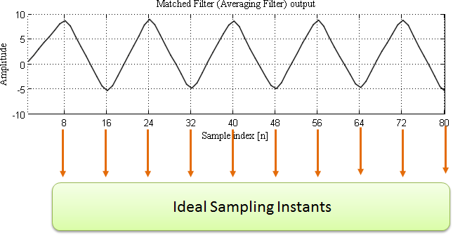

But the problem here is: "How does the receiver know the ideal sampling instants?". The solution is "someone has to supply those **ideal sampling instants**". A **symbol time recovery** circuit is used for this purpose.

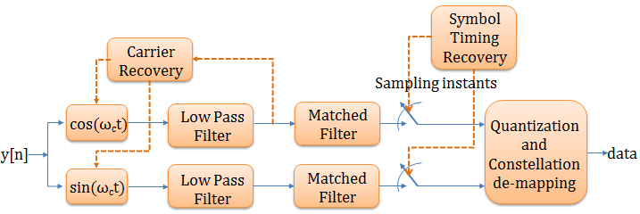

***Early/Late Symbol Recovery algorithm***

- **non-decision-directed timing estimator** exploits the **symmetry properties of the signal**

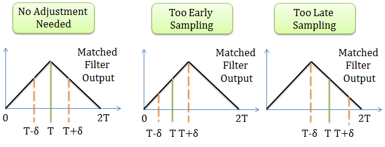

1) If the ***Early Sample = Late Sample*** : The peak occurs at the on-time sampling instant $T$. No adjustment in the timing is needed.
2) If ***|Early Sample| > |Late Sample|*** : Late timing, the sampling time is offset so that the next symbol is sampled $T-\delta/2$ seconds after the current sampling time.
3) If ***|Early Sample| < |Late Sample|*** : Early timing, the sampling time is offset so that the next symbol is sampled $T+\delta/2$ seconds after the current sampling time.

---

***Mueller and Muller Timing Synchronization Algorithm***

> Qasim Chaudhari. Mueller and Muller Timing Synchronization Algorithm [[https://wirelesspi.com/mueller-and-muller-timing-synchronization-algorithm/](https://wirelesspi.com/mueller-and-muller-timing-synchronization-algorithm/)]

*TODO* &#128197;


---

> David Johns. ECE1392H - Integrated Circuits for Digital Communications - Fall 2001: [[Timing Recovery](https://www.eecg.utoronto.ca/~johns/ece1392/slides/timing.pdf)]

***Dither in Quantized Zero Crossing Detection (QZCD) (so-called 'Bang Bang' Phase Detector)***


## Intersymbol Interference (ISI)

> L.W. Couch, *Digital and Analog Communication* *Systems*, 8th Edition, Pearson, 2013. [[pdf](https://rizkia.staff.telkomuniversity.ac.id/files/2016/02/Digital-and-Analog-Communication-Systems-Leon-W.-Couch.pdf)]

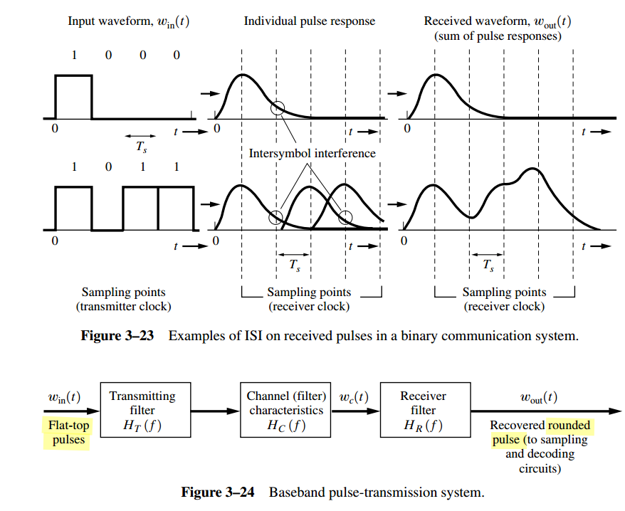

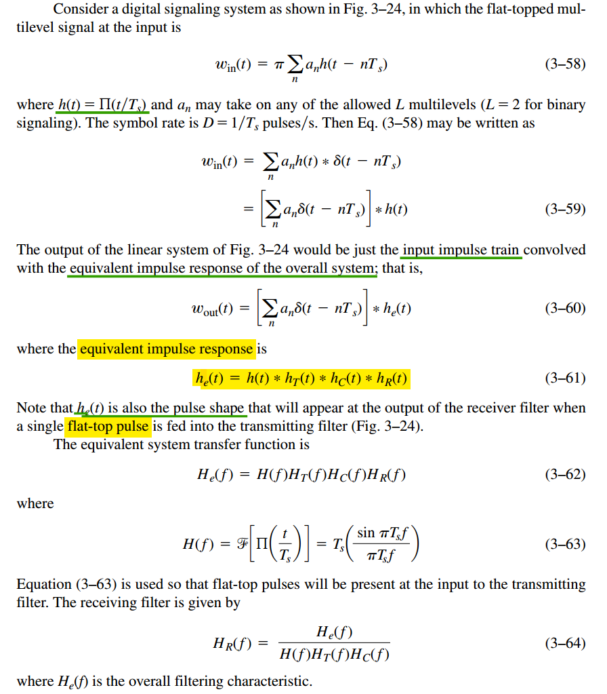

Nyquist discovered three different methods for pulse shaping that could be used to eliminate ISI

- **Nyquist's First Method (Zero ISI)**: physically unrealizable (i.e., the impulse response would be noncausal and of infinite duration), inaccurate sync will cause ISI

  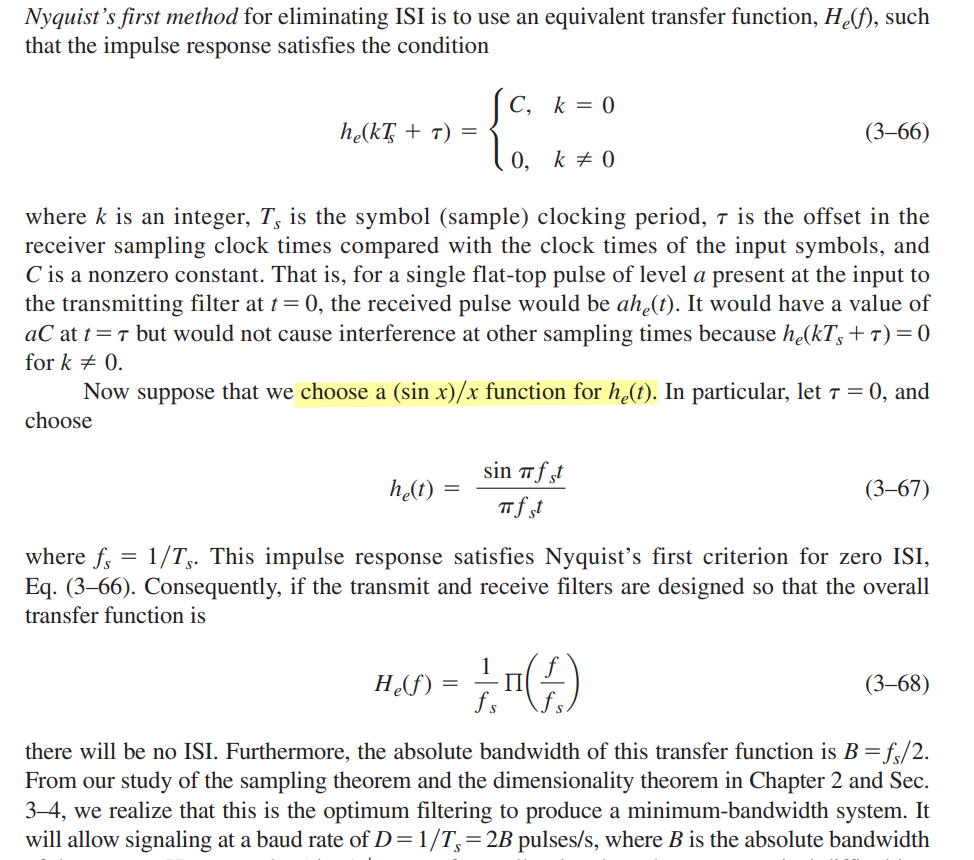

- **Nyquist's second method**: allows some ISI to be introduced in a controlled way

- **Nyquist's third method**: area under the $h_e(t)$ pulse within the desired symbol interval, $T_s$, is not zero, but the areas under $h_e(t)$ in adjacent symbol intervals are zero


## Nyquist Criterion & Pulses

> David A. Johns, ECE1392H - Integrated Circuits for Digital Communications - Fall 2001 [[System Overview](https://www.eecg.utoronto.ca/~johns/ece1392/slides/system.pdf)]

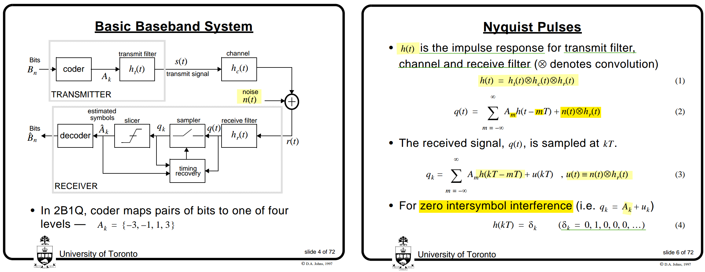

> 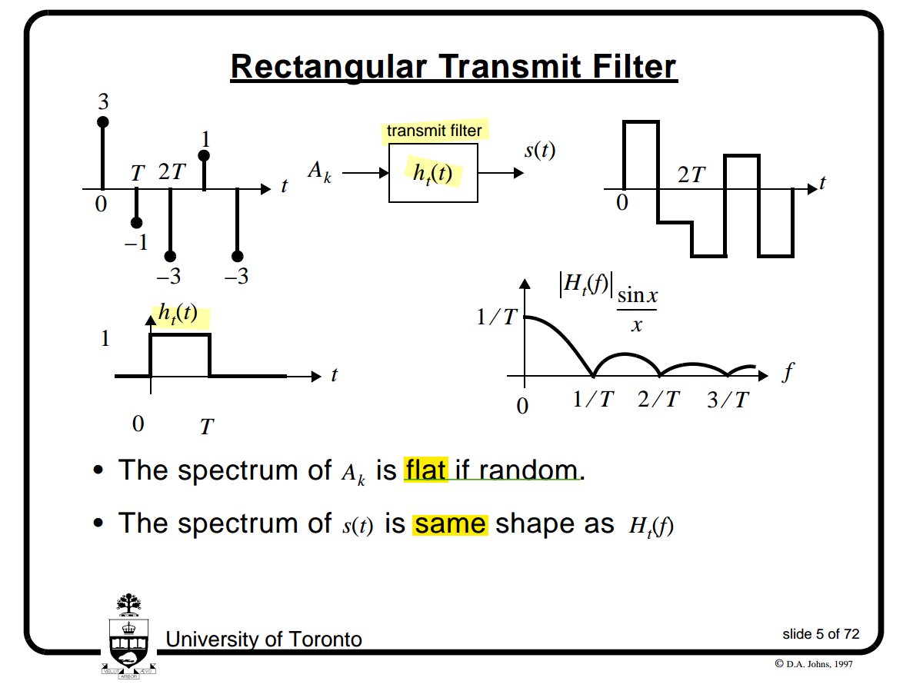

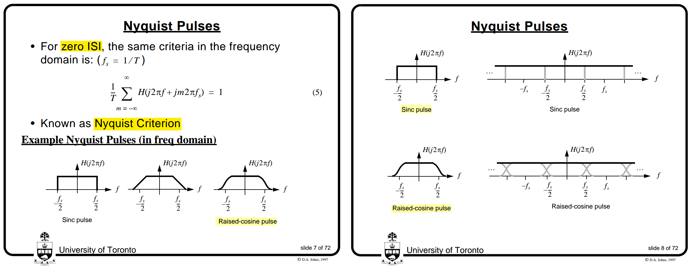


## Matched-Filter (MF)

> David A. Johns, ECE1392H - Integrated Circuits for Digital Communications - Fall 2001 [[System Overview](https://www.eecg.utoronto.ca/~johns/ece1392/slides/system.pdf)]

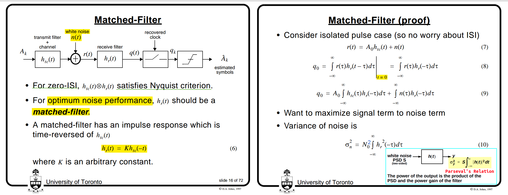

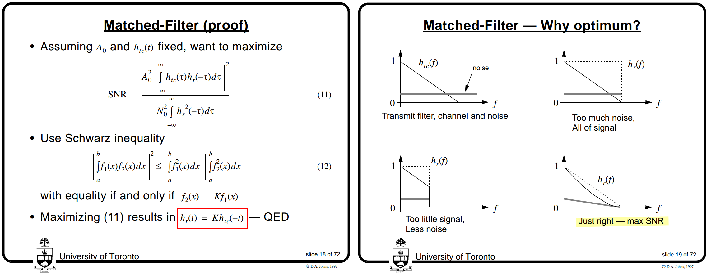

---

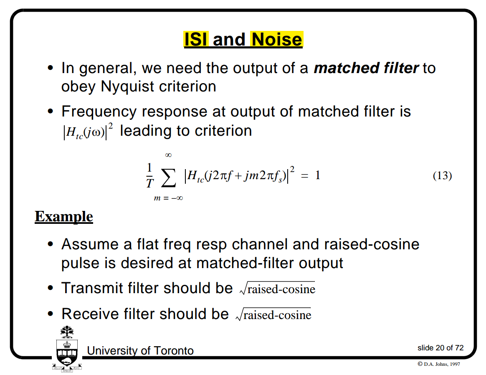


## Noise Enhancement in Linear Equalizers

> John M. Cioffi, Lecture 13, Thursday February 19th 2026 - Intersymbol Interference, MMSE, and SNR [[https://cioffi-group.stanford.edu/ee379a/Lectures/L13.pdf](https://cioffi-group.stanford.edu/ee379a/Lectures/L13.pdf)]
>
> —, Lecture 14, Tuesday February 24th 2026 - Linear Equalizers [[https://cioffi-group.stanford.edu/ee379a/Lectures/L14.pdf](https://cioffi-group.stanford.edu/ee379a/Lectures/L14.pdf)]

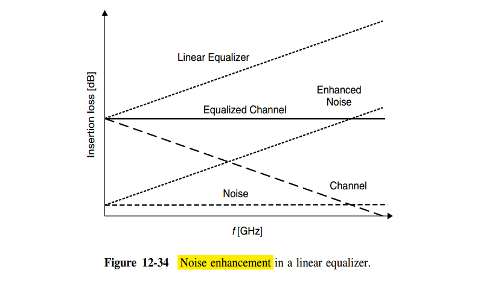

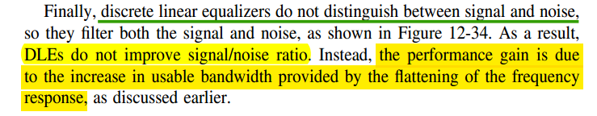

> ***Shannon–Hartley theorem***
>
> 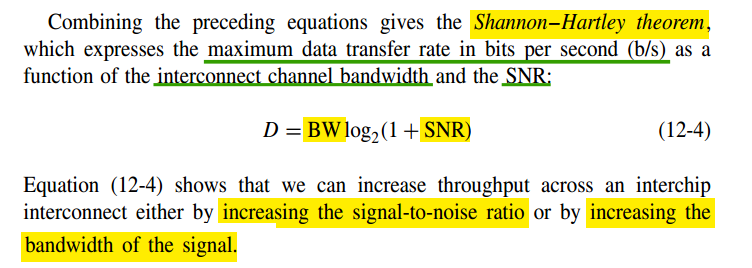

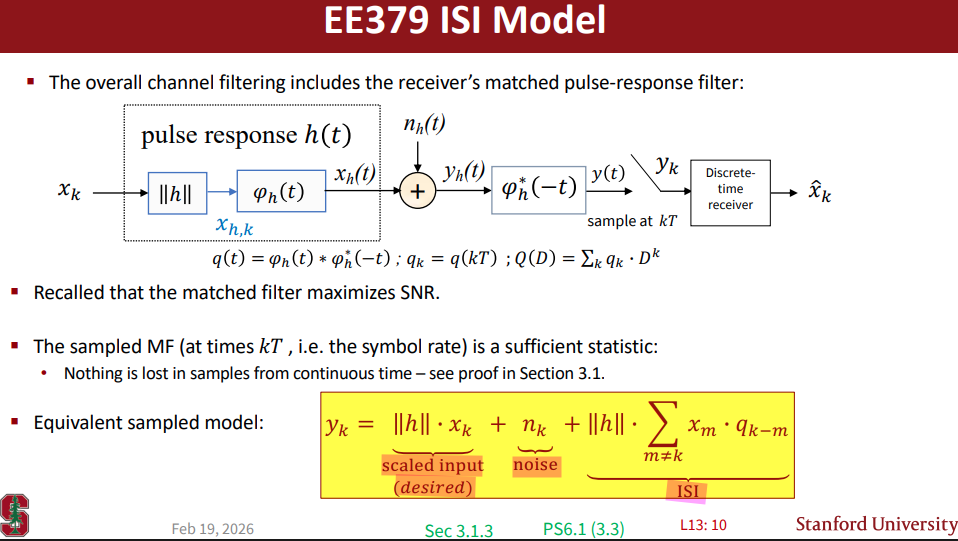


---

> David A. Johns, ECE1392H - Integrated Circuits for Digital Communications - Fall 2001 [[Introduction](https://www.eecg.utoronto.ca/~johns/ece1392/slides/intro.pdf)]

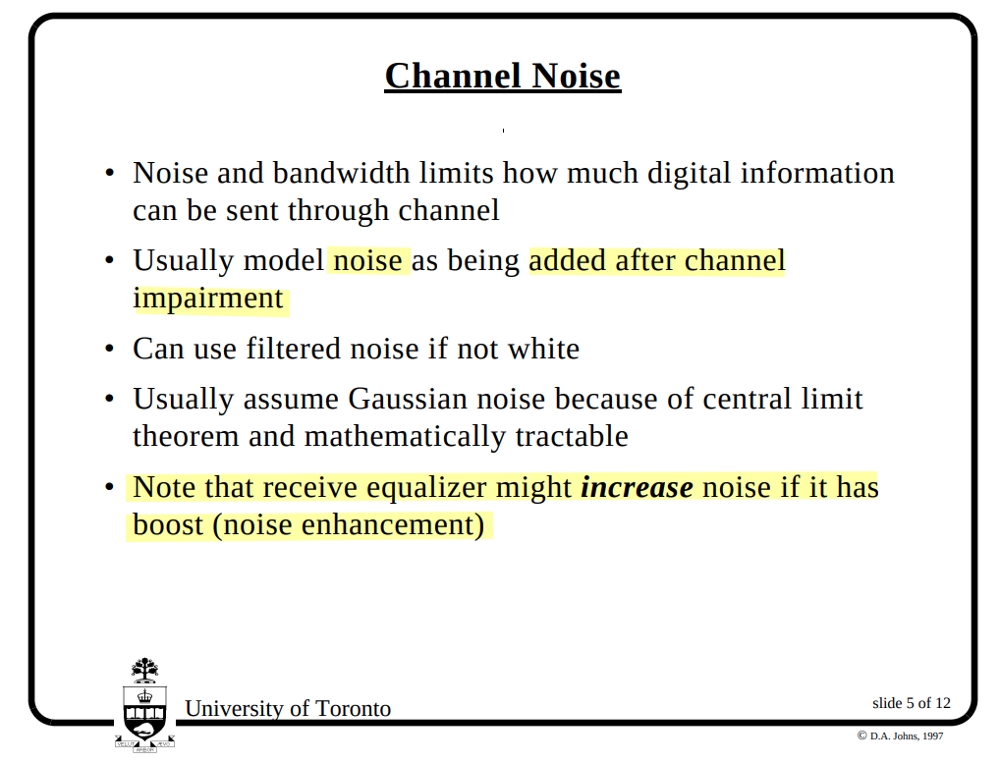

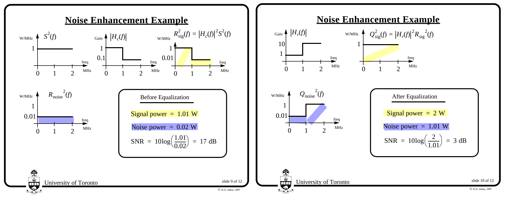


## reference

Proakis, John G., and Masoud Salehi. *Digital Communications. 5th ed. McGraw-Hill, 2008.* [[pdf](https://daskalakispiros.com/files/Ebooks/digital-communication-proakis-salehi-5th-edition.pdf)]

Sklar, Bernard. *Digital communications: fundamentals and applications*. Pearson, 2021.

Ling, F. (2017). *Synchronization in Digital Communication Systems*. Cambridge: Cambridge University Press.

Barry, John R., Edward A. Lee, and David G. Messerschmitt. *Digital communication*. Springer, 2003.

Qasim Chaudhari, *Wireless Communications From the Ground Up – An SDR Perspective*

John M. Cioffi, [[Chapter 3 - Equalization](https://cioffi-group.stanford.edu/doc/book/chap3.pdf)], [[Chapter 6 - Fundamentals of Synchronization](https://cioffi-group.stanford.edu/doc/book/chap6.pdf)]

Sen M. Kuo. Real-Time Digital Signal Processing: Fundamentals, Implementations and Applications, 3rd Edition. John Wiley & Sons 2013

Stankovic, Ljubisa. (2015). Digital Signal Processing with Selected Topics. 

---

Paulo S. R. Diniz, A*daptive Filtering: Algorithms and Practical Implementation, 5th edition* [[pdf](https://picture.iczhiku.com/resource/eetop/WYiRoZIFhjsRrXmN.pdf)], [[matlab](http://www.mathworks.com/matlabcentral/fileexchange/135266-adaptive_filtering_toolbox_v5a)], [[python](https://github.com/BruninLima/PydaptiveFiltering)]

B. Farhang-Boroujeny (2013), *Adaptive Filters: Theory and Applications* (2nd ed.). John Wiley & Sons, Inc.

Simon O. Haykin (2014), "Adaptive Filter Theory" Prentice-Hall, Inc. 5rd edition

---

A. Chan Carusone and D. A. Johns, "Analog Filter Adaptation Using a Dithered Linear Search Algorithm," *IEEE Int. Symp. Circuits and Syst.*, May 2002. [[PDF](http://www.eecg.utoronto.ca/~tcc/iscas_02a.pdf)], [[Slides]](http://www.eecg.utoronto.ca/~tcc/iscas_02a_slides.pdf)

—, Ph. D. Thesis, "Digital Algorithms for Analog Adaptive Filters", Feb. 2002. [[http://www.eecg.utoronto.ca/~tcc/thesis.pdf]](http://www.eecg.utoronto.ca/~tcc/thesis.pdf)

—, "Analog Adaptive Filters," tutorial at the *IEEE Int. Symp. Circuits and Syst.*, Bangkok, Thailand, May 2003. [[http://www.eecg.utoronto.ca/~tcc/iscas03_tutorial.pdf](http://www.eecg.utoronto.ca/~tcc/iscas03_tutorial.pdf)]

—, 2022 Optimization Tools for Future Wireline Transceivers [[https://www.ieeetoronto.ca/wp-content/uploads/2022/12/UofT-Future-of-Wireline-Workshop-2022.pdf](https://www.ieeetoronto.ca/wp-content/uploads/2022/12/UofT-Future-of-Wireline-Workshop-2022.pdf)]

David Johns, "Integrated Circuits for Digital Communications" [[https://www.eecg.toronto.edu/~johns/nobots/courses/ece1392/slides.pdf](https://www.eecg.toronto.edu/~johns/nobots/courses/ece1392/slides.pdf)]

---

Chris Li, *mmse_dfe* [[https://github.com/ChrisZonghaoLi/mmse_dfe](https://github.com/ChrisZonghaoLi/mmse_dfe)]

ScottXjw, *equalizer-code-FFE-DFE-VolterraFFEandDFE* [[https://github.com/ScottXjw/equalizer-code-FFE-DFE-VolterraFFEandDFE](https://github.com/ScottXjw/equalizer-code-FFE-DFE-VolterraFFEandDFE)]

---

Qasim Chaudhari. Maximum Likelihood Estimation of Clock Offset [[https://wirelesspi.com/maximum-likelihood-estimation-of-clock-offset/](https://wirelesspi.com/maximum-likelihood-estimation-of-clock-offset/)]

—. Channel Estimation in Wireless Communication. [[https://wirelesspi.com/channel-estimation-in-wireless-communication/](https://wirelesspi.com/channel-estimation-in-wireless-communication/)]

—. Phase Locked Loop (PLL) in a Software Defined Radio (SDR) [[https://wirelesspi.com/phase-locked-loop-pll-in-a-software-defined-radio-sdr/](https://wirelesspi.com/phase-locked-loop-pll-in-a-software-defined-radio-sdr/)]

—. Phase Locked Loop (PLL) for Symbol Timing Recovery [[https://wirelesspi.com/phase-locked-loop-pll-for-symbol-timing-recovery/](https://wirelesspi.com/phase-locked-loop-pll-for-symbol-timing-recovery/)]

—. How Decision Feedback Equalizers (DFE) Work [[https://wirelesspi.com/how-decision-feedback-equalizers-dfe-work/](https://wirelesspi.com/how-decision-feedback-equalizers-dfe-work/)]

—. Maximum Likelihood Sequence Estimation (MLSE Equalizer) [[https://wirelesspi.com/maximum-likelihood-sequence-estimation-mlse-equalizer/](https://wirelesspi.com/maximum-likelihood-sequence-estimation-mlse-equalizer/)]

—. Gardner Timing Error Detector: A Non-Data-Aided Version of Zero-Crossing Timing Error Detectors [[https://wirelesspi.com/gardner-timing-error-detector-a-non-data-aided-version-of-zero-crossing-timing-error-detectors/](https://wirelesspi.com/gardner-timing-error-detector-a-non-data-aided-version-of-zero-crossing-timing-error-detectors/)]

—. Digital Filter and Square Timing Recovery [[https://wirelesspi.com/digital-filter-and-square-timing-recovery/](https://wirelesspi.com/digital-filter-and-square-timing-recovery/)]

—. What is a Symbol Timing Offset and How It Distorts the Rx Signal [[https://wirelesspi.com/what-is-a-symbol-timing-offset-and-how-it-distorts-the-rx-signal/](https://wirelesspi.com/what-is-a-symbol-timing-offset-and-how-it-distorts-the-rx-signal/)]

—. How Excess Bandwidth Governs Timing Recovery in Digital Communication Systems [[https://wirelesspi.com/how-excess-bandwidth-governs-timing-recovery-in-digital-communication-systems/](https://wirelesspi.com/how-excess-bandwidth-governs-timing-recovery-in-digital-communication-systems/)]

—. How Automatic Gain Control (AGC) Works [[https://wirelesspi.com/how-automatic-gain-control-agc-works/](https://wirelesspi.com/how-automatic-gain-control-agc-works/)]

