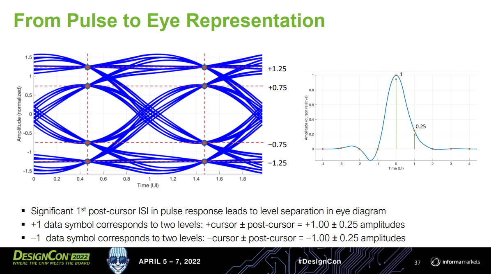

> 32 to 56 Gbps Serial Link Analysis and Optimization Methods for Pathological Channels [[https://docs.keysight.com/eesofapps/files/678068240/678068273/1/1629077956000/tutorial-32-to-56-gbps-serial-link-analysis-optimization-methods-pathological-channels.pdf](https://docs.keysight.com/eesofapps/files/678068240/678068273/1/1629077956000/tutorial-32-to-56-gbps-serial-link-analysis-optimization-methods-pathological-channels.pdf)]


## Feedforward Equalizer

> Jose E. Schutt-Aine, Spring 2024 ECE 546 Lecture - 27 Equalization [[http://emlab.uiuc.edu/ece546/Lect_27.pdf](http://emlab.uiuc.edu/ece546/Lect_27.pdf)]
>
> Sam Palermo. Lecture 7 - Equalization Intro & TX FIR EQ [[https://people.engr.tamu.edu/spalermo/ecen689/lecture7_ee720_eq_intro_txeq.pdf](https://people.engr.tamu.edu/spalermo/ecen689/lecture7_ee720_eq_intro_txeq.pdf)]
>
> David Johns. ECE1392H - Integrated Circuits for Digital Communications - Fall 2001: Equalization [[https://www.eecg.utoronto.ca/~johns/ece1392/slides/equalization.pdf](https://www.eecg.utoronto.ca/~johns/ece1392/slides/equalization.pdf)]
>
> Vivek Telang, Equalization for High-Speed Serdes: System-level Comparison of Analog and Digital Techniques 2012 [[https://ewh.ieee.org/r5/denver/sscs/Presentations/2012_08_Telang.pdf](https://ewh.ieee.org/r5/denver/sscs/Presentations/2012_08_Telang.pdf)]
>
> Kevin Zheng, Boris Murmann, Hongtao Zhang, and Geoff Zhang. Feedforward Equalizer Location Study for High-Speed Serial Systems [[https://www.signalintegrityjournal.com/articles/1228-feedforward-equalizer-location-study-for-high-speed-serial-systems](https://www.signalintegrityjournal.com/articles/1228-feedforward-equalizer-location-study-for-high-speed-serial-systems)]
>
> —, “System-Driven Circuit Design for ADC-Based Wireline Data Links”, Ph.D. Dissertation,
> Stanford University, 2018 [[https://purl.stanford.edu/hw458fp0168](https://purl.stanford.edu/hw458fp0168)]
>
> Hanumolu, P. K., Wei, G. Y., & Moon, Y. K. (2005). Equalizers for high-speed serial links. *International Journal of High Speed Electronics and Systems* [[https://people.engr.tamu.edu/spalermo/ecen689/hslink_eq_overview_hanumolu_jhses05.pdf](https://people.engr.tamu.edu/spalermo/ecen689/hslink_eq_overview_hanumolu_jhses05.pdf)]
>
> Gain Kim. Equalization, Architecture, and Circuit Design for High-Speed Serial Link Receiver [[pdf](https://www.theise.org/wp-content/uploads/2023/10/Analog_1_%EA%B9%80%EA%B0%80%EC%9D%B8%EA%B5%90%EC%88%98%EB%8B%98_DGIST_LectureNote-Min-Jae-Seo.pdf)]


### TX FIR Coefficient Selection with MMSE

> Lecture 7: Equalization Introduction & TX FIR Eq [[https://people.engr.tamu.edu/spalermo/ecen689/lecture7_ee720_eq_intro_txeq.pdf](https://people.engr.tamu.edu/spalermo/ecen689/lecture7_ee720_eq_intro_txeq.pdf)]


---

***Lone-Pulse Equalization***


```matlab
h=[0.004, 0.0010, 0.0023, 0.0052, 0.0812, 0.3437, 0.1775, 0.0917, 0.0526,...
    0.0360, 0.0224, 0.0162, 0.0152, 0.0097, 0.0090, 0.0067];
k = length(h);
n = 3;
l = 1;
m2 = 5;
m1 = 1;

H = zeros([k+n+l-2, n+l-1]);
H(1:end-2,1) = h;
H(2:end-1,2) = h;
H(3:end,3) = h;

Ydes = zeros([k+n+l-2, 1]);
Ydes(m1+m2+1,1) = 1;

HT = transpose(H);

Wls = inv(HT*H)*HT*Ydes;

% Wls =
% 
%    -0.8177
%     3.7239
%    -1.7181

Wlsnorm = Wls/sum(norm(Wls,1));

% Wlsnorm =
% 
%    -0.1306
%     0.5949
%    -0.2745
```

---


```matlab
fcsvf = readtable("hsample_pre10post20.csv");
h= fcsvf.hsample_Design_Point_1_Y;
k = length(h);
n = 8;
l = 1;
m2 = 10;  % channel pre-cursor sample#
m1 = 1;

H = zeros([k+n+l-2, n+l-1]);
for i =1:n
    H(i:i+k-1,i) = h;
end

Ydes = zeros([k+n+l-2, 1]);
Ydes(m1+m2+1,1) = 1;

HT = transpose(H);
Wls = inv(HT*H)*HT*Ydes;


Wlsnorm = Wls/sum(norm(Wls,1));
% Wlsnorm =
% 
%    -0.0926
%     0.6383
%    -0.2691
```


### TX FIR Coefficient Selection with Zero-Forcing

*TODO* &#128197;


## TX FIR Adaptation Algorithm

> Sam Palermo. ECEN720: High-Speed Links Circuits and Systems Spring 2025 Lecture 8: RX FIR, CTLE, DFE, & Adaptive Eq. [[https://people.engr.tamu.edu/spalermo/ecen689/lecture8_ee720_rx_adaptive_eq.pdf](https://people.engr.tamu.edu/spalermo/ecen689/lecture8_ee720_rx_adaptive_eq.pdf)]

*TODO* &#128197;

***sign-sign LMS algorithm***


### RX-FFE

*TODO* &#128197;


## overlapped tuning range

*TODO* &#128197;


## Mueller-Muller PD

Mueller-Muller **type A** timing function


Mueller-Muller **type B** timing function


##  MMSE-based algorithms

> ***m**inimum **m**ean **s**quared **e**rror (**MMSE**)*

There are three major ***MMSE***-based algorithms: 

- least mean square (***LMS***),
- normalized least mean square (**NLMS**)
- recursive least square (**RLS**)


## LMS (Least-Mean-Square)

This simplified version of LMS algorithm is identical to the *zero-forcing* algorithm which minimizes the ISI at data samples

###  Sign-Sign LMS (SS-LMS)


> T11: Basics of Equalization Techniques: Channels, Equalization, and Circuits, 2022 IEEE International Solid-State Circuits Conference
>
> V. Stojanovic et al., "Autonomous dual-mode (PAM2/4) serial link transceiver with adaptive equalization and data recovery," in IEEE Journal of Solid-State Circuits, vol. 40, no. 4, pp. 1012-1026, April 2005, doi: 10.1109/JSSC.2004.842863.
>
> Jinhyung Lee, Design of High-Speed Receiver for Video Interface with Adaptive Equalization; Phd thesis, August 2019. [thesis link](http://dcollection.snu.ac.kr/common/orgView/000000157003)
>
> Paulo S. R. Diniz, Adaptive Filtering: Algorithms and Practical Implementation, 5th edition
>
> E. -H. Chen et al., "Near-Optimal Equalizer and Timing Adaptation for I/O Links Using a BER-Based Metric," in IEEE Journal of Solid-State Circuits, vol. 43, no. 9, pp. 2144-2156, Sept. 2008


### DFE h0 Estimator

summer output
$$
r_k = a_kh_0+\left(\sum_{n=-\infty,n\neq0}^{+\infty}a_{k-n}h_n-\sum_{n=1}^{\text{ntap}}\hat{a}_{k-n}\hat{h}_n\right)
$$
error slicer analog output
$$
e_k=r_k-\hat{a}_k \hat{h}_0
$$
error slicer digital output
$$
\hat{e}_k=|e_k|
$$
It's NOT possible to implement $e_k$, which need to determine $\hat{a}_k=|r_k|$ in no time. One method to approach this problem is calculate $e_k^{a_k=1}=r_k-\hat{a}_k \hat{h}_0$ and $e_k^{a_k=-1}=r_k+\hat{a}_k \hat{h}_0$, then select the right one based on $\hat{a}_k$

The update  equation based on Sign-Sign-Least Mean square (SS-LMS) and loss function $L(\hat{h}_{\text{0~ntap}})=E(e_k^2)$
$$
\hat{h}_n(k+1) = \hat{h}_n(k)+\mu \cdot |e_k|\cdot \hat{a}_{k-n}
$$
Where $n \in [0,...,\text{ntap}]$. This way, we can obtain $\hat{h}_0$, $\hat{h}_1$, $\hat{h}_2$, ...

> $\hat{h}_0$ is used in AFE adaptation

We may encounter difficulty if the first tap of DFE is unrolled, its $e_k$ is modified as follow
$$
r_k = a_kh_0+\left(\sum_{n=-\infty,n\neq0}^{+\infty}a_{k-n}h_n-\sum_{n=2}^{\text{ntap}}\hat{a}_{k-n}\hat{h}_n\right)
$$
Where there is NO $\hat{h}_1$

To find $\hat{h}_1$, we shall use different pattern for even and odd error slicer


## MLSD (Maximum Likelihood Sequence Detection)

The process is also referred to as **Maximum Likelihood Sequence Estimator (MLSE)**




> [IBIS-AMI Modeling and Correlation Methodology for ADC-Based SerDes Beyond 100 Gb/s [https://static1.squarespace.com/static/5fb343ad64be791dab79a44f/t/63d807441bcd266de258b975/1675102025481/SLIDES_Track02_IBIS_AMI_Modeling_and_Correlation_Tyshchenko.pdf](https://static1.squarespace.com/static/5fb343ad64be791dab79a44f/t/63d807441bcd266de258b975/1675102025481/SLIDES_Track02_IBIS_AMI_Modeling_and_Correlation_Tyshchenko.pdf)]
>
> M. Emami Meybodi, H. Gomez, Y. -C. Lu, H. Shakiba and A. Sheikholeslami, "Design and Implementation of an On-Demand Maximum-Likelihood Sequence Estimation (MLSE)," in IEEE Open Journal of Circuits and Systems, vol. 3, pp. 97-108, 2022, doi: 10.1109/OJCAS.2022.3173686.
>
> Zaman, Arshad Kamruz (2019). A Maximum Likelihood Sequence Equalizing Architecture Using Viterbi Algorithm for ADC-Based Serial Link. Undergraduate Research Scholars Program. Available electronically from [[https://hdl.handle.net/1969.1/166485](https://hdl.handle.net/1969.1/166485)]


There are several variants of MLSD (Maximum Likelihood Sequence Detection), including:

- Viterbi Algorithm
- Decision Feedback Sequence Estimation (DFSE)
- Soft-Output MLSD


> [Evolution Of Equalization Techniques In High-Speed SerDes For Extended Reaches. [https://semiengineering.com/evolution-of-equalization-techniques-in-high-speed-serdes-for-extended-reaches/](https://semiengineering.com/evolution-of-equalization-techniques-in-high-speed-serdes-for-extended-reaches/)]
>
> S. Song, K. D. Choo, T. Chen, S. Jang, M. P. Flynn and Z. Zhang, "A Maximum-Likelihood Sequence Detection Powered ADC-Based Serial Link," in IEEE Transactions on Circuits and Systems I: Regular Papers, vol. 65, no. 7, pp. 2269-2278, July 2018
>
> [[http://contents.kocw.or.kr/document/lec/2012/Korea/KoYoungChai/33.pdf](http://contents.kocw.or.kr/document/lec/2012/Korea/KoYoungChai/33.pdf)]


## Mueller-Muller CDR


MMPD infers the channel response from baud-rate samples of the received data, the adaptation aligns the sampling clock such that pre-cursor is equal to the post-cursor in the *pulse response*


> Faisal A. Musa. "HIGH-SPEED BAUD-RATE CLOCK RECOVERY" [[https://www.eecg.utoronto.ca/~tcc/thesis-musa-final.pdf](https://www.eecg.utoronto.ca/~tcc/thesis-musa-final.pdf)]
>
> Faisal A. Musa."CLOCK RECOVERY IN HIGH-SPEED MULTILEVEL SERIAL LINKS" [[https://www.eecg.utoronto.ca/~tcc/faisal_iscas03.pdf](https://www.eecg.utoronto.ca/~tcc/faisal_iscas03.pdf)]
>
> Eduardo Fuentetaja. "Analysis of the M&M Clock Recovery Algorithm" [[https://edfuentetaja.github.io/sdr/m_m_analysis/](https://edfuentetaja.github.io/sdr/m_m_analysis/)]
>
> Liu, Tao & Li, Tiejun & Lv, Fangxu & Liang, Bin & Zheng, Xuqiang & Wang, Heming & Wu, Miaomiao & Lu, Dechao & Zhao, Feng. (2021). Analysis and Modeling of Mueller-Muller Clock and Data Recovery Circuits. Electronics. 10. 1888. 10.3390/electronics10161888. 
>
> Gu, Youzhi & Feng, Xinjie & Chi, Runze & Chen, Yongzhen & Wu, Jiangfeng. (2022). Analysis of Mueller-Muller Clock and Data Recovery Circuits with a Linearized Model. 10.21203/rs.3.rs-1817774/v1. 
>
> Baud-Rate CDRs [[https://ocw.snu.ac.kr/sites/default/files/NOTE/Lec%206%20-%20Clock%20and%20Data%20Recovery.pdf](https://ocw.snu.ac.kr/sites/default/files/NOTE/Lec%206%20-%20Clock%20and%20Data%20Recovery.pdf)]
>
> F. Spagna *et al*., "A 78mW 11.8Gb/s serial link transceiver with adaptive RX equalization and baud-rate CDR in 32nm CMOS," *2010 IEEE International Solid-State Circuits Conference - (ISSCC)*, San Francisco, CA, USA, 2010, pp. 366-367, doi: 10.1109/ISSCC.2010.5433823.
>
> K. Yadav, P. -H. Hsieh and A. C. Carusone, "Loop Dynamics Analysis of PAM-4 Mueller–Muller Clock and Data Recovery System," in *IEEE Open Journal of Circuits and Systems*, vol. 3, pp. 216-227, 2022 [[https://ieeexplore.ieee.org/stamp/stamp.jsp?arnumber=9910561](https://ieeexplore.ieee.org/stamp/stamp.jsp?arnumber=9910561)]
>
> Jaeduk Han, "Design and Automatic Generation of 60Gb/s Wireline Transceivers" [[https://www2.eecs.berkeley.edu/Pubs/TechRpts/2019/EECS-2019-143.pdf](https://www2.eecs.berkeley.edu/Pubs/TechRpts/2019/EECS-2019-143.pdf)]


## SS-MM CDR


$h_1$ is **necessary**

- without DFE

  SS-MMPD locks at the point ($h_1=h_{-1}$​)

- With a 1-tap DFE

  1-tap adaptive DFE that forces the $h_1$ to be *zero*, the SS-MMPD locks wherever the $h_{-1}$​ is zero and drifts eventually.

  Consequently, it suffers from a severe *multiple-locking problem with an adaptive DFE*


> Kwangho Lee, "Design of Receiver with Offset Cancellation of Adaptive Equalizer and Multi-Level Baud-Rate Phase Detector" [[https://s-space.snu.ac.kr/bitstream/10371/177584/1/000000167211.pdf](https://s-space.snu.ac.kr/bitstream/10371/177584/1/000000167211.pdf)]


### Pattern filter

| pattern | main cursor               |
| ------- | ------------------------- |
| 0**1**1 | $s_{011}=-h_1+h_0+h_{-1}$ |
| 1**1**0 | $s_{110}=h_1+h_0-h_{-1}$  |
| 1**0**0 | $s_{100}=h_1-h_0-h_{-1}$  |
| 0**0**1 | $s_{001}=-h_1-h_0+h_{-1}$ |

During adapting,  we make

- $s_{011}$ & $s_{110}$ are approaching to each other
- $s_{100}$ & $s_{001}$ are approaching to each other

Then, $h_{-1}$ and $h_1$ are same, which is desired


## Bang-Bang CDR

> alexander PD or !!PD

The alexander PD locks that edge clock (clkedge) is located at zero crossings of the data. The $h_{-0.5}$ and $h_{0.5}$ are **equal** at the *lock point,* where the  $h_{-0.5}$ and $h_{0.5}$ are the cursors located at -0.5 UI and 0.5 UI. 


> Kwangho Lee, "Design of Receiver with Offset Cancellation of Adaptive Equalizer and Multi-Level Baud-Rate Phase Detector" [[https://s-space.snu.ac.kr/bitstream/10371/177584/1/000000167211.pdf](https://s-space.snu.ac.kr/bitstream/10371/177584/1/000000167211.pdf)]
>
> Shahramian, Shayan, "Adaptive Decision Feedback Equalization With Continuous-time Infinite Impulse Response Filters" [[https://tspace.library.utoronto.ca/bitstream/1807/77861/3/Shahramian_Shayan_201606_PhD_thesis.pdf](https://tspace.library.utoronto.ca/bitstream/1807/77861/3/Shahramian_Shayan_201606_PhD_thesis.pdf)]
>
> MENIN, DAVIDE, "Modelling and Design of High-Speed Wireline Transceivers with Fully-Adaptive Equalization" [[https://air.uniud.it/retrieve/e27ce0ca-15f7-055e-e053-6605fe0a7873/Modelling%20and%20Design%20of%20High-Speed%20Wireline%20Transceivers%20with%20Fully-Adaptive%20Equalization.pdf](https://air.uniud.it/retrieve/e27ce0ca-15f7-055e-e053-6605fe0a7873/Modelling%20and%20Design%20of%20High-Speed%20Wireline%20Transceivers%20with%20Fully-Adaptive%20Equalization.pdf)]


## reference

Stojanovic, Vladimir & Ho, A. & Garlepp, B. & Chen, Fred & Wei, J. & Alon, Elad & Werner, C. & Zerbe, J. & Horowitz, M.A.. (2004). Adaptive equalization and data recovery in a dual-mode (PAM2/4) serial link transceiver. IEEE Symposium on VLSI Circuits, Digest of Technical Papers. 348 - 351. 10.1109/VLSIC.2004.1346611. 

A. A. Bazargani, H. Shakiba and D. A. Johns, "MMSE Equalizer Design Optimization for Wireline SerDes Applications," in *IEEE Transactions on Circuits and Systems I: Regular Papers*, doi: 10.1109/TCSI.2023.3328807.

Masum Hossain, ISSCC2023 T11: "Digital Equalization and Timing Recovery Techniques for ADC-DSP-based Highspeed Links" [[https://www.nishanchettri.com/isscc-slides/2023%20ISSCC/TUTORIALS/T11.pdf](https://www.nishanchettri.com/isscc-slides/2023%20ISSCC/TUTORIALS/T11.pdf)]

—, "LOW POWER DIGITAL EQUALIZATION FOR HIGH SPEED SERDES" [[https://www.ieeetoronto.ca/wp-content/uploads/2020/06/SSCS_invited_talk.pdf](https://www.ieeetoronto.ca/wp-content/uploads/2020/06/SSCS_invited_talk.pdf)]

A. Sharif-Bakhtiar, A. Chan Carusone, "A Methodology for Accurate DFE Characterization," *IEEE RFIC Symposium*, Philadelphia, Pennsylvania, June 2018. [[PDF](http://www.eecg.utoronto.ca/~tcc/Sharif-Bakhtiar_RFIC18.pdf)] [[Slides – PDF](http://www.eecg.utoronto.ca/~tcc/Sharif-Bakhtiar_RFIC18_slides.pdf)]

Tony Chan Carusone. High Speed Communications Part 11 – SerDes DSP Interactions [[https://youtu.be/YIAwLskuVPc?si=MYIbXLwFqQj0EElU](https://youtu.be/YIAwLskuVPc?si=MYIbXLwFqQj0EElU)]

—, 2022 Optimization Tools for Future Wireline Transceivers [[https://www.ieeetoronto.ca/wp-content/uploads/2022/12/UofT-Future-of-Wireline-Workshop-2022.pdf](https://www.ieeetoronto.ca/wp-content/uploads/2022/12/UofT-Future-of-Wireline-Workshop-2022.pdf)]

Alphawave IP CEO. How DSP is Killing the Analog in SerDes [[https://youtu.be/OY2Dn4EDPiA?si=czIYfFrHpY4F-lKK](https://youtu.be/OY2Dn4EDPiA?si=czIYfFrHpY4F-lKK)]

---

S. Kiran, S. Cai, Y. Zhu, S. Hoyos and S. Palermo, "Digital Equalization With ADC-Based Receivers: Two Important Roles Played by Digital Signal Processingin Designing Analog-to-Digital-Converter-Based Wireline Communication Receivers," in *IEEE Microwave Magazine*, vol. 20, no. 5, pp. 62-79, May 2019 [[https://sci-hub.se/10.1109/MMM.2019.2898025](https://sci-hub.se/10.1109/MMM.2019.2898025)]

K. K. Parhi, "Design of multigigabit multiplexer-loop-based decision feedback equalizers," in *IEEE Transactions on Very Large Scale Integration (VLSI) Systems*, vol. 13, no. 4, pp. 489-493, April 2005 [[http://sci-hub.se/10.1109/TVLSI.2004.842935](http://sci-hub.se/10.1109/TVLSI.2004.842935)]

T. Toifl *et al*., "A 3.5pJ/bit 8-tap-feed-forward 8-tap-decision feedback digital equalizer for 16Gb/s I/Os," *ESSCIRC 2014 - 40th European Solid State Circuits Conference (ESSCIRC)*, Venice Lido, Italy, 2014 [[https://sci-hub.se/10.1109/ESSCIRC.2014.6942120](https://sci-hub.se/10.1109/ESSCIRC.2014.6942120)]

---

Daniel Friedman, 2018 Considerations and Implementations for High data Rate Serial Link Design [[https://www.ieeetoronto.ca/wp-content/uploads/2020/06/DL-Toronto-Nov-2018.pdf](https://www.ieeetoronto.ca/wp-content/uploads/2020/06/DL-Toronto-Nov-2018.pdf)]

---

Keshab K. Parhi [[http://www.ece.umn.edu/users/parhi/](http://www.ece.umn.edu/users/parhi/)]

Tinoosh Mohsenin. CMPE 691: Digital Signal Processing Hardware Implementation [[https://userpages.cs.umbc.edu/tinoosh/cmpe691/](https://userpages.cs.umbc.edu/tinoosh/cmpe691/)]

---

Cathy Ye Liu, Broadcom Inc. DesignCon 2019: 100+ Gb/s Ethernet Forward Error Correction (FEC) Analysis

—, Broadcom Inc. DesignCon 2024: 200+ Gbps Ethernet Forward Error Correction (FEC) Analysis

---

**Tony Chan Carusone** Integrated Systems Laboratory, University of Toronto [[https://isl.utoronto.ca/publications/](https://isl.utoronto.ca/publications/)]

Tony Chan Carusone 2022. Optimization Tools for Future Wireline Transceivers [[https://www.ieeetoronto.ca/wp-content/uploads/2022/12/UofT-Future-of-Wireline-Workshop-2022.pdf](https://www.ieeetoronto.ca/wp-content/uploads/2022/12/UofT-Future-of-Wireline-Workshop-2022.pdf)]

Aleksey Tyshchenko, SeriaLink Systems Clinton Walker, Alphawave IP. DesignCon 2022. IBIS-AMI Modeling and Correlation Methodology for ADC-Based SerDes Beyond 100 Gb/s [[https://static1.squarespace.com/static/5fb343ad64be791dab79a44f/t/63d807441bcd266de258b975/1675102025481/SLIDES_Track02_IBIS_AMI_Modeling_and_Correlation_Tyshchenko.pdf](https://static1.squarespace.com/static/5fb343ad64be791dab79a44f/t/63d807441bcd266de258b975/1675102025481/SLIDES_Track02_IBIS_AMI_Modeling_and_Correlation_Tyshchenko.pdf)]

[[https://ibis.org/summits/apr22/tyshchenko.pdf](https://ibis.org/summits/apr22/tyshchenko.pdf)]

[[https://www.mathworks.com/content/dam/mathworks/conference-or-academic-paper/ibis-ami-modeling-and-correlation.pdf](https://www.mathworks.com/content/dam/mathworks/conference-or-academic-paper/ibis-ami-modeling-and-correlation.pdf)]

---

**Ali Sheikholeslami** Electronics Group, University of Toronto [[https://www.eecg.utoronto.ca/~ali/](https://www.eecg.utoronto.ca/~ali/)]

---

Barry, John R., Edward A. Lee, and David G. Messerschmitt. *Digital communication*. Springer, 2003.

---

Qasim Chaudhari. Maximum Likelihood Estimation of Clock Offset [[https://wirelesspi.com/maximum-likelihood-estimation-of-clock-offset/](https://wirelesspi.com/maximum-likelihood-estimation-of-clock-offset/)]

—. Channel Estimation in Wireless Communication. [[https://wirelesspi.com/channel-estimation-in-wireless-communication/](https://wirelesspi.com/channel-estimation-in-wireless-communication/)]

—. Phase Locked Loop (PLL) in a Software Defined Radio (SDR) [[https://wirelesspi.com/phase-locked-loop-pll-in-a-software-defined-radio-sdr/](https://wirelesspi.com/phase-locked-loop-pll-in-a-software-defined-radio-sdr/)]

—. Phase Locked Loop (PLL) for Symbol Timing Recovery [[https://wirelesspi.com/phase-locked-loop-pll-for-symbol-timing-recovery/](https://wirelesspi.com/phase-locked-loop-pll-for-symbol-timing-recovery/)]

—. How Decision Feedback Equalizers (DFE) Work [[https://wirelesspi.com/how-decision-feedback-equalizers-dfe-work/](https://wirelesspi.com/how-decision-feedback-equalizers-dfe-work/)]

—. Maximum Likelihood Sequence Estimation (MLSE Equalizer) [[https://wirelesspi.com/maximum-likelihood-sequence-estimation-mlse-equalizer/](https://wirelesspi.com/maximum-likelihood-sequence-estimation-mlse-equalizer/)]

—. Least Mean Square (LMS) Equalizer – A Tutorial [[https://wirelesspi.com/least-mean-square-lms-equalizer-a-tutorial/](https://wirelesspi.com/least-mean-square-lms-equalizer-a-tutorial/)]

—. Early-Late Bit Synchronizer in Digital Communication [[https://wirelesspi.com/early-late-bit-synchronizer-in-digital-communication/](https://wirelesspi.com/early-late-bit-synchronizer-in-digital-communication/)]

—. Gardner Timing Error Detector: A Non-Data-Aided Version of Zero-Crossing Timing Error Detectors [[https://wirelesspi.com/gardner-timing-error-detector-a-non-data-aided-version-of-zero-crossing-timing-error-detectors/](https://wirelesspi.com/gardner-timing-error-detector-a-non-data-aided-version-of-zero-crossing-timing-error-detectors/)]

—. Mueller and Muller Timing Synchronization Algorithm [[https://wirelesspi.com/mueller-and-muller-timing-synchronization-algorithm/](https://wirelesspi.com/mueller-and-muller-timing-synchronization-algorithm/)]

—. Digital Filter and Square Timing Recovery [[https://wirelesspi.com/digital-filter-and-square-timing-recovery/](https://wirelesspi.com/digital-filter-and-square-timing-recovery/)]

—. What is a Symbol Timing Offset and How It Distorts the Rx Signal [[https://wirelesspi.com/what-is-a-symbol-timing-offset-and-how-it-distorts-the-rx-signal/](https://wirelesspi.com/what-is-a-symbol-timing-offset-and-how-it-distorts-the-rx-signal/)]

—. How Automatic Gain Control (AGC) Works [[https://wirelesspi.com/how-automatic-gain-control-agc-works/](https://wirelesspi.com/how-automatic-gain-control-agc-works/)]

---

Hongtao Zhang, DesignCon 2016. PAM4 Signaling for 56G Serial Link Applications − A Tutorial [[https://www.xilinx.com/publications/events/designcon/2016/slides-pam4signalingfor56gserial-zhang-designcon.pdf](https://www.xilinx.com/publications/events/designcon/2016/slides-pam4signalingfor56gserial-zhang-designcon.pdf)]
