***Linear distortion*** includes any *amplitude or delay distortion* associated with a *linear transmission system*

***Nonlinear distortion*** includes  *harmonic distortion*, *intermodulation distortion (IMD)* 

## CM Noise

> Luo, X., Yu, H., Maqbool, K. Q., Huang, Y., Luo, D., & Yue, P. C. (2017). Analysis on EMI Related Common-mode Noise of Serdes Transmitter. Paper presented at DesignCon 2017  [[lnk](https://www.researchgate.net/publication/318349568_Analysis_on_EMI_Related_Common-mode_Noise_of_SERDES_Transmitter)]
>
> —. EMI related common-mode noise analysis in high-speed backplane links. Thesis (Ph.D.)-HKUST 2018 [[link](https://repository.hkust.edu.hk/ir/Record/1783.1-92251)]
>
> —. Study on the effects of distortions and common‐mode noise in high‐speed PAM‐4 systems - Luo - 2018 - Electronics Letters - Wiley Online Library [[link](https://ietresearch.onlinelibrary.wiley.com/doi/full/10.1049/el.2017.4409)]
>
> Patrick Yue. MIIT Courses 2024, Shanghai. Advanced Wireline and Optical Communication IC Design [[pdf](https://yuegroup.hkust.edu.hk/sites/default/files/invited_talks_media/Advanced%20Wireline%20and%20Optical%20Communication%20IC%20Design_2024.pdf)]
>
> Lee, Jri & Chiang, Ping-Chuan & Peng, Pen-Jui & Chen, Li-Yang & Weng, Chih-Chi. (2015). Design of 56 Gb/s NRZ and PAM4 SerDes transceivers in CMOS technologies. IEEE Journal of Solid-State Circuits. [[pdf](http://cc.ee.ntu.edu.tw/~jrilee/publications/56G_NRZPAM4_J.pdf)]

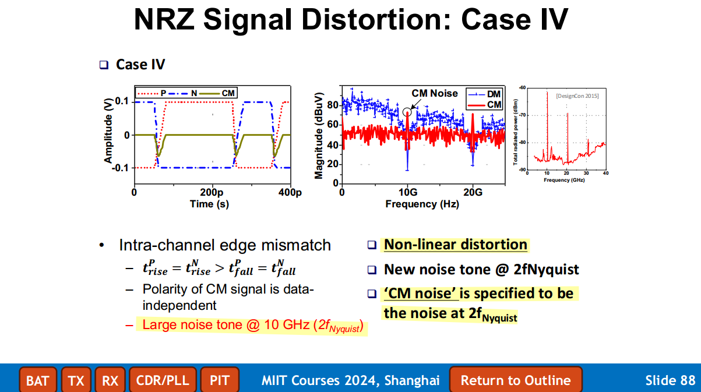


## amplitude distortion

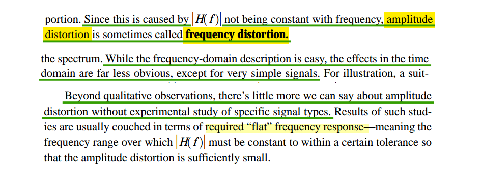

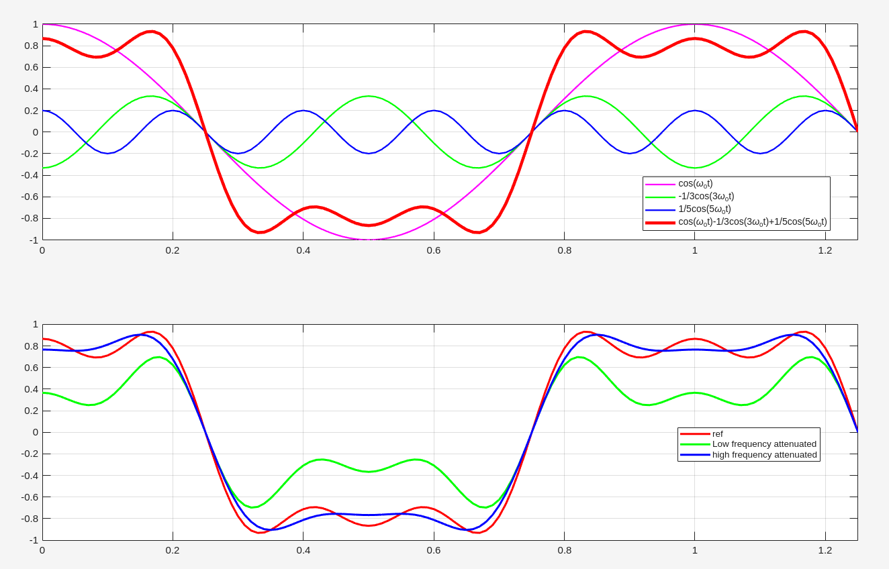

```matlab
w0 = 2*pi*1;  % T=1
t = 0:0.01:1.25;

x1 = cos(w0*t);
x2 = -1/3*cos(3*w0*t);
x3 = 1/5*cos(5*w0*t);

subplot(2,1,1)
plot(t, x1, 'm-', LineWidth=1.5); hold on;
plot(t, x2, 'g-', LineWidth=1.5); plot(t, x3, 'b-', LineWidth=1.5);
plot(t, x1+x2+x3, 'r-', LineWidth=3); grid on; xlim([0 1.25])
legend('cos(\omega_0t)', '-1/3cos(3\omega_0t)', '1/5cos(5\omega_0t)', 'cos(\omega_0t)-1/3cos(3\omega_0t)+1/5cos(5\omega_0t)')

subplot(2,1,2)
plot(t, x1+x2+x3, 'r-', LineWidth=2); hold on;
plot(t, x1/2+x2+x3, 'g-', LineWidth=2); 
plot(t, x1+x2+x3/2, 'b-', LineWidth=2); grid on; xlim([0 1.25])
legend('ref', 'Low frequency attenuated', 'high frequency attenuated')

```


## phase delay

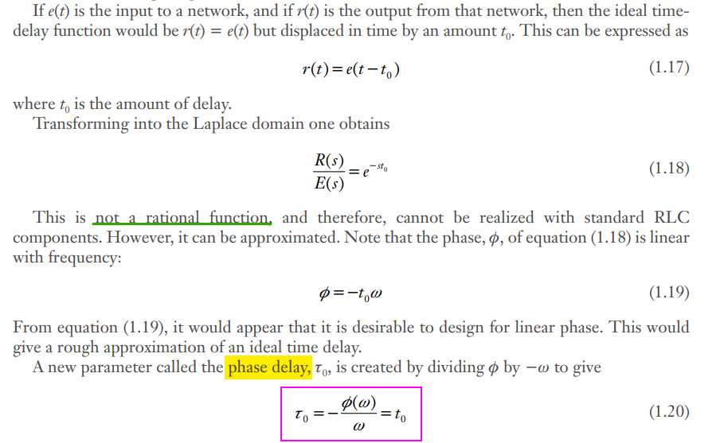

> Phase delay directly measures the device or system time delay of *individual sinusoidal frequency components* in the **steady-state conditions**


## group delay

> Andor Bariska. Negative Group Delay [[https://www.dsprelated.com/blogimages/AndorBariska/NGD/ngdblog.pdf](https://www.dsprelated.com/blogimages/AndorBariska/NGD/ngdblog.pdf)]

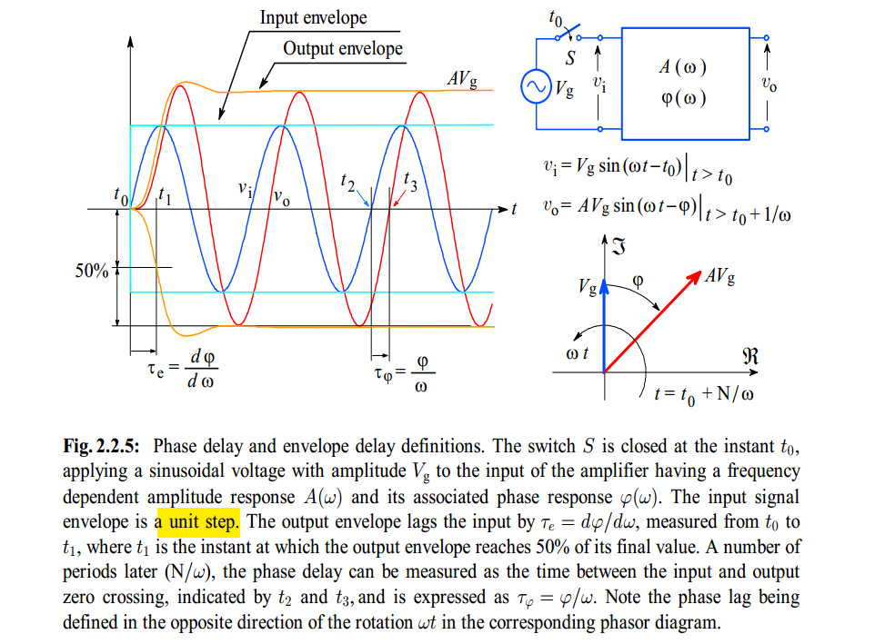

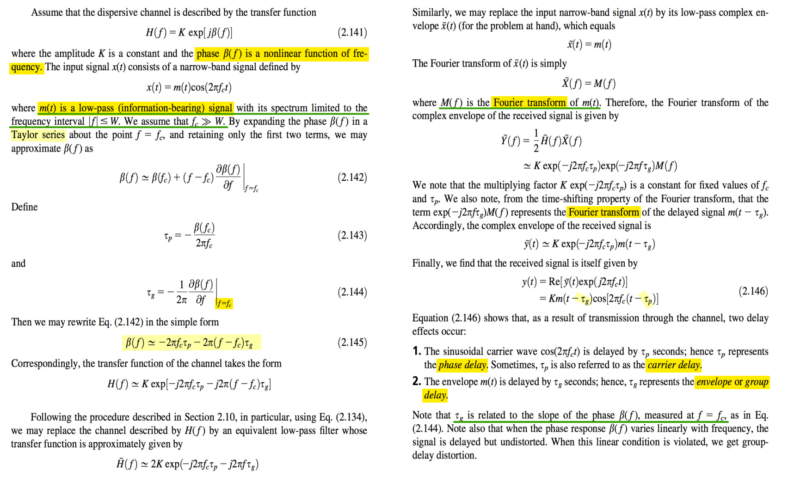

> 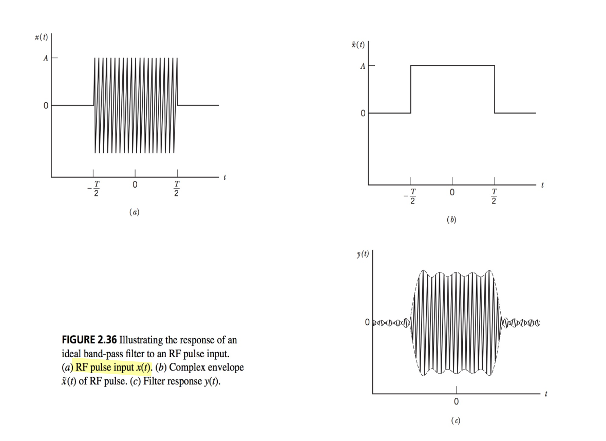

---

> Pupalaikis, Peter. (2006). Group Delay and its Impact on Serial Data Transmission and Testing. [[https://cdn.teledynelecroy.com/files/whitepapers/group_delay-designcon2006.pdf](https://cdn.teledynelecroy.com/files/whitepapers/group_delay-designcon2006.pdf)]

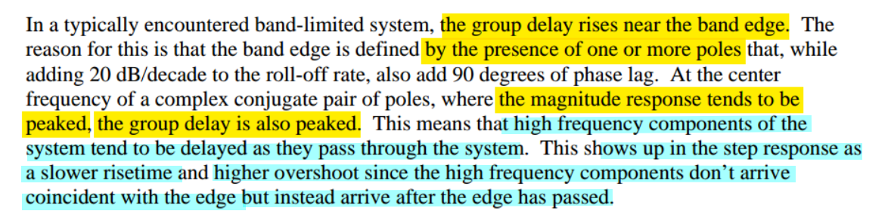

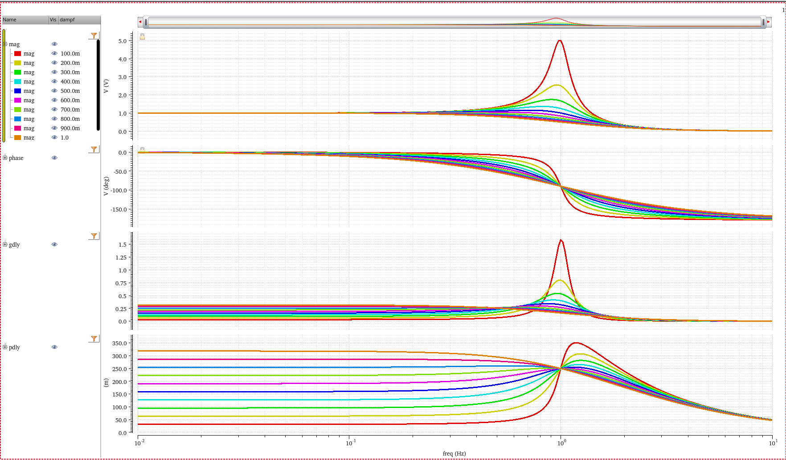


## Phase Delay & Group Delay 

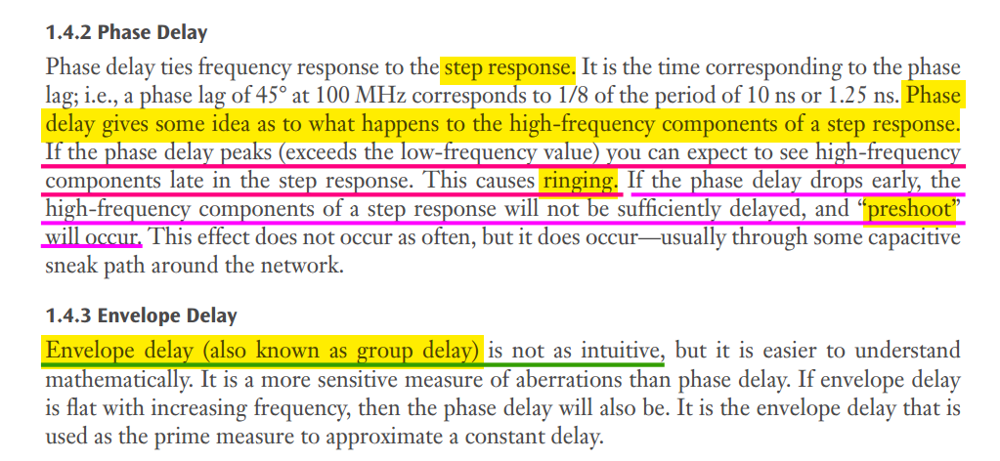

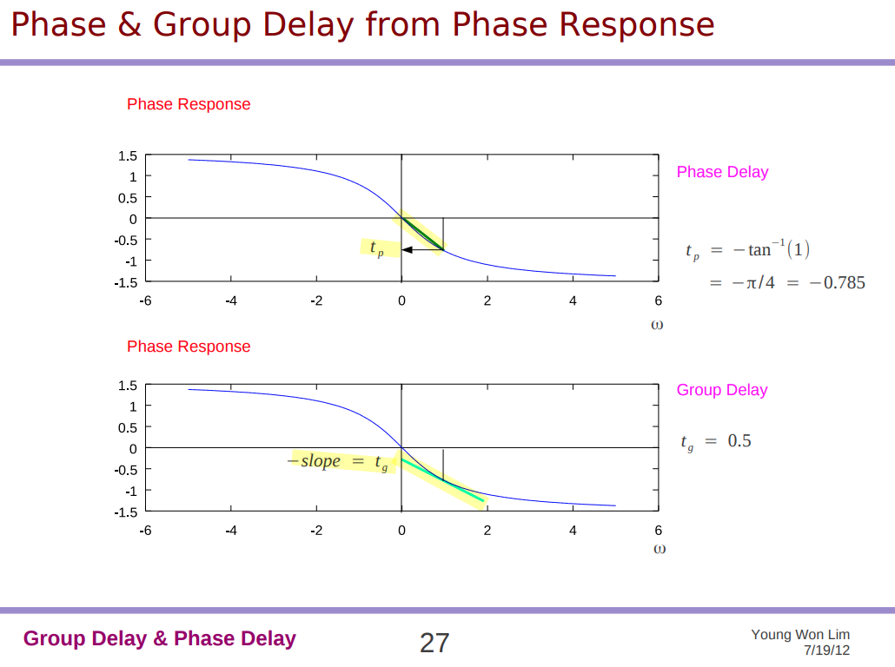

---

> W. Bae, B. Nikolić and D. -K. Jeong, "Use of Phase Delay Analysis for Evaluating Wideband Circuits: An Alternative to Group Delay Analysis," in IEEE Transactions on Very Large Scale Integration (VLSI) Systems, vol. 25, no. 12, pp. 3543-3547, Dec. 2017, [[https://people.eecs.berkeley.edu/~bora/Journals/2017/TVLSI17.pdf](https://people.eecs.berkeley.edu/~bora/Journals/2017/TVLSI17.pdf)]

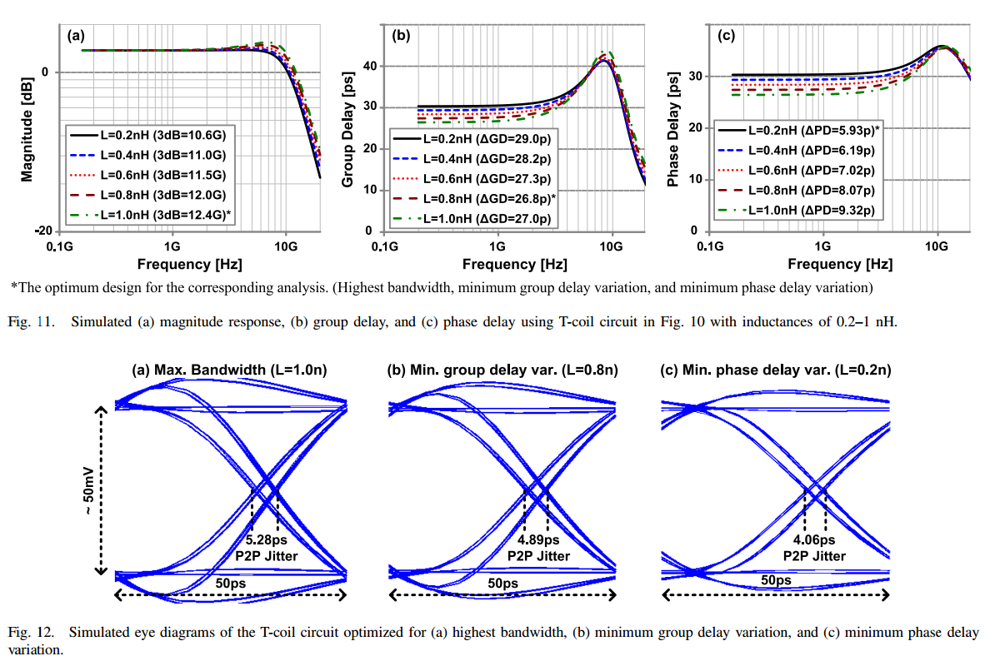

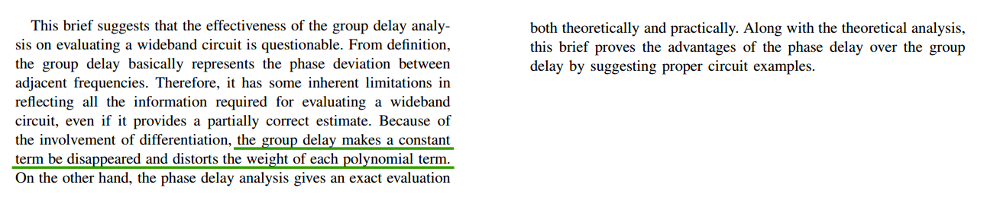


## Phase Response Compensation

> Xiaojun Zhou. Think PAM4 Serdes [[https://ibis.org/summits/nov17a/zhou.pdf](https://ibis.org/summits/nov17a/zhou.pdf)]

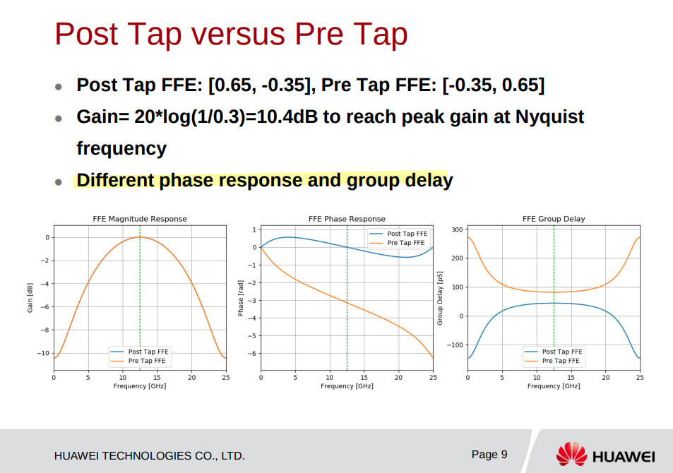


```matlab
fs = 1;
f = (0:0.001:1)*fs;
w = f*2*pi;

H_post = 0.65 - 0.35 * exp(-1j*w*1/fs);
mag_post = abs(H_post);
theta_post = unwrap(angle(H_post));
gd_post = - (theta_post(2:end) - theta_post(1:end-1))./(w(2:end) - w(1:end-1));

H_pre = -0.35 +  0.65 * exp(-1j*w*1/fs);
mag_pre = abs(H_pre);
theta_pre = unwrap(angle(H_pre));
gd_pre = - (theta_pre(2:end) - theta_pre(1:end-1))./(w(2:end) - w(1:end-1));

subplot(3,1,1)
plot(f, mag_post, 'r', LineWidth=2); hold on; plot(f, mag_pre, 'b', LineWidth=2);
grid on; legend('Post Tap FFE', 'Pre Tap FFE'); title('FFE Magnitude Response')

subplot(3,1,2)
plot(f, theta_post, 'r', LineWidth=2); hold on; plot(f, theta_pre, 'b', LineWidth=2);
grid on; legend('Post Tap FFE', 'Pre Tap FFE'); title('FFE Phase Response')

subplot(3,1,3)
plot(f(1:end-1), gd_post, 'r', LineWidth=2); hold on; plot(f(1:end-1), gd_pre, 'b', LineWidth=2);
grid on; legend('Post Tap FFE', 'Pre Tap FFE'); title('FFE Group Delay')
```


## Nonlinearity


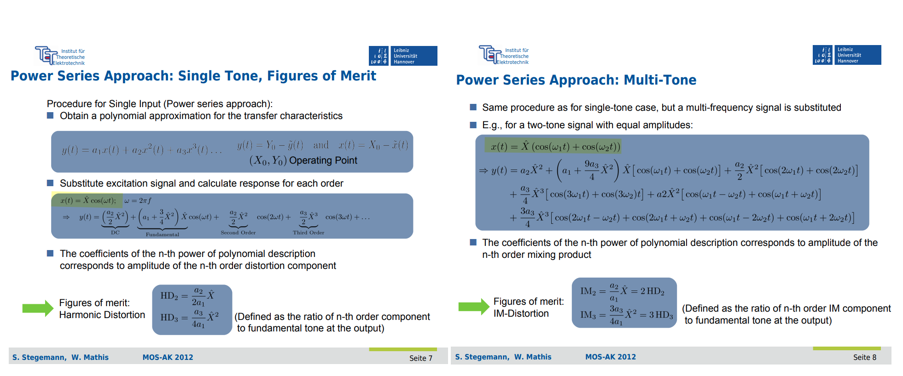


## Even-Order Distortion

**Odd**-order distortion: **symmetry**

**Even**-Order Distortion: **non-symmetry**  (*Effect of Mismatch*)


---

> [[http://cc.ee.ntu.edu.tw/~ecl/Courses/105AIC/lock/Analog_Chapter_09_Nonlinearity%20and%20Mismatch.pdf](http://cc.ee.ntu.edu.tw/~ecl/Courses/105AIC/lock/Analog_Chapter_09_Nonlinearity%20and%20Mismatch.pdf)]
>
> 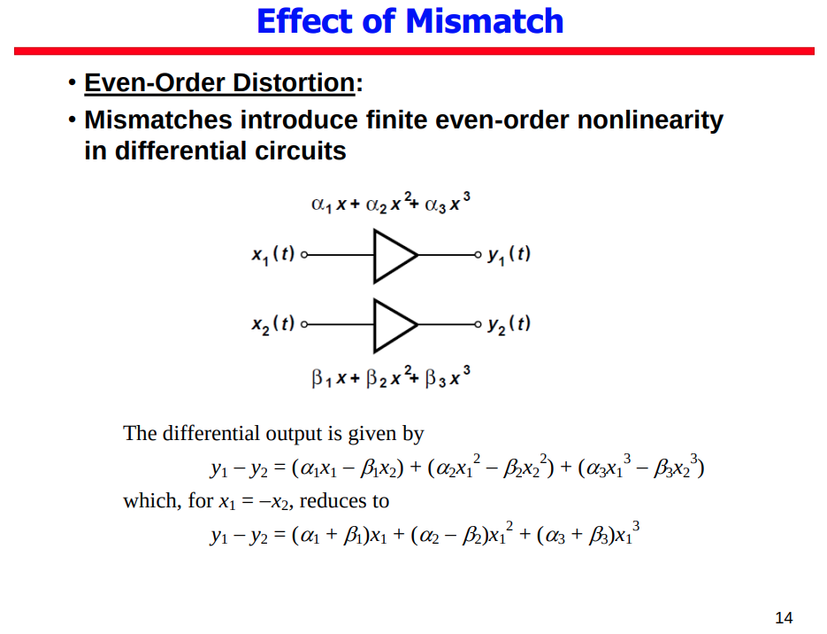

## Volterra Series

> Heng Zhang. ECEN 665 (ESS) : RF Communication Circuits and Systems Volterra Series: Introduction & Application [[https://people.engr.tamu.edu/s-sanchez/665_Volterra_2008.pdf](https://people.engr.tamu.edu/s-sanchez/665_Volterra_2008.pdf)]

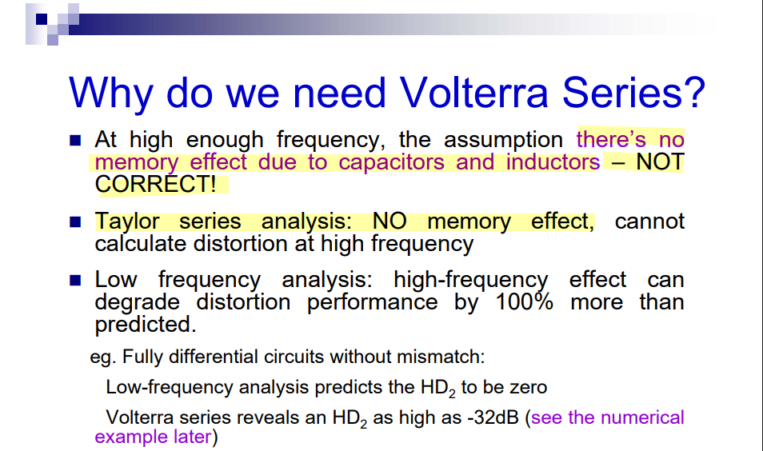


## reference

Hollister, Allen L. *Wideband Amplifier Design*. Raleigh, NC: SciTech Pub., 2007.

Starič, P. & Margan, E.. (2006). Wideband Amplifiers. 10.1007/978-0-387-28341-8. [[pdf](https://www-f9.ijs.si/~margan/WBA3_4web/Wideband_Amplifiers_FPRL.pdf)]

Haykin, Simon S., and Michael Moher. *Communication Systems*. 5th ed. John Wiley & Sons, 2009.

—. *Digital Communication Systems*. 1st edition. Wiley, 2013. [[pdf](https://rizkia.staff.telkomuniversity.ac.id/files/2016/02/Digital-Communication-Systems-Simon-S.-Haykin.pdf)]

Carlson, A. Bruce, and Paul B. Crilly. *Communication Systems: An Introduction to Signals and Noise in Electrical Communication*. 5th ed. Boston: McGraw-Hill Higher Education, 2010. [[pdf](https://eedmd.weebly.com/uploads/9/6/6/9/96692532/carlson.pdf)]

Pupalaikis, Peter & Yudin, Eric. (2005). Eye Patterns in Scopes. [[https://cdn.teledynelecroy.com/files/whitepapers/eye_patterns_in_scopes-designcon_2005.pdf](https://cdn.teledynelecroy.com/files/whitepapers/eye_patterns_in_scopes-designcon_2005.pdf)]

---

Young W. Lim. Group Delay and Phase Delay (1A) [[https://upload.wikimedia.org/wikiversity/en/e/e3/Misc.1.A.GroupPhase.20120719.pdf](https://upload.wikimedia.org/wikiversity/en/e/e3/Misc.1.A.GroupPhase.20120719.pdf)]

Group delay and phase delay example [[https://dspillustrations.com/pages/posts/misc/group-delay-and-phase-delay-example.html](https://dspillustrations.com/pages/posts/misc/group-delay-and-phase-delay-example.html)]

Arkonaire. What is the difference between phase delay and group delay?[[https://dsp.stackexchange.com/a/51532/59253](https://dsp.stackexchange.com/a/51532/59253)]

Andor Bariska. Time Machine, Anyone? [[https://www.dsprelated.com/showarticle/54.php](https://www.dsprelated.com/showarticle/54.php)]

Julius Orion Smith III. Introduction to Digital Filters: Phase and Group Delay [[https://www.dsprelated.com/freebooks/filters/Phase_Group_Delay.html](https://www.dsprelated.com/freebooks/filters/Phase_Group_Delay.html)]

Phase delay vs group delay: Common misconceptions. [[https://audiosciencereview.com/forum/index.php?threads/phase-delay-vs-group-delay-common-misconceptions.39591/](https://audiosciencereview.com/forum/index.php?threads/phase-delay-vs-group-delay-common-misconceptions.39591/)]

Dan Boschen. Why do we care about "Linear Phase Filters"? [[link](https://www.linkedin.com/posts/danboschen_why-do-we-care-about-linear-phase-filters-activity-7384371590643326977-NMEt?utm_source=share&utm_medium=member_desktop&rcm=ACoAAD-cuiIBDJ62eh9q3qTSSdslYXr-XMd8TGw)]

CC Chen. Why Group Delay Optimization? [[https://youtu.be/Lv7yO_LkKng](https://youtu.be/Lv7yO_LkKng)]

Group and Phase Delay Measurements with Vector Network Analyzer ZVR [[https://cdn.rohde-schwarz.com.cn/pws/dl_downloads/dl_application/application_notes/1ez35/1ez35_1e.pdf](https://cdn.rohde-schwarz.com.cn/pws/dl_downloads/dl_application/application_notes/1ez35/1ez35_1e.pdf)]

---

S. Stegemann, W. Mathis. MOS-AK 2012: Interference and Distortion Analysis for Nonlinear Analog Circuits [[https://www.mos-ak.org/dresden_2012/publications/T8_Stegemann_MOS-AK_Desden_12.pdf](https://www.mos-ak.org/dresden_2012/publications/T8_Stegemann_MOS-AK_Desden_12.pdf)]

Ali Sheikholeslami. A-SSCC 2024 insight: Noise and Distortion,  [[https://youtu.be/bvsJgHJ19jI](https://youtu.be/bvsJgHJ19jI)]

B. Razavi, "Design considerations for direct-conversion receivers," in IEEE Transactions on Circuits and Systems II: Analog and Digital Signal Processing, vol. 44, no. 6, pp. 428-435, June 1997 [[http://www.seas.ucla.edu/brweb/papers/Journals/RTCAS97.pdf](http://www.seas.ucla.edu/brweb/papers/Journals/RTCAS97.pdf)]

Two-Tone Intermodulation [[https://www.ittc.ku.edu/~jstiles/622/handouts/Two-Tone%20Intermodulation.pdf](https://www.ittc.ku.edu/~jstiles/622/handouts/Two-Tone%20Intermodulation.pdf)]

Intermodulation Distortion [[https://www.ittc.ku.edu/~jstiles/622/handouts/Intermodulation%20Distortion.pdf](https://www.ittc.ku.edu/~jstiles/622/handouts/Intermodulation%20Distortion.pdf)]

A. Sheikholeslami, "“Noise and Distortion, Part II” [Circuit Intuitions]," in *IEEE Solid-State Circuits Magazine*, vol. 16, no. 4, pp. 8-11, Fall 2024 

A. Sheikholeslami, "Noise and Distortion, Part III [Circuit Intuitions]," in *IEEE Solid-State Circuits Magazine*, vol. 17, no. 1, pp. 8-11, winter 2025

Ali Sheikholeslami, University of Toronto,  A-SSCC 2024 Circuit Insights:**FT1 Noise and Distortion** [[link](https://youtu.be/bvsJgHJ19jI?si=4uY_eYLkJ_zvOgz3)]
