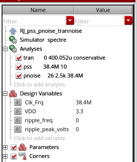
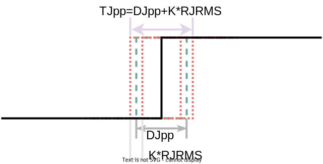
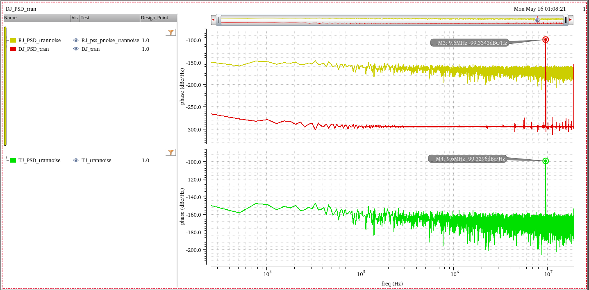

## Deterministic Jitter


`j_Djpp` can be calculated by PSD,too


```matlab
fck = 38.4e6;
Nfft = 15000;
fres = fck/Nfft;
psddBc = -99.3343;
psBc = psddBc + 10*log10(fres);	% psd -> ps; 
phrad2 = 10^(psBc/10);
phrms = sqrt(phrad2);
Jrms = phrms/2/pi*1/fck;
Jpp = 2*sqrt(2)*Jrms;
```

```
Jpp =

   6.4038e-12
```

For DJ, we usually use peak to peak value

> BTW, the psd value at half of fundamental frequency ($f_s/2$) is misleading and ambiguity, we won't use this value


## Random Jitter

RJ can be accurately and efficiently measured using **PSS/Pnoise** or **HB/HBnoise**.  

Note that the **transient noise** can also be used to compute RJ; 

> However, the computation cost is typically very high, and the accuracy is lesser as compared to PSS/Pnoise and HB/HBnoise.

Since RJ follows a Gaussian distribution, it can be fully characterized using its Root-Mean-Squared value (RMS) or the standard deviation value ($\sigma$)

The Peak-to-Peak value of RJ ($\text{RJ}_{\text{p-p}}$) can be calculated under certain observation conditions
$$
\text{RJ}_{\text{p-p}}\equiv K \ast \text{RJ}_{\text{RMS}}
$$
Here, $K$ is a constant determined by the BER specification of the system given in the following Table

| BER        | Crest factor (K) |
| ---------- | ---------------- |
| $10^{-3}$  | 6.18             |
| $10^{-4}$  | 7.438            |
| $10^{-5}$  | 8.53             |
| $10^{-6}$  | 9.507            |
| $10^{-7}$  | 10.399           |
| $10^{-8}$  | 11.224           |
| $10^{-9}$  | 11.996           |
| $10^{-10}$ | 12.723           |
| $10^{-11}$ | 13.412           |
| $10^{-12}$ | 14.069           |
| $10^{-13}$ | 14.698           |

```matlab
K = 14.698;
Ks = K/2;
p = normcdf([-Ks Ks]);
BER = 1 - (p(2)-p(1));
```

```
BER =

   1.9962e-13
```





## Total Jitter

$$
\text{TJ}_{\text{p-p}}\equiv \text{DJ}_{\text{p-p}} + \text{RJ}_{\text{p-p}}(\text{BER})
$$






> In the psd of TJ, the spur is DJ and floor is RJ


## Phase Noise to Jitter

The **phase noise** is traditionally defined as the ratio of the power of the signal in 1Hz bandwidth at offset $f$ from the carrier $P$,
divided by the power of the carrier
$$
\ell (f) = \frac {S_v'(f_0+f)}{P}
$$
where $S_v'$ is is **one-sided voltage PSD** and $f \geqslant 0$

Under **narrow angle assumption**
$$
S_{\varphi}(f)= \frac {S_v'(f_0+f)}{P}
$$
where $\forall f\in \left[-\infty +\infty\right]$

Using the Wiener-Khinchin theorem, it is possible to easily derive the variance of the absolute jitter($J_{ee}$)via integration of the corresponding PSD
$$
J_{ee,rms}^2 = \int S_{J_{ee}}(f)df
$$

And we know the relationship between absolute jitter and excess phase is
$$
J_{ee}=\frac {\varphi}{\omega_0}
$$
Considering that phase noise is normally symmetrical about the zero frequency, multiplied by **two** is shown as below
$$
J_{ee,rms} = \frac{\sqrt{2\int_{0}^{+\infty}\ell(f)df}}{\omega_0}
$$
where phase noise is in linear units not in logarithmic ones.

Because the unit of phase noise in *Spectre-RF* is logarithmic unit (*dBc*), we have to convert the unit before applying the above equation
$$
\ell[linear] = 10^{\frac {\ell [dBc/Hz]}{10}}
$$
The complete equation using the simulation result of *Spectre-RF Pnoise* is
$$
J_{ee,rms} = \frac{\sqrt{2\int_{0}^{+\infty}10^{\frac {\ell [dBc/Hz]}{10}}df}}{\omega_0}
$$

The above equation has been verified for *sampled pnoise*, i.e.  *J<sub>ee</sub>* and *Edge Phase Noise*.

> - For **pnoise-sampled(jitter)**, *Direct Plot Form - Function: Jee:Integration Limits* can calculate it conveniently
> - But for **pnoise-timeaveage**, you have to use the below equation to get RMS jitter.

One example, integrate to $\frac{f_{osc}}{2}$ and $f_{osc} = 16GHz$


Of course, it apply to conventional pnoise simulation.

On the other hand, output rms voltage noise, $V_{out,rms}$ divied by slope should be close to $J_{ee,rms}$
$$
J_{ee,rms} = \frac {V_{out,rms}}{slope}
$$


## reference

Article (20500632) Title: How to simulate Random and Deterministic Jitters URL: https://support.cadence.com/apex/ArticleAttachmentPortal?id=a1O3w000009fiXeEAI
