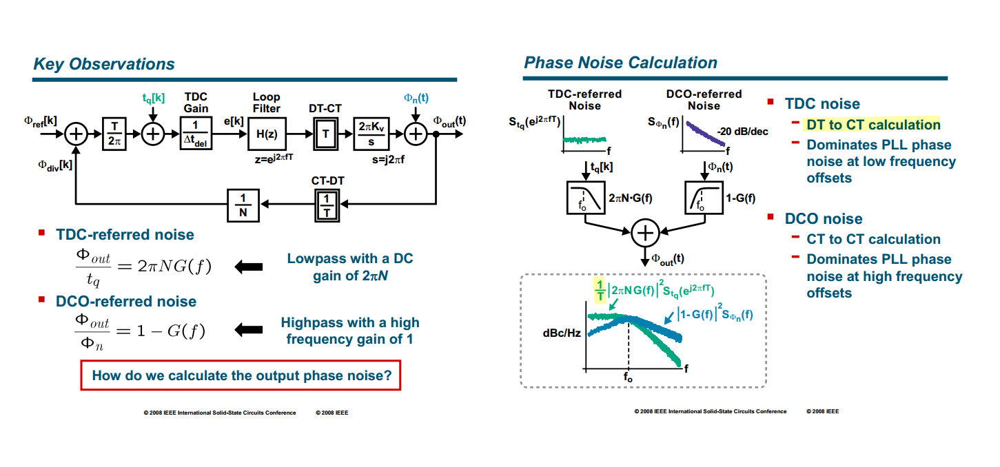
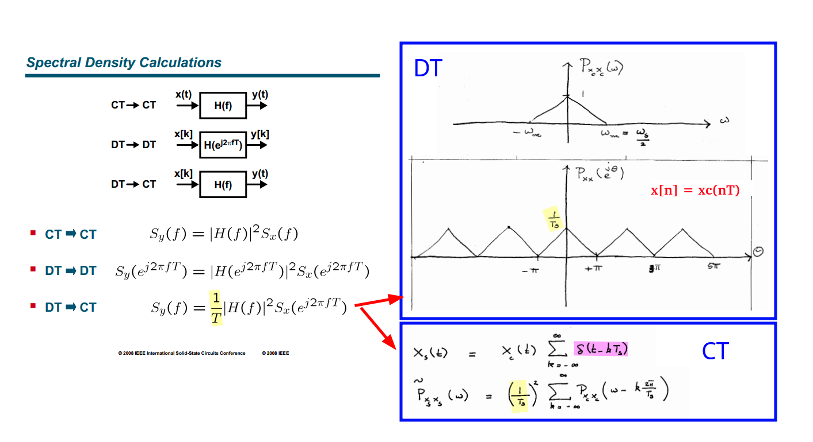
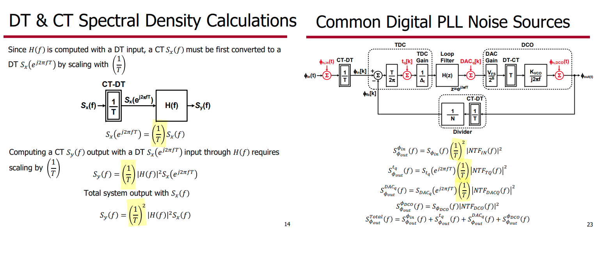
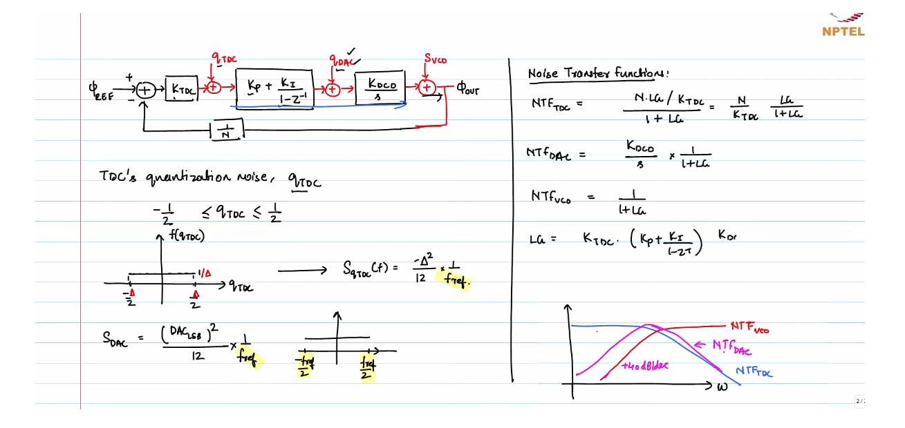

## DT & CT Spectral Density

---

[[Sampling of WSS process of Systems, Modulation and Noise](https://raytroop.github.io/2024/05/25/comm/#sampling-of-wss-process)]

That is
$$
P_{x_s x_s} (f)= \frac{1}{T_s}P_{xx}(f)
$$
In going from *discrete* time to *continuous* time,  we must add a scale factor $1/T$, the sample period

---

## TDC quantization noise

## reference

Sam Palermo, ECEN620 2024 Lecture 9: Digital PLLs [[https://people.engr.tamu.edu/spalermo/ecen620/lecture09_ee620_digital_PLLs.pdf](https://people.engr.tamu.edu/spalermo/ecen620/lecture09_ee620_digital_PLLs.pdf)]

Topics in IC(Wireline Transceiver Design) [[https://ocw.snu.ac.kr/sites/default/files/NOTE/Lec%203%20-%20ADPLL.pdf](https://ocw.snu.ac.kr/sites/default/files/NOTE/Lec%203%20-%20ADPLL.pdf)]

ISSCC 2008 Tutorial on Digital Phase-Locked Loops Michael H. Perrott [[https://www.nishanchettri.com/isscc-slides/2008%20ISSCC/Tutorials/T05_Pres.pdf](https://www.nishanchettri.com/isscc-slides/2008%20ISSCC/Tutorials/T05_Pres.pdf)]

CICC 2009 Tutorial on Digital Phase-Locked Loops Michael H. Perrott [[https://www.cppsim.com/PLL_Lectures/digital_pll_cicc_tutorial_perrott.pdf](https://www.cppsim.com/PLL_Lectures/digital_pll_cicc_tutorial_perrott.pdf)]

Robert Bogdan Staszewski,  CICC 2020:  Beyond All-Digital PLL for RF and Millimeter-Wave Frequency Synthesis [[link](https://www.researchgate.net/profile/Yizhe-Hu/publication/342702810_Beyond_All-Digital_PLL_for_RF_and_Millimeter-Wave_Frequency_Synthesis/links/5f02305692851c52d619ce21/Beyond-All-Digital-PLL-for-RF-and-Millimeter-Wave-Frequency-Synthesis.pdf)]

Akihide Sai, ISSCC 2023 T5: All-digital PLLs From Fundamental Concepts to Future Trends [[https://www.nishanchettri.com/isscc-slides/2023%20ISSCC/TUTORIALS/T5.pdf](https://www.nishanchettri.com/isscc-slides/2023%20ISSCC/TUTORIALS/T5.pdf)]

Mike Shuo-Wei Chen, CICC 2020 ES2-3: Low-Spur PLL Architectures and Techniques [[https://youtu.be/sgPDchYhN-4?si=FAy8N3SuX6vVpYhl](https://youtu.be/sgPDchYhN-4?si=FAy8N3SuX6vVpYhl)]

Saurabh Saxena, IIT Madras. Phase-Locked Loops: Noise Analysis in Digital PLL [[https://youtu.be/mddtxcqfiKU?si=yD15KM9WBkT6c68P](https://youtu.be/mddtxcqfiKU?si=yD15KM9WBkT6c68P)]

---

Y. Hu, T. Siriburanon and R. B. Staszewski, "Multirate Timestamp Modeling for Ultralow-Jitter Frequency Synthesis: A Tutorial," in *IEEE Transactions on Circuits and Systems II: Express Briefs*, vol. 69, no. 7, pp. 3030-3036, July 2022

L. Avallone, M. Mercandelli, A. Santiccioli, M. P. Kennedy, S. Levantino and C. Samori, "A Comprehensive Phase Noise Analysis of Bang-Bang Digital PLLs," in *IEEE Transactions on Circuits and Systems I: Regular Papers*, vol. 68, no. 7, pp. 2775-2786, July 2021

---

Neil Robertson. Digital PLL's -- Part 1 [[https://www.dsprelated.com/showarticle/967.php](https://www.dsprelated.com/showarticle/967.php)]

Neil Robertson. Digital PLL's -- Part 2 [[https://www.dsprelated.com/showarticle/973.php](https://www.dsprelated.com/showarticle/973.php)]
