## BB PD

> Youngdon Choi, Deog-Kyoon Jeong and W. Kim, "Jitter transfer analysis of tracked oversampling techniques for multigigabit clock and data recovery," in IEEE Transactions on Circuits and Systems II: Analog and Digital Signal Processing, vol. 50, no. 11, pp. 775-783, Nov. 2003 [[https://sci-hub.st/10.1109/TCSII.2003.819070](https://sci-hub.st/10.1109/TCSII.2003.819070)]
>
> John T. Stonick, ISSCC 2011 TUTORIALS *T5: DPLL-Based Clock and Data Recovery*
>
> Walker, Richard. (2003). Designing Bang-Bang PLLs for Clock and Data Recovery in Serial Data Transmission Systems.  [[pdf](https://www.omnisterra.com/walker/pdfs.papers/BBPLL.pdf)]
>
> —, Clock and Data Recovery for Serial Data Communications, focusing on bang-bang CDR design methodology, ISSCC Short Course, February 2002. [[slides](https://www.omnisterra.com/walker/pdfs.talks/ISSCC2002.pdf)]

It's **ternary**, because *early*, *late* and *no transition*

notice the ***transition density = 1*** in digital PLL

### Linearization

The effective PD gain is a function of the **input jitter pdf**, it enables one to anticipate the effects of input jitter on loop characteristics


BB Gain is the slope of average BB output $\mu$, versus phase offset $\phi$, i.e. $\frac {\partial \mu}{\partial \phi}$,

BB only produces output for a transition and this de-rates the gain. ***Transition density = 0.5*** for ***random*** data

$$
K_{BB} = \frac{1}{2}\frac {\partial \mu}{\partial \phi}
$$

where $\mu = (1)\times \mathrm{P}(\text{late}|\phi) + (-1)\times \mathrm{P}(\text{early}|\phi)$


> Both jitter and amplitude noise distribution are same, just scaled by slope


### Self-Noise Term

One price we pay for ***BB PD*** versus ***linear PD*** is the self-noise term. **For** **small phase errors** BB output noise is the **full magnitude** of the sliced data

> The PD output should be almost **0** for small phase errors. i.e. ideal PD output noise should be **0**

$$
\sigma_{BB}^2 = 1^2 \cdot \mathrm{P}(\text{trans}) + 0^2\cdot (1-\mathrm{P}(\text{trans})) = 0.5
$$


**Input referred jitter** from BB PD is **proportional to incoming jitter**


### gain simulation

> L. Avallone, M. Mercandelli, A. Santiccioli, M. P. Kennedy, S. Levantino and C. Samori, "A Comprehensive Phase Noise Analysis of Bang-Bang Digital PLLs," in IEEE Transactions on Circuits and Systems I: Regular Papers, vol. 68, no. 7, pp. 2775-2786, July 2021 [[https://sci-hub.st/10.1109/TCSI.2021.3072344](https://sci-hub.st/10.1109/TCSI.2021.3072344)]
>
> T. -K. Kuan and S. -I. Liu, "A Bang Bang Phase-Locked Loop Using Automatic Loop Gain Control and Loop Latency Reduction Techniques," in IEEE Journal of Solid-State Circuits, vol. 51, no. 4, pp. 821-831, April 2016 [[https://sci-hub.st/10.1109/JSSC.2016.2519391](https://sci-hub.st/10.1109/JSSC.2016.2519391)]


```python
import matplotlib.pyplot as plt
import numpy as np

N = 2**10
sigma = 0.1
dt = np.random.normal(0, sigma, size=N)
et = np.sign(dt)

# Eq-(2)
coef_form = np.mean(np.abs(dt)) / np.mean(np.power(dt, 2))
print(f'coef_form: {coef_form}')

# Eq-(9)
coef_gauss = (2/np.pi)**0.5/sigma
print(f'coef_gauss: {coef_gauss}')

# polyfit
coef_fit = np.polyfit(dt, et, 1)
print(f'coef_fit: {coef_fit}')

x = np.linspace(-3.5, 3.5, 1000)
y = coef_fit[0]*x + coef_fit[1]

plt.figure(figsize=(12,6))
plt.plot(dt, et, 'o')
plt.plot(x, y, linewidth=2, linestyle='--')

# Calculate histogram counts and bin edges
counts, bin_edges = np.histogram(dt, bins=100)
# Find the maximum count
max_count = counts.max()
# Create weights to normalize the maximum height to 1
weights = np.ones_like(dt) / max_count
plt.hist(dt, bins=100, weights=weights)

plt.xlabel(r'$\Delta t$')
plt.grid(True)
plt.legend([r'$\Delta t \sim \varepsilon $', r'$x_{fit} \sim y_{fit}$', r'$ \text{hist}_{\Delta t}$'])
plt.show()


# coef_form: 7.82197790742685
# coef_gauss: 7.978845608028654
# coef_fit: [7.82251511 0.01010586]
```


---

> Pavan, Shanthi, Richard Schreier, and Gabor Temes. (2016). Understanding Delta-Sigma Data Converters. 2nd ed. Wiley.  - *2.2.1 Quantizer Modeling*


$$
\frac{\mathrm{d}\sigma_e^2}{\mathrm{d}k} =0\space\space\Rightarrow\space\space k=\frac{\left\langle  v,y\right\rangle}{\left\langle y,y \right\rangle}
$$


## DCO Quantization Noise

*TODO* &#128197;


## TDC Quantization Noise

*TODO* &#128197;


## CDR Loop Latency

> Amir Amirkhany. ISSCC 2019 "Basics of Clock and Data Recovery Circuits"
>


---


loop latency is represented as $e^{-sD}$ in linear model

---


### Sensitivity to Loop Latency


---


### Loop Latency model

> CC Chen. Why A Low Loop Latency in A CDR Design? [[https://youtu.be/io9WZbhlahU](https://youtu.be/io9WZbhlahU)]
>
> —. Why Understanding and Optimizing Loop Latency for A CDR Design? [[https://youtu.be/Jyy18865jv8](https://youtu.be/Jyy18865jv8)]
>
> Walker, Richard. (2003). Designing Bang-Bang PLLs for Clock and Data Recovery in Serial Data Transmission Systems. [[paper](https://www.omnisterra.com/walker/pdfs.papers/BBPLL.pdf),[slides](https://www.omnisterra.com/walker/pdfs.talks/bctm2.maker.pdf)]


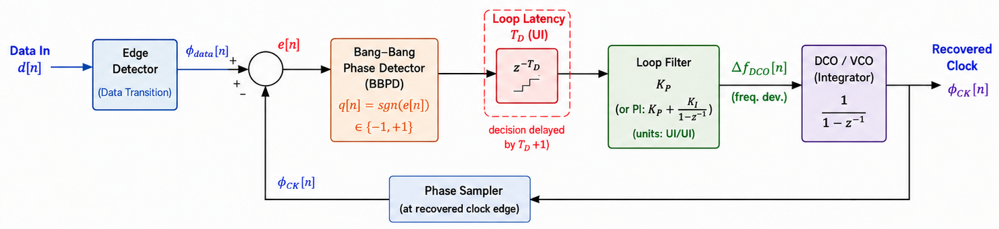


$$
q[n]\rightarrow \left( K_P+\frac{K_I}{1-z^{-1}} \right) \rightarrow \frac{1}{1-z^{-1}} \rightarrow\phi_{CK}
$$

The last term is already the VCO integration from frequency to phase.

So the two paths have different effects:

$$
K_P q[n] \quad\stackrel{\mathrm{VCO}}{\longrightarrow}\quad \text{one integration}
$$

whereas

$$
K_I\sum q[n] \quad\stackrel{\mathrm{VCO}}{\longrightarrow}\quad \text{two integrations}
$$

Using the delayed BBPD output

$$
q_D[n]=q[n-T_D],\qquad q_D[n]\in\{-1,+1\}
$$

the loop filter is

$$
\boxed{ f_I[n+1]=f_I[n]+K_I q_D[n] }
$$

and

$$
\boxed{ \Delta f_{\rm DCO}[n] = K_P q_D[n]+f_I[n] }
$$

The DCO phase then evolves as

$$
\boxed{ \phi_{\rm DCO}[n+1] = \phi_{\rm DCO}[n] + \Delta\phi_{\rm nom} + \Delta f_{\rm DCO}[n] }
$$

If we remove the nominal $2\pi$ rotation and only track **phase error**, this becomes

$$
\boxed{ \Delta\phi_{\rm DCO}[n+1] = \Delta\phi_{\rm DCO}[n] + K_Pq_D[n]+f_I[n] }
$$

So the structure is

$$
q_D \rightarrow \boxed{K_P+\frac{K_I}{1-z^{-1}}} \rightarrow \boxed{\frac{1}{1-z^{-1}}} \rightarrow \phi_{\rm DCO}
$$


```python
"""
Behavioral model of the experiment on the slides
"Max dphi w/ SJ & Sweeping loop Latency" (pages 5 and 6):

    8 Gb/s, PRBS7, no input RJ
    SJ = 10 %UI p-p @ 100 MHz
    T_D (loop latency) = 2 / 5 / 10 UI  ->  dphi = 12 / 19 / 23 %UI p-p

Units: time step = 1 UI (125 ps @ 8 Gb/s), all phases in UI.

Loop (digital type-II, latency T_D inserted in the feedback path):

    e[n]       = sign(dphi[n]) on data transitions, 0 otherwise   (BBPD)
    acc[n+1]   = acc[n]   + Ki * e[n-TD]                          (integral / freq)
    ph_ck[n+1] = ph_ck[n] + acc[n+1] + Kp * e[n-TD]               (VCO phase)
    dphi[n]    = ph_din[n] - ph_ck[n]

Fitted gains that reproduce the three measured points:

    Kp = 0.60 %UI per decision,  Ki = Kp/1024
    -> dphi(p-p) = 12.8 / 19.3 / 23.4 %UI   (measured 12 / 19 / 23)

Key mechanism (confirmed by the page-6 zoom): the loop is SLEW-RATE LIMITED,
not bandwidth limited.  The CDR can move clock phase at most

    SR    = Kp * eta                    ~ 3.0 mUI/UI  (eta = PRBS7 edge density)

while the SJ demands

    SJ_SR = pi * A_pp * f_sj / f_b      ~ 3.9 mUI/UI

Since SR < SJ_SR, ph_ck ramps at constant slope, falls behind, and then keeps
ramping past the input after the sine turns around; T_D extends that turnaround.
The result is a coherent triangular oscillation at f_sj whose amplitude EXCEEDS
the input jitter.  The regime boundary is

    f_SL  = Kp * eta * f_b / (pi * A_pp) ~ 77 MHz
"""

def bbcdr(TD_UI=2, Kp=KP_FIT, zeta_div=ZD_FIT, ki_en=None,
          sj_pp=0.10, f_sj=100e6, f_b=F_B, ppm=0.0,
          n_ui=20000, n_settle=4000, seed=0x7F):
    """
    One CDR run.  Returns the waveforms plus p-p / peak / rms phase error
    measured after n_settle UI.

    dphi = ph_din - ph_ck   (>0 : data late -> clock must be delayed)

    ki_en : True -> type-II (Ki = Kp/zeta_div), False -> type-I (Ki = 0),
            None -> follow the module-level KI_EN.
    """
    use_ki = KI_EN if ki_en is None else ki_en
    Ki = Kp / zeta_div if use_ki else 0.0
    TD = int(round(TD_UI))

    n = np.arange(n_ui)
    ph_din = 0.5 * sj_pp * np.sin(2 * np.pi * (f_sj / f_b) * n) + ppm * 1e-6 * n

    bits = prbs7(n_ui + 1, seed)
    trans = (bits[1:] != bits[:-1]).astype(np.int8)   # BBPD updates on edges only

    ph_ck = np.empty(n_ui)
    dphi = np.empty(n_ui)
    e_buf = np.zeros(TD + 1)                          # latency pipeline
    acc = 0.0
    ck = 0.0

    for i in range(n_ui):
        d = ph_din[i] - ck
        dphi[i] = d
        ph_ck[i] = ck

        e_buf[1:] = e_buf[:-1]
        e_buf[0] = np.sign(d) * trans[i]              # BBPD decision
        e_del = e_buf[TD]                             # delayed by T_D UI

        acc += Ki * e_del
        ck += acc + Kp * e_del

    d = dphi[n_settle:]
    return dict(dphi=dphi, ph_ck=ph_ck, ph_din=ph_din, t=n,
                pp=d.max() - d.min(), peak=np.abs(d).max(), rms=d.std())
```


$K_P$ is the <span style="color:blue">normalized DCO frequency deviation caused by one BBPD decision</span>, and because that deviation lasts for one UI, it produces $K_P$ UI of excess phase over that interval:

$$
\Delta\phi_{\rm excess} = \frac{\Delta f_{\rm DCO}}{f_{\rm data}} = K_P \qquad \boxed{\text{unit}: \space\mathrm{UI/UI}}
$$

another model

```python
def simulate(td_ui: int, kp: float, ki: float):
    """
    BB-CDR recursion.

    e[n]    = phi_data[n] - phi_clk[n]

    q[n]    = sign(e[n]) when a PRBS data transition exists.
              During no-transition intervals, the binary detector keeps
              the previous Early/Late state.

    qd[n]   = q[n-TD]

    fi[n+1] = fi[n] + Ki*qd[n]

    df[n]   = Kp*qd[n] + fi[n+1]

    phi_clk[n+1] = phi_clk[n] + df[n]

    The last line is the VCO frequency-to-phase integration.
    """
    n = np.arange(N_UI)

    # 100 MHz SJ at 8 Gb/s => period = 80 UI
    phi_data = SJ_PK * np.sin(2*np.pi*(F_SJ/RB)*n)

    phi_clk = np.zeros(N_UI)
    fi = np.zeros(N_UI)        # integral path; frequency correction
    df = np.zeros(N_UI)        # total normalized frequency correction
    bb = np.zeros(N_UI)

    last_bb = 0.0

    for k in range(N_UI - 1):
        phase_err_now = wrap_ui(phi_data[k] - phi_clk[k])

        # Transition-aware binary phase detector
        if TRANSITION[k]:
            if phase_err_now > 0:
                last_bb = +1.0
            elif phase_err_now < 0:
                last_bb = -1.0

        # Binary PD: no HOLD state
        bb[k] = last_bb

        # Explicit loop latency
        kd = k - td_ui
        cmd = bb[kd] if kd >= 0 else 0.0

        # PI loop filter
        fi[k + 1] = fi[k] + ki * cmd
        df[k + 1] = kp * cmd + fi[k + 1]

        # VCO: frequency -> phase
        phi_clk[k + 1] = phi_clk[k] + df[k + 1]

    phase_err = wrap_ui(phi_data - phi_clk)

    ss = slice(N_BURN, None)
    dphi_pp = np.ptp(phase_err[ss])

    return {
        "n": n,
        "phi_data": phi_data,
        "phi_clk": phi_clk,
        "phase_err": phase_err,
        "bb": bb,
        "fi": fi,
        "df": df,
        "dphi_pp": dphi_pp,
    }

```


---


## Hunting Jitter

> S. Jang, S. Kim, S. -H. Chu, G. -S. Jeong, Y. Kim and D. -K. Jeong, "An Optimum Loop Gain Tracking All-Digital PLL Using Autocorrelation of Bang–Bang Phase-Frequency Detection," in IEEE Transactions on Circuits and Systems II: Express Briefs, vol. 62, no. 9, pp. 836-840, Sept. 2015 [[https://sci-hub.st/10.1109/TCSII.2015.2435691](https://sci-hub.st/10.1109/TCSII.2015.2435691)] [[phd thesis](https://s-space.snu.ac.kr/bitstream/10371/119111/1/000000066677.pdf)]
>
> Deog-Kyoon Jeong. Topics in IC (Wireline Transceiver Design). Lec 3 - All-Digital PLL [[https://ocw.snu.ac.kr/sites/default/files/NOTE/Lec%203%20-%20ADPLL.pdf](https://ocw.snu.ac.kr/sites/default/files/NOTE/Lec%203%20-%20ADPLL.pdf)]
>
> —. Topics in IC (Wireline Transceiver Design). Lec 6 - Clock and Data Recovery [[https://ocw.snu.ac.kr/sites/default/files/NOTE/Lec%206%20-%20Clock%20and%20Data%20Recovery.pdf](https://ocw.snu.ac.kr/sites/default/files/NOTE/Lec%206%20-%20Clock%20and%20Data%20Recovery.pdf)]
>
> Lee Hae-Chang.: ‘*An estimation approach to clock and data recovery*’, PhD Thesis, Stanford University, November 2006 [[pdf](https://www-vlsi.stanford.edu/people/alum/pdf/0611_HaechangLee_Phase_Estimation.pdf)]
>
> J. Kim, Design of CMOS Adaptive-Supply Serial Links, Ph.D. Thesis, Stanford University, December 2002. [[pdf](https://vlsiweb.stanford.edu/people/alum/pdf/0212_Kim_______Design_Of_CMOS_AdaptiveSu.pdf)]
>
> High-speed Serial Interface 2013. Lect. 16 – Clock and Data Recovery 3 [[http://tera.yonsei.ac.kr/class/2013_1_2/lecture/Lect16_CDR-3.pdf](http://tera.yonsei.ac.kr/class/2013_1_2/lecture/Lect16_CDR-3.pdf)]
>
> CC Chen. Why Hunting Jitter Happens in CDR: The Role of Input Jitter and Latency? [[https://youtu.be/hPDielPsFgY](https://youtu.be/hPDielPsFgY)]


***Hunting jitter*** is often referred to as ***dithering jitter***, the *periodic* time error between *data clock* and input data, which exhibits a ***limit-cycle*** behavior


## DT & CT Spectral Density

> Sam Palermo, ECEN620: Network Theory Broadband Circuit Design Fall 2025 *Lecture 9: Digital PLLs* [[https://people.engr.tamu.edu/spalermo/ecen620/lecture09_ee620_digital_PLLs.pdf](https://people.engr.tamu.edu/spalermo/ecen620/lecture09_ee620_digital_PLLs.pdf)]
>
> Michael Perrott, August 14, 2008. Short Course On Phase-Locked Loops and Their Applications Day 4, AM Lecture *Digital Frequency Synthesizers* [[https://www.cppsim.com/PLL_Lectures/day4_am.pdf](https://www.cppsim.com/PLL_Lectures/day4_am.pdf)]
>
> —, "A modeling approach for Sigma Delta fractional-N frequency synthesizers allowing straightforward noise analysis," in *IEEE Journal of Solid-State Circuits*, vol. 37, no. 8, pp. 1028-1038, Aug. 2002 [[https://www.cppsim.com/Publications/JNL/perrott_jssc02.pdf](https://www.cppsim.com/Publications/JNL/perrott_jssc02.pdf)]
>
> —. "Techniques for high data rate modulation and low power operation of fractional-N frequency synthesizers." 1997. [[https://www.cppsim.com/Publications/Theses/perrott_phdthesis.pdf](https://www.cppsim.com/Publications/Theses/perrott_phdthesis.pdf)]
>
> Hsu, Chun-Ming, Ph. D. Massachusetts Institute of Technology. "Techniques for high-performance digital frequency synthesis and phase control." 2008. [[http://hdl.handle.net/1721.1/45870](http://hdl.handle.net/1721.1/45870)]
>
> J. R. Barry, E. A. Lee, and D. G. Messerschmitt, Digital Communication, 3rd ed., Boston, MA: Kluwer Academic Publishers, 2003.


- $\color{red}\frac{1}{T}$ of CT-DT originates from CT to sampled sequence to impulse train Fourier transform, which is **explicit** in frequency-domain model
- $\color{red}\frac{1}{T}$ originates from DT **spectrum** to CT impulse **spectrum** is **implicit** in frequency-domain model
- $\color{red}T$ of DT-CT originates from **ZOH approximation** following impulse train, which is **explicit** in frequency-domain model


### Divider Sampling Operation & ITM

***Impulse Train Modulator (ITM)***


The **double outline of the box** in the figure is meant to serve as a reminder that a **sampling operation** is taking place


---


### DT -> CT


$\boxed{S_x(e^{j2\pi fT}) = S_d(f)\cdot \textcolor{blue}{\frac{1}{T}}=S_c(f)\cdot \textcolor{blue}{\frac{1}{T}}}$,   For example, the quantization noise spectrum is given by $S_x(e^{j2\pi fT}) = \frac{1}{12f_s}\cdot \frac{1}{T} = \frac{1}{12}$. To convert the sequence spectrum into a continuous impulse train spectrum, we multiply by $\color{blue}\frac{1}{T^2}$
$$
S_y(f) = S_x(e^{j2\pi fT}) \cdot \textcolor{blue}{T\cdot \frac{1}{T^2}\cdot |H(f)|^2 } = S_x(e^{j2\pi fT}) \cdot \textcolor{blue}{\frac{1}{T}|H(f)|^2}
$$


### CT -> DT -> CT


Assume that the lower $m$ bits of the digital filter output are discarded by truncation. The truncation error is therefore modeled as a uniformly distributed random variable,

$$
E_t \sim U[0,2^m\text{LSB}]
$$

Because the effective output resolution is reduced, the new least significant bit becomes

$$
\text{LSB}_t = 2^m\text{LSB}
$$

and the DAC quantization error is correspondingly modeled as

$$
Q_{DAC} \sim U[0,1] \space \text{in}\space \text{LSB}_t
$$


## Enhancing Resolution w/ DSM

> J. Stonick. ISSCC 2011 tutorials, T5: "DPLL-Based Clock and Data Recovery"
>
> Amir Amirkhany. ISSCC 2019 "Basics of Clock and Data Recovery Circuits"


$M+1$ bits ensure on overflow or underflow in the signed adder


## MRDT (Multi-rate Discrete-Time) Modeling

> Y. Hu, T. Siriburanon and R. B. Staszewski, "Multirate Timestamp Modeling for Ultralow-Jitter Frequency Synthesis: A Tutorial," in *IEEE Transactions on Circuits and Systems II: Express Briefs*, vol. 69, no. 7, pp. 3030-3036, July 2022
>

There are two key features associated with the behavior of DPLLs, namely, the <span style="background-color:yellow">**multi-rate**</span> and <span style="background-color:yellow">**discrete-time** properties</span>


### reference & DCO model

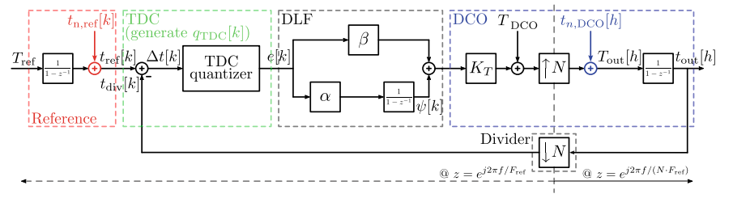

<span style="color:blue">**timestamps**</span> with **synchronous jitter** for <span style="color:blue">**reference clock signal**</span>

<span style="color:blue">**periods**</span> with period jitter for <span style="color:blue">**free-running DCO**</span>

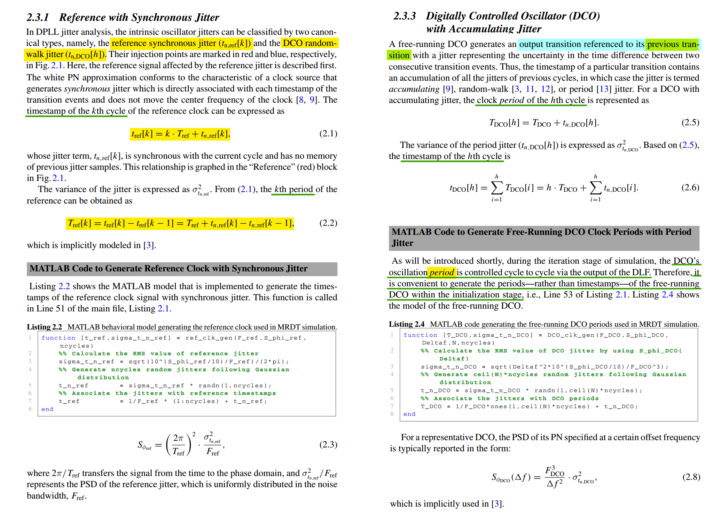

---


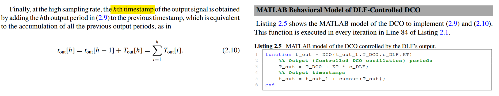

---


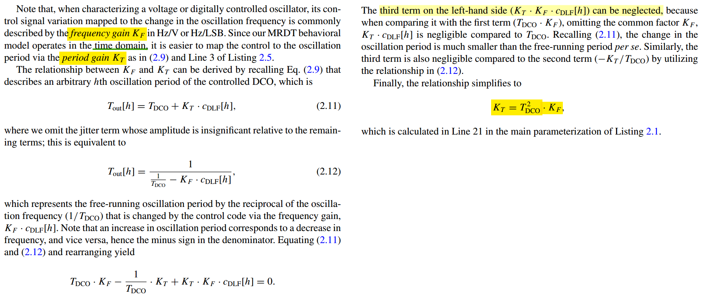

###  output jitter, PN & input jitter
Determine quantitatively the system **jitters** and **PN** from behavioral simulation of the MRDT DPLL 

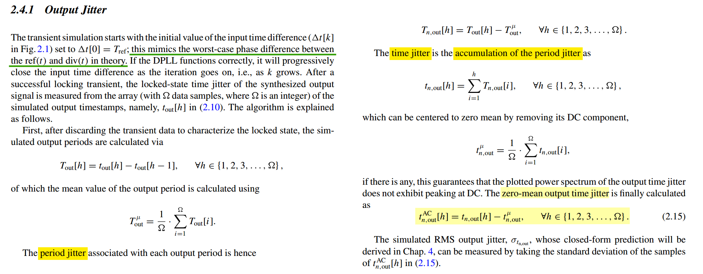


---


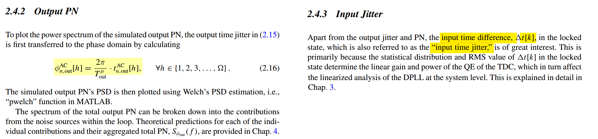


```matlab
%% Wang, Xu and Michael Peter Kennedy. “Jitter and Spur Minimization in Fractional-N Digital Frequency Synthesizers - Modeling, Simulation, Analysis, and Design Methodologies.” *Analog Circuits and Signal Processing* (2026).

function [F_mean,t_n_rms,phi_n_rms,f_PSD,PSD_phi] = acquisition(t)
%% Ensure column vector
[~,ncol]=size(t);
if ncol ~= 1
t = t';
end
%% Periods
T          = diff(t);
%% Average period
T_mean     = mean(T);
F_mean     = 1/T_mean;
%% Period jitter
T_n        = T - T_mean;
%% Zero-mean accumulated time jitter
t_n        = cumsum(T_n);
t_n        = t_n - mean(t_n);
%% RMS time jitter
t_n_rms    = std(t_n);
%% Phase error
phi_n      = 2*pi/T_mean * t_n;
phi_n_rms  = std(phi_n);
%% PSD of phase error
npsd = 2^(nextpow2(length(phi_n)/8)-1);
Fpsd = 1/(npsd*T_mean);
f_PSD = 0:Fpsd:Fpsd*(floor(npsd/2)-1);
[PSD_phi,~] = pwelch(phi_n,window(@hann,npsd),npsd/2,npsd,1/T_mean, 'two-sided');
PSD_phi = PSD_phi(1:floor(npsd/2));
```


### cross-domain scaling for PSD-consistent

> N. Da Dalt, "Linearized Analysis of a Digital Bang-Bang PLL and Its Validity Limits Applied to Jitter Transfer and Jitter Generation," in IEEE Transactions on Circuits and Systems I: Regular Papers, vol. 55, no. 11, pp. 3663-3675, Dec. 2008 [[https://sci-hub.st/10.1109/TCSI.2008.925948](https://sci-hub.st/10.1109/TCSI.2008.925948)]
>
> —, “Theory and implementation of digital bang-bang frequency synthesizers for high speed serial data communications,” Ph.D. dissertation, RWTH Aachen University, Aachen, Germany, 2007. [[https://publications.rwth-aachen.de/record/62439/files/DaDalt_Nicola.pdf](https://publications.rwth-aachen.de/record/62439/files/DaDalt_Nicola.pdf)]
>
> H. Lu and P. P. Mercier, "Linear Periodically Time-Variant Digital PLL Phase Noise Modeling Using Conversion Matrices and Uncorrelated Upsampling," in *IEEE Transactions on Circuits and Systems I: Regular Papers*, vol. 71, no. 12, pp. 6021-6033, Dec. 2024, doi: 10.1109/TCSI.2024.3415001

At low frequencies, the transfer function from $t_{r}$ to $T_{v}$ can be approximated as:
$$
H_{t_r,T_v} \approx \frac{1-z^{-1}}{Nz^{-1}}
$$

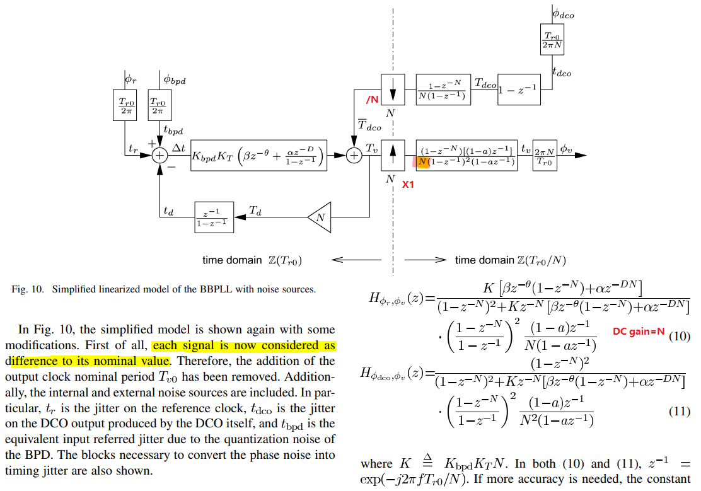

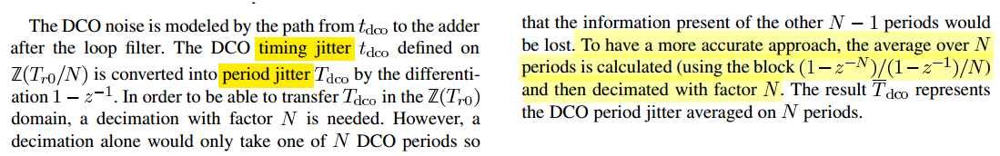


$$
\boxed{ \text{For deriving Eq. (10), the }\uparrow N\text{ block must be treated as unity-amplitude rate conversion} }
$$

The statement

$$
\uparrow N_{\text{Da Dalt}}=N\,\uparrow N_{\text{standard}}
$$

**cannot be inserted as a scalar gain $N$ when deriving Eq. (10)**. If we do that, the explicit $1/N$ in Fig. 10 cancels:

$$
N\times \frac1N=1
$$

and Eq. (10) would become $N$ times larger. Its DC phase gain would then be $N^2$, instead of the correct $N$.


---


|                       | $H_{t_r,t_v}(1)$ | correct for                                                  |
| --------------------- | ---------------- | ------------------------------------------------------------ |
| without $1/N$         | $N$              | <span style="background-color:yellow">tracing **waveforms**</span>, step responses |
| with $1/N$ — Eq. (10) | $1$              | <span style="background-color:yellow">**PSD** via (9), variance via (13)</span> |

Da Dalt only ever uses the second. Hence the printed $1/N$.


Equation (10) is never used to trace a waveform, while exists to be squared and multiplied into a spectrum, via (9):

$$
S_{\phi_v}(f) = \left|H_{\phi_r,\phi_v}(f)\right|^2\cdot\left(S_{\phi_r}+S_{\phi_{\mathrm{bpd}}}(f)\right) + \left|H_{\phi_{\mathrm{dco}},\phi_v}(f)\right|^2 S_{\phi_{\mathrm{dco}}}(f)
$$

and to be integrated for jitter variance in (13). Both uses require a <span style="background-color:yellow">PSD-consistent transfer function</span>, and for a slow-in/fast-out path that is **not** the same as the transform ratio.

Write the **cross-domain path** as

$$
y[n] = \sum_k h[n-kN]\,x[k]
$$

with $x$ **zero-mean**, <span style="color:blue">**white**</span>, and of variance $\sigma^2$ on the slow grid $T_{r0}$, and with real-valued $h$. Then

$$
E\{y^2[n]\} = \sigma^2\sum_k h^2[n-kN]
$$

The variance is $N$-periodic, but it need not differ between output phases. The output is generally **cyclostationary**; even when its variance is constant, its autocorrelation can depend on $n\bmod N$.

Averaging the variance over $N$ fast samples:
$$
\overline{\sigma_y^2} = \frac{\sigma^2}{N}\sum_j h^2[j]
$$


Now demand the ordinary form
$$
S_y = c\,|H|^2 S_x
$$

With the paper's convention $S_x(f) = T_{r0}\sigma^2$, integrating over the fast Nyquist band $F = N/T_{r0}$ and applying Parseval $\int_{-F/2}^{F/2}|H|^2\,df = F\sum_j h^2[j]$:

$$
\overline{\sigma_y^2} = c\,T_{r0}\sigma^2\cdot\frac{N}{T_{r0}}\sum_j h^2[j]
\quad\Longrightarrow\quad \textcolor{red}{c = \frac{1}{N^2}}
$$

Finally

$$
\boxed{\;S_y(f) = \frac{|H|^2}{N^2}\,S_x(f)\;}
$$

So the transfer function you may legitimately plug into $S_y = |H|^2 S_x$ is $\textcolor{red}{H/N}$, not $H$. **That is equation (10)**

For the hold stage alone, $H_{\mathrm{ZOH}}(z)=(1-z^{-N})/(1-z^{-1})$, whose impulse response is rectangular. For the complete cross-domain path, $h$ denotes the full effective impulse response.

The root cause in one line: $S_x$ is normalized on $T_{r0}$ while $S_y$ is normalized on $T_{v0} = T_{r0}/N$. The $1/N$ reconciles the two normalizations.


---


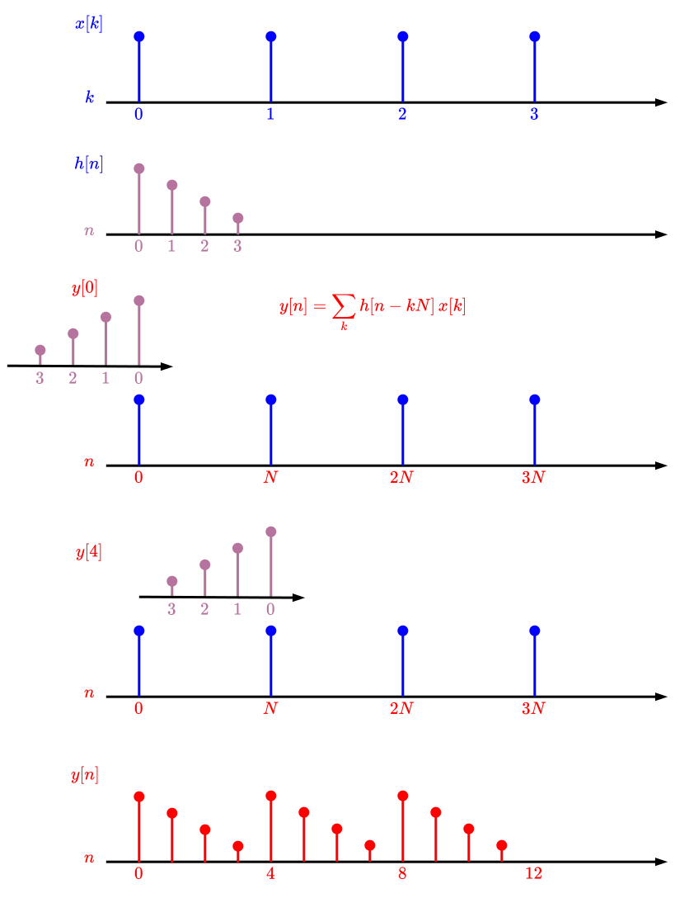

Assume real-valued $h$ and **zero-mean** white input:

$$
E\{x[k]\}=0,\qquad
E\{x[k]x[\ell]\}=\sigma^2\delta_{k\ell}.
$$

Here $k$ indexes slow samples, while $n$ indexes fast samples; one slow interval contains $N$ fast samples.

Starting from

$$
y[n]=\sum_k h[n-kN]x[k],
$$

we have $E\{y[n]\}=0$, so its variance equals its second moment. Expanding the square:

$$
\begin{aligned}
\operatorname{Var}(y[n])
&=E\!\left\{
\left(\sum_k h[n-kN]x[k]\right)
\left(\sum_\ell h[n-\ell N]x[\ell]\right)
\right\}\\
&=\sum_k\sum_\ell h[n-kN]h[n-\ell N]\,
E\{x[k]x[\ell]\}\\
&=\boxed{\sigma^2\sum_k h^2[n-kN]}.
\end{aligned}
$$

Every term with $k\ne\ell$ vanishes because distinct input samples are uncorrelated. Independence is unnecessary.

Write $n=qN+r$, where $r\in\{0,\ldots,N-1\}$. Then

$$
\operatorname{Var}(y[qN+r])
=\sigma^2\sum_k h^2[r-(k-q)N]
=\sigma^2\sum_m h^2[r-mN].
$$

The result depends only on the phase $r$, not the period number $q$.

Thus, at each output phase, the variance uses only the filter coefficients whose indices have that particular remainder modulo $N$.

Take the arithmetic average of these $N$ phase variances:

$$
\overline{\sigma_y^2}
=\frac1N\sum_{r=0}^{N-1}\operatorname{Var}(y[r])
=\frac{\sigma^2}{N}
\sum_{r=0}^{N-1}\sum_k h^2[r-kN].
$$

Every integer $j$ has exactly one representation

$$
j=r-kN,\qquad 0\le r<N.
$$

Consequently, the double sum includes every $h^2[j]$ exactly once:

$$
\boxed{\overline{\sigma_y^2}
=\frac{\sigma^2}{N}\sum_j h^2[j]}.
$$

This is the **average of the variances**, not the variance of an averaged output signal.


---

---


$$
\boxed{\text{Physically: zero stuff }T_v\rightarrow\text{ZOH}\rightarrow\text{accumulate; no }1/N}
$$


Because $f_{\mathrm{mod}} = 1\,\mathrm{kHz}$ is near DC relative to the loop bandwidth, you should get approximately
$$
j_v(t) \approx j_r(t)
$$

and therefore

$$
\frac{A_{\mathrm{out}}}{A_{\mathrm{in}}} \approx 1
$$

or

$$
20\log_{10}\left|\frac{J_v}{J_r}\right| \approx 0\,\mathrm{dB}.
$$

Here $J_v$ and $J_r$ are the Fourier components of the output and reference timing jitter at $f_{\mathrm{mod}}$.

At the same time,

$$
\Delta t = j_r - j_v \approx 0.
$$

[[Github Gist — dpll_in_out.py](https://gist.github.com/raytroop/f28d1f32f1b64230efa1682abbbeca48)]

```python
# ============================================================
# DCO OUTPUT TIMESTAMPS
#
# The DLF output is held for N DCO cycles.
# ============================================================

# DCO period error due to loop control
dTctrl = (KT * u)

# Total DCO period error for every fast-clock cycle
dT = np.repeat(dTctrl, N)

# Limit to exactly Nsim*N DCO cycles
dT = dT[:Nsim * N]

# Accumulate timing error
jv_fast = np.concatenate(
    ([0.0], np.cumsum(dT))
)

# ------------------------------------------------------------
# Actual DCO timestamps
# ------------------------------------------------------------
hdco = np.arange(Nsim * N + 1)

tv = hdco * Tv0 + jv_fast

# ============================================================
# OUTPUT JITTER FROM tv
#
# jv[h] = tv[h] - h*Tv0
# ============================================================
jv_from_tv = tv - hdco * Tv0
```

So, specifically for Python model:

$$
\boxed{ \texttt{np.repeat(x,N)} = \uparrow N+ \frac{1-z^{-N}}{1-z^{-1}} }
$$


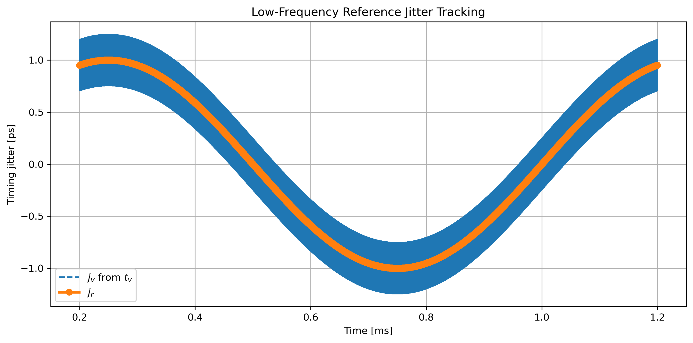

```
============================================================
DPLL LOW-FREQUENCY INPUT JITTER TEST
============================================================
Reference frequency        : 100.000 MHz
DCO frequency              : 2.400 GHz
Frequency division         : 24

Input jitter frequency     : 1000.000 Hz
Input jitter amplitude     : 1.004880 ps

Output jitter amplitude    : 1.004533 ps
Residual error amplitude   : 0.015916 ps

|Jv/Jr|                    : 0.99965447
Jv/Jr gain                 : -0.003002 dB

Input RMS jitter           : 708.703382 fs
Output RMS jitter          : 729.245449 fs
Residual RMS error         : 172.582105 fs

|Error/Jr|                 : 1.583866e-02
Error transfer gain        : -36.006 dB
============================================================
```


### !!DPLL time-domain model

> L. Avallone, M. Mercandelli, A. Santiccioli, M. P. Kennedy, S. Levantino and C. Samori, "A Comprehensive Phase Noise Analysis of Bang-Bang Digital PLLs," in IEEE Transactions on Circuits and Systems I: Regular Papers, vol. 68, no. 7, pp. 2775-2786, July 2021 [[https://sci-hub.st/10.1109/TCSI.2021.3072344](https://sci-hub.st/10.1109/TCSI.2021.3072344)]
>
> —, “Contributions to the Theory and Development of Low-Jitter Bang-Bang Integrated Frequency Synthesizers.” University College Dublin. School of Electrical and Electronic Engineering, 2022. [[http://hdl.handle.net/10197/13372](http://hdl.handle.net/10197/13372)]


The paper defines the BPD input as

$$
\boxed{\Delta t[k]=t_r[k]-t_d[k]}
$$

where $t_r[k]$ is the reference-edge timestamp and $t_d[k]$ is the divider-output timestamp.


The signal chain is essentially
$$
\epsilon[k] \rightarrow \underbrace{\beta\epsilon[k]+\psi[k]}_{u[k]} \rightarrow \underbrace{K_T u[k]}_{\text{DCO period change}} \rightarrow T_v.
$$

A useful distinction is that $K_T$ is **not the usual DCO frequency gain $K_{\mathrm{DCO}}$ in Hz/code**. This paper models the DCO in the **period domain**, so its gain is *period/code*. Around the nominal operating point, $f=\frac{1}{T}$

hence for a small period change,

$$
\Delta f \approx -\frac{\Delta T}{T_0^2}.
$$

Therefore the corresponding frequency gain would be approximately

$$
\boxed{ K_{\mathrm{DCO}} \approx -\frac{K_T}{T_0^2} = -K_T f_v^2 }
$$

in *Hz/code*. The minus sign means increasing the period lowers the frequency.


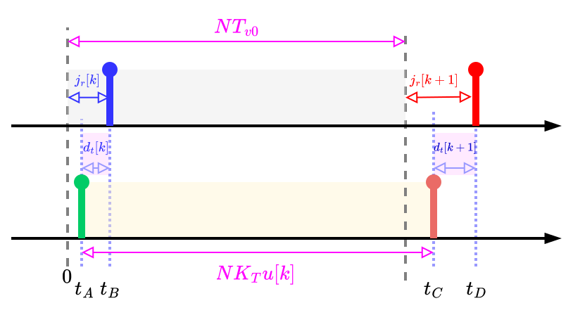

with $t_A = t_B - d_t[k]=j_r[k]-d_t[k]$
$$
t_C = t_A + NT_{v0}+NK_T u[k]+W_v[k] = j_r[k]-d_t[k] +  NT_{v0}+NK_T u[k]+W_v[k]
$$
with $t_D = N T_{v0} + j_r[k+1]$
$$
\textcolor{red}{d_t[k+1]} = t_D - t_C = \textcolor{red}{\boxed{d_t[k] + (j_r[k+1] - j_r[k]) -  NK_T u[k]-W_v[k]}}
$$


```matlab
%% DPLL parameters from the paper
fr    = 100e6;
N     = 24;
fv    = N*fr;
Tv0   = 1/fv;             % nominal free-running DCO period [s]

beta  = 70;
alpha = beta/2^8;

KT = 0.145e-15;          % [s/bit]

df = 1e6;                % DCO PN specified at 1 MHz

%% Table-I cases
%           Ref PN       DCO PN @ 1 MHz
cases = [   -155,        -Inf;
            -Inf,        -108;
            -155,        -108;
            -150,        -108;
            -155,        -103];

Nsim  = 1e6;
Nburn = 2e4;


rng(1);

sigma_sim = zeros(size(cases,1),1);

for icase = 1:size(cases,1)

    Lref = cases(icase,1);
    Ldco = cases(icase,2);

    %% ------------------------------------------------------------
    % Reference white phase noise -> absolute timestamp jitter
    %% ------------------------------------------------------------
    if isinf(Lref)
        sigma_ref = 0;
    else
        Sphi_ref = 10^(Lref/10);

        sigma_ref = sqrt( ...
            Sphi_ref/(4*pi^2*fr) );
    end

    %% ------------------------------------------------------------
    % DCO 1/f^2 phase noise -> DCO cycle jitter
    % Eq. (15)
    %% ------------------------------------------------------------
    if isinf(Ldco)
        sigma_Tv = 0;
    else
        Sphi_dco = 10^(Ldco/10);

        sigma_Tv = sqrt( ...
            Sphi_dco * df^2 / fv^3 );
    end

    fprintf('\nCase %d\n',icase);
    fprintf('sigma_ref = %.3f fs\n',sigma_ref/1e-15);
    fprintf('sigma_Tv  = %.3f fs\n',sigma_Tv/1e-15);

    %% Reference absolute jitter
    jr = sigma_ref * randn(Nsim+1,1);

    %% DCO cycle-period errors at the fast clock rate
    %
    % Tv(:,k) holds the N zero-mean period-noise samples in reference
    % interval k.  Their sum is the Wv[k] term in the reference-rate
    % recursion.  Keeping the individual samples makes it possible to
    % construct the path-consistent DCO timestamps tv[h] from Eq. (4).
    %
    if sigma_Tv == 0
        Tv = [];
        Wv = zeros(Nsim,1);
    else
        Tv = sigma_Tv*randn(N,Nsim);
        Wv = sum(Tv,1).';
    end

    %% ------------------------------------------------------------
    % Bang-bang DPLL
    %% ------------------------------------------------------------

    dt  = zeros(Nsim+1,1);
    u   = zeros(Nsim,1);
    psi = 0;

    % t_r[0] - t_d[0]
    dt(1) = jr(1);  % or w/ Zero-initialization

    for k = 1:Nsim

        %% Binary phase detector
        if dt(k) >= 0
            epsilon = +1;
        else
            epsilon = -1;
        end

        %% Integral path
        psi = psi + alpha*epsilon;

        %% PI loop-filter output
        u(k) = beta*epsilon + psi;

        %% Time-error recursion
        dt(k+1) = dt(k) ...
                + (jr(k+1)-jr(k)) ...	% absolute jitter to period jitter
                - N*KT*u(k) ...
                - Wv(k);

    end

    %% ------------------------------------------------------------
    % DCO-output timestamps, Eq. (4)
    %% ------------------------------------------------------------
    % The DLF output is zero-order held for N DCO cycles.  Add that
    % control contribution to the SAME fast-rate noise samples whose
    % block sums drove the recursion above.  Accumulate the period error
    % first so nominal-period roundoff cannot mask femtosecond jitter.
    dTctrl = (KT*u).';
    if isempty(Tv)
        Tv = repmat(dTctrl,N,1);
    else
        for m = 1:N
            Tv(m,:) = Tv(m,:) + dTctrl;
        end
    end
    % Reuse Tv for the accumulated timing error to limit the peak to
    % roughly two full DCO-rate traces during the leading-zero prepend.
    clear Wv u dTctrl
    Tv = cumsum(Tv(:));             % t_v[h] - h*Tv0, h = 1,...,N*Nsim
    tv = [0; Tv];                   % include t_v[0]
    clear Tv

    % Form literal edge timestamps without cumulatively adding Tv0.
    % Chunking avoids another full-size temporary vector.
    Ndco = N*Nsim;
    edge_chunk = 1e6;
    for h0 = 0:edge_chunk:Ndco
        h1 = min(h0+edge_chunk-1,Ndco);
        h = (h0:h1).';
        idx = h+1;
        tv(idx) = tv(idx) + h*Tv0;
    end


    %% Remove startup transient
    dt_ss = dt(Nburn+1:end);

    sigma_sim(icase) = std(dt_ss);

end

%% Results
fprintf('\n------------------------------------------\n');
fprintf('Case       sigma_Dt [fs]\n');
fprintf('------------------------------------------\n');

for k = 1:length(sigma_sim)
    fprintf('(%c)        %8.2f\n', ...
        'a'+k-1, sigma_sim(k)/1e-15);
end

```


There are two different random sequences:
$$
\boxed{j_r[k] = \text{absolute reference edge jitter}}
$$

versus

$$
\boxed{\delta T_r[k]=j_r[k+1]-j_r[k] =\text{reference period jitter}}.
$$

Our simulation generates

```
jr = sigma_ref * randn(...);
```

because the paper assumes **white absolute reference jitter**. The paper explicitly calls $\sigma_{t_r}^2$ the *absolute jitter variance of the reference*. 

Then the model naturally converts that absolute jitter into reference-period variation using

```
jr(k+1) - jr(k)
```

There is also a subtle but important consequence. If $j_r[k]\sim\mathcal N(0,\sigma_{t_r}^2)$ is i.i.d., then $\operatorname{Var}\{j_r[k+1]-j_r[k]\} = 2\sigma_{t_r}^2.$

But consecutive period errors are **correlated**:

$$
\operatorname{Cov} \left( j_r[k+1]-j_r[k], j_r[k+2]-j_r[k+1] \right) = -\sigma_{t_r}^2.
$$

So you should **not** replace the code with independent samples such as

```
djr = sqrt(2)*sigma_ref*randn(...);
```

because that gets the variance right but loses the required correlation.

In short:

$$
\boxed{ \texttt{jr[k]}=\text{edge jitter} \quad\Rightarrow\quad \texttt{jr[k+1]-jr[k]}=\text{period jitter} }
$$

and the DPLL recursion evolves from **one edge interval to the next**, which is why the difference appears.


---

$\boxed{\sigma_{\Delta t}}$ at the **BPD input**, not directly the RMS DCO-output jitter. To obtain actual DCO-output jitter, we should also simulate/store $t_v[h]$, rather than only the reference-rate recursion for $\Delta t[k]$.


## reference

Wang, Xu and Michael Peter Kennedy. “Jitter and Spur Minimization in Fractional-N Digital Frequency Synthesizers - Modeling, Simulation, Analysis, and Design Methodologies.” *Analog Circuits and Signal Processing* (2026).

Brandonisio, F., & Kennedy, M. P. (2014). *Noise-Shaping All-Digital Phase-Locked Loops: Modeling, Simulation, Analysis and Design*. Springer. 

Staszewski, Robert Bogdan and Poras T. Balsara. “All-digital frequency synthesizer in deep-submicron CMOS.” (2006).

---

Topics in IC (Wireline Transceiver Design) [[https://ocw.snu.ac.kr/sites/default/files/NOTE/Lec%203%20-%20ADPLL.pdf](https://ocw.snu.ac.kr/sites/default/files/NOTE/Lec%203%20-%20ADPLL.pdf)]

Michael H. Perrott, ISSCC 2008 Tutorial on Digital Phase-Locked Loops 

—, CICC 2009 Tutorial on Digital Phase-Locked Loops [[https://www.cppsim.com/PLL_Lectures/digital_pll_cicc_tutorial_perrott.pdf](https://www.cppsim.com/PLL_Lectures/digital_pll_cicc_tutorial_perrott.pdf)]

Robert Bogdan Staszewski,  CICC 2020:  Beyond All-Digital PLL for RF and Millimeter-Wave Frequency Synthesis [[link](https://www.researchgate.net/profile/Yizhe-Hu/publication/342702810_Beyond_All-Digital_PLL_for_RF_and_Millimeter-Wave_Frequency_Synthesis/links/5f02305692851c52d619ce21/Beyond-All-Digital-PLL-for-RF-and-Millimeter-Wave-Frequency-Synthesis.pdf)]

Akihide Sai, ISSCC 2023 T5: All-digital PLLs From Fundamental Concepts to Future Trends 

Mike Shuo-Wei Chen, CICC 2020 ES2-3: Low-Spur PLL Architectures and Techniques [[https://youtu.be/sgPDchYhN-4](https://youtu.be/sgPDchYhN-4)]

S. Levantino, "Digital phase-locked loops," 2018 IEEE Custom Integrated Circuits Conference (CICC), San Diego, CA, USA, 2018

Saurabh Saxena, IIT Madras. Phase-Locked Loops: Noise Analysis in Digital PLL [[https://youtu.be/mddtxcqfiKU](https://youtu.be/mddtxcqfiKU)]

---

Neil Robertson. Digital PLL's -- Part 1 [[https://www.dsprelated.com/showarticle/967.php](https://www.dsprelated.com/showarticle/967.php)]

—. Digital PLL's -- Part 2 [[https://www.dsprelated.com/showarticle/973.php](https://www.dsprelated.com/showarticle/973.php)]

—. Digital PLL's -- Part 3 [[https://www.dsprelated.com/showarticle/1177.php](https://www.dsprelated.com/showarticle/1177.php)]

Daniel Boschen. GRCon24 - Quick Start on Control Loops with Python Workshop [[video](https://youtu.be/RxQWk1PjJLQ), [slides](https://events.gnuradio.org/event/24/contributions/599/)]

---

M. Zanuso, D. Tasca, S. Levantino, A. Donadel, C. Samori and A. L. Lacaita, "Noise Analysis and Minimization in Bang-Bang Digital PLLs," in IEEE Transactions on Circuits and Systems II: Express Briefs, vol. 56, no. 11, pp. 835-839, Nov. 2009 [[https://sci-hub.st/10.1109/TCSII.2009.2032470](https://sci-hub.st/10.1109/TCSII.2009.2032470)]

N. Da Dalt, "Markov Chains-Based Derivation of the Phase Detector Gain in Bang-Bang PLLs," in IEEE Transactions on Circuits and Systems II: Express Briefs, vol. 53, no. 11, pp. 1195-1199, Nov. 2006 [[https://sci-hub.st/10.1109/TCSII.2006.883197](https://sci-hub.st/10.1109/TCSII.2006.883197)]

—, "A design-oriented study of the nonlinear dynamics of digital bang-bang PLLs," in *IEEE Transactions on Circuits and Systems I: Regular Papers*, vol. 52, no. 1, pp. 21-31, Jan. 2005 [[https://sci-hub.se/10.1109/TCSI.2004.840089](https://sci-hub.se/10.1109/TCSI.2004.840089)]

—, "Theory and Implementation of Digital Bang-Bang Frequency Synthesizers for High Speed Serial Data Communications", PhD Dissertation, RWTH Aachen University, Aachen, North Rhine-Westphalia, Germany, 2007 [[pdf](https://publications.rwth-aachen.de/record/62439/files/DaDalt_Nicola.pdf)]

