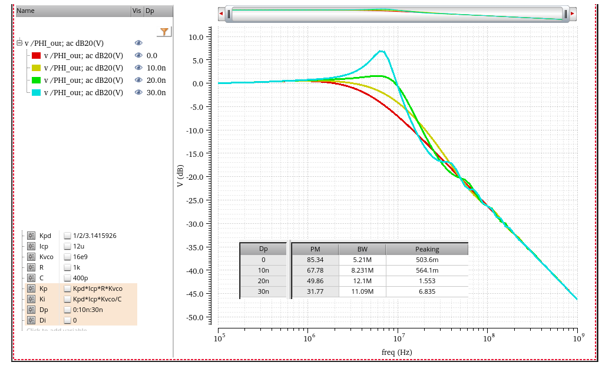

## Hunting Jitter

 ***Hunting jitter*** is often referred to as ***dithering jitter***, the time error between *data clock* and input data

---

where the proportional gain ($K_P$), *heavily damped systems* means that $K_P \gg K_I$

> N. Da Dalt, "A design-oriented study of the nonlinear dynamics of digital bang-bang PLLs," in *IEEE Transactions on Circuits and Systems I: Regular Papers*, vol. 52, no. 1, pp. 21-31, Jan. 2005 [[https://sci-hub.se/10.1109/TCSI.2004.840089](https://sci-hub.se/10.1109/TCSI.2004.840089)]
>
> S. Jang, S. Kim, S. -H. Chu, G. -S. Jeong, Y. Kim and D. -K. Jeong, "An Optimum Loop Gain Tracking All-Digital PLL Using Autocorrelation of Bang–Bang Phase-Frequency Detection," in IEEE Transactions on Circuits and Systems II: Express Briefs, vol. 62, no. 9, pp. 836-840, Sept. 2015 [[https://sci-hub.st/10.1109/TCSII.2015.2435691](https://sci-hub.st/10.1109/TCSII.2015.2435691)]
>
> Deog-Kyoon Jeong. Topics in IC (Wireline Transceiver Design). Lec 6 - Clock and Data Recovery [[https://ocw.snu.ac.kr/sites/default/files/NOTE/Lec%206%20-%20Clock%20and%20Data%20Recovery.pdf](https://ocw.snu.ac.kr/sites/default/files/NOTE/Lec%206%20-%20Clock%20and%20Data%20Recovery.pdf)]
>
> Hae-Chang Lee, "An Estimation Approach To Clock And Data Recovery" [[https://www-vlsi.stanford.edu/people/alum/pdf/0611_HaechangLee_Phase_Estimation.pdf](https://www-vlsi.stanford.edu/people/alum/pdf/0611_HaechangLee_Phase_Estimation.pdf)]
>
> CC Chen. Why Hunting Jitter Happens in CDR: The Role of Input Jitter and Latency? [[https://youtu.be/hPDielPsFgY](https://youtu.be/hPDielPsFgY)]
>
> P. K. Hanumolu, M. G. Kim, G. -y. Wei and U. -k. Moon, "A 1.6Gbps Digital Clock and Data Recovery Circuit," *IEEE Custom Integrated Circuits Conference 2006* [[https://sci-hub.se/10.1109/CICC.2006.320829](https://sci-hub.se/10.1109/CICC.2006.320829)]
>
> Hanumolu, Pavan Kumar. 2006. *Design Techniques for Clocking High Performance Signaling Systems.* : Oregon State University. [[https://ir.library.oregonstate.edu/concern/graduate_thesis_or_dissertations/1v53k219r](https://ir.library.oregonstate.edu/concern/graduate_thesis_or_dissertations/1v53k219r)]
>
> Walker, Richard. (2003). Designing Bang-Bang PLLs for Clock and Data Recovery in Serial Data Transmission Systems. [[paper](https://www.omnisterra.com/walker/pdfs.papers/BBPLL.pdf),[slides](https://www.omnisterra.com/walker/pdfs.talks/bctm2.maker.pdf)]

## limit-cycle

***limit cycle***, ***cycle slip*** 

> 

> Deog-Kyoon Jeong. Topics in IC (Wireline Transceiver Design). Lec 3 - All-Digital PLL [[https://ocw.snu.ac.kr/sites/default/files/NOTE/Lec%203%20-%20ADPLL.pdf](https://ocw.snu.ac.kr/sites/default/files/NOTE/Lec%203%20-%20ADPLL.pdf)]
>
> High-Speed Circuits and Systems Lab. Yonsei University. High-speed Serial Interface ***2013***. ***Lect. 16 – Clock and Data Recovery 3***

## TDC (Time-to-Digital Converter)

*TODO* &#128197;

## BB PD

> It's **ternary**, because *early*, *late* and *no transition*

### Linearing BB-PD

BB Gain is the slope of average BB output $\mu$, versus phase offset $\phi$, i.e. $\frac {\partial \mu}{\partial \phi}$,

BB only produces output for a transition and this de-rates the gain. Transition density = *0.5* for random data

$$
K_{BB} = \frac{1}{2}\frac {\partial \mu}{\partial \phi}
$$

where $\mu = (1)\times \mathrm{P}(\text{late}|\phi) + (-1)\times \mathrm{P}(\text{early}|\phi)$

> Both jitter and amplitude noise distribution are same, just scaled by slope 

### Self-Noise Term

One price we pay for ***BB PD*** versus ***linear PD*** is the self-noise term. **For** **small phase errors** BB output noise is the **full magnitude** of the sliced data

> The PD output should be almost **0** for small phase errors. i.e. ideal PD output noise should be **0**

$$
\sigma_{BB}^2 = 1^2 \cdot \mathrm{P}(\text{trans}) + 0^2\cdot (1-\mathrm{P}(\text{trans})) = 0.5
$$

**Input referred jitter** from BB PD is **proportional to incoming jitter**

> John T. Stonick, ISSCC 2011 TUTORIALS *T5: DPLL-Based Clock and Data Recovery*
>
> Walker, Richard. (2003). Designing Bang-Bang PLLs for Clock and Data Recovery in Serial Data Transmission Systems.  [[pdf](https://www.omnisterra.com/walker/pdfs.papers/BBPLL.pdf)]
>
> \- Clock and Data Recovery for Serial Data Communications, focusing on bang-bang CDR design methodology, ISSCC Short Course, February 2002. [[slides](https://www.omnisterra.com/walker/pdfs.talks/ISSCC2002.pdf)]

## CDR Loop Latency

> Amir Amirkhany. ISSCC 2019 "Basics of Clock and Data Recovery Circuits"
>
> CC Chen. Why A Low Loop Latency in A CDR Design? [[https://youtu.be/io9WZbhlahU](https://youtu.be/io9WZbhlahU)]
>
> —. Why Understanding and Optimizing Loop Latency for A CDR Design? [[https://youtu.be/Jyy18865jv8](https://youtu.be/Jyy18865jv8)]

---

---

loop latency is represented as $e^{-sD}$ in linear model

---

### Sensitivity to Loop Latency

---

### Optimizing Loop Latency

*TODO* &#128197;

> CC Chen. Circuit Image: Why Understanding and Optimizing Loop Latency for A CDR Design? [[https://youtu.be/Jyy18865jv8?si=uY2HUV8mERLterwH](https://youtu.be/Jyy18865jv8?si=uY2HUV8mERLterwH)]

## DT & CT Spectral Density

---

[[Sampling of WSS process of Systems, Modulation and Noise](https://raytroop.github.io/2024/05/25/comm/#sampling-of-wss-process)]

That is
$$
P_{x_s x_s} (f)= \frac{1}{T_s}P_{xx}(f)
$$
In going from *discrete* time to *continuous* time,  we must add a scale factor $1/T$, the sample period

---

## TDC quantization noise

## reference

Sam Palermo, ECEN620 2024 Lecture 9: Digital PLLs [[https://people.engr.tamu.edu/spalermo/ecen620/lecture09_ee620_digital_PLLs.pdf](https://people.engr.tamu.edu/spalermo/ecen620/lecture09_ee620_digital_PLLs.pdf)]

Topics in IC(Wireline Transceiver Design) [[https://ocw.snu.ac.kr/sites/default/files/NOTE/Lec%203%20-%20ADPLL.pdf](https://ocw.snu.ac.kr/sites/default/files/NOTE/Lec%203%20-%20ADPLL.pdf)]

ISSCC 2008 Tutorial on Digital Phase-Locked Loops Michael H. Perrott [[https://www.nishanchettri.com/isscc-slides/2008%20ISSCC/Tutorials/T05_Pres.pdf](https://www.nishanchettri.com/isscc-slides/2008%20ISSCC/Tutorials/T05_Pres.pdf)]

CICC 2009 Tutorial on Digital Phase-Locked Loops Michael H. Perrott [[https://www.cppsim.com/PLL_Lectures/digital_pll_cicc_tutorial_perrott.pdf](https://www.cppsim.com/PLL_Lectures/digital_pll_cicc_tutorial_perrott.pdf)]

Robert Bogdan Staszewski,  CICC 2020:  Beyond All-Digital PLL for RF and Millimeter-Wave Frequency Synthesis [[link](https://www.researchgate.net/profile/Yizhe-Hu/publication/342702810_Beyond_All-Digital_PLL_for_RF_and_Millimeter-Wave_Frequency_Synthesis/links/5f02305692851c52d619ce21/Beyond-All-Digital-PLL-for-RF-and-Millimeter-Wave-Frequency-Synthesis.pdf)]

Akihide Sai, ISSCC 2023 T5: All-digital PLLs From Fundamental Concepts to Future Trends [[https://www.nishanchettri.com/isscc-slides/2023%20ISSCC/TUTORIALS/T5.pdf](https://www.nishanchettri.com/isscc-slides/2023%20ISSCC/TUTORIALS/T5.pdf)]

Mike Shuo-Wei Chen, CICC 2020 ES2-3: Low-Spur PLL Architectures and Techniques [[https://youtu.be/sgPDchYhN-4?si=FAy8N3SuX6vVpYhl](https://youtu.be/sgPDchYhN-4?si=FAy8N3SuX6vVpYhl)]

Saurabh Saxena, IIT Madras. Phase-Locked Loops: Noise Analysis in Digital PLL [[https://youtu.be/mddtxcqfiKU?si=yD15KM9WBkT6c68P](https://youtu.be/mddtxcqfiKU?si=yD15KM9WBkT6c68P)]

---

Y. Hu, T. Siriburanon and R. B. Staszewski, "Multirate Timestamp Modeling for Ultralow-Jitter Frequency Synthesis: A Tutorial," in *IEEE Transactions on Circuits and Systems II: Express Briefs*, vol. 69, no. 7, pp. 3030-3036, July 2022

L. Avallone, M. Mercandelli, A. Santiccioli, M. P. Kennedy, S. Levantino and C. Samori, "A Comprehensive Phase Noise Analysis of Bang-Bang Digital PLLs," in *IEEE Transactions on Circuits and Systems I: Regular Papers*, vol. 68, no. 7, pp. 2775-2786, July 2021

---

Neil Robertson. Digital PLL's -- Part 1 [[https://www.dsprelated.com/showarticle/967.php](https://www.dsprelated.com/showarticle/967.php)]

Neil Robertson. Digital PLL's -- Part 2 [[https://www.dsprelated.com/showarticle/973.php](https://www.dsprelated.com/showarticle/973.php)]

Neil Robertson. Digital PLL's -- Part 3 [[https://www.dsprelated.com/showarticle/1177.php](https://www.dsprelated.com/showarticle/1177.php)]

---

Da Dalt, Nicola. (2009). Linearized Analysis of a Digital Bang-Bang PLL and Its Validity Limits Applied to Jitter Transfer and Jitter Generation. Circuits and Systems I: Regular Papers, IEEE Transactions on. 55. 3663 - 3675. [[https://sci-hub.st/10.1109/TCSI.2008.925948](https://sci-hub.st/10.1109/TCSI.2008.925948)]
