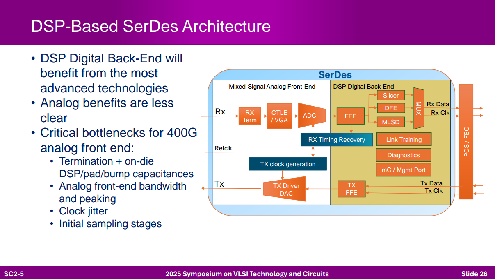
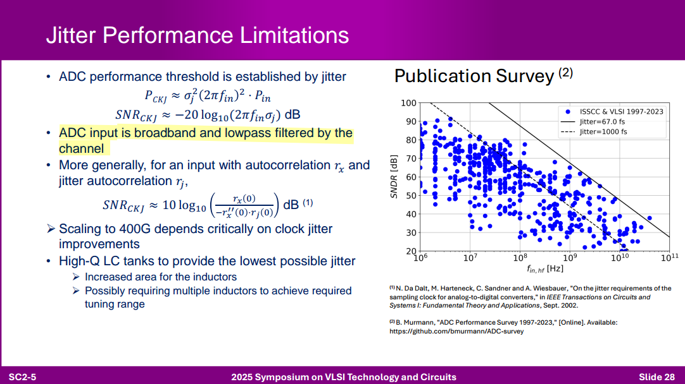
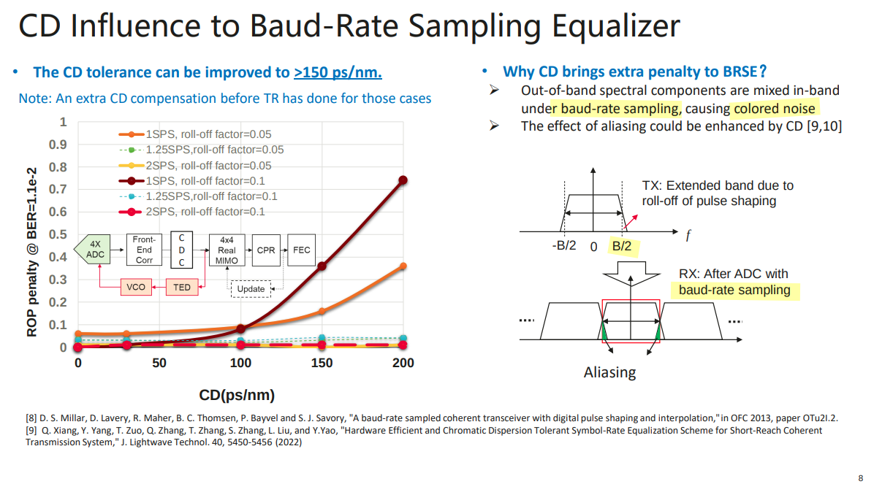
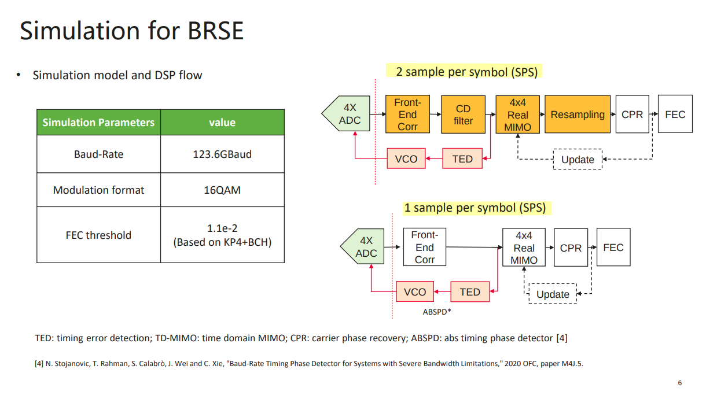
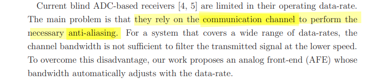
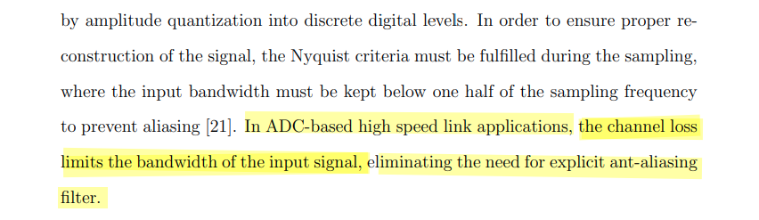

----

## Jitter Performance Limitations

## Aliasing of baud-rate sampling

The most significant impairments are considered to be the sensitivity to sampling phase, and the effect of aliasing out of band signal and noise into the baseband

> 
>
> Tao Gui (Huawei), etc.. IEEE 802.3dj May Interim meeting San Antonio, Texas May 15, 2013: "Feasibility Study on Baud-Rate Sampling and Equalization (BRSE) for 800G-LR1" [[https://www.ieee802.org/3/dj/public/23_05/gui_3dj_01a_2305.pdf](https://www.ieee802.org/3/dj/public/23_05/gui_3dj_01a_2305.pdf)]
>
> D. S. Millar, D. Lavery, R. Maher, B. C. Thomsen, P. Bayvel and S. J. Savory, "A baud-rate sampled coherent transceiver with digital pulse shaping and interpolation,"in OFC 2013 [[https://www.merl.com/publications/docs/TR2013-010.pdf](https://www.merl.com/publications/docs/TR2013-010.pdf)]

---

> Tahmoureszadeh, Tina. Master's Theses (2009 - ): Analog Front-end Design for 2x Blind ADC-based Receivers [[http://hdl.handle.net/1807/29988](http://hdl.handle.net/1807/29988)]

> Shafik, Ayman Osama Amin Mohamed. "Equalization Architectures for High Speed ADC-Based Serial I/O Receivers." PhD diss., 2016. [[https://core.ac.uk/download/79652690.pdf](https://core.ac.uk/download/79652690.pdf)]

## reference

Yohan Frans, CICC2019 ES3-3- "ADC-based Wireline Transceivers" [[pdf](https://ieeexplore.ieee.org/stamp/stamp.jsp?arnumber=8780306)]

Samuel Palermo, ISSCC 2018 T10: ADC-Based Serial Links: Design and Analysis [[https://www.nishanchettri.com/isscc-slides/2018%20ISSCC/TUTORIALS/T10/T10Visuals.pdf](https://www.nishanchettri.com/isscc-slides/2018%20ISSCC/TUTORIALS/T10/T10Visuals.pdf)]

Jhwan Kim, CICC 2022, ES4-4: Transmitter Design for High-speed Serial Data Communications 

Friedel Gerfers, ISSCC2021 T6: Basics of DAC-based Wireline Transmitters [[https://www.nishanchettri.com/isscc-slides/2021%20ISSCC/TUTORIALS/ISSCC2021-T6.pdf](https://www.nishanchettri.com/isscc-slides/2021%20ISSCC/TUTORIALS/ISSCC2021-T6.pdf)]

Tony Chan Carusone, Alphawave Semi. VLSI2025 SC2: Connectivity Technologies to Accelerate AI

---

Tony Pialis, Alphawave Semi. How DSP is Killing the Analog in SerDes [[https://youtu.be/OY2Dn4EDPiA?si=q2Qy_avTIxJjDdOf](https://youtu.be/OY2Dn4EDPiA?si=q2Qy_avTIxJjDdOf)]

Tony Chan Carusone, Alphawave Semi. High Speed Communications Part 3 – Equalization & MLSD [[https://youtu.be/KqwZ23vNqYg?si=pqMFWVVUOrAVhkeU](https://youtu.be/KqwZ23vNqYg?si=pqMFWVVUOrAVhkeU)]

—. High Speed Communications Part 9 – Anatomy of a Modern SerDes [[https://youtu.be/tlc68UTn6iQ?si=ZkqAy3INlA3Vr8Y7](https://youtu.be/tlc68UTn6iQ?si=ZkqAy3INlA3Vr8Y7)]

—. High Speed Communications Part 10 – 224Gbps Link Impairments [[https://youtu.be/m-Msp_2WGAg?si=n5lgrxiz24K7x66a](https://youtu.be/m-Msp_2WGAg?si=n5lgrxiz24K7x66a)]

—. High Speed Communications Part 11 – SerDes DSP Interactions [[https://youtu.be/YIAwLskuVPc?si=1HWB0yA2u2jiixNZ](https://youtu.be/YIAwLskuVPc?si=1HWB0yA2u2jiixNZ)]

