## Number Systems

> Harris, David Money, and Sarah L. Harris. *Digital Design and Computer Architecture*. 2nd ed. Morgan Kaufmann, 2013. [[pdf](https://github.com/last-genius/comp_arch_list/blob/master/books/Digital%20Design%20and%20Computer%20Architecture.%20ARM%20Edition%20by%20Sarah%20Harris%2C%20David%20Harris.pdf)]

***integers***


***rational number***


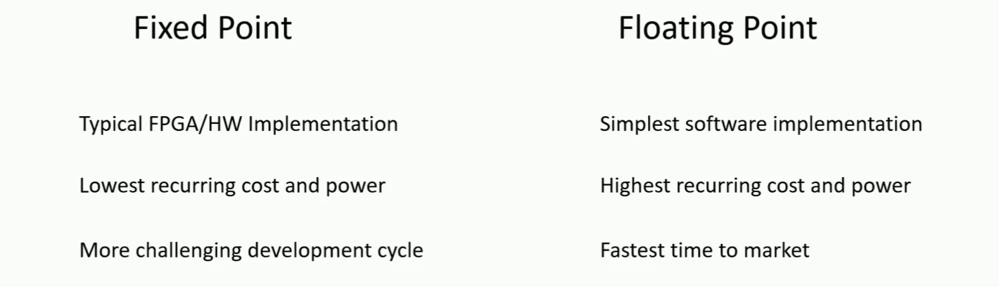


### 2's Complement

> [[https://bpb-us-w2.wpmucdn.com/sites.coecis.cornell.edu/dist/4/81/files/2019/06/4740_lecture23ALU-circuits.pdf](https://bpb-us-w2.wpmucdn.com/sites.coecis.cornell.edu/dist/4/81/files/2019/06/4740_lecture23ALU-circuits.pdf)]


> Google AI Mode [[https://share.google/aimode/KsxxgDF0vAdhAIgm0](https://share.google/aimode/KsxxgDF0vAdhAIgm0)]


---

---

***2's complement negative number***

> Flip all bits then Add **1**

N-bit signed number
$$
A = -M_{N-1}2^{N-1}+\sum_{k=0}^{N-2}M_k2^k
$$
Flip all bits
$$\begin{align}
A_{flip} &= -(1-M_{N-1})2^{N-1} +\sum_{k=0}^{N-2}(1-M_k)2^k \\
&= M_{N-1}2^{N-1}-\sum_{k=0}^{N-2}M_k2^k -2^{N-1}+\sum_{k=0}^{N-2}2^k \\
&= M_{N-1}2^{N-1}-\sum_{k=0}^{N-2}M_k2^k -1
\end{align}$$

Add **1**
$$
A_- = A_{flip}+1 = M_{N-1}2^{N-1}-\sum_{k=0}^{N-2}M_k2^k = -A
$$


### Fixed Point Number


### Floating Point Number

> Dennis Forbes. Understanding Floating-Point Numbers [[https://dennisforbes.ca/blog/features/floating_point/understanding-floating-point-numbers/](https://dennisforbes.ca/blog/features/floating_point/understanding-floating-point-numbers/)]
>
> IEEE Standard for Floating-Point Arithmetic [[https://www-users.cse.umn.edu/~vinals/tspot_files/phys4041/2020/IEEE%20Standard%20754-2019.pdf](https://www-users.cse.umn.edu/~vinals/tspot_files/phys4041/2020/IEEE%20Standard%20754-2019.pdf)]


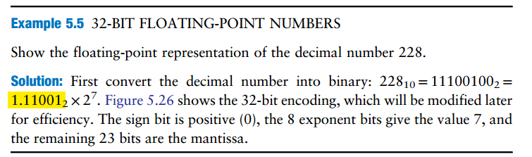

|                                      |                                |                                                              |
| ------------------------------------ | ------------------------------ | ------------------------------------------------------------ |
| **32-bit floating-point version 1**  | store *implicit leading one*   |  |
| **32-bit floating-point version 2**  | discard *implicit leading one* | 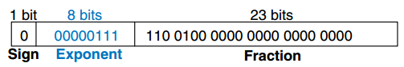 |
| **IEEE 754 floating point notation** | *biased exponent*              | 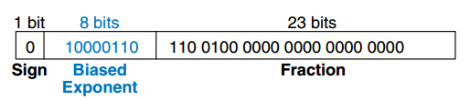 |

> [[https://share.google/aimode/yY2R2EQCTsP9BlMNx](https://share.google/aimode/yY2R2EQCTsP9BlMNx)]

| Format                        | Exponent Bits | Bias (Decimal) | Representable Range |
| ----------------------------- | ------------- | -------------- | ------------------- |
| **Single Precision (32-bit)** | 8             | **127**        | -126 to +127        |
| **Double Precision (64-bit)** | 11            | **1023**       | -1022 to +1023      |

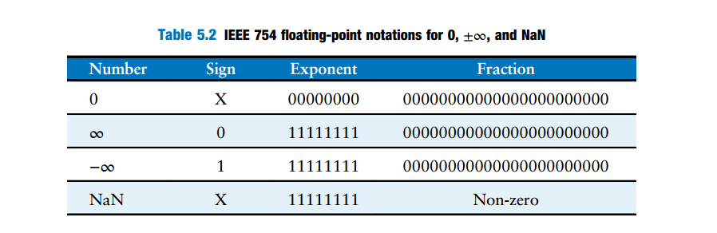


## VLSI Arithmetic

*TODO* &#128197;


## Word-Length Effects

> Tianshuang Qiu; Ying Guo, "7. Finite-Precision Numerical Effects in Digital Signal Processing," in *Signal Processing and Data Analysis* , De Gruyter, 2018, pp.236-248
>
> Antoniou, Andreas. “Digital Signal Processing: Signals, Systems, and Filters.” (2005). [[pdf](https://fmipa.umri.ac.id/wp-content/uploads/2016/03/Andreas-Intoniou-Digital-signal-processing.9780071454247.31527.pdf)]

*TODO* &#128197;


## DFE in digital

> Synopsys Italia, Tech Talk: Introduction to DSP-based SerDes [[https://youtu.be/puEP0DlVZGI](https://youtu.be/puEP0DlVZGI)]
>
> Chen, Kuan-Chang (2022) *Energy-Efficient Receiver Design for High-Speed Interconnects.* Dissertation (Ph.D.), California Institute of Technology. [[https://thesis.library.caltech.edu/14318/9/chen_kuan-chang_2022_thesis_final.pdf](https://thesis.library.caltech.edu/14318/9/chen_kuan-chang_2022_thesis_final.pdf)]

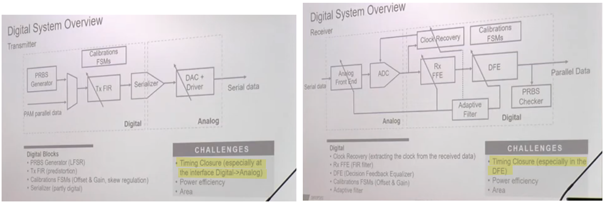

**Parallel implementation**

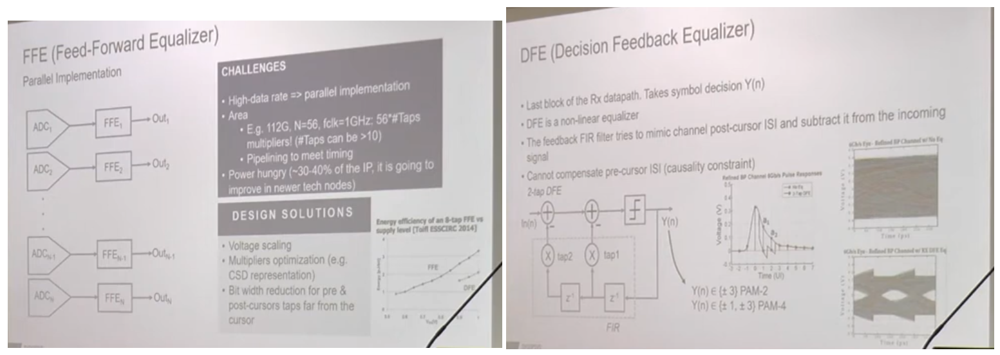


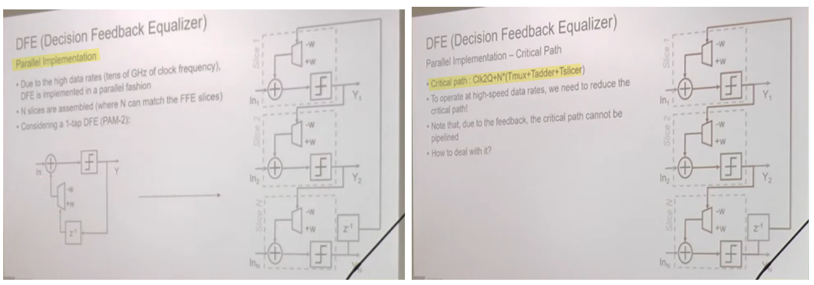


**Loop-Unrolling DFE**

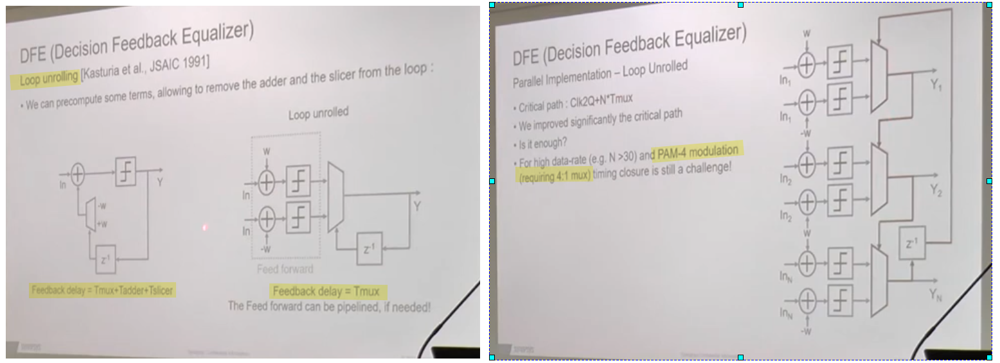

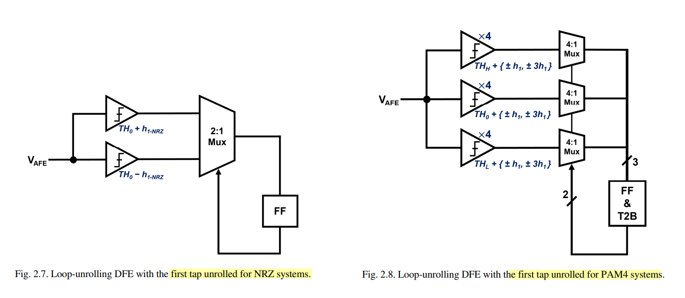

Corresponding to the three distinct voltage thresholds in the *PAM4* systems, it would need *12 slicers, 3 multiplexers*, and *one thermometer-to-binary decoder* in each deserialized data path, even if only one tap of the DFE is unrolled


**Look-Ahead Multiplexing DFE**

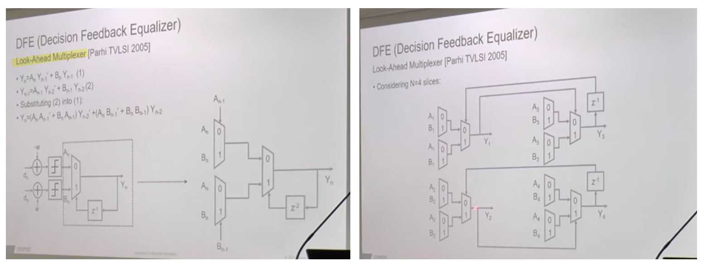

The look-ahead multiplexing technique brings the key benefit that the timing constraint can be significantly relaxed, as the iteration bound is ***doubled*** at the expense of extra hardware

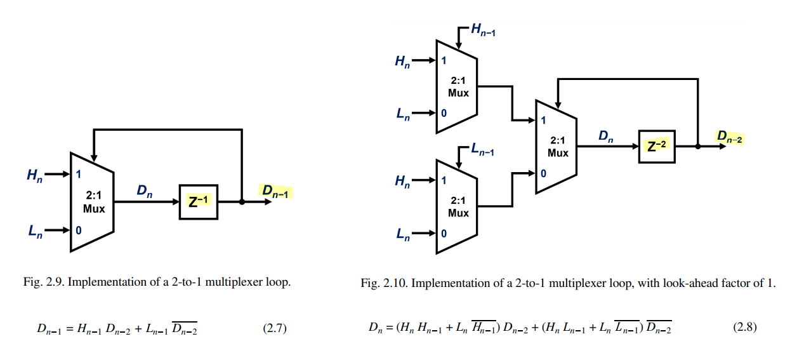


## RTL module

> MakerCode RTL Challenge [[https://github.com/Weiyet/MakerCode_RTLChallenge](https://github.com/Weiyet/MakerCode_RTLChallenge)]

***decimation_filter***

Filter Equation

```
filtered[n] = (1*x[n] + 3*x[n-1] + 3*x[n-2] + 1*x[n-3]) / 8
y[k] = filtered[k*DECIMATION_FACTOR]
```

```bash
iverilog -g2012 -o sim.vvp solution.sv tb.sv

vvp sim.vvp +VCDFILE=output.vcd


```


```verilog
module decimation_filter #(
    parameter DATA_WIDTH = 8,
    parameter DECIMATION_FACTOR = 4
)(
    input  wire                       clk,
    input  wire                       reset,
    input  wire signed [DATA_WIDTH-1:0]    data_in,
    input  wire                       data_valid_in,
    output wire signed [DATA_WIDTH-1:0]    data_out,
    output wire                       data_valid_out
);

    localparam COUNTER_WIDTH = $clog2(DECIMATION_FACTOR);
    
    // FIR filter coefficients: [1, 3, 3, 1] (normalized by 8)
    reg signed [DATA_WIDTH-1:0] x1, x2, x3;
    reg signed [DATA_WIDTH+3:0] filtered;
    reg [COUNTER_WIDTH-1:0] sample_counter;
    reg valid_out_reg;
    reg signed [DATA_WIDTH-1:0] output_reg;
    
    always @(posedge clk) begin
        if (reset) begin
            x1 <= {DATA_WIDTH{1'b0}};
            x2 <= {DATA_WIDTH{1'b0}};
            x3 <= {DATA_WIDTH{1'b0}};
            sample_counter <= {COUNTER_WIDTH{1'b0}};
            valid_out_reg <= 1'b0;
            output_reg <= {DATA_WIDTH{1'b0}};
        end else if (data_valid_in) begin
            // Update delay line
            x3 <= x2;
            x2 <= x1;
            x1 <= data_in;
            
            // Apply FIR filter: (1*x[n] + 3*x[n-1] + 3*x[n-2] + 1*x[n-3]) / 8
            filtered = data_in + (x1 << 1) + x1 + (x2 << 1) + x2 + x3;
            
            // Increment sample counter
            if (sample_counter == DECIMATION_FACTOR - 1) begin
                sample_counter <= {COUNTER_WIDTH{1'b0}};
                valid_out_reg <= 1'b1;
                output_reg <= filtered >>> 3;  // Divide by 8
            end else begin
                sample_counter <= sample_counter + 1'b1;
                valid_out_reg <= 1'b0;
            end
        end else begin
            valid_out_reg <= 1'b0;
        end
    end
    
    assign data_out = output_reg;
    assign data_valid_out = valid_out_reg;

endmodule
```

Line 34 uses **non-blocking** assignment:

```systemverilog
x1 <= data_in;   // line 34: scheduled, NOT applied yet
...
filtered = data_in + (x1<<1) + x1 + ...;  // line 37: x1 still holds OLD value
```

Non-blocking assignments don't take effect until the **end** of the current time step (after all the blocking statements in the block have run). So at line 37:

- `x1` still holds its **previous** value — i.e. the sample from the *last* `data_valid_in` cycle, which is `x[n-1]`.
- `data_in` is the **current** sample, `x[n]`.

They are different values. That's deliberate and necessary for the FIR math to be correct:

```
filtered = 1*x[n]   + 3*x[n-1] + 3*x[n-2] + 1*x[n-3]
         = data_in  + 3*x1     + 3*x2     + 1*x3
```

| Symbol    | Value at line 37 | Filter tap |
| --------- | ---------------- | ---------- |
| `data_in` | x[n] (current)   | coeff 1    |
| `x1`      | x[n-1]           | coeff 3    |
| `x2`      | x[n-2]           | coeff 3    |
| `x3`      | x[n-3]           | coeff 1    |

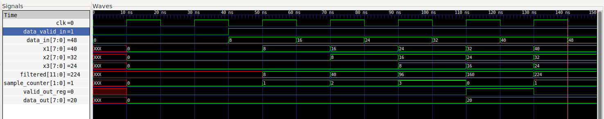


## reference

Jabbour, Chadi, etc.. "Digitally enhanced mixed signal systems." *IEEE International Symposium on Circuits and Systems (ISCAS)*. 2019.

Sen M. Kuo. Real-Time Digital Signal Processing: Fundamentals, Implementations and Applications, 3rd Edition. John Wiley & Sons 2013

Taylor, Fred. *Digital filters: principles and applications with MATLAB*. John Wiley & Sons, 2011

Kuo, Sen-Maw. (2013) Real-Time Digital Signal Processing: Implementations and Applications 3rd [[pdf](http://dl.icdst.org/pdfs/files/e51100ce301ad56951e4511a9a1c66aa.pdf)]

D. Markovic and R. W. Brodersen, DSP Architecture Design Essentials, Springer, 2012.

---

Bevan Baas, EEC281 VLSI Digital Signal Processing,  [[https://www.ece.ucdavis.edu/~bbaas/281/](https://www.ece.ucdavis.edu/~bbaas/281/)]

Mark Horowitz. EE371: Advanced VLSI Circuit Design Spring 2006-2007 [[https://web.stanford.edu/class/archive/ee/ee371/ee371.1066/](https://web.stanford.edu/class/archive/ee/ee371/ee371.1066/)]

Tinoosh Mohsenin. CMPE 691: Digital Signal Processing Hardware Implementation [[https://userpages.cs.umbc.edu/tinoosh/cmpe691/](https://userpages.cs.umbc.edu/tinoosh/cmpe691/)]

Keshab K. Parhi [[http://www.ece.umn.edu/users/parhi/](http://www.ece.umn.edu/users/parhi/)]

謝秉璇. 2019 積體電路設計導論 [[link](https://nthuee.org/archive//%E7%A9%8D%E9%AB%94%E9%9B%BB%E8%B7%AF%E8%A8%AD%E8%A8%88%E5%B0%8E%E8%AB%96/2019%E8%AC%9D%E7%A7%89%E7%92%87/)]

---

Jason Sachs. Understanding and Preventing Overflow (I Had Too Much to Add Last Night) [[https://www.embeddedrelated.com/showarticle/532.php](https://www.embeddedrelated.com/showarticle/532.php)]

—. Round Round Get Around: Why Fixed-Point Right-Shifts Are Just Fine [[https://www.embeddedrelated.com/showarticle/1015.php](https://www.embeddedrelated.com/showarticle/1015.php)]

—. How to Build a Fixed-Point PI Controller That Just Works: Part I [[https://www.embeddedrelated.com/showarticle/121.php](https://www.embeddedrelated.com/showarticle/121.php)]

—. How to Build a Fixed-Point PI Controller That Just Works: Part II [[https://www.embeddedrelated.com/showarticle/123.php](https://www.embeddedrelated.com/showarticle/123.php)]

---

AHMED SHAHEIN, Fixed-Point Simulation in GNU Octave—Without MATLAB [[https://www.dsprelated.com/showarticle/1786.php](https://www.dsprelated.com/showarticle/1786.php)]

A. Antoniou, "On the roots of digital signal processing. Part I," in *IEEE Circuits and Systems Magazine*, vol. 7, no. 1, pp. 8-18, First Quarter 2007

—, "Feature - On the roots of digital signal processing - Part II," in *IEEE Circuits and Systems Magazine*, vol. 7, no. 4, pp. 8-19, Fourth Quarter 2007

Hideo Okawara's Mixed Signal Lecture Series [[https://tomverbeure.github.io/2024/01/06/Hideo-Okawara-Mixed-Signal-Lecture-Series.html](https://tomverbeure.github.io/2024/01/06/Hideo-Okawara-Mixed-Signal-Lecture-Series.html)]

Jeffrey Walling, DSP to ASIC Block [[https://youtube.com/playlist?list=PLP4ZmM6GPueNEdnLhgkdr8_X8dSizUwMs](https://youtube.com/playlist?list=PLP4ZmM6GPueNEdnLhgkdr8_X8dSizUwMs)]

