<span style="color:blue"> ***why fixed-point arithmetic?***</span>

<span style="color:blue">Because the **dynamic range of the incoming physical signal** is tightly controlled by an Analog Front End (AFE) using Automatic Gain Control (AGC), **a massive floating-point dynamic range isn't necessary**</span>


## Number Systems

> Harris, David Money, and Sarah L. Harris. *Digital Design and Computer Architecture*. 2nd ed. Morgan Kaufmann, 2013. [[pdf](https://github.com/last-genius/comp_arch_list/blob/master/books/Digital%20Design%20and%20Computer%20Architecture.%20ARM%20Edition%20by%20Sarah%20Harris%2C%20David%20Harris.pdf)]

***integers***

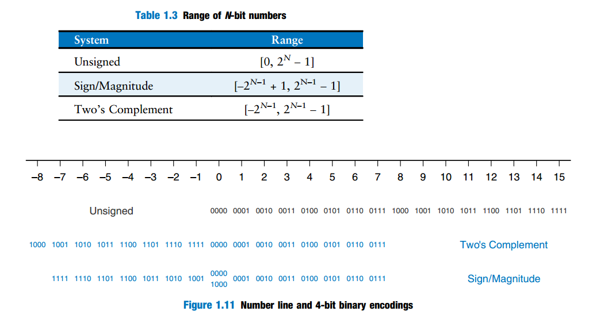

***rational number***

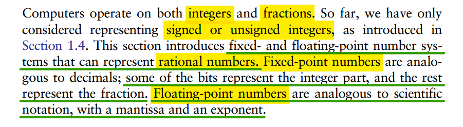


### 2's Complement

> [[https://bpb-us-w2.wpmucdn.com/sites.coecis.cornell.edu/dist/4/81/files/2019/06/4740_lecture23ALU-circuits.pdf](https://bpb-us-w2.wpmucdn.com/sites.coecis.cornell.edu/dist/4/81/files/2019/06/4740_lecture23ALU-circuits.pdf)]

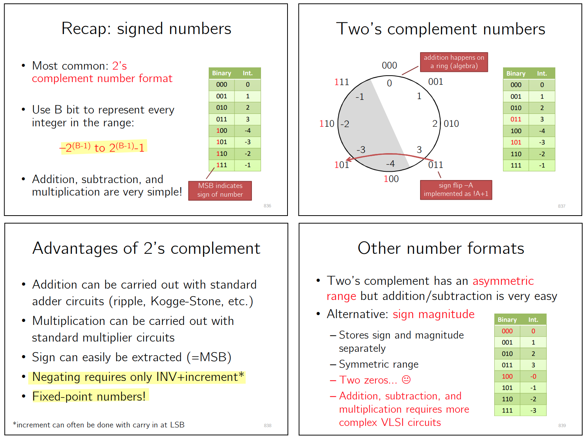


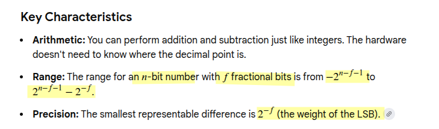


---

---

***2's complement negative number***

> Flip all bits then Add **1**

N-bit signed number
$$
A = -M_{N-1}2^{N-1}+\sum_{k=0}^{N-2}M_k2^k
$$
Flip all bits
$$\begin{align}
A_{flip} &= -(1-M_{N-1})2^{N-1} +\sum_{k=0}^{N-2}(1-M_k)2^k \\
&= M_{N-1}2^{N-1}-\sum_{k=0}^{N-2}M_k2^k -2^{N-1}+\sum_{k=0}^{N-2}2^k \\
&= M_{N-1}2^{N-1}-\sum_{k=0}^{N-2}M_k2^k -1
\end{align}$$

Add **1**
$$
A_- = A_{flip}+1 = M_{N-1}2^{N-1}-\sum_{k=0}^{N-2}M_k2^k = -A
$$


### Fixed Point Number

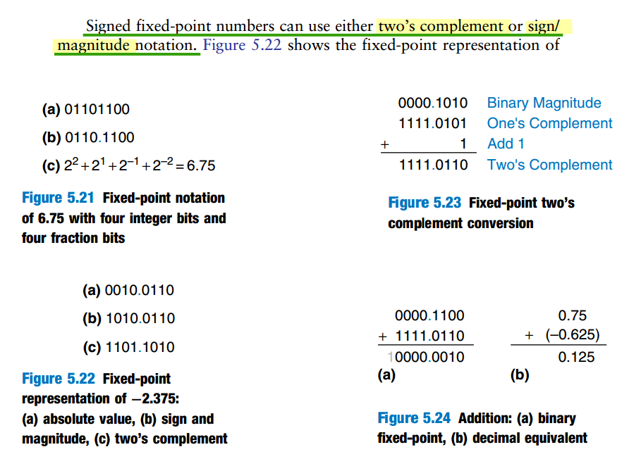


### $Q$-Format

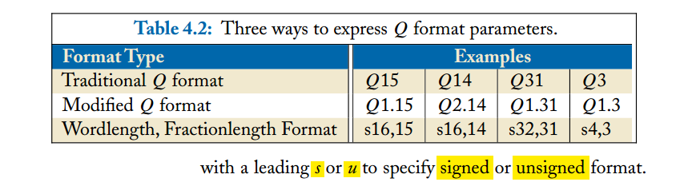

The **Q notation** is a way to specify the parameters of a **binary fixed point number format**

`Q0.3` is a notation for a **fixed-point binary number format**.
$$
\boxed{Q0.3
=
\text{sign bit}
+
0\text{ integer bits}
+
3\text{ fractional bits}}
$$


---

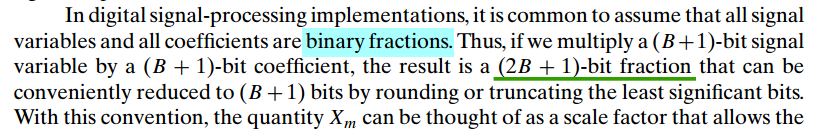

The useful **fixed-point multiplication** rule is
$$
Q_{F_1} \times Q_{F_2}
\;\Rightarrow\;
F_{\text{product}} = F_1 + F_2
$$
where $F_1$ and $F_2$ are the numbers of fractional bits of the two operands

4-bit words are

```
a      = 0.100  -> 0100
y_hat  = 0.111  -> 0111
```

Now temporarily ignore the binary point and multiply the integer bit patterns:

```
      0100        (= 4)
    × 0111        (= 7)
    -------
      0100
     0100
    0100
   0000
    -------
   0011100        (= 28)
```


---

---

***Different sources use slightly different $Q$-format conventions***

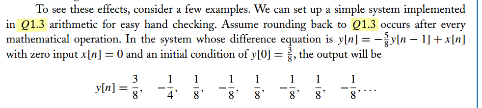

**$Q1.3$ means that the `1` includes the sign bit.**
$$
Q1.3
=
\underbrace{1\text{ bit}}_{\text{sign / integer side}}
+
\underbrace{3\text{ fractional bits}}_{\text{fractional side}}
$$
So it is a **4-bit two's-complement fixed-point number**: 

```
 b3 . b2 b1 b0
 ↑      ↑ ↑ ↑
sign    3 fractional bits
```


### Floating-point Number

> 
>


### Floating-point Number in IEEE 754 Format

> Floating-point data in IEEE 754 Format [[https://github.com/IC-Design-Lab/IC-Design/blob/main/Training/Floating-point%20data%20in%20IEEE%20754%20Format.pdf](https://github.com/IC-Design-Lab/IC-Design/blob/main/Training/Floating-point%20data%20in%20IEEE%20754%20Format.pdf)]
>
> Rajaraman, V.. “IEEE standard for floating point numbers.” *Resonance* 21 (2016): 11 - 30. [[https://www.ias.ac.in/article/fulltext/reso/021/01/0011-0030](https://www.ias.ac.in/article/fulltext/reso/021/01/0011-0030)]
>
> IEEE Standard for Floating-Point Arithmetic [[https://www-users.cse.umn.edu/~vinals/tspot_files/phys4041/2020/IEEE%20Standard%20754-2019.pdf](https://www-users.cse.umn.edu/~vinals/tspot_files/phys4041/2020/IEEE%20Standard%20754-2019.pdf)]
>
> Dennis Forbes. Understanding Floating-Point Numbers [[https://dennisforbes.ca/blog/features/floating_point/understanding-floating-point-numbers/](https://dennisforbes.ca/blog/features/floating_point/understanding-floating-point-numbers/)]

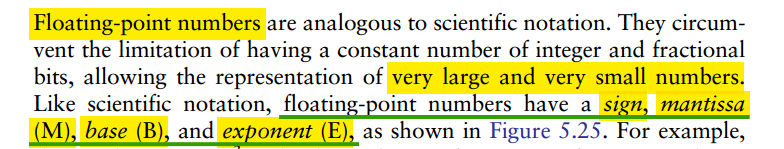

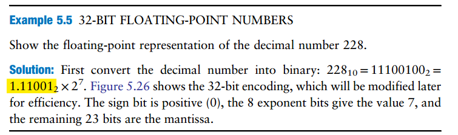

|                                      |                                |                                                              |
| ------------------------------------ | ------------------------------ | ------------------------------------------------------------ |
| **32-bit floating-point version 1**  | store *implicit leading one*   | 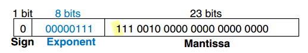 |
| **32-bit floating-point version 2**  | discard *implicit leading one* | 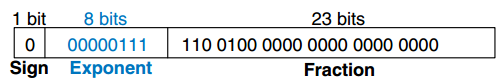 |
| **IEEE 754 floating point notation** | ***biased exponent***          | 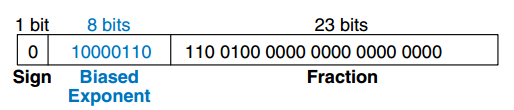 |

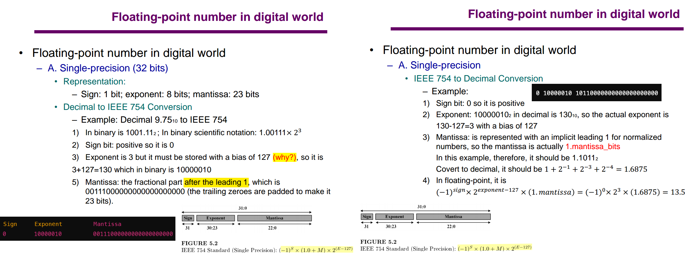

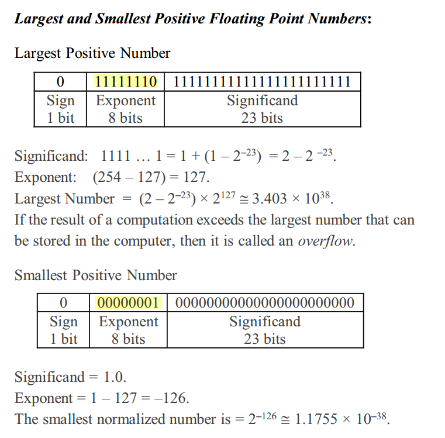
$$
\boxed{
\begin{aligned}
E=0 &: \quad \text{zero or subnormal},\\
1\le E\le254 &: \quad \text{normal finite number},\\
E=255 &: \quad \infty \text{ or NaN}.
\end{aligned}
}
$$


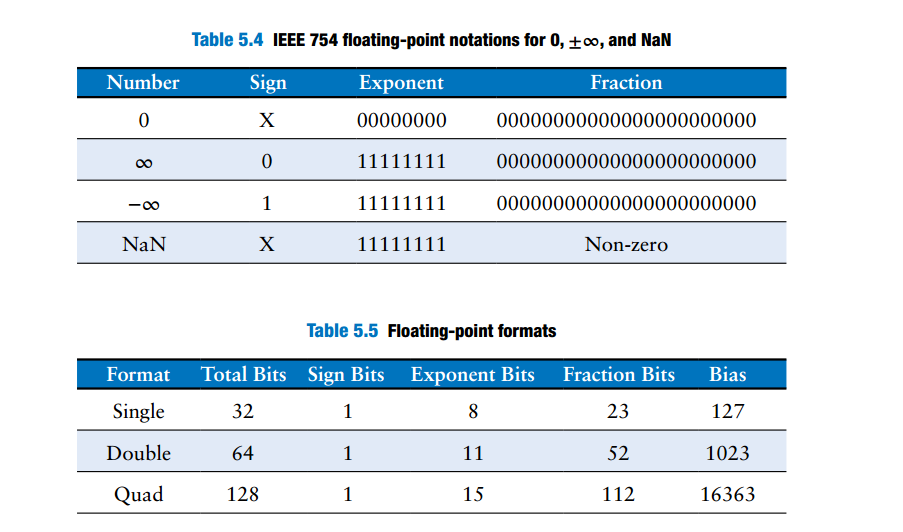


## Multipliers

> HARDWARE MULTIPLIERS [[https://www.ece.ucdavis.edu/~bbaas/281/notes/Handout.mult.pdf](https://www.ece.ucdavis.edu/~bbaas/281/notes/Handout.mult.pdf)]
>
> FIXED-INPUT MULTS [[https://www.ece.ucdavis.edu/~bbaas/281/notes/Handout.fixed.input.mults.pdf](https://www.ece.ucdavis.edu/~bbaas/281/notes/Handout.fixed.input.mults.pdf)]

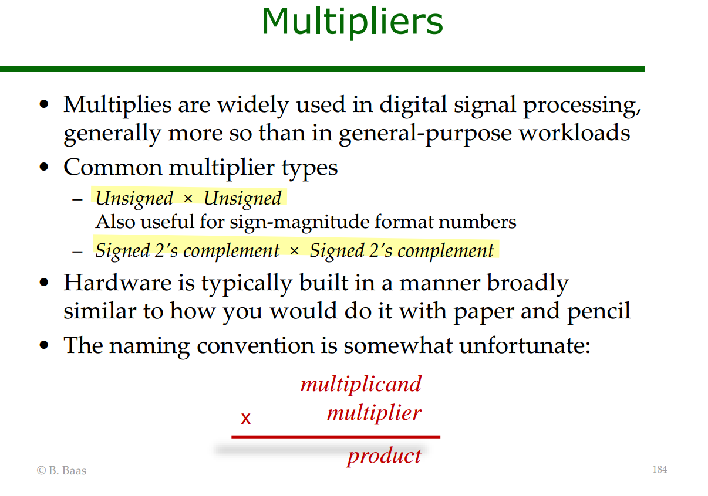


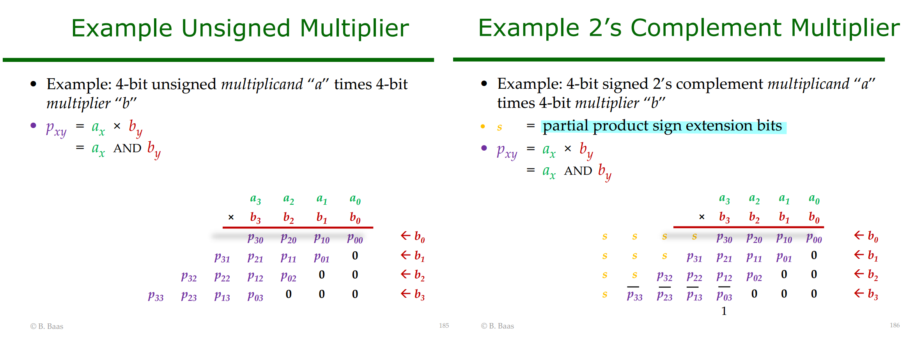


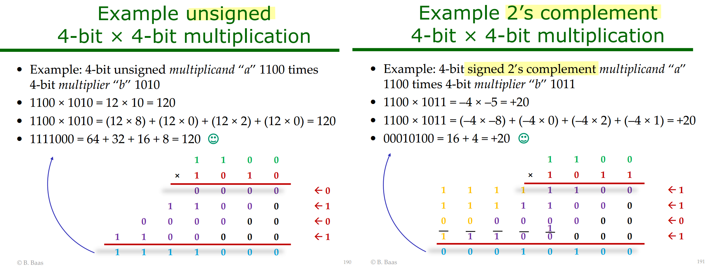


## FIR Filter Scaling

> FIR FILTER HARDWARE [[https://www.ece.ucdavis.edu/~bbaas/281/notes/Handout.fir.hardware.pdf](https://www.ece.ucdavis.edu/~bbaas/281/notes/Handout.fir.hardware.pdf)]

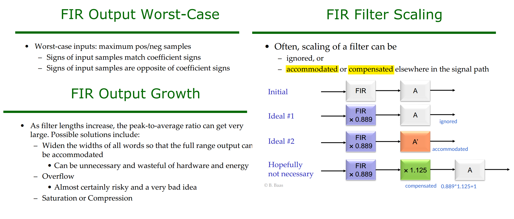


## Finite-wordlength Effects

> Tianshuang Qiu; Ying Guo, "7. Finite-Precision Numerical Effects in Digital Signal Processing," in *Signal Processing and Data Analysis* , De Gruyter, 2018, pp.236-248
>
> Antoniou, Andreas. “Digital Signal Processing: Signals, Systems, and Filters.” (2005). [[pdf](https://fmipa.umri.ac.id/wp-content/uploads/2016/03/Andreas-Intoniou-Digital-signal-processing.9780071454247.31527.pdf)]
>
> Alan V Oppenheim, Ronald W. Schafer. Discrete-Time Signal Processing, 3rd edition


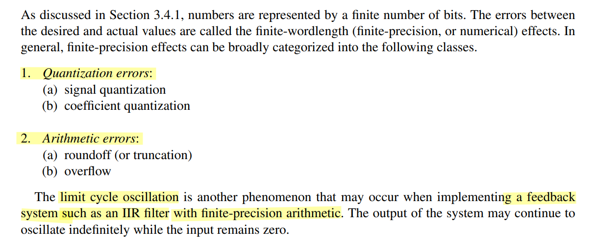

### Coefficient Quantization

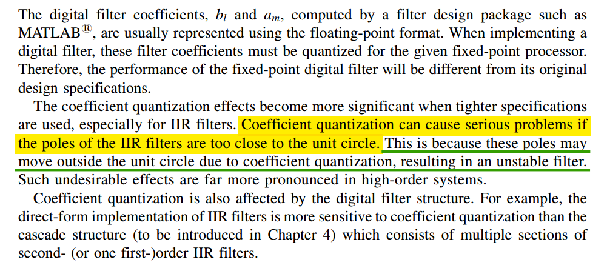


###  Roundoff Noise


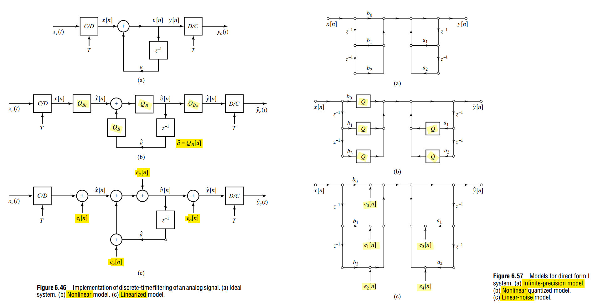


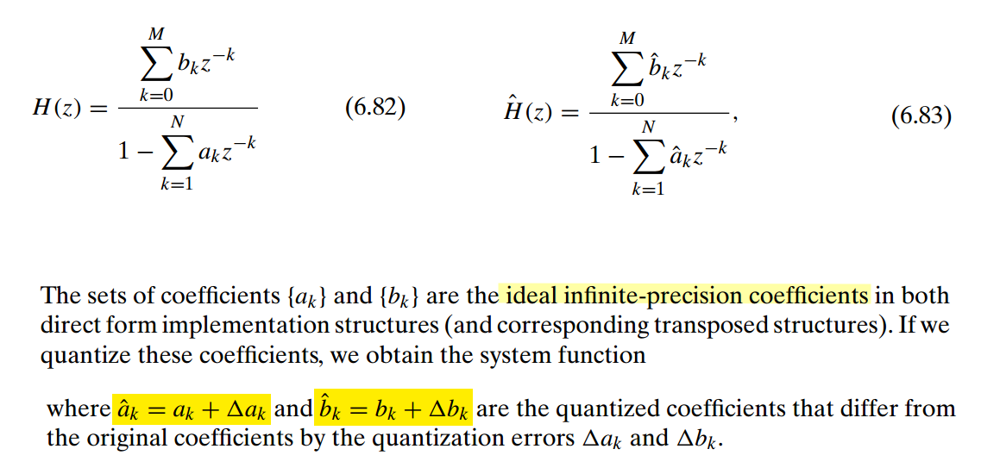

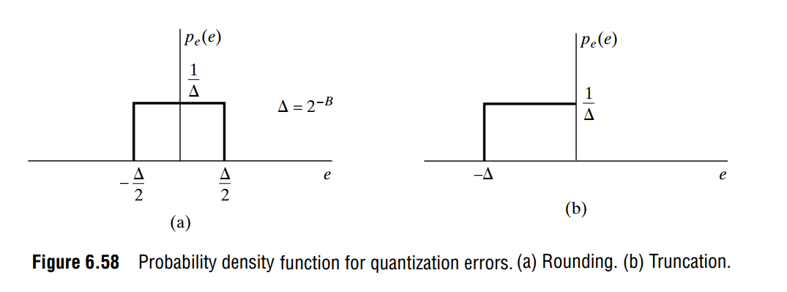

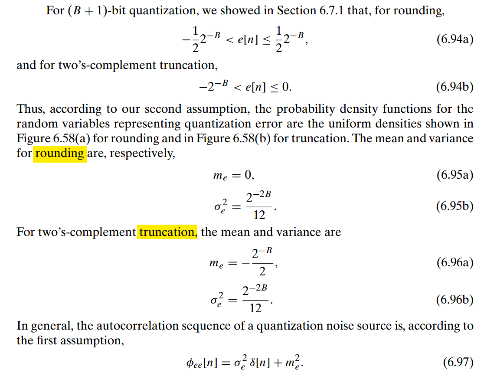


---


***Direct-Form I (DF-I) implementation of a digital filter IIR***

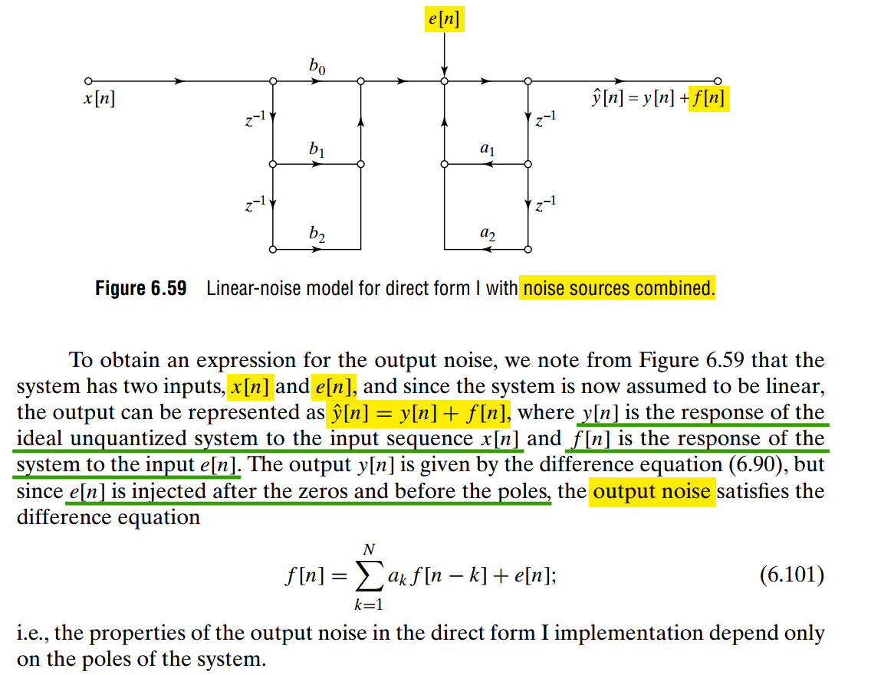

Equation (6.101) follows directly by writing the difference equation for the **quantized system** and subtracting the difference equation for the **ideal system**.

For the direct-form-I filter in Fig. 6.59, the ideal output satisfies

$$
y[n]
=
\sum_{k=0}^{M} b_k x[n-k]
+
\sum_{k=1}^{N} a_k y[n-k].
\tag{1}
$$

The combined quantization noise $e[n]$ is injected **after the $b_k$ section (zeros) and before the $a_k$ feedback section (poles)**. Therefore the actual output $\hat y[n]$ satisfies

$$
\hat y[n]
=
\sum_{k=0}^{M} b_k x[n-k]
+
\sum_{k=1}^{N} a_k \hat y[n-k]
+
e[n].
\tag{2}
$$

The book defines

$$
\boxed{\hat y[n]=y[n]+f[n]}
$$

where $f[n]$ is the output component caused by the quantization noise.

Substitute

$$
\hat y[n]=y[n]+f[n]
$$

into (2):

$$
y[n]+f[n]
=
\sum_{k=0}^{M}b_kx[n-k]
+
\sum_{k=1}^{N}a_k\left(y[n-k]+f[n-k]\right)
+
e[n].
$$

Expand:

$$
y[n]+f[n]
=
\underbrace{
\sum_{k=0}^{M}b_kx[n-k]
+
\sum_{k=1}^{N}a_ky[n-k]
}_{=\,y[n]}
+
\sum_{k=1}^{N}a_kf[n-k]
+
e[n].
$$

Using the ideal-system equation (1),

$$
y[n]+f[n]
=
y[n]
+
\sum_{k=1}^{N}a_kf[n-k]
+
e[n].
$$

Cancel $y[n]$ from both sides:

$$
\boxed{
f[n]
=
\sum_{k=1}^{N}a_k f[n-k]+e[n]
}
\tag{6.101}
$$

That is exactly Eq. (6.101).

***Why do the $b_k$ coefficients disappear?***

This is the important point.

The signal path is

$$
x[n]
\rightarrow
\underbrace{B(z)}_{\text{zeros}}
\rightarrow
\boxed{+\,e[n]}
\rightarrow
\underbrace{\frac{1}{A(z)}}_{\text{poles}}
\rightarrow
\hat y[n].
$$

The noise is inserted **after $B(z)$**, so it never passes through the zeros. It only passes through the all-pole feedback section.

In the $z$-domain, Eq. (6.101) gives

$$
F(z)
=
\sum_{k=1}^{N}a_kz^{-k}F(z)+E(z).
$$

Thus,

$$
F(z)
\left(
1-\sum_{k=1}^{N}a_kz^{-k}
\right)
=
E(z),
$$

and therefore

$$
\boxed{
\frac{F(z)}{E(z)}
=
\frac{1}
{1-\displaystyle\sum_{k=1}^{N}a_kz^{-k}}
}
$$

So the **output quantization-noise transfer function contains only the poles**, which is what the sentence immediately after (6.101) means.

For the second-order example in the figure,

$$
\boxed{
f[n]=a_1f[n-1]+a_2f[n-2]+e[n].
}
$$

The coefficients $b_0,b_1,b_2$ have no effect on $f[n]$ because $e[n]$ is injected after that part of the filter.


### Limit Cycles in feedback system


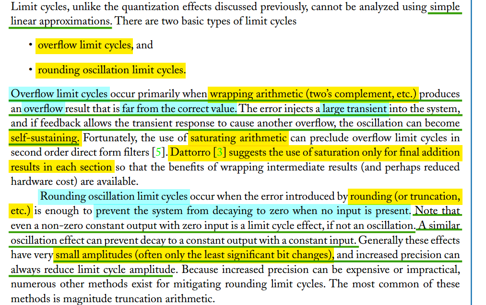


#### Limit Cycles Owing to Round-off & Truncation


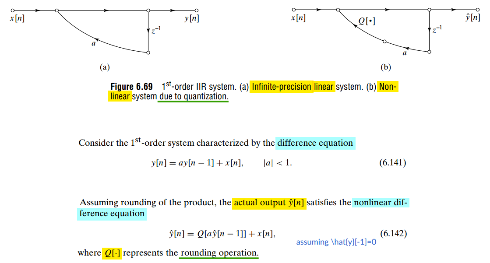

For **infinite-precision linear system** $y[n] = a y[n-1] + x[n],$

with zero initial condition $y[-1]=0$, the impulse response is
$$
y[n] = \frac{7}{8} a^n u[n]
$$
because after the impulse at $n=0$, we have $x[n]=0$ for all $n\ge 1$.

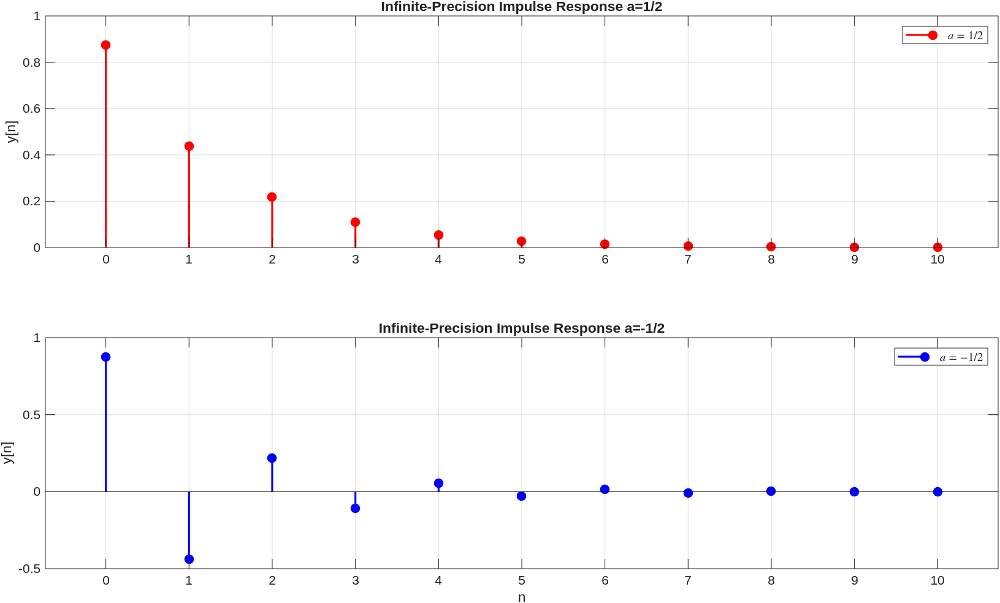

For **nonlinear system** $\hat{y}[n] = Q[a \hat{y}[n-1]] + x[n],$

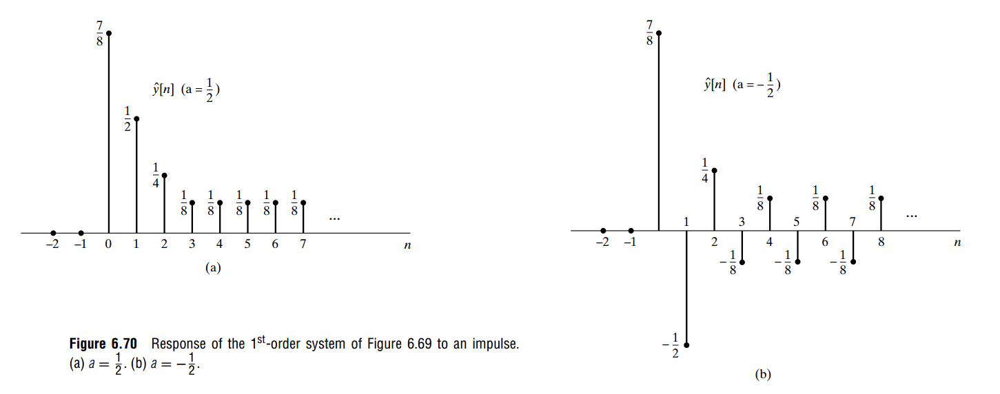

The nonzero **steady oscillation** or **constant value** is created entirely by the **rounding operation (nonlinear)** $Q[\cdot]$


#### Limit Cycles Owing to Overflow

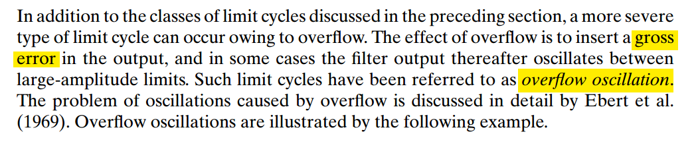

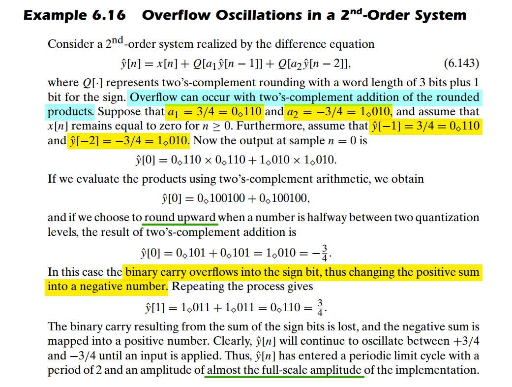

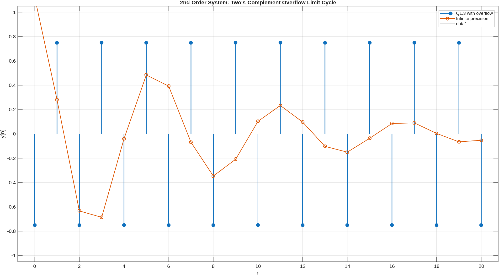


```matlab
%% Parameters
a1 =  3/4;
a2 = -3/4;

% Q1.3:
% 1 sign/integer bit + 3 fractional bits
F  = 3;               % fractional bits
WL = 4;               % total word length
S  = 2^F;             % scale factor = 8

% Initial conditions
% y[-2] = -3/4
% y[-1] = +3/4
y_m2 = -3/4;
y_m1 =  3/4;

N = 20;
n = 0:N;


%% ------------------------------------------------------------
%  Finite-precision Q1.3 system
% -------------------------------------------------------------

yq = zeros(size(n));

% Store the two previous states
ym2 = y_m2;
ym1 = y_m1;

for k = 1:length(n)

    % Products
    p1 = a1 * ym1;
    p2 = a2 * ym2;

    % Round products back to Q1.3.
    % Halfway cases are rounded away from zero:
    %
    %   +9/16 -> +5/8
    %   -9/16 -> -5/8
    %
    p1q = sign(p1) * floor(abs(p1)*S + 0.5) / S;
    p2q = sign(p2) * floor(abs(p2)*S + 0.5) / S;

    % Addition
    s = p1q + p2q;

    % Two's-complement overflow / wraparound
    %
    % Convert to integer representation first
    sint = round(s*S);

    % Wrap to WL-bit signed two's-complement range
    sint = mod(sint + 2^(WL-1), 2^WL) - 2^(WL-1);

    % Convert back to Q1.3
    yq(k) = sint / S;

    % Update states
    ym2 = ym1;
    ym1 = yq(k);
end


%% ------------------------------------------------------------
%  Infinite-precision system
% -------------------------------------------------------------

yinf = zeros(size(n));

ym2 = y_m2;
ym1 = y_m1;

for k = 1:length(n)

    yinf(k) = a1*ym1 + a2*ym2;

    ym2 = ym1;
    ym1 = yinf(k);
end

```


---

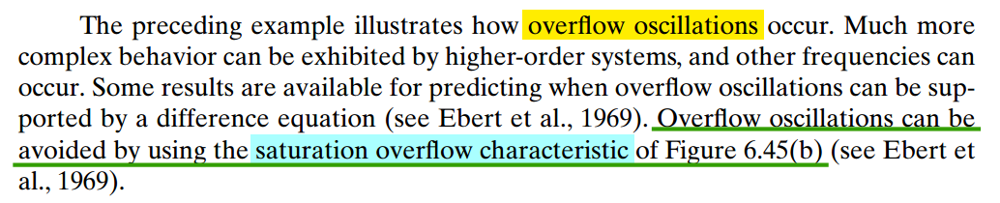

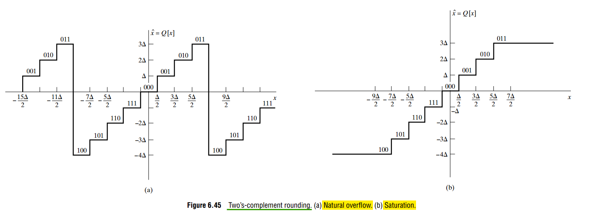


```verilog
//-------------------------------------------------------------------------
// Recombine and saturate: dac = clamp(x_msb + y, 0, 2^OUT_W-1)
//   sum range [-3, 2^OUT_W-1+4] -> (OUT_W+2)-bit signed is sufficient
//   (needs 2^(OUT_W+1) >= 2^OUT_W + 4, true for any OUT_W >= 2)
//-------------------------------------------------------------------------
// explicit sign-extension of y to adder width (assumes OUT_W >= 5)
wire signed [OUT_W+1:0] y_ext   = {{(OUT_W-4){y[5]}}, y};
wire signed [OUT_W+1:0] dac_sum = $signed({2'b0, x_msb}) + y_ext;

wire [OUT_W-1:0] dac_sat =
      dac_sum[OUT_W+1] ? {OUT_W{1'b0}} :   // negative  -> 0
      dac_sum[OUT_W]   ? {OUT_W{1'b1}} :   // > max     -> 2^OUT_W-1
      dac_sum[OUT_W-1:0];
```


#### Avoiding Limit Cycles

The suppression of limit cycles is a broad topic with all the complexity to be expected in a *nonlinear system* behavior.

The most basic tools of **saturation arithmetic** and **magnitude truncation — rounding rounds toward zero**


---

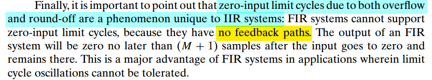


### Saturation Arithmetic & Scaling of Signals

***<span style="color:blue">Saturation arithmetic</span> prevents <span style="color:blue">overflow</span> by clipping the results to a maximum value***

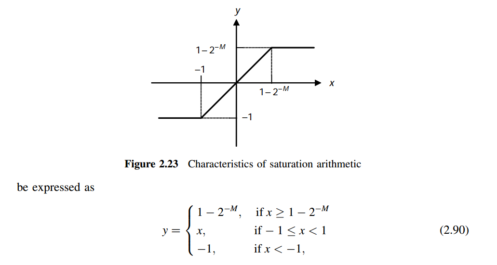


---

---

***The most effective technique in preventing <span style="color:blue">overflow</span> is by <span style="color:blue">scaling down</span> the signal***

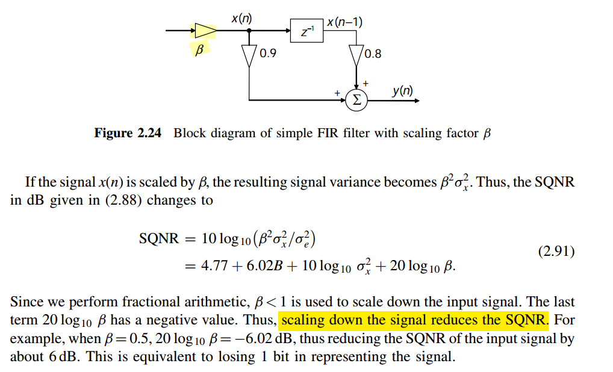

## DFE in digital

> Synopsys Italia, Tech Talk: Introduction to DSP-based SerDes [[https://youtu.be/puEP0DlVZGI](https://youtu.be/puEP0DlVZGI)]
>
> Chen, Kuan-Chang (2022) *Energy-Efficient Receiver Design for High-Speed Interconnects.* Dissertation (Ph.D.), California Institute of Technology. [[https://thesis.library.caltech.edu/14318/9/chen_kuan-chang_2022_thesis_final.pdf](https://thesis.library.caltech.edu/14318/9/chen_kuan-chang_2022_thesis_final.pdf)]

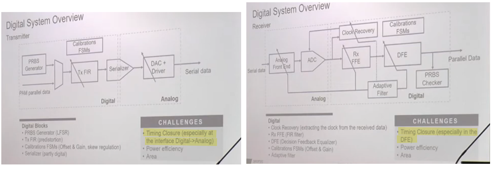

**Parallel implementation**

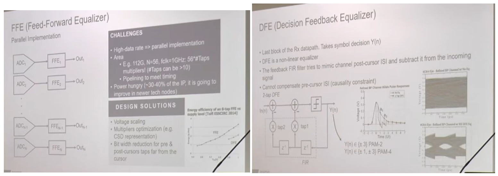


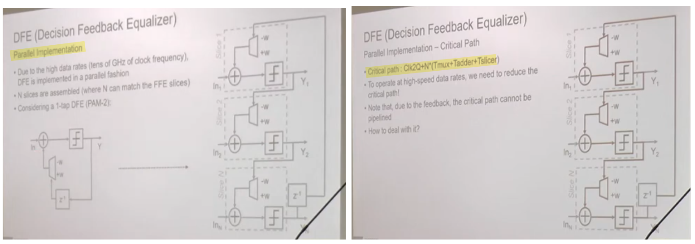


**Loop-Unrolling DFE**

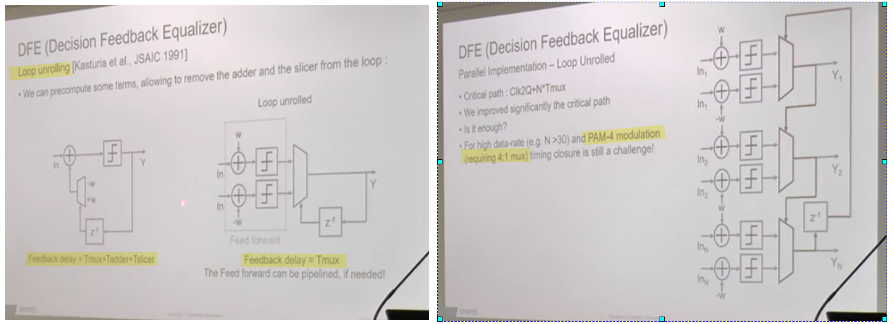

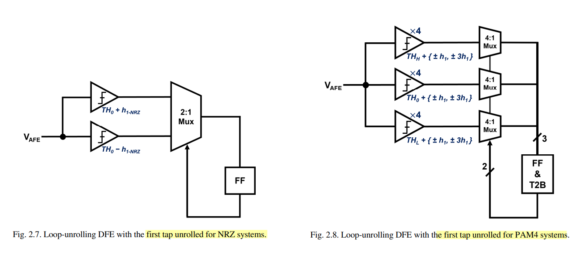

Corresponding to the three distinct voltage thresholds in the *PAM4* systems, it would need *12 slicers, 3 multiplexers*, and *one thermometer-to-binary decoder* in each deserialized data path, even if only one tap of the DFE is unrolled


**Look-Ahead Multiplexing DFE**

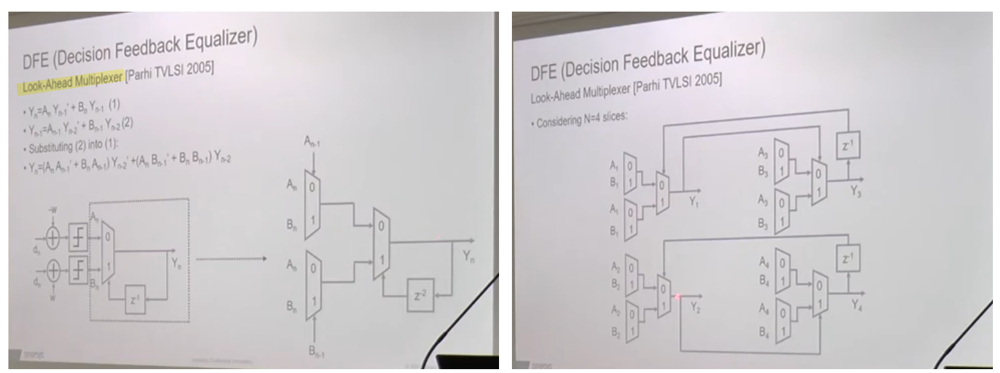

The look-ahead multiplexing technique brings the key benefit that the timing constraint can be significantly relaxed, as the iteration bound is ***doubled*** at the expense of extra hardware

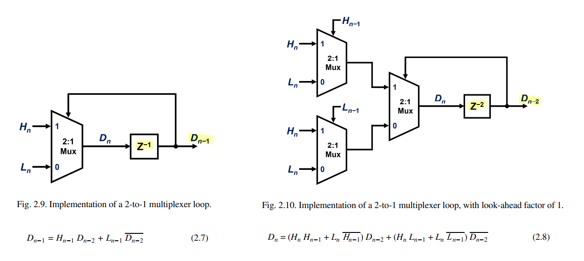


## MASH111 in Verilog

> [[https://github.com/raytroop/dsmwk](https://github.com/raytroop/dsmwk)]

Digital block between a **20-bit digital loop filter (DLF) output** and an **8-bit DAC input**. The 12 truncated LSBs are pushed through a MASH-1-1-1 delta-sigma modulator so the truncation error is 3rd-order noise-shaped instead of lost:

```
dac(z) = dlf(z)/2^12  -  (1 - z^-1)^3 · q(z)              (× z^-1 latency)

q ≜ e3/2^12 ∈ [0,1) LSB₈,  σ² ≈ 1/12 LSB₈²
```

where `e3` is the stage-3 accumulator residue in raw 20-bit-LSB counts (0…4095, quantizer step 2¹²) and `q` is the same error referred to the 8-bit output grid — the unit-step quantization noise of the effective 1-LSB₈ quantizer.

> <span style="color:blue">dac(z) = dlf<sub>MSB8</sub> (z)/2<sup>12</sup> + dlf<sub>LSB12</sub> (z)/2<sup>12</sup>+ q(z) · (1 - z<sup>-1</sup>)<sup>3</sup> = dlf(z)/2<sup>12</sup> +   q(z) · (1 - z<sup>-1</sup>)<sup>3</sup></span>


```
 dlf_in[19:12] ─────────────────────────────────┐
                                                ▼
 dlf_in[11:0] ──► ACC1 ──c1──────────────────► (+) ──sat[0,255]──► reg ──► dac_out[7:0]
                   │r1                          ▲
                   └──► ACC2 ──c2──(1-z⁻¹)──────┤
                         │r2                    │
                         └──► ACC3 ──c3──(1-z⁻¹)²
```


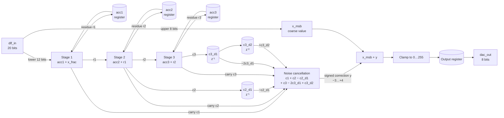
```mermaid
flowchart LR
    IN["dlf_in<br/>20 bits"] -->|"upper 8 bits"| XMSB["x_msb<br/>coarse value"]
    IN -->|"lower 12 bits"| A1["Stage 1<br/>acc1 + x_frac"]

    R1[("acc1<br/>register")] --> A1
    A1 -->|"residue r1"| R1
    A1 -->|"r1"| A2["Stage 2<br/>acc2 + r1"]
    A1 -->|"carry c1"| NC["Noise cancellation<br/>c1 + c2 − c2_d1<br/>+ c3 − 2c3_d1 + c3_d2"]

    R2[("acc2<br/>register")] --> A2
    A2 -->|"residue r2"| R2
    A2 -->|"r2"| A3["Stage 3<br/>acc3 + r2"]
    A2 -->|"carry c2"| NC
    A2 -->|"c2"| C2D1[("c2_d1<br/>z⁻¹")]
    C2D1 -->|"−c2_d1"| NC

    R3[("acc3<br/>register")] --> A3
    A3 -->|"residue r3"| R3
    A3 -->|"carry c3"| NC
    A3 -->|"c3"| C3D1[("c3_d1<br/>z⁻¹")]
    C3D1 -->|"−2c3_d1"| NC
    C3D1 --> C3D2[("c3_d2<br/>z⁻²")]
    C3D2 -->|"+c3_d2"| NC

    NC -->|"signed correction y<br/>−3…+4"| ADD["x_msb + y"]
    XMSB --> ADD
    ADD --> SAT["Clamp to 0…255"]
    SAT --> OUTREG[("Output register")]
    OUTREG --> OUT["dac_out<br/>8 bits"]
```


| Branch    | Expression                             | Range        |
| --------- | -------------------------------------- | ------------ |
| stage 1   | `c1`                                   | {0, 1}       |
| stage 2   | `(1−z⁻¹)·c2` = `c2 − c2_d1`            | {−1, 0, +1}  |
| stage 3   | `(1−z⁻¹)²·c3` = `c3 − 2·c3_d1 + c3_d2` | [−2, +2]     |
| **total** | `y`                                    | **[−3, +4]** |


```verilog
 wire signed [5:0] y =
          $signed({5'b0, c1})
        + $signed({5'b0, c2})   - $signed({5'b0, c2_d1})
        + $signed({5'b0, c3})   - $signed({4'b0, c3_d1, 1'b0})  // 2*c3_d1
        + $signed({5'b0, c3_d2});
```

Each carry is a bare bit `{0,1}`. `{5'b0, c1}` zero-extends it to 6 bits (value unchanged), and `$signed(...)` marks it for signed arithmetic. The term `{4'b0, c3_d1, 1'b0}` is `c3_d1` with a zero appended — a shift-left-by-1, i.e. `2·c3_d1` (value 0 or 2) — so the multiply costs nothing.

The reachable values of `y` and their actual bit patterns:

| value | `y[5:0]` |      | value | `y[5:0]` |
| ----: | -------- | ---- | ----: | -------- |
|    +4 | `000100` |      |     0 | `000000` |
|    +3 | `000011` |      |    −1 | `111111` |
|    +2 | `000010` |      |    −2 | `111110` |
|    +1 | `000001` |      |    −3 | `111101` |

Worked example: `c1=0, c2=0, c2_d1=1, c3=0, c3_d1=1, c3_d2=0` → `y = 0 + (0−1) + (0−2+0) = −3` → `111101`.


***clamp [-3, 259] to [0, 255]***

For `msb ∈ [3, 251]`, `x_msb + y` never leaves [0,255], the mux always takes the pass-through leg, and `dac_sat ≡ dac_sum` bit-for-bit.

```verilog
//-------------------------------------------------------------------------
// Recombine and saturate: dac = clamp(x_msb + y, 0, 2^OUT_W-1)
//   sum range [-3, 2^OUT_W-1+4] -> (OUT_W+2)-bit signed is sufficient
//   (needs 2^(OUT_W+1) >= 2^OUT_W + 4, true for any OUT_W >= 2)
//-------------------------------------------------------------------------
// explicit sign-extension of y to adder width (assumes OUT_W >= 5)
wire signed [OUT_W+1:0] y_ext   = {{(OUT_W-4){y[5]}}, y};
wire signed [OUT_W+1:0] dac_sum = $signed({2'b0, x_msb}) + y_ext;

wire [OUT_W-1:0] dac_sat =
      dac_sum[OUT_W+1] ? {OUT_W{1'b0}} :   // negative  -> 0
      dac_sum[OUT_W]   ? {OUT_W{1'b1}} :   // > max     -> 2^OUT_W-1
      dac_sum[OUT_W-1:0];
```

In a locked PLL the DLF integrator sits mid-range and the **clamp never fires** — cost: zero. It engages only during acquisition/slew, where noise is irrelevant and its job is exactly right: drive the DAC monotonically to the rail without wrapping


---

---

<span style="color:blue">***overall ENOB calculation***</span>

```
SNR  = P_sig / (P_q,in + P_dsm)          (powers add — sources are independent)
ENOB = (SNR_dB − 1.76) / 6.02
```

with everything in the same units (<span style="color:blue">LSB₈²</span> is convenient) and — critically — **both noise terms integrated in-band only** (0 … f_bw, i.e. what survives the analog filter):

| Term                                | Expression (<span style="color:blue">LSB₈²</span>, fs = f_clk) |
| ----------------------------------- | ------------------------------------------------------------ |
| Signal (full-scale sine convention) | `P_sig = FS²/8 = 256²/8 = 8192`                              |
| DSM shaped noise, in-band           | `P_dsm = (1/12)·(π⁶/7)·OSR⁻⁷`                                |
| Input quantization noise, in-band   | <span style="color:blue">P_q,in = (2⁻¹²)²/12 · κ</span>      |

**Sanity check at OSR = 50** (static input, κ=1): `P_q,in = 4.97e-9`, `P_dsm = 1.47e-11` → SNR = 122.1 dB → **ENOB = 19.98** — the DSM costs only 0.13 dB against the ideal 20.00. At OSR = 10: DSM dominates, ENOB = 16.1 


## Sign Extension In Verilog

> [[https://www.ece.ucdavis.edu/~bbaas/281/notes/Handout.sign.extension.pdf]](https://www.ece.ucdavis.edu/~bbaas/281/notes/Handout.sign.extension.pdf)

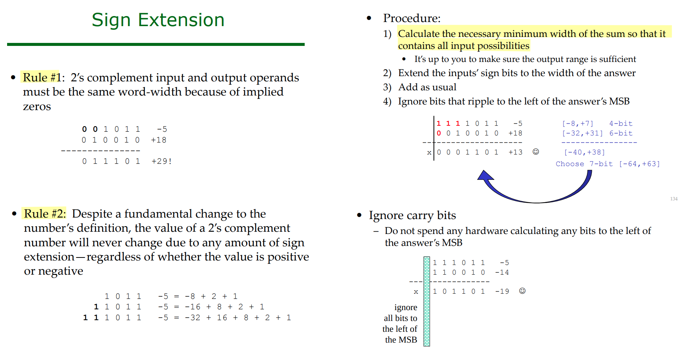

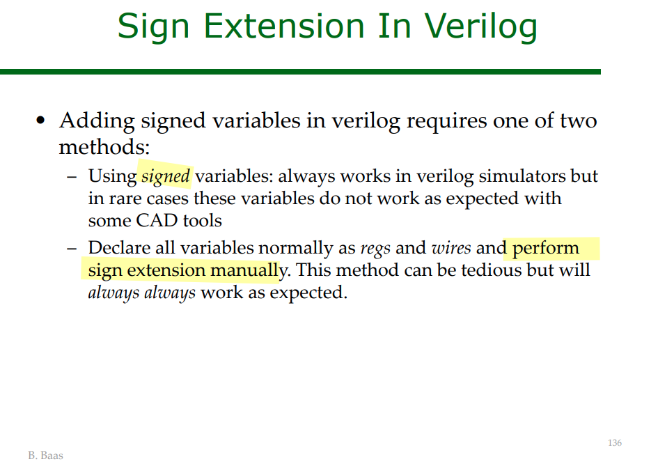

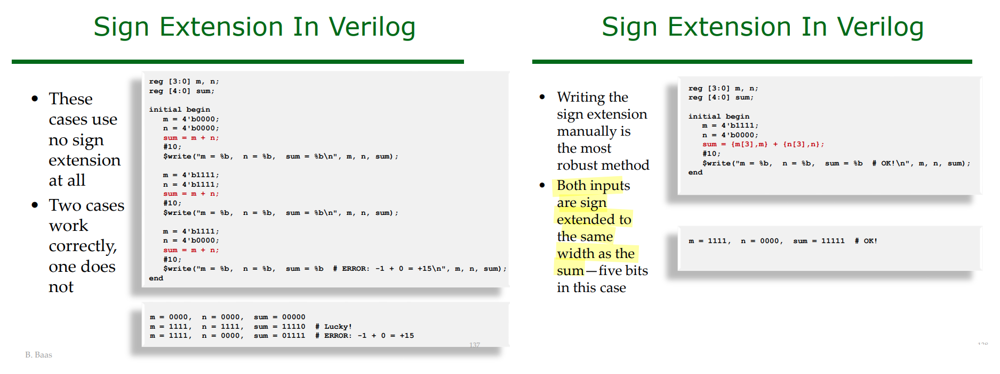


## RTL module

> MakerCode RTL Challenge [[https://github.com/Weiyet/MakerCode_RTLChallenge](https://github.com/Weiyet/MakerCode_RTLChallenge)]

***decimation_filter***

Filter Equation

```
filtered[n] = (1*x[n] + 3*x[n-1] + 3*x[n-2] + 1*x[n-3]) / 8
y[k] = filtered[k*DECIMATION_FACTOR]
```

```bash
iverilog -g2012 -o sim.vvp solution.sv tb.sv

vvp sim.vvp +VCDFILE=output.vcd


```


```verilog
module decimation_filter #(
    parameter DATA_WIDTH = 8,
    parameter DECIMATION_FACTOR = 4
)(
    input  wire                       clk,
    input  wire                       reset,
    input  wire signed [DATA_WIDTH-1:0]    data_in,
    input  wire                       data_valid_in,
    output wire signed [DATA_WIDTH-1:0]    data_out,
    output wire                       data_valid_out
);

    localparam COUNTER_WIDTH = $clog2(DECIMATION_FACTOR);
    
    // FIR filter coefficients: [1, 3, 3, 1] (normalized by 8)
    reg signed [DATA_WIDTH-1:0] x1, x2, x3;
    reg signed [DATA_WIDTH+3:0] filtered;
    reg [COUNTER_WIDTH-1:0] sample_counter;
    reg valid_out_reg;
    reg signed [DATA_WIDTH-1:0] output_reg;
    
    always @(posedge clk) begin
        if (reset) begin
            x1 <= {DATA_WIDTH{1'b0}};
            x2 <= {DATA_WIDTH{1'b0}};
            x3 <= {DATA_WIDTH{1'b0}};
            sample_counter <= {COUNTER_WIDTH{1'b0}};
            valid_out_reg <= 1'b0;
            output_reg <= {DATA_WIDTH{1'b0}};
        end else if (data_valid_in) begin
            // Update delay line
            x3 <= x2;
            x2 <= x1;
            x1 <= data_in;
            
            // Apply FIR filter: (1*x[n] + 3*x[n-1] + 3*x[n-2] + 1*x[n-3]) / 8
            filtered = data_in + (x1 << 1) + x1 + (x2 << 1) + x2 + x3;
            
            // Increment sample counter
            if (sample_counter == DECIMATION_FACTOR - 1) begin
                sample_counter <= {COUNTER_WIDTH{1'b0}};
                valid_out_reg <= 1'b1;
                output_reg <= filtered >>> 3;  // Divide by 8
            end else begin
                sample_counter <= sample_counter + 1'b1;
                valid_out_reg <= 1'b0;
            end
        end else begin
            valid_out_reg <= 1'b0;
        end
    end
    
    assign data_out = output_reg;
    assign data_valid_out = valid_out_reg;

endmodule
```

Line 34 uses **non-blocking** assignment:

```systemverilog
x1 <= data_in;   // line 34: scheduled, NOT applied yet
...
filtered = data_in + (x1<<1) + x1 + ...;  // line 37: x1 still holds OLD value
```

Non-blocking assignments don't take effect until the **end** of the current time step (after all the blocking statements in the block have run). So at line 37:

- `x1` still holds its **previous** value — i.e. the sample from the *last* `data_valid_in` cycle, which is `x[n-1]`.
- `data_in` is the **current** sample, `x[n]`.

They are different values. That's deliberate and necessary for the FIR math to be correct:

```
filtered = 1*x[n]   + 3*x[n-1] + 3*x[n-2] + 1*x[n-3]
         = data_in  + 3*x1     + 3*x2     + 1*x3
```

| Symbol    | Value at line 37 | Filter tap |
| --------- | ---------------- | ---------- |
| `data_in` | x[n] (current)   | coeff 1    |
| `x1`      | x[n-1]           | coeff 3    |
| `x2`      | x[n-2]           | coeff 3    |
| `x3`      | x[n-3]           | coeff 1    |

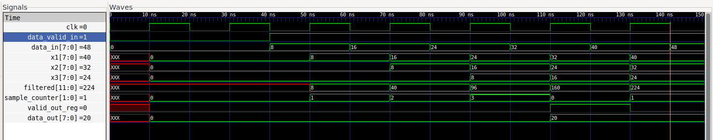


## reference

Padgett, Wayne T. and David V. Anderson. "Fixed-Point Signal Processing." *Synthesis Lectures on Signal Processing* (2009).

Alan V Oppenheim, Ronald W. Schafer. Discrete-Time Signal Processing, 3rd edition

Jabbour, Chadi, etc.. "Digitally enhanced mixed signal systems." *IEEE International Symposium on Circuits and Systems (ISCAS)*. 2019.

Sen M. Kuo. Real-Time Digital Signal Processing: Fundamentals, Implementations and Applications, 3rd Edition. John Wiley & Sons 2013 [[pdf](http://dl.icdst.org/pdfs/files/e51100ce301ad56951e4511a9a1c66aa.pdf)]

Taylor, Fred. *Digital filters: principles and applications with MATLAB*. John Wiley & Sons, 2011

D. Markovic and R. W. Brodersen, DSP Architecture Design Essentials, Springer, 2012.

X. Yang, Integrated Circuit Design: IC Design Flow and Project-Based Learning, 1st edition. Boca Raton: CRC Press, 2024 [[repo](https://github.com/IC-Design-Lab/IC-Design)]

---

Bevan Baas, EEC281 VLSI Digital Signal Processing,  [[https://www.ece.ucdavis.edu/~bbaas/281/](https://www.ece.ucdavis.edu/~bbaas/281/)]

Mark Horowitz. EE371: Advanced VLSI Circuit Design Spring 2006-2007 [[https://web.stanford.edu/class/archive/ee/ee371/ee371.1066/](https://web.stanford.edu/class/archive/ee/ee371/ee371.1066/)]

Tinoosh Mohsenin. CMPE 691: Digital Signal Processing Hardware Implementation [[https://userpages.cs.umbc.edu/tinoosh/cmpe691/](https://userpages.cs.umbc.edu/tinoosh/cmpe691/)]

Keshab K. Parhi [[http://www.ece.umn.edu/users/parhi/](http://www.ece.umn.edu/users/parhi/)]

謝秉璇. 2019 積體電路設計導論 [[link](https://nthuee.org/archive//%E7%A9%8D%E9%AB%94%E9%9B%BB%E8%B7%AF%E8%A8%AD%E8%A8%88%E5%B0%8E%E8%AB%96/2019%E8%AC%9D%E7%A7%89%E7%92%87/)]

---

Jason Sachs. Understanding and Preventing Overflow (I Had Too Much to Add Last Night) [[https://www.embeddedrelated.com/showarticle/532.php](https://www.embeddedrelated.com/showarticle/532.php)]

—. Round Round Get Around: Why Fixed-Point Right-Shifts Are Just Fine [[https://www.embeddedrelated.com/showarticle/1015.php](https://www.embeddedrelated.com/showarticle/1015.php)]

—. How to Build a Fixed-Point PI Controller That Just Works: Part I [[https://www.embeddedrelated.com/showarticle/121.php](https://www.embeddedrelated.com/showarticle/121.php)]

—. How to Build a Fixed-Point PI Controller That Just Works: Part II [[https://www.embeddedrelated.com/showarticle/123.php](https://www.embeddedrelated.com/showarticle/123.php)]

---

AHMED SHAHEIN, Fixed-Point Simulation in GNU Octave—Without MATLAB [[https://www.dsprelated.com/showarticle/1786.php](https://www.dsprelated.com/showarticle/1786.php)]

A. Antoniou, "On the roots of digital signal processing. Part I," in *IEEE Circuits and Systems Magazine*, vol. 7, no. 1, pp. 8-18, First Quarter 2007

—, "Feature - On the roots of digital signal processing - Part II," in *IEEE Circuits and Systems Magazine*, vol. 7, no. 4, pp. 8-19, Fourth Quarter 2007

Hideo Okawara's Mixed Signal Lecture Series [[https://tomverbeure.github.io/2024/01/06/Hideo-Okawara-Mixed-Signal-Lecture-Series.html](https://tomverbeure.github.io/2024/01/06/Hideo-Okawara-Mixed-Signal-Lecture-Series.html)]

Jeffrey Walling, DSP to ASIC Block [[https://youtube.com/playlist?list=PLP4ZmM6GPueNEdnLhgkdr8_X8dSizUwMs](https://youtube.com/playlist?list=PLP4ZmM6GPueNEdnLhgkdr8_X8dSizUwMs)]

