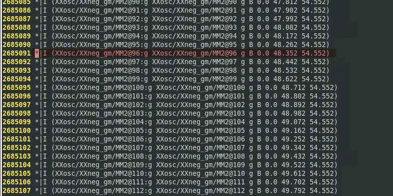
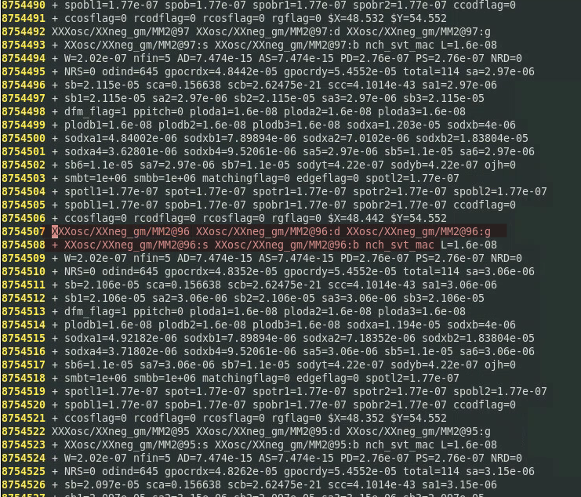
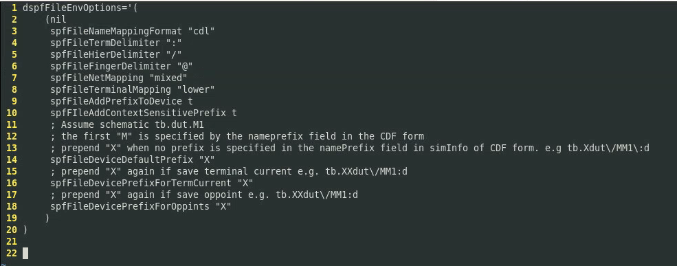
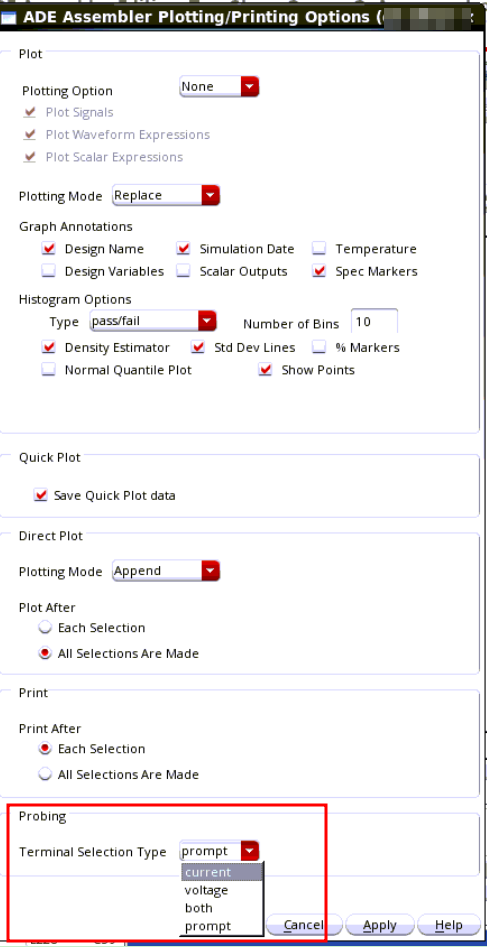
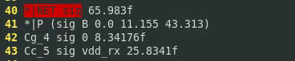

## DSPF Semantics

`*|DIVIDER <divider>`

`<divider>` represents the hierarchical pathname divider. The default hierarchical character is forward slash (**/**).


`*|DELIMITER <delimiter>`

- `<delimiter>` represents the delimiter character used to concatenate an instance name and pin name to form an instance pin name. 
- It is also represents the delimiter character used to concatenate a net name and subnode number to form a subnode name. The default character is colon (**:**)


`*|BUSBIT <left_busbit_char><right_busbit_char>`

`<left_busbit_char>` and `<right_busbit_char>` are used at the end of an identifier of an array to select a single object of the array.

Objects which may be indexed include *nets, primary pins, and instance pins*


`*|NET <netName> <netCap>`

- `<netName>` represents the name of a net. It can be a user-provided net name, the name of the driving pin, or the name of the driving instance pin.
- `<netCap>` represents the **total** capacitance value in farads associated with the net. This may be comprised of capacitances to ground and capacitances to nearby wires.


`*|P <pinName> <pinType> <pinCap> {<coord>}`

- `<pinName>` represents the name of the pin.
- `<pinType>` represents the type of the pin. It can be any of the following: *I (Input), O (Output),
  B (Bidirectional), X (don’t care), S (Switch), and J (Jumper)*.
- `<pinCap>` represents the capacitance value associated with the pin.
- `<coord>` is optional. It represents the location of the pin. Multiple pin locations are allowed.


`*|S <subNodeName> {<coord>}`

subnodes in the net

- `<subNodeName>` represents the name of the subnode. A subnode name is obtained by concatenating the net name and a subnode number using the delimiter specified in the DELIMITER statement. The default delimiter is colon (:).
- `<coord>` represents the location of the subnode.


`*|I <instPinName> <instName> <pinName> <pinType><pinCap> {<coord>?}`

describes instance pins in the net

- `<instPinName>` represents the name of the instance pin. An instance pin name is obtained by concatenating the `<instName>` and the `<pinName>` with a delimiting character which is specified by the DELIMITER statement
- `<instName>` represents the name of the instance


`*|DeviceFingerDelim "@"`

MOS finger delimiter

For example, `M8`'s finger is 4, then split into 4 Devices in DSPF

>  `MM8`, `MM8@2`, `MM8@3`, `MM8@4`

its drain terminal will be

> `MM8:d`, `MM8@2:d`, `MM8@3:d`, `MM8@4:d`


### DSPF Syntax

DSPF has two sections: 

- a **net section** 

  The net section consists of a series of net description blocks. Each net description block corresponds to a net in the physical design. A net description block begins with a net statement followed by pins, instance pins, subnodes, and parasitic resistor/capacitor (`R`/`C`) components that characterize the electrical behavior of the net. 

- an **instance section** 

  The instance section consists of a series of SPICE instance statements. SPICE instance statements begin with an `X`.

Each file consists of hierarchical cells and interconnects only.


The DSPF format is as generic and as much like SPICE as possible. While native SPICE statements describe the R/C sections, some non-native SPICE statements complete the net descriptions. These non-native SPICE statements start with the notation "*|" to differentiate them from native SPICE statements. For native SPICE statements, a continuation line begins with the conventional "+" sign in the first column.

The native SPICE statements used by the DSPF format are listed below:

- `.SUBCKT` represents a subcircuit statement.
- `.ENDS` represents the end of a subcircuit statement.
- `R` represents a resistor element.
- `C` represents a capacitor element.
- `E` represents a voltage-controlled voltage sources element.
- `X` represents an instance of a cell; 
- `*` represents a comment line unless it is `*|` or `*+`.
- `.END` is an optional statement that represents the end of a simulation session


## spectre netlist

`hier_delimiter="."`

Used to set hierarchical delimiter. Length of `hier_delimiter` should not be longer than 1, except the leader escape character


`spfbusdelim = busdelim_schematic [busdelim_parasitic]`

This option maps the bus delimiter between schematic netlist and parasitic file (i.e. DSPF, SPEF, or DPF). The option defines the bus delimiter in the schematic netlist, and optionally the bus delimiter in the parasitic file. By default, the bus delimiter of the parasitic file is taken from the parasitic file header (i.e. *|BUSBIT [], *|BUS_BIT [], or *|BUS_DELIMITER []). If the bus delimiter is not defined in the parasitic file header, you need to specify it by using the spfbusdelim option in schematic netlist.

> Exampel
>
> - spfbusdelim=<> - A<1> in the schematic netlist is mapped to A_1 in the DSPF file, if the bus delimiter header in the DSPF file is "_".
> - spfbusdelim=@ [] - A@1 in the schematic netlist is mapped to to A[1] in the DSPF file (the bus delimiter in DSPF header will be ignored).


## How to Save Net voltage in DSPF

> !!! follow the name  of net section in DSPF - prepend to top-level devices in the schematic with `X`


Assume node n1...n4  are named as below in DSPF file (prefix `X`)

> - n1
>
>   XXosc/zip:1
>
> - n2
>
>   XXosc/zip:2
>
> - n3
>
>   XXosc/zip:3
>
> - n4
>
>   XXosc/zip:4


To save these nodes, you can add follow code in *Definition Files*

*saveopt.scs*

```
save Xwrapper.Xvco.XXosc\/zip\:1
save Xwrapper.Xvco.XXosc\/zip\:2
save Xwrapper.Xvco.XXosc\/zip\:3
save Xwrapper.Xvco.XXosc\/zip\:4
```

> - Escape character `\` is used for hierarchical pathname divider `/` and subnode `:`
>
> - By the way, `.` is hierarchical delimiter of Spectre
>
> -  Calibre always prepend one **X** to instance name of schematic in generated DSPF file
>
> - The DSPF design is *flatten*,  the DIVIDER character indicate the hierarchy


```
save Xwrapper.Xvco.XXosc\/zip
```

The above save voltage, however I'm NOT sure which node it save.

To avoid this unsure problem, the MOS terminal may be better choice to save.

But keep in mind

- OD resistance is lumped in the FEOL model
- M0OD and above layer resistances are extracted by RC tool


## How to Save Current in DSPF

> !!! follow the name of instance section of DSPF - prepend to top-level devices in the schematic with `XX`


MOS in schematic: `Xsupply.M4`

MOS related information in DSPF (prefix `XX` in instance section):

```
...
// net section
*|I XXsupply/MM4:d XXsupply/MM4 d B 0.0 

...
//instance section
XXXsupply/MM4 XXsupply/MM4:d XXsupply/MM4:g XXsupply/MM4:s XXsupply/MM4:b pch_svt_mac
+ L=... W=... nfin=...
+ ...
```

To save drain current:

```
save Xvco.XXXsupply\/MM4:d
```


> `<instName>` in `*|I <instPinName> <instName> <pinName> <pinType><pinCap> {<coord>?}` which has prefix `X` corresponding to schematic is **NOT ** the instance name in DSPF. The instance name is in **instance section** and has prefix `XX`





> !!! Only work for MOS terminal current. Fail to apply to block pin

## Thinking about voltage and current save

- MOS device always prepend with `M`
- To save **net voltage**, take account of the prefix `X` of  top-level device
- To save **MOS terminal**, take account of the prefix `XX` of  top-level device


> Post-layout netlists are created by layout extraction tools - Mentor Calibre


## Differences Between DSPF and Schematic Names


> - MOS Terminal Mismatch ( ‘s’ vs ‘1’)
>   - Schematic: number '1' ,'2', '3','4'
>   - DSPF: 'd', 'g', 's','b'


##  .simrc file

If DSPF files show such differences, you can set options in the **.simrc** file to **update
the save statement in the netlist** so that the device names match with those in the DSPF
file

Additionally, `dspf_include` reads all the DSPF lines starting with **\* (*|NET, *|I, \*|P,\*|S)**, while `include`
considers all related lines as comments.


Only verified to DSPF output of Mentor Calibre

```
; ensure that the netlist is recreated each time
nlReNetlistAll=t

dspfFileEnvOptions = '(
        nil
        spfFileNameMappingFormat "cdl“
        spfFileTermDelimiter “:”
        spfFileHierDelimiter “/”
        spfFileFingerDelimiter “@”
        spfFileNetMapping “mixed”
        spfFileTerminalMapping “lower”
        spfFileAddPrefixToDevice t
        spfFileAddContextSensitivePrefix t
        spfFileDeviceDefaultPrefix “X”
        spfFileDevicePrefixForTermCurrent “X”
        spfFileDevicePrefixForOppoints “X“
        
)
```

> `spfFileDevicePrefixForTermCurrent` and `spfFileDevicePrefixForOppoints` are applicable to MOS devices only.



>  Both  `@` and `__` have been observed  as Finger Delimiter in single DSPF . wired...

## signal name saved using wildcard operator

How to find the signal name saved using wildcard operator with save statement in spectre?

### method 1

From ADE L or ADE XL Test Editor, you can use menu *Simulation → Options → Analog→ Miscellaneous → Addition arguments field:`dump_wildcard_info=yes`*

### method 2

add below in netlist file or *Simulation Files → Definition Files:`saveopt.scs`*

*saveopt.scs*

```
wcOption options dump_wildcard_info=yes
```

### saved file

After running simulation, saved wildcard summary is save into file `<netlist_file_name>.wildcard.out*`

```
Wildcard match summary:

save * nodes: 68
    0
    vdd!
    I0.net10
    I0.net15
    I0.I8.net30
```


## Save and Plot terminal voltage in ADE Explorer and Assembler

**.cdsinit**

```
envSetVal("auCore.selection" "terminalSelectionType" 'cyclic "current")
```

Available options are **current**, **voltage**, **both** or **prompt** and the default is current which matches the default behavior in previous releases.

- The schematic will have an **ellipse** annotation where a current probe has been saved, 
- a **V** annotation for a voltage probe,
- and both annotations for both.


> NOTE: Starting with IC 6.1.8 ISR5, you can now set this from Options->Plotting/Printing



## Interpreting _noxref Entries

> You enable gate recognition in the Calibre nmLVS-H tool. Normally, the **\_noxref** names are internal to the gate


## Saving net with hierarchy delimiter and colon (:) in net name gives WARNING (SPECTRE-8282) during simulation

### Problem


I am running simulation using an spf/spef file which has a net name definition as shown in the below example:
```
// input.scs
simulator lang=spice
.subckt pi_rc a z
r1 a x1a 1k
r2 x1a x1/x1:DRN 1k
cb x1/x1:DRN z 200f
.ends

xpi1 in 0 pi_rc
vdd in 0 pwl (0 0 1n 0 1.1n 10)

simulator lang=spectre
myopt options hier_ambiguity=lower
tran tran stop=2u

save xpi1.x1\/x1:DRN

```

The net name is x1/x1:DRN. During the simulation, the following warning is reported:

Warning from spectre during initial setup.
```
  WARNING (SPECTRE-8282): `xpi1.x1/x1' is not a device or subcircuit instance name.
  WARNING (SPECTRE-8287): Ignoring invalid item `xpi1.x1/x1:DRN' in save statement.
```

How can I save this net for plotting and measurements?


### Solution


**The colon (:) in the save statement specifies terminal current**. So, the save statement used above is for terminal current and, hence, the warning messages are reported.

```
save xpi1.x1\/x1:DRN
```

You need to modify the save statement as below:
```
save xpi1.x1\/x1\:DRN
```

Now, run the simulation and the issue will be resolved.


## DSPF r vs rcc

**rcc**


**c**



only **c** dspf give the **lumped capacitance**

