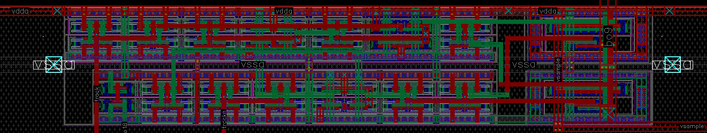
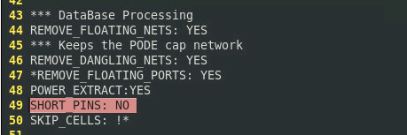
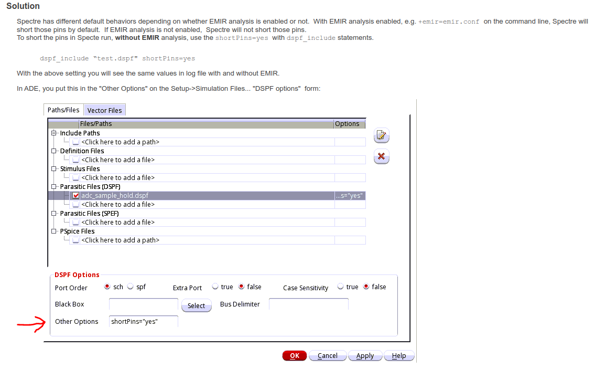

### dspf extract using starrc

multiple label and rectangle  in vssa net



- general dspf

  `SHORT_PINS: YES`

  

  > other pin are short together

- dspf for emir analysis




> It seems that dspf_emir **don't** contain the *rectangle pin* information.
>
> only **label** is necessary


| setup            |                  |                   | spectre result |
| ---------------- | ---------------- | ----------------- | -------------- |
| **netlist type** | **dspf option**  | **emir analysis** |                |
| dspf             | /                | disable           | &check;        |
| dspf_emir        | /                | disable           | &cross;        |
| dspf_emir        | =shortPins=”yes” | disable           | &check;        |
| dspf_emir        | =shortPins=”no”  | disable           | &cross;        |
| dspf_emir        | /                | enable            | &check;        |
| dspf_emir        | =shortPins=”yes” | enable            | &check;        |
| dspf_emir        | =shortPins=”no”  | enable            | &check;        |

> **shortPins=”yes”** is preferred default option for dspf_emir, which has **split pins**





### DSPF Syntax

- <pin_def>::=***|P <pin_element>?**
  	<pin_element> describes pins in the net. Multiple pin descriptions can be listed in one line.

- <pin_element>::=(<pinName> <pinType> <pinCap> {<coord>}?)
  	<pinName> represents the name of the pin.
  	<pinType> represents the type of the pin. It can be any of the following: I (Input), O (Output), 

  ​	    B (Bidirectional), X (don’t care), S (Switch), and J (Jumper).
  ​	<pinCap> represents the capacitance value associated with the pin.
  ​	<coord> is optional. It represents the location of the pin. Multiple pin locations are allowed


#### split pins

```
*|P (avss_1 O 0 207.7555 59.9170)
*|P (avss_10 O 0 181.1610 151.1130)
*|P (avss_11 O 0 186.6330 151.1130)
*|P (avss_12 O 0 192.1050 151.1130)
*|P (avss_13 O 0 197.5770 151.1130)
```


### reference

Article (20467964) Title: Difference in result on running Spectre APS with EMIR and without EMIR analysis
URL: [https://support.cadence.com/apex/ArticleAttachmentPortal?id=a1O0V00000679GRUAY](https://support.cadence.com/apex/ArticleAttachmentPortal?id=a1O0V00000679GRUAY)

StarRC User Guide and Command Reference Version O-2018.06, June 2018
