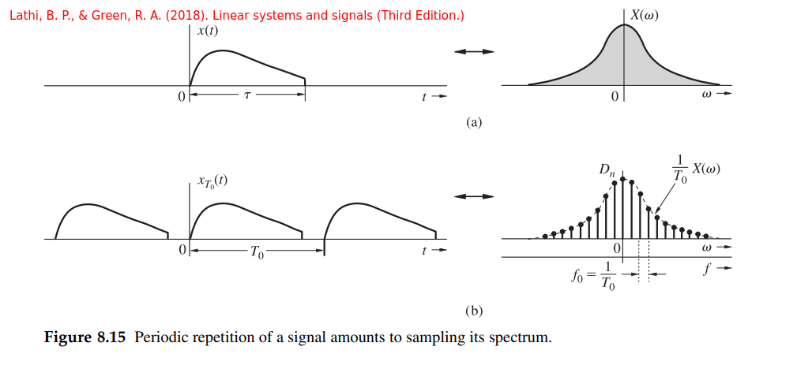
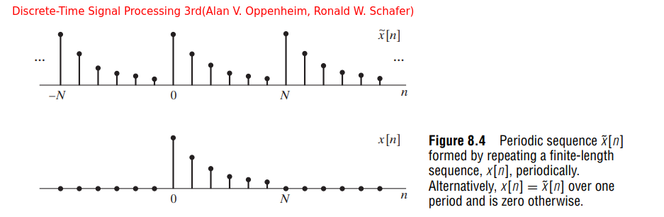
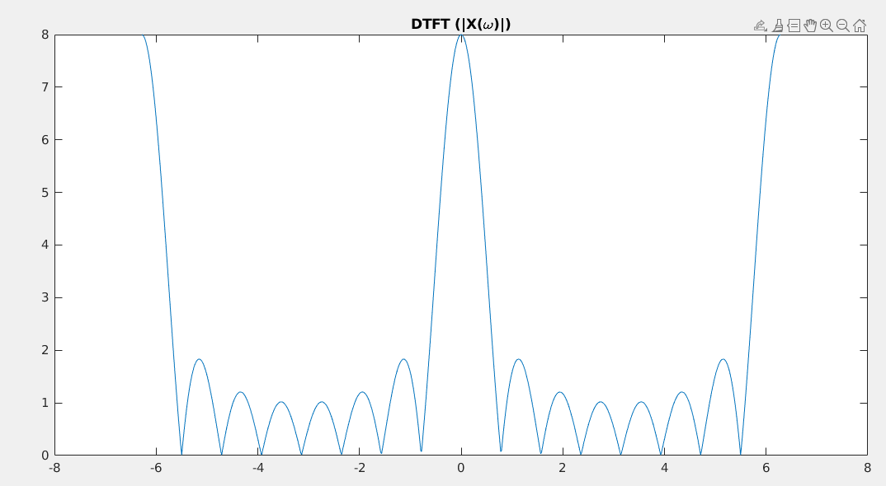
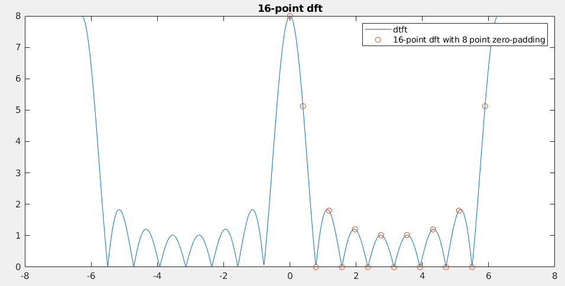
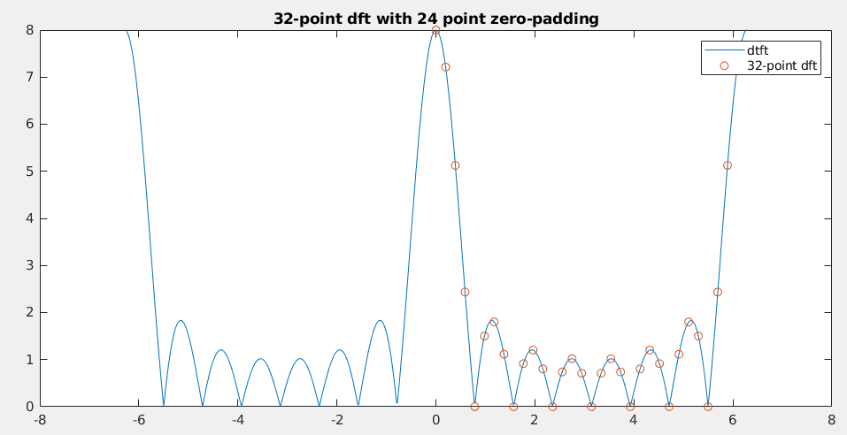
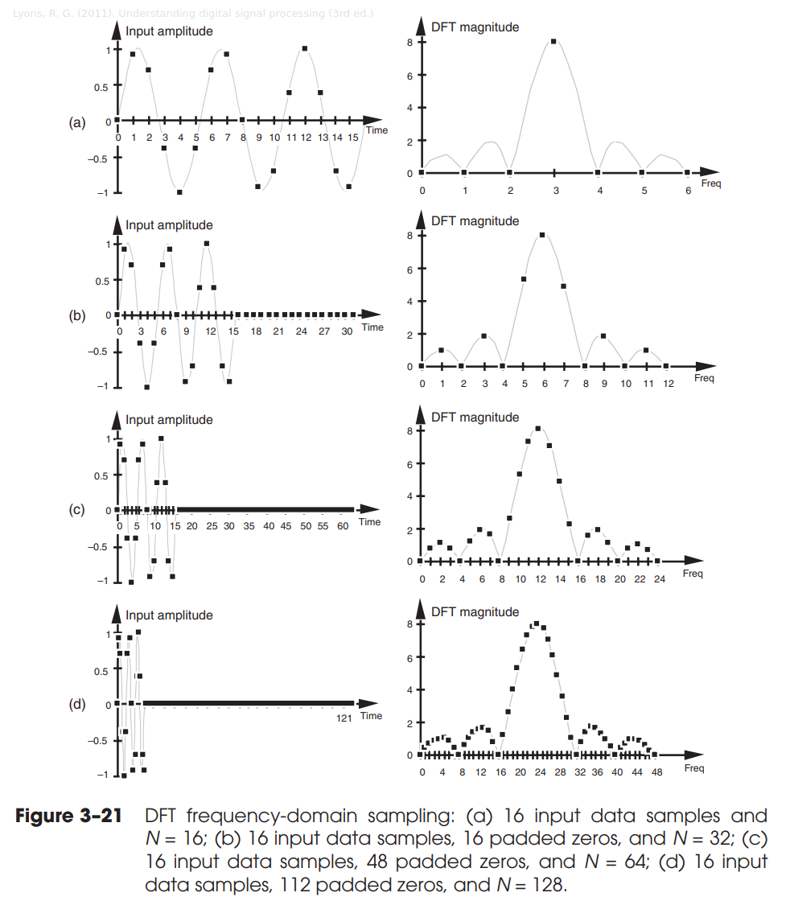
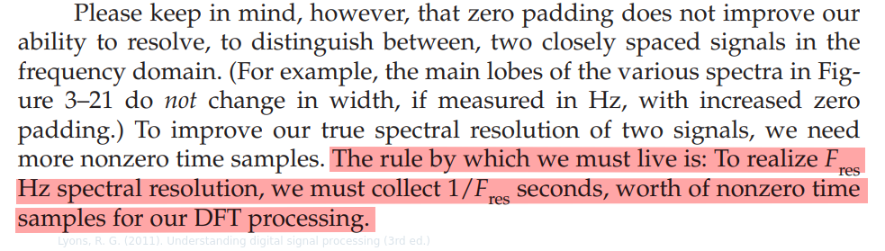

## sampling theorem

### time-sampling theorem


The spectrum $\overline{X}(\omega)$ consists of $X(\omega)$ repeating periodically with period $\omega _s = 2\pi/T$ rad/s, or $f_s = 1/T$ Hz
$$
\overline{X}(\omega) = \frac{1}{T}\sum_{n=-\infty}^{\infty}X(\omega - n\omega _s)
$$

### spectral-sampling theorem



The Fourier transform $X(\omega)$ of a **timelimited** signal $x(t)$ is given by
$$
X(\omega)=\int_{-\infty}^{\infty}x(t)e^{-j\omega t}dt = \int_0^{\tau}x(t)e^{-j\omega t}dt
$$
$x_{T_0}(t)$, a **periodic** signal formed by repeating $x(t)$ every $T_0$ seconds ($T_0 \gt \tau$), which can be expressed by the exponential Fourier series
$$
x_{T_0}(t) = \sum_{-\infty}^{\infty}D_ne^{jn\omega _0t}
$$
where $\omega_0 = \frac{2\pi}{T_0}$

And $D_n$ can be obtained by (assuming $T_0 \gt \tau$)
$$
D_n = \frac{1}{T_0}\int_0^{T_0}x(t)e^{-jn\omega _0 t}dt = \frac{1}{T_0}\int_0^{\tau}x(t)e^{-jn\omega _0 t}dt
$$
Then it follows that
$$
D_n = \frac{1}{T_0}X(n\omega _0)
$$
This result indicates that the *coefficients of the Fourier series* for $x_{T_0}(t)$ are $(1/T_0)$ times the *sample values of the spectrum* $X(\omega)$ taken at intervals of $\omega _0$.


#### spectral interpolation

Consider a signal *timelimited* to $\tau$ seconds and *centered at* $T_c$. The spectrum $X(\omega)$ of $x(t)$ can be reconstructed from the samples of $X(\omega)$ and the **spectral interpolation formula** is obtained as
$$
X(\omega) = \sum_{-\infty}^{\infty}X(n\omega _0) \text{sinc}\left(\frac{\omega T_0}{2}-n\pi\right)e^{-j(\omega - n\omega _0)T_c}
$$
step by step:

1. The Fourier transform of $x_{T_0}(t)$ is 
   $$
   2\pi\sum_n D_n \delta(\omega - n\omega_0) = \frac{2\pi}{T_0}\sum_n X(n\omega_0) \delta(\omega - n\omega_0)
   $$

2. The Fourier transform of rectangular pulse $\text{rect}((t-T_c)/T_0)$ centered at $T_c$ and duration $T_0$ 
   $$
   T_0 \text{sinc}(\omega T_0/2)e^{-j\omega T_c}
   $$

3. Hence, $X(\omega)$ is $1/2\pi$ times the *convolution* of these two Fourier


## Numerical Computation of The Fourier Transform 


### Finite-length signal & periodic signal



> $$
> x[n] = \left\{ \begin{array}{cl}
> \tilde{x}[n] & : \ 0 \leq n \leq N-1 \\
> 0 & : \text{otherwise}
> \end{array} \right.
> $$
>

Consider a finite-length signal $x[n]$ such that $x[n] = 0$ except in the interval $0 \leq n \leq N − 1$, and consider the convolution of $x[n]$ with the periodic impulse train $\tilde{p}[n]$:
$$
\tilde{x}[n] = x[n]*\tilde{p}[n] = x[n]* \sum_{r=-\infty}^{\infty}\delta[n-rN] = \sum_{r=-\infty}^{\infty}x[n-rN]
$$
Thanks to Fourier Transform *convolution property*,  the DTFT of $\tilde{x}[n]$ is obtained

$$\begin{align}
\tilde{X}(e^{j\omega}) &= X(e^{j\omega}) \tilde{P}(e^{j\omega})\\
&= X(e^{j\omega}) \sum_{k=-\infty}^{\infty}\frac{2\pi}{N}\delta\left(\omega - \frac{2\pi k}{N}\right) \\
& = \sum_{k=-\infty}^{\infty}\frac{2\pi}{N}X(e^{j(2\pi/N)k})\delta\left(\omega - \frac{2\pi k}{N}\right)
\end{align}$$

&#11088; we conclude the DFS coefficients of $\tilde{x}[n]$ is
$$
\tilde{X}[k] = X(e^{j\omega})|_{\omega=2\pi k/N}
$$
where $\tilde{X}[k]$ is **DFS coefficients** of $\tilde{X}[k]$; 

$X(e^{j\omega})|_{\omega=2\pi k/N}$ is samples of the **DTFT** of the *finite-length sequence* $x[n]$ 


### sampling the Fourier transform

Assuming an *aperiodic sequence* with Fourier transform $X(e^{j\omega})$, the **sequences of samples** $\tilde{X}[k] = X(e^{j\omega})|_{\omega=2\pi k/N}$ being periodic with period $N$ could be the **sequence of *DFS* coefficients** of sequence $\tilde{x}[n]$

&#11088;To obtain $\tilde{x}[n]$, substitute $\tilde{X}[k]$ into DFS synthesis equation
$$
\tilde{x}[n] =x[n]*\sum_{r=-\infty}^{\infty}\delta[n-rN] = \sum_{r=-\infty}^{\infty}x[n-rN]
$$
Thus, the periodic sequence $\tilde{x}[n]$, corresponding to $\tilde{X}[k]$ obtained by sampling $X(e^{j\omega})$, is formed from $x[n]$ by *adding together an infinite number of shifted replicas of $x[n]$*.


### Discrete Fourier Transform (DFT)

> When the **Fourier series** is used in this way to represent *finite-length sequences*, it is called the discrete Fourier transform or **DFT**
>
> In developing, discussing, and applying the DFT, it is always important to remember that the representation through *samples of the Fourier transform* is in effect *a representation of the finite-duration sequence by a periodic sequence*, **one period of which is the finite duration sequence that we wish to represent**

- Considering a *finite-length* sequence $x[n]$ of length $N$ samples such that $x[n]=0$ outside the range $0\leq n \leq N-1$.

  To each finite-length sequence of length $N$, we can always associate a periodic sequence $\tilde{x}[n]$

  $\tilde{x}[n] = \sum_{r=-\infty}^{\infty}x[n-rN]$

- Since $x[n]$ is assumed to have finite length $N$, there is *no overlap* between the terms $x[n − rN]$ for different values of $r$.

  $\tilde{x}[n] = x[(n \; \text{modulo}\; N)]$

  

As discussed  the sequence of *DFS coefficients* $\tilde{X}[k]$ of *the periodic sequence* $\tilde{x}[n]$ is itself a periodic sequence with *period* $N$. 

To maintain a duality between the time and frequency domains, This finite-duration sequence, $X [k]$,  one period of $\tilde{X}[k]$ will be referred to as the **DFT**
$$
X[k] = \left\{ \begin{array}{cl}
\tilde{X}[k] & : \ 0 \leq k \leq N-1 \\
0 & : \ \text{otherwise}
\end{array} \right.
$$
and
$$
\tilde{X}[k] = X[(k \; \text{modulo}\; N)]
$$
$\tilde{X}[k]$ and $\tilde{x}[n]$ are related by

$$\begin{align}
\tilde{X}[k] &= \sum_{n=0}^{N-1}\tilde{x}[n]W_N^{kn} \\
\tilde{x}[n] &=\frac{1}{N} \sum_{k=0}^{N-1}\tilde{X}[k]W_N^{-kn}
\end{align}$$

where $W_N = e^{-j(2\pi/N)}$


DFT analysis and synthesis equations , $X[k]$ and $x[n]$ are related by

&#11088; Analysis equation:
$$
X[k] = \left\{ \begin{array}{cl}
\sum_{n=0}^{N-1}x[n]W_N^{kn} & : \ 0 \leq k \leq N-1 \\
0 & : \ \text{otherwise}
\end{array} \right.
$$
&#11088; Synthesis equation:
$$
x[n] = \left\{ \begin{array}{cl}
\frac{1}{N} \sum_{k=0}^{N-1}X[k]W_N^{-kn} & : \ 0 \leq n \leq N-1 \\
0 & : \ \text{otherwise}
\end{array} \right.
$$

> That is, the fact that $X[k]=0$ for $k$ outside the interval $0 \leq k \leq N −1$ and that $x[n] = 0$ for $n$ outside the interval $0 \leq n \leq N − 1$ is implied, but not always stated explicitly. 


> The inherent periodicity is always present. Sometimes, it causes us difficulty, and sometimes we can exploit it, but to totally ignore it is to invite trouble.
>
> 
>
> In defining the DFT representation, 
>
> - we are simply recognizing that we are interested in values of $x[n]$ only in the interval $0 \leq n \leq N-1$, because $x[n]$ is really zero outside that interval, 
> - and we are interested in values of $X[k]$ only in the interval $0 \leq k \leq N-1$ because these are the only values needed to reconstruct $x[n]$

### Multiplication Property (Modulation Property)

$$
x_1(t)x_2(t)\overset{FT}{\longrightarrow}\frac{1}{2\pi}X_1(\omega)*X_2(\omega)
$$

Then sampled signal fourier transform is
$$\begin{align}
X_s(\omega) &= \frac{1}{2\pi}X_{\delta}(\omega)*X(\omega) \\
&= \frac{1}{T} \left(\sum_{k\in \mathbb{Z}}\delta(\omega - k\frac{2\pi}{T})\right) * X(\omega)
\end{align}$$

[Lecture 11: Sampling and Pulse Modulation](https://web.stanford.edu/class/ee179/lectures/notes11.pdf)


### multiplication property & convolution property

Because a digital computer can work only with *discrete data* (sequence of numbers), moreover, it can compute $X(\omega)$ only at some *discrete values* of $\omega$ (samples of $X(\omega)$). 


- **{ (a), (b) } -> { (c), (d) }**: 

  with CT multiplication property,  $X(\omega) = T \overline{X}(\omega)$

- **{ (c), (d) } -> { (e), (f) }**: 

  with DT convolution property, $X_N(\omega) = \frac{2\pi}{N}\overline{X}(\omega)$

- Assuming $x_{T0}(t) =\sum_{r=-\infty}^{\infty}x(t-rT_0)$, formed by adding together an infinite number of shifted replicas of $x(t)$: with CT convolution property, $X_{T0}(\omega)=X(\omega)\frac{2\pi}{T_0}=\overline{X}(\omega)\frac{2\pi T}{T_0}$ which is $X_{T0}(\omega)=\frac{2\pi}{N}\overline{X}(\omega)$

$X_N(\omega) = X_{T0}(\omega)$ indicates that finite-length discrete-time sequence provide Fourier Transform of continuous-time periodic signal


&#11088;when a signal $x(t)$ is sampled and then periodically repeated, the corresponding spectrum is also sampled and periodically repeated


## zero-padding

### The number of zero-padding

When you tack on a bunch of zeros to a sequence and then compute the *DFT*, you're just getting **more and more samples** of the *DTFT* of the original sequence.

 Let's look at a simple rectangular pulse, $x[n]=1$ for $0 \leq n \lt M$. The DTFT of $x[n]$ is:
$$
X(\omega) = \frac{\sin(\omega M/2)}{\sin(\omega/2)} e^{-j \omega (M-1)/2}
$$
Let's plot $|X(\omega)|$ for $M=8$ over a couple of periods:



 Here's the *P*-point DFT of our 8-point rectangular pulse:

- 8-point DFT

  

- 16-point DFT

  

- 32-point DFT

  

```matlab
clc;
clear all;

M = 8;
w = linspace(-2*pi, 2*pi, 800);
X_dtft = (sin(w*M/2) ./ sin(w/2)) .* exp(-1j * w * (M-1) / 2);
figure(1)
plot(w, abs(X_dtft))
title('DTFT (|X(\omega)|)')

x = ones(1, M);

% P = 8
P = 8;
X_8pt = fft(x, P);
w_k_8pt = (0:P-1) * (2*pi/P);

% 16-point dft
P = 16;
X_16pt = fft(x, P); % pad 8 point
w_k_16pt = (0:P-1) * (2*pi/P);


% 32-point dft
P = 32;
X_32pt = fft(x, P); % pad 24 point
w_k_32pt = (0:P-1) * (2*pi/P);

figure(2)
plot(w, abs(X_dtft))
hold on
plot(w_k_8pt, abs(X_8pt), 'o')
hold off
legend('dtft', '8-point dft')
title('8-point dft (without zero-padding)')

figure(3)
plot(w, abs(X_dtft))
hold on
plot(w_k_16pt, abs(X_16pt), 'o')
hold off
legend('dtft', '16-point dft with 8 point zero-padding')
title('16-point dft')

figure(4)
plot(w, abs(X_dtft))
hold on
plot(w_k_32pt, abs(X_32pt), 'o')
hold off
legend('dtft', '32-point dft')
title('32-point dft with 24 point zero-padding')
```


**Zero padding does not improve accuracy or resolution.**

- Zero padding only allows us to look at more samples of that imperfect reality. It can never reduce the imperfection which caused by **aliasing**.  

- The only way to obtain the detailed signal spectrum with a fine frequency resolution is to apply
  more available data samples, that is, a longer sequence of data. 






### prepend vs postpend vs both

*TODO* &#128197;


## reference

Proakis, J. G., & Manolakis, D. G. (2007). Digital signal processing (4th ed.). Pearson Prentice Hall.

Tan, & Jiang, J. (2019). Digital signal processing : fundamentals and applications  / Lizhe Tan and Jean Jiang. (Third edition.). Academic Press.

Steve Eddins, The DFT and the DTFT [https://blogs.mathworks.com/steve/2010/03/15/the-dft-and-the-dtft-mathjax/?doing_wp_cron=1648269838.4060609340667724609375](https://blogs.mathworks.com/steve/2010/03/15/the-dft-and-the-dtft-mathjax/?doing_wp_cron=1648269838.4060609340667724609375)

Lathi, B. P., & Green, R. A. (2018). Linear systems and signals (Third Edition.). Oxford University Press.

Oppenheim, A. V., & Schafer, R. W. (2014). Discrete-time signal processing (Third ed., Pearson new internat. ed.). Pearson.

Lyons, R. G. (2011). Understanding digital signal processing (3rd ed.). Prentice Hall.

Dr. Wang Hongwei. FFT Basics and Case Study using Multi-Instrument [[https://www.virtins.com/doc/D1002/FFT_Basics_and_Case_Study_using_Multi-Instrument_D1002.pdf](https://www.virtins.com/doc/D1002/FFT_Basics_and_Case_Study_using_Multi-Instrument_D1002.pdf)]

Spectral Leakage and Zero-Padding of the Discrete Fourier Transform [[https://dspillustrations.com/pages/posts/misc/spectral-leakage-zero-padding-and-frequency-resolution.html](https://dspillustrations.com/pages/posts/misc/spectral-leakage-zero-padding-and-frequency-resolution.html)]
