*TODO* &#128197;

magnetic field (magnetic flux density, $B$), is the **tesla** (symbol: $T$), defined as one **weber per square meter** ($Wb/m^2$)

Magnetic flux $\Phi_B$ measures the total magnetic field ($B$) passing through a given surface area ($A$), representing the number of field lines penetrating that area. Measured in **Webers** ($Wb$),

## Vector Calculus

> 3Blue1Brown, Divergence and curl: The language of Maxwell's equations, fluid flow, and more [[https://youtu.be/rB83DpBJQsE](https://youtu.be/rB83DpBJQsE)]

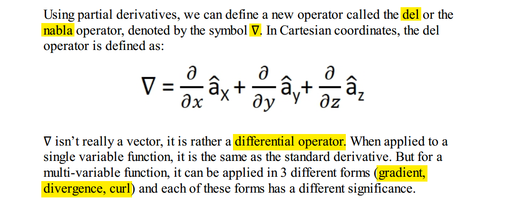

### Gradient

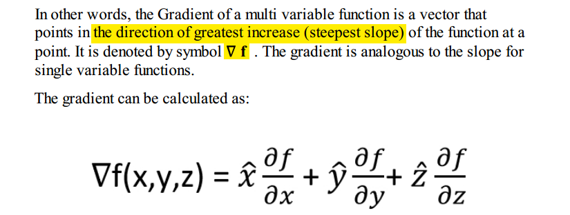


### Divergence 

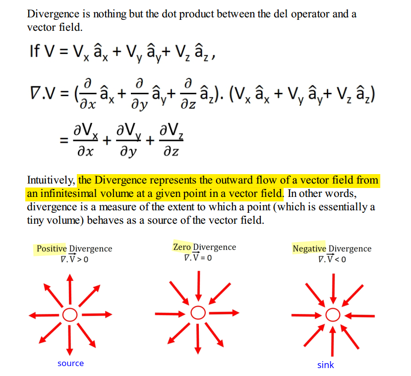

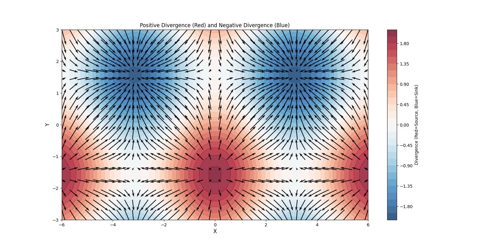

```python
# https://share.google/aimode/l3lNa2MRAOG8hkpOc

import numpy as np
import matplotlib.pyplot as plt

# 1. Define the grid
x = np.linspace(-6, 6, 40)
y = np.linspace(-3, 3, 20)
X, Y = np.meshgrid(x, y)

# 2. Define the vector field components F = [U, V]
U = np.sin(X)
V = np.cos(Y)

# 3. Calculate Divergence (Scalar Field)
div_F = np.cos(X) - np.sin(Y)

# 4. Create the plot
fig, ax = plt.subplots(figsize=(16, 8))

# Use 'RdBu_r' (reversed) so Positive = Red, Negative = Blue
contour = ax.contourf(X, Y, div_F, cmap='RdBu_r', levels=30, alpha=0.8)
fig.colorbar(contour, label='Divergence (Red=Source, Blue=Sink)')

# Plot Vector Field
ax.quiver(X, Y, U, V, color='black', alpha=0.9, scale=20)
ax.set_xlabel('X', fontsize=12)
ax.set_ylabel('Y', fontsize=12)
ax.set_title(r'Positive Divergence (Red) and Negative Divergence (Blue)')
plt.show()
```

### Curl

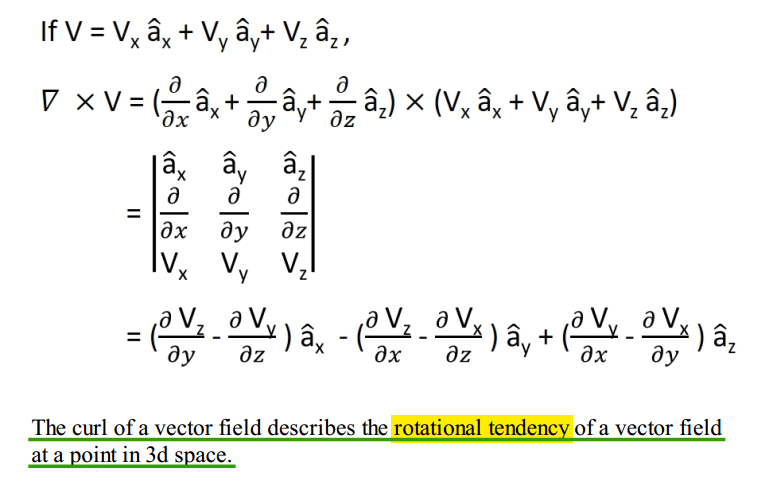

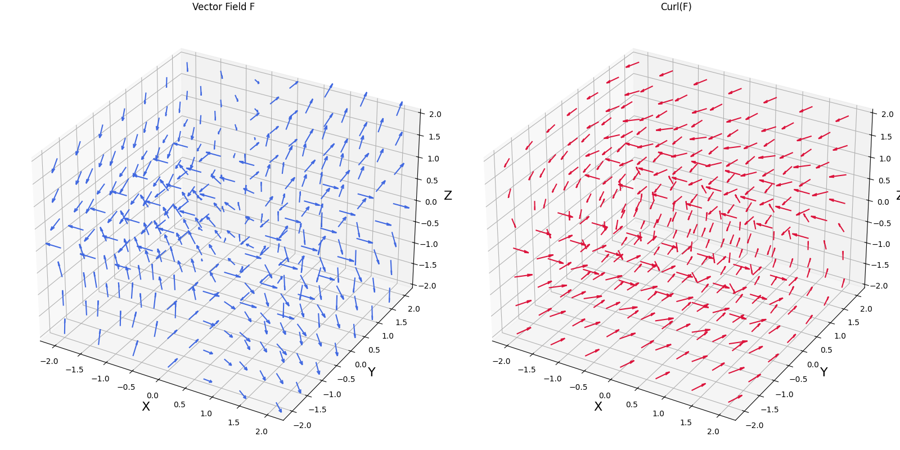

```python
# https://share.google/aimode/hWb3cR4vCBoWV4Moi

import numpy as np
import matplotlib.pyplot as plt

# 1. Setup the coordinate grid
x = np.linspace(-2, 2, 7)
y = np.linspace(-2, 2, 7)
z = np.linspace(-2, 2, 7)
X, Y, Z = np.meshgrid(x, y, z)

# 2. Define the Vector Field F and Curl(F)
U, V, W = X, Y*Z, 3*X*Z
C_U, C_V, C_W = -Y, -3*Z, np.zeros_like(Z)

# 3. Create the plot
fig = plt.figure(figsize=(16, 8), constrained_layout=True)

# Subplot 1: Vector Field
ax1 = fig.add_subplot(121, projection='3d')
ax1.quiver(X, Y, Z, U, V, W, length=0.3, normalize=True, color='royalblue')
ax1.set_title('Vector Field F')
ax1.set_xlabel('X', fontsize=16)  # Adding x-label
ax1.set_ylabel('Y', fontsize=16)  # Adding y-label
ax1.set_zlabel('Z', fontsize=16)  # Adding z-label

# Subplot 2: Curl
ax2 = fig.add_subplot(122, projection='3d')
ax2.quiver(X, Y, Z, C_U, C_V, C_W, length=0.3, normalize=True, color='crimson')
ax2.set_title('Curl(F)')
ax2.set_xlabel('X', fontsize=16)  # Adding x-label
ax2.set_ylabel('Y', fontsize=16)  # Adding y-label
ax2.set_zlabel('Z', fontsize=16)  # Adding z-label

# plt.tight_layout(pad=3.0, rect=[0, 0, 1, 0.95])
plt.show()
```

---

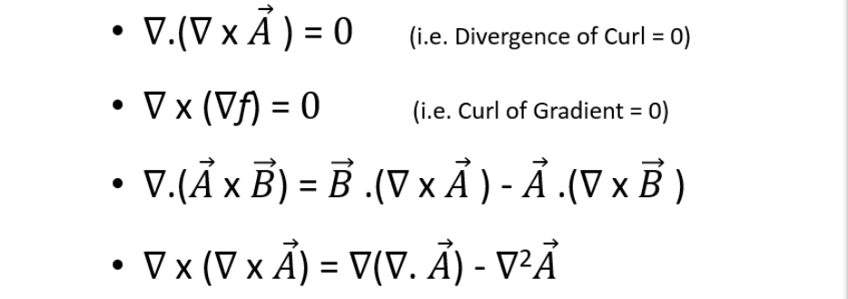

---

***cross product*** [[Google AI Mode](https://share.google/aimode/X61My7I4dFxHqjzxA)]

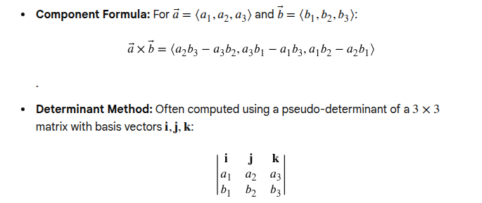


### Divergence Theorem (Gauss's Theorem)

$$
\oint_S \vec{F} \cdot d\vec{S} = \int_V (\nabla \cdot \vec{F}) dv
$$

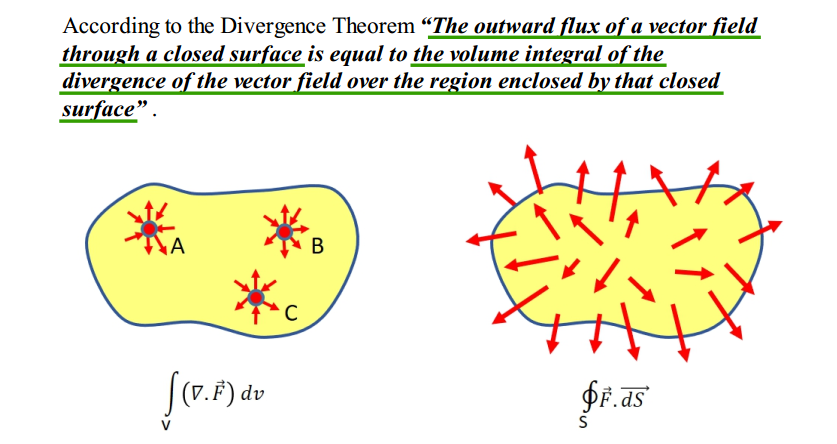

> Divergence theorem is only applicable to ***closed surfaces***

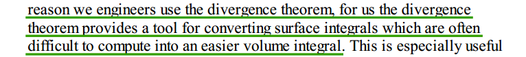

### Stoke's theorem 

$$
\oint_{c} \vec{F} \cdot \vec{dl} = \int_{s} (\nabla \times \vec{F}) \cdot \vec{dS}
$$


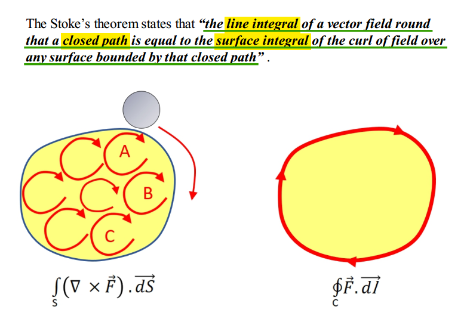


## Magnetostatics

***Magnetostatics*** is the study of magnetic fields in systems where the **currents are steady** (not changing with time)

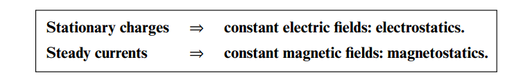

### Magnetic Field Intensity($H$) & Magnetic Flux Density($B$)

*TODO* &#128197;


## Magnetic Potential

### Magnetic Scalar Potential

*TODO* &#128197;

### Magnetic Vector Potential

*TODO* &#128197;

## Field Inside and Outside a Current-Carrying Wire

> Sources of Magnetic Fields [[https://web.mit.edu/8.02t/www/802TEAL3D/visualizations/coursenotes/modules/guide09.pdf](https://web.mit.edu/8.02t/www/802TEAL3D/visualizations/coursenotes/modules/guide09.pdf)]

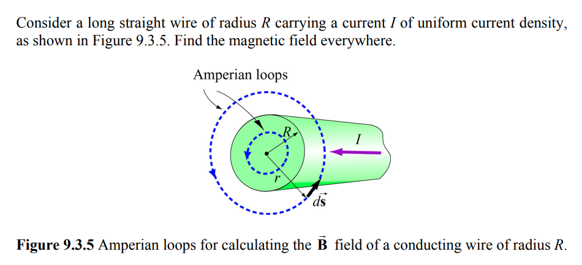

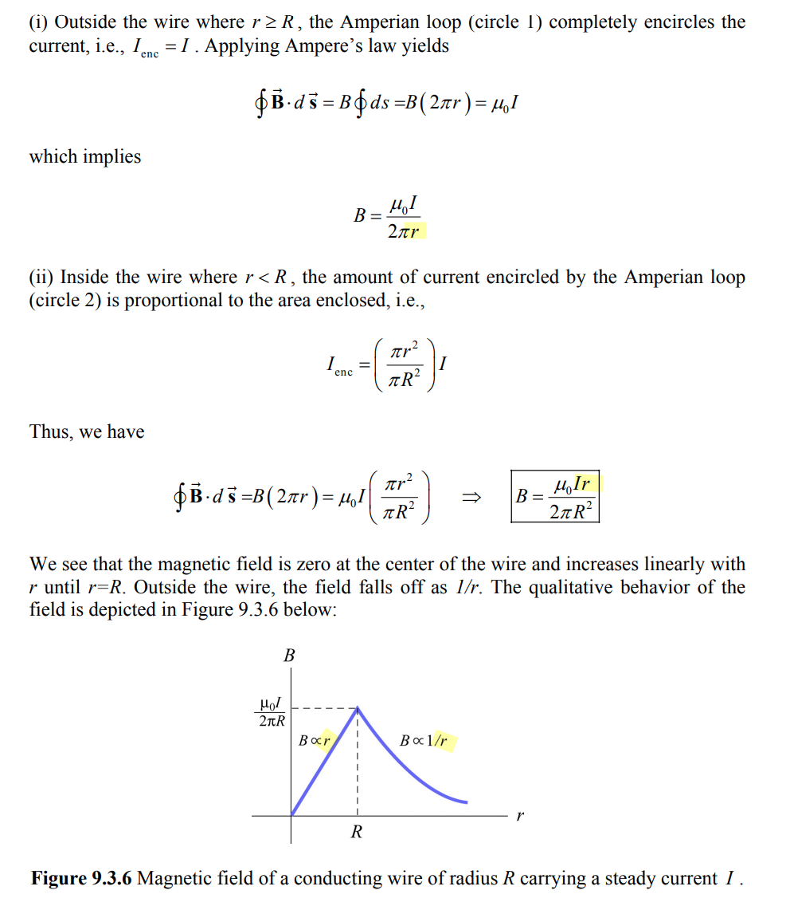


##  Displacement Current

> A. Sheikholeslami, "Current Without Electrons [Circuit Intuitions]," in IEEE Solid-State Circuits Magazine, vol. 17, no. 4, pp. 8-10, Fall 2025
>
> —, "Current Without Electric Field [Circuit Intuitions]," in *IEEE Solid-State Circuits Magazine*, vol. 18, no. 1, pp. 8-12, winter 2026

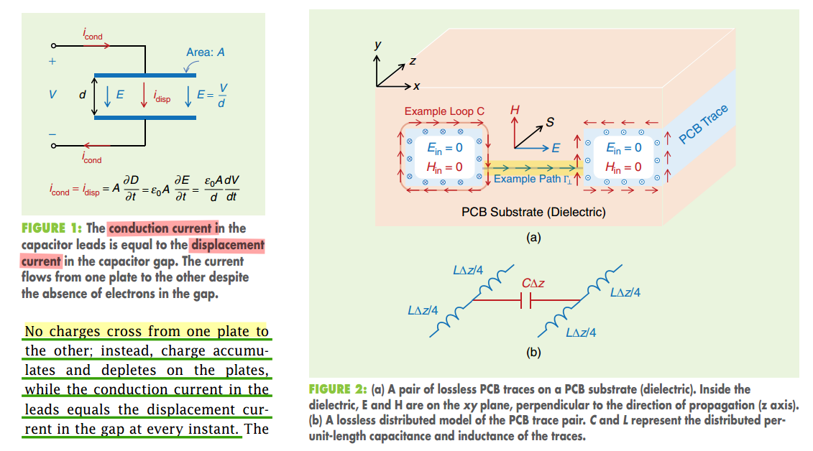

energy and information are carried by electric and magnetic fields ($E$ and $H$) rather than by electron drift


## proximity effect & skin effect 

- *Skin effect* concentrates current near the ***surface*** of a single conductor, while *proximity effect* concentrates current in ***specific regions*** of multiple conductors due to their interaction
- *Skin effect* is caused by the conductor's ***own*** magnetic field, while proximity effect is caused by the magnetic field of a ***nearby*** conductor

---

***proximity effect*** is a *redistribution of electric current* occurring in ***nearby parallel electrical conductors*** carrying *alternating current (AC)*, caused by ***magnetic effects*** (eddy currents)

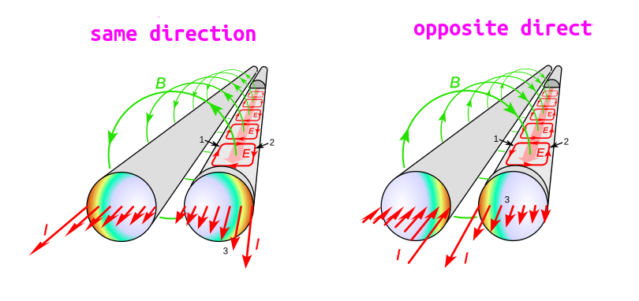

---

***skin effect*** is the tendency of ***AC current*** flow near the surface (or "skin") of a conductor, rather than throughout its cross-section, due to the ***magnetic field generated by the current itself***

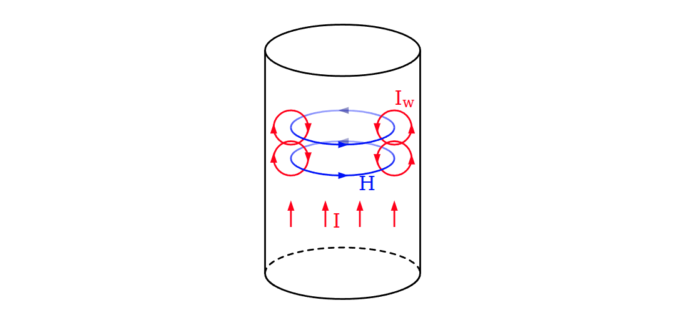

> ***Cause of skin effect***
>
> A main current $I$ flowing through a conductor induces a magnetic field $H$. If the current increases, as in this figure, the resulting increase in $H$ induces separate, circulating ***eddy currents*** $I_W$ which partially cancel the current flow in the center and reinforce it near the skin

---

***Eddy current***

By [Lenz's law](https://en.wikipedia.org/wiki/Lenz's_law), an eddy current creates a magnetic field that ***opposes*** the change in the magnetic field that created it, and thus eddy currents ***react back*** on the source of the magnetic field


## Transformer

任何封闭电路中感应电动势大小，等于穿过这一电路磁通量的变化率。
$$
\epsilon = -\frac{d\Phi_B}{dt}
$$
其中 $\epsilon$是电动势，单位为伏特

$\Phi_B$是通过电路的磁通量，单位为韦伯

电动势的方向（公式中的负号）由楞次定律决定

> **楞次定律**: 由于磁通量的改变而产生的感应电流，其方向为抗拒磁通量改变的方向。

> 在回路中产生感应电动势的原因是由于通过回路平面的磁通量的**变化**，而不是磁通量本身，即使通过回路的磁通量很大，但只要它不随时间变化，回路中依然不会产生感应电动势。


### 自感电动势

当电流$I$随时间变化时，在线圈中产生的自感电动势为
$$
\epsilon = -L\frac{dI}{dt}
$$


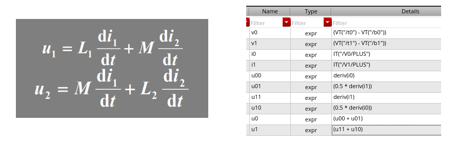


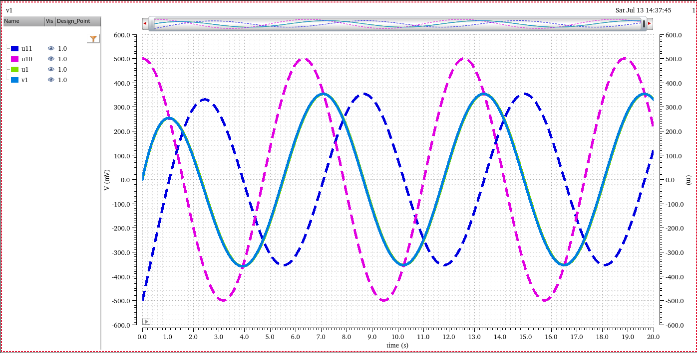


---


***magnetic flux***

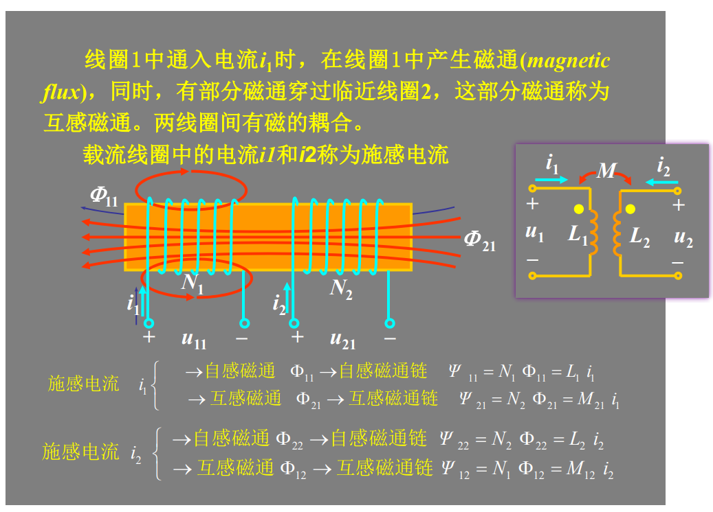

***magnetic linkage***

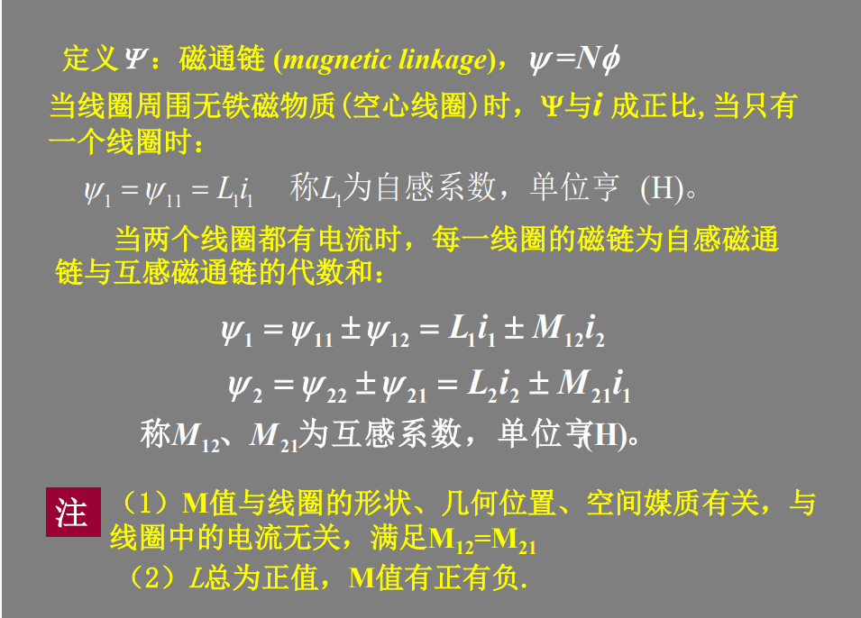

> **同名端**：当两个*电流*分别从两个线圈的对应端子流入 ，其所 产生的磁场相互加强时，则这两个对应端子称为同名端。


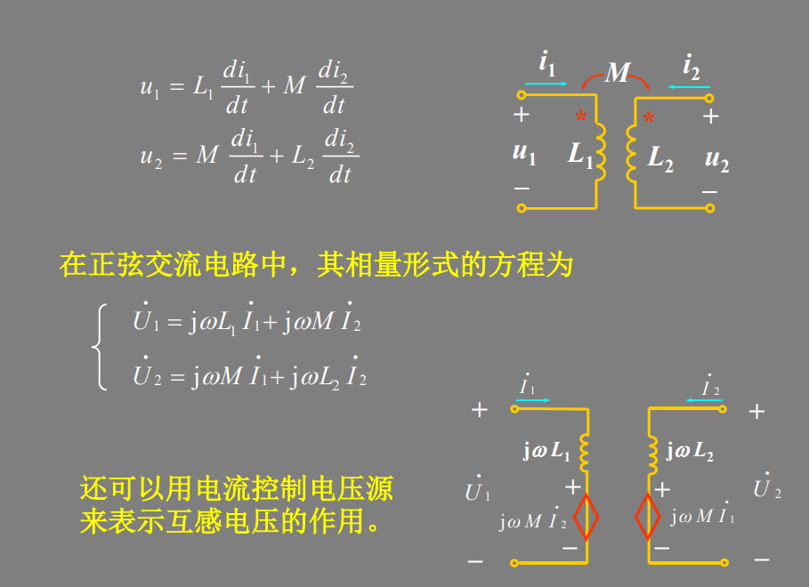

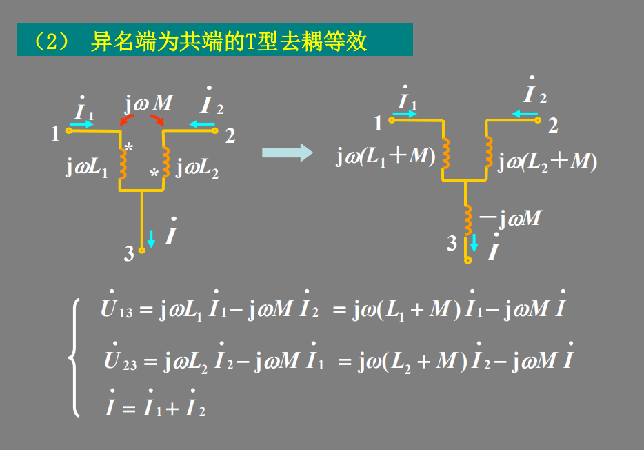


## reference

Griffiths, David J. *Introduction to Electrodynamics*. Fifth edition. Cambridge University Press, 2024. [[pdf](https://nucleares.unam.mx/~martinel/griffiths_4ed.pdf)]

谢处方、饶克谨、杨显清等.《电磁场与电磁波》（第五版），高等教育出. 版社，2019.

邓友金. 电磁学 2022春 [[http://staff.ustc.edu.cn/~yjdeng/EM2022/EM2022.html](http://staff.ustc.edu.cn/~yjdeng/EM2022/EM2022.html)]

Scott Hughes. Spring 2005 8.022: Electricity & Magnetism [[https://web.mit.edu/sahughes/www/8.022/](https://web.mit.edu/sahughes/www/8.022/)]

David Smith, Electromagnetic Theory for Complete Idiot, 2021
