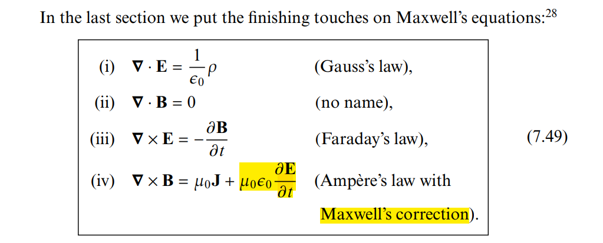
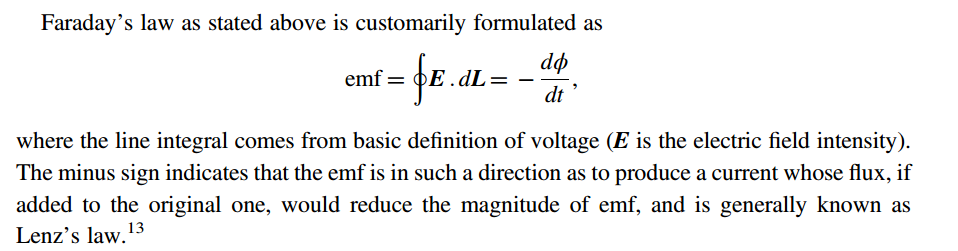
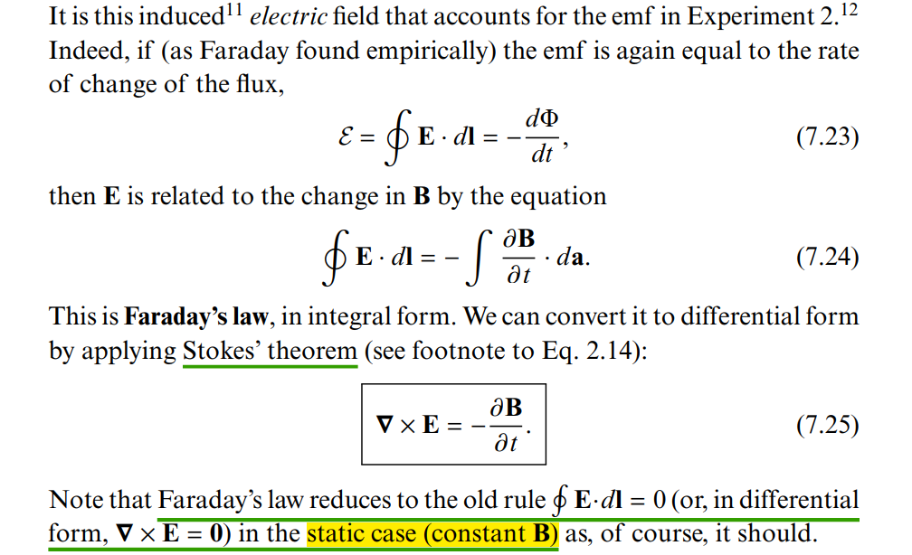
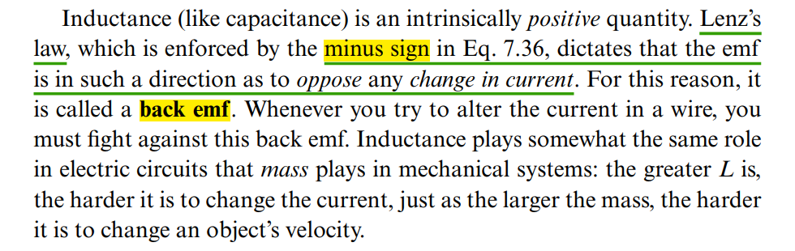
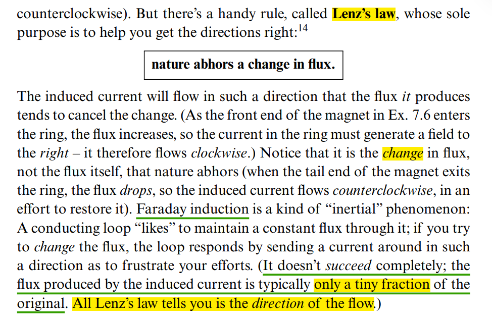
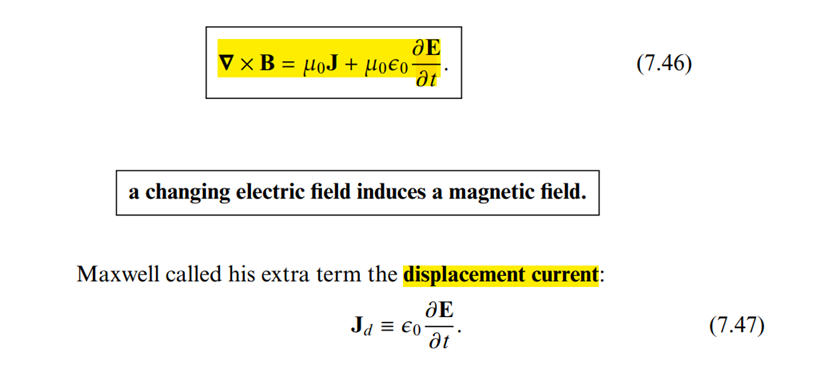
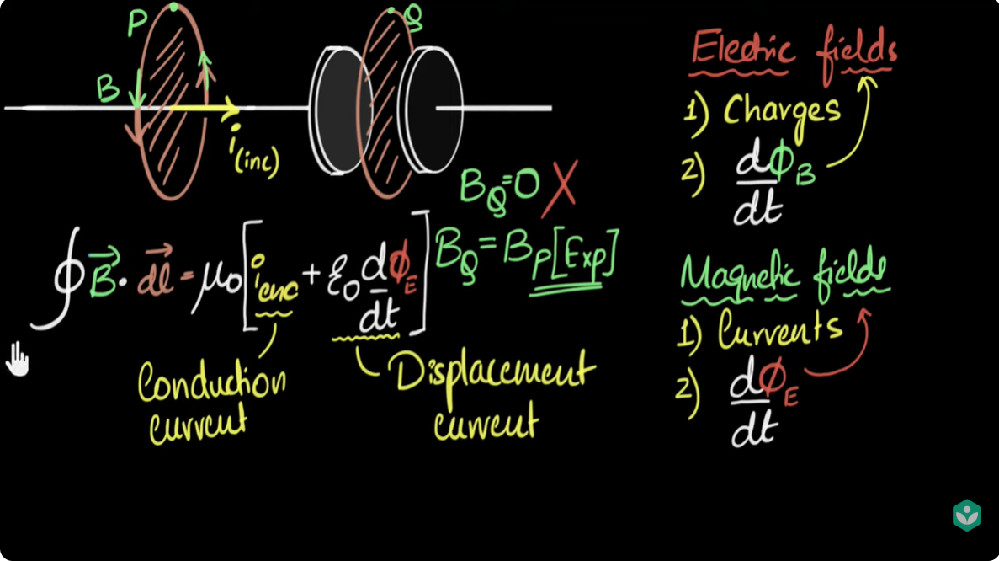

magnetic field (magnetic flux density, $B$), is the **tesla** (symbol: $T$), defined as one **weber per square meter** ($Wb/m^2$)

Magnetic flux $\Phi_B$ measures the total magnetic field ($B$) passing through a given surface area ($A$), representing the number of field lines penetrating that area. Measured in **Webers** ($Wb$),

## Vector Calculus

> 3Blue1Brown, Divergence and curl: The language of Maxwell's equations, fluid flow, and more [[https://youtu.be/rB83DpBJQsE](https://youtu.be/rB83DpBJQsE)]


### Gradient


### Divergence


```python
# https://share.google/aimode/l3lNa2MRAOG8hkpOc

import numpy as np
import matplotlib.pyplot as plt

# 1. Define the grid
x = np.linspace(-6, 6, 40)
y = np.linspace(-3, 3, 20)
X, Y = np.meshgrid(x, y)

# 2. Define the vector field components F = [U, V]
U = np.sin(X)
V = np.cos(Y)

# 3. Calculate Divergence (Scalar Field)
div_F = np.cos(X) - np.sin(Y)

# 4. Create the plot
fig, ax = plt.subplots(figsize=(16, 8))

# Use 'RdBu_r' (reversed) so Positive = Red, Negative = Blue
contour = ax.contourf(X, Y, div_F, cmap='RdBu_r', levels=30, alpha=0.8)
fig.colorbar(contour, label='Divergence (Red=Source, Blue=Sink)')

# Plot Vector Field
ax.quiver(X, Y, U, V, color='black', alpha=0.9, scale=20)
ax.set_xlabel('X', fontsize=12)
ax.set_ylabel('Y', fontsize=12)
ax.set_title(r'Positive Divergence (Red) and Negative Divergence (Blue)')
plt.show()
```

### Curl


```python
# https://share.google/aimode/hWb3cR4vCBoWV4Moi

import numpy as np
import matplotlib.pyplot as plt

# 1. Setup the coordinate grid
x = np.linspace(-2, 2, 7)
y = np.linspace(-2, 2, 7)
z = np.linspace(-2, 2, 7)
X, Y, Z = np.meshgrid(x, y, z)

# 2. Define the Vector Field F and Curl(F)
U, V, W = X, Y*Z, 3*X*Z
C_U, C_V, C_W = -Y, -3*Z, np.zeros_like(Z)

# 3. Create the plot
fig = plt.figure(figsize=(16, 8), constrained_layout=True)

# Subplot 1: Vector Field
ax1 = fig.add_subplot(121, projection='3d')
ax1.quiver(X, Y, Z, U, V, W, length=0.3, normalize=True, color='royalblue')
ax1.set_title('Vector Field F')
ax1.set_xlabel('X', fontsize=16)  # Adding x-label
ax1.set_ylabel('Y', fontsize=16)  # Adding y-label
ax1.set_zlabel('Z', fontsize=16)  # Adding z-label

# Subplot 2: Curl
ax2 = fig.add_subplot(122, projection='3d')
ax2.quiver(X, Y, Z, C_U, C_V, C_W, length=0.3, normalize=True, color='crimson')
ax2.set_title('Curl(F)')
ax2.set_xlabel('X', fontsize=16)  # Adding x-label
ax2.set_ylabel('Y', fontsize=16)  # Adding y-label
ax2.set_zlabel('Z', fontsize=16)  # Adding z-label

# plt.tight_layout(pad=3.0, rect=[0, 0, 1, 0.95])
plt.show()
```

---


---

***cross product*** [[Google AI Mode](https://share.google/aimode/X61My7I4dFxHqjzxA)]


### Divergence Theorem (Gauss's Theorem)

***surface integral -> volume integral***
$$
\oint_S \vec{F} \cdot d\vec{S} = \int_V (\nabla \cdot \vec{F}) dv
$$


> Divergence theorem is only applicable to ***closed surfaces***


### Stoke's theorem

***line integral -> surface inegral***
$$
\oint_{c} \vec{F} \cdot \vec{\mathrm{d}l} = \int_{s} (\nabla \times \vec{F}) \cdot \vec{\mathrm{d}S}
$$


## Polarization $\mathbf P$ & magnetization $\mathbf M$

***Electric Fields in Matter*** & ***Magnetic Fields in Matter***


*TODO* &#128197;


## Electric Fields

### Electric field intensity $\mathbf E$ & Electric flux density $\mathbf D$


$$
\boxed{
\underbrace{\varepsilon_0\mathbf E}_{\text{contains free + bound charge effects}}
+
\underbrace{\mathbf P}_{\text{cancels bound-charge divergence}}
=
\underbrace{\mathbf D}_{\text{free-charge Gauss law}}
}.
$$
Start from Gauss’s law for the actual electric field:
$$
\nabla\cdot(\varepsilon_0\mathbf E)
=
\rho_{\text{free}}+\rho_{\text{bound}}.
$$
Polarization satisfies
$$
\rho_{\text{bound}}=-\nabla\cdot\mathbf P.
$$
Therefore,
$$
\nabla\cdot(\varepsilon_0\mathbf E)
=
\rho_{\text{free}}-\nabla\cdot\mathbf P.
$$
Move the polarization term to the left:
$$
\nabla\cdot(\varepsilon_0\mathbf E+\mathbf P)
=
\rho_{\text{free}}.
$$
Define
$$
\mathbf D=\varepsilon_0\mathbf E+\mathbf P.
$$


---

***Electric field intensity $\mathbf E$***

Gauss's law for $\mathbf E$ is
$$
\boxed{
\nabla\cdot\mathbf E
=
\frac{\rho_{\text{total}}}{\varepsilon_0}
}
$$
where
$$
\rho_{\text{total}}
=
\rho_{\text{free}}+\rho_{\text{bound}}.
$$
Therefore, $\mathbf E$ is determined by all charges:

- externally supplied free charges,
- polarization-induced bound charges.

In integral form,
$$
\oint_S \mathbf E\cdot d\mathbf S
=
\frac{Q_{\text{total,enclosed}}}{\varepsilon_0}.
$$

---

***Electric flux density $\mathbf D$***

Gauss's law for $\mathbf D$ is
$$
\boxed{
\nabla\cdot\mathbf D=\rho_{\text{free}}
}
$$
or
$$
\boxed{
\oint_S\mathbf D\cdot d\mathbf S
=
Q_{\text{free,enclosed}}
}
$$
Thus, $\mathbf D$ is constructed so that dielectric bound charge is absorbed into the constitutive relation
$$
\mathbf D=\varepsilon_0\mathbf E+\mathbf P.
$$
It therefore relates directly only to free charge


### Gauss's law for $\mathbf{E}$ & Gauss's law for $\mathbf{D}$

$$
\boxed{
\begin{aligned}
\nabla\cdot\mathbf E
&=\frac{\rho_{\text{total}}}{\varepsilon_0},
\\[4pt]
\nabla\cdot\mathbf D
&=\rho_{\text{free}}.
\end{aligned}
}
$$

So when a textbook writes
$$
\oint_S\mathbf D\cdot d\mathbf S
=
\int_V\rho_v\,dV,
$$
the symbol $\rho_v$ normally means
$$
\boxed{\rho_v=\rho_{v,\text{free}}}.
$$
But when it writes
$$
\oint_S\mathbf E\cdot d\mathbf S
=
\frac{1}{\varepsilon_0}\int_V\rho_v\,dV,
$$
then $\rho_v$ means the **total volume-charge density**, unless the context explicitly assumes vacuum or no polarization


## Magnetostatics

***Magnetostatics*** is the study of magnetic fields in systems where the **currents are steady** (not changing with time)


### Relationship between $\mathbf B$ and $\mathbf H$

The central distinction is
$$
\boxed{
\mathbf H\text{ tracks the free-current excitation, while }
\mathbf B\text{ is the resulting total magnetic flux density.}
}
$$


The general macroscopic relation is
$$
\boxed{
\mathbf B=\mu_0\left(\mathbf H+\mathbf M\right)
}
$$
where

- $\mathbf M$ is the magnetization density of the material,
- $\mu_0\mathbf H$ represents the part separated from material magnetization,
- $\mu_0\mathbf M$ is the contribution caused by magnetic dipoles inside the material.

Therefore,
$$
\boxed{
\mathbf H=\frac{\mathbf B}{\mu_0}-\mathbf M
}.
$$
In vacuum

There is no material magnetization:
$$
\mathbf M=0.
$$
Hence,
$$
\boxed{\mathbf B=\mu_0\mathbf H}.
$$
In a linear, isotropic material

If
$$
\mathbf M=\chi_m\mathbf H,
$$
then
$$
\mathbf B
=
\mu_0(1+\chi_m)\mathbf H.
$$
Define
$$
\mu_r=1+\chi_m,
\qquad
\mu=\mu_0\mu_r.
$$
Then
$$
\boxed{\mathbf B=\mu\mathbf H}.
$$


---


Suppose a coil carries a free current $I$.

The free current produces an $\mathbf H$ field. If a magnetic material is placed inside the coil, the material becomes magnetized:
$$
I_{\mathrm{free}}
\longrightarrow
\mathbf H
\longrightarrow
\mathbf M.
$$
The resulting total magnetic flux density is
$$
\mathbf B=\mu_0(\mathbf H+\mathbf M).
$$
Therefore:
$$
\boxed{
\mathbf H
\text{ is related to the applied free current}
}
$$
while
$$
\boxed{
\mathbf B
\text{ includes both the applied field and the material response}.
}
$$
For the same coil current, $\mathbf H$ may remain approximately the same, but inserting a high-permeability core can greatly increase $\mathbf B$.


### Magnetic field intensity $\mathbf H$

It is introduced to describe magnetic fields in matter while separating the material’s magnetization from externally supplied, or free, currents.

The Maxwell–Ampère law is
$$
\boxed{
\nabla\times\mathbf H
=
\mathbf J_{\mathrm{free}}
+
\frac{\partial\mathbf D}{\partial t}
}
$$
or, in integral form,
$$
\boxed{
\oint_C\mathbf H\cdot d\mathbf l
=
I_{\mathrm{free}}
+
\int_S\frac{\partial\mathbf D}{\partial t}\cdot d\mathbf S
}.
$$
Thus, the circulation of $\mathbf H$ is associated with free current.


### Magnetic Flux Density $\mathbf B$

$\mathbf B$ determines the magnetic force on a moving charge.

It also defines magnetic flux:
$$
\boxed{\Phi_B=\int_S\mathbf B\cdot d\mathbf S}
$$
and appears in Faraday's law:
$$
\oint_C\mathbf E\cdot d\mathbf l
=
-\frac{d}{dt}
\int_S\mathbf B\cdot d\mathbf S.
$$
Gauss's law for magnetism is
$$
\boxed{\nabla\cdot\mathbf B=0}
$$
or
$$
\boxed{\oint_S\mathbf B\cdot d\mathbf S=0}.
$$
This is universally valid because magnetic monopoles have not been observed.


## Electrodynamics

### Faraday's Law



---



---



### Lenz's law




### Ampère's law w/ Maxwell's correction




---

> [[https://youtu.be/t-W6_fn_1bI](https://youtu.be/t-W6_fn_1bI)]




---


$$
\boxed{
\begin{aligned}
\oint\mathbf H\cdot d\mathbf l
&=
I+\int\frac{\partial\mathbf D}{\partial t}\cdot d\mathbf S,
\\[4pt]
\nabla\times\mathbf B
&=
\mu_0\mathbf J+
\mu_0\varepsilon_0\frac{\partial\mathbf E}{\partial t}
\end{aligned}
}
$$
are equivalent in vacuum
$$
\boxed{
\begin{aligned}
\mathbf H,\mathbf D\text{ form}
&\rightarrow \mathbf J_{\mathrm{free}},\\
\mathbf B,\mathbf E\text{ form}
&\rightarrow \mathbf J_{\mathrm{total}}.
\end{aligned}
}
$$


If
$$
\mathbf B=\mu\mathbf H,
\qquad
\mathbf D=\varepsilon\mathbf E,
$$
with constant $\mu$ and $\varepsilon$, then
$$
\boxed{
\oint_C\mathbf B\cdot d\mathbf l
=
\mu I_{\mathrm{free}}
+
\mu\varepsilon
\int_S
\frac{\partial\mathbf E}{\partial t}\cdot d\mathbf S
}
$$


### Gauss’s law for magnetism

The universally valid equation is
$$
\boxed{\oint_S \mathbf B\cdot d\mathbf S=0}
$$
or
$$
\nabla\cdot\mathbf B=0.
$$
This expresses that magnetic field lines have no beginning or end—there are no observed magnetic monopoles


---


$$
\boxed{
\oint_S\mathbf B\cdot d\mathbf S=0
\text{ always, while }
\oint_S\mathbf H\cdot d\mathbf S=0
\text{ only under additional conditions.}
}
$$
i.e. $\mathbf B=\mu\mathbf H$


## Field Inside and Outside a Current-Carrying Wire

> Sources of Magnetic Fields [[https://web.mit.edu/8.02t/www/802TEAL3D/visualizations/coursenotes/modules/guide09.pdf](https://web.mit.edu/8.02t/www/802TEAL3D/visualizations/coursenotes/modules/guide09.pdf)]


##  Displacement Current

> A. Sheikholeslami, "Current Without Electrons [Circuit Intuitions]," in IEEE Solid-State Circuits Magazine, vol. 17, no. 4, pp. 8-10, Fall 2025
>
> —, "Current Without Electric Field [Circuit Intuitions]," in *IEEE Solid-State Circuits Magazine*, vol. 18, no. 1, pp. 8-12, winter 2026


energy and information are carried by electric and magnetic fields ($E$ and $H$) rather than by electron drift


## proximity effect & skin effect

- *Skin effect* concentrates current near the ***surface*** of a single conductor, while *proximity effect* concentrates current in ***specific regions*** of multiple conductors due to their interaction
- *Skin effect* is caused by the conductor's ***own*** magnetic field, while proximity effect is caused by the magnetic field of a ***nearby*** conductor

---

***proximity effect*** is a *redistribution of electric current* occurring in ***nearby parallel electrical conductors*** carrying *alternating current (AC)*, caused by ***magnetic effects*** (eddy currents)


---

***skin effect*** is the tendency of ***AC current*** flow near the surface (or "skin") of a conductor, rather than throughout its cross-section, due to the ***magnetic field generated by the current itself***


> ***Cause of skin effect***
>
> A main current $I$ flowing through a conductor induces a magnetic field $H$. If the current increases, as in this figure, the resulting increase in $H$ induces separate, circulating ***eddy currents*** $I_W$ which partially cancel the current flow in the center and reinforce it near the skin

---

***Eddy current***

By [Lenz's law](https://en.wikipedia.org/wiki/Lenz's_law), an eddy current creates a magnetic field that ***opposes*** the change in the magnetic field that created it, and thus eddy currents ***react back*** on the source of the magnetic field


## reference

Griffiths, David J. *Introduction to Electrodynamics*. Fifth edition. Cambridge University Press, 2024. [[pdf](https://nucleares.unam.mx/~martinel/griffiths_4ed.pdf)]

David Smith, Electromagnetic Theory for Complete Idiot, 2021

邓友金. 电磁学 2022春 [[http://staff.ustc.edu.cn/~yjdeng/EM2022/EM2022.html](http://staff.ustc.edu.cn/~yjdeng/EM2022/EM2022.html)]

谢处方、饶克谨、杨显清等.《电磁场与电磁波》（第五版），高等教育出. 版社，2019.

Scott Hughes. Spring 2005 8.022: Electricity & Magnetism [[https://web.mit.edu/sahughes/www/8.022/](https://web.mit.edu/sahughes/www/8.022/)]
