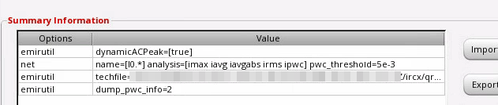
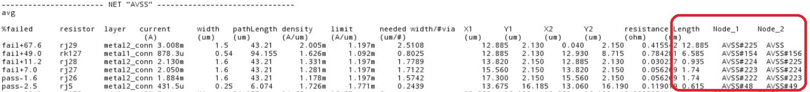
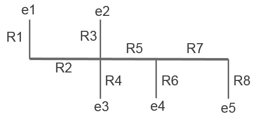

## general terminology

### DC related

**Imax** in T\*'s DRC document is the maximum allowed **DC current**, which depends on *Length and Width* only

**Iavg** is the average value of the current, which is the effective *DC current*. Therefore, **Iavg rules** are **identical** to **Imax** rules
$$
I_{\text{avg}}=\frac{\int_0^\tau I(t)dt}{\tau}
$$
Similarly, **Iabsavg rules** are **identical** to **Imax** rules, too
$$
I_{\text{AbsAvg}}=\frac{\int_0^\tau |I(t)|dt}{\tau}
$$

### rms

**Irms** is the root-mean-square of the current through a metal line, which depends **w(in um)**, the *drawn width* of the metal line and $\Delta T$, the temperature rise due to Joule heating.
$$
I_{\text{rms}}=\left[\frac{\int_0^\tau I(t)^2dt}{\tau} \right]^{1/2}
$$

### peak current

**Ipeak** in T\*'s DRC document is the current at which a metal line undergoes excessive Joule heating and can begin to melt. **Ipeak** is corresponding to `EM Current Analysis: max` in Voltus-Fi Analysis Setup
$$
I_{\text{peak}}=\max(|I(t)|)
$$
The limit for the peak current is
$$
I_{\text{peak,limit}}=\frac{I_{\text{peak\_DC}}}{\sqrt{r
} }
$$
where **r** is the duty ratio

The relationship between **Ipeak** and **Ipeak_DC** is merged in DRC document so that there is only **Ipeak** equation in document

> $I_{\text{peak,limit}}$ depends on $t_D$, r, width and length

$$
r=\frac{t_D}{\tau}
$$

where $t_D$ is equivalent duration
$$
t_D =\frac{\int_0^\tau |I(t)|dt}{I_{\text{peak}}}
$$
or
$$
r=\frac{I_{\text{AbsAvg}}}{I_{\text{peak}}}
$$


where the drawn width is 1um, r is 0.1


$$
9.37*(1-0.004)/\sqrt0.1 = 29.512
$$

### acpeak/pwc

It's same with **max** EM Current Analysis in Voltus-Fi

### `dynamicACPeak`



This option affect how duty ratio r is computed in `max` and `acpeak/pwc` EM current Analysis

When the `dynamicACPeak` variable is set to **true** or **multiPeak**
$$
r=\frac{T_d}{T_{\text{total}}}
$$

​	where $T_{\text{total}} = \text{EMIR time window}$

​	$T_d$ = the time duration in microsecond of the total "On Time" period based on `IPWC`

> Pulse-Wise Constant EM current calculation (IPWC)


where **Tau** is $T_d$ in above formula

> !!! It seems that t\*'s PDK don't support `dynamicACPeak=true`

## IR drop filter layers

EM techfile (qrcTechFile) may take  diffusion contact (*n_odtap*, *p_odtap* in DSPF file) into account
during IR drop analysis.
And these segment often dominate IR drop, but we as IC designer can NOT improve them.
In general, the IR drop to M1 layer is enough and feasible.


## Regular analysis statements in emir configuration

```
net name=[I0.vdd I0.vss] analysis=[vmax vavg]
net name=[I0.*] analysis =[imax ivavg irms]
```


## emirreport command

Creating reports for specific nets after simulation using `emirreport`

Create a new config file as shown below:

```
** test.conf**
net name=[I1.VDD I1.VSS] analysis=[iavg]
net name=[I1.VBIAS] analysis=[imax]
```

Run `emirreport` on the command line using the **emirdatabase** (emir\*.bin) and **test.conf** created above in 

```
% emirreport -64 -c test.conf -db <emirdatabase> -outdir newreport
```


## database

### simulation result

- `input.emir0_bin`: The first EMIR Analysis which is DC or Transient, which depends on *Analyses* order


> - `input_tran.emir0_bin`: EMIR Analysis in Transient simulation
>
> - `input_dcOp.emir0_bin`: EMIR Analysis in DC simulation

For example


Two results are generated `input.emir0_bin` and `input_dcOp.emir0_bin` and their reports respectly


## Fix Electromigration

| Type    | wider wire | downsize drivers | decrease fanout |
| ------- | ---------- | ---------------- | --------------- |
| RJ JMAX |            | &check;          | &check;         |
| JAVG    |            |                  |                 |
| JABSAVG |            |                  |                 |
| JACPEAK |            |                  |                 |
| JACRMS  | &check;    | &check;          | &check;         |

> - Iavg
>
>   The average value of the current, which is the effective DC current
>
> - Irms
>
>   Irms rule relates to the heat or Joule-heating of metal lines
>
> - Ipeak
>
>   The main goal of the Ipeak limits is to ensure that no thermal breakdown could occur on single overshoot events. If the signal may not have a high current density but if it has a very large peak current density, then, local melting will happen and cause failures


## QA

1. Q. Why “length” column in EM results form doesn’t show extracted length, it shows “NA”.

   A. Voltus-Fi reports the “length” column only when length rules are present in the emDataFile.

2. Seeing different port currents with and without emir simulations for same dspf included in EMIR Direct method using dspf_include.

   Split Pins (*|P) in DSPF are only shorted in the EMIR flow not in the regular spectre flow.
   Islands patching is only performed in EMIR only

3.  Setting temperature for EM analysis

   By Default, Voltus-FI and VPS pick up the current density limit for **temperature at which simulation has been performed**.
   
   > By the way, `Design Variables` - *temperature*  will override the temperature in *Setup toolbar* which is gray in ADE Explorer
   
   
   
4. AC Peak EM analysis - Voltus-Fi

   The available options within the EM current analysis section in the EMIR Analysis Setup form are:

   `max / avg / avgabs / rms.`

   In order to enable the *AC Peak based information* when loading the EM results, **both max and avg** should be selected when setting up the EMIR Analysis Setup.

   With this configuration, the AC Peak option becomes available and can be used.

5. How to print average, rms, and peak current of **device tap** in Spectre/Voltus FI EMIR analysis

   The following option enables you to save the average, rms, and peak tap currents in the **emir0bin** file and report it in the **input.rpt_tapi** file.

   ```
   solver report_tapi=true
   ```

   Add this option in **emir.conf** to enable the reporting of tap current after the Spectre EMIR simulation. The input.rpt_tapi file will be saved in the psf/raw directory.

   **Note:** This feature is supported in SPECTRE20.1 ISR14 and later versions.

6. emir.conf file

   `emir.conf` file is generated automaticaly after configure *EM/IR Analysis* in ADE, which is in *netlist* directory.

   

7. Setting default path for EM rules file in APS EMIR analysis

   - set the following environment variable in your terminal

     ```
     setenv EMDATAFILE < path to EM rules file>
     ```

   - or set in `.cdsinit `

     ```
     setShellEnvVar("EMDATAFILE=<path to EM rules file>")
     ```

8. Print node names and length associated with parasitic resistors in EM report file

   > `export CDS_MMSIM_VOLTUSFI_ROOT=$CDSHOME` 

   - Printing the parasitic resistor length in the EM report 

     ```
     emirutil reportLength=true
     ```

   - Printing nodes that are associated with the parasitic resistor

     ```
      emirutil reportNodeName=true
     ```

     Once these are enabled, you will have the **Length**, **Node_1**, and **Node_2** columns printed in the EM report file, as shown below:

     

9. Is it possible to run RMS IR Drop analysis using Voltus-Fi?

   Typically, in a simulation, Power/Ground nets are always biased with a **constant DC source**. Hence, at present, Voltus-Fi only supports **Average and Maximum (Peak) IR Drop** analysis.

   For a net to have data for IR analysis(vmax/vavg), the net/node must be connected to a **DC vsource or a vsource which is constant within the emir time window**.

10. Can we change the time window of EM computation after the simulation completed ?

    It is not possible to modify the EM time window without re-running the full simulation. 

    However you can specify several time window in the emir conf file
    for instance for 2 time window [0 to 10n] and [10n 20n]

    ```
    time window=[0 10n 10n 20n]
    ```

    In that case it will create 2 **emir_bin** files and then 2 different em report files according to the 2 different time windows.

11. How to print segment_W values being used to compute EM limits

    You can use the following option to print `segment_W` to the report:

    ```
    emirutil reportSegmentWidth=[true]
    ```

    This would print a `Segment_w` column in the report containing the segment width values used for computing the limit:

    | Pass/Fail % | Resistor | layer | Current     | Width | PathLength | I limit | X1    | Y1     | X2    | Y2     | J/JMAX      | Res    | ViaArea | No of needed vias | width/#via | J limit   | Segment_w |
    | ----------- | -------- | ----- | ----------- | ----- | ---------- | ------- | ----- | ------ | ----- | ------ | ----------- | ------ | ------- | ----------------- | ---------- | --------- | --------- |
    |             |          |       | (mA)        | (um)  | (um)       |         | (um)  | (um)   | (um)  | (um)   |             |        | (nm^2)  |                   | (um/#)     | (A/um)    |           |
    | pass-100.0  | Rj3292   | Met1  | 9.02376e-12 | 0.1   | 42.72      | 1.10067 | 0.350 | 11.568 | 0.350 | 11.376 | 8.19843e-12 | 0.7382 | NA      | NA                | 0.0001     | 0.0110067 | 0.1       |

12. pathLength vs Length in EM report file

    - Length:  parasitic resistor length, which is set by ` emirutil reportLength=true`

    - pathlength: Blech length is also known as "Short length" or "Path length", and can be explained as : The **longest and continuous centerline path from edge to edge** among the connected wire shapes on the **same metal layer**.

      - For all resistors falling on this shape, **same pathLength** is reported. 
	  - After the longest path in shape has been determined the tool applies the same blech length to all the resistor falling on that shape.
	  - This resistor length is **NOT** used in EM analysis because EM rules consider Blech length of the resistor.
	
	  
	
	  > where W is the wire width and L is the Blech length. 
	
	  - By default the tool will **sum all branches of a given metal layer**. In other words the path length that will be used to look up the EM density limit is : 
	
	    Bl = $l(R1) + $l(R2) + $l(R3) + $l(R4) + $l(R5) + $l(R6) + $l(R7) + $l(R8)
	
	    
	
13. How to enable EMIR analysis in PSS simualtion ?

    To enable EMIR in PSS, you have to enable DC and/or Tran simulation simultaneously. Two or more binary results file should be generated and select the file based file name or configure text file in `psf` directory.
    
    (given ICADVM 18.1 ISR11, Spectre 19.1 ISR6) 


## reference

AC Peak Analysis Using IPWC Rapid Adoption Kit (RAK)  Product Version: IC6.1.8 ISR10, SPECTRE19.1 ISR5 April 2020

Posser, Gracieli & Sapatnekar, Sachin & Reis, Ricardo. (2017). Electromigration Inside Logic Cells. 10.1007/978-3-319-48899-8. 

A. B. Kahng, S. Nath and T. S. Rosing, "On potential design impacts of electromigration awareness," 2013 18th Asia and South Pacific Design Automation Conference (ASP-DAC), 2013, pp. 527-532, doi: 10.1109/ASPDAC.2013.6509650.

Kumar, Neeraj and Mohammad S. Hashmi. “Study, analysis and modeling of electromigration in SRAMs.” (2014).

N. S. Nagaraj, F. Cano, H. Haznedar and D. Young, "A practical approach to static signal electromigration analysis," Proceedings 1998 Design and Automation Conference. 35th DAC. (Cat. No.98CH36175), 1998, pp. 572-577, doi: 10.1109/DAC.1998.724536.

Blaauw, David & Oh, Chanhee & Zolotov, Vladimir & Dasgupta, Aurobindo. (2003). Static electromigration analysis for on-chip signal interconnects. Computer-Aided Design of Integrated Circuits and Systems, IEEE Transactions on. 22. 39 - 48. 10.1109/TCAD.2002.805728. 
