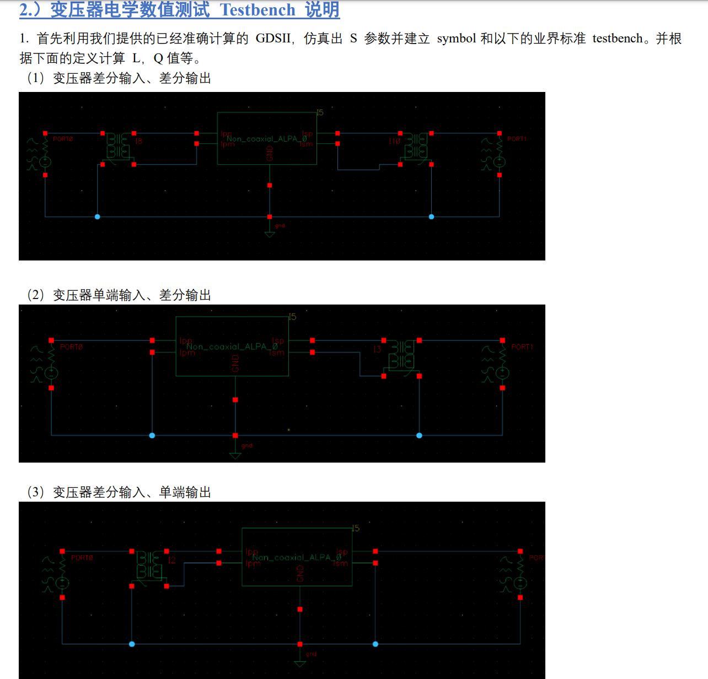
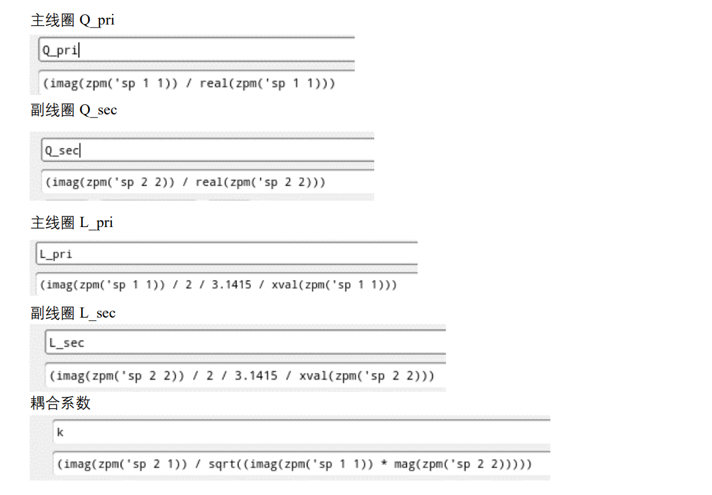

## LVS check

LVS issue for circuits with customized devices

- auCdl: Analog and Microwave CDL, is a netlister used for creating CDL netlist for analog circuits

- auLVS: Analog and Microwave LVS, is used for analog circuit LVS

## EMX ports
### plain labels
- **pin** layer
- uncheck **Cadence pins** in **Advanced options**

### rectangle pins
- **drawing** layer rectangle pin and specify **Access Direction** as intended
- check **Cadence pins** in **Advanced options**

> The rectangle pins are always selected as driven port while there are **only rectangle pin**  whether **Cadence pins** checked or not. 

### check ports used for simulation
use **GDS view - EMX**


### EMX Synthesis Kits

Synthesis is a capability of the EMX **Pcell** library and uses scalable model data pre-generated by Continuum for a specific process and metal scheme combination.

Synthesis is supported by the Pcells that are suffixed **\_scalable**, and these Pcells have the additional fields and buttons needed for synthesis.


### port order (signals)

> emxform.ils

| type                   | **Port order**   |
| ---------------------- | ---------------- |
| inductor               | P1 P2            |
| shield inductor        | P1 P2 SHIELD     |
| tapped inductor        | P1 P2 CT         |
| tapped shield inductor | P1 P2 CT SHIELD  |
| mom/mim capacitor      | P1 P2            |
| tcoil                  | P1 P2 TAP        |
| shield tcoil           | P1 P2 TAP SHIELD |
| tline                  | P1 P2            |
| differential tline     | P1 P2 P3 P4      |


### EMX device info

| name                               | menu_selection (split with _ )                       | num_ports | modelgen_type                           | generic_model_type     | plot_fn               |
| ---------------------------------- | ---------------------------------------------------- | --------- | --------------------------------------- | ---------------------- | --------------------- |
| Single-ended inductor              | inductor_no tap_no shield_single-ended               | 2         | inductor                                | inductor               | EMX_plot_se_ind       |
| Differential inductor              | inductor_no tap_no shield_differential               | 2         | inductor                                | inductor               | EMX_plot_diff_ind     |
| Single-ended shield inductor       | inductor_no tap_with shield_single-ended             | 3         | shield_inductor                         | shield_inductor        | EMX_plot_se_ind       |
| Differential shield inductor       | inductor_no tap_with shield_differential             | 3         | shield_inductor                         | shield_inductor        | EMX_plot_diff_ind     |
| Tapped inductor (diff mode only)   | inductor_with tap_no shield_differential mode only   | 3         | center_tapped_inductor                  | tapped_inductor        | EMX_plot_ct_ind       |
| Tapped inductor (common mode too)  | inductor_with tap_no shield_also fit common mode     | 3         | center_tapped_inductor_common_mode      | tapped_inductor        | EMX_plot_ct_ind       |
| Tapped shield inductor (diff only) | inductor_with tap_with shield_differential mode only | 4         | center_tapped_well_inductor_common_mode | tapped_shield_inductor | EMX_plot_ct_ind       |
| Single-ended cap (symm)            | capacitor_symmetric single-ended                     | 2         | complex_mom_capacitor                   | mom_capacitor          | EMX_plot_se_cap       |
| Differential cap (symm)            | capacitor_symmetric differential                     | 2         | complex_mom_capacitor                   | mom_capacitor          | EMX_plot_diff_cap     |
| Single-ended cap (asymm)           | capacitor_asymmetric single-ended                    | 2         | complex_asymmetric_mom_capacitor        | mom_capacitor          | EMX_plot_se_cap       |
| Differential cap (asymm)           | capacitor_asymmetric differential                    | 2         | complex_asymmetric_mom_capacitor        | mom_capacitor          | EMX_plot_diff_cap     |
| MiM capacitor                      | capacitor_MiM                                        | 2         | mim_capacitor                           | mim_capacitor          | EMX_plot_se_cap       |
| Tcoil (simple model)               | tcoil_simple model                                   | 3         | tcoil                                   | tcoil                  | EMX_plot_tcoil        |
| Tcoil (complex model)              | tcoil_complex model                                  | 3         | complex_tcoil                           | complex_tcoil          | EMX_plot_tcoil        |
| Shield tcoil                       | tcoil_with shield                                    | 4         | shield_complex_tcoil                    | shield_tcoil           | EMX_plot_shield_tcoil |
| Transmission line                  | transmission line_single                             | 2         | xline                                   | xline                  | EMX_plot_xline        |
| Diff transmission line             | transmission line_coupled (differential)             | 4         | coupled_xline                           | diff_xline             | EMX_plot_diff_xline   |

## EMX plot function

> EMX's formulation is defined in 
>
> ```
> /path/to/EMX/share/emx/virtuoso_ui/emxinterface/emxskill/emxform.ils
> ```
>
> EMX import this file at Virtuoso startup, you have to relaunch Virtuoso if you change this file


### Single-ended inductor

Both with and without shield apply

- port-1 impedance when port-2 short

$$
Z_1 = \frac{1}{Y_{11}}
$$


- port-2 impedance when port-1 short

$$
Z_2 = \frac{1}{Y_{22}}
$$
Then
$$\begin{align}
L1 &= \frac{Im(Z_1)}{2\pi f} \\
Q1 &= \frac{Im(Z_1)}{Re(Z_1)} \\
L2 &= \frac{Im(Z_2)}{2\pi f} \\
Q2 &= \frac{Im(Z_2)}{Re(Z_2)}
\end{align}$$

> EMX only plot L1 and Q1


### differential impedance

Y parameters to Z parameters

$$\begin{align}
|Y| &= Y_{11}*Y_{22} - Y_{12}*Y_{22} \\
\begin{bmatrix}
Z_{11} & Z_{12}\\ 
Z_{21} & Z_{22}
\end{bmatrix}
&=
\begin{bmatrix}
\frac{Y_{22}}{|Y|} & \frac{-Y_{12}}{|Y|}\\ 
\frac{-Y_{21}}{|Y|} & \frac{Y_{11}}{|Y|}
\end{bmatrix} 
\end{align}$$

Then **differential impedance** is 
$$
Z_{diff} = Z_{11} - Z_{12} - Z_{21} + Z_{22}
$$


> similarly, Z parameters to Y parameters
> $$
> \begin{bmatrix}
> Y_{11} & Y_{12}\\ 
> Y_{21} & Y_{22}
> \end{bmatrix}
> =
> \begin{bmatrix}
> \frac{Z_{22}}{|Z|} & \frac{-Z_{12}}{|Z|}\\ 
> \frac{-Z_{21}}{|Z|} & \frac{Z_{11}}{|Z|}
> \end{bmatrix}
> $$
> where
> $$
> |Z| = Z_{11}Z_{22} - Z_{12}Z_{21}
> $$
>
> 

### Differential inductor

Both with and without shield apply

$$\begin{align}
L_{diff} &= \frac{Im(Z_{diff})}{2\pi f} \\
Q_{diff} &= \frac{Im(Z_{diff})}{Re(Z_{diff})}
\end{align}$$

### Center-tapped inductor

$$
Y =
\begin{bmatrix}
Y_{11} & Y_{12} & Y_{13}\\ 
Y_{21} & Y_{22} & Y_{23}\\
Y_{31} & Y_{32} & Y_{33}
\end{bmatrix}
$$

where port order is `P1 P2 CT`.

```skill
(define (EMX_plot_ct_ind bgui wid what)
  (EMX_plot_aux bgui wid what 3
		'("Differential inductance" "Differential Q")
		'("Henry" "")
		(lambda (ys)
		  (letseq ((z (EMX_differential (nth 0 ys) (nth 1 ys) (nth 3 ys) (nth 4 ys)))
			   (f (xval z))
			   (L (imag z)/(2*3.14159265358979*f))
			   (Q (imag z)/(real z)))
		    `((,L) (,Q))))
		'(("L") ("Q"))))
```

Assume `CT` i.e. port 3 in S-parameter is grounded, `(z (EMX_differential (nth 0 ys) (nth 1 ys) (nth 3 ys) (nth 4 ys)))` obtain differential impedance with  $Y_{11}$, $Y_{12}$, $Y_{21}$ and $Y_{22}$.
$$
Y =
\begin{bmatrix}
Y_{11} & Y_{12}\\ 
Y_{21} & Y_{22}
\end{bmatrix}
$$
Finally,  differential inductance and Q are obtained, shown as below

$$\begin{align}
L_{diff} &= \frac{Im(Z_{diff})}{2\pi f} \\
Q_{diff} &= \frac{Im(Z_{diff})}{Re(Z_{diff})}
\end{align}$$


### Single-ended cap

```skill
(define (EMX_plot_se_cap bgui wid what)
  (EMX_plot_aux bgui wid what 2
		'("Capacitance" "Q" "Capacitance" "Q")
		'("Farad" "" "Farad" "")
		(lambda (ys)
		  (letseq ((z1 1.0/(nth 0 ys))
			   (y12 (nth 1 ys))
			   (z2 1.0/(nth 3 ys))
			   (f (xval z1))
			   (C1 (-1.0/(imag z1))/(2*3.14159265358979*f))
			   (C12 -(imag y12)/(2*3.14159265358979*f))
			   (C2 (-1.0/(imag z2))/(2*3.14159265358979*f))
			   (Q1 -(imag z1)/(real z1))
			   (Q12 (imag y12)/(real y12))
			   (Q2 -(imag z2)/(real z2)))
		    `((,C1) (,Q1) (,C12))))
		'(("Cse") ("Qse") ("C12"))))
```

We define Port-1 impedance $Z_1$, Port-2 impedance $Z_2$

$$\begin{align}
Z_1 &= \frac {1}{Y_{11}}\\
Z_2 &= \frac {1}{Y_{22}}
\end{align}$$

Then single-ended cap and Q
$$\begin{align}
C_1 &= -\frac{1/Im(Z_1)}{2\pi f} \\
Q_1 &= -\frac{Im(Z_1)}{Re(Z_1)} \\
C_2 &=  -\frac{1/Im(Z_2)}{2\pi f} \\
Q_2 &= -\frac{Im(Z_2)}{Re(Z_2)} \\
C_{12} &= -\frac{Im(Y_{12})}{2\pi f}\\
Q_{12} &= \frac{Im(Y_{12})}{Re(Y_{12})}
\end{align}$$

- **Series equivalent** model is used in $C_1$, $Q_1$, $C_2$ and $Q_2$
  - $Z_1 = R + \frac{1}{sC_1}$ and $Z_2 = R + \frac{1}{sC_2}$

- Parallel model is used in $C_{12}$ and $Q_{12}$
  - $Y_{12} = \frac{1}{R} + sC_{12}$

> EMX plot $C_{se}$, $Q_{se}$ and $C_{12}$, i.e. $C_1$, $Q_1$ and $C_{12}$


### Differential cap

```skill
(define (EMX_plot_diff_cap bgui wid what)
  (EMX_plot_aux bgui wid what 2
		'("Differential capacitance" "Differential Q")
		'("Farad" "")
		(lambda (ys)
		  (letseq ((z (apply EMX_differential ys))
			   (f (xval z))
			   (C (-1.0/(imag z))/(2*3.14159265358979*f))
			   (Q -(imag z)/(real z)))
		    `((,C) (,Q))))
		'(("C") ("Q"))))
```

First obtain differential impedance, $Z_{diff}$ then apply series equivalent model
$$\begin{align}
C_{diff} &= -\frac{1/Im(Z_{diff})}{2\pi f} \\
Q_{diff} &= -\frac{Im(Z_{diff})}{Re(Z_{diff})}
\end{align}$$


### Tline

Open circuit impedance $Z_o$, short circuit impedance $Z_s$ and characteristic impedance $Z_0$

$$\begin{align}
Z_o &= Z_{11}\\
Z_s &= \frac{1}{Y_{11}}\\
Z_0  &= \sqrt{Z_o*Z_s}
\end{align}$$

propagation constant is given as
$$\begin{align}
\gamma &= \frac{1}{2}\log\left( \frac{Z_0+Z_s}{Z_0-Z_s} \right) \\
&= \alpha + j\beta
\end{align}$$
where $\alpha$ is **attenuation constant** and $\beta$ is **phase constant**

The relationship between these parameter and geometry of the transmission line
$$\begin{align}
Z_0 &= \sqrt{\frac{R+j\omega L}{G+j\omega C}} \\
\gamma &= \sqrt{(G+j\omega C)(R+j\omega L)}
\end{align}$$
EMX plot the real and imaginary part of $Z_0$, $\alpha$ and $\beta$ of $\gamma$

> ~~Note EMX plot the absolute value of $\alpha$ and $\beta$~~


### Transformer





> [[IC Prophet GDSII 文件使用和仿真测试说明](https://icprophet-web.oss-cn-hangzhou.aliyuncs.com/helpdoc/helpdoc-cadenceonly-cn_V230905_3.pdf)]


## EMX autoplot

> using AC simulation, and inductor's parallel model or series model
>
> That is to say: both `sp` (network parameter) and `ac` (impedance) can be used to plot inductance, Q value. 
>
> usually EMX choose `ac` method


> left 2 figures are used for AC simulation, $Y_{nn}$ can be obtained conveniently


## Foundary model


for single-end capicator
$$\begin{align}
Q_1 &= -\frac{Im(Z_1)}{Re(Z_1)} \\
&= -\frac{Im(1/Y_{11})}{Re(1/Y_{11})} \\
&= -\frac{Im(Y_{11}^*)/|Y_{11}|^2}{Re(Y_{11}^*)/|Y_{11}|^2} \\
&= \frac{Im(Y_{11})}{Re(Y_{11})}
\end{align}$$

So, the EMX model and foundary model is consistent.

## Tips

Process file encryption mostly for advanced nodes, like TSMC 16nm Finfet, whose process file is  encrypted.

- Use `--key=EMXkey` in the EMX *Advanced options*


GDSviewer has two options

- EMX: shows the final gds sent to EMX for simulation after it has been processed by EMX
- Raw: shows the raw gds

>  If there are port name with the `#` sign, it means EMX sees a port but it is not in the signal list.


EMX Accuracy

- Edge mesh: controls layout discretization in the X-Y plane

  - For MoM capacitors, use the edge mesh to be the same as the width of the finger (for example, 0.1um).

- Thickness: controls layout discretization in the Z dimension

- 3D metals: skips all 2D assumptions about conductors and their currents and charges

  - If you set `3D metals` to `*` then all metals are treated as **3D**
    - For Inductor type structures, only thick metal needs 3D.
    - For MoM, all layers are needed.


Ports entered in `Grounds` will cause these nets to be grounded; these ports will not show up in the S-parameter result.


Setup Temperature

- EMX: `--temperature=100`


ParaView

- If check ParaView related options when ParaView is not setup properly, EMX simulation stop at  *Creating mesh...* without waring or errors (version 6.2).


## pad & bump

EMX process file contain *M0* up to *RDL-AP*

PM, CB2_FC, UBM is in the chip package


> PEX extract up to *RDL-AP* as expected

## reference

Tips on Specifying Ports in EMX [[link](Article (20493671) Title: Tips on Specifying Ports in EMX
URL: https://support.cadence.com/apex/ArticleAttachmentPortal?id=a1O3w00000AD4uEEAT)]

Using 'Cadence pins' as ports with access direction in EMX simulations [[link](Article (20496398) Title: Using 'Cadence pins' as ports with access direction in EMX simulations
URL: https://support.cadence.com/apex/ArticleAttachmentPortal?id=a1O3w00000AH2OfEAL)]

EMX miscellaneous features [[https://picture.iczhiku.com/resource/eetop/WyIFKleSLTRIuvCb.pdf](https://picture.iczhiku.com/resource/eetop/WyIFKleSLTRIuvCb.pdf)]
