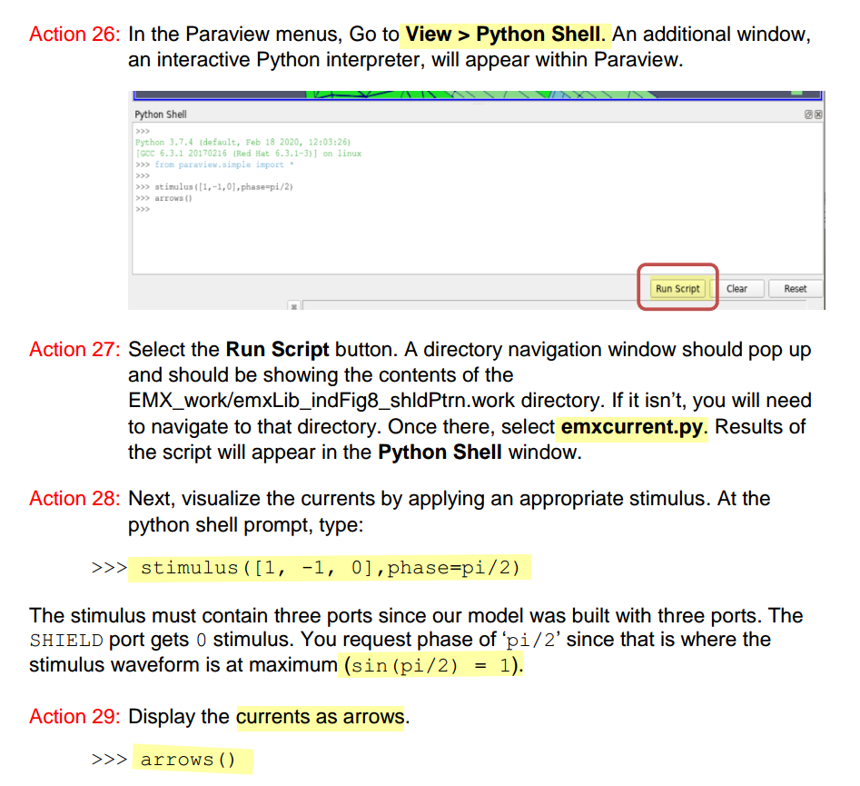

## T-coil

### coupling factor


> note **CTAP** is grounded

$$
L_{12} = \frac{\text{im}[Z_{diff}]}{2\pi f}
$$

where $Z_{diff} = Z_{11} - Z_{12} - Z_{21} + Z_{22}$


> Min-Sun Keel. Design of reliable and energy-efficient high-speed interface circuits. University of Illinois Urbana-Champaign, USA, 2015 [[https://files.core.ac.uk/download/pdf/158312105.pdf](https://files.core.ac.uk/download/pdf/158312105.pdf)]
>
> 

```python
import numpy as np
import pandas as pd
import matplotlib.pyplot as plt


df_emx  = pd.read_csv('./tcoil-emx.csv')
L1sim = df_emx['L1sim Y'].to_numpy()/1e-12  # pH
L2sim = df_emx['L2sim Y'].to_numpy()/1e-12  # pH
Q1sim = df_emx['Q1sim Y'].to_numpy()
Q2sim = df_emx['Q2sim Y'].to_numpy()
frqsim =  df_emx['ksim X'].to_numpy()/1e9   # GHz
Ksim =  df_emx['ksim Y'].to_numpy()

df_calc = pd.read_csv('./tcoil-calc.csv')
frqcalc = df_calc.iloc[:,0].to_numpy()/1e9   # GHz
L1calc = df_calc.iloc[:,1].to_numpy()/1e-12  # pH
L2calc = df_calc.iloc[:,3].to_numpy()/1e-12  # pH
Q1calc = df_calc.iloc[:,5].to_numpy()
Q2calc = df_calc.iloc[:,7].to_numpy()
L12calc = df_calc.iloc[:,9].to_numpy()/1e-12  # pH

kcalc = []
for l1i, l2i, l12i in zip(L1calc, L2calc, L12calc):
    l1il2i = l1i * l2i
    kk = (l12i - l1i -l2i)/2/np.sqrt(l1il2i) if l1il2i > 0.0 else 0.0   # L1 * L2 < 0 is meaningless
    kk = kk if np.abs(kk) < 2.0 else 0.0                                # constrain |k| < 2
    kcalc.append(-kk)

plt.figure(figsize=(20,8))
plt.subplot(3, 2, 1)
plt.plot(frqsim, L1sim, frqcalc, L1calc, 'r--', linewidth=3); plt.legend(['L1sim', 'L1calc'], loc='upper right'); plt.grid()
plt.subplot(3, 2, 2)
plt.plot(frqsim, Q1sim, frqcalc, Q1calc, 'r--', linewidth=3); plt.legend(['Q1sim', 'Q1calc'], loc='upper right'); plt.grid()
plt.subplot(3, 2, 3)
plt.plot(frqsim, L2sim, frqcalc, L2calc, 'r--', linewidth=3); plt.legend(['L2sim', 'L2calc'], loc='upper right'); plt.grid()
plt.subplot(3, 2, 4)
plt.plot(frqsim, Q2sim, frqcalc, Q2calc, 'r--', linewidth=3); plt.legend(['Q2sim', 'Q2calc'], loc='upper right'); plt.grid()
plt.subplot(3, 1, 3)
plt.plot(frqsim, Ksim, frqcalc, kcalc, 'r--', linewidth=3); plt.legend(['Ksim', 'kcalc'], loc='upper right'); plt.grid()

plt.show()
```

---


> ```
> 	   (get_k
> 	    (lambda (l12 l1122)
> 	      (letseq ((xvec (drGetWaveformXVec l12))
> 		       (n (drVectorLength xvec))
> 		       (l12v (drGetWaveformYVec l12))
> 		       (l1122v (drGetWaveformYVec l1122))
> 		       (resultv (drCreateVec 'double n)))
> 		(do ((i 0 i+1))
> 		    ((i >= n))
> 		  (letseq ((l12i (drGetElem l12v i))
> 			   (l1122i (drGetElem l1122v i))
> 			   (kk (if (l1122i > 0.0)
> 				   l12i/(sqrt l1122i)
> 				   0.0))
> 			   (k (if ((abs kk) < 2.0) kk 0.0)))
> 		    (drSetElem resultv i k)))
> 		(drCreateWaveform xvec resultv)))))
>   (EMX_plot_aux bgui wid what 3
> 		'("Inductance" "Q" "k")
> 		'("Henry" "" "")
> 		(lambda (ys)
> 		  (letseq ((zs (reduce ys))
> 			   (z11 (nth 0 zs))
> 			   (z12 (nth 1 zs))
> 			   (z22 (nth 2 zs))
> 			   (pi 3.14159265358979)
> 			   (f (xval z11))
> 			   (l11 (imag z11)/(2*pi*f))
> 			   (q11 (imag z11)/(real z11))
> 			   (l12 (imag z12)/(2*pi*f))
> 			   (l22 (imag z22)/(2*pi*f))
> 			   (q22 (imag z22)/(real z22))
> 			   (k (get_k l12 l11*l22)))
> 		    `((,l11 ,l22) (,q11 ,q22) (,k))))
> 		'(("L1" "L2") ("Q1" "Q2") ("k")))))
> ```

---

> [[https://wiki.icprophet.com/doku.php?id=wiki#t-coil](https://wiki.icprophet.com/doku.php?id=wiki#t-coil)]


$$
k = \frac{L_{tot}-L_1-L_2}{2M} = \frac{\text{im}[Z_{diff}]/2\pi f - \text{im}[Z_{11}]/2\pi f-\text{im}[Z_{22}]/2\pi f}{2\sqrt{\text{im}[Z_{11}]/2\pi f\times \text{im}[Z_{22}]/2\pi f}} = \frac{- \text{im}[Z_{12}] - \text{im}[Z_{21}]}{2\sqrt{\text{im}[Z_{11}]\times \text{im}[Z_{22}]}}
$$
if $\text{im}[Z_{12}] = \text{im}[Z_{21}]$, then
$$
\color{red}k =- \frac{\text{im}[Z_{21}]}{\sqrt{\text{im}[Z_{11}]\times \text{im}[Z_{22}]}}
$$


### $C_B$ from Nport

> Chapter 4.5. High Frequency Passive Devices [[https://www.cambridge.org/il/files/7713/6698/2369/HFIC_chapter_4_passives.pdf](https://www.cambridge.org/il/files/7713/6698/2369/HFIC_chapter_4_passives.pdf)]


---

> Min-Sun Keel. Design of reliable and energy-efficient high-speed interface circuits. University of Illinois Urbana-Champaign, USA, 2015 [[https://files.core.ac.uk/download/pdf/158312105.pdf](https://files.core.ac.uk/download/pdf/158312105.pdf)]
>
> Measuring Self Resonant Frequency [[https://www.coilcraft.com/getmedia/8ef1bd18-d092-40e8-a3c8-929bec6adfc9/doc363_measuringsrf.pdf?srsltid=AfmBOoqdBJ_CTB-N_wOVp2_7zIDXPEwOYLm7S4RLuws1CEcEWZUijblK](https://www.coilcraft.com/getmedia/8ef1bd18-d092-40e8-a3c8-929bec6adfc9/doc363_measuringsrf.pdf?srsltid=AfmBOoqdBJ_CTB-N_wOVp2_7zIDXPEwOYLm7S4RLuws1CEcEWZUijblK)]


### T-coil vs tapped inductor

tcoil and tapped inductor share same EM simulation result, and use modelgen with different model formula.

The relationship is
$$
L_{\text{sim}} = L1_{\text{sim}}+L2_{\text{sim}}+2\times k_{\text{sim}} \times \sqrt{L1_{\text{sim}}\cdot L2_{\text{sim}}}
$$
where $L1_{\text{sim}}$, $L2_{\text{sim}}$ and $k_{\text{sim}}$ come from tcoil model result,  $L_{\text{sim}}$ comes from tapped inductor model result

> $k_{\text{sim}}$ in EMX have assumption, induce current from P1 and P2
> Given Dot Convention:
>
> Same direction : k > 0
>
> Opposite direction : k < 0
>
> So, the $k_{\text{sim}}$ is negative if routing coil in same direction


```matlab
% EMX - shield tcoil model
L1 = csvread('./L1sim.csv', 1, 0);
L2 = csvread('./L2sim.csv', 1, 0);
k = csvread('./ksim.csv', 1, 0);

% EMX - Tapped shield inductor
L = csvread('./Lsim.csv', 1, 0);

freq = L1(:, 1)/1e9;    % GHz
L1 = L1(:, 2);
L2 = L2(:, 2);
k = -k(:, 2);   % Caution: minus of EMX ksim due to same current direction

L = L(:, 2);

Lcalc = L1 + L2 + 2*k.*(L1.*L2).^0.5;

plot(freq, L*1e9, 'r', 'LineWidth', 3);
hold on;
plot(freq, Lcalc*1e9, '--b', 'LineWidth', 3);
grid on;
xlabel('Freq (GHz)');
ylabel('Inductance (nH)');
legend('Tapped inductor model', 'tcoil model calc');
```


## Transformer

> J. R. Long, "On-chip transformer design and application to RF and mm-wave front-ends," 2017 IEEE Custom Integrated Circuits Conference (CICC), Austin, TX, USA, 2017 [[pdf](https://picture.iczhiku.com/resource/eetop/sYIYDwZKiKUOecXc.pdf)]
>
> A. Bevilacqua, "Tutorial: Fundamentals of Integrated Transformers: from Principles to Applications," *2020 IEEE International Solid-State Circuits Conference - (ISSCC)*, San Francisco, CA, USA, 2020 [[pdf](https://www.nishanchettri.com/isscc-slides/2020%20ISSCC/TUTORIALS/T1Visuals.pdf)]
>
> —, "Fundamentals of Integrated Transformers: From Principles to Applications," in *IEEE Solid-State Circuits Magazine*, vol. 12, no. 4, pp. 86-100, Fall 2020 


---

> [[https://wiki.icprophet.com/doku.php?id=wiki#%E5%8F%98%E5%8E%8B%E5%99%A8](https://wiki.icprophet.com/doku.php?id=wiki#%E5%8F%98%E5%8E%8B%E5%99%A8)]

| 变压器差分输入、差分输出     |  |
| ---------------------------- | ------------------------------------------------------------ |
| **变压器单端输入、差分输出** |  |
| **变压器差分输入、单端输出** |  |
| **变压器单端输入、单端输出** |  |


> the formula is same with T-coil's


### PGS (Patterned ground Shields)

*Ring Pattern*, *Star Pattern*


### Common-Mode Rejection

*TODO* &#128197;


### Transmission Zero


like shunt-peaking, the impedance of $C_o/n$, $L_s$, $r_s$ have resonant peak at resonant frequency, which block signal transmission to **S**


## EMX ports
### plain labels
- **pin** layer
- uncheck **Cadence pins** in **Advanced options**

### rectangle pins
- **drawing** layer rectangle pin and specify **Access Direction** as intended
- check **Cadence pins** in **Advanced options**

> The rectangle pins are always selected as driven port while there are **only rectangle pin**  whether **Cadence pins** checked or not. 

### check ports used for simulation
use **GDS view - EMX**


### EMX Synthesis Kits

Synthesis is a capability of the EMX **Pcell** library and uses scalable model data pre-generated by Continuum for a specific process and metal scheme combination.

Synthesis is supported by the Pcells that are suffixed **\_scalable**, and these Pcells have the additional fields and buttons needed for synthesis.


### port order (signals)

> emxform.ils

| type                   | **Port order**   |
| ---------------------- | ---------------- |
| inductor               | P1 P2            |
| shield inductor        | P1 P2 SHIELD     |
| tapped inductor        | P1 P2 CT         |
| tapped shield inductor | P1 P2 CT SHIELD  |
| mom/mim capacitor      | P1 P2            |
| tcoil                  | P1 P2 TAP        |
| shield tcoil           | P1 P2 TAP SHIELD |
| tline                  | P1 P2            |
| differential tline     | P1 P2 P3 P4      |


### EMX device info

| name                               | menu_selection (split with _ )                       | num_ports | modelgen_type                           | generic_model_type     | plot_fn               |
| ---------------------------------- | ---------------------------------------------------- | --------- | --------------------------------------- | ---------------------- | --------------------- |
| Single-ended inductor              | inductor_no tap_no shield_single-ended               | 2         | inductor                                | inductor               | EMX_plot_se_ind       |
| Differential inductor              | inductor_no tap_no shield_differential               | 2         | inductor                                | inductor               | EMX_plot_diff_ind     |
| Single-ended shield inductor       | inductor_no tap_with shield_single-ended             | 3         | shield_inductor                         | shield_inductor        | EMX_plot_se_ind       |
| Differential shield inductor       | inductor_no tap_with shield_differential             | 3         | shield_inductor                         | shield_inductor        | EMX_plot_diff_ind     |
| Tapped inductor (diff mode only)   | inductor_with tap_no shield_differential mode only   | 3         | center_tapped_inductor                  | tapped_inductor        | EMX_plot_ct_ind       |
| Tapped inductor (common mode too)  | inductor_with tap_no shield_also fit common mode     | 3         | center_tapped_inductor_common_mode      | tapped_inductor        | EMX_plot_ct_ind       |
| Tapped shield inductor (diff only) | inductor_with tap_with shield_differential mode only | 4         | center_tapped_well_inductor_common_mode | tapped_shield_inductor | EMX_plot_ct_ind       |
| Single-ended cap (symm)            | capacitor_symmetric single-ended                     | 2         | complex_mom_capacitor                   | mom_capacitor          | EMX_plot_se_cap       |
| Differential cap (symm)            | capacitor_symmetric differential                     | 2         | complex_mom_capacitor                   | mom_capacitor          | EMX_plot_diff_cap     |
| Single-ended cap (asymm)           | capacitor_asymmetric single-ended                    | 2         | complex_asymmetric_mom_capacitor        | mom_capacitor          | EMX_plot_se_cap       |
| Differential cap (asymm)           | capacitor_asymmetric differential                    | 2         | complex_asymmetric_mom_capacitor        | mom_capacitor          | EMX_plot_diff_cap     |
| MiM capacitor                      | capacitor_MiM                                        | 2         | mim_capacitor                           | mim_capacitor          | EMX_plot_se_cap       |
| Tcoil (simple model)               | tcoil_simple model                                   | 3         | tcoil                                   | tcoil                  | EMX_plot_tcoil        |
| Tcoil (complex model)              | tcoil_complex model                                  | 3         | complex_tcoil                           | complex_tcoil          | EMX_plot_tcoil        |
| Shield tcoil                       | tcoil_with shield                                    | 4         | shield_complex_tcoil                    | shield_tcoil           | EMX_plot_shield_tcoil |
| Transmission line                  | transmission line_single                             | 2         | xline                                   | xline                  | EMX_plot_xline        |
| Diff transmission line             | transmission line_coupled (differential)             | 4         | coupled_xline                           | diff_xline             | EMX_plot_diff_xline   |

## EMX plot function

> EMX's formulation is defined in 
>
> ```
> /path/to/EMX/share/emx/virtuoso_ui/emxinterface/emxskill/emxform.ils
> ```
>
> EMX import this file at Virtuoso startup, you have to relaunch Virtuoso if you change this file


### Single-ended inductor

Both with and without shield apply

- port-1 impedance when port-2 short

$$
Z_1 = \frac{1}{Y_{11}}
$$


- port-2 impedance when port-1 short

$$
Z_2 = \frac{1}{Y_{22}}
$$
Then
$$\begin{align}
L1 &= \frac{Im(Z_1)}{2\pi f} \\
Q1 &= \frac{Im(Z_1)}{Re(Z_1)} \\
L2 &= \frac{Im(Z_2)}{2\pi f} \\
Q2 &= \frac{Im(Z_2)}{Re(Z_2)}
\end{align}$$

> EMX only plot L1 and Q1


### Differential inductor

Both with and without shield apply

$$\begin{align}
L_{diff} &= \frac{Im(Z_{diff})}{2\pi f} \\
Q_{diff} &= \frac{Im(Z_{diff})}{Re(Z_{diff})}
\end{align}$$

### Center-tapped inductor

$$
Y =
\begin{bmatrix}
Y_{11} & Y_{12} & Y_{13}\\ 
Y_{21} & Y_{22} & Y_{23}\\
Y_{31} & Y_{32} & Y_{33}
\end{bmatrix}
$$

where port order is `P1 P2 CT`.

```skill
(define (EMX_plot_ct_ind bgui wid what)
  (EMX_plot_aux bgui wid what 3
		'("Differential inductance" "Differential Q")
		'("Henry" "")
		(lambda (ys)
		  (letseq ((z (EMX_differential (nth 0 ys) (nth 1 ys) (nth 3 ys) (nth 4 ys)))
			   (f (xval z))
			   (L (imag z)/(2*3.14159265358979*f))
			   (Q (imag z)/(real z)))
		    `((,L) (,Q))))
		'(("L") ("Q"))))
```

Assume `CT` i.e. port 3 in S-parameter is grounded, `(z (EMX_differential (nth 0 ys) (nth 1 ys) (nth 3 ys) (nth 4 ys)))` obtain differential impedance with  $Y_{11}$, $Y_{12}$, $Y_{21}$ and $Y_{22}$.
$$
Y =
\begin{bmatrix}
Y_{11} & Y_{12}\\ 
Y_{21} & Y_{22}
\end{bmatrix}
$$
Finally,  differential inductance and Q are obtained, shown as below

$$\begin{align}
L_{diff} &= \frac{Im(Z_{diff})}{2\pi f} \\
Q_{diff} &= \frac{Im(Z_{diff})}{Re(Z_{diff})}
\end{align}$$


### Single-ended cap

```skill
(define (EMX_plot_se_cap bgui wid what)
  (EMX_plot_aux bgui wid what 2
		'("Capacitance" "Q" "Capacitance" "Q")
		'("Farad" "" "Farad" "")
		(lambda (ys)
		  (letseq ((z1 1.0/(nth 0 ys))
			   (y12 (nth 1 ys))
			   (z2 1.0/(nth 3 ys))
			   (f (xval z1))
			   (C1 (-1.0/(imag z1))/(2*3.14159265358979*f))
			   (C12 -(imag y12)/(2*3.14159265358979*f))
			   (C2 (-1.0/(imag z2))/(2*3.14159265358979*f))
			   (Q1 -(imag z1)/(real z1))
			   (Q12 (imag y12)/(real y12))
			   (Q2 -(imag z2)/(real z2)))
		    `((,C1) (,Q1) (,C12))))
		'(("Cse") ("Qse") ("C12"))))
```

We define Port-1 impedance $Z_1$, Port-2 impedance $Z_2$

$$\begin{align}
Z_1 &= \frac {1}{Y_{11}}\\
Z_2 &= \frac {1}{Y_{22}}
\end{align}$$

> Caution above $\color{red}z_1 \neq Z_{11}$, but $z_1=\frac{1}{Y_{11}}$

Then single-ended cap and Q
$$\begin{align}
C_1 &= -\frac{1/Im(Z_1)}{2\pi f} \\
Q_1 &= -\frac{Im(Z_1)}{Re(Z_1)} \\
C_2 &=  -\frac{1/Im(Z_2)}{2\pi f} \\
Q_2 &= -\frac{Im(Z_2)}{Re(Z_2)} \\
C_{12} &= -\frac{Im(Y_{12})}{2\pi f}\\
Q_{12} &= \frac{Im(Y_{12})}{Re(Y_{12})}
\end{align}$$

- **Series equivalent** model is used in $C_1$, $Q_1$, $C_2$ and $Q_2$
  - $Z_1 = R + \frac{1}{sC_1}$ and $Z_2 = R + \frac{1}{sC_2}$

- Parallel model is used in $C_{12}$ and $Q_{12}$
  - $Y_{12} = \frac{1}{R} + sC_{12}$

> EMX plot $C_{se}$, $Q_{se}$ and $C_{12}$, i.e. $C_1$, $Q_1$ and $C_{12}$


### Differential cap

```skill
(define (EMX_plot_diff_cap bgui wid what)
  (EMX_plot_aux bgui wid what 2
		'("Differential capacitance" "Differential Q")
		'("Farad" "")
		(lambda (ys)
		  (letseq ((z (apply EMX_differential ys))
			   (f (xval z))
			   (C (-1.0/(imag z))/(2*3.14159265358979*f))
			   (Q -(imag z)/(real z)))
		    `((,C) (,Q))))
		'(("C") ("Q"))))
```

First obtain differential impedance, $Z_{diff}$ then apply series equivalent model
$$\begin{align}
C_{diff} &= -\frac{1/Im(Z_{diff})}{2\pi f} \\
Q_{diff} &= -\frac{Im(Z_{diff})}{Re(Z_{diff})}
\end{align}$$


### Tline

Open circuit impedance $Z_o$, short circuit impedance $Z_s$ and characteristic impedance $Z_0$

$$\begin{align}
Z_o &= Z_{11}\\
Z_s &= \frac{1}{Y_{11}}\\
Z_0  &= \sqrt{Z_o*Z_s}
\end{align}$$

propagation constant is given as
$$\begin{align}
\gamma &= \frac{1}{2}\log\left( \frac{Z_0+Z_s}{Z_0-Z_s} \right) \\
&= \alpha + j\beta
\end{align}$$
where $\alpha$ is **attenuation constant** and $\beta$ is **phase constant**

The relationship between these parameter and geometry of the transmission line
$$\begin{align}
Z_0 &= \sqrt{\frac{R+j\omega L}{G+j\omega C}} \\
\gamma &= \sqrt{(G+j\omega C)(R+j\omega L)}
\end{align}$$
EMX plot the real and imaginary part of $Z_0$, $\alpha$ and $\beta$ of $\gamma$

> ~~Note EMX plot the absolute value of $\alpha$ and $\beta$~~


## EMX autoplot

> using AC simulation, and inductor's parallel model or series model
>
> That is to say: both `sp` (network parameter) and `ac` (impedance) can be used to plot inductance, Q value. 
>
> usually EMX choose `ac` method


> left 2 figures are used for AC simulation, $Y_{nn}$ can be obtained conveniently


## Model parameter extraction

> Chapter 4.5. High Frequency Passive Devices [[https://www.cambridge.org/il/files/7713/6698/2369/HFIC_chapter_4_passives.pdf](https://www.cambridge.org/il/files/7713/6698/2369/HFIC_chapter_4_passives.pdf)]


for single-end capicator
$$\begin{align}
Q_1 &= -\frac{Im(Z_1)}{Re(Z_1)} \\
&= -\frac{Im(1/Y_{11})}{Re(1/Y_{11})} \\
&= -\frac{Im(Y_{11}^*)/|Y_{11}|^2}{Re(Y_{11}^*)/|Y_{11}|^2} \\
&= \frac{Im(Y_{11})}{Re(Y_{11})}
\end{align}$$

So, the EMX model and foundary model is consistent.

---

> O. Hanay, J. Hulsman and R. Negra, "Three-Port S-Parameter based characterization of integrated bridged-T-Coils," *2019 12th German Microwave Conference (GeMiC)*, Stuttgart, Germany, 2019, pp. 268-271 [[https://sci-hub.se/10.23919/GEMIC.2019.8698123](https://sci-hub.se/10.23919/GEMIC.2019.8698123)]


## pad & bump

EMX process file contain *M0* up to *RDL-AP*

PM, CB2_FC, UBM is in the chip package


> PEX extract up to *RDL-AP* as expected


## DC model

> quick find routing resistance


> GPDK045 metal resistor model is **not** consistent with its process file on sheet resistance
>
> 


## Mixed-Mode Z/Y-Parameters

> Mixed-Mode Y/Z-Parameters [[http://zeptoblog.com/2024/03/09/mixed-mode-yz-parameters.html](http://zeptoblog.com/2024/03/09/mixed-mode-yz-parameters.html)]


### DE & SE excitation

> Min-Sun Keel. Design of reliable and energy-efficient high-speed interface circuits. University of Illinois Urbana-Champaign, USA, 2015 [[https://files.core.ac.uk/download/pdf/158312105.pdf](https://files.core.ac.uk/download/pdf/158312105.pdf)]


### differential impedance

Y parameters to Z parameters

$$\begin{align}
|Y| &= Y_{11}*Y_{22} - Y_{12}*Y_{22} \\
\begin{bmatrix}
Z_{11} & Z_{12}\\ 
Z_{21} & Z_{22}
\end{bmatrix}
&=
\begin{bmatrix}
\frac{Y_{22}}{|Y|} & \frac{-Y_{12}}{|Y|}\\ 
\frac{-Y_{21}}{|Y|} & \frac{Y_{11}}{|Y|}
\end{bmatrix} 
\end{align}$$

Then **differential impedance** is 
$$
Z_{diff} = Z_{11} - Z_{12} - Z_{21} + Z_{22}
$$


```bash
  (define (EMX_differential y11 y12 y21 y22)
    (letseq ((det y11*y22-y12*y21)
         (z11 y22/det)
         (z12 -y12/det)
         (z21 -y21/det)
         (z22 y11/det))
        z11+z22-z12-z21))
```


> similarly, Z parameters to Y parameters
> $$
> \begin{bmatrix}
> Y_{11} & Y_{12}\\ 
> Y_{21} & Y_{22}
> \end{bmatrix}
> =
> \begin{bmatrix}
> \frac{Z_{22}}{|Z|} & \frac{-Z_{12}}{|Z|}\\ 
> \frac{-Z_{21}}{|Z|} & \frac{Z_{11}}{|Z|}
> \end{bmatrix}
> $$
> where
> $$
> |Z| = Z_{11}Z_{22} - Z_{12}Z_{21}
> $$
>


---

> Inductor EM simulation: 1-port or 2-port? [[https://muehlhaus.com/support/ads-application-notes/inductor-em-ports](https://muehlhaus.com/support/ads-application-notes/inductor-em-ports)]


> 


## Ports & Ground Reference

> The ground pin confusion in EM transmission line models [[https://muehlhaus.com/support/ads-application-notes/em_line_ground](https://muehlhaus.com/support/ads-application-notes/em_line_ground)]
>
> Momentum port: global ground or differential? [[https://muehlhaus.com/support/ads-application-notes/momentum-port-global-ground-or-differential](https://muehlhaus.com/support/ads-application-notes/momentum-port-global-ground-or-differential)]
>
> Effect of ground cutout size on RFIC inductor performance [[https://muehlhaus.com/support/rfic-em-appnotes/inductor-ground-cutout](https://muehlhaus.com/support/rfic-em-appnotes/inductor-ground-cutout)]


## dummy metal fill

> 60 GHz on-chip balun transformer: effect of dummy metal fill [[https://muehlhaus.com/support/rfic-em-appnotes/60-ghz-balun-filler-effect](https://muehlhaus.com/support/rfic-em-appnotes/60-ghz-balun-filler-effect)]

*TODO* &#128197;


## Edge/Area pins in Momentum

> Edge/Area pins in Momentum EM simulation [[https://muehlhaus.com/support/ads-application-notes/edge-area-pins](https://muehlhaus.com/support/ads-application-notes/edge-area-pins)]

For accurate results from EM, the **current** in the model needs to flow in the **physically** correct way, similar to the hardware. With edge/area pins, we can help Momentum to create the physically correct current flow in complex port configurations.

***Edge port with user defined location and size***


***Area pins with user defined location and size***

> If we manually control the area pin size, Momentum will equally distribute the injected current across that area


## same Pin names in EMX

It remains shrouded in myth


## Setup Tricks

**Process file***

Process file encryption mostly for advanced nodes, like TSMC 16nm Finfet, whose process file is  encrypted.

- Use `--key=EMXkey` in the EMX *Advanced options*


***GDSviewer has two options***

- EMX: shows the final gds sent to EMX for simulation after it has been processed by EMX
- Raw: shows the raw gds

>  If there are port name with the `#` sign, it means EMX sees a port but it is not in the signal list.


***EMX Accuracy***

- Edge mesh: controls layout discretization in the X-Y plane

  - For MoM capacitors, use the edge mesh to be the same as the width of the finger (for example, 0.1um).

- Thickness: controls layout discretization in the Z dimension

- 3D metals: skips all 2D assumptions about conductors and their currents and charges

  - If you set `3D metals` to `*` then all metals are treated as **3D**
    - For Inductor type structures, only thick metal needs 3D.
    - For MoM, all layers are needed.


Ports entered in `Grounds` will cause these nets to be grounded; these ports will not show up in the S-parameter result.


***Setup Temperature***

- EMX: `--temperature=100`


ParaView

- If check ParaView related options when ParaView is not setup properly, EMX simulation stop at  *Creating mesh...* without waring or errors (version 6.2).


***Paraview & stimulus***



***LVS check***

LVS issue for circuits with customized devices

- auCdl: Analog and Microwave CDL, is a netlister used for creating CDL netlist for analog circuits

- auLVS: Analog and Microwave LVS, is used for analog circuit LVS
- 

## reference

Tips on Specifying Ports in EMX

Using 'Cadence pins' as ports with access direction in EMX simulations

EMX miscellaneous features [[https://picture.iczhiku.com/resource/eetop/WyIFKleSLTRIuvCb.pdf](https://picture.iczhiku.com/resource/eetop/WyIFKleSLTRIuvCb.pdf)]

Cadence Rapid Adoption Kit (RAK). Analysis of a Figure-Eight Inductor with EMX 
