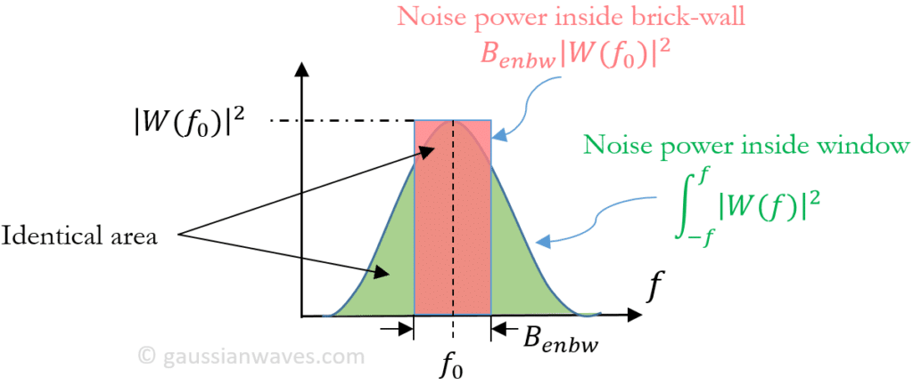
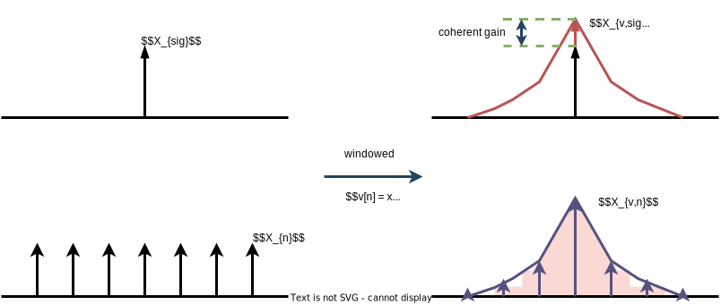
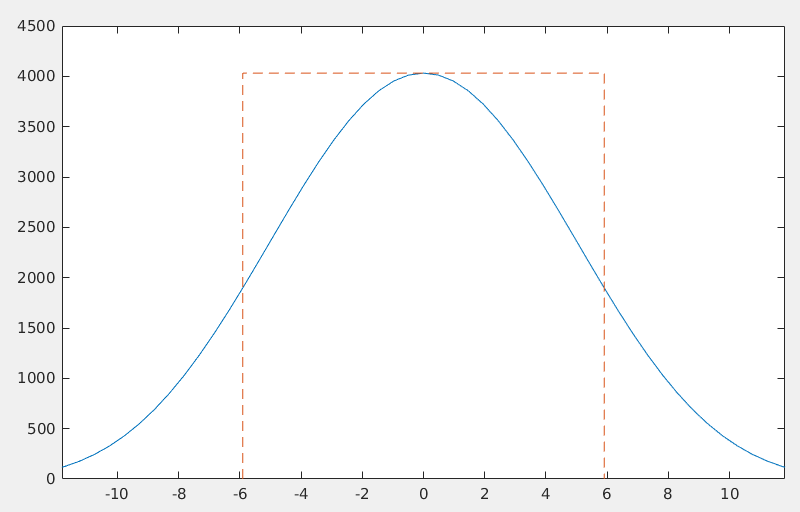
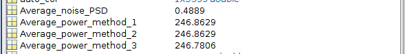
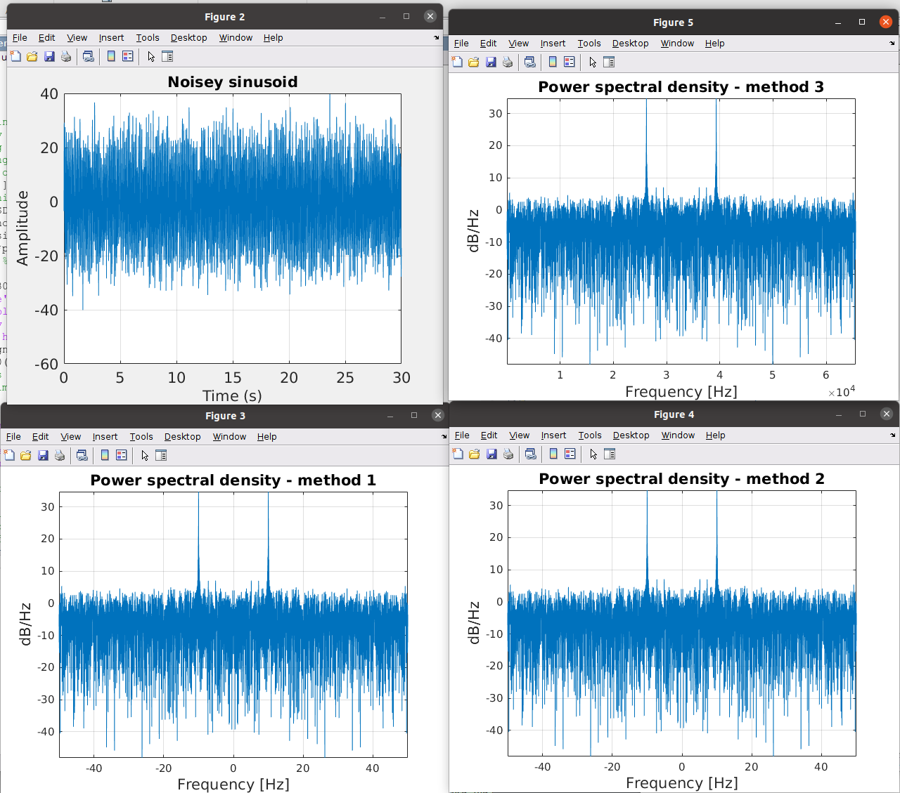

## PS and PSD

The spectral density format is appropriate for random or noise signals but inappropriate for discrete frequency components because the latter theoretically have zero bandwidth


## Incoherent and Coherent Power Gains

The incoherent and coherent power gains of these windows are the appropriate respective correction factors for a power spectral density plot showing noise and a power spectral plot showing discrete signals


## picket-fence effect


## Effective Noise BandWidth (ENBW)


### General derivation

The relationship between a *power spectrum* ($PS, V^2$) and a *power spectral density* ($PSD, V^2/Hz$) is given by the **effective noise bandwidth** (*ENBW*), which can easily be determined at the time when the DFT is computed.

ENBW should always be recorded when a spectrum or spectral density is computed, such that the result can be converted to the other form at a later stage, when the information about the frequency resolution $f_{res}$ and the window that was used is normally not easily available any more.

The **normalized equivalent noise bandwidth** (NENBW) of the window is given by

$$
\text{NENBW} = N\frac{S_2}{S_1}
$$
where $S_1 = \sum _{k=0}^{N-1}w_k$ and $S_2 = \sum _{k=0}^{N-1}w_k^2$

The *ENBW* is given by

$$
\text{ENBW} = \text{NENBW}\cdot f_{res} = \text{NENBW}\cdot \frac{f_s}{N} = f_s\frac{S_2}{(S_1)^2}
$$

> Equivalent noise bandwidth (ENBW) compares a *window* to an *ideal, rectangular time-window*. It is the *bandwidth of the rectangular window's frequency-domain shape* that passes the same amount of **white noise** energy as the frequency-domain shape defined by the other window. 



Therefore, the equivalent noise bandwidth $B_{enbw}$ is given by

$$
B_{enbw} = \frac{\int_{-f}^{f} |W(f)|^2 df}{|W(f_0)|^2}
$$

Translating to discrete domain, the equivalent noise bandwidth can be computed using DFT samples as

$$
B_{enbw} =\frac{\sum_{k=0}^{N-1}|W[k]|^2}{|W[k_0]|^2}
$$

where $k_0$ is the index at which the magnitude of FFT output is maximum and $N$ is the window length, i.e. $k_0=0$.

Applying *Parseval's theorem* and $W[0]=\sum_{n}w[n]$, $B_{enbw}$ can also be computed using time domain samples as

$$
B_{enbw} = N \frac{\sum_{n}|w[n]|^2}{ \left| \sum_{n} w[n] \right|^2}
$$

> scale $w[n]$ **don't** change $B_{enbw}$
>
> 
>
> Noise power inside window: $\int_{-f}^{f} |W(f)|^2 df \to N\cdot\sum_{n}|w[n]|^2$
>
> peak amplitude: $|W(f_0)|^2 \to \left| \sum_{n} w[n] \right|^2$


### An alternative derivation



Assuming the windowed sequence $v[n] = x[n]w[n]$

- $W[k]$: Fourier Transform of finite sequence window

- $X_{sig}$: Fourier Transform of signal

- $X_{n}$: Fourier Transform of noise

- $X_{v,sig}$: Fourier Transform of windowed signal

- $X_{v,n}$: Fourier Transform of windowed signal


The Fourier Transform of windowed signal can be expressed as

$$\begin{align}
X_{v,sig} &= W_{max}\cdot X_{sig} \\
&= W[0]\cdot X_{sig}
\end{align}$$

> For a typical window, $W_{max}$ occurs at $\omega = 0$

And the Frouier Transform of windowed noise can be expressed as

$$\begin{align}
X_{v,n}^2 &= \sum_k (W[k])^2 \cdot X_n^2
\end{align}$$

divided by $(W[0])^2$ on both sides of the above equation

$$
\frac{X_{v,n}^2}{(W[0])^2} = \frac{\sum_k (W[k])^2}{(W[0])^2} \cdot X_n^2
$$

By Parseval's theorem

$$
\frac{X_{v,n}^2}{\left(\sum_n w[n]\right)^2} = \frac{N\sum_n w^2[n]}{\left(\sum_n w[n]\right)^2} \cdot X_n^2
$$

where $X^2_n$ is what is deserved and

$$
X_n^2 = \frac{PS_{n}}{B_{enbw}}
$$

where $B_{enbw} = N \frac{\sum_{n}|w[n]|^2}{ \left| \sum_{n} w[n] \right|^2}$


### code example

```matlab
lw = 128;
win = hann(lw);
lt = 2048;
windft = fftshift(fft(win,lt));

ad = abs(windft).^2;
mg = max(ad);

fs = 1000;

bw = enbw(win,fs);

bdef = sum((win).^2)/sum(win)^2*fs;
fprintf("bw: %.3f\n", bw);
fprintf("bdef: %.3f\n", bdef);

freq = -fs/2:fs/lt:fs/2-fs/lt;

plot(freq,ad, bw/2*[-1 -1 1 1],mg*[0 1 1 0],'--')
xlim(bw*[-1 1])

Adiff = trapz(freq,ad)-bw*mg;
fprintf("Adiff: %.3e\n", Adiff);
```
Verify that the area of the rectangle contains the same total power as the window.
```matlab
Adiff = trapz(freq,ad)-bw*mg
```
output:
```
bw: 11.811
bdef: 11.811
Adiff: 7.276e-12
```




## noise floor

**processing gain**:

DFT can pull signals out of background noise. This is due to the inherent *correlation gain* that takes place in any N-point DFT.


### assuming rect window is used

DFT bin's output *noise* standard deviation (*rms*) value is proportional to $\sqrt{N}$, and the DFT's output magnitude for the bin containing the *signal tone* is proportional to $N$

signal tone power
$$
P_{\text{sig}} = 2 \frac{X_{sig}^2}{N^2}
$$

> +/- frequency spectrum and apply Parseval's theorem 

noise power
$$\begin{align}
P_n &= \sum_{k=0}^{N-1}{\frac{(X_{n}(k))^2}{N^2}}  \\
&= \frac{X_{n}^2}{N^2}\cdot N \\
&= \frac{X_{n}^2}{N}
\end{align}$$

> note white noise, that is $X_n(i) = X_n(j)$


displayed **SNR**
$$\begin{align}
\text{SNR} &= 10\log10\left(\frac{X_{sig}^2}{X_{n}^2}\right) \\
&= 10\log_{10}\left(\frac{P_{\text{sig}}N^2}{P_n2N}\right) \\
&= 10\log_{10}\left(\frac{P_{\text{sig}}}{P_n}\right) + 10\log_{10}\left(\frac{N}{2}\right) \\
&= \text{SNR}' + 10\log_{10}(N/2)
\end{align}$$

If we increase a DFT's size from $N$ to $2N$, the DFT's output SNR increased by 3dB. So we say that a DFT's **processing gain** increases by 3dB whenever $N$ is doubled.

### general formula

signal tone power
$$
P_{\text{sig}} = 2 \frac{X_{sig}^2}{S_1^2}
$$

noise power
$$
P_n = \frac{X_{n}^2}{S_2}
$$

Then, displayed **SNR** is obtained
$$
\text{SNR} = \text{SNR}'+10\log_{10}\left(\frac{S_1^2}{2S_2}\right)
$$


## Amplitude Correction

1. A finite-duration window $w[n]$

   DTFT is $W[e^{j\omega}]$ and the maximum magnitude is is at DC frequency, which  $\sum_n w_n$

2. Sinusoidal signal $x[n]$

   DFS is $X_k$, and DTFT shall be $\frac{2\pi}{N}X_k(e^{j\omega})$

3. the windowed sequence $v[n] = x[n]w[n]$

   with multiplication property,  DTFT of $v[n]$ shall be $\frac{X_k(e^{j\omega})}{N}\sum_n w_n$

   As we know, DFT of $v[n]$ is samples of its DTFT, that is
   $$
   \frac{X_k(e^{j\omega})}{N}\sum_n w_n = X_v[k]
   $$
   Therefore,
   $$
   \frac{X_k(e^{j\omega})}{N} = \frac{X_v[k]}{\sum_n w_n}
   $$
   


## demo


```matlab
%https://aaronscher.com/Course_materials/Communication_Systems/documents/PSD_Autocorrelation_Noise.pdf

%Clear variables. clear command window, close all figures:
clc;
clear all;
close all;
%%%Setup and define variables
f0=10; %frequency of sinusoidal signal (Hz)
fs=100; %sampling frequency (Hz)
Ts=1/fs; %sampling period (seconds)
N0=3000; %number of samples
t=[0:Ts:Ts*(N0-1)]; %Sample times
noise_PSD=.5; %This is the desired noise power spectral density in W/Hz.
variance=noise_PSD*fs;% Variance = sigma^2
sigma=sqrt(variance);
noise=transpose(sigma*randn(N0,1));%create sampled white Gaussian noise.
xsignal=20*sin(2*pi*f0*t); %create sampled sinusoidal signal
x=xsignal+noise; %Add signal to noise
figure(1)
histogram(noise,30) %plot histogram
set(gca,'FontSize',14) %set font size of axis tick labels to 18
xlabel('Noise amplitude','fontsize',14)
ylabel('Frequency of occurance','fontsize',14)
title('Simulated histogram of white Gaussian noise','fontsize',14)
SNR_try1=snr(xsignal,noise); %calculate SNR using built in "snr" function.
SNR_try2=10*log10(sum(xsignal.^2)/sum(noise.^2)); %manually calculate SNR.
%If everything is correct, the two SNR calculations above should agree.
%Plot noise in time-domain
figure(2)
plot(t,x)
set(gca,'FontSize',14) %set font size of axis tick labels to 18
xlabel('Time (s)','fontsize',14)
ylabel('Amplitude','fontsize',14)
title('Noisey sinusoid','fontsize',14)
grid on
%Plot power spectral density (PSD) of noise using three different methods:
%
%Method 1. Calcululate PSD from amplitude spectrum
N=2^16; %Number of discrete points in the FFT.)
y=fft(x,N)/fs; %fft of noise
z=fftshift(y);%center noise spectrum
f_vec=[0:1:N-1]*fs/N-fs/2; %designate sample frequencies
amplitude_spectrum=abs(z); %compute two-sided amplitude spectrum
ESD1=amplitude_spectrum.^2; %ESD = |F(w)|^2;
PSD1=ESD1/((N0-1)*Ts);% PSD=ESD/T where T = total time of sample
figure(3)
plot(f_vec,10*log10(PSD1));
xlabel('Frequency [Hz]','fontsize',14)
ylabel('dB/Hz','fontsize',14)
title('Power spectral density - method 1','fontsize',14)
grid on
set(gcf,'color','w'); %set background color from grey (default) to white
axis tight
%calculate average power using PSD calclated from method 1:
Average_power_method_1=sum(PSD1)*fs/N; % Pav=sum(PSD)*delta_f where delta_f=fs/N;
%
%Method 2 - Calculate PSD from autocorrelation
time_lag=((-length(x)+1):1:(length(x)-1))*Ts;
auto_cor=xcorr(x,x)/fs; %Use xcorr function to find PSD
y=1/fs*fft(auto_cor,N); %fft of auto correlation function
PSD2=abs(1/(N0-1)*fftshift(fft(auto_cor,N)));
figure(4)
plot(f_vec,10*log10(PSD2));%use convolution
xlabel('Frequency [Hz]','fontsize',14)
ylabel('dB/Hz','fontsize',14)
title('Power spectral density - method 2','fontsize',14)
grid on
set(gcf,'color','w'); %set background color from grey (default) to white
axis tight
%calculate average power using PSD calclated from method 1:
Average_power_method_2=sum(PSD2)*fs/N; %Pav=sum(PSD)*delta_f where delta_f=fs/N;
%
%Method 3 - Calculate PSD using built in pwelch function
figure(5)
PSD3=periodogram(x,[],N,fs,'centered');
plot(10*log10(PSD3))
xlabel('Frequency [Hz]','fontsize',14)
ylabel('dB/Hz','fontsize',14)
title('Power spectral density - method 3','fontsize',14)
grid on
set(gcf,'color','w'); %set background color from grey (default) to white
axis tight
Average_power_method_3=sum(PSD3)*fs/N; %Pav=sum(PSD)*delta_f where delta_f=fs/N;
%
%Calculate mean and average PSD of noise:
PSD_noise=periodogram(noise,[],N,fs,'centered');
Average_noise_PSD=mean(PSD_noise);
Mean_noise=mean(noise);

```







> The power spectral density plots for methods 2 and 3 exactly match that for method 1 (shown above).


## reference

Schmid, H. (2012). How to use the FFT and Matlab's pwelch function for signal and noise simulations and measurements. URL:[http://www.schmid-werren.ch/hanspeter/publications/2012fftnoise.pdf](http://www.schmid-werren.ch/hanspeter/publications/2012fftnoise.pdf)

Bonnie C.Baker. Reading and Using Fast Fourier Transforms (FFT) URL:[http://ww1.microchip.com/downloads/en/appnotes/00681a.pdf](http://ww1.microchip.com/downloads/en/appnotes/00681a.pdf)

FFT analysis: SNR and Noise level vary with FFT Window size URL:[https://www.virtins.com/forum/viewtopic.php?f=7&t=1382](https://www.virtins.com/forum/viewtopic.php?f=7&t=1382)

Lyons, R. G. (2011). Understanding digital signal processing (3rd ed.). Prentice Hall

Stefan Scholl, "Exact Signal Measurements using FFT Analysis",Microelectronic Systems Design Research Group, TU Kaiserslautern, Germany. [[pdf](https://kluedo.ub.rptu.de/frontdoor/deliver/index/docId/4293/file/exact_fft_measurements.pdf)]

enbw Matlab URL:[https://www.mathworks.com/help/signal/ref/enbw.html](https://www.mathworks.com/help/signal/ref/enbw.html)

Aaron Scher. PSD, Autocorrelation, and Noise in MATLAB  [[pdf](https://aaronscher.com/Course_materials/Communication_Systems/documents/PSD_Autocorrelation_Noise.pdf)]

Aaron Scher. FFT, total energy, and energy spectral density computations in MATLAB [[pdf](https://aaronscher.com/Course_materials/Communication_Systems/documents/Energy_signals_matlab_tutorial.pdf)]

Amplitude Estimation and Zero Padding URL:[https://www.mathworks.com/help/signal/ug/amplitude-estimation-and-zero-padding.html](https://www.mathworks.com/help/signal/ug/amplitude-estimation-and-zero-padding.html)

Harris, F. (1978). On the use of windows for harmonic analysis with the discrete Fourier transform. Proceedings of the IEEE, 66, 51-83. [[pdf](https://www.fceia.unr.edu.ar/prodivoz/Harris_1978.pdf)]

Harris, F. J. . (1976). Windows, harmonic analysis and the discrete fourier transform. [[pdf](https://apps.dtic.mil/sti/pdfs/ADA034956.pdf)]

Wang Hongwei. Virtins. Evaluation of Various Window Functions using Multi-Instrument  [[pdf](https://www.virtins.com/doc/D1003/Evaluation_of_Various_Window_Functions_using_Multi-Instrument_D1003.pdf)]

Properties of FFT Windows Used in Stable32 [[pdf](http://www.wriley.com/Properties%20of%20FFT%20Windows%20Used%20in%20Stable32.pdf)]

Solomon, Jr, O M. PSD computations using Welch's method. [Power Spectral Density (PSD)]. United States. https://doi.org/10.2172/5688766 [[pdf](https://www.osti.gov/servlets/purl/5688766)]

Measure Power of Deterministic Periodic Signals [[https://www.mathworks.com/help/signal/ug/measuring-the-power-of-deterministic-periodic-signals.html](https://www.mathworks.com/help/signal/ug/measuring-the-power-of-deterministic-periodic-signals.html)]

Mathuranathan. Equivalent noise bandwidth (ENBW) of window functions. [[https://www.gaussianwaves.com/2020/09/equivalent-noise-bandwidth-enbw-of-window-functions/](https://www.gaussianwaves.com/2020/09/equivalent-noise-bandwidth-enbw-of-window-functions/)]

recordingblogs, Equivalent noise bandwidth  [[https://www.recordingblogs.com/wiki/equivalent-noise-bandwidth](https://www.recordingblogs.com/wiki/equivalent-noise-bandwidth)]


unpingco, Python for Signal Processing [[https://github.com/unpingco/Python-for-Signal-Processing/blob/master/Windowing_Part2.ipynb](https://github.com/unpingco/Python-for-Signal-Processing/blob/master/Windowing_Part2.ipynb)]

