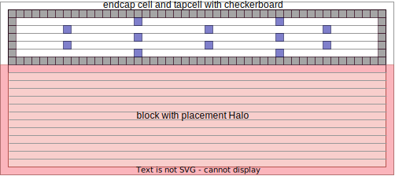

First place place hard macro and add placement halo, then execute the following
code to add endcap and tapcell.

```tcl
deleteFill -prefix ENDCAP
deleteFill -prefix WELL

setEndCapMode \
    -leftEdge BOUNDARY_RIGHTBWP16P90CPD \
    -rightEdge BOUNDARY_LEFTBWP16P90CPD \
    -leftBottomCorner BOUNDARY_NCORNERBWP16P90CPD \
    -leftTopCorner BOUNDARY_PCORNERBWP16P90CPD \
    -rightTopEdge FILL3BWP16P90CPD \
    -rightBottomEdge FILL3BWP16P90CPD \
    -topEdge "BOUNDARY_PROW2BWP16P90CPD BOUNDARY_PROW3BWP16P90CPD"
    -bottomEdge "BOUNDARY_NROW2BWP16P90CPD BOUNDARY_NROW3BWP16P90CPD" \
    -boundary_tap true

set_well_tap_mode \
    -rule 33
    -bottom_tap_cell BOUNDARY_NTAPBWP16P90CPD \
    -top_tap_cell BOUNDARY_PTAPBWP16P90CPD \
    -cell TAPCELLBWP16P90CPD

addEndCap
addWellTap -checkerBoard -cell TAPCELLBWP16P90CPD -cellInterval 160
```


**REF:**
[StanfordAHA/PowerDomainDesign](https://github.com/StanfordAHA/PowerDomainDesign/blob/c280a35f01ad0617ff054b925c1d5c2652a0f4e1/scripts/layout_pe_tile_new.power.tcl#L94-L113)