## Summary of Equalizations

> 32 to 56 Gbps Serial Link Analysis and Optimization Methods for Pathological Channels [[https://docs.keysight.com/eesofapps/files/678068240/678068273/1/1629077956000/tutorial-32-to-56-gbps-serial-link-analysis-optimization-methods-pathological-channels.pdf](https://docs.keysight.com/eesofapps/files/678068240/678068273/1/1629077956000/tutorial-32-to-56-gbps-serial-link-analysis-optimization-methods-pathological-channels.pdf)]

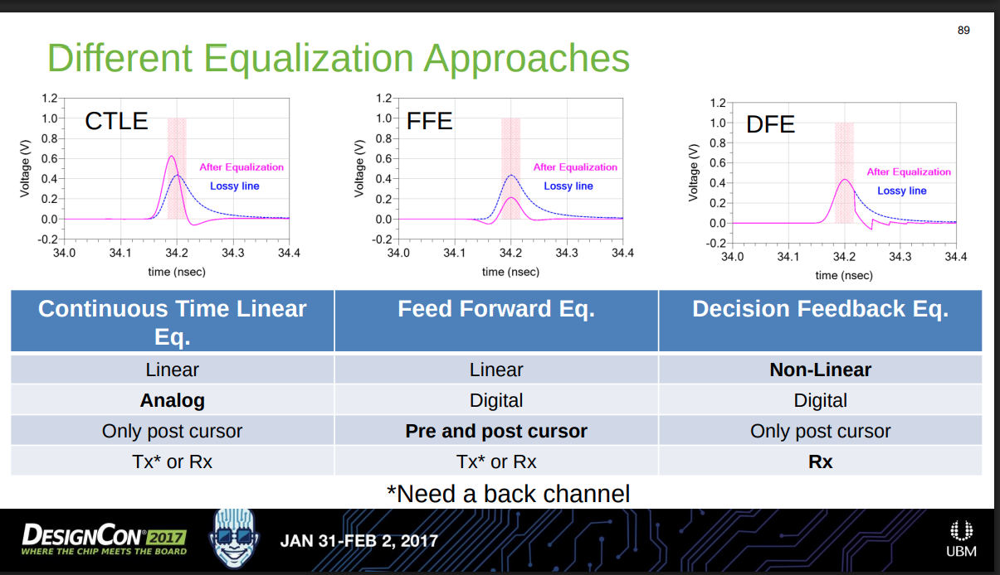

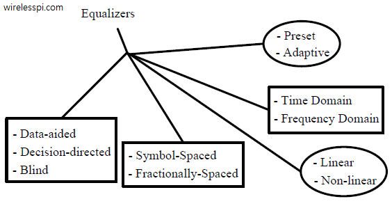

> Qasim Chaudhari. *A Classification of Equalization Techniques* [[https://wirelesspi.com/a-classification-of-equalization-techniques/](https://wirelesspi.com/a-classification-of-equalization-techniques/)]

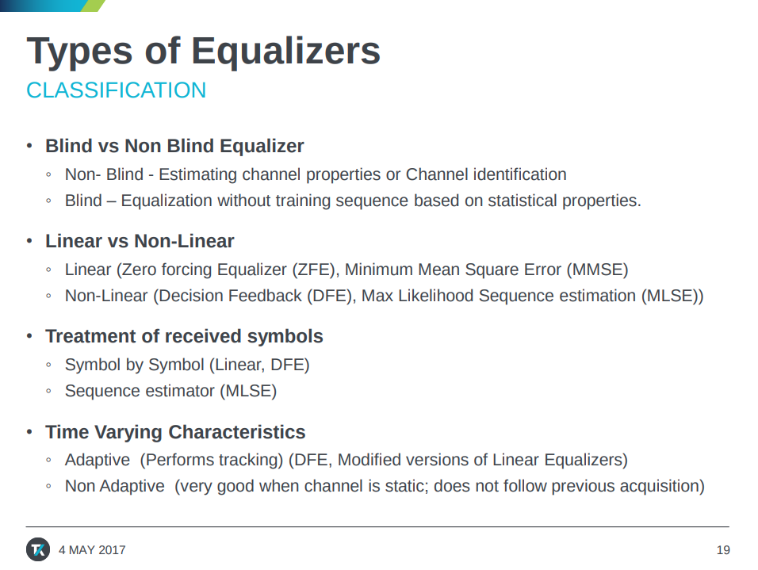


### CTLE vs. FFE

> Keysight **Signal Integrity Educational Posts** [[Post 5: Root Cause of Eye Closure](https://docs.keysight.com/eesofapps/post-5-root-cause-of-eye-closure-678068340.html)], [[Post 6: Eye-opening Experience with CTLE](https://docs.keysight.com/eesofapps/post-6-eye-opening-experience-with-ctle-678068358.html)], [[Post 7: Eye-opening Experience with FFE](https://docs.keysight.com/eesofapps/post-7-eye-opening-experience-with-ffe-678068383.html)]

***in the time domain***

- CTLE provide only limited improvement in the pre-cursor ISI, because of the continuous-time, analog nature of CTLE
- FFE to reduce ISI in both the pre-cursor and post-cursor, because of operating digitally in discrete-time

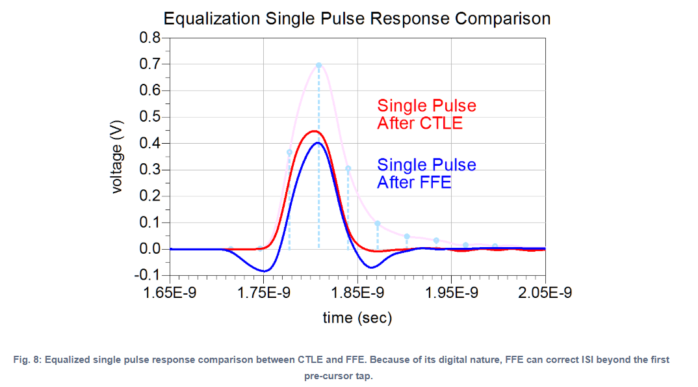

***in the frequency domain***

- CTLE focuses on boosting frequency content at the ***Nyquist frequency***
- FFE algorithm is selecting taps that effectively amplify the ***odd harmonics of the Nyquist frequency***

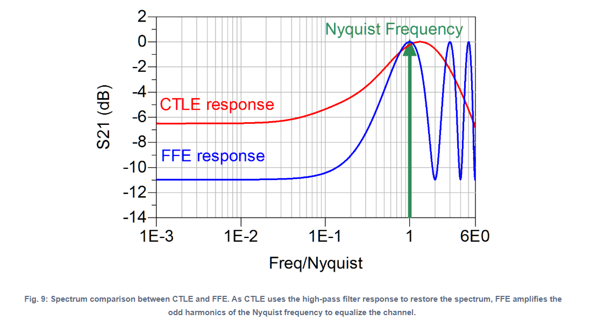

> In the case of FFE, because of the nature of finite impulse response filter, we would expect amplification and attenuation of different harmonics of Nyquist Frequency

---

Until 6.5 dB of CTLE DC attenuation, the spread of the single pulse is *positive* and reaches almost *zero* at 6.5 dB. As the DC attenuation increases to more than 6.5 dB, the single pulse spectrum is restored too much, resulting in a *negative dip* at the end of the pulse

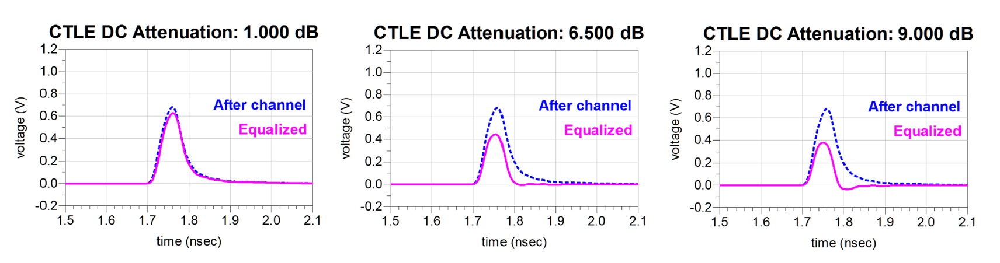

> the maximum eye opening **does not** happen at maximum DC attenuation at 9 dB

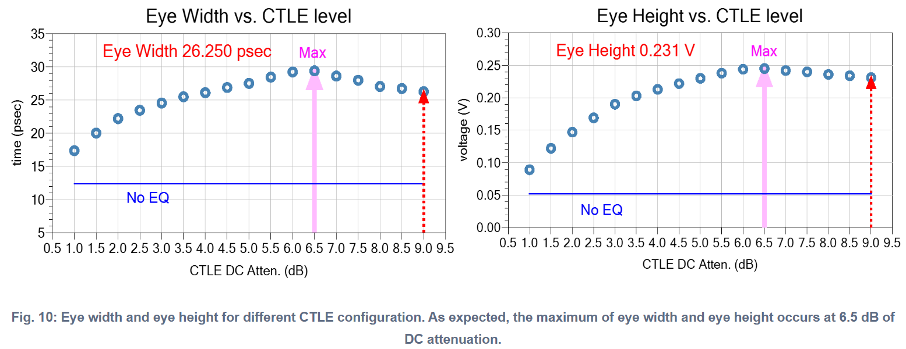

### DFE

> Keysight **Signal Integrity Educational Posts** [[Post 8: Eye-opening Experience with DFE](https://docs.keysight.com/eesofapps/post-8-eye-opening-experience-with-dfe-678068404.html)]

There are *kinks* in the eye diagram, the signature of an opened DFE eye is different than other equalizations

DFE algorithm is reducing ISI based on the *detected data (symbol)*

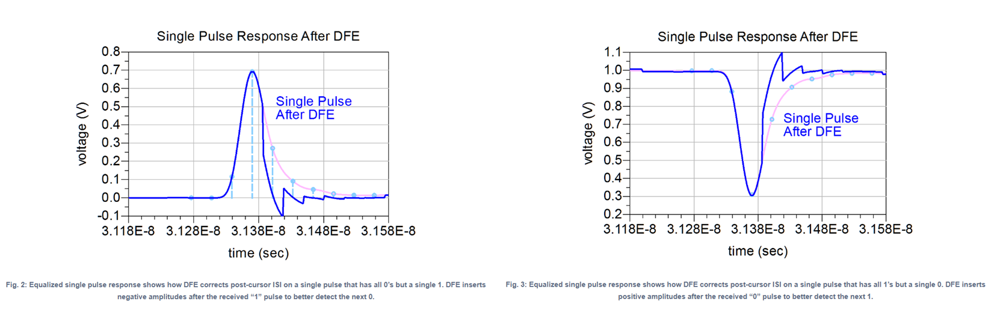

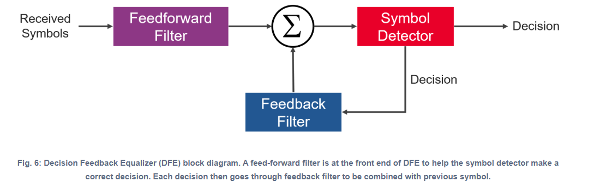

Since DFE assumes that past symbol decisions are *correct*. Incorrect decisions from the symbol detector corrupt the filtering of the feedback loop. As a result, the inclusion of the feedforward filter on the front end is crucial in minimizing the probability of error


- because symbol detection is nonlinear, decision feedback equalization is also *nonlinear*
- because of the nonlinearity of the DFE response, it must be modeled in the *time domain*  


## FIR Coefficient Selection

> Jose E. Schutt-Aine, Spring 2024 ECE 546 Lecture - 27 Equalization [[http://emlab.uiuc.edu/ece546/Lect_27.pdf](http://emlab.uiuc.edu/ece546/Lect_27.pdf)]
>
> Sam Palermo. Lecture 7 - Equalization Intro & TX FIR EQ [[https://people.engr.tamu.edu/spalermo/ecen689/lecture7_ee720_eq_intro_txeq.pdf](https://people.engr.tamu.edu/spalermo/ecen689/lecture7_ee720_eq_intro_txeq.pdf)]
>
> Kevin Zheng, Boris Murmann, Hongtao Zhang, and Geoff Zhang. Feedforward Equalizer Location Study for High-Speed Serial Systems [[https://www.signalintegrityjournal.com/articles/1228-feedforward-equalizer-location-study-for-high-speed-serial-systems](https://www.signalintegrityjournal.com/articles/1228-feedforward-equalizer-location-study-for-high-speed-serial-systems)]
>
> —, "System-Driven Circuit Design for ADC-Based Wireline Data Links", Ph.D. Dissertation,
>Stanford University, 2018 [[https://purl.stanford.edu/hw458fp0168](https://purl.stanford.edu/hw458fp0168)]
> 
> Hanumolu, P. K., Wei, G. Y., & Moon, Y. K. (2005). Equalizers for high-speed serial links. *International Journal of High Speed Electronics and Systems* [[https://people.engr.tamu.edu/spalermo/ecen689/hslink_eq_overview_hanumolu_jhses05.pdf](https://people.engr.tamu.edu/spalermo/ecen689/hslink_eq_overview_hanumolu_jhses05.pdf)]
>

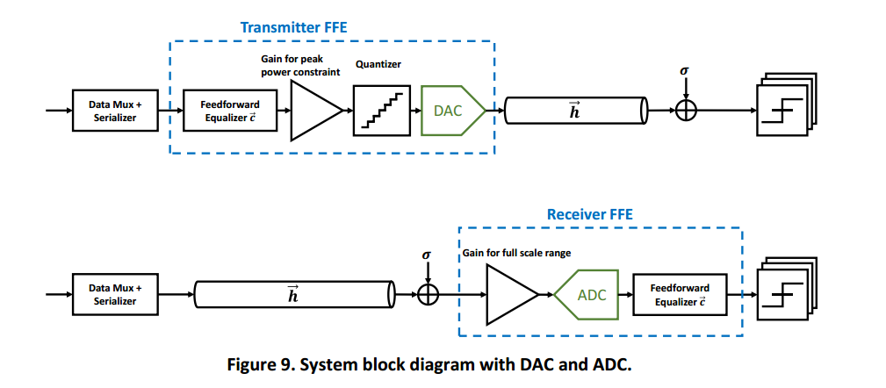

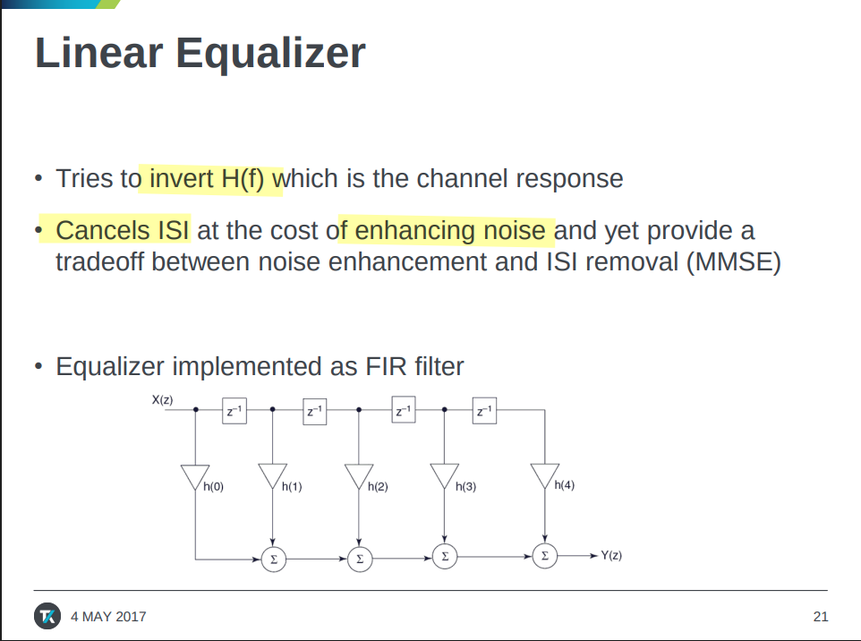


### with MMSE

> Lecture 7: Equalization Introduction & TX FIR Eq [[https://people.engr.tamu.edu/spalermo/ecen689/lecture7_ee720_eq_intro_txeq.pdf](https://people.engr.tamu.edu/spalermo/ecen689/lecture7_ee720_eq_intro_txeq.pdf)]

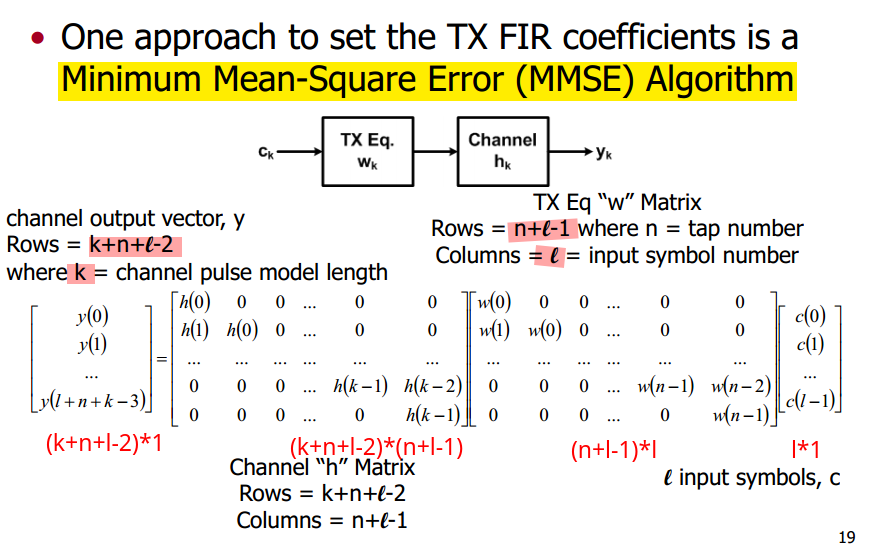

> **Toeplitz matrix**: transforms discrete convolution into $y=Ax$, where $x$ is a flattened input vector [[Google AI Mode](a flattened input vector)]


---

***Lone-Pulse Equalization***

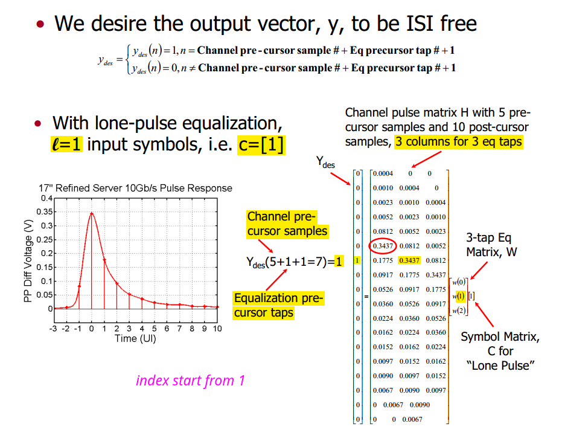


$$\begin{align}
E^TE &=(W^T H^T - Y_{des}^T)(HW-Y_{des})=W^TH^THW+Y_{des}^TY_{des}-W^TH^TY_{des}-Y_{des}^THW \\
&=W^TH^THW+Y_{des}^TY_{des}-2Y_{des}^THW
\end{align}$$
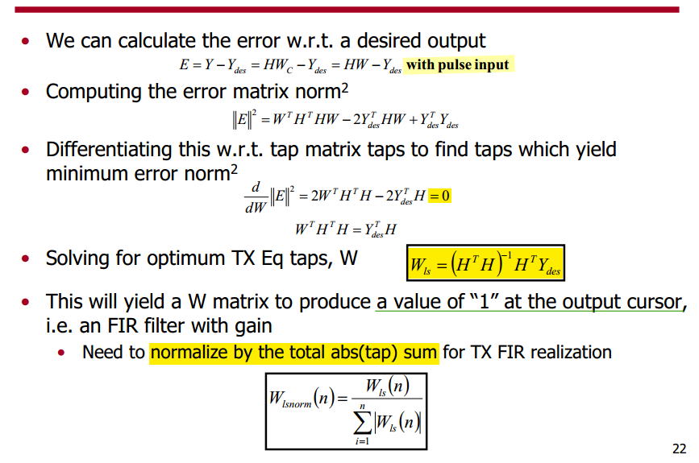

```matlab
h=[0.004, 0.0010, 0.0023, 0.0052, 0.0812, 0.3437, 0.1775, 0.0917, 0.0526,...
    0.0360, 0.0224, 0.0162, 0.0152, 0.0097, 0.0090, 0.0067];
k = length(h);
n = 3;
l = 1;
m2 = 5;
m1 = 1;

H = zeros([k+n+l-2, n+l-1]);
H(1:end-2,1) = h;
H(2:end-1,2) = h;
H(3:end,3) = h;

Ydes = zeros([k+n+l-2, 1]);
Ydes(m1+m2+1,1) = 1;

HT = transpose(H);

Wls = inv(HT*H)*HT*Ydes;

% Wls =
% 
%    -0.8177
%     3.7239
%    -1.7181

Wlsnorm = Wls/sum(norm(Wls,1));

% Wlsnorm =
% 
%    -0.1306
%     0.5949
%    -0.2745
```

---

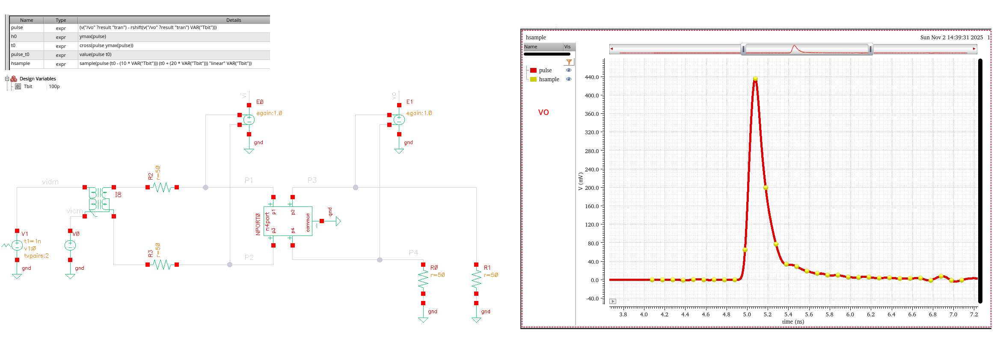

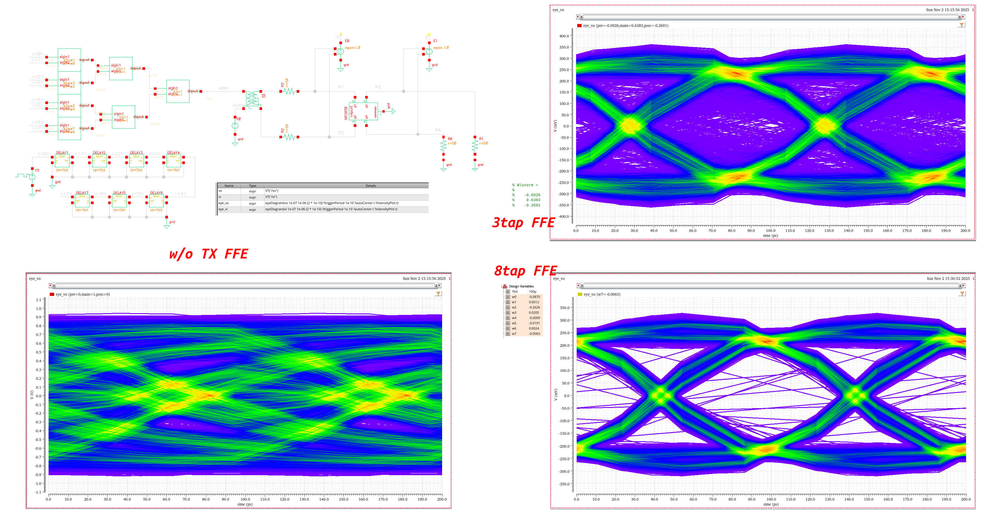

```matlab
fcsvf = readtable("hsample_pre10post20.csv");
h= fcsvf.hsample_Design_Point_1_Y;
k = length(h);
n = 8;
l = 1;
m2 = 10;  % channel pre-cursor sample#
m1 = 1;

H = zeros([k+n+l-2, n+l-1]);
for i =1:n
    H(i:i+k-1,i) = h;
end

Ydes = zeros([k+n+l-2, 1]);
Ydes(m1+m2+1,1) = 1;

HT = transpose(H);
Wls = inv(HT*H)*HT*Ydes;


Wlsnorm = Wls/sum(norm(Wls,1));
% Wlsnorm =
% 
%    -0.0926
%     0.6383
%    -0.2691
```


### with ZFS

> ***Zero Forcing Solution (ZFS)***

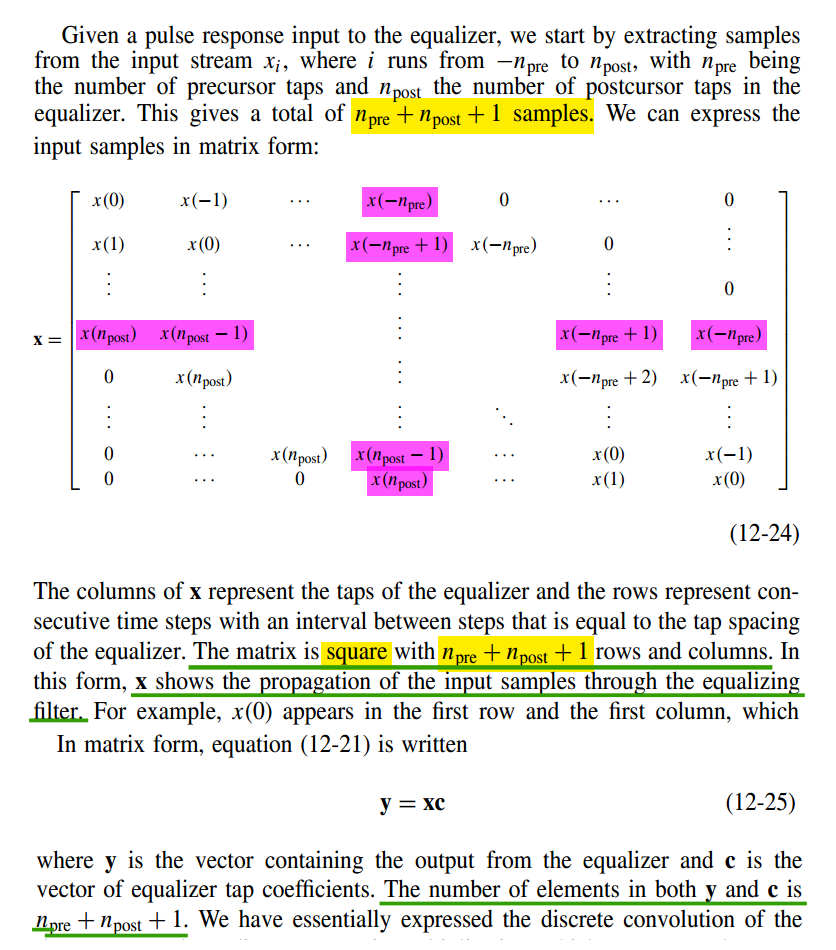

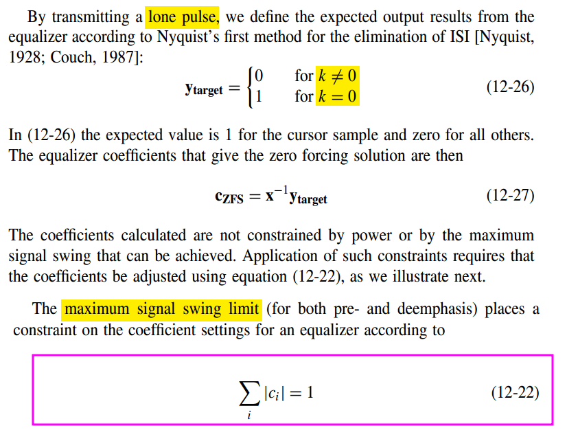

|                      | $k=-\text{npre}$   | $k=0$; $y_\text{target}=1$ | $k=\text{npost}$   |
| -------------------- | ------------------ | -------------------------- | ------------------ |
| $c_{-\text{npre}}$   | $x_0$              |                            | 0                  |
| $c_{-\text{npre}+1}$ | $x_{-1}$           |                            | 0                  |
| ...                  | ...                | ...                        | ...                |
| $c_0$                | $x_{-\text{npre}}$ | $x_0$                      | $x_{\text{npost}}$ |
| ...                  | ...                | ...                        | ...                |
| $c_{\text{npost}-1}$ | $0$                |                            | $x_1$              |
| $c_{\text{npost}}$   | $0$                |                            | $x_0$              |


----

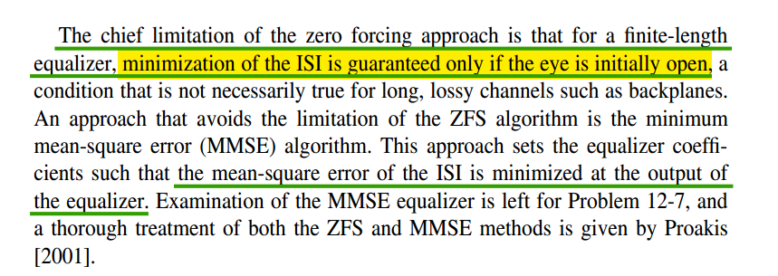


---

The number of **channel samples** may **exceed** the number of **equalizer taps** to accurately compute the optimal tap coefficients

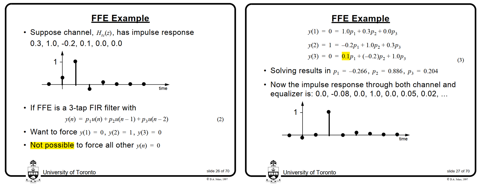

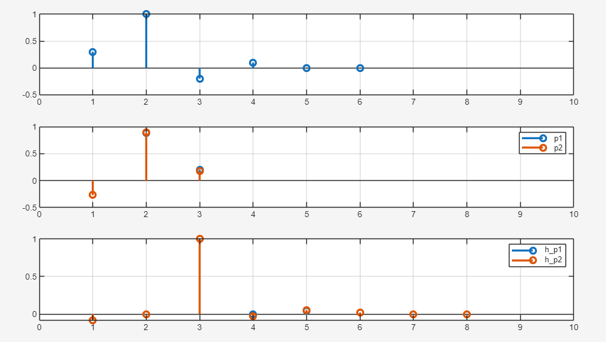

```matlab
ht = [0.3, 1.0, -0.2, 0.1, 0.0, 0.0];
ytarget = [0;1;0];

x1 = [[1.0 0.3 0.0];
    [-0.2 1.0 0.3];
    [0.1 -0.2 1.0]];  % better

x2 = [[1.0 0.3 0.0];
    [-0.2 1.0 0.3];
    [0.0 -0.2 1.0]];

p1 = inv(x1)*ytarget; % -0.2657    0.8857    0.2037
p2 = inv(x2)*ytarget; % -0.2679    0.8929    0.1786

ht_p1 = conv(ht, p1); % p1 better -> x1
ht_p2 = conv(ht, p2);

% ht_p1 =
%
%    -0.0797         0    1.0000         0    0.0478    0.0204         0         0
%
% ht_p2 =
%
%    -0.0804    0.0000    1.0000   -0.0268    0.0536    0.0179         0         0

subplot(3,1,1)
stem(ht, 'LineWidth', 2); grid on; xlim([0,10])
subplot(3,1,2)
stem(p1, 'LineWidth', 2); hold on; stem(p2, 'LineWidth', 2);
grid on; legend(["p1" "p2"]); xlim([0,10])
subplot(3,1,3)
stem(ht_p1, 'LineWidth', 2); hold on; stem(ht_p2, 'LineWidth', 2)
grid on; legend(["h\_p1" "h\_p2"]); xlim([0,10])
```


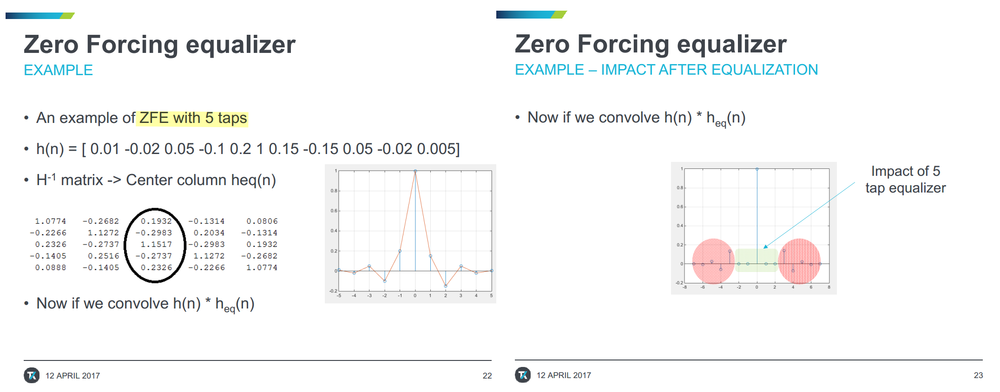

```matlab
h = [0.01 -0.02 0.05 -0.1 0.2 1 0.15 -0.15 0.05 -0.02 0.005];
[val, idx] = max(h);

htc = h(idx-2:idx+2)';

H1 = [1 0.2 -0.1 0.05 -0.02;
    0.15 1 0.2 -0.1 0.05;
    -0.15 0.15 1 0.2 -0.1;
    0.05 -0.15 0.15 1 0.2;
    -0.02 0.05 -0.15 0.15 1];  % better

H2 = [1 0.2 -0.1 0 0;
    0.15 1 0.2 -0.1 0;
    -0.15 0.15 1 0.2 -0.1;
    0 -0.15 0.15 1 0.2;
    0 0 -0.15 0.15 1];


ytgt = zeros(5,1);
ytgt(3) = 1;

heq1 = inv(H1)*ytgt;
heq2 = inv(H2)*ytgt;
```

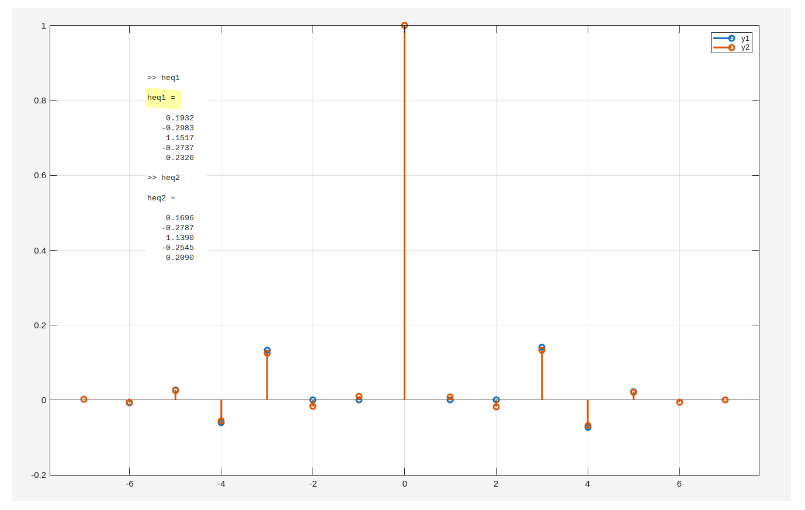


##  ZFS vs MMSE

> ***m**inimum **m**ean **s**quared **e**rror (**MMSE**)*

There are three major ***MMSE***-based algorithms: 

- least mean square (***LMS***),
- normalized least mean square (**NLMS**)
- recursive least square (**RLS**)

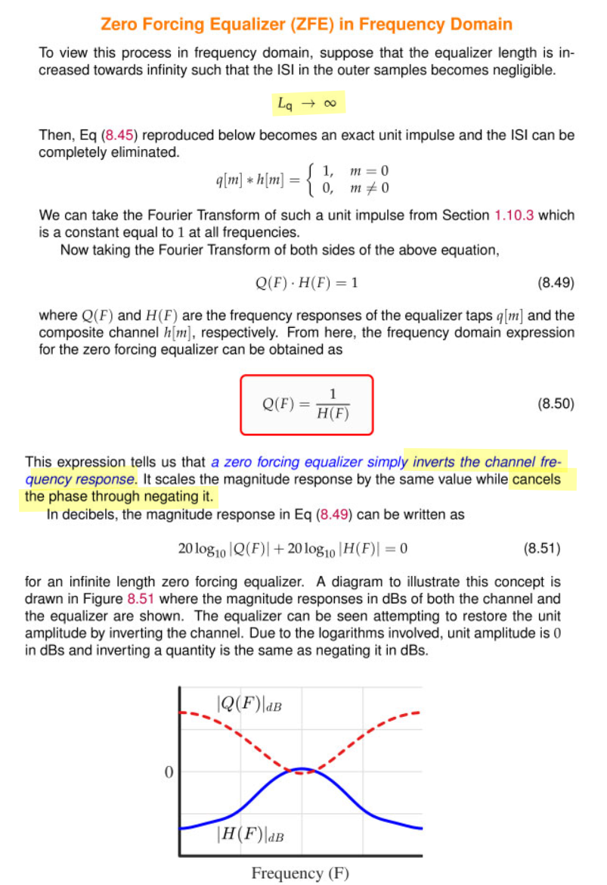


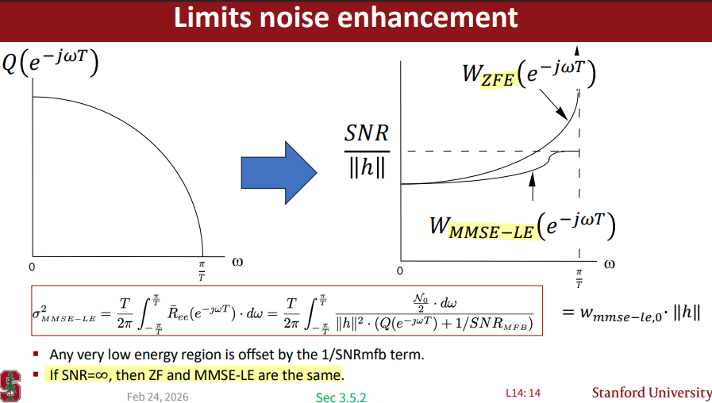

- ZFS eliminates the ISI only at the sampling points that correspond to the equalizer taps. The equalized pulse shows ISI in the intervals between the sample points and at sample points outside the equalizer
- The Minimum Mean-Square Error Linear Equalizer (MMSE-LE) *balances **ISI reduction** and **noise enhancement***. The MMSE-LE always performs as well as, or better than, the ZFE


## LMS (Least-Mean-Square)

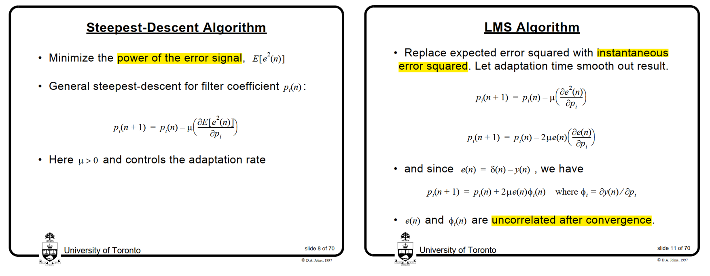

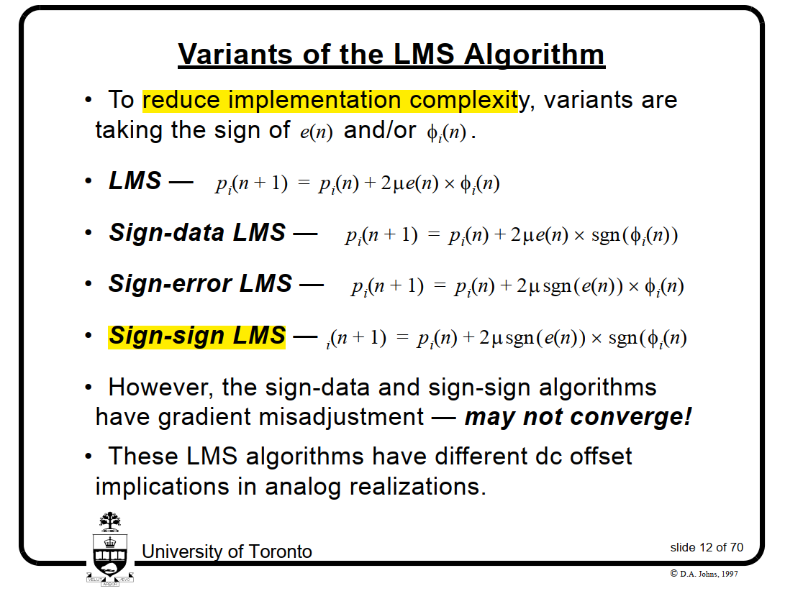

---

> Qasim Chaudhari. Least Mean Square (LMS) Equalizer – A Tutorial [[https://wirelesspi.com/least-mean-square-lms-equalizer-a-tutorial/](https://wirelesspi.com/least-mean-square-lms-equalizer-a-tutorial/)]

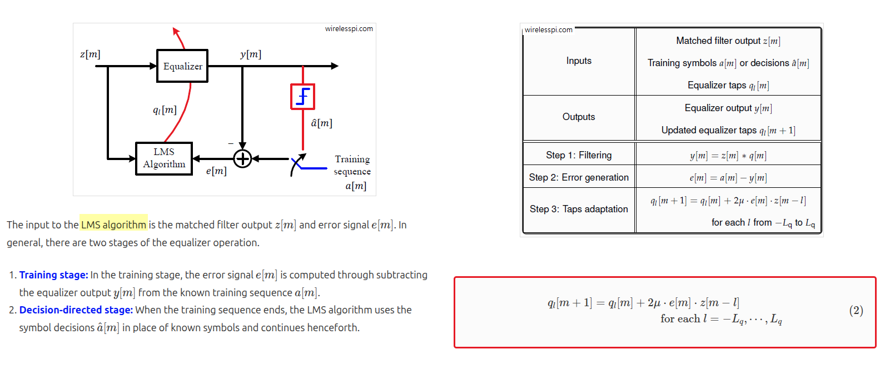

> CC Chen, **Why Background EQ Adaptation?** [[https://youtu.be/l46OesuNfp4](https://youtu.be/l46OesuNfp4)]
>
> 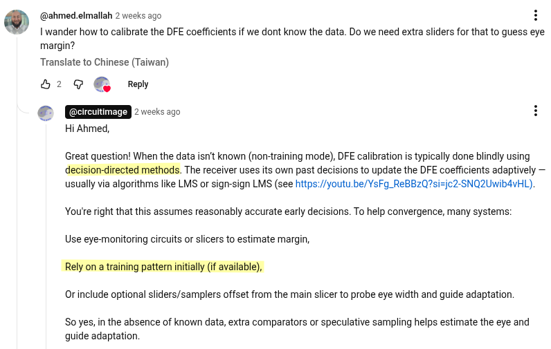


### TX with SS-LMS

> V. Stojanovic et al., "Autonomous dual-mode (PAM2/4) serial link transceiver with adaptive equalization and data recovery," IEEE Journal of Solid-State Circuits, vol. 40, no. 4, pp. 1012–1026, Apr. 2005 [[https://sci-hub.ru/10.1109/JSSC.2004.842863](https://sci-hub.ru/10.1109/JSSC.2004.842863)]
>
> —, "Channel-Limited High-Speed Links: Modeling, Analysis and Design," PhD. Thesis, Stanford University, Sep. 2004. [[pdf](https://vlsiweb.stanford.edu/people/alum/pdf/0409_Stojanovic_Link_Opt.pdf)]
>
> —, US7423454B2. *High speed signaling system with adaptive transmit pre-emphasis* [[pdf](https://patentimages.storage.googleapis.com/78/37/fb/bb72b025139a5f/US7423454.pdf)]

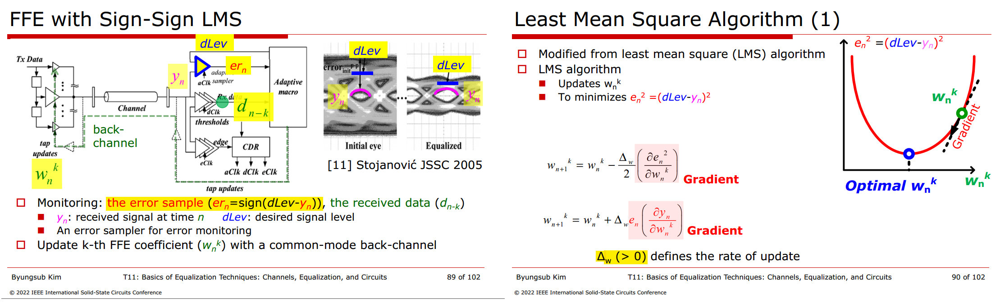

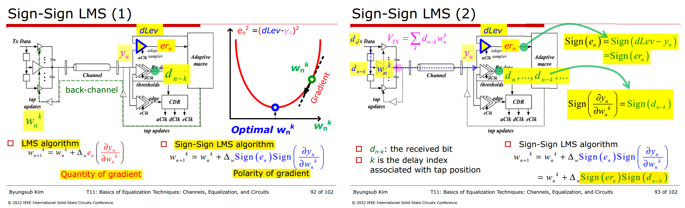

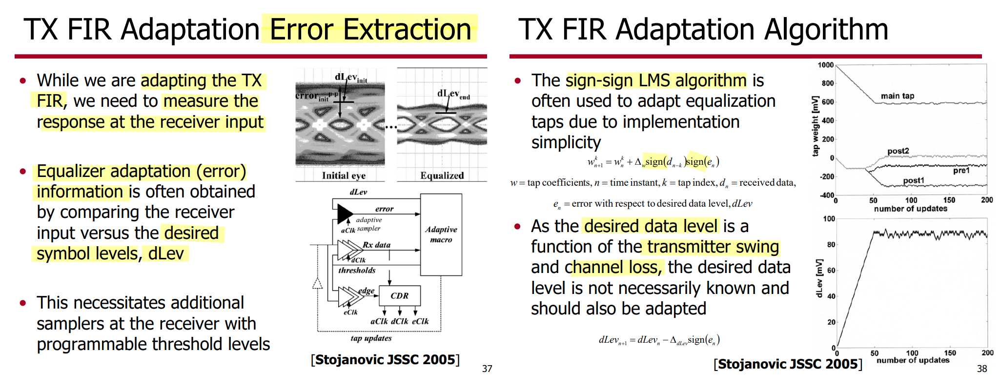
$$
dLev_{n+1} = dLev_n - \frac{\Delta_{dLev}}{2}\left(\frac{\partial e_n^2}{\partial dLev_n}\right) = dLev_n - \Delta _{dLev} e_n\left(\frac{\partial (dLev_n-y_n)}{\partial dLev_n}\right) = \color{red} dLev_n - \Delta _{dLev} e_n
$$
note $e_n = dLev_n-y_n$

---

> J. T. Stonick, Gu-Yeon Wei, J. L. Sonntag and D. K. Weinlader, "An adaptive PAM-4 5-Gb/s backplane transceiver in 0.25-μm CMOS," in IEEE Journal of Solid-State Circuits, vol. 38, no. 3, pp. 436-443, March 2003, [[https://sci-hub.st/10.1109/JSSC.2002.808282](https://sci-hub.st/10.1109/JSSC.2002.808282)]


###  RX with SS-LMS


> E. -H. Chen et al., "Near-Optimal Equalizer and Timing Adaptation for I/O Links Using a BER-Based Metric," in IEEE Journal of Solid-State Circuits, vol. 43, no. 9, pp. 2144-2156, Sept. 2008 [[https://sci-hub.ru/10.1109/JSSC.2008.2001871](https://sci-hub.ru/10.1109/JSSC.2008.2001871)]
>
> Sam Palermo. ECEN720: High-Speed Links Circuits and Systems [[Lecture 7 - Equalization Intro & TX FIR EQ](https://people.engr.tamu.edu/spalermo/ecen689/lecture7_ee720_eq_intro_txeq.pdf)], [[Lecture 8 - RX FIR, CTLE, DFE, & Adaptive Eq.](https://people.engr.tamu.edu/spalermo/ecen689/lecture8_ee720_rx_adaptive_eq.pdf)]

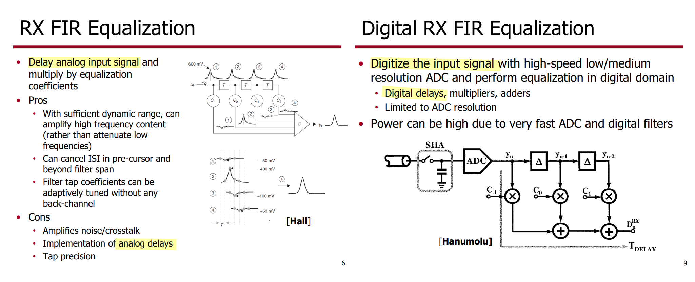

---


> Jinhyung Lee, Design of High-Speed Receiver for Video Interface with Adaptive Equalization; Phd thesis, August 2019. [[thesis link](http://dcollection.snu.ac.kr/common/orgView/000000157003)]

*TODO* &#128197;

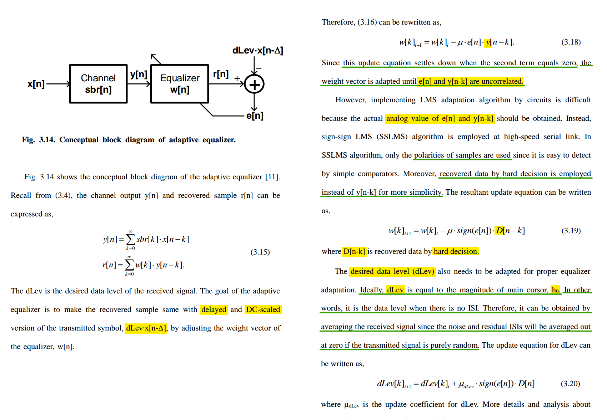

---

> Kwangho Lee, SNU phd thesis, *Design of Receiver with Offset Cancellation of Adaptive Equalizer and Multi-Level Baud-Rate Phase Detector* [[pdf](https://s-space.snu.ac.kr/bitstream/10371/177584/1/000000167211.pdf)]

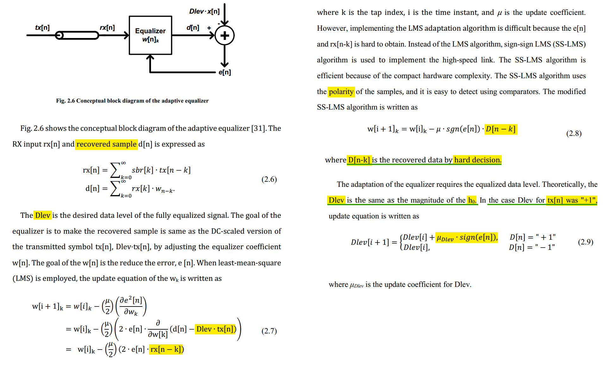

>  $e[n] = d[n] - Dlev_n\cdot tx[n]$
>
> 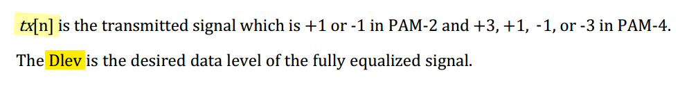


## Bang-Bang CDR

>  ***Alexander PD*** or ***!!PD***

By definition the **edge sample** will be **zero** at a **zero crossing**, given $a_na_{n+1}=-1$

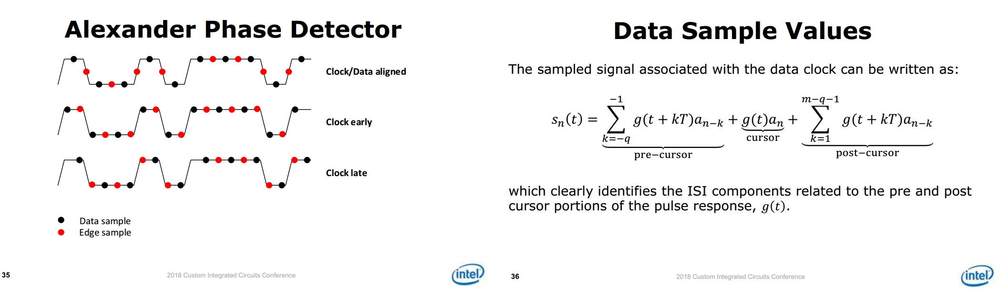

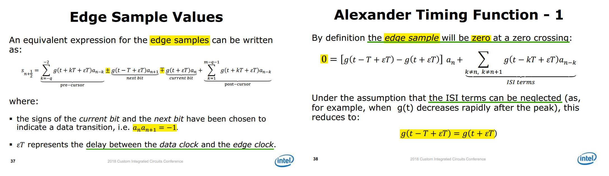

By *proper equalization* choice, the pulse response may *approximate even symmetry*

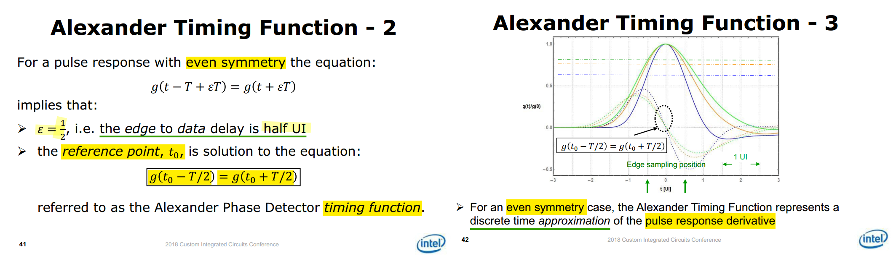
$$
f(t) = g(t+T/2) - g(t-T/2)
$$


```python
# https://share.google/aimode/l0gnYPTxlyUa7WUed

import numpy as np
import matplotlib.pyplot as plt

t = np.linspace(-1.5, 1.5, 1000)

# Pulse Response and its continuous derivative
p = np.exp(-4 * t ** 2)
p_prime = -8 * t * np.exp(-4 * t ** 2)

# Discrete Approximation (Finite Difference over T=1 UI)
T = 1
discrete_approx = (np.exp(-4 * (t + T / 2) ** 2) - np.exp(-4 * (t - T / 2) ** 2)) / T

# Alexander Bang-Bang Output
g_tau = np.sign(discrete_approx)

plt.figure(figsize=(10, 6))
plt.plot(t, p, label="Pulse Response", color='k', alpha=0.8)
plt.plot(t, p_prime, label="Continuous Derivative $P'(t)$", color='red', alpha=0.6)
plt.plot(t, discrete_approx, label="Discrete Finite Difference Approx", color='blue', ls='--')
plt.step(t, g_tau, where='mid', color='green', lw=1, label="Alexander PD Timing Function", alpha=0.6)
plt.axhline(0, color='black', lw=1)
plt.axvline(0, color='gray', ls=':', lw=1, label='Lock Point')
plt.title('Discrete Approximation of Pulse Derivative (Page 42)')
plt.xlabel('Phase Error (UI)')
plt.ylabel('Amplitude')
plt.legend()
plt.grid(True, alpha=0.3)
plt.show()
```

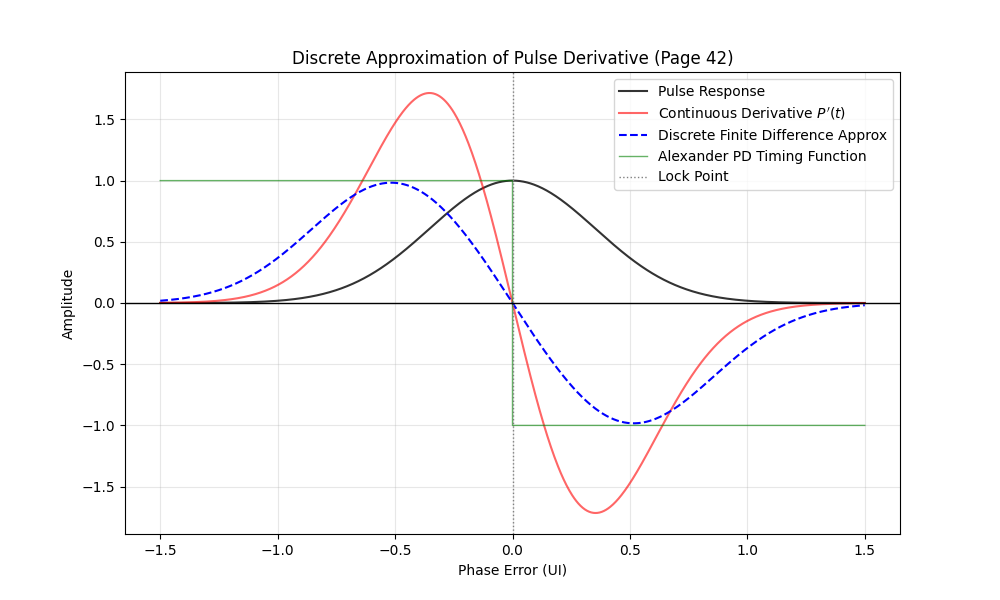

Alexander (Bang-Bang) PD **does not typically lock at the maximum pulse value** when the pulse is asymmetric. 

For an **asymmetric pulse** (like one with a slow trailing edge caused by ISI), this **lock point** shifts toward the slower-decaying side of the pulse.

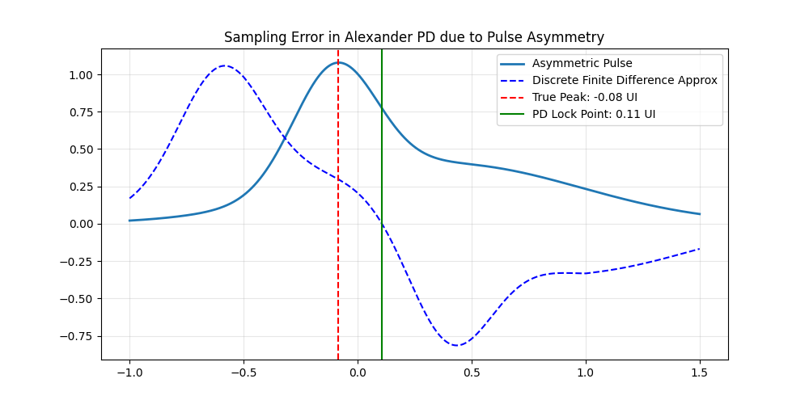

```python
# https://share.google/aimode/l0gnYPTxlyUa7WUed

import numpy as np
import matplotlib.pyplot as plt


t = np.linspace(-1, 1.5, 1000)
T = 1  # Sampling width

# Asymmetric Pulse: Fast rise, slow tail
p = 0.8 * np.exp(-15 * (t + 0.1) ** 2) + 0.4 * np.exp(-1.5 * (t - 0.4) ** 2)

# Calculate Slope Approximation (Alexander PD Function)
p_plus = np.interp(t + T / 2, t, p)
p_minus = np.interp(t - T / 2, t, p)
slope = (p_plus - p_minus) / T

# Find Critical Points
t_peak = t[np.argmax(p)]
t_lock = t[np.argmin(np.abs(slope))]

plt.figure(figsize=(10, 5))
plt.plot(t, p, label="Asymmetric Pulse", lw=2)
plt.plot(t, slope, label="Discrete Finite Difference Approx", color='blue', ls='--')
plt.axvline(t_peak, color='red', ls='--', label=f'True Peak: {t_peak:.2f} UI')
plt.axvline(t_lock, color='green', ls='-', label=f'PD Lock Point: {t_lock:.2f} UI')
plt.title("Sampling Error in Alexander PD due to Pulse Asymmetry")
plt.legend(); plt.grid(True, alpha=0.3)
plt.show()
```


---

> Kwangho Lee, "Design of Receiver with Offset Cancellation of Adaptive Equalizer and Multi-Level Baud-Rate Phase Detector" [[https://s-space.snu.ac.kr/bitstream/10371/177584/1/000000167211.pdf](https://s-space.snu.ac.kr/bitstream/10371/177584/1/000000167211.pdf)]
>
> Shahramian, Shayan, "Adaptive Decision Feedback Equalization With Continuous-time Infinite Impulse Response Filters" [[https://tspace.library.utoronto.ca/bitstream/1807/77861/3/Shahramian_Shayan_201606_PhD_thesis.pdf](https://tspace.library.utoronto.ca/bitstream/1807/77861/3/Shahramian_Shayan_201606_PhD_thesis.pdf)]
>
> MENIN, DAVIDE, "Modelling and Design of High-Speed Wireline Transceivers with Fully-Adaptive Equalization" [[https://air.uniud.it/retrieve/e27ce0ca-15f7-055e-e053-6605fe0a7873/Modelling%20and%20Design%20of%20High-Speed%20Wireline%20Transceivers%20with%20Fully-Adaptive%20Equalization.pdf](https://air.uniud.it/retrieve/e27ce0ca-15f7-055e-e053-6605fe0a7873/Modelling%20and%20Design%20of%20High-Speed%20Wireline%20Transceivers%20with%20Fully-Adaptive%20Equalization.pdf)]


## Mueller-Muller CDR

> Faisal A. Musa. "HIGH-SPEED BAUD-RATE CLOCK RECOVERY" [[https://www.eecg.utoronto.ca/~tcc/thesis-musa-final.pdf](https://www.eecg.utoronto.ca/~tcc/thesis-musa-final.pdf)]
>
> —."CLOCK RECOVERY IN HIGH-SPEED MULTILEVEL SERIAL LINKS" [[https://www.eecg.utoronto.ca/~tcc/faisal_iscas03.pdf](https://www.eecg.utoronto.ca/~tcc/faisal_iscas03.pdf)]
>
> K. Yadav, P. -H. Hsieh and A. C. Carusone, "Loop Dynamics Analysis of PAM-4 Mueller–Muller Clock and Data Recovery System," in *IEEE Open Journal of Circuits and Systems*, vol. 3, pp. 216-227, 2022 [[https://ieeexplore.ieee.org/stamp/stamp.jsp?arnumber=9910561](https://ieeexplore.ieee.org/stamp/stamp.jsp?arnumber=9910561)]
>
> Jaeduk Han, "Design and Automatic Generation of 60Gb/s Wireline Transceivers" [[https://www2.eecs.berkeley.edu/Pubs/TechRpts/2019/EECS-2019-143.pdf](https://www2.eecs.berkeley.edu/Pubs/TechRpts/2019/EECS-2019-143.pdf)]
>
> S. Kim, K. K. Tokgoz and G. Kim, "Modeling and Simulation of Mueller-Muller Clock Data Recovery System for PAM-4 Wireline Transceivers," *2025 IEEE/IEIE International Conference on Consumer Electronics-Asia (ICCE-Asia)*, Busan, Korea, Republic of, 2025, pp. 1-3, doi: 10.1109/ICCE-Asia67487.2025.11263607

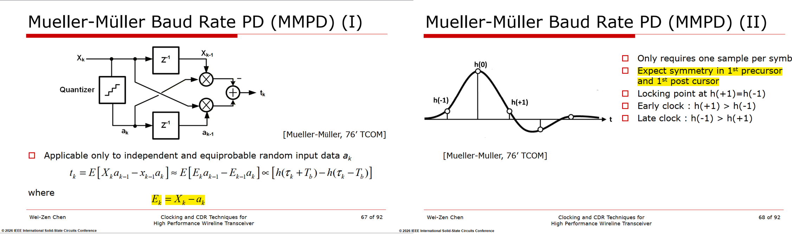

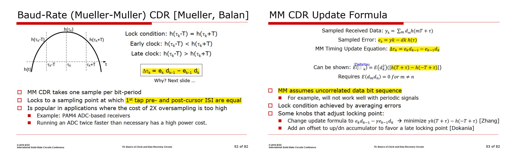

---

***Mueller-Muller type A timing function***

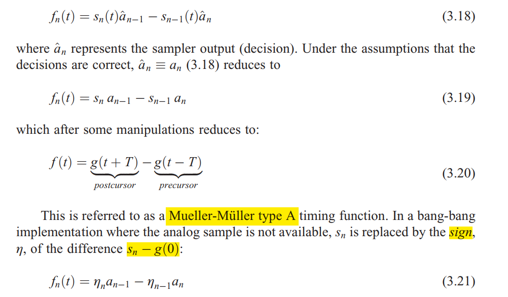

***Mueller-Muller type B timing function***

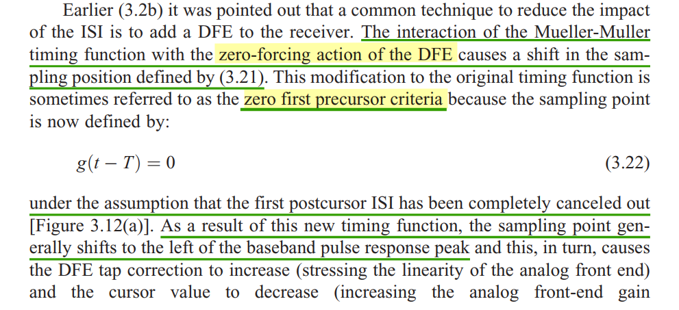 

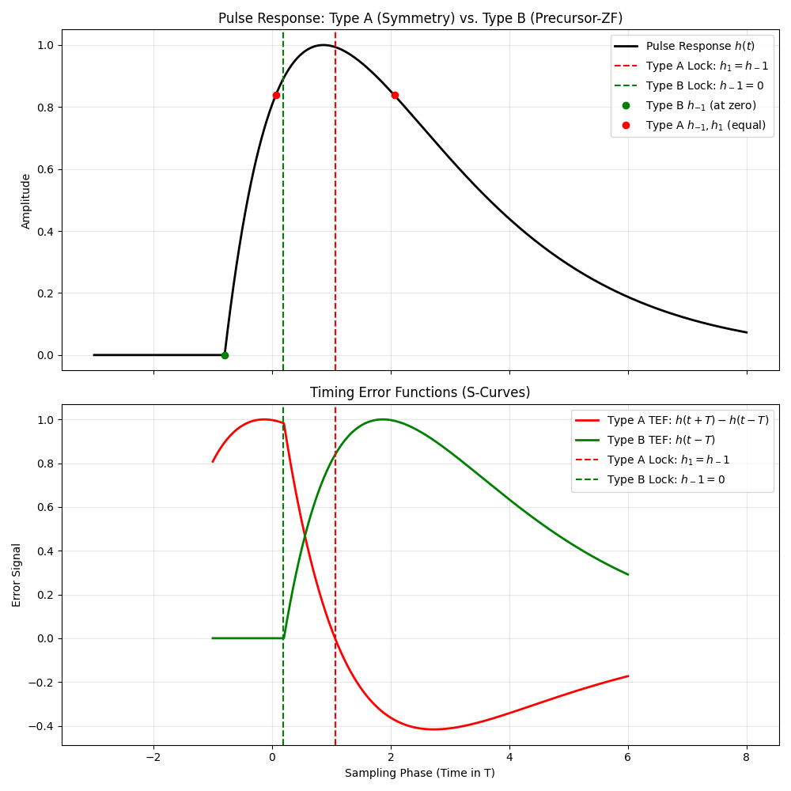

```python
# https://share.google/aimode/ajIRVJNOatjPnY2zp

import numpy as np
import matplotlib.pyplot as plt

# 1. Asymmetric Pulse Modeling
t_cont = np.linspace(-3, 8, 2000)
h_cont = np.where(t_cont >= -0.8, (t_cont + 0.8) * np.exp(-0.6 * (t_cont + 0.8)), 0)
h_cont /= np.max(h_cont)

def get_h(phase):
    return np.interp(phase, t_cont, h_cont)

# 2. Timing Error Calculations
phases = np.linspace(-0.5, 3.5, 1000)
tef_a = np.array([get_h(ts + 1) - get_h(ts - 1) for ts in phases])
tef_b = np.array([get_h(ts - 1) for ts in phases])

# 3. Robust Lock Logic
t_lock_a = phases[np.argmin(np.abs(tef_a))]

# Type B: Finding the LAST minimal error before h(-1) rises
indices_b = np.where(np.abs(tef_b) == np.min(np.abs(tef_b)))[0]
t_lock_b = phases[indices_b][-1]

# 4. Plotting Results
plt.figure(figsize=(10, 6))
plt.plot(t_cont, h_cont, 'k-', lw=2, label='Pulse Response $h(t)$')
plt.axvline(t_lock_a, color='red', linestyle='--', label=f'Type A Lock: {t_lock_a:.2f}T')
plt.axvline(t_lock_b, color='green', linestyle='--', label=f'Type B Lock: {t_lock_b:.2f}T')
plt.plot(t_lock_b - 1, get_h(t_lock_b - 1), 'go', label='Type B: $h_{-1}=0$')
plt.title('Baud Rate Lock: Type A (Symmetry) vs. Type B (Last-Zero Precursor)')
plt.legend()
plt.grid(True, alpha=0.3)
plt.show()
```

---

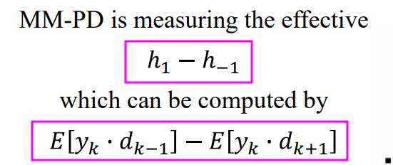

Suppose 1-precursor, 1-postcursor — $y_k = d_{k-1}h_1 + d_k h_0 + d_{k+1}h_{-1}$
$$
\color{red}E[y_k\cdot d_{k-1}] - E[y_k\cdot d_{k+1}] = E[|d_{k-1}|^2h_{1}] - E[|d_{k+1}|^2h_{-1}] =h_1-h_{-1}
$$
MMPD infers the channel response from baud-rate samples of the received data, the adaptation aligns the sampling clock such that pre-cursor is equal to the post-cursor in the *pulse response*

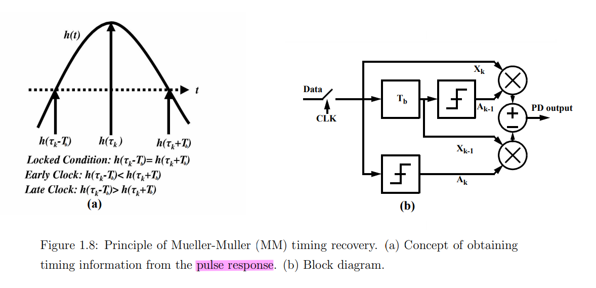

> note $E[y_k\cdot d_{k+1}] = E[y_{k-1}\cdot d_{k}] = h_{-1}$


### SS-MMPD

> F. Spagna *et al*., "A 78mW 11.8Gb/s serial link transceiver with adaptive RX equalization and baud-rate CDR in 32nm CMOS," *2010 IEEE International Solid-State Circuits Conference - (ISSCC)*, San Francisco, CA, USA, 2010, [[https://sci-hub.ru/10.1109/ISSCC.2010.5433823](https://sci-hub.ru/10.1109/ISSCC.2010.5433823)]
>
> Liu, Tao & Li, Tiejun & Lv, Fangxu & Liang, Bin & Zheng, Xuqiang & Wang, Heming & Wu, Miaomiao & Lu, Dechao & Zhao, Feng. (2021). Analysis and Modeling of Mueller-Muller Clock and Data Recovery Circuits. Electronics. [[10. 1888. 10.3390/electronics10161888.](https://www.mdpi.com/2079-9292/10/16/1888/pdf?version=1628492599)] 
>
> Gu, Youzhi & Feng, Xinjie & Chi, Runze & Chen, Yongzhen & Wu, Jiangfeng. (2022). Analysis of Mueller-Muller Clock and Data Recovery Circuits with a Linearized Model. [[10.21203/rs.3.rs-1817774/v1](https://www.researchgate.net/publication/362028333_Analysis_of_Mueller-Muller_Clock_and_Data_Recovery_Circuits_with_a_Linearized_Model)]
>


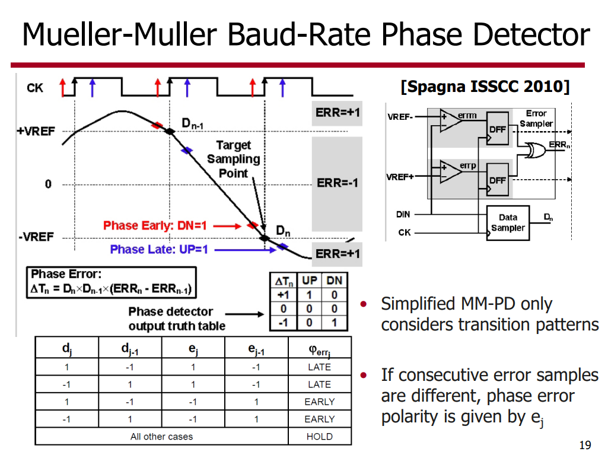

> 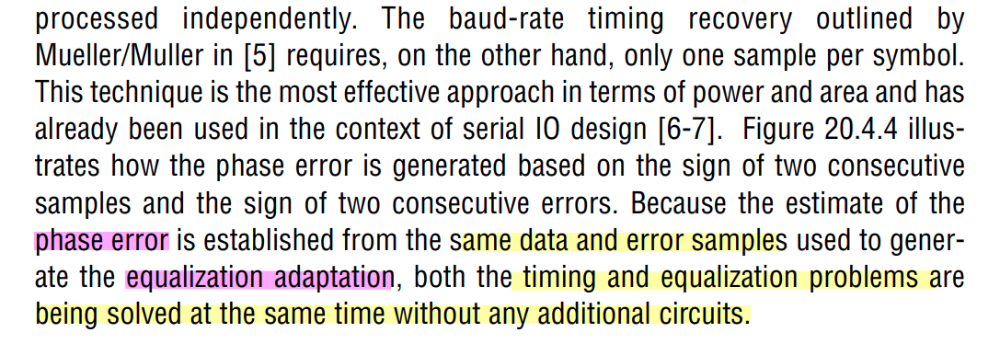


> [[https://people.engr.tamu.edu/spalermo/ecen689/lecture12_ee720_cdrs.pdf](https://people.engr.tamu.edu/spalermo/ecen689/lecture12_ee720_cdrs.pdf)]
>
> 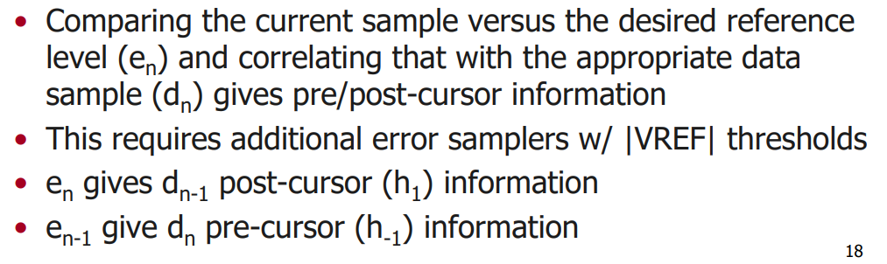


> 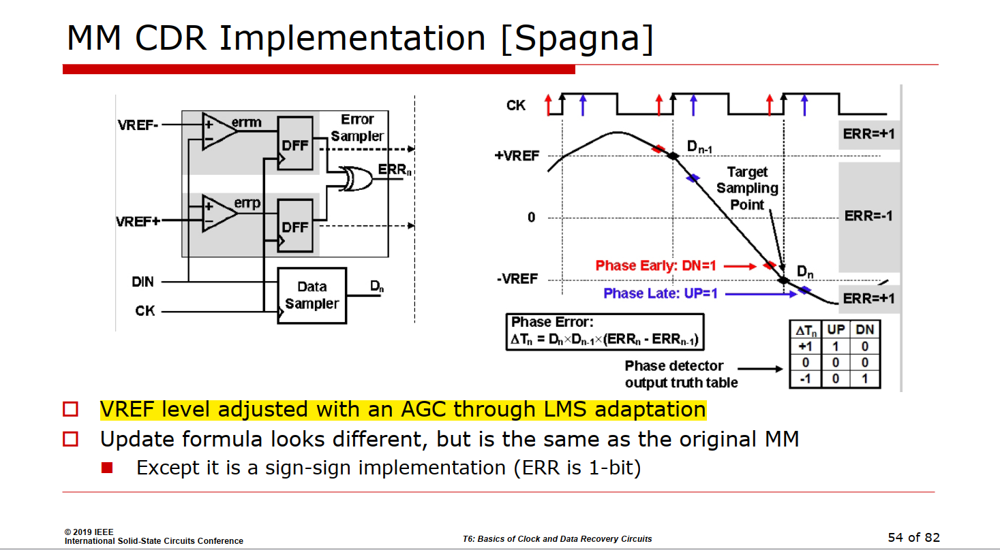
>
> 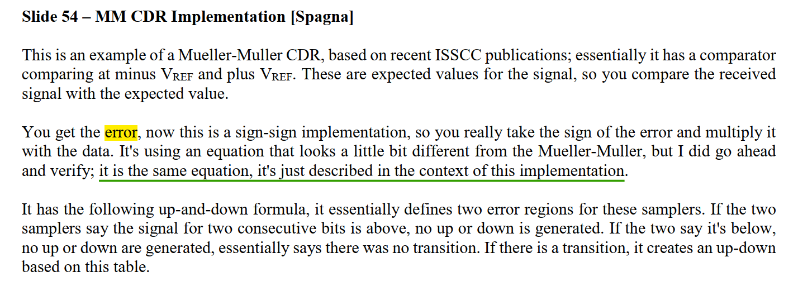

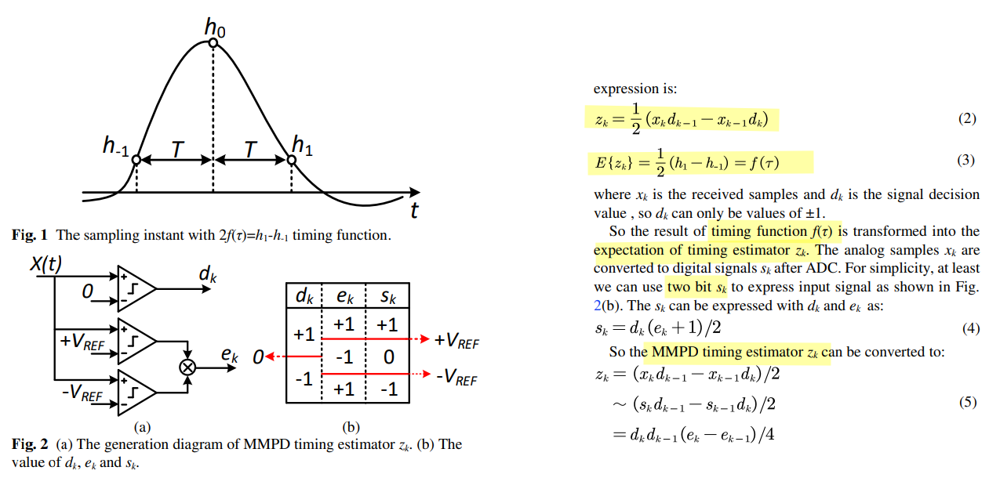

Suppose $x_k = d_{k-1}h_1 + d_k h_0 + d_{k+1}h_{-1}$ and $x_{k-1} = d_{k-2}h_1 + d_{k-1} h_0 + d_{k}h_{-1}$
$$
\color{red}E\{z_k\} = \frac{1}{2} E\{|d_{k-1}|^2h_1\} - \frac{1}{2} E\{|d_{k}|^2h_{-1}\} = \frac{1}{2}(h_1 - h_{-1})
$$


---

> 


### Adjust Locking Point

> Avago Technologies, US8649476B2 Adjusting sampling phase in a baud-rate CDR using timing skew [[pdf](https://patentimages.storage.googleapis.com/03/d4/ec/906e619ce1d719/US8649476.pdf)]
>
> Y. Jung, H. -J. Shin, J. Kim, S. Lee, J. -S. Park and K. Park, "A 28-Gb/s Receiver with Baud-Rate CDR Employing Integrated Pattern-Based Phase Detector Achieving ISI Invariant Phase Locking," *2025 IEEE Asian Solid-State Circuits Conference (A-SSCC)*, Daejeon, Korea, Republic of, 2025,
>
> R. Dokania *et al*., "10.5 A 5.9pJ/b 10Gb/s serial link with unequalized MM-CDR in 14nm tri-gate CMOS," *2015 IEEE International Solid-State Circuits Conference - (ISSCC) Digest of Technical Papers*, San Francisco, CA, USA, 2015 [[https://sci-hub.jp/10.1109/ISSCC.2015.7062987](https://sci-hub.jp/10.1109/ISSCC.2015.7062987)]
>
> H. Zhang, B. Jiao, Y. Liao, and G. Zhang, "A Tutorial on PAM4 Signaling for 56G Serial Link,"  [[DesignCon  2016](https://www.xilinx.com/publications/events/designcon/2016/slides-pam4signalingfor56gserial-zhang-designcon.pdf)], [[DesignCon  2017](https://www.oldfriend.url.tw/article/IEEE_paper/PAM4/SLIDES_10_PAM4_Signaling_for_56G_Serial_Zhang_1_.pdf)]

*TODO* &#128197;

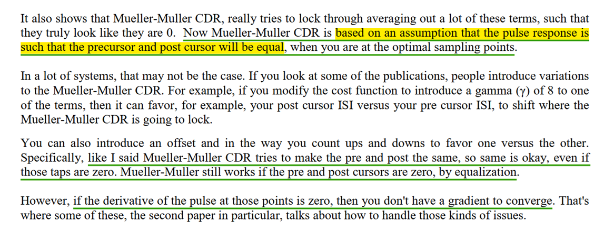

---

> Kwangho Lee, "Design of Receiver with Offset Cancellation of Adaptive Equalizer and Multi-Level Baud-Rate Phase Detector" [[https://s-space.snu.ac.kr/bitstream/10371/177584/1/000000167211.pdf](https://s-space.snu.ac.kr/bitstream/10371/177584/1/000000167211.pdf)]

$h_1$ is **necessary**

- without DFE

  SS-MMPD locks at the point ($h_1=h_{-1}$​)

- With a 1-tap DFE

  1-tap adaptive DFE that forces the $h_1$ to be *zero*, the SS-MMPD locks wherever the $h_{-1}$​ is zero and drifts eventually.

  Consequently, it suffers from a severe *multiple-locking problem with an adaptive DFE*

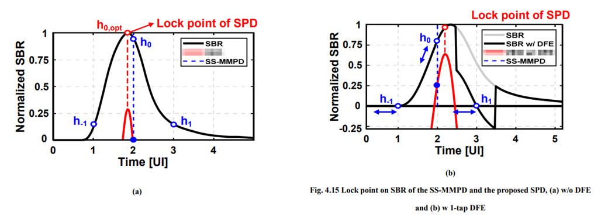

***Pattern filter***

| pattern | main cursor               |
| ------- | ------------------------- |
| 0**1**1 | $s_{011}=-h_1+h_0+h_{-1}$ |
| 1**1**0 | $s_{110}=h_1+h_0-h_{-1}$  |
| 1**0**0 | $s_{100}=h_1-h_0-h_{-1}$  |
| 0**0**1 | $s_{001}=-h_1-h_0+h_{-1}$ |

During adapting,  we make

- $s_{011}$ & $s_{110}$ are approaching to each other
- $s_{100}$ & $s_{001}$ are approaching to each other

Then, $h_{-1}$ and $h_1$ are same, which is desired

## MLSD (Maximum Likelihood Sequence Detection)

The process is also referred to as **Maximum Likelihood Sequence Estimator (MLSE)**

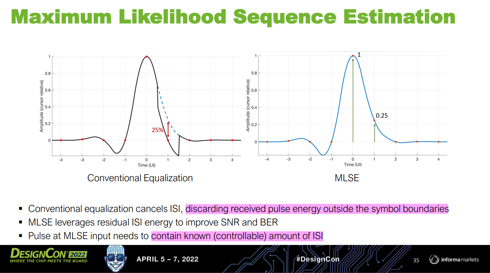

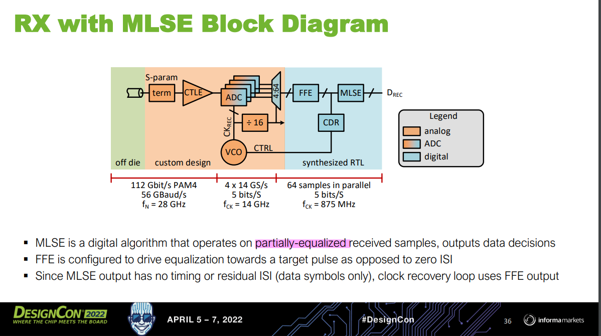

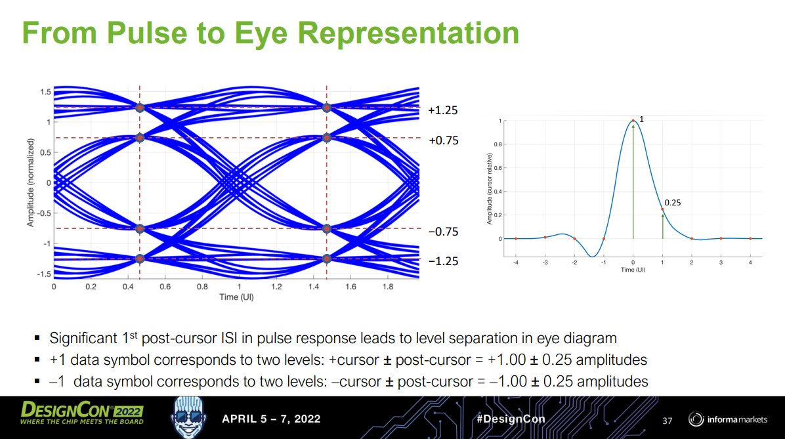

> [IBIS-AMI Modeling and Correlation Methodology for ADC-Based SerDes Beyond 100 Gb/s [https://static1.squarespace.com/static/5fb343ad64be791dab79a44f/t/63d807441bcd266de258b975/1675102025481/SLIDES_Track02_IBIS_AMI_Modeling_and_Correlation_Tyshchenko.pdf](https://static1.squarespace.com/static/5fb343ad64be791dab79a44f/t/63d807441bcd266de258b975/1675102025481/SLIDES_Track02_IBIS_AMI_Modeling_and_Correlation_Tyshchenko.pdf)]
>
> M. Emami Meybodi, H. Gomez, Y. -C. Lu, H. Shakiba and A. Sheikholeslami, "Design and Implementation of an On-Demand Maximum-Likelihood Sequence Estimation (MLSE)," in IEEE Open Journal of Circuits and Systems, vol. 3, pp. 97-108, 2022, doi: 10.1109/OJCAS.2022.3173686.
>
> Zaman, Arshad Kamruz (2019). A Maximum Likelihood Sequence Equalizing Architecture Using Viterbi Algorithm for ADC-Based Serial Link. Undergraduate Research Scholars Program. Available electronically from [[https://hdl.handle.net/1969.1/166485](https://hdl.handle.net/1969.1/166485)]


There are several variants of MLSD (Maximum Likelihood Sequence Detection), including:

- Viterbi Algorithm
- Decision Feedback Sequence Estimation (DFSE)
- Soft-Output MLSD


> [Evolution Of Equalization Techniques In High-Speed SerDes For Extended Reaches. [https://semiengineering.com/evolution-of-equalization-techniques-in-high-speed-serdes-for-extended-reaches/](https://semiengineering.com/evolution-of-equalization-techniques-in-high-speed-serdes-for-extended-reaches/)]
>
> S. Song, K. D. Choo, T. Chen, S. Jang, M. P. Flynn and Z. Zhang, "A Maximum-Likelihood Sequence Detection Powered ADC-Based Serial Link," in IEEE Transactions on Circuits and Systems I: Regular Papers, vol. 65, no. 7, pp. 2269-2278, July 2018
>
> [[http://contents.kocw.or.kr/document/lec/2012/Korea/KoYoungChai/33.pdf](http://contents.kocw.or.kr/document/lec/2012/Korea/KoYoungChai/33.pdf)]
>
> David Johns. Partial Response and Viterbi Detecti [[https://www.eecg.utoronto.ca/~johns/ece1392/slides/partial_response.pdf](https://www.eecg.utoronto.ca/~johns/ece1392/slides/partial_response.pdf)]


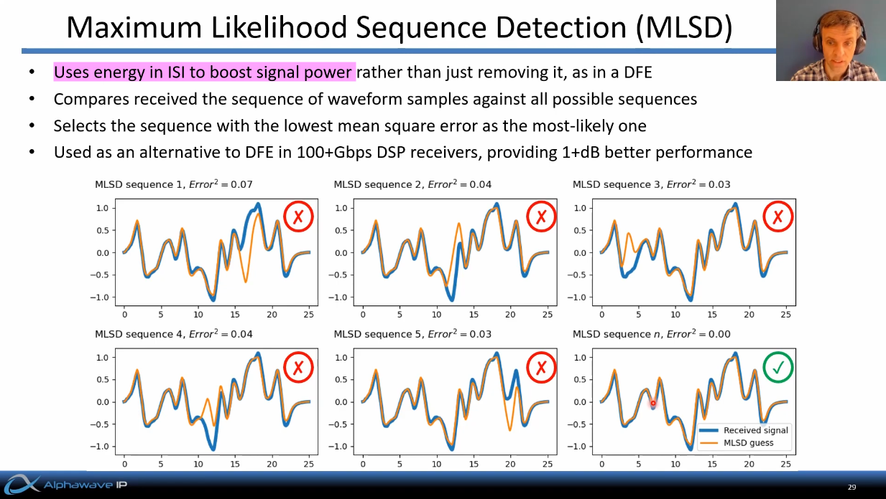

---

> Leslie Rusch. [[https://wcours.gel.ulaval.ca/GEL7114/assets/pdfs/Module4_en_1by1_1.pdf](https://wcours.gel.ulaval.ca/GEL7114/assets/pdfs/Module4_en_1by1_1.pdf)]


---

> Vineel Kumar Veludandi. Maximum likelihood sequence estimation (MLSE) using the Viterbi algorithm [[https://github.com/vineel49/mlse](https://github.com/vineel49/mlse)]


## reference

Hall, Stephen H., and Howard L. Heck. *Advanced Signal Integrity for High-speed Digital Designs*. Wiley : IEEE, 2009 [[pdf](https://picture.iczhiku.com/resource/eetop/wHIFhWWoIkGkuXXv.pdf)]

Oh, Kyung, and Xing Yuan. *High-Speed Signaling: Jitter Modeling, Analysis, and Budgeting*. 1st edition. Prentice Hall, 2011. [[pdf](https://picture.iczhiku.com/resource/eetop/SyiGPFydIQAYdxVx.pdf)]

John M. Cioffi, [[Chapter 3 - Equalization](https://cioffi-group.stanford.edu/doc/book/chap3.pdf)], [[Chapter 6 - Fundamentals of Synchronization](https://cioffi-group.stanford.edu/doc/book/chap6.pdf)]

---

David Johns. ECE1392H - Integrated Circuits for Digital Communications - Fall 2001: [[Equalization](https://www.eecg.utoronto.ca/~johns/ece1392/slides/equalization.pdf)], [[Timing Recovery](https://www.eecg.utoronto.ca/~johns/ece1392/slides/timing.pdf)]

B. Kim, "Tutorial: Basics of Equalization Techniques: Channels, Equalization, and Circuits," 2022 IEEE International Solid-State Circuits Conference (ISSCC), San Francisco, CA, USA, 2022 

Masum Hossain, ISSCC2023 T11: "Digital Equalization and Timing Recovery Techniques for ADC-DSP-based Highspeed Links" [[https://www.nishanchettri.com/isscc-slides/2023%20ISSCC/TUTORIALS/T11.pdf](https://www.nishanchettri.com/isscc-slides/2023%20ISSCC/TUTORIALS/T11.pdf)]

—, "LOW POWER DIGITAL EQUALIZATION FOR HIGH SPEED SERDES" [[https://www.ieeetoronto.ca/wp-content/uploads/2020/06/SSCS_invited_talk.pdf](https://www.ieeetoronto.ca/wp-content/uploads/2020/06/SSCS_invited_talk.pdf)]

Vivek Telang, 2012, Equalization for High-Speed Serdes: System-level Comparison of Analog and Digital Techniques [[https://ewh.ieee.org/r5/denver/sscs/Presentations/2012_08_Telang.pdf](https://ewh.ieee.org/r5/denver/sscs/Presentations/2012_08_Telang.pdf)]

Gain Kim, 2023. Equalization, Architecture, and Circuit Design for High-Speed Serial Link Receiver [[pdf](https://www.theise.org/wp-content/uploads/2023/10/Analog_1_%EA%B9%80%EA%B0%80%EC%9D%B8%EA%B5%90%EC%88%98%EB%8B%98_DGIST_LectureNote-Min-Jae-Seo.pdf)]

—, CICC2022 ES4: Equalization, Architecture, and Circuit Design for High-Speed Serial Link Receiver

S. Laxman, "Equalization algorithms in Millimeter wave communication systems," *2017 IEEE Custom Integrated Circuits Conference (CICC)*, Austin, TX, USA, 2017 [[pdf](https://picture.iczhiku.com/resource/eetop/shIHewZLfoEzkMVc.pdf)]

A. Amirkhany, "Basics of Clock and Data Recovery Circuits: Exploring High-Speed Serial Links," in *IEEE Solid-State Circuits Magazine*, vol. 12, no. 1, pp. 25-38, Winter 2020 [[https://sci-hub.jp/10.1109/MSSC.2019.2939342](https://sci-hub.jp/10.1109/MSSC.2019.2939342)]

—, ISSCC2019 T6: "Basics of Clock and Data Recovery Circuits"

Fulvio Spagna, CICC2018 Clock and Data Recovery Systems [[pdf](https://picture.iczhiku.com/resource/eetop/WhiTfzdJZSZyDcBM.pdf)]

Wei-Zen Chen, ISSCC2026. T9: Clocking and CDR Techniques for High-Performance Wireline Transceiver

---

A. A. Bazargani, H. Shakiba and D. A. Johns, "MMSE Equalizer Design Optimization for Wireline SerDes Applications," in *IEEE Transactions on Circuits and Systems I: Regular Papers* [[https://www.eecg.utoronto.ca/~johns/nobots/papers/pdf/2024_bazaragani.pdf](https://www.eecg.utoronto.ca/~johns/nobots/papers/pdf/2024_bazaragani.pdf)]

A. Sharif-Bakhtiar, A. Chan Carusone, "A Methodology for Accurate DFE Characterization," *IEEE RFIC Symposium*, Philadelphia, Pennsylvania, June 2018. [[PDF](http://www.eecg.utoronto.ca/~tcc/Sharif-Bakhtiar_RFIC18.pdf)] [[Slides – PDF](http://www.eecg.utoronto.ca/~tcc/Sharif-Bakhtiar_RFIC18_slides.pdf)]

Tony Chan Carusone. High Speed Communications Part 11 – SerDes DSP Interactions [[https://youtu.be/YIAwLskuVPc](https://youtu.be/YIAwLskuVPc)]

—, 2022 Optimization Tools for Future Wireline Transceivers [[https://www.ieeetoronto.ca/wp-content/uploads/2022/12/UofT-Future-of-Wireline-Workshop-2022.pdf](https://www.ieeetoronto.ca/wp-content/uploads/2022/12/UofT-Future-of-Wireline-Workshop-2022.pdf)]

Alphawave IP CEO. How DSP is Killing the Analog in SerDes [[https://youtu.be/OY2Dn4EDPiA](https://youtu.be/OY2Dn4EDPiA)]

---

S. Kiran, S. Cai, Y. Zhu, S. Hoyos and S. Palermo, "Digital Equalization With ADC-Based Receivers: Two Important Roles Played by Digital Signal Processingin Designing Analog-to-Digital-Converter-Based Wireline Communication Receivers," in *IEEE Microwave Magazine*, vol. 20, no. 5, pp. 62-79, May 2019 [[https://sci-hub.se/10.1109/MMM.2019.2898025](https://sci-hub.se/10.1109/MMM.2019.2898025)]

K. K. Parhi, "Design of multigigabit multiplexer-loop-based decision feedback equalizers," in *IEEE Transactions on Very Large Scale Integration (VLSI) Systems*, vol. 13, no. 4, pp. 489-493, April 2005 [[http://sci-hub.se/10.1109/TVLSI.2004.842935](http://sci-hub.se/10.1109/TVLSI.2004.842935)]

T. Toifl *et al*., "A 3.5pJ/bit 8-tap-feed-forward 8-tap-decision feedback digital equalizer for 16Gb/s I/Os," *ESSCIRC 2014 - 40th European Solid State Circuits Conference (ESSCIRC)*, Venice Lido, Italy, 2014 [[https://sci-hub.se/10.1109/ESSCIRC.2014.6942120](https://sci-hub.se/10.1109/ESSCIRC.2014.6942120)]

---

Daniel Friedman, 2018 Considerations and Implementations for High data Rate Serial Link Design [[https://www.ieeetoronto.ca/wp-content/uploads/2020/06/DL-Toronto-Nov-2018.pdf](https://www.ieeetoronto.ca/wp-content/uploads/2020/06/DL-Toronto-Nov-2018.pdf)]

Hongtao Zhang, DesignCon 2016. PAM4 Signaling for 56G Serial Link Applications − A Tutorial [[https://www.xilinx.com/publications/events/designcon/2016/slides-pam4signalingfor56gserial-zhang-designcon.pdf](https://www.xilinx.com/publications/events/designcon/2016/slides-pam4signalingfor56gserial-zhang-designcon.pdf)]

Cathy Ye Liu, Broadcom Inc. DesignCon 2019: 100+ Gb/s Ethernet Forward Error Correction (FEC) Analysis

—, Broadcom Inc. DesignCon 2024: 200+ Gbps Ethernet Forward Error Correction (FEC) Analysis

---

**Tony Chan Carusone** Integrated Systems Laboratory, University of Toronto [[https://isl.utoronto.ca/publications/](https://isl.utoronto.ca/publications/)]

Tony Chan Carusone 2022. Optimization Tools for Future Wireline Transceivers [[https://www.ieeetoronto.ca/wp-content/uploads/2022/12/UofT-Future-of-Wireline-Workshop-2022.pdf](https://www.ieeetoronto.ca/wp-content/uploads/2022/12/UofT-Future-of-Wireline-Workshop-2022.pdf)]

Aleksey Tyshchenko, SeriaLink Systems Clinton Walker, Alphawave IP. DesignCon 2022. IBIS-AMI Modeling and Correlation Methodology for ADC-Based SerDes Beyond 100 Gb/s [[https://static1.squarespace.com/static/5fb343ad64be791dab79a44f/t/63d807441bcd266de258b975/1675102025481/SLIDES_Track02_IBIS_AMI_Modeling_and_Correlation_Tyshchenko.pdf](https://static1.squarespace.com/static/5fb343ad64be791dab79a44f/t/63d807441bcd266de258b975/1675102025481/SLIDES_Track02_IBIS_AMI_Modeling_and_Correlation_Tyshchenko.pdf)]

[[https://ibis.org/summits/apr22/tyshchenko.pdf](https://ibis.org/summits/apr22/tyshchenko.pdf)]

[[https://www.mathworks.com/content/dam/mathworks/conference-or-academic-paper/ibis-ami-modeling-and-correlation.pdf](https://www.mathworks.com/content/dam/mathworks/conference-or-academic-paper/ibis-ami-modeling-and-correlation.pdf)]

---

**Ali Sheikholeslami** Electronics Group, University of Toronto [[https://www.eecg.utoronto.ca/~ali/](https://www.eecg.utoronto.ca/~ali/)]

