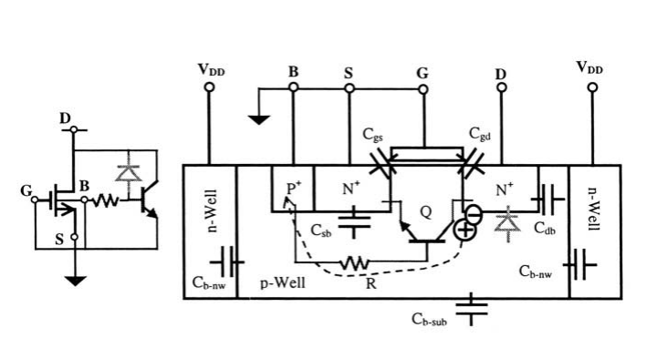
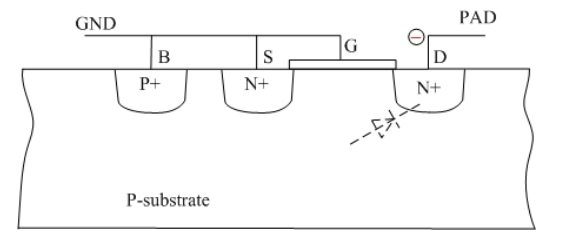

## HIA diode

> *HIA* = High Amp
>
> lateral diode:  **perimeter** is key DRC rule for ESD diode
>
> HIA diode process is same with regular junction diode

## STRAP

A "strap" refers to a low-impedance connection

NWDMY = NWDMY1, NWDMY2

STRAP = NWSTRAP or PWSTRAP

NWSTRAP = {NP & OD} & {NW not {NW INTERACT NWDMY}}

PWSTRAP = {PP & OD} not NW

| cell \ pin  | PLUS    | MINUS   |
| ----------- | ------- | ------- |
| **N diode** | PWSTRAP | \       |
| **P diode** | \       | NWSTRAP |

### Calibre Rule::NOT

### Calibre Rule::INTERACT

## Dual Stacked Diodes

> PS:  I/O to GND positively
>
> NS: I/O to GND negatively
>
> PD: I/O to VDD positively
>
> ND: I/O to VDD negatively

Dual diode should be used with **power clamp** for **PS** and **ND** path

### PMOS power clamp

## ggNMOS (grounded-gate NMOS)

> The drain (D) is connected to an I/O pad and the gate (G) is grounded.
>
> To ensure “zero” leakage of the ESD protection structure under normal operations.
>
> To to protect gate of core device, tie-high and tie-low shall be used when used as secondary ESD protecton.

### Positive ESD transient at I/O pad

1. **DB** junction is reverse-biased all the way to its breakdown.
2. Avalance multiplication takes place and generates electron-hole pairs
3. Hole current flows into the ground via the *B-region** and build up a potential, VR, across the lateral parasitic resistance R
4. As VR increases, the **BS** junction turns on, eventually triggers the parasitic lateral NPN transistor Q (**DBS**)

### Negative ESD transient at I/O pad

 The forward-biased parasitic diode, **BD**, will shunt the transient

> ggNMOS is commonly used in the GPIO provided by foundry, which alleviate the ESD design burden of customer.
>
> These GPIO is self-protective thanks to the ggNMOS.

## reference

Wang, Albert Z. H. 2002. On-chip ESD protection for integrated circuits: an IC design perspective. Boston, Mass: Kluwer Academic Publishers.

Wang, Anq i & Feng, H.G & Gong, K & Zhan, Ruqing & Stine, J. (2001). On-chip ESD protection design for integrated circuits: An overview for IC designers. Microelectronics Journal. 32. 733-747. 10.1016/S0026-2692(01)00060-X.

Feng, Haigang, Ke Gong, Rouying Zhan and Albert Z. Wang. “On-Chip ESD Protection Design for Ics.” (2001).

Introduction: ESD protection concepts for I/Os. URL: [https://monthly-pulse.com/2022/03/29/introduction-esd-protection-concepts-for-i-os/](https://monthly-pulse.com/2022/03/29/introduction-esd-protection-concepts-for-i-os/)

Answer: What does "strap" mean in this context? [https://electronics.stackexchange.com/a/591759?stw=2 ](https://electronics.stackexchange.com/a/591759?stw=2)

Hammer VLSI Flow URL: [https://fires.im/micro22-slides-pdf/04_hammer_vlsi.pdf](https://fires.im/micro22-slides-pdf/04_hammer_vlsi.pdf)

Calibre Rule Writing 2009

