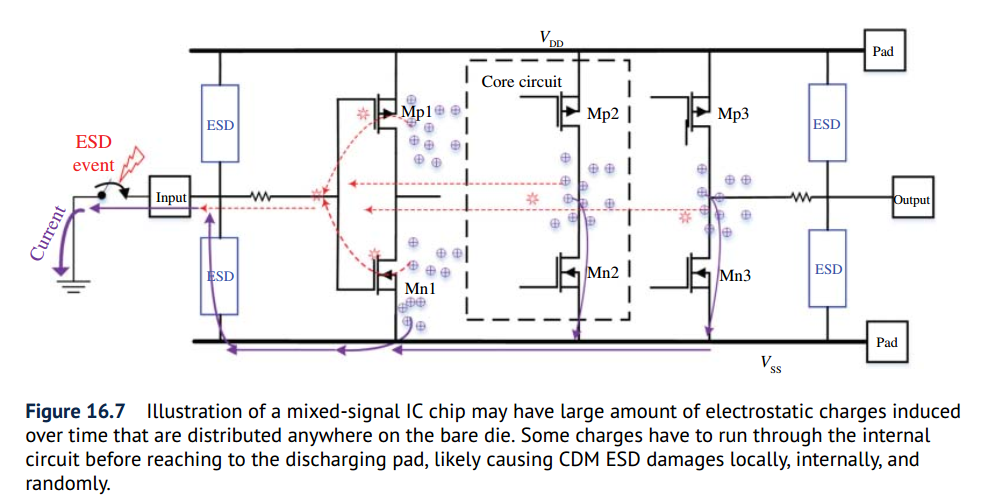
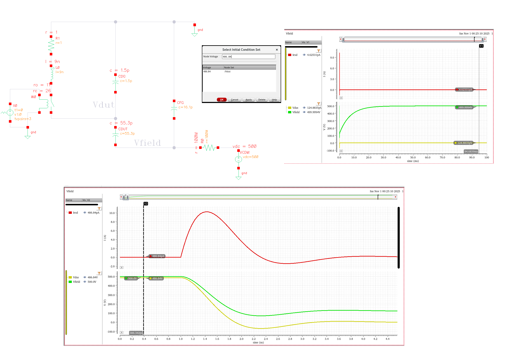
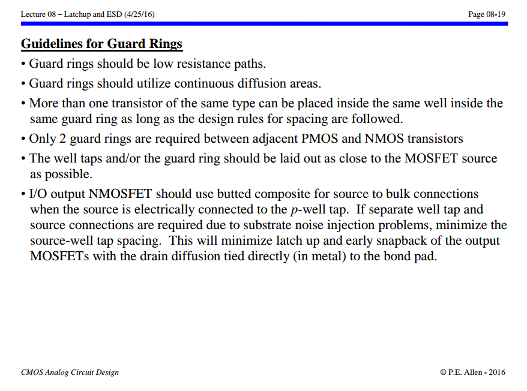
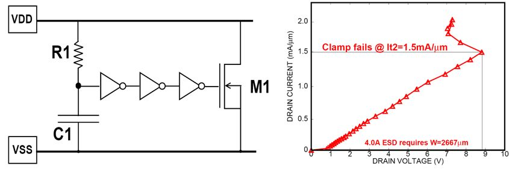

## CDM (Charged Device Model)

> Jordan Davis, Samsung Electronics. Full-Chip CDM Analysis: Is Static Simulation Enough? [[https://www.synopsys.com/content/dam/synopsys/implementation&signoff/electrical-layout-verification-documents/esd-workshop-2021-pres.pdf](https://www.synopsys.com/content/dam/synopsys/implementation&signoff/electrical-layout-verification-documents/esd-workshop-2021-pres.pdf)]
>
> M. Etherton *et al*., "A new full-chip verification methodology to prevent CDM oxide failures," *2015 37th Electrical Overstress/Electrostatic Discharge Symposium (EOS/ESD)*, Reno, NV, USA, 2015 [[pdf](https://www.synopsys.com/content/dam/synopsys/implementation&signoff/electrical-layout-verification-documents/cdm-esd-paper.pdf)]
>
> P.E. Allen 2021. Lesson 4 – ESD Input Circuit Protection [[https://aicdesign.org/wp-content/uploads/2021/05/Lesson04_ESD_Input_Ckt_Protection210323.pdf](https://aicdesign.org/wp-content/uploads/2021/05/Lesson04_ESD_Input_Ckt_Protection210323.pdf)]
>
> M. Di, H. Wang, F. Zhang, C. Li, Z. Pan and A. Wang, "Does CDM ESD Protection Really Work?," *2019 IEEE Workshop on Microelectronics and Electron Devices (WMED)*, Boise, ID, USA, 2019 [[https://sci-hub.se/10.1109/WMED.2019.8714145](https://sci-hub.se/10.1109/WMED.2019.8714145)]
>

### On-Chip Decoupling Capacitors

> Y. -C. Huang and M. -D. Ker, "Study on CDM ESD Robustness Among On-Chip Decoupling Capacitors in CMOS Integrated Circuits," in *IEEE Journal of the Electron Devices Society*, vol. 9, pp. 881-890, 2021 [[pdf]](https://sci-hub.se/10.1109/JEDS.2021.3116961)
>
> Y. -C. Huang and M. -D. Ker, "Investigation of CDM ESD Protection Capability Among Power-Rail ESD Clamp Circuits in CMOS ICs With Decoupling Capacitors," in *IEEE Journal of the Electron Devices Society*, vol. 11, pp. 84-94, 2023

> 

***NMOS capacitor with DNW*** owing to the ***parasitic junction that formed between P-substrate and the DNW*** to reduce the probability of ESD damage on the ***thin gate oxide*** layer of NMOS capacitor. 

Therefore, it results in higher CDM ESD robustness than that of the other two designs with decoupling capacitors realized by of ***varactor*** and ***NMOS capacitor***

### Circuit-Level CDM Model

> H. Wang, F. Zhang, C. Li, M. Di and A. Wang, "Chip-Level CDM Circuit Modeling and Simulation for ESD Protection Design in 28nm CMOS," *2018 14th IEEE International Conference on Solid-State and Integrated Circuit Technology (ICSICT)*, Qingdao, China, 2018
>
> —. (2018). A Chip-Level CDM ESD Protection Circuit Modeling and Simulation Method and Experimental Verification. *UC Riverside*  [[https://escholarship.org/content/qt1355v6vs/qt1355v6vs.pdf](https://escholarship.org/content/qt1355v6vs/qt1355v6vs.pdf)]

Today's cognition ondie **CDM charge is stored in the substrate**

---

The circuit model is divided into three parts: 

- IC package

- substrate resistance & capacitance

- protection devices & circuit elements

> all charges are considered be distributed to the ***surface*** of an IC die, i.e., ***Si substrate***
>
> The ***surface-stored charges*** are modeled using the capacitors at ***the surfaces of the IC substrate***
>
> 
>
> 

---

A Vulnerable Circuit Topology — cascode topology

> 

### Parasitic Capacitance Path

> Lin, Chun-Yu, Tang-Long Chang and Ming-Dou Ker. "Investigation on CDM ESD events at core circuits in a 65-nm CMOS process." *Microelectron. Reliab.* 52 (2012) [[pdf](https://sci-hub.se/10.1016/j.microrel.2012.04.021)]

CDM ESD issue due to the **coupled current** when I/O circuit is stressed by CDM ESD

***negative CDM ESD event***

> 

***positive CDM ESD event***

### CDM Failure Mechanisms

- ***reverse S/D junctions***
- ***capacitively coupled through the gate***

> 

For a bare Si die, the charges induced by whatever procedures, are stored inside the IC die randomly, unpredictably and anywhere, e.g., in the ***substrate***, ***along the metal rails*** or ***locally to transistors***

---

> M. Etherton *et al*., "A new full-chip verification methodology to prevent CDM oxide failures," *2015 37th Electrical Overstress/Electrostatic Discharge Symposium (EOS/ESD)*, Reno, NV, USA, 2015 [[https://www.synopsys.com/content/dam/synopsys/implementation&signoff/electrical-layout-verification-documents/cdm-esd-paper.pdf](https://www.synopsys.com/content/dam/synopsys/implementation&signoff/electrical-layout-verification-documents/cdm-esd-paper.pdf)]

Note that there is *no notable CDM current flow in the signal route*

---

> Yorgos Christoforou. Why negative polarity CDM ESD leads more often to failure [[https://ycindustrial.wordpress.com/2014/01/15/why-negative-polarity-cdm-esd-leads-more-often-to-to-failure/](https://ycindustrial.wordpress.com/2014/01/15/why-negative-polarity-cdm-esd-leads-more-often-to-to-failure/)]

*?? suppose that charged package and substrate are same electric potential* 

### Misconception in CDM ESD Protection

Two players will affect the internal CDM discharging routing:

- the amount of electrostatic charge stored inside the IC
- more importantly, their internal distribution within a chip

---

> Wang, Han, Feilong Zhang, Cheng Li, Mengfu Di and Albert Z. H. Wang. “Chip-Level CDM Circuit Modeling and Simulation for ESD Protection Design in 28nm CMOS.” *2018 14th IEEE International Conference on Solid-State and Integrated Circuit Technology (ICSICT)* (2018) [[pdf](https://escholarship.org/content/qt1355v6vs/qt1355v6vs.pdf)]

It is generally believed that the induced electrostatic charges are stored on the **package frame** and/or
on the **supply buses** in a lumped way

---

induced electrostatic charges are randomly distributed throughout a ***bare die*** of mixed-signal IC, anywhere and everywhere

### Field Induced CDM (FICDM)

> Field Induced CDM Explained [[https://certus-semi.com/field-induced-cdm-explained/](https://certus-semi.com/field-induced-cdm-explained/)]

Confusion about the test procedure is understandable because the actual process is opposite from what is expected

- field induction does not place any charge on the device

- the "discharge" when the pogo pin first touches the DUT is when the DUT is actually charged

> $C_{DF}$ is the capacitance of the DUT to the field plate
>
> $C_{DG}$ is the capacitance of the DUT to the ground plane
>
> $C_{FG}$ is the capacitance of the field plate to the ground plane
>
> $C_{DF}\gg C_{DG}$ — the separation of the DUT from the field plate is always much less than the separation of the DUT from the ground plane

Assuming ***no initial charge on the DUT***, with the switch S open the DC voltage between the DUT and the Field Plate is
$$
V_{DF} = \frac{C_{DG}}{C_{DG} + C_{DF}}\cdot V_{HV} \approx 0
$$

- ***DUT potential*** will therefore closely track the ***power supply voltage***
- The *potential of the DUT relative to the ground plane* can therefore be controlled *without actually putting any net charge on the DUT*

#### CDM Test Sequence

1. With the *field plate at zero volts* an *uncharged DUT* is placed on the field plate in the dead bug position and the ground plane is positioned with the pogo pin above the pin to be tested

2. The field plate is raised to a high potential, for example +500 V. *The **high value resistor** ensures that the field plate changes potential relatively slowly. The slow change in potential ensures that the DUT is not damaged before the CDM event*. 

   The potential of the DUT will closely track the field plate, reaching in excess of 450 V, although ***there will be no net charge on the DUT***

   > Capacitive coupling elevates the potential of the integrated circuit to a voltage close to that of the field plate

3. After the voltage has stabilized the separation between the field plate and the ground plane is reduced until an arc forms between the pogo pin and the DUT pin and eventually the two pins touch.

   *This is equivalent to closing the switch S in Figure 3*

4. ***Closing S in the circuit diagram produces a very rapid grounding of the DUT and a redistribution of charge between the three capacitors***

   ***At this point the DUT is charged*** and the potential between the field plate and the ground plane has fallen as the capacitor $C_{FG}$ provides charge to the DUT

   *During this redistribution of charge, which usually lasts under 2 ns, the high voltage power supply and the high value resistor can be ignored because of their slow response time*

5. After the initial redistribution of charge the field plate will slowly return to the voltage on the high voltage power supply, ***while the DUT remains at zero potential, but in a charged state***

6. With the pogo pin still touching the DUT pin the HV power supply voltage is set to zero. The field plate will slowly return to zero volts and the ***charge on the DUT will slowly bleed off through the pogo pin***.

####  single & dual discharge method

***single discharge procedure***:

*single* positive **or** *single* negative CDM ESD pulse is applied to DUT for *individual* CDM discharge 

> the single discharge procedure involves ***only one*** CDM discharge to stress the DUT device

---

***dual discharge procedure***:

*single* positive **and** *single* negative CDM ESD pulses are applied to produce *one pair* of alternating polarity CDM discharges to zap the DUT

#### Static Induction

> ESD Static Induction & Double Jeopardy Demonstration [[https://youtu.be/RGN-PvAE-OI](https://youtu.be/RGN-PvAE-OI)]

#### Electrostatic Equilibrium State

### CDM Tester Model Using Spice

> *Robert Ashton*. Simulating Small Device CDM Using Spice [[https://incompliancemag.com/simulating-small-device-cdm-using-spice/](https://incompliancemag.com/simulating-small-device-cdm-using-spice/)]

*TODO* &#128197;

The value of CFG is also based on a parallel plate capacitor model with a peripheral capacitance term **minus a capacitance representing a shielding of the Field Plate to ground plane capacitance due to the size of the device under test**

---

> Challenges of CDM Modeling for High-Speed Interface Devices [[https://incompliancemag.com/challenges-of-cdm-modeling-for-high-speed-interface-devices/](https://incompliancemag.com/challenges-of-cdm-modeling-for-high-speed-interface-devices/)]

***Problem Statement of a lumped capacitor CDUT***

***Distributed DUT model***

To assess the design solutions, a ***distributed DUT model***, as presented in Figure 3, can be plugged into the CDM tester model, replacing the *lumped DUT capacitor*

- The maximum voltage difference between Vdut and Vss (Vdd) should not exceed the breakdown voltage of the gates.
- ***On-die parasitics of Vss and Vdd nets*** strongly influence the actual voltage waveform at the *input gate oxide*. In particular, oscillations and spikes in the voltage waveform are sensed by the gate oxide and can lead to damage

> 

## Diode capacitance vs. Vpn

*TODO* &#128197;

## anti-parallel ESD diode

> M. Etherton *et al*., "A new full-chip verification methodology to prevent CDM oxide failures," *2015 37th Electrical Overstress/Electrostatic Discharge Symposium (EOS/ESD)*, Reno, NV, USA, 2015 [[https://www.synopsys.com/content/dam/synopsys/implementation&signoff/electrical-layout-verification-documents/cdm-esd-paper.pdf](https://www.synopsys.com/content/dam/synopsys/implementation&signoff/electrical-layout-verification-documents/cdm-esd-paper.pdf)]

## PERC

- CD: current density checks

- P2P: point to point resistance checks

- LDL: logic driven layout checks, latch up related

- TOPO: topology, circuit connection and device size checks

> database
>
> - CD, P2P, LDL : dfmdb
>
> - TOPO: svdb

> Frank Feng. New Approach For Full Chip Electrical Reliability Verification [[pdf](https://cse.nsysu.edu.tw/app/index.php?Action=downloadfile&file=WVhSMFlXTm9MelV3TDNCMFlWOHhOamN6TnpWZk5qYzFNVGd6TjE4NE5ESXlOQzV3WkdZPQ==&fname=1454FCFGGCPO45YTNOJCJGJGMKPKHC3534FG35YSA1GDXWFC34QOA0OOQOOKZWCDSSPOGDMP20NO4124YWB4B4LKYSMOQL0400YT34PKUWNK20FG00POUSXXYWXWOO15JCLKSWXWDCOKHG2050JCQKHCXTNPNOVSUSB4JCVW20HGJGTTWW40ZXIH5004A4GDMKJG5020OPMOJDLOML51NOFCSWROB454DGKKFCSTGCDCTXNPA4TWRKGDWW30CGKKDGB0YWLKIH05ML44WSFGQOTWOOECYWGHRKCCDD15A4XSFC14FCJGOO25WXROQLNK00JD31PKWSEC50A4SSOKHHTT)]
>
> Calibre PERC Catalog Test-Cases & Common Examples Version 2.0

## Latchup

> Latch-up in CMOS circuits: threat or opportunity (part 1)  [[https://monthly-pulse.com/2021/01/05/latch-up-in-cmos-circuits-threat-or-opportunity-part-1/](https://monthly-pulse.com/2021/01/05/latch-up-in-cmos-circuits-threat-or-opportunity-part-1/)]
>
> Latch-up in CMOS circuits: threat or opportunity (part 2) [[https://monthly-pulse.com/2021/01/05/latch-up-in-cmos-circuits-threat-or-opportunity-part-2/](https://monthly-pulse.com/2021/01/05/latch-up-in-cmos-circuits-threat-or-opportunity-part-2/)]

> This can happen when a ***parasitic thyristor***, which is essentially ***a pair of interconnected transistors***, is triggered into a latched state, leading to sustained current flow and potential device failure.

### Necessary Conditions

### Trigger Modes

### latchup-prevention technique

> Technical Paper Ensuring latch-up guard rings ESDA rules using Calibre PERC [[https://resources.sw.siemens.com/en-US/technical-paper-ensuring-latch-up-guard-rings-esda-rules-using-calibre-perc/ ](https://resources.sw.siemens.com/en-US/technical-paper-ensuring-latch-up-guard-rings-esda-rules-using-calibre-perc/ )]
>
> Protect against ESD by ensuring latch-up guard rings [[https://semiwiki.com/eda/362551-protect-against-esd-by-ensuring-latch-up-guard-rings/](https://semiwiki.com/eda/362551-protect-against-esd-by-ensuring-latch-up-guard-rings/)]

#### Guard Rings

One important technique is the use of ***guard rings***, the *heavily doped regions surrounding sensitive components* on the IC to *divert excess current away* from vulnerable areas, thereby reducing the likelihood of latch-up occurrence

These guard rings not only function as *barriers against parasitic <u>thyristor</u>  (SCR) formation* but also serve
to *isolate different regions* of the IC, minimizing unwanted electrical interactions and maintaining pathway integrity

> P.E. Allen - 2016. CMOS Analog Circuit Design: Lecture 08 – Latchup and ESD (4/25/16) [[https://aicdesign.org/wp-content/uploads/2018/08/lecture08-160425.pdf](https://aicdesign.org/wp-content/uploads/2018/08/lecture08-160425.pdf)]

---

> [[https://analoghub.ie/category/Layout/article/layoutDependentEffects#Latchup](https://analoghub.ie/category/Layout/article/layoutDependentEffects#Latchup)]

**Latch-Up triggers:**

- Power up
- Overshoot voltages and currents
- Substrate noise
- ESD occurrences

> **Latch-up key points:**
>
> - State of an IC when it is made inoperable by a parasitic shorting of VDD and VSS;
> - Triggering of a Low Impedance *High Current state* between supplies;
> - High Current State remains even when trigger signal is removed.

> **Latch-up prevention:**
>
> - Guard rings has a lot of contacts, providing a strong VDD/Ground potential;
> - Guard rings add more parallel resistance to the NWELL/Substrate, thereby reducing parasitic resistors;
> - NWELL/substrate potentials are held around VDD/Ground, no positive feedback is formed.

### Transient-Induced Latchup

*OD injector*

## Diode in ESD Protection

A diode can operate in both forward and reverse modes for ESD protection.

$R_{ON}$ for a *forward-biased diode* is ***lower*** than that for a *reverse-biased diode*

One major disadvantage of a forward diode-string for ESD protection is that the leakage current (Ileak) may be enlarged due to the Darlington effect in the diode-string

## Silicon Controlled Rectifiers (SCR)

A **thyristor** (also known as a <u>**S**ilicon Controlled **R**ectifier</u> or **SCR**) is a three-terminal semiconductor device used as an *electronic switch* or *rectifier*

To turn the thyristor on, a positive voltage pulse is applied to the gate (G) terminal. This voltage pulse needs to be of sufficient magnitude to trigger the device. When the gate is triggered, it allows a small current to flow into the base of the *P-N-P* transistor within the thyristor structure

> [[https://ec2-44-207-46-173.compute-1.amazonaws.com/thyristor/](https://ec2-44-207-46-173.compute-1.amazonaws.com/thyristor/)]

## ESD design window

> [[https://monthly-pulse.com/2021/06/02/the-esd-design-window-concept/](https://monthly-pulse.com/2021/06/02/the-esd-design-window-concept/)]
>
> [[https://www.researching.cn/ArticlePdf/m00098/2020/41/12/122403.pdf](https://www.researching.cn/ArticlePdf/m00098/2020/41/12/122403.pdf)]

- **Transparency**
  - Trigger voltage **Vt1**
  - Holding/clamping voltage **Vh**
- **Robustness**
  -  failure current level **It2**
- **Effectiveness**
  - maximum voltage of the clamp device: **Vmax**

---

> You Li. CICC2020: ESD Protection Design Overview in Advanced SOI and Bulk FinFET Technologies

---

> [[https://picture.iczhiku.com/weixin/message1640668908028.html](https://picture.iczhiku.com/weixin/message1640668908028.html)]

**ESD工作区**称为“**设计窗口**”

保护设备的触发电压(V t1)定义了它设计为导通的电平; 触发后的保持电压(V Hold)是指应高于施加电压的钳位电平。最后，I t2是指ESD故障电流水平。

如蓝色曲线(1A或1B)所示，NMOS晶体管在触发点V t1处进入双极击穿(npn)，并迅速恢复为称为V Hold的保持电压，并保护高达故障电流I ESD对应于ESD目标水平。(I t2，V t2)是指保护设备可能烧坏的散热点，因此该I t2必须大于I ESD目标电流水平(例如，目标1.5 kV HBM的电流为1 Amp)。如果保护设备的导通电阻(R on)太高，则V t2也可能达到可靠性电压极限。钳位电路必须有效触发，以使其电压累积不超过栅极氧化层击穿电压(BV ox)或晶体管击穿电压。晶体管的V Hold经过设计，使其具有一定的工作电压裕度，如曲线1A所示。相反，在具有V Hold的快速恢复装置小于工作电压(曲线1B)的情况下，存在EOS损坏的风险。

## Two-Stage ESD Protection

two-stage primary–secondary ESD protection

a primary ESD protection structure (ESD1), a secondary ESD protection unit (ESD2), and an isolation resistor ($R$)

> The desired specs for **ESD2** is **low $V_\text{t1}$** and **short $t_1$**, while that for **ESD1** include **low $R_{ON}$**, **low $V_\text{h}$** and **high $I_\text{t2}$**

- The primary ESD1 structure is typically optimized for high ESD protection level, which however may feature a high ESD $V_\text{t1}$, not suitable for low-voltage (LV) ICs

- The secondary ESD2 unit serves as a trigger-assisting device that features a lower ESD $V_\text{t1}$ and fast ESD triggering, which is typically weak in handling large ESD discharge currents

> The isolation $R$ has another role, which is to prevent an ESD pulse from getting into IC core (i.e., stressing the input device) directly, hence
avoid possible *CMOS gate breakdown*
>
> $R$ involves a design trade-off too: large enough for fast voltage build up, but not too large to avoid adverse impact on signal propagation

The two-stage ESD protection method is re-gaining attention for *CDM ESD* protection because it can **handle large ESD surges without overheating**, while preventing CMOS gate breakdown due to the isolation R (i.e., no direct zapping
on the input gate)

1. Adding a (small) clamp behind the isolation resistance can extend the ESD design window, e.g. enabling dual diode protection for thin oxide transistors.
2. ESD current through this clamp will build-up voltage across the isolation resistance, while protecting the circuit. 
3. The higher voltage at the IN pad will then trigger the primary protection (red current path)

---

Adding a (small) clamp behind the isolation resistance can extend the **ESD design window**, e.g. enabling dual diode protection for thin oxide transistors

Extended ESD design window example. The failure voltage of a thin gate oxide in advanced CMOS is about 4V. The primary ESD solution (red IV curve) introduces too much voltage. Thanks to an isolation resistance between primary and secondary local clamp device (green IV curve) additional margin is created.

> [[https://monthly-pulse.com/2022/03/29/introduction-esd-protection-concepts-for-i-os/](https://monthly-pulse.com/2022/03/29/introduction-esd-protection-concepts-for-i-os/)]

---

> Okushima, M. and Tsuruta, J., "Secondary ESD clamp circuit for CDM protection of over 6Gbit/s SerDes application in 40nm CMOS", <i>Microelectronics Reliability</i>, vol. 53, no. 2, pp. 215–220, 2013 [[https://sci-hub.se/https://doi.org/10.1016/j.microrel.2012.04.010](https://sci-hub.se/https://doi.org/10.1016/j.microrel.2012.04.010)]

## Gated diode & STI diode

"gated diode" aka. "poly bound" diode

STI bound diodes typically have ***lower** capacitance* 

> M. Simicic, G. Hellings, S. -H. Chen, N. Horiguchi and D. Linten, "ESD diodes with Si/SiGe superlattice I/O finFET architecture in a vertically stacked horizontal nanowire technology," 2018 48th European Solid-State Device Research Conference (ESSDERC), Dresden, Germany, 2018
>
> US9653448B2. Electrostatic Discharge (ESD) Diode in FinFET Technology

---

---

> ?? **Rotated STI Diode**

> Loke, Alvin & Yang, (2018). Analog/mixed-signal design challenges in 7-nm CMOS and beyond. 10.1109/CICC.2018.8357060. 
>
> Shih-Hung Chen. CICC 2019: Designing Diode Based ESD Protection in Advanced State of the Art Technologies

## TLP/vf-TLP

> TRANSMISSION LINE PULSE TESTING: THE INDISPENSABLE TOOL FOR ESD CHARACTERIZATION OF DEVICES, CIRCUITS AND SYSTEMS [[https://www.esda.org/assets/News/1708-ESD-firstDraft.pdf](https://www.esda.org/assets/News/1708-ESD-firstDraft.pdf)]
>
> [[https://monthly-pulse.com/2021/06/08/transmission-line-pulse-tlp-test-system/](https://monthly-pulse.com/2021/06/08/transmission-line-pulse-tlp-test-system/)]
>
> Jon Barth "TLP and VFTLP Testing of Integrated Circuit ESD Protection" [[https://barthelectronics.com/wp-content/uploads/2016/09/TLP-and-VFTLP-Test-of-Integrated-Circuit-ESD-Protection.pdf](https://barthelectronics.com/wp-content/uploads/2016/09/TLP-and-VFTLP-Test-of-Integrated-Circuit-ESD-Protection.pdf)]
>
> Horst A. Gieser(IZM), "ESD- Testing: HBM to very fast TLP" [[https://www.thierry-lequeu.fr/data/ESREF/2004/Tut5.pdf](https://www.thierry-lequeu.fr/data/ESREF/2004/Tut5.pdf)]

Vt1: trigger voltage

Vhold: holding voltage

soft failure current: Isoft

hard failure current: **It2**

### TLP vs ESD

- **ESD** tests simulate real world events (HBM, MM, CDM)
- **TLP** does not simulate any real-world event
- **ESD** tests record failure level (*Qualification*)
- **TLP** tests record failure level and device behavior (*Characterization*)

> TLP is not a qualification test, but a characterization method, which describes the resistance of a device for a given stimulus, aka. *Device Characterization*
>
> Unlike ESD waveforms, TLP does not mimic any real world event

### TLP  and Curve Tracing

- Curve Tracing is DC; TLP is a short pulse
  - Shorter pulse - Reduced duty cycle, less heating, which means higher voltage before failure
  - Controlled Impedance - Allows device behavior to be observed
- Both measure resistance of device with increasing voltage

### Device Characterization with TLP

- Turn-on time
- Snapback voltage
- Performance changes with rise time

### VF-TLP and CDM differences

Question:

How well will VF-TLP results predict CDM testing performance?

Answer:

VF-TLP can be a guide to CDM failure levels, and provide a lot of understanding of a circuit's operation during CDM stressing, but simple correlations between VF-TLP failure current level and CDM withstand voltage levels are difficult to establish.

### I.V and Leakage Evolution Plots

DC leakage current data combined with the I-V data provides electrical indications of where damage begins, and how rapidly it can evolve from soft to hard failures

> Henry, Leo & Barth, Jon & Richner, John & Verhaege, Koen. (2000). Transmission Line Pulse Testing of the ESD Protection Structures in ICs - A Failure Analyst's Perspective. 203-213. 10.31399/asm.cp.istfa2000p0203. [[https://barthelectronics.com/pdf_files/2000%20ISTFA%20TLP%20Testing%20of%20the%20ESD%20Protection%20Structure.pdf](https://barthelectronics.com/pdf_files/2000%20ISTFA%20TLP%20Testing%20of%20the%20ESD%20Protection%20Structure.pdf)]
>
> Henry, L.G. & Barth, Jon & Verhaege, K. & Richner, J.. (2001). Transmission-line pulse ESD testing of ICs: A new beginning. Compliance Engineering. 18. 46+53. [[https://barthelectronics.com/pdf_files/CE%20TLP%20Article%20March-April%202001.pdf](https://barthelectronics.com/pdf_files/CE%20TLP%20Article%20March-April%202001.pdf)]

## Snapback devices

> Lesson 2 - ESD Clamps [[https://aicdesign.org/wp-content/uploads/2021/05/Lesson02_ESD_Clamps210315.pdf](https://aicdesign.org/wp-content/uploads/2021/05/Lesson02_ESD_Clamps210315.pdf)]
>
> Introduction of Transmission Line Pulse (TLP) Testing for ESD Analysis - Device Level [[https://www.esdemc.com/public/docs/TechnicalSlides/ESDEMC_TS001.pdf](https://www.esdemc.com/public/docs/TechnicalSlides/ESDEMC_TS001.pdf)]

###  BJT

---

### Grounded-gate NMOS (ggNMOS)

> [[https://monthly-pulse.com/2022/02/02/time-to-say-farewell-to-the-snapback-ggnmos-for-esd-protection/](https://monthly-pulse.com/2022/02/02/time-to-say-farewell-to-the-snapback-ggnmos-for-esd-protection/)]
>
> [[https://monthly-pulse.com/2023/01/26/ggnmos-grounded-gated-nmos/](https://monthly-pulse.com/2023/01/26/ggnmos-grounded-gated-nmos/)]

**snapback ggNMOS** for ESD protection

Influence of the pulse rise time on ggNMOS. (left side) A fast ESD pulse can couple the bulk of the NMOS to a higher potential for a short period, reducing the trigger voltage. (right side) A clear Vt1 reduction is visible, while the remaining part of the IV curve remains the same.

---

---

> [[https://picture.iczhiku.com/weixin/message1588643699565.html](https://picture.iczhiku.com/weixin/message1588643699565.html)]

一般都是把Gate/Source/Bulk短接在一起，把Drain结在I/O端承受ESD的浪涌(surge)电压，NMOS称之为GGNMOS (Gate-Grounded NMOS)PMOS称之为GDPMOS (Gate-to-Drain PMOS)。以NMOS为例，原理都是Gate关闭状态，Source/Bulk的PN结本来是短接0偏的，当I/O端有大电压时，则Drain/Bulk PN结雪崩击穿，瞬间bulk有大电流与衬底电阻形成压差导致Bulk/Source的PN正偏，所以这个MOS的寄生横向NPN管进入放大区(发射结正偏,集电结反偏)，所以呈现特性，起到保护作用。PMOS同理推导。 

Trigger电压/Hold电压: Trigger电压当然就是之前将的的第一个拐点(Knee-point)，寄生BJT的击穿电压，而且要介于BVCEO与BVCBO之间。而Hold电压就是要维持持续ON，但是又不能进入栅锁(Latch-up)状态，否则就进入二次击穿(热击穿)而损坏了。还有个概念就是二次击穿电流，就是进入Latch-up之后I^2*R热量骤增导致硅融化了，而这个就是要限流，可以通过控制W/L，或者增加一个限流高阻， 最简单最常用的方法是拉大Drain的距离/拉大SAB的距离(ESD rule的普遍做法)。

> PN结的击穿分两种，分别是**电击穿**和**热击穿**，**电击穿**指的是**雪崩击穿, Avalanche Breakdown (低浓度)**和**齐纳击穿(高浓度)**，而这个电击穿主要是载流子碰撞电离产生新的电子-空穴对(electron-hole)，所以它是可**恢复**的。但是**热击穿**是**不可恢复**的，因为热量聚集导致硅(Si)被熔融烧毁了。所以我们需要控制在导通的瞬间控制电流，一般会在保护二极管再串联一个高电阻，

---

### Gate-coupled NMOS (gcNMOS) 

> Ming-Dou Ker, Chung-Yu Wu, Tao Cheng and Hun-Hsien Chang, "Capacitor-couple ESD protection circuit for deep-submicron low-voltage CMOS ASIC," in *IEEE Transactions on Very Large Scale Integration (VLSI) Systems*, vol. 4, no. 3, pp. 307-321, Sept. 1996 [[https://ir.lib.nycu.edu.tw/bitstream/11536/1053/1/A1996VE01800002.pdf](https://ir.lib.nycu.edu.tw/bitstream/11536/1053/1/A1996VE01800002.pdf)]

Gate-coupled NMOS (**gcNMOS**) was proposed to effectively ***reduce*** the $V_\text{t1}$

> [[https://bbs.eetop.cn/forum.php?mod=redirect&goto=findpost&ptid=353178&pid=7305079](https://bbs.eetop.cn/forum.php?mod=redirect&goto=findpost&ptid=353178&pid=7305079)]

---

---

### SCR (thyristor)

> Guang Chen, Haigang Feng and A. Wang, "A systematic study of ESD protection structures for RF ICs," *IEEE Radio Frequency Integrated Circuits (RFIC) Symposium, 2003*, Philadelphia, PA, USA, 2003 [[https://sci-hub.se/10.1109/RFIC.2003.1213959](https://sci-hub.se/10.1109/RFIC.2003.1213959)]

> [[https://www.sharecourse.net/sharecourse/upload/course/180/c574580760de44d2c6fb66d8be4c6d4a.pdf](https://www.sharecourse.net/sharecourse/upload/course/180/c574580760de44d2c6fb66d8be4c6d4a.pdf)]

---

## Safe operating area (SOA)

## power clamp

Thanks to the device scaling the area is actually reasonable. However, the leakage becomes the main bottleneck.

## high current diode (HIA)

both diode are reverse-biased in normal operation, the PN Junction capacitance is proportional to forward-bias voltage

---

| Device           |                           |
| ---------------- | ------------------------- |
| ndio_mac         | N+/P-well Diode           |
| pdio_mac         | P+/N-well Diode           |
| ndio_18_mac      | 1.8V N+/P-well Diode      |
| pdio_18_mac      | 1.8V P+/N-well Diode      |
| ndio_hia18_mac   | N-HIA Diode               |
| pdio_hia18_mac   | P-HIA Diode               |
| ndio_gated18_mac | Thick Oxide N-Gated Diode |
| pdio_gated18_mac | Thick Oxide P-Gated Diode |

> HIA_DIO can be used for logic or high speed circuits ESD protection
>
> HIA: high current application purpose (High Amp)
>
> There is no process difference between HIA_DIO and regular diode

| width (W)                    | 2.020E-07   |
| ---------------------------- | ----------- |
| **Length (L)**               | 1.922E-06   |
| **ArrayY (Ny)**              | 2           |
| **Perimeter (Ny\*2\*(W+L))** | 8.496E-06   |
| **Area (Ny\*W\*L)**          | 7.76488E-13 |

> - diode is drain/source originated, which is different from MOS (Gate originated) 
>
> - ~~The perimeter of diode in DRC is different from  that in PERC deck, where PERC excludes the the left and right edge of OD~~

*g* after the rule numbers: DFM recommendations and guidelines

U: the rule is not checked by the DRC

### I-V curve

### MOS

> `l` in netlist has different definition for MOS and diode.
>
> MOS: length of channel
>
> diode: Gate space

---

> *HIA* = High Amp
>
> lateral diode:  **perimeter** is key DRC rule for ESD diode
>
> HIA diode process is same with regular junction diode

## Dual Stacked Diodes

> PS:  I/O to GND positively
>
> NS: I/O to GND negatively
>
> PD: I/O to VDD positively
>
> ND: I/O to VDD negatively

Dual diode should be used with **power clamp** for **PS** and **ND** path

### PMOS power clamp

## EOS

> [[https://picture.iczhiku.com/weixin/message1640668908028.html](https://picture.iczhiku.com/weixin/message1640668908028.html)]

尽管通常ESD保护的设计并非旨在防止EOS事件，但根据特定的应用和操作，上述器件的ESD保护的IC 设计风格确实可以影响EOS损坏导致的故障率。环境。图2说明了两个不同的骤回设备，其中设备1与设备2的设计相比相对安全。设备2的EOS风险增加是由于V Hold参数低于最大允许VDD。

## CMOS集成电路闩锁效应 - 摘录

### CMOS闩锁效应的发展

闩锁效应是以体CMOS工艺为基础的集成电路特有的现象，无论是一般的常规体CMOS工艺集成电路，还是从CMOS工艺衍生出来的BiCMO、BCD和HV-CMOS等，都会发生闩锁效应。

- 降低寄生BJT的放大系数
- 降低衬底等效电阻

### 双极型晶体管

双极型晶体管的四种工作模式下集电结和发射结外加偏置电压

1）正向有源：双极型晶体管的发射结正偏和集电结反偏。工作在正向有源区的双极型晶体管具有电流放大功能，它的放大系数是$\beta$，$\beta$是集电极电流与基极电流的比，$\beta$是一个非常关键的参数，通常双极型晶体管设计和制造工艺参数的变动都是为了获得足够大的$\beta$。正向有源是一种常用的工作区

2）饱和：双极型晶体管的发射结和集电结都正偏，它相当于两个并联的二极管。

3）倒置：双极型晶体管发射结反偏和集电结正偏。与正向有源相比，它们的角色倒置了。工作在倒置区的双极型晶体管也具有电流放大功能，不过其放大系数会比正向有源小几倍。实际应用中也很少会把双极型晶体管偏置在倒置区。

4）截止：双极型晶体管的发射结和集电结都反偏，其漏电流非常微弱，就像开路的开关

根据双极型晶体管的电极被输入和输出共用的情况，可以把双极型晶体管分为三种电路连接方式

### 双极型晶体管的击穿电压

双极型晶体管两个PN结的***反向击穿电压***有以下三种：

第一种是发射极*开路*时的**BVCBO**； 第二种是集电极*开路*时的**BVEBO**； 第三种是基极*开路*时的**BVCEO**。

这三个击穿电压的关系如下：BVCBO＞BVCEO＞BVEBO

### NPN闩锁效应

在CMOS集成电路中，不仅寄生的PNPN结构会发生闩锁效应，单个NMOS自身寄生NPN也会发生闩锁效应

与PNPN类似，从寄生NPN I-V曲线可以看出，有两种方式可以使寄生NPN工作状态进入BC段的闩锁态：

- 第一种是出现瞬态激励电压大于等于Vt1，从而产生雪崩击穿电流，使寄生NPN进入闩锁态，这种方式称为电压触发；
- 第二种是出现瞬态激励电流，该电流大于等于B点对应的电流Ih，使寄生NPN进入闩锁态，这种方式称为电流触发。

## Reference

Wang, Albert. *Practical ESD Protection Design*. John Wiley & Sons, 2021.

温德通. CMOS集成电路闩锁效应. 机械工业出版社, 2020

*ANSI/ESDA/JEDEC JS-002-2022*: ESDA/JEDEC Joint Standard For Electrostatic Discharge Sensitivity Testing Charged Device Model (CDM) Device Level

*ESDA/JEDEC JTR002-01-22*: For the User Guide of ANSI/ESDA/JEDEC JS-002 Charged Device Model Testing of Integrated Circuits

*JESD22-C101E*: Field-Induced Charged-Device Model Test Method for Electrostatic Discharge-Withstand Thresholds of Microelectronic Components

---

M. Di, H. Wang, F. Zhang, C. Li, Z. Pan and A. Wang, "Does CDM ESD Protection Really Work?," *2019 IEEE Workshop on Microelectronics and Electron Devices (WMED)*, Boise, ID, USA, 2019 [[https://sci-hub.se/10.1109/WMED.2019.8714145](https://sci-hub.se/10.1109/WMED.2019.8714145)]

M. Di, C. Li, Z. Pan and A. Wang, "Pad-Based CDM ESD Protection Methods Are Faulty," in *IEEE Journal of the Electron Devices Society*, vol. 8, pp. 1297-1304, 2020 [[pdf](https://ieeexplore.ieee.org/stamp/stamp.jsp?tp=&arnumber=9187945)]

---

Introduction to Transmission Line Pulse (TLP), URL: [https://tools.thermofisher.com/content/sfs/brochures/TLP%20Presentation%20May%202009.pdf](https://tools.thermofisher.com/content/sfs/brochures/TLP%20Presentation%20May%202009.pdf)

VF-TLP and CDM differences, URL: [https://www.grundtech.com/app-note-vf-tlp-cdm-differences](https://www.grundtech.com/app-note-vf-tlp-cdm-differences)

ESD-Testing: HBM to very fast TLP URL: [https://www.thierry-lequeu.fr/data/ESREF/2004/Tut5.pdf](https://www.thierry-lequeu.fr/data/ESREF/2004/Tut5.pdf)

S. Kim et al., "Technology Scaling of ESD Devices in State of the Art FinFET Technologies," 2020 IEEE Custom Integrated Circuits Conference (CICC), 2020, pp. 1-6, doi: 10.1109/CICC48029.2020.9075899.

KOEN DECOCK IEEE-SSCSLEUVEN "ON-CHIP ESD PROTECTION: BASIC CONCEPTS AND ADVANCED APPLICATIONS" [[https://monthly-pulse.com/wp-content/uploads/2021/11/2021-11-sofics_presentation_ieee_final.pdf](https://monthly-pulse.com/wp-content/uploads/2021/11/2021-11-sofics_presentation_ieee_final.pdf)]

Yuanzhong Zhou, D. Connerney, R. Carroll and T. Luk, "Modeling MOS snapback for circuit-level ESD simulation using BSIM3 and VBIC models," Sixth international symposium on quality electronic design (isqed'05), 2005, pp. 476-481, doi: 10.1109/ISQED.2005.81.

Charged Device Model (CDM) Qualification Issues - Expanded [[https://www.jedec.org/sites/default/files/IndustryCouncil_CDM_October2021_JEDECversion_September2022_rev1.pdf](https://www.jedec.org/sites/default/files/IndustryCouncil_CDM_October2021_JEDECversion_September2022_rev1.pdf)]

---

Wang, Albert ZH. *On-chip ESD protection for integrated circuits: an IC design perspective*. Vol. 663. Springer Science & Business Media, 2002.

Ker, Ming-Dou, and Sheng-Fu Hsu. *Transient-induced latchup in CMOS integrated circuits*. John Wiley & Sons, 2009.  [[https://picture.iczhiku.com/resource/eetop/wyiGjQaHOgrYFcxB.pdf](https://picture.iczhiku.com/resource/eetop/wyiGjQaHOgrYFcxB.pdf)]

Milin Zhang, "Low Power Circuit Design Using Advanced CMOS Technology" River Publishers 2018

Barry Fernelius,  Evans Analytical Group. Latch-up Testing [[https://site.ieee.org/ocs-cpmt/files/2013/06/Latch-up_at_EAG_IEEE_September_2013.pdf](https://site.ieee.org/ocs-cpmt/files/2013/06/Latch-up_at_EAG_IEEE_September_2013.pdf)]

M. -D. Ker and Z. -H. Jiang, "Overview on Latch-Up Prevention in CMOS Integrated Circuits by Circuit Solutions," in *IEEE Journal of the Electron Devices Society*, vol. 11, pp. 141-152, 2023 [[https://ieeexplore.ieee.org/stamp/stamp.jsp?arnumber=9998049](https://ieeexplore.ieee.org/stamp/stamp.jsp?arnumber=9998049)]

---

Shih-Hung Chen. CICC 2019. ES2-4 "ESD Challenges in Advanced FinFET & GAA Nanowire CMOS technologies" 

Y. Li, M. Miao and R. Gauthier, "ESD Protection Design Overview in Advanced SOI and Bulk FinFET Technologies," *2020 IEEE Custom Integrated Circuits Conference (CICC)*, Boston, MA, USA, 2020

S. Kim *et al*., "Technology Scaling of ESD Devices in State of the Art FinFET Technologies," *2020 IEEE Custom Integrated Circuits Conference (CICC)*, Boston, MA, USA, 2020

