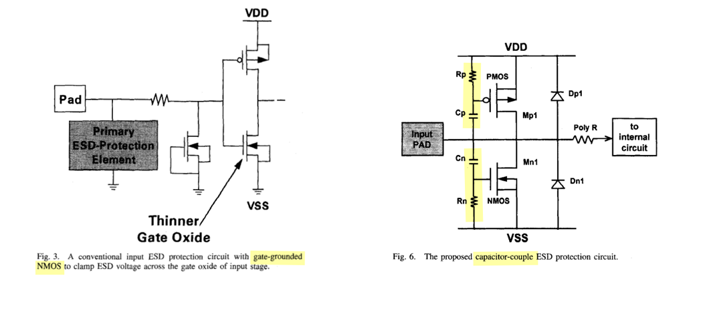

## PERC

- CD: current density checks

- P2P: point to point resistance checks

- LDL: logic driven layout checks, latch up related

- TOPO: topology, circuit connection and device size checks

> database
>
> - CD, P2P, LDL : dfmdb
>
> - TOPO: svdb

> Frank Feng. New Approach For Full Chip Electrical Reliability Verification [[pdf](https://cse.nsysu.edu.tw/app/index.php?Action=downloadfile&file=WVhSMFlXTm9MelV3TDNCMFlWOHhOamN6TnpWZk5qYzFNVGd6TjE4NE5ESXlOQzV3WkdZPQ==&fname=1454FCFGGCPO45YTNOJCJGJGMKPKHC3534FG35YSA1GDXWFC34QOA0OOQOOKZWCDSSPOGDMP20NO4124YWB4B4LKYSMOQL0400YT34PKUWNK20FG00POUSXXYWXWOO15JCLKSWXWDCOKHG2050JCQKHCXTNPNOVSUSB4JCVW20HGJGTTWW40ZXIH5004A4GDMKJG5020OPMOJDLOML51NOFCSWROB454DGKKFCSTGCDCTXNPA4TWRKGDWW30CGKKDGB0YWLKIH05ML44WSFGQOTWOOECYWGHRKCCDD15A4XSFC14FCJGOO25WXROQLNK00JD31PKWSEC50A4SSOKHHTT)]
>
> Calibre PERC Catalog Test-Cases & Common Examples Version 2.0

## Latchup

> Latch-up in CMOS circuits: threat or opportunity (part 1)  [[https://monthly-pulse.com/2021/01/05/latch-up-in-cmos-circuits-threat-or-opportunity-part-1/](https://monthly-pulse.com/2021/01/05/latch-up-in-cmos-circuits-threat-or-opportunity-part-1/)]
>
> Latch-up in CMOS circuits: threat or opportunity (part 2)  [[Latch-up in CMOS circuits: threat or opportunity (part 2)](Latch-up in CMOS circuits: threat or opportunity (part 2))]

> This can happen when a ***parasitic thyristor***, which is essentially ***a pair of interconnected transistors***, is triggered into a latched state, leading to sustained current flow and potential device failure.

### latchup-prevention technique

> Technical Paper Ensuring latch-up guard rings ESDA rules using Calibre PERC [[https://resources.sw.siemens.com/en-US/technical-paper-ensuring-latch-up-guard-rings-esda-rules-using-calibre-perc/ ](https://resources.sw.siemens.com/en-US/technical-paper-ensuring-latch-up-guard-rings-esda-rules-using-calibre-perc/ )]

#### Guard Rings

One important technique is the use of ***guard rings***, the *heavily doped regions surrounding sensitive components* on the IC to *divert excess current away* from vulnerable areas, thereby reducing the likelihood of latch-up occurrence

These guard rings not only function as *barriers against parasitic <u>thyristor</u>  (SCR) formation* but also serve
to *isolate different regions* of the IC, minimizing unwanted electrical interactions and maintaining pathway integrity

> P.E. Allen - 2016. CMOS Analog Circuit Design: Lecture 08 – Latchup and ESD (4/25/16) [[https://aicdesign.org/wp-content/uploads/2018/08/lecture08-160425.pdf](https://aicdesign.org/wp-content/uploads/2018/08/lecture08-160425.pdf)]

### Transient-Induced Latchup

*OD injector*

## Silicon Controlled Rectifiers (SCR)

A **thyristor** (also known as a <u>**S**ilicon Controlled **R**ectifier</u> or **SCR**) is a three-terminal semiconductor device used as an *electronic switch* or *rectifier*

To turn the thyristor on, a positive voltage pulse is applied to the gate (G) terminal. This voltage pulse needs to be of sufficient magnitude to trigger the device. When the gate is triggered, it allows a small current to flow into the base of the *P-N-P* transistor within the thyristor structure

> [[https://ec2-44-207-46-173.compute-1.amazonaws.com/thyristor/](https://ec2-44-207-46-173.compute-1.amazonaws.com/thyristor/)]

## ESD design window

> [[https://monthly-pulse.com/2021/06/02/the-esd-design-window-concept/](https://monthly-pulse.com/2021/06/02/the-esd-design-window-concept/)]
>
> [[https://www.researching.cn/ArticlePdf/m00098/2020/41/12/122403.pdf](https://www.researching.cn/ArticlePdf/m00098/2020/41/12/122403.pdf)]

- **Transparency**
  - Trigger voltage **Vt1**
  - Holding/clamping voltage **Vh**
- **Robustness**
  -  failure current level **It2**
- **Effectiveness**
  - maximum voltage of the clamp device: **Vmax**

---

> You Li. CICC2020: ESD Protection Design Overview in Advanced SOI and Bulk FinFET Technologies

---

> [[https://picture.iczhiku.com/weixin/message1640668908028.html](https://picture.iczhiku.com/weixin/message1640668908028.html)]

**ESD工作区**称为“**设计窗口**”

保护设备的触发电压(V t1)定义了它设计为导通的电平; 触发后的保持电压(V Hold)是指应高于施加电压的钳位电平。最后，I t2是指ESD故障电流水平。

如蓝色曲线(1A或1B)所示，NMOS晶体管在触发点V t1处进入双极击穿(npn)，并迅速恢复为称为V Hold的保持电压，并保护高达故障电流I ESD对应于ESD目标水平。(I t2，V t2)是指保护设备可能烧坏的散热点，因此该I t2必须大于I ESD目标电流水平(例如，目标1.5 kV HBM的电流为1 Amp)。如果保护设备的导通电阻(R on)太高，则V t2也可能达到可靠性电压极限。钳位电路必须有效触发，以使其电压累积不超过栅极氧化层击穿电压(BV ox)或晶体管击穿电压。晶体管的V Hold经过设计，使其具有一定的工作电压裕度，如曲线1A所示。相反，在具有V Hold的快速恢复装置小于工作电压(曲线1B)的情况下，存在EOS损坏的风险。

## Secondary protection

1. Adding a (small) clamp behind the isolation resistance can extend the ESD design window, e.g. enabling dual diode protection for thin oxide transistors.
2. ESD current through this clamp will build-up voltage across the isolation resistance, while protecting the circuit. 
3. The higher voltage at the IN pad will then trigger the primary protection (red current path)

---

Adding a (small) clamp behind the isolation resistance can extend the **ESD design window**, e.g. enabling dual diode protection for thin oxide transistors

Extended ESD design window example. The failure voltage of a thin gate oxide in advanced CMOS is about 4V. The primary ESD solution (red IV curve) introduces too much voltage. Thanks to an isolation resistance between primary and secondary local clamp device (green IV curve) additional margin is created.

> [[https://monthly-pulse.com/2022/03/29/introduction-esd-protection-concepts-for-i-os/](https://monthly-pulse.com/2022/03/29/introduction-esd-protection-concepts-for-i-os/)]

---

> Okushima, M. and Tsuruta, J., "Secondary ESD clamp circuit for CDM protection of over 6Gbit/s SerDes application in 40nm CMOS", <i>Microelectronics Reliability</i>, vol. 53, no. 2, pp. 215–220, 2013 [[https://sci-hub.se/https://doi.org/10.1016/j.microrel.2012.04.010](https://sci-hub.se/https://doi.org/10.1016/j.microrel.2012.04.010)]

## Gated diode & STI diode

"gated diode" aka. "poly bound" diode

STI bound diodes typically have ***lower** capacitance* 

> M. Simicic, G. Hellings, S. -H. Chen, N. Horiguchi and D. Linten, "ESD diodes with Si/SiGe superlattice I/O finFET architecture in a vertically stacked horizontal nanowire technology," 2018 48th European Solid-State Device Research Conference (ESSDERC), Dresden, Germany, 2018
>
> US9653448B2. Electrostatic Discharge (ESD) Diode in FinFET Technology

---

---

> ?? **Rotated STI Diode**

> Loke, Alvin & Yang, (2018). Analog/mixed-signal design challenges in 7-nm CMOS and beyond. 10.1109/CICC.2018.8357060. 
>
> Shih-Hung Chen. CICC 2019: Designing Diode Based ESD Protection in Advanced State of the Art Technologies

## TLP/vf-TLP

> TRANSMISSION LINE PULSE TESTING: THE INDISPENSABLE TOOL FOR ESD CHARACTERIZATION OF DEVICES, CIRCUITS AND SYSTEMS [[https://www.esda.org/assets/News/1708-ESD-firstDraft.pdf](https://www.esda.org/assets/News/1708-ESD-firstDraft.pdf)]
>
> [[https://monthly-pulse.com/2021/06/08/transmission-line-pulse-tlp-test-system/](https://monthly-pulse.com/2021/06/08/transmission-line-pulse-tlp-test-system/)]
>
> Jon Barth "TLP and VFTLP Testing of Integrated Circuit ESD Protection" [[https://barthelectronics.com/wp-content/uploads/2016/09/TLP-and-VFTLP-Test-of-Integrated-Circuit-ESD-Protection.pdf](https://barthelectronics.com/wp-content/uploads/2016/09/TLP-and-VFTLP-Test-of-Integrated-Circuit-ESD-Protection.pdf)]
>
> Horst A. Gieser(IZM), "ESD- Testing: HBM to very fast TLP" [[https://www.thierry-lequeu.fr/data/ESREF/2004/Tut5.pdf](https://www.thierry-lequeu.fr/data/ESREF/2004/Tut5.pdf)]

Vt1: trigger voltage

Vhold: holding voltage

soft failure current: Isoft

hard failure current: **It2**

### TLP vs ESD

- **ESD** tests simulate real world events (HBM, MM, CDM)
- **TLP** does not simulate any real-world event
- **ESD** tests record failure level (*Qualification*)
- **TLP** tests record failure level and device behavior (*Characterization*)

> TLP is not a qualification test, but a characterization method, which describes the resistance of a device for a given stimulus, aka. *Device Characterization*
>
> Unlike ESD waveforms, TLP does not mimic any real world event

### TLP  and Curve Tracing

- Curve Tracing is DC; TLP is a short pulse
  - Shorter pulse - Reduced duty cycle, less heating, which means higher voltage before failure
  - Controlled Impedance - Allows device behavior to be observed
- Both measure resistance of device with increasing voltage

### Device Characterization with TLP

- Turn-on time
- Snapback voltage
- Performance changes with rise time

### VF-TLP and CDM differences

Question:

How well will VF-TLP results predict CDM testing performance?

Answer:

VF-TLP can be a guide to CDM failure levels, and provide a lot of understanding of a circuit's operation during CDM stressing, but simple correlations between VF-TLP failure current level and CDM withstand voltage levels are difficult to establish.

### I.V and Leakage Evolution Plots

DC leakage current data combined with the I-V data provides electrical indications of where damage begins, and how rapidly it can evolve from soft to hard failures

> Henry, Leo & Barth, Jon & Richner, John & Verhaege, Koen. (2000). Transmission Line Pulse Testing of the ESD Protection Structures in ICs - A Failure Analyst's Perspective. 203-213. 10.31399/asm.cp.istfa2000p0203. [[https://barthelectronics.com/pdf_files/2000%20ISTFA%20TLP%20Testing%20of%20the%20ESD%20Protection%20Structure.pdf](https://barthelectronics.com/pdf_files/2000%20ISTFA%20TLP%20Testing%20of%20the%20ESD%20Protection%20Structure.pdf)]
>
> Henry, L.G. & Barth, Jon & Verhaege, K. & Richner, J.. (2001). Transmission-line pulse ESD testing of ICs: A new beginning. Compliance Engineering. 18. 46+53. [[https://barthelectronics.com/pdf_files/CE%20TLP%20Article%20March-April%202001.pdf](https://barthelectronics.com/pdf_files/CE%20TLP%20Article%20March-April%202001.pdf)]

## Snapback devices

> Lesson 2 - ESD Clamps [[https://aicdesign.org/wp-content/uploads/2021/05/Lesson02_ESD_Clamps210315.pdf](https://aicdesign.org/wp-content/uploads/2021/05/Lesson02_ESD_Clamps210315.pdf)]
>
> Introduction of Transmission Line Pulse (TLP) Testing for ESD Analysis - Device Level [[https://www.esdemc.com/public/docs/TechnicalSlides/ESDEMC_TS001.pdf](https://www.esdemc.com/public/docs/TechnicalSlides/ESDEMC_TS001.pdf)]

###  BJT

---

### GGNMOS

> [[https://monthly-pulse.com/2022/02/02/time-to-say-farewell-to-the-snapback-ggnmos-for-esd-protection/](https://monthly-pulse.com/2022/02/02/time-to-say-farewell-to-the-snapback-ggnmos-for-esd-protection/)]
>
> [[https://monthly-pulse.com/2023/01/26/ggnmos-grounded-gated-nmos/](https://monthly-pulse.com/2023/01/26/ggnmos-grounded-gated-nmos/)]

**snapback ggNMOS** for ESD protection

Influence of the pulse rise time on ggNMOS. (left side) A fast ESD pulse can couple the bulk of the NMOS to a higher potential for a short period, reducing the trigger voltage. (right side) A clear Vt1 reduction is visible, while the remaining part of the IV curve remains the same.

---

---

> [[https://picture.iczhiku.com/weixin/message1588643699565.html](https://picture.iczhiku.com/weixin/message1588643699565.html)]

一般都是把Gate/Source/Bulk短接在一起，把Drain结在I/O端承受ESD的浪涌(surge)电压，NMOS称之为GGNMOS (Gate-Grounded NMOS)PMOS称之为GDPMOS (Gate-to-Drain PMOS)。以NMOS为例，原理都是Gate关闭状态，Source/Bulk的PN结本来是短接0偏的，当I/O端有大电压时，则Drain/Bulk PN结雪崩击穿，瞬间bulk有大电流与衬底电阻形成压差导致Bulk/Source的PN正偏，所以这个MOS的寄生横向NPN管进入放大区(发射结正偏,集电结反偏)，所以呈现特性，起到保护作用。PMOS同理推导。 

Trigger电压/Hold电压: Trigger电压当然就是之前将的的第一个拐点(Knee-point)，寄生BJT的击穿电压，而且要介于BVCEO与BVCBO之间。而Hold电压就是要维持持续ON，但是又不能进入栅锁(Latch-up)状态，否则就进入二次击穿(热击穿)而损坏了。还有个概念就是二次击穿电流，就是进入Latch-up之后I^2*R热量骤增导致硅融化了，而这个就是要限流，可以通过控制W/L，或者增加一个限流高阻， 最简单最常用的方法是拉大Drain的距离/拉大SAB的距离(ESD rule的普遍做法)。

> PN结的击穿分两种，分别是**电击穿**和**热击穿**，**电击穿**指的是**雪崩击穿, Avalanche Breakdown (低浓度)**和**齐纳击穿(高浓度)**，而这个电击穿主要是载流子碰撞电离产生新的电子-空穴对(electron-hole)，所以它是可**恢复**的。但是**热击穿**是**不可恢复**的，因为热量聚集导致硅(Si)被熔融烧毁了。所以我们需要控制在导通的瞬间控制电流，一般会在保护二极管再串联一个高电阻，

### GCNMOS

> Ming-Dou Ker, Chung-Yu Wu, Tao Cheng and Hun-Hsien Chang, "Capacitor-couple ESD protection circuit for deep-submicron low-voltage CMOS ASIC," in *IEEE Transactions on Very Large Scale Integration (VLSI) Systems*, vol. 4, no. 3, pp. 307-321, Sept. 1996 [[https://ir.lib.nycu.edu.tw/bitstream/11536/1053/1/A1996VE01800002.pdf](https://ir.lib.nycu.edu.tw/bitstream/11536/1053/1/A1996VE01800002.pdf)]

> [[https://bbs.eetop.cn/forum.php?mod=redirect&goto=findpost&ptid=353178&pid=7305079](https://bbs.eetop.cn/forum.php?mod=redirect&goto=findpost&ptid=353178&pid=7305079)]

---

> resistance between gate and source that designers typically use to reduce the Vt1 trigger voltage of a ggNMOS ESD protection

### SCR (thyristor)

> Guang Chen, Haigang Feng and A. Wang, "A systematic study of ESD protection structures for RF ICs," *IEEE Radio Frequency Integrated Circuits (RFIC) Symposium, 2003*, Philadelphia, PA, USA, 2003 [[https://sci-hub.se/10.1109/RFIC.2003.1213959](https://sci-hub.se/10.1109/RFIC.2003.1213959)]

> [[https://www.sharecourse.net/sharecourse/upload/course/180/c574580760de44d2c6fb66d8be4c6d4a.pdf](https://www.sharecourse.net/sharecourse/upload/course/180/c574580760de44d2c6fb66d8be4c6d4a.pdf)]

## Safe operating area (SOA)

## power clamp

Thanks to the device scaling the area is actually reasonable. However, the leakage becomes the main bottleneck.

## high current diode

> both diode are reverse-biased in normal operation, the PN Junction capacitance is proportional to forward-bias voltage

| Device           |                           |
| ---------------- | ------------------------- |
| ndio_mac         | N+/P-well Diode           |
| pdio_mac         | P+/N-well Diode           |
| ndio_18_mac      | 1.8V N+/P-well Diode      |
| pdio_18_mac      | 1.8V P+/N-well Diode      |
| ndio_hia18_mac   | N-HIA Diode               |
| pdio_hia18_mac   | P-HIA Diode               |
| ndio_gated18_mac | Thick Oxide N-Gated Diode |
| pdio_gated18_mac | Thick Oxide P-Gated Diode |

> HIA_DIO can be used for logic or high speed circuits ESD protection
>
> HIA: high current application purpose (High Amp)
>
> There is no process difference between HIA_DIO and regular diode

| width (W)                    | 2.020E-07   |
| ---------------------------- | ----------- |
| **Length (L)**               | 1.922E-06   |
| **ArrayY (Ny)**              | 2           |
| **Perimeter (Ny\*2\*(W+L))** | 8.496E-06   |
| **Area (Ny\*W\*L)**          | 7.76488E-13 |

> - diode is drain/source originated, which is different from MOS (Gate originated) 
>
> - ~~The perimeter of diode in DRC is different from  that in PERC deck, where PERC excludes the the left and right edge of OD~~

*g* after the rule numbers: DFM recommendations and guidelines

U: the rule is not checked by the DRC

### I-V curve

### MOS

> `l` in netlist has different definition for MOS and diode.
>
> MOS: length of channel
>
> diode: Gate space

---

> *HIA* = High Amp
>
> lateral diode:  **perimeter** is key DRC rule for ESD diode
>
> HIA diode process is same with regular junction diode

## Dual Stacked Diodes

> PS:  I/O to GND positively
>
> NS: I/O to GND negatively
>
> PD: I/O to VDD positively
>
> ND: I/O to VDD negatively

Dual diode should be used with **power clamp** for **PS** and **ND** path

### PMOS power clamp

## EOS

> [[https://picture.iczhiku.com/weixin/message1640668908028.html](https://picture.iczhiku.com/weixin/message1640668908028.html)]

尽管通常ESD保护的设计并非旨在防止EOS事件，但根据特定的应用和操作，上述器件的ESD保护的IC 设计风格确实可以影响EOS损坏导致的故障率。环境。图2说明了两个不同的骤回设备，其中设备1与设备2的设计相比相对安全。设备2的EOS风险增加是由于V Hold参数低于最大允许VDD。

## Reference

Introduction to Transmission Line Pulse (TLP), URL: [https://tools.thermofisher.com/content/sfs/brochures/TLP%20Presentation%20May%202009.pdf](https://tools.thermofisher.com/content/sfs/brochures/TLP%20Presentation%20May%202009.pdf)

VF-TLP and CDM differences, URL: [https://www.grundtech.com/app-note-vf-tlp-cdm-differences](https://www.grundtech.com/app-note-vf-tlp-cdm-differences)

ESD-Testing: HBM to very fast TLP URL: [https://www.thierry-lequeu.fr/data/ESREF/2004/Tut5.pdf](https://www.thierry-lequeu.fr/data/ESREF/2004/Tut5.pdf)

S. Kim et al., "Technology Scaling of ESD Devices in State of the Art FinFET Technologies," 2020 IEEE Custom Integrated Circuits Conference (CICC), 2020, pp. 1-6, doi: 10.1109/CICC48029.2020.9075899.

KOEN DECOCK IEEE-SSCSLEUVEN "ON-CHIP ESD PROTECTION: BASIC CONCEPTS AND ADVANCED APPLICATIONS" [[https://monthly-pulse.com/wp-content/uploads/2021/11/2021-11-sofics_presentation_ieee_final.pdf](https://monthly-pulse.com/wp-content/uploads/2021/11/2021-11-sofics_presentation_ieee_final.pdf)]

Yuanzhong Zhou, D. Connerney, R. Carroll and T. Luk, "Modeling MOS snapback for circuit-level ESD simulation using BSIM3 and VBIC models," Sixth international symposium on quality electronic design (isqed'05), 2005, pp. 476-481, doi: 10.1109/ISQED.2005.81.

Charged Device Model (CDM) Qualification Issues - Expanded [[https://www.jedec.org/sites/default/files/IndustryCouncil_CDM_October2021_JEDECversion_September2022_rev1.pdf](https://www.jedec.org/sites/default/files/IndustryCouncil_CDM_October2021_JEDECversion_September2022_rev1.pdf)]

---

Wang, Albert ZH. *On-chip ESD protection for integrated circuits: an IC design perspective*. Vol. 663. Springer Science & Business Media, 2002.

Wang, Albert. *Practical ESD Protection Design*. John Wiley & Sons, 2021.

Ker, Ming-Dou, and Sheng-Fu Hsu. *Transient-induced latchup in CMOS integrated circuits*. John Wiley & Sons, 2009.  [[https://picture.iczhiku.com/resource/eetop/wyiGjQaHOgrYFcxB.pdf](https://picture.iczhiku.com/resource/eetop/wyiGjQaHOgrYFcxB.pdf)]

Milin Zhang, "Low Power Circuit Design Using Advanced CMOS Technology" River Publishers 2018

Barry Fernelius,  Evans Analytical Group. Latch-up Testing [[https://site.ieee.org/ocs-cpmt/files/2013/06/Latch-up_at_EAG_IEEE_September_2013.pdf](https://site.ieee.org/ocs-cpmt/files/2013/06/Latch-up_at_EAG_IEEE_September_2013.pdf)]

M. -D. Ker and Z. -H. Jiang, "Overview on Latch-Up Prevention in CMOS Integrated Circuits by Circuit Solutions," in *IEEE Journal of the Electron Devices Society*, vol. 11, pp. 141-152, 2023 [[https://ieeexplore.ieee.org/stamp/stamp.jsp?arnumber=9998049](https://ieeexplore.ieee.org/stamp/stamp.jsp?arnumber=9998049)]

---

Shih-Hung Chen. CICC 2019. ES2-4 "ESD Challenges in Advanced FinFET & GAA Nanowire CMOS technologies" 

Y. Li, M. Miao and R. Gauthier, "ESD Protection Design Overview in Advanced SOI and Bulk FinFET Technologies," *2020 IEEE Custom Integrated Circuits Conference (CICC)*, Boston, MA, USA, 2020

S. Kim *et al*., "Technology Scaling of ESD Devices in State of the Art FinFET Technologies," *2020 IEEE Custom Integrated Circuits Conference (CICC)*, Boston, MA, USA, 2020
