## TLP

> TRANSMISSION LINE PULSE TESTING: THE INDISPENSABLE TOOL FOR ESD CHARACTERIZATION OF DEVICES, CIRCUITS AND SYSTEMS [[https://www.esda.org/assets/News/1708-ESD-firstDraft.pdf](https://www.esda.org/assets/News/1708-ESD-firstDraft.pdf)]

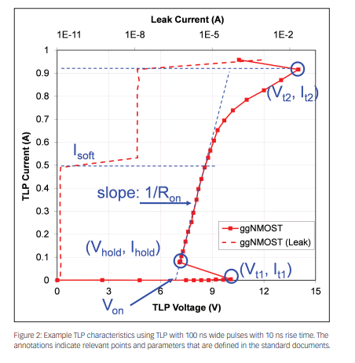

What makes **TLP** different than **ESD** ?

- **ESD** tests simulate real world events (HBM, MM, CDM)
- **TLP** does not simulate any real-world event
- **ESD** tests record failure level (*Qualification*)
- **TLP** tests record failure level and device behavior (*Characterization*)

> TLP is not a qualification test, but a characterization method, which describes the resistance of a device for a given stimulus, aka. *Device Characterization*
>
> Unlike ESD waveforms, TLP does not mimic any real world event

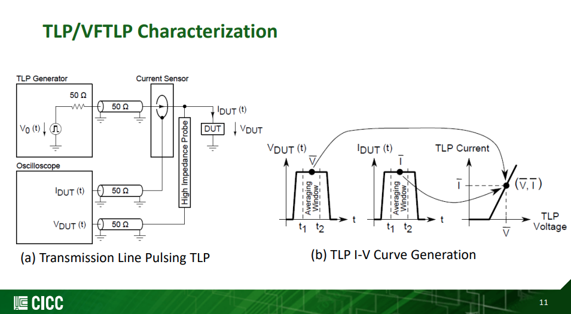

### TLP  and Curve Tracing

- Curve Tracing is DC; TLP is a short pulse
  - Shorter pulse - Reduced duty cycle, less heating, which means higher voltage before failure
  - Controlled Impedance - Allows device behavior to be observed
- Both measure resistance of device with increasing voltage

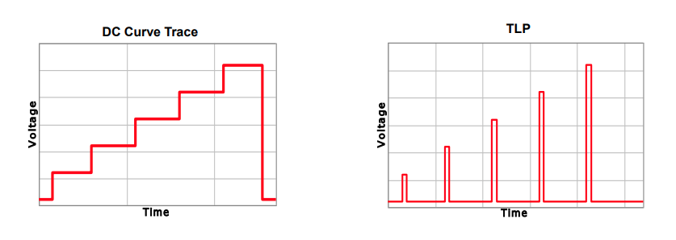

### Device Characterization with TLP

- Turn-on time
- Snapback voltage
- Performance changes with rise time

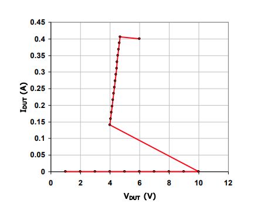

### VF-TLP and CDM differences

Question:

How well will VF-TLP results predict CDM testing performance?

Answer:

VF-TLP can be a guide to CDM failure levels, and provide a lot of understanding of a circuit's operation during CDM stressing, but simple correlations between VF-TLP failure current level and CDM withstand voltage levels are difficult to establish.

## I.V and Leakage Evolution Plots

DC leakage current data combined with the I-V data provides electrical indications of where damage begins, and how rapidly it can evolve from soft to hard failures

> Henry, Leo & Barth, Jon & Richner, John & Verhaege, Koen. (2000). Transmission Line Pulse Testing of the ESD Protection Structures in ICs - A Failure Analyst's Perspective. 203-213. 10.31399/asm.cp.istfa2000p0203. [[https://barthelectronics.com/pdf_files/2000%20ISTFA%20TLP%20Testing%20of%20the%20ESD%20Protection%20Structure.pdf](https://barthelectronics.com/pdf_files/2000%20ISTFA%20TLP%20Testing%20of%20the%20ESD%20Protection%20Structure.pdf)]
>
> Henry, L.G. & Barth, Jon & Verhaege, K. & Richner, J.. (2001). Transmission-line pulse ESD testing of ICs: A new beginning. Compliance Engineering. 18. 46+53. [[https://barthelectronics.com/pdf_files/CE%20TLP%20Article%20March-April%202001.pdf](https://barthelectronics.com/pdf_files/CE%20TLP%20Article%20March-April%202001.pdf)]

## snapback device

Unfortunately, this protection concept is not effective anymore in advanced FinFET technology.
Our analysis showed that both core and IO transistors are damaged at the onset of snapback in several FinFET processes.

> Introduction of Transmission Line Pulse (TLP) Testing for ESD Analysis - Device Level [[https://www.esdemc.com/public/docs/TechnicalSlides/ESDEMC_TS001.pdf](https://www.esdemc.com/public/docs/TechnicalSlides/ESDEMC_TS001.pdf)]

## power clamp
Thanks to the device scaling the area is actually reasonable. However, the leakage becomes the main bottleneck.
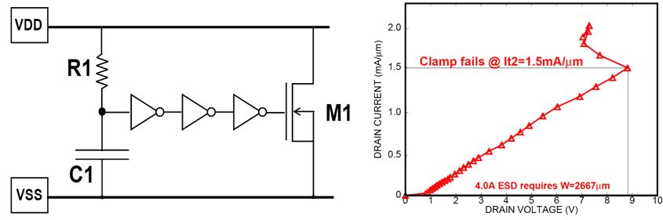

## ESD diode

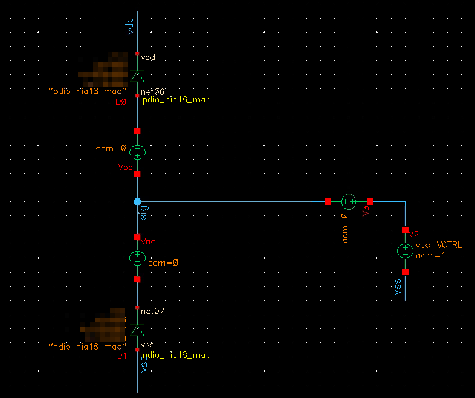

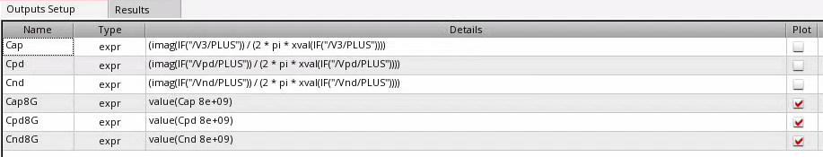

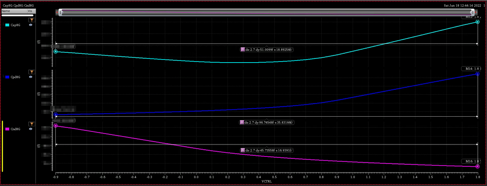

> both diode are reverse-biased in normal operation, the PN Junction capacitance is proportional to forward-bias voltage

| Device           |                           |
| ---------------- | ------------------------- |
| ndio_mac         | N+/P-well Diode           |
| pdio_mac         | P+/N-well Diode           |
| ndio_18_mac      | 1.8V N+/P-well Diode      |
| pdio_18_mac      | 1.8V P+/N-well Diode      |
| ndio_hia18_mac   | N-HIA Diode               |
| pdio_hia18_mac   | P-HIA Diode               |
| ndio_gated18_mac | Thick Oxide N-Gated Diode |
| pdio_gated18_mac | Thick Oxide P-Gated Diode |

> HIA_DIO can be used for logic or high speed circuits ESD protection
>
> HIA: high current application purpose (High Amp)
>
> There is no process difference between HIA_DIO and regular diode

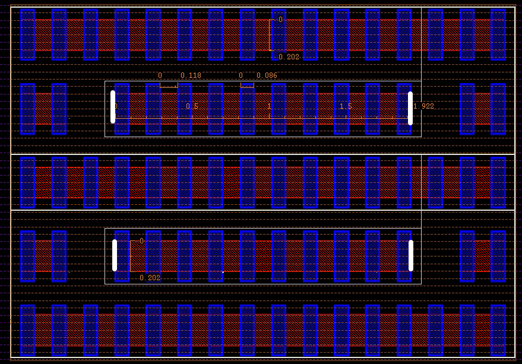

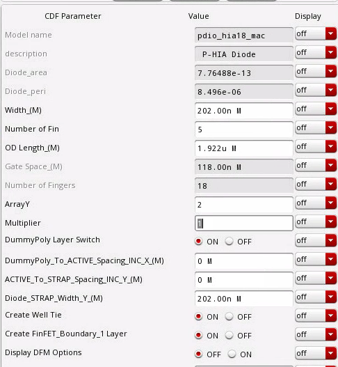

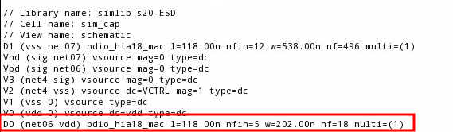

| width (W)                    | 2.020E-07   |
| ---------------------------- | ----------- |
| **Length (L)**               | 1.922E-06   |
| **ArrayY (Ny)**              | 2           |
| **Perimeter (Ny\*2\*(W+L))** | 8.496E-06   |
| **Area (Ny\*W\*L)**          | 7.76488E-13 |

> - diode is drain/source originated, which is different from MOS (Gate originated) 
>
> - ~~The perimeter of diode in DRC is different from  that in PERC deck, where PERC excludes the the left and right edge of OD~~

*g* after the rule numbers: DFM recommendations and guidelines

U: the rule is not checked by the DRC

### MOS

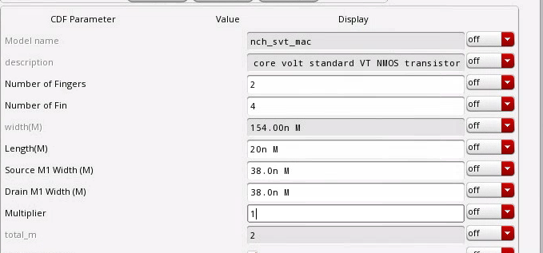

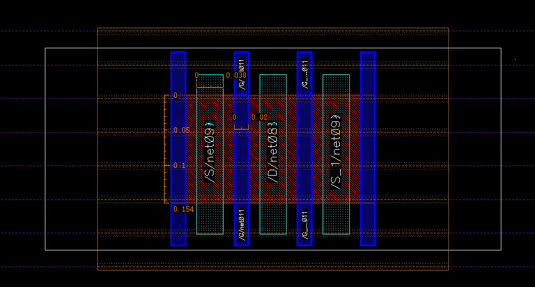

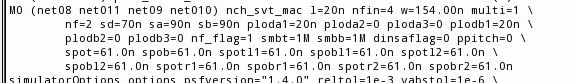

> `l` in netlist has different definition for MOS and diode.
>
> MOS: length of channel
>
> diode: Gate space

---

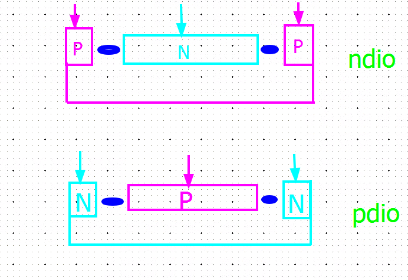

> *HIA* = High Amp
>
> lateral diode:  **perimeter** is key DRC rule for ESD diode
>
> HIA diode process is same with regular junction diode

## Dual Stacked Diodes

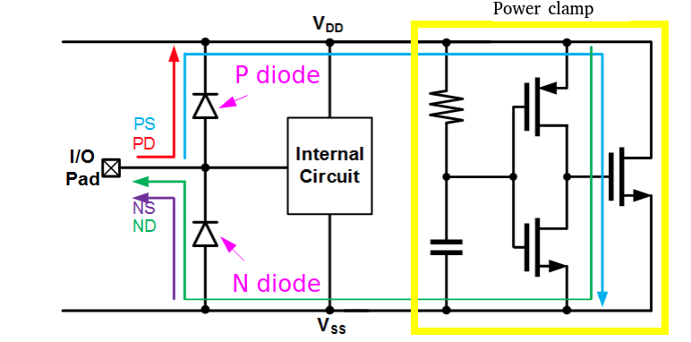

> PS:  I/O to GND positively
>
> NS: I/O to GND negatively
>
> PD: I/O to VDD positively
>
> ND: I/O to VDD negatively

Dual diode should be used with **power clamp** for **PS** and **ND** path

### PMOS power clamp

## ggNMOS (grounded-gate NMOS)

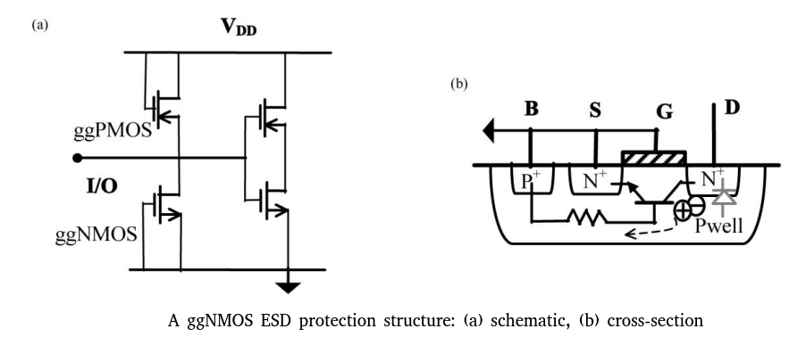

> The drain (D) is connected to an I/O pad and the gate (G) is grounded.
>
> To ensure “zero” leakage of the ESD protection structure under normal operations.
>
> To to protect gate of core device, tie-high and tie-low shall be used when used as secondary ESD protection.

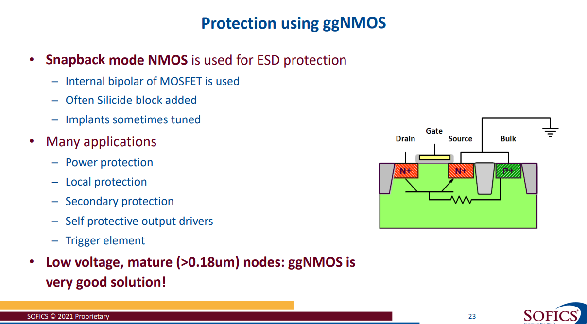

> [[https://monthly-pulse.com/wp-content/uploads/2021/11/2021-11-sofics_presentation_ieee_final.pdf](https://monthly-pulse.com/wp-content/uploads/2021/11/2021-11-sofics_presentation_ieee_final.pdf)]

### Positive ESD transient at I/O pad

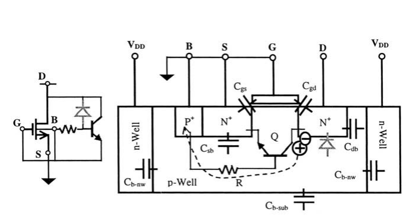

1. **DB** junction is reverse-biased all the way to its breakdown.
2. Avalance multiplication takes place and generates electron-hole pairs
3. Hole current flows into the ground via the *B-region** and build up a potential, VR, across the lateral parasitic resistance R
4. As VR increases, the **BS** junction turns on, eventually triggers the parasitic lateral NPN transistor Q (**DBS**)

### Negative ESD transient at I/O pad

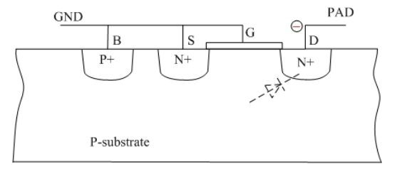

 The forward-biased parasitic diode, **BD**, will shunt the transient

> ggNMOS is commonly used in the GPIO provided by foundry, which alleviate the ESD design burden of customer.
>
> These GPIO is self-protective thanks to the ggNMOS.

## Reference

Introduction to Transmission Line Pulse (TLP), URL: [https://tools.thermofisher.com/content/sfs/brochures/TLP%20Presentation%20May%202009.pdf](https://tools.thermofisher.com/content/sfs/brochures/TLP%20Presentation%20May%202009.pdf)

VF-TLP and CDM differences, URL: [https://www.grundtech.com/app-note-vf-tlp-cdm-differences](https://www.grundtech.com/app-note-vf-tlp-cdm-differences)

ESD-Testing: HBM to very fast TLP URL: [https://www.thierry-lequeu.fr/data/ESREF/2004/Tut5.pdf](https://www.thierry-lequeu.fr/data/ESREF/2004/Tut5.pdf)

S. Kim et al., "Technology Scaling of ESD Devices in State of the Art FinFET Technologies," 2020 IEEE Custom Integrated Circuits Conference (CICC), 2020, pp. 1-6, doi: 10.1109/CICC48029.2020.9075899.

Barth, Jon. "TLP and VFTLP Testing of Integrated Circuit ESD Protection." (2015).
ESD protection for FinFET processes URL: [https://monthly-pulse.com/2021/01/19/esd-protection-for-finfet-processes/](https://monthly-pulse.com/2021/01/19/esd-protection-for-finfet-processes/)

Yuanzhong Zhou, D. Connerney, R. Carroll and T. Luk, "Modeling MOS snapback for circuit-level ESD simulation using BSIM3 and VBIC models," Sixth international symposium on quality electronic design (isqed'05), 2005, pp. 476-481, doi: 10.1109/ISQED.2005.81.

Charged Device Model (CDM) Qualification Issues - Expanded [[https://www.jedec.org/sites/default/files/IndustryCouncil_CDM_October2021_JEDECversion_September2022_rev1.pdf](https://www.jedec.org/sites/default/files/IndustryCouncil_CDM_October2021_JEDECversion_September2022_rev1.pdf)]
