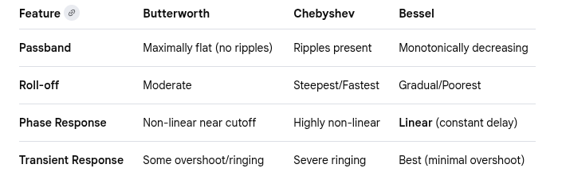
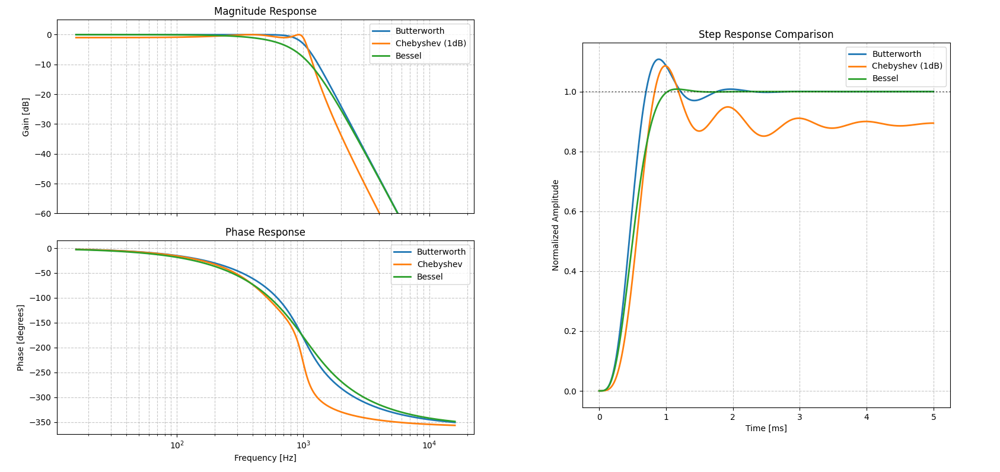
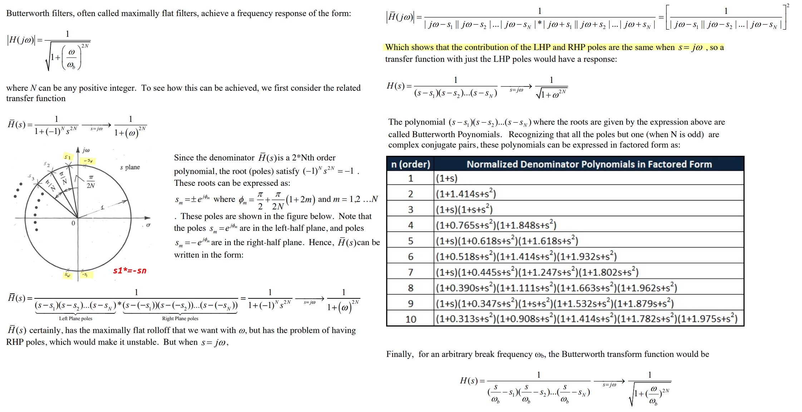
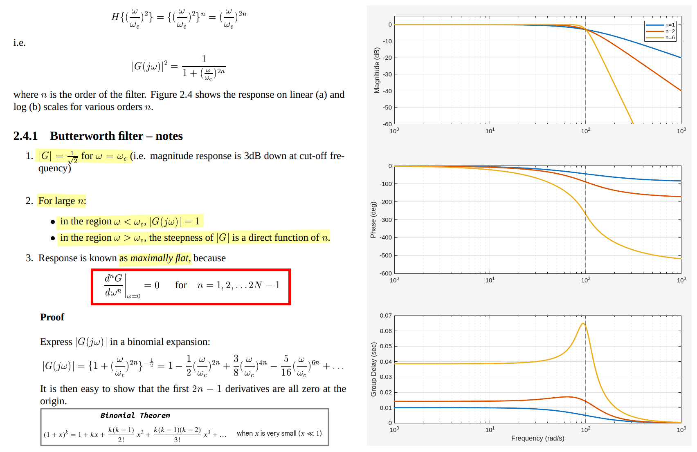
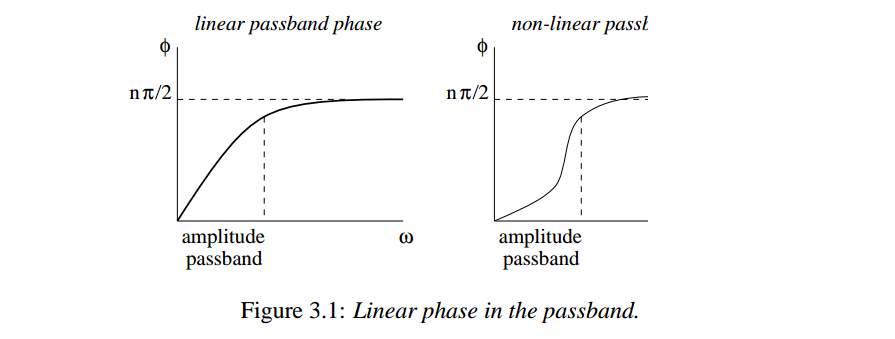
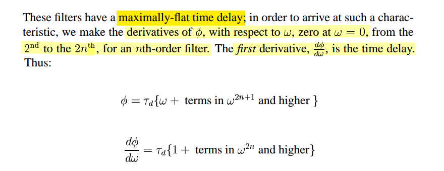
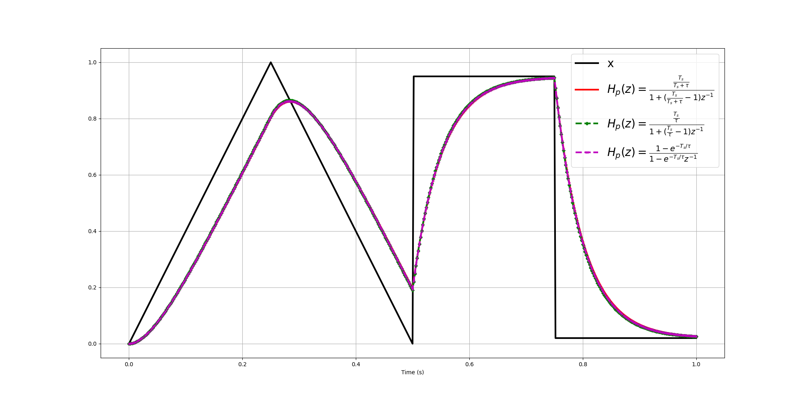
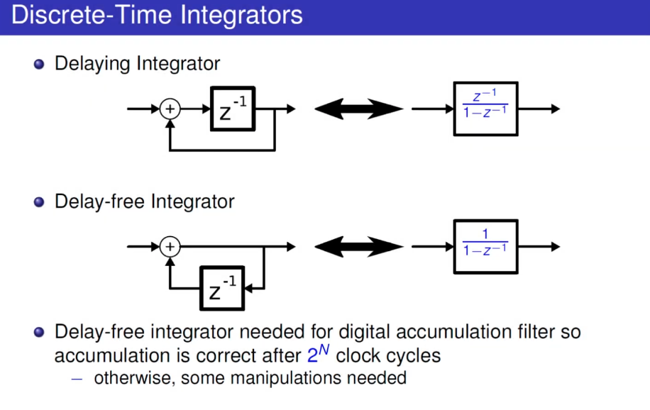

```python
import numpy as np
import matplotlib.pyplot as plt
from scipy import signal

# Parameters: 4th order filter with 1kHz cutoff
order = 4
w_cutoff = 2 * np.pi * 1000
w = np.logspace(2, 5, 1000) # Frequency range from 100Hz to 100kHz

# Generate Butterworth coefficients and frequency response
b_but, a_but = signal.butter(order, w_cutoff, analog=True)
w_but, h_but = signal.freqs(b_but, a_but, worN=w)

# Generate Chebyshev (1dB ripple) response
b_cheb, a_cheb = signal.cheby1(order, 1, w_cutoff, analog=True)
w_cheb, h_cheb = signal.freqs(b_cheb, a_cheb, worN=w)

# Generate Bessel response
b_bess, a_bess = signal.bessel(order, w_cutoff, analog=True)
w_bess, h_bess = signal.freqs(b_bess, a_bess, worN=w)

freqs = w / (2 * np.pi)

t = np.linspace(0, 0.005, 1000) # 5ms window

# Calculate Step Responses
t_but, y_but = signal.step((b_but, a_but), T=t)
t_cheb, y_cheb = signal.step((b_cheb, a_cheb), T=t)
t_bess, y_bess = signal.step((b_bess, a_bess), T=t)
```


## Butterworth Filters

> Butterworth Filters [[https://people.eecs.ku.edu/~demarest/212/Butterworth%20Filters.pdf](https://people.eecs.ku.edu/~demarest/212/Butterworth%20Filters.pdf)]
>
> Stephen Roberts, Signal Processing & Filter Design B3 option: *Lecture 2 - Frequency Selective Filters* [[https://www.robots.ox.ac.uk/~sjrob/Teaching/SP/l2.pdf](https://www.robots.ox.ac.uk/~sjrob/Teaching/SP/l2.pdf)]





```matlab
% Parameters
wc = 100;               % Cutoff frequency in rad/s
orders = [1, 2, 6];     % Orders to compare
w = logspace(0, 3, 1000); % Frequency range (1 to 1000 rad/s)

for n = orders
    % 1. Design Analog Filter (the 's' flag is critical)
    [b, a] = butter(n, wc, 's');
    
    % 2. Calculate Complex Frequency Response
    h = freqs(b, a, w);
    
    % 3. Calculate Group Delay
    % For analog filters, we manually differentiate phase: gd = -d(phi)/dw
    phase = unwrap(angle(h));
    gd = -diff(phase) ./ diff(w);
    
    % --- Plot Magnitude (dB) ---
    subplot(3,1,1);
    semilogx(w, 20*log10(abs(h)), 'LineWidth', 2, 'DisplayName', ['n=' num2str(n)]);
    hold on;
    
    % --- Plot Phase (Degrees) ---
    subplot(3,1,2);
    semilogx(w, phase * 180/pi, 'LineWidth', 2);
    hold on;
    
    % --- Plot Group Delay ---
    subplot(3,1,3);
    semilogx(w(1:end-1), gd, 'LineWidth', 2);
    hold on;
end

% Formatting
subplot(3,1,1)
ylabel('Magnitude (dB)'); grid on; xline(wc, '--r', 'HandleVisibility','off'); legend('show');
ylim([-60 5]);

subplot(3,1,2); ylabel('Phase (deg)'); grid on; xline(wc, '--r', 'HandleVisibility','off');

subplot(3,1,3); ylabel('Group Delay (sec)'); xlabel('Frequency (rad/s)'); 
grid on; xline(wc, '--r', 'HandleVisibility','off');
```


## Bessel Filters

> Stephen Roberts, Signal Processing & Filter Design B3 option: *Lecture 3 - Transient Response and Transforms* [[https://www.robots.ox.ac.uk/~sjrob/Teaching/SP/l3.pdf](https://www.robots.ox.ac.uk/~sjrob/Teaching/SP/l3.pdf)]

**Bessel filter** is often called **Bessel–Thomson filter** or simply **Thomson filter**






## Single-Pole LPF Algorithms

> Neil Robertson, Model a Sigma-Delta DAC Plus RC Filter [[https://www.dsprelated.com/showarticle/1642.php](https://www.dsprelated.com/showarticle/1642.php)]
>
> Jason Sachs, Ten Little Algorithms, Part 2: The Single-Pole Low-Pass Filter [[https://www.embeddedrelated.com/showarticle/779.php](https://www.embeddedrelated.com/showarticle/779.php)]
>
> —. Return of the Delta-Sigma Modulators, Part 1: Modulation [[https://www.dsprelated.com/showarticle/1517/return-of-the-delta-sigma-modulators-part-1-modulation](https://www.dsprelated.com/showarticle/1517/return-of-the-delta-sigma-modulators-part-1-modulation)]

- ***Derivatives Approximation*** ($H_p(s)=\frac{1}{s\tau +1}$)

  $$\begin{align}
  H_p(z)&=\frac{\frac{T_s}{T_s+\tau}}{1+(\frac{T_s}{T_s+\tau}-1)z^{-1}}\tag{EQ-0}\\
  H_p(z)&=\frac{\frac{T_s}{\tau}}{1+(\frac{T_s}{\tau}-1)z^{-1}}\tag{EQ-1}
  \end{align}$$

- ***Matched z-Transform (Root Matching)***
  $$
  H_p(z)=\frac{1-e^{-T_s/\tau}}{1-e^{-T_s/\tau}z^{-1}}\tag{EQ-2}
  $$
  EQ-2 is connected with EQ-1 by $1 - e^{-\Delta t/\tau} \approx \frac{\Delta t}{\tau}$



```python  
import numpy as np
import matplotlib.pyplot as plt
import scipy.signal


dt=0.002; tau=0.05

T=1
t = np.arange(0,T+1e-5,dt)
x = 1-np.abs(4*t-1)
x[4*t>2] = 0.95; x[t>0.75] = 0.02

alpha_derv = dt / (dt + tau)
alpha_derv_approx = dt / tau

yfilt_derv = scipy.signal.lfilter([alpha_derv], [1, alpha_derv - 1], x)
yfilt_derv_approx = scipy.signal.lfilter([alpha_derv_approx], [1, alpha_derv_approx - 1], x)

a1 = -np.exp(-dt/tau)
b0 = [1 + a1]
a = [1, a1]
y_filt_match = scipy.signal.lfilter(b0, a, x)

plt.figure(figsize=(20,10))
plt.plot(t, x, color='k', linewidth=3, label='x')
plt.plot(t, yfilt_derv, color='red', linewidth=3, label=r'$H_p(z)=\frac{\frac{T_s}{T_s+\tau}}{1+(\frac{T_s}{T_s+\tau}-1)z^{-1}}$')
plt.plot(t, yfilt_derv_approx, color='green', marker='D', linestyle='dashed',markersize=4, linewidth=3, label=r'$H_p(z)=\frac{\frac{T_s}{\tau}}{1+(\frac{T_s}{\tau}-1)z^{-1}}$')
plt.plot(t, y_filt_match, color='m', marker='x', linestyle='dashed',markersize=4, linewidth=3, label=r'$H_p(z)=\frac{1-e^{-T_s/\tau}}{1-e^{-T_s/\tau}z^{-1}}$')

plt.legend(loc='upper right', fontsize=20)
plt.grid(which='both');plt.xlabel('Time (s)');plt.show()
```


## Discrete-Time Integrators

> Qasim Chaudhari. Discrete-Time Integrators [[https://wirelesspi.com/discrete-time-integrators/](https://wirelesspi.com/discrete-time-integrators/)]
>
> David Johns (University of Toronto) "Oversampled Data Converters" Course (2019) [[https://youtu.be/qIJ2LORYmyA](https://youtu.be/qIJ2LORYmyA)]

Delaying Integrator

Delay-free Integrator



## Discrete-Time Differentiator

> Qasim Chaudhari. Design of a Discrete-Time Differentiator [[https://wirelesspi.com/design-of-a-discrete-time-differentiator/](https://wirelesspi.com/design-of-a-discrete-time-differentiator/)]

*TODO* &#128197;


## reference

Boris Murmann. EE315A VLSI Signal Conditioning Circuits

Stephen Roberts, Signal Processing & Filter Design B3 option [[https://www.robots.ox.ac.uk/~sjrob/Teaching/sp_course.html](https://www.robots.ox.ac.uk/~sjrob/Teaching/sp_course.html)]

Butterworth, Chebyshev & Bessel filters [[https://analogcircuitdesign.com/butterworth-and-chebyshev-filters/](https://analogcircuitdesign.com/butterworth-and-chebyshev-filters/)]

Qasim Chaudhari. FIR vs IIR Filters – A Practical Comparison [[https://wirelesspi.com/fir-vs-iir-filters-a-practical-comparison/](https://wirelesspi.com/fir-vs-iir-filters-a-practical-comparison/)]

—. Finite Impulse Response (FIR) Filters [[https://wirelesspi.com/finite-impulse-response-fir-filters/](https://wirelesspi.com/finite-impulse-response-fir-filters/)]

—. Why FIR Filters have Linear Phase [[https://wirelesspi.com/why-fir-filters-have-linear-phase/](https://wirelesspi.com/why-fir-filters-have-linear-phase/)]

—. Moving Average Filter [[https://wirelesspi.com/moving-average-filter/](https://wirelesspi.com/moving-average-filter/)]

—. Cascaded Integrator Comb (CIC) Filters – A Staircase of DSP. [[https://wirelesspi.com/cascaded-integrator-comb-cic-filters-a-staircase-of-dsp/](https://wirelesspi.com/cascaded-integrator-comb-cic-filters-a-staircase-of-dsp/)]

