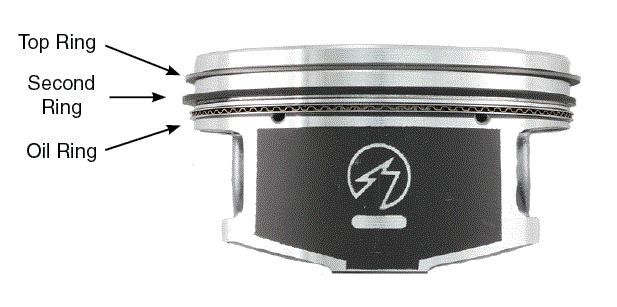

## 活塞环(Piston Ring)

## 马力 vs 扭矩

扭矩 = 力 x 力臂 (*T=FL*)

## 悬挂 (vehicle suspension)

## 变速箱 (transmission)

变速箱实现转速和扭矩的转换：低档扭矩大，转速慢； 高档扭矩小，转速慢

> 发动机小齿轮和变速箱大齿轮啮合处的力相同（力的作用是相互的），但是力臂不同，于是实现了扭矩转换

# 阿克曼转向几何 (Ackerman steering geometry)

## 缸内直喷 (direct injection)

- 歧管喷油
- 缸内直喷
  - 省油
  - 动力更强
  - 喷油时间自由度大

